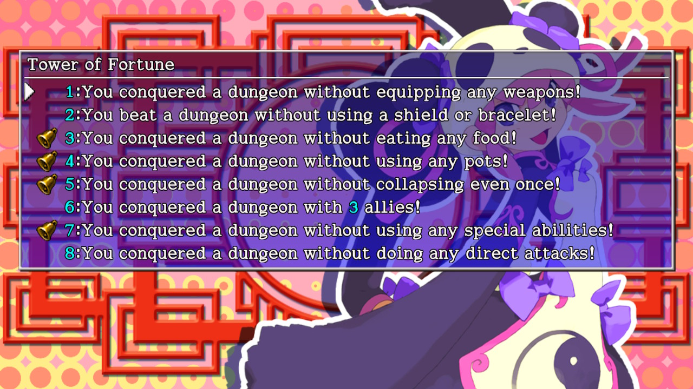

  

# Overview

Expert Badges are in-game achievements obtained by clearing certain dungeons with self-imposed restrictions.

The 8 challenges are unlocked after clearing the dungeon for the first time. 
※ Expert Badges can't be obtained for the first clear except for Underground Manor. 
※ PS Vita / Switch / Steam dungeons don't have Expert Badges.

The game won't notify you if you fail an Expert Badge condition during an adventure, so you'll have to keep track of your own actions.

Each section on this page assumes you're attempting one challenge at a time.

<ul class="quickLinksUL">
  <li><a href="#information">Information</a>
    <ul>
      <li><a href="#no-weapons">No Weapons</a></li>
      <li><a href="#no-food">No Food</a></li>
      <li><a href="#no-grass">No Grass</a></li>
      <li><a href="#no-scrolls">No Scrolls</a></li>
      <li><a href="#no-staves">No Staves</a></li>
      <li><a href="#no-talismans">No Talismans</a></li>
      <li><a href="#no-pots">No Pots</a></li>
      <li><a href="#no-collapse">No Collapsing</a></li>
      <li><a href="#no-abilities">No Abilities</a></li>
    </ul>
  </li>
  <li><a href="#dungeon-tips">Dungeon Tips</a>
    <ul>
      <li><a href="#tower-of-fortune">Tower of Fortune</a></li>
      <li><a href="#inori-cave">Inori Cave</a></li>
      <li><a href="#lost-well">Lost Well</a></li>
      <li><a href="#primordial-chasm">Primordial Chasm</a></li>
      <li><a href="#destiny's-descent">Destiny's Descent</a></li>
      <li><a href="#pitfall-of-life">Pitfall of Life</a></li>
      <li><a href="#bizarre-tower">Bizarre Tower</a></li>
      <li><a href="#onigiri-hollow">Onigiri Hollow</a></li>
      <li><a href="#heavenly-lake">Heavenly Lake</a></li>
      <li><a href="#gen's-turf">Gen's Turf</a></li>
      <li><a href="#old-road">Old Road</a></li>
      <li><a href="#underground-manor">Underground Manor</a></li>
    </ul>
  </li>
  <li><a href="#safe-actions">Safe Actions</a>
    <ul>
      <li><a href="#weapon-/-shield-/-bracelet">Weapon / Shield / Bracelet</a></li>
      <li><a href="#food">Food</a></li>
      <li><a href="#grass-/-scroll-/-staff-/-talisman-/-pot-(shared)">Grass / Scroll / Staff / Talisman / Pot (Shared)</a></li>
      <li><a href="#grass">Grass</a></li>
      <li><a href="#scroll">Scroll</a></li>
      <li><a href="#pot">Pot</a></li>
      <li><a href="#synthesis">Synthesis</a></li>
      <li><a href="#collapse">Collapse</a></li>
      <li><a href="#clear-with-3-allies">Clear with 3 allies</a></li>
      <li><a href="#direct-attacks">Direct attacks</a></li>
      <li><a href="#breaking-walls">Breaking walls</a></li>
    </ul>
  </li>
</ul>

# Information

### No Weapons

On the harder side, but easier to attempt than don't use direct attacks.

- Not allowed to equip a weapon.
    - Lack of weapon and runes means you can't win fights using direct attacks from around mid game.
- Retry until you find a Dodger Pot, and then collect Knockback Arrows.
- Differences between this and don't use direct attacks:
    - You can check every room early on without worrying about resources.
    - Getting sandwiched in a hallway isn't a game over.
    - Shields can be leveled up.
    - Other enemies can be defeated while collecting arrows using a Dodger Pot.
    - 2 bracelet resonance can't be activated, so powerful combinations can't be used:
        - Monster Detector + Can. Arm Bracelet = Snipe enemies.
        - Mojo Bracelet x 2 = Critical hits with arrows.
    - Gyazas can be defeated.

### No Food

Not as difficult as it sounds, thanks to a number of loopholes. 
Consider giving it a try if you happen to find a Diet Shield early on.

- Safe actions that can restore fullness:
    - Have a Bored Kappa monster throw a Peach at you.
    - Read a Fixer Scroll while you're starving.
    - Revive using Revival Grass, Undo Grass, or Wanderer Rescue.
    - Get hit by grass via Mutaikon, Bored Kappa, or Grass Kid monsters.

### No Grass

Kind of like a harder version of don't collapse.

- Difficult to synthesize type effective and status runes.
    - These runes can only be added by synthesizing weapons like Sky Splitter and Baffle Axe.
- Difficult to synthesize Anti-Fire on a shield.
    - Red Shield gains it as an added rune at Lv8.
- Main HP restoring items are Heal Pot, Fixer Scroll, and Heal Bracelet.
    - Revival Grass and Undo Grass can't be used, but Wanderer Rescue is safe.
- Strength can't be increased from eating Strength Grass.
    - Bored Kappa throwing the grass at you is safe.

### No Scrolls

Tricky to deal with monster houses, and nearly impossible to remove curses or seals.

- If an equipped item becomes cursed, it's nearly impossible to unequip it.
    - Exorcism, Fate, Earth, Plating, Fixer, Sale, Onigiri, Blessing, Curse scrolls can't be used.
    - Nymph Grass, Strip Trap, or Swordsman's special attack can be used.
    - Curse Trap can be used if you place all other items on the ground before stepping on it.
    - Night becomes extremely dangerous if you can't equip a torch.
- Stepping on a Curse Trap basically destroys an item.
    - If a Preservation Pot becomes sealed, you'll have to break the pot.
- Light, Oil, and Sanctuary scrolls can't be placed on the ground.
    - If you pick one of these up, place it down in a shop to avoid having it stick to the ground.
    - Otherwise, insert the scroll into a Presto, Sale, Dodger, Perceptive, Reflection, or Zen pot.
    - It's said that these scrolls sticking to the ground is safe in PS Vita / Switch / Steam versions.

### No Staves

Mostly limits single-target and movement options.

- Harder to steal from shops.
    - Pinning, Swap, Boring, Fort. staves can't be used.
- Difficult to use Dirk of Debts as a main weapon.
    - It's easy to run out of Gitan if you can't steal from shops.
- Tricky to escape situations where you're one hit away from collapsing.
    - Paralysis, Transient, etc. staves can't be used.
- Starting the floor in a monster house becomes quite dangerous.
    - It's not possible to escape using Decoy, Pinning, Swap staves.
- Use talismans and arrows if you have weak equipment.

### No Talismans

Among the easiest challenges, since scrolls and staves are plenty to deal with enemies.

- Difficult to level up monsters early on.
    - Hard to get an early start by hunting Gitan Mamel.
    - Hard to perform Nigiri Morph Factory near the beginning to increase max fullness.

### No Pots

The hardest challenge among item restrictions, and makes you aware how powerful pots are.

- It's not possible to expand your inventory size using Preservation Pots.
    - You'll have to think more carefully about what items you keep and discard.
    - Plan ahead and choose items that will help in upcoming situations.
- Mixer synthesis is the only way to synthesize items.
    - Synthesis ingredients take up inventory space until you reach the next Mixer floor range.
- You can't prevent food from spoiling.
    - Large and Huge onigiri are likely to be grilled or spoiled.
    - Peaches ripen and spoil if they're not inside a pot as you advance floors.
    - Ideal to perform Nigiri Morph Factory to increase max fullness to 200.
- Zen, Dodger, and Heal pots can't be used to counter late game threats.
    - Cranky Tank and Abyssal Dragon can be a nightmare in particular.
- Dodger Pot can't be used to collect arrows from Boy Cart monsters.
    - HP regeneration slows as your max HP increases, so arrows are key to avoiding damage.
    - Use Tri-direction rune, Mojo Bracelet for critical hits, or Super status to avoid damage.

### No Collapsing

Essentially an easier version of don't use grass. Requires careful play and some amount of luck to avoid accidents.

- Revival Grass can't be used to restore HP, strength, or fullness.
- Revival Grass, Undo Grass, and Wanderer Rescue can't be used.
    - Basically, this means you can't relax until you clear the dungeon.

### No Abilities

Avoid night and progress through the dungeon during daytime. 
Old Road is the only dungeon that doesn't allow carry-in items for this challenge.

- Abilities can't be used to rush stairs or counter strong threats.
    - Stairlight can't be used to reveal the location of the stairs.
    - Horrabbit, Terrabbit, Dozikon, Mesmerikon, Gyaza, Pumphantasm are major threats.
    - Pumphantasms detect and move toward Shiren from anywhere on the current floor.
- Powerful Bracelets lower the difficulty.
    - Monster Detector or Monsterphobic help at night.
    - Time Stop Bracelet nearly ensures success, but Time Switch Traps can cause issues.

# Dungeon Tips

### Tower of Fortune

#### Expert Badges

1. You conquered a dungeon without equipping any weapons!
2. You beat a dungeon without using a shield or bracelet!
3. You conquered a dungeon without eating any food!
4. You conquered a dungeon without using any pots!
5. You conquered a dungeon without collapsing even once!
6. You conquered a dungeon with 3 allies!
7. You conquered a dungeon without using any special abilities!
8. You conquered a dungeon without doing any direct attacks!

#### Strategy

Carry-in items are allowed, so none of these pose a challenge. 
Expert Badges can still be obtained when you start from Sparrow's Inn. (Tower of Miracles 4F)

※ DS version has a bug where Expert Badges can't be obtained for this dungeon.

### Inori Cave

#### Expert Badges

1. You conquered a dungeon without using any grass!
2. You conquered a dungeon without using any scrolls!
3. You conquered a dungeon without using any staves!
4. You conquered a dungeon without using any talismans!
5. You conquered a dungeon without using any pots!
6. You conquered a dungeon without collapsing even once!
7. You conquered a dungeon with 3 allies!
8. You conquered a dungeon without doing any direct attacks!

#### Strategy

7. Bring Koharu (Have her turn into an item), Okon, and Tao. 
Equip a Time Stop Bracelet and progress during daytime. 
Cranky Tank and Ultra Gazer from 90F is the danger zone. 
Throw an Extinction Scroll at Ultra Gazer, and prepare 10 floors worth of Zen Pot uses.

Carry-in items are allowed, so none of these pose a challenge.

※ Clearing the dungeon using a Magic Circle doesn't grant Expert Badges.

### Lost Well

#### Expert Badges

1. You conquered a dungeon without eating any food!
2. You conquered a dungeon without using any grass!
3. You conquered a dungeon without using any scrolls!
4. You conquered a dungeon without using any staves!
5. You conquered a dungeon without using any talismans!
6. You conquered a dungeon without using any pots!
7. You conquered a dungeon without collapsing even once!
8. You conquered a dungeon without using any special abilities!

#### Strategy

7. Bring Juicy Peaches for floors where limit broken monsters appear toward the end.

8. Equip a Time Stop Bracelet and progress during daytime.

Most are easily obtained by equipping a Time Stop Bracelet and rushing stairs at night. 
Carry-in items are allowed, so none of these pose a challenge.

### Primordial Chasm

#### Expert Badges

1. You conquered a dungeon without equipping any weapons!
2. You conquered a dungeon without using any grass!
3. You conquered a dungeon without using any scrolls!
4. You conquered a dungeon without using any staves!
5. You conquered a dungeon without using any talismans!
6. You conquered a dungeon without using any pots!
7. You conquered a dungeon without collapsing even once!
8. You conquered a dungeon without doing any direct attacks!

#### Strategy

1. Knockback Arrows, Monster Detector, and Can. Arm Bracelet are key. 
Level up a Boy Cart on 19F and collect arrows using a Dodger Pot. 
Gyaza, Mixer, and Flamebird are major threats.

2. No extra lives, and can't synthesize type effective and status runes easily. 
Steal any type effective and status weapons you find in shops. 
Runes that increase max HP are hard to synthesize, so fixed damage attacks can be painful. Prepare items in advance against late game Dragons and Pop Tanks.

3. Nearly impossible to remove curses or seals, so be wary of Cruse Trap and Curse Sister. Equipping weapons, shields, or bracelets without Nymph Grass gets riskier as you progress. Nixer and Extinction scrolls can't be used, so prepare other items for late game threats.

4. Stealing is difficult, so don't use Dirk of Debts as your main weapon. 
Staves can't save you if you're one hit away from collapsing, so try to avoid damage.

5. This shouldn't pose a challenge.

6. Preservation Pots can't be used, and synthesis ingredients take up space. 
Choose what to keep and what to discard carefully, and plan ahead. 
The items you find before the first Mixer zone often makes or breaks the run. 
Key items include Breeze Blade, Diet Shield, Mojo Bracelet, and Monster Detector.

7. Don't take needless risks.

8. Early game is extremely difficult, but mid to late game is similar to don't use weapons. It can take 100+ attempts before you even make it to the arrow collection floor range. Weaken a Karakuroid on 6\~8F and have it create arrow traps, find a Dodger Pot by the time you reach 19F and level up a Boy Cart into a Strong Cart. Don't discard the Dodger Pot, since you'll want to collect more arrows from Strong Cart on 51F so that you have at least 1000 going into late game. 
Shields can't be leveled up, so choose runes carefully.

### Destiny's Descent

#### Expert Badges

1. You conquered a dungeon without equipping any weapons!
2. You conquered a dungeon without using any scrolls!
3. You conquered a dungeon without using any staves!
4. You conquered a dungeon without using any talismans!
5. You conquered a dungeon without using any pots!
6. You conquered a dungeon without collapsing even once!
7. You conquered a dungeon without synthesizing!
8. You conquered a dungeon without doing any direct attacks!

#### Strategy

### Pitfall of Life

#### Expert Badges

1. You conquered a dungeon without equipping any weapons!
2. You beat a dungeon without using a shield or bracelet!
3. You conquered a dungeon without eating any food!
4. You conquered a dungeon without using any talismans!
5. You conquered a dungeon without using any pots!
6. You conquered a dungeon without collapsing even once!
7. You conquered a dungeon without doing any direct attacks!
8. You conquered a dungeon with your max HP at over 250!

#### Strategy

### Bizarre Tower

#### Expert Badges

1. You conquered a dungeon without eating any food!
2. You conquered a dungeon without using any grass!
3. You conquered a dungeon without using any scrolls!
4. You conquered a dungeon without using any staves!
5. You conquered a dungeon without using any talismans!
6. You conquered a dungeon without using any pots!
7. You conquered a dungeon without collapsing even once!
8. You conquered a dungeon without synthesizing!

#### Strategy

### Onigiri Hollow

#### Expert Badges

1. You conquered a dungeon without using any grass!
2. You conquered a dungeon without using any scrolls!
3. You conquered a dungeon without using any staves!
4. You conquered a dungeon without using any talismans!
5. You conquered a dungeon without using any pots!
6. You conquered a dungeon without collapsing even once!
7. You conquered a dungeon without doing any direct attacks!
8. You conquered a dungeon without breaking a wall!

#### Strategy

### Heavenly Lake

#### Expert Badges

1. You conquered a dungeon without equipping any weapons!
2. You conquered a dungeon without using any grass!
3. You conquered a dungeon without using any scrolls!
4. You conquered a dungeon without using any staves!
5. You conquered a dungeon without using any talismans!
6. You conquered a dungeon without using any pots!
7. You conquered a dungeon without collapsing even once!
8. You conquered a dungeon without doing any direct attacks!

#### Strategy

### Gen's Turf

#### Expert Badges

1. You conquered a dungeon without equipping any weapons!
2. You beat a dungeon without using a shield or bracelet!
3. You conquered a dungeon without using any grass!
4. You conquered a dungeon without using any scrolls!
5. You conquered a dungeon without using any staves!
6. You conquered a dungeon without using any talismans!
7. You conquered a dungeon without using any pots!
8. You conquered a dungeon without collapsing even once!

#### Strategy

### Old Road

#### Expert Badges

1. You conquered a dungeon without eating any food!
2. You conquered a dungeon without using any grass!
3. You conquered a dungeon without using any scrolls!
4. You conquered a dungeon without using any staves!
5. You conquered a dungeon without using any talismans!
6. You conquered a dungeon without using any pots!
7. You conquered a dungeon without collapsing even once!
8. You conquered a dungeon without using any special abilities!

#### Strategy

### Underground Manor

#### Expert Badges

1. You conquered a dungeon without eating any food!
2. You conquered a dungeon without using any grass!
3. You conquered a dungeon without using any scrolls!
4. You conquered a dungeon without using any staves!
5. You conquered a dungeon without using any talismans!
6. You conquered a dungeon without using any pots!
7. You conquered a dungeon without collapsing even once!
8. You conquered a dungeon without doing any direct attacks!

#### Strategy

 

# Safe Actions

○ : Safe, × : Unsafe, ? : Unverified

#### Weapon / Shield / Bracelet

○ Equip a torch. (No weapons) 
× Equip an item thrown by a Bored Kappa.

#### Food

○ Eat grass. 
○ Read a Fixer Scroll when you're starving to replenish fullness. 
○ Replenish fullness by reviving using Revival Grass, Undo Grass, or Wanderer Rescue. 
○ Throw a food item. 
○ Replenish fullness by getting hit by a peach thrown by a Bored Kappa. 
○ Replenish fullness by throwing a peach at a Bored Kappa and getting hit by the returned peach. 
× Eat an onigiri, peach, or Squid Sushi Scroll.

#### Grass / Scroll / Staff / Talisman / Pot (Shared)

○ Pick up the item. 
○ Place the item on the ground. (Selling the item is also safe) 
○ Insert the item into a pot. (Excluding no pots) 
○ Throw a pot containing the item. (Excluding no pots) 
○ Selecting the item when reading a scroll. (Excluding no scrolls) 
○ Get hit by an item thrown by a Bored Kappa or Grass Kid. 
○ Perform Mixer synthesis using a Cloned status Mixer and a Bored Kappa monster. 
　(Example: Bored Kappa threw Sleepy Grass at a Cloned Mixer and was synthesized) 
○ N'dubba monster revealing itself when it was disguised as restricted category item. 
○ Identify a restricted category item using an Identify Bracelet or Special Onigiri effect. 
× Throw the item. 
× Throw a N'dubba disguised as a restricted category item. 
× Being hypnotized by a Gazer and using the item. 
× Set the item. (No staves) (PS Vita version is safe)

#### Grass

○ Get hit by grass thrown by a Mutaikon. 
○ Get hit by grass thrown or spread by a Grass Kid. 
○ Another monster gets hit by grass thrown or spread by a Grass Kid. 
× Be revived by the Boy's Sister NPC. (She has you use Warp Grass)

#### Scroll

○ Write on a Blank Scroll. 
○ Show a Recommend. Letter to a Shopkeeper. 
○ Use a Waterwalk Bracelet to turn a scroll into a Wet Scroll. 
? Show a Commend. Letter to a Shopkeeper. 
× Have a scroll stick to the ground. (Includes tripping, enemy drop, and Bored Kappa) (PS Vita version is safe) 
× Show an Identify Scroll to a Shopkeeper.

#### Pot

○ Get hit by a pot thrown by a Bored Kappa. (Only if the pot has no effect when shattered) 
○ Hide inside a pot after getting hit by a Hide Pot thrown by a Bored Kappa. 
○ 4-2-8 Pot explodes after being thrown by a Bored Kappa. 
○ Use the Pot Party ability. 
○ Monster falling into an abyss or getting submerged after using Pot Party. 
× 4-2-8 Pot explodes as a result of tripping. 
× Scoopie shoveling dirt into a pot. 
× Bored Kappa throwing an item into a pot. 
× "Open" type pot (size 1+) shattering after being thrown by a Bored Kappa. (PS Vita version is safe) 
× Black Hole Pot shattering after being thrown by a Bored Kappa. (PS Vita version is safe)

#### Synthesis

○ Insert an item into a Synthesis Pot. (As long as nothing is synthesized) 
× Synthesize staves. 
× Mixer monster swallows an item. (Reported that it's safe if nothing is synthesized)

#### Collapse

× Reviving using Revival Grass or Undo Grass. 
× Reviving using Wanderer Rescue. 
× Being revived by the Boy's Sister NPC.

#### Clear with 3 allies

○ Clear the dungeon while Koharu is transformed into equipment.

#### Direct attacks

○ Defeat enemies using abilities at night. 
○ Destroy a wall using a pickaxe type weapon. 
○ Reflect damage using a Counter Shield. 
○ Reflect damage using a shield with the Retribution rune. 
○ An ally attacks an enemy. 
○ Deal fire damage using Burning Blade or a Flame Shot type rune. 
× Using a direct attack when hypnotized or inflicted with Berserk status.

#### Breaking walls

○ Pop Tank, Explochin, or Sweet Nut explosions destroying walls. 
○ Get knocked into a wall by a Yanpii tackle. 
○ Show a Recommend. Letter to a Shopkeeper to reveal an elite store. 
○ Give Digger Don a pickaxe weapon to have him dig walls. 
× Dig walls using a pickaxe type weapon or Boring Staff. 
× Destroy a wall that was created by a Fort. Staff. 
× Reveal an elite store by punching the entrance. 
× Destroy a wall using an Explosion or Big Explosion trap. 
× Destroy a wall by throwing a 4-2-8 Pot and creating an explosion. 
× Destroy a wall using an explosion from an Explosion Bracelet.
