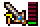

## Overview

This page provides information for Shiren 5's various gameplay systems and mechanics.

<ul class="quickLinksUL">
  <li><a href="#shiren">Shiren</a>
    <ul>
      <li><a href="#experience-points">Experience Points</a></li>
      <li><a href="#necklace-abilities">Necklace Abilities</a></li>
      <li><a href="#fullness">Fullness</a></li>
      <li><a href="#status-conditions">Status Conditions</a></li>
      <li><a href="#super-status">Super Status</a></li>
      <li><a href="#hp-regeneration">HP Regeneration</a></li>
      <li><a href="#damage-calculation">Damage Calculation</a></li>
      <li><a href="#accuracy">Accuracy</a></li>
    </ul>
  </li>
  <li><a href="#item">Item</a>
    <ul>
      <li><a href="#point-card">Point Card</a></li>
      <li><a href="#resonance">Resonance</a></li>
      <li><a href="#equipment-growth">Equipment Growth</a></li>
      <li><a href="#blessing-/-curse-/-seal">Blessing / Curse / Seal</a></li>
      <li><a href="#synthesis">Synthesis</a></li>
      <li><a href="#new-items">New Items</a></li>
      <li><a href="#catstones">Catstones</a></li>
    </ul>
  </li>
  <li><a href="#dungeon">Dungeon</a>
    <ul>
      <li><a href="#allies">Allies</a></li>
      <li><a href="#npcs">NPCs</a></li>
      <li><a href="#dungeon-features">Dungeon Features</a></li>
      <li><a href="#monster-house">Monster House</a></li>
      <li><a href="#traps">Traps</a></li>
      <li><a href="#day-/-night">Day / Night</a></li>
      <li><a href="#monsters">Monsters</a></li>
      <li><a href="#monster-auras">Monster Auras</a></li>
      <li><a href="#monster-spawns">Monster Spawns</a></li>
    </ul>
  </li>
  <li><a href="#facilities">Facilities</a>
    <ul>
      <li><a href="#equipment-tags">Equipment Tags</a></li>
      <li><a href="#storehouse">Storehouse</a></li>
      <li><a href="#tanuki-passwords">Tanuki Passwords</a></li>
      <li><a href="#sparrow's-shuttle">Sparrow's Shuttle</a></li>
    </ul>
  </li>
  <li><a href="#other">Other</a>
    <ul>
      <li><a href="#adventure-footprints">Adventure Footprints</a></li>
      <li><a href="#expert-badges">Expert Badges</a></li>
      <li><a href="#version-exclusives">Version Exclusives</a></li>
    </ul>
  </li>
</ul>

## Shiren

### Experience Points

The amount of experience points needed to level up. 
→ <a href="/other/experience-points">Experience Points Table</a>

### Necklace Abilities

Special attacks that can only be used at night. 
→ <a href="/system/necklace-abilities">Abilities</a>

### Fullness

Shiren has a fullness gauge (FG), and takes 1 damage per turn once it reaches 0. 
Fullness decreases by 1 every 10 turns, so periodically eat food to replenish fullness.

   

### Status Conditions

States that affect a character's behavior in various ways. 
→ <a href="/system/status-conditions">Status Conditions</a>

  

### Super Status

Shiren's status will change as you defeat enemies during an adventure.

- Regular → Awakened-ish → Super

 

  

#### Super Status

- Direct attacks can randomly inflict Asleep, Confused, Blind, Paralyzed, Sealed, Berserk, or Shadow Bound status.
- An additional bonus occurs every time you defeat 10 enemies:
    - Boost attack (3 floors)
    - Boost defense (3 floors)
    - Gain Swift status (50 turns / 100 turns from Shiren's perspective)
    - Gain Tinkerer status (2 floors)
    - Gain Fast Striking status (50 turns)
    - Gain Precise status (50 turns)
- Of these effects, attack and defense boosts stack up to 8 stages.

#### Deactivation

Super status can deactivate due to the following:

- Become afflicted by an ailment.
- Step on a trap.
- Hunger message is displayed. (20 and 10 remaining fullness)
- 0 fullness.
- HP display is red. (Current HP is &lt; 30% of max)

※ The "0 fullness" and "HP display is red" conditions perform a check every turn.

### HP Regeneration

Shiren's HP regenerates as he walks or steps in place (A+B). (HP won't regenerate when any other action is performed)

  

HP regeneration speed is linked to max HP, and slows down as your max HP increases. 
Turns that restore 0 HP are introduced from 102 HP, and increase in frequency until you finally only restore 1 HP every 2 turns.

|Max HP | HP Restored  | Interval | Per Turn|
|-|-|-|-|
|15 ~ 50  | 1,2 |  2T  |1.50|
|51 ~ 66  | 1,1,1,2 |  4T | 1.25|
|96 ~ 101 | 1  | 1T | 1.00|
|102 |  1,1,1... 0|  50T |  0.98|
|104 |  1,1,1... 0 | 23T |  0.96|
|124  | 1,1,1,0  | 4T | 0.75|
|200 ~ |  1,0  | 2T | 0.50|

Source: [シレン4、シレン5　自然回復量　【データ】 - 24番目の風来日記](http://shiren2424.blog.fc2.com/blog-entry-127.html)

### Damage Calculation

[ Attack * Variance / 100 - Defense ] * Type Multiplier

The formula aside, the main things to note:

- The formula isn't the same as necklace ability damage calculation.
- Attack involves logarithm, so the latter has a smaller effect between increasing by 1 at low level / strength vs. increasing by 1 at high level / strength.
- If strength is ≥ 8, strength is halved and decimals are dropped, so odd number values don't increase damage. (Example: 10 strength is the same as 11 strength)
- Equipment AP and DP are multiplied by about 0.6, so small increases in upgrade value aren't very noticeable.

Source: [ダメージ計算 - 組長式(アーカイブ)](https://web.archive.org/web/20111228071625/http://kumicyou.sakura.ne.jp/shiren-ds-5/system-damage.html)

### Accuracy

#### Direct Attacks

92% without a weapon.

Accuracy increases while equipped with a leveled up weapon. The Redeeming rune raises accuracy to 100% for 1 hit after 2 misses.

|Weapon |Level  |Lv1\~3   |Lv4\~5  | Lv6\~7  | Lv8|
|-|-|-|-|-|
|Accuracy | 92%  | 93% |  94%  | 95%|

#### Projectiles

84%

#### Monster Direct Attacks

88% under normal circumstances.

Accuracy decreases if a Spry Shield is equipped. (Shiren's evasion increases) 
The Agile rune is equivalent to Spry Shield Lv1, so it's 78%.

<table>
  <tr>
    <th>Spry Shield</th>
    <th>Lv1</th>
    <th>Lv2</th>
    <th>Lv3</th>
    <th>Lv4</th>
    <th>Lv5</th>
    <th>Lv6</th>
    <th>Lv7</th>
    <th>Lv8</th>
  </tr>
  <tr>
    <th>Accuracy</th>
    <td>78%</td>
    <td>75%</td>
    <td>72%</td>
    <td>69%</td>
    <td>66%</td>
    <td>63%</td>
    <td>60%</td>
    <td>57%</td>
  </tr>
</table>

Source: [攻撃の命中率 - 組長式(アーカイブ)](http://web.archive.org/web/20141231031541/http://kumicyou.sakura.ne.jp/shiren-ds-5/system-hit.html)

## Item

### Resonance

Certain weapons, shields, and bracelets activate special effects when equipped at the same time. 
→ <a href="/system/resonance">Resonance</a>

  

### Equipment Growth

Weapons and shields earn growth experience points when you defeat enemies using direct attacks. For the sake of keeping the term short, this site refers to it as skill points.

※ You don't earn skill points if you defeat enemies using projectiles, abilities, magic bullets, etc.

  

Notes:

- The item's name changes, and strength, upgrade limit, and rune count increase. (Example: Katana 6 atk / 8 limit → Good Katana 7 atk / 15 limit)
- Weapons or shields can gain runes through leveling up, and have a maximum level of 8. (Example: Beast Fang gains Rustproof at Lv5)
- Skill points can't be seen, and each monster grants a predetermined amount. (Example: Mamel = 1 point)
- Generally, stronger / higher level monsters offer more skill points. (Example: Pit Mamel = 2 points, Cave Mamel = 100 points)
- Equipment levels up once the skill points total reaches the item's assigned threshold. (Example: Katana → Good Katana once skill point total reaches 300 points)

Check the [Monsters](/system/monsters) page for monster skill point values.

### Blessing / Curse / Seal

Items can be blessed, cursed, or sealed. (Excluding arrows, rocks, and talismans) 
They can occasionally be found on the ground with these statuses, and you won't 
be able to determine an unidentified items's status until you use it. 

Once an item is identified, these statuses will be shown as an icon:

<table class="tableWithImages">
  <tr>
    <th>Icon</th>
    <th>Type</th>
    <th>Basic Effect</th>
  </tr>
  <tr>
    <td></td>
    <td>Blessing</td>
    <td>Boosted effect.</td>
  </tr>
  <tr>
    <td></td>
    <td>Curse</td>
    <td>Can't unequip.</td>
  </tr>
  <tr>
    <td></td>
    <td>Seal</td>
    <td>Unable to be used.</td>
  </tr>
</table>

The effects of these statuses differ based on item category. (See table below)

- Gaining a status
    - Blessing: Blessing Scroll, Blessing Pot, night monster drop.
    - Curse: Curse Trap, Curse Girl special attack, Imabikiso, Curse Scroll, Curse Pot.
    - Seal: Curse Trap, item stolen by Bad Zalokleft (Lv1~3), Imabikiso, Curse Scroll, Curse Pot.
- Removing a status
    - Curse / Seal: Exorcism Scroll, Exorcism Pot, Fate Scroll, Earth Scroll, Plating Scroll, bless the item, Curse Breaker (Nekomaneki Village or wandering NPC).
    - Anti-Crs. Bracelet protects an item from getting cursed or sealed.

Effect details by item category:

|Item | Blessed |  Cursed  |Sealed|
|-|-|-|-|
|Weapon | Increased attack (Chance to wear off) | Can't unequip |  Upgrade value and runes are nullified, doesn't gain skill points|
|Shield | Increased defense (Chance to wear off) | Can't unequip |  Upgrade value and runes are nullified, doesn't gain skill points|
|Bracelet | Can't be cursed or sealed (Chance to wear off) | Can't unequip |  Bracelet's effect is nullified|
|Arrow, Rock |  -  | - |  -|
|Staff |  Doubled effect (Chance to wear off) | - |  Unable to be used, no effect if thrown|
|Talisman | - |  - |  -|
|Scroll | Reusable (Some exceptions *1) |  - |  Unable to be used|
|Grass |  Doubled effect (Some exceptions *1) |  -  | Unable to be used, no effect if thrown|
|Pot |  Can't be cursed, sealed, pecked, turned into onigiri (Chance to wear off) | -   |Can't use [Insert] or [Open] commands, can't be filled by Bored Kappa or Scoopie|
|Food | Doubled effect, peaches gain a bonus | - |  Unable to be used|
|Torch  | Doubled duration | -   |Can't be equipped|
|Point Card | Gain double points (Wears off after 1 use)|   -  | Unable to be used|

*1 Exceptions:

- Scroll
    - Extraction Scroll - Blesses all extracted items, but can't be reused.
- Grass
    - Upgrade Seed - Effect is active for the duration of the current floor. (Normally 100 turns)
    - Revival Grass, Undo Grass, Repeat Grass - Reusable.

### Synthesis

Synthesize weapons and shields to merge special abilities, upgrade value, and runes, and combine staves to add their use counts together.

  

#### Synthesis Effects

Weapon, Shield:

- First item is the base. Runes and upgrade value of subsequent items are added to it. (Example: Katana first, Scythe+1 second → Katana+1 with Anti-Plant rune)
- Each item has a "rune count", and no more runes can be added once you reach the limit. (Example: Katana has 4 rune slots)
- Innate runes get stronger as the item levels up, but runes are always equal to Lv1 effect. (Example: Lv4 Scythe = 210%, Katana with Anti-Plant rune = 135%) → [Rune Multipliers](/system/synthesis-runes#multipliers)

Staves:

- Adds use counts together. Can only combine same name staves. (Example: Knockback Staff[3] first, Knockback Staff[4] second → Knockback Staff[7])

#### Different Category Synthesis

Normally, you can only synthesize weapons with weapons, and shields with shields. However, certain different category items can be synthesized by Mixers to add runes.

Example: Weapon + Dragon Grass = Anti-Dragon rune. → Check [Rune List](/system/runes#rune-list) for all possible combinations.

#### Synthesis Methods

Synthesis Pot:

  

- Insert same category items to synthesize them. (Weapons, Shields, or Staves)
- Insert an identified staff last to result in an identified staff.

Mixer:

  

- Throw items at a Mixer to synthesize them. (Different category items can be synthesized)
- Mixers won't eat items when they're afflicted with certain [status conditions](/system/status-conditions).
    - Will eat: Any status conditions besides the ones listed below.
    - Won't eat: Napping, Asleep, Sound Asleep, Sealed, Paralyzed, S-Paralyzed, Onigiri, Tottering.
- Mixers can only eat a set number of items, based on their level. 
(Example: Mixer = 2, Mixermon = 3, Mixergon = 4, Mixerdon = 5)
- Throw an Expand Seed to increase the number of items a Mixer can eat by 1. (Max: 8) (Example: Throw an Expand Seed at a Mixer, then synthesize 3 items instead of 2)
- Mixers turn toward the direction the item came from when they eat an item.

#### Blessed, Cursed, Sealed, Identified

Synthesized items generally take on the status of the item that was inserted or thrown last. (Example: Remove a seal or curse from a weapon by synthesizing the weapon with an Iron Arrow)

※ Mixer synthesis has varied priority based on item category, so you may get unexpected results.

#### Mixer Synthesis Priority

Priority after throwing a weapon:

- Weapon > grass > scroll > staff > talisman or arrow > pot > bracelet. (This remains true even if items were thrown in a different order)

Example: If you throw a weapon → staff (sealed) → grass, the resulting weapon will be sealed, because grass has a higher priority than staves.

It's fine to throw non-equipment category items before the weapon or shield.

#### Common Mistakes

- Threw a Synthesis Pot while a Can. Arm Bracelet was equipped / Dracon Grass was active.
    - Check equipped bracelets and current status beforehand.
- Main weapon vanished after being thrown at a Napping Mixer.
    - Mixers function differently in Shiren 4 and 5, so always wake them up first.
- Stepped on an Explosion Trap / Pit Trap while walking over to the synthesized item.
    - Perform direct attacks over tiles to check for traps while approaching the item.
- Threw a weapon → Angel Seed → shield → Angel Seed, but only the weapon gained a rune.
    - Items that can be used to add runes to both weapons and shields always get synthesized onto the first weapon or shield, so use 2 different Mixers.
- A Pop Tank monster destroyed the item after synthesizing.
    - Use the Scout command to check for Pop Tank monsters on floors where they appear.
- The resulting staff became sealed after combining same name staves.
    - Swing the staff you to intend to synthesize last to check if it's sealed.

### New Items

Secret Pots located in the basement of Hotel Nekomaneki can be used to add new abilities to items. 
→ [New Items](/system/new-items)

  

### Catstones

### Point Card

## Dungeon

### Allies

### NPCs

### Dungeon Features

### Monster House

### Traps

### Day / Night

### Monsters

### Monster Auras

### Monster Spawns

## Facilities

### Equipment Tags

### Storehouse

### Tanuki Passwords

### Sparrow's Shuttle

## Other

### Adventure Footprints

### Expert Badges

### Version Exclusives
