## Overview

This page provides information for Shiren 5's various gameplay systems and mechanics.

<ul class="quickLinksUL">
  <li><a href="#shiren">Shiren</a>
    <ul>
      <li><a href="#experience-points">Experience Points</a></li>
      <li><a href="#necklace-abilities">Necklace Abilities</a></li>
      <li><a href="#fullness">Fullness</a></li>
      <li><a href="#status-conditions">Status Conditions</a></li>
      <li><a href="#super-status">Super Status</a></li>
      <li><a href="#hp-regeneration">HP Regeneration</a></li>
      <li><a href="#damage-calculation">Damage Calculation</a></li>
      <li><a href="#accuracy">Accuracy</a></li>
    </ul>
  </li>
  <li><a href="#item">Item</a>
    <ul>
      <li><a href="#point-card">Point Card</a></li>
      <li><a href="#resonance">Resonance</a></li>
      <li><a href="#equipment-growth">Equipment Growth</a></li>
      <li><a href="#blessing-/-curse-/-seal">Blessing / Curse / Seal</a></li>
      <li><a href="#synthesis">Synthesis</a></li>
      <li><a href="#new-items">New Items</a></li>
      <li><a href="#catstones">Catstones</a></li>
      <li><a href="#friendship-licenses">Friendship Licenses</a></li>
    </ul>
  </li>
  <li><a href="#dungeon">Dungeon</a>
    <ul>
      <li><a href="#allies">Allies</a></li>
      <li><a href="#npcs">NPCs</a></li>
      <li><a href="#dungeon-features">Dungeon Features</a></li>
      <li><a href="#monster-house">Monster House</a></li>
      <li><a href="#traps">Traps</a></li>
      <li><a href="#day-/-night">Day / Night</a></li>
      <li><a href="#monsters">Monsters</a></li>
      <li><a href="#monster-auras">Monster Auras</a></li>
      <li><a href="#monster-spawns">Monster Spawns</a></li>
    </ul>
  </li>
  <li><a href="#facilities">Facilities</a>
    <ul>
      <li><a href="#equipment-tags">Equipment Tags</a></li>
      <li><a href="#storehouse">Storehouse</a></li>
      <li><a href="#tanuki-passwords">Tanuki Passwords</a></li>
      <li><a href="#sparrow's-shuttle">Sparrow's Shuttle</a></li>
    </ul>
  </li>
  <li><a href="#other">Other</a>
    <ul>
      <li><a href="#adventure-footprints">Adventure Footprints</a></li>
      <li><a href="#expert-badges">Expert Badges</a></li>
      <li><a href="#version-exclusives">Version Exclusives</a></li>
    </ul>
  </li>
</ul>

## Shiren

### Experience Points

The amount of experience points needed to level up. 
→ <a href="/other/experience-points">Experience Points Table</a>

### Necklace Abilities

Special attacks that can only be used at night. 
→ <a href="/system/necklace-abilities">Abilities</a>

  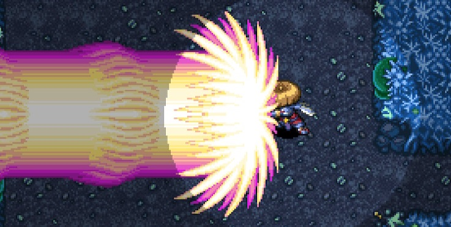

### Fullness

Shiren has a fullness gauge (FG), and takes 1 damage per turn once it reaches 0. 
Fullness decreases by 1 every 10 turns, so periodically eat food to replenish fullness.

   

### Status Conditions

States that affect a character's behavior in various ways. 
→ <a href="/system/status-conditions">Status Conditions</a>

  

### Super Status

Shiren's status will change as you defeat enemies during an adventure.

- Regular → Awakened-ish → Super

 

  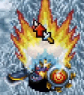

#### Super Status

- Direct attacks can randomly inflict Asleep, Confused, Blind, Paralyzed, Sealed, Berserk, or Shadow Bound status.
- An additional bonus occurs every time you defeat 10 enemies:
    - Boost attack (3 floors)
    - Boost defense (3 floors)
    - Gain Swift status (50 turns / 100 turns from Shiren's perspective)
    - Gain Tinkerer status (2 floors)
    - Gain Fast Striking status (50 turns)
    - Gain Precise status (50 turns)
- Of these effects, attack and defense boosts stack up to 8 stages.

#### Deactivation

Super status can deactivate due to the following:

- Become afflicted by an ailment.
- Step on a trap.
- Hunger message is displayed. (20 and 10 remaining fullness)
- 0 fullness.
- HP display is red. (Current HP is &lt; 30% of max)

※ The "0 fullness" and "HP display is red" conditions perform a check every turn.

### HP Regeneration

Shiren's HP regenerates as he walks or steps in place (A+B). (HP won't regenerate when any other action is performed)

  

HP regeneration speed is linked to max HP, and slows down as your max HP increases. 
Turns that restore 0 HP are introduced from 102 HP, and increase in frequency until you finally only restore 1 HP every 2 turns.

|Max HP | HP Restored  | Interval | Per Turn|
|-|-|-|-|
|15 ~ 50  | 1,2 |  2T  |1.50|
|51 ~ 66  | 1,1,1,2 |  4T | 1.25|
|96 ~ 101 | 1  | 1T | 1.00|
|102 |  1,1,1... 0|  50T |  0.98|
|104 |  1,1,1... 0 | 23T |  0.96|
|124  | 1,1,1,0  | 4T | 0.75|
|200 ~ |  1,0  | 2T | 0.50|

Source: [シレン4、シレン5　自然回復量　【データ】 - 24番目の風来日記](http://shiren2424.blog.fc2.com/blog-entry-127.html)

### Damage Calculation

[ Attack * Variance / 100 - Defense ] * Type Multiplier

The formula aside, the main things to note:

- The formula isn't the same as necklace ability damage calculation.
- Attack involves logarithm, so the latter has a smaller effect between increasing by 1 at low level / strength vs. increasing by 1 at high level / strength.
- If strength is ≥ 8, strength is halved and decimals are dropped, so odd number values don't increase damage. (Example: 10 strength is the same as 11 strength)
- Equipment AP and DP are multiplied by about 0.6, so small increases in upgrade value aren't very noticeable.

Source: [ダメージ計算 - 組長式(アーカイブ)](https://web.archive.org/web/20111228071625/http://kumicyou.sakura.ne.jp/shiren-ds-5/system-damage.html)

### Accuracy

#### Direct Attacks

92% without a weapon.

Accuracy increases while equipped with a leveled up weapon. The Redeeming rune raises accuracy to 100% for 1 hit after 2 misses.

|Weapon Level  |Lv1\~3   |Lv4\~5  | Lv6\~7  | Lv8|
|-|-|-|-|-|
|Accuracy | 92%  | 93% |  94%  | 95%|

#### Projectiles

84%

#### Monster Direct Attacks

88% under normal circumstances.

Accuracy decreases if a Spry Shield is equipped. (Shiren's evasion increases) 
The Agile rune is equivalent to Spry Shield Lv1, so it's 78%.

<table>
  <tr>
    <th>Spry Shield</th>
    <th>Lv1</th>
    <th>Lv2</th>
    <th>Lv3</th>
    <th>Lv4</th>
    <th>Lv5</th>
    <th>Lv6</th>
    <th>Lv7</th>
    <th>Lv8</th>
  </tr>
  <tr>
    <th>Accuracy</th>
    <td>78%</td>
    <td>75%</td>
    <td>72%</td>
    <td>69%</td>
    <td>66%</td>
    <td>63%</td>
    <td>60%</td>
    <td>57%</td>
  </tr>
</table>

Source: [攻撃の命中率 - 組長式(アーカイブ)](http://web.archive.org/web/20141231031541/http://kumicyou.sakura.ne.jp/shiren-ds-5/system-hit.html)

## Item

### Point Card

  

Step on Point Switches while carrying a Point Card to accumulate points, which can then be exchanged at the Point Shop for various items. 
→ Point Shop Items

Point Switch:

  

How to Obtain the Point Card:

1. Go to the basement of Hotel Nekomaneki and go through the Lot Shop event.
2. Go to the Point Shop (building next to Dungeon Center) and talk to the Pointman.

Notes:

- Points earned per Point Switch varies by dungeon and depth.
- If you lose the Point Card, you can have it reissued for 1000 Gitan.
    - The points you accumulated won't be lost.
- The Point Card's status affects points earned from Point Switches.
    - Sealed or inside a pot = 0 points.
    - Blessed = Double points, but blessing wears off after 1 use.
- Points reset to 0 if you end the game without suspending properly.

### Resonance

Certain weapons, shields, and bracelets activate special effects when equipped at the same time. 
→ <a href="/system/resonance">Resonance</a>

  

### Equipment Tags

Tags can be placed on weapons or shields, and ensures the item goes to Hermit's Hermitage if lost. Up to 8 tags can be placed on items, and the tag comes off when you pick the item up. The Sentry is located to the left of the Blacksmith.

  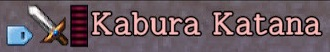

Placing a tag:

- Purchase from Sentry (Hermit's Hermitage) or Shopkeepers for 3000 Gitan.
- Purchase from Tag Master for 2000 Gitan.
- Read a Tag Scroll and select a weapon or shield.

Tag removal:

- Request a tag removal. (Sentry or village shop)
- Tagged item was delivered to the Sentry.
- Sold the item inside a dungeon store.
    - Don't sell your tagged main weapon and shield when stealing!
- Chance to be removed when upgrade value decreases.
    - Safe if you keep your equipment plated.

Item is lost even with Tag:

- Item turned into Onigiri or Weeds.
- Item inserted into a Presto or Sale pot.
- Quit the game without suspending properly / game froze.
    - If you were carrying the item when this occurred.

### Equipment Growth

Weapons and shields earn growth experience points when you defeat enemies using direct attacks. For the sake of keeping the term short, this site refers to it as skill points.

※ You don't earn skill points if you defeat enemies using projectiles, abilities, magic bullets, etc.

  

Notes:

- The item's name changes, and strength, upgrade limit, and rune count increase. (Example: Katana 6 atk / 8 limit → Good Katana 7 atk / 15 limit)
- Weapons or shields can gain runes through leveling up, and have a maximum level of 8. (Example: Beast Fang gains Rustproof at Lv5)
- Skill points can't be seen, and each monster grants a predetermined amount. (Example: Mamel = 1 point)
- Generally, stronger / higher level monsters offer more skill points. (Example: Pit Mamel = 2 points, Cave Mamel = 100 points)
- Equipment levels up once the skill points total reaches the item's assigned threshold. (Example: Katana → Good Katana once skill point total reaches 300 points)

Check the [Monsters](/system/monsters) page for monster skill point values.

### Blessing / Curse / Seal

Items can be blessed, cursed, or sealed. (Excluding arrows, rocks, and talismans) 
They can occasionally be found on the ground with these statuses, and you won't 
be able to determine an unidentified items's status until you use it. 

Once an item is identified, these statuses will be shown as an icon:

<table class="tableWithImages">
  <tr>
    <th>Icon</th>
    <th>Type</th>
    <th>Basic Effect</th>
  </tr>
  <tr>
    <td></td>
    <td>Blessing</td>
    <td>Boosted effect.</td>
  </tr>
  <tr>
    <td></td>
    <td>Curse</td>
    <td>Can't unequip.</td>
  </tr>
  <tr>
    <td></td>
    <td>Seal</td>
    <td>Unable to be used.</td>
  </tr>
</table>

The effects of these statuses differ based on item category. (See table below)

- Gaining a status
    - Blessing: Blessing Scroll, Blessing Pot, night monster drop.
    - Curse: Curse Trap, Curse Girl special attack, Imabikiso, Curse Scroll, Curse Pot.
    - Seal: Curse Trap, item stolen by Bad Zalokleft (Lv1~3), Imabikiso, Curse Scroll, Curse Pot.
- Removing a status
    - Curse / Seal: Exorcism Scroll, Exorcism Pot, Fate Scroll, Earth Scroll, Plating Scroll, bless the item, Curse Breaker (Nekomaneki Village or wandering NPC).
    - Anti-Crs. Bracelet protects an item from getting cursed or sealed.

Effect details by item category:

|Item | Blessed |  Cursed  |Sealed|
|-|-|-|-|
|Weapon | Increased attack (Chance to wear off) | Can't unequip |  Upgrade value and runes are nullified, doesn't gain skill points|
|Shield | Increased defense (Chance to wear off) | Can't unequip |  Upgrade value and runes are nullified, doesn't gain skill points|
|Bracelet | Can't be cursed or sealed (Chance to wear off) | Can't unequip |  Bracelet's effect is nullified|
|Arrow, Rock |  -  | - |  -|
|Staff |  Doubled effect (Chance to wear off) | - |  Unable to be used, no effect if thrown|
|Talisman | - |  - |  -|
|Scroll | Reusable (Some exceptions *1) |  - |  Unable to be used|
|Grass |  Doubled effect (Some exceptions *1) |  -  | Unable to be used, no effect if thrown|
|Pot |  Can't be cursed, sealed, pecked, turned into onigiri (Chance to wear off) | -   |Can't use [Insert] or [Open] commands, can't be filled by Bored Kappa or Scoopie|
|Food | Doubled effect, peaches gain a bonus | - |  Unable to be used|
|Torch  | Doubled duration | -   |Can't be equipped|
|Point Card | Gain double points (Wears off after 1 use)|   -  | Unable to be used|

*1 Exceptions:

- Scroll
    - Extraction Scroll - Blesses all extracted items, but can't be reused.
- Grass
    - Upgrade Seed - Effect is active for the duration of the current floor. (Normally 100 turns)
    - Revival Grass, Undo Grass, Repeat Grass - Reusable.

### Synthesis

Synthesize weapons and shields to merge special abilities, upgrade value, and runes, and combine staves to add their use counts together.

  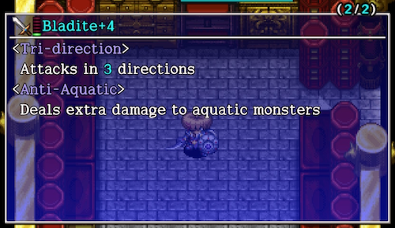

#### Synthesis Effects

Weapons, Shields:

- First item is the base. Runes and upgrade value of subsequent items are added to it. (Example: Katana first, Scythe+1 second → Katana+1 with Anti-Plant rune)
- Each item has a "rune count", and no more runes can be added once you reach the limit. (Example: Katana has 4 rune slots)
- Innate runes get stronger as the item levels up, but runes are always equal to Lv1 effect. (Example: Lv4 Scythe = 210%, Katana with Anti-Plant rune = 135%) → [Rune Multipliers](/system/synthesis-runes#multipliers)

Staves:

- Adds use counts together. Can only combine same name staves. (Example: Knockback Staff [3] first, Knockback Staff [4] second → Knockback Staff [7])

#### Different Category Synthesis

Normally, you can only synthesize weapons with weapons, and shields with shields. However, certain different category items can be synthesized by Mixers to add runes. 
(Example: Weapon + Dragon Grass = Anti-Dragon rune) → Check [Rune List](/system/runes#rune-list) for all possible combinations.

#### Synthesis Methods

Synthesis Pot:

  

- Insert same category items to synthesize them. (Weapons, Shields, or Staves)
- Insert an identified staff last to result in an identified staff.

Mixer:

  

- Throw items at a Mixer to synthesize them. (Different category items can be synthesized)
- Mixers won't eat items when they're afflicted with certain [status conditions](/system/status-conditions).
    - Will eat: Any status conditions besides the ones listed below.
    - Won't eat: Napping, Asleep, Sound Asleep, Sealed, Paralyzed, S-Paralyzed, Onigiri, Tottering.
- Mixers can only eat a set number of items, based on their level. 
(Mixer = 2, Mixermon = 3, Mixergon = 4, Mixerdon = 5)
- Throw an Expand Seed to increase the number of items a Mixer can eat by 1. (Max: 8) (Example: Throw an Expand Seed at a Mixer, then synthesize 3 items instead of 2)
- Mixers turn toward the direction the item came from when they eat an item.

#### Blessed, Cursed, Sealed, Identified

Synthesized items generally take on the status of the item that was inserted or thrown last. (Example: Remove a seal or curse from a weapon by synthesizing the weapon with an Iron Arrow)

※ Mixer synthesis has varied priority based on item category, so you may get unexpected results.

#### Mixer Synthesis Priority

Priority after throwing a weapon:

- Weapon > grass > scroll > staff > talisman or arrow > pot > bracelet. (This remains true even if items were thrown in a different order)

Example: If you throw a weapon → staff (sealed) → grass, the resulting weapon will be sealed, because grass has a higher priority than staves.

It's fine to throw non-equipment category items before the weapon or shield.

#### Common Mistakes

- Threw a Synthesis Pot while a Can. Arm Bracelet was equipped / Dracon Grass was active.
    - Check equipped bracelets and current status beforehand.
- Main weapon vanished after being thrown at a Napping Mixer.
    - Mixers function differently in Shiren 4 and 5, so always wake them up first.
- Stepped on an Explosion Trap / Pit Trap while walking over to the synthesized item.
    - Perform direct attacks over tiles to check for traps while approaching the item.
- Threw a weapon → Angel Seed → shield → Angel Seed, but only the weapon gained a rune.
    - Items that can be used to add runes to both weapons and shields always get synthesized onto the first weapon or shield, so use 2 different Mixers.
- A Pop Tank monster destroyed the item after synthesizing.
    - Use the Scout command to check for Pop Tank monsters on floors where they appear.
- The resulting staff became sealed after combining same name staves.
    - Swing the staff you to intend to synthesize last to check if it's sealed.

### New Items

Secret Pots located in the basement of Hotel Nekomaneki can be used to add new abilities to items. 
→ [New Items](/system/new-items)

  

### Catstones

Collect all 7 colors and clear Inori Cave to have a wish granted. → Wishes List

  

There are a number of different methods to obtain Catstones. The list below is in the order of how easy it is to obtain all 7 colors.

- Tanuki Passwords
    - Talk to Pokopon inside Hotel Nekomaneki and input Tanuki Passwords to obtain 1 set. ※ Passwords can only be used once per save file.
- Rescue Passwords
    - Use Lost Well Pick-A-Choice Rescue Passwords. (See Collecting Catstones for details)
- Pick-A-Choice Shop
    - Same as above, but search for a Pick-A-Choice shop on your own.
- Purchase From Poo
    - Talk to Ah in Hotel Manekineko to hear Poo's current location, and then go there and purchase a Catstone for 3000G. (Random color) Poo's location is randomly selected from the list of dungeons you've entered before, and will change location after 7 or so adventures.
- Clear Destiny's Descent
    - The clear reward for this dungeon is a full set of Catstones. However, you need Catstones to even unlock this dungeon, and it's quite difficult, so it's not a very practical option.
- Elite Stores
    - You'll occasionally find Catstones for sale in elite stores.

### Friendship Licenses

Friendship Licenses are items that cause a monster family to act as allies and attack enemy monsters.

  

How to Obtain:

- Purchase at the License Shop in Nekomaneki Village.
- Read a Nixer Scroll while adjacent to an enemy monster.
- Defeat an enemy monster that is afflicted with Dueling status.

Notes:

- Ally monsters won't be attacked by enemies, and won't level up when they defeat other monsters.
- Shiren won't gain any experience points from ally monsters defeating enemies.
- If Shiren deals damage to an ally monster, all licenses for that family get destroyed.
    - Includes licenses inside pots.
- Licenses don't take effect if they're on the ground or inside pots.
- Licenses can turn into Blank Scrolls when leaving a floor where the family is in the monster table.
    - The check is also performed on licenses in pots, and seems to be around 10\~20%.
    - Example: In Gen's Turf, Mamel appears between 1-5F, and Pit Mamel between 3-7F. Therefore, 7 chances for Mamel Lic. to turn into a Blank Scroll. (1→2F, 2→3F, 3→4F, 4→5F, 5→6F, 6→7F, 7→8F)

Example:

If you have a Sproutant Lic. in your inventory (not inside a pot), all Sproutants, Sproutyrants, Sprouterrors, and Sproutitans on the current floor will attack enemies instead of you.

  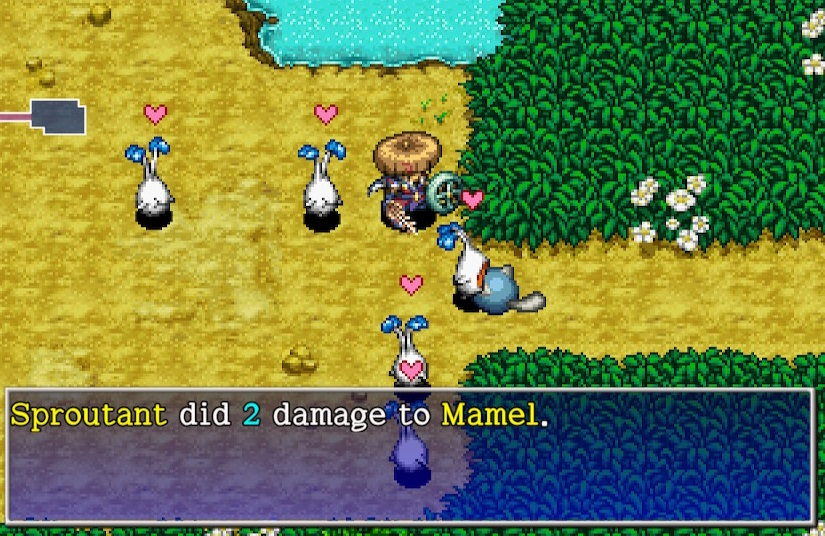

## Dungeon

### Allies

Allies are mostly optional NPCs who fight alongside Shiren. (Jirokichi is a mandatory ally during the main story) → <a href="/system/allies">Allies</a>

  

### NPCs

Characters who wander around inside dungeons and help Shiren out in various ways. 
→ <a href="/system/npcs">Wandering NPCs</a>

  

### Dungeon Features

Details for things like shops, hidden hallways, shiny objects, item islands, lava, etc. 
→ <a href="/system/dungeon-features">Dungeon Features</a>

  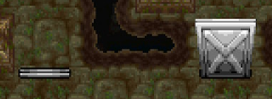

### Map Patterns

List of map patterns used in the game. 
→ <a href="/system/map-patterns">Map Patterns</a>

  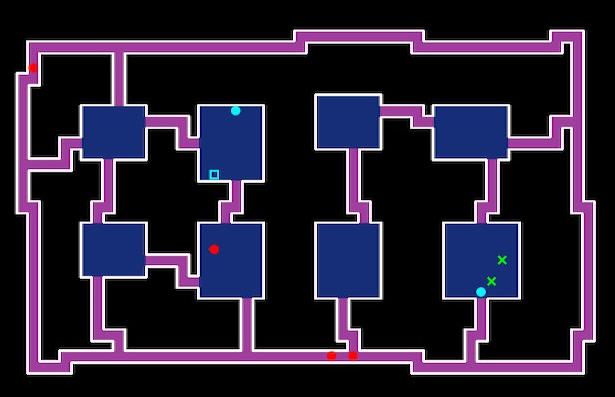

### Monster House

Information about Monster Houses. 
→ <a href="/system/dungeon-features#monster-house">Monster House</a>

  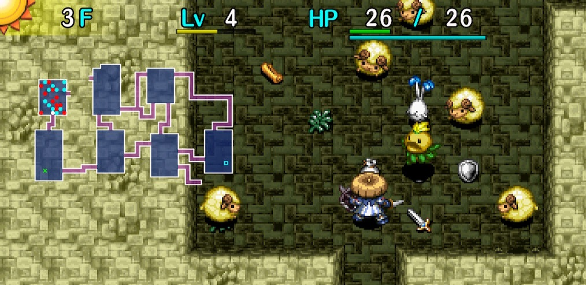

### Traps

List of traps and their effects. 
→ <a href="/system/traps">Traps</a>

    

### Day / Night

Some dungeons have day and night cycles that change based on the number of elapsed turns. The Night Training Facility in Inori Village or NPC at the exit of Hermit's Hermitage offers a tutorial.

  

The monster table is different between day and night, and all monsters on the floor vanish and new ones are generated when time of day changes.

When it changes from:

- Day to Night → day monsters vanish, and night monsters are generated.
- Night to Day → night monsters vanish, and day monsters are generated. 

Night:

- Direct attacks only deal 1 damage to night monsters, so use Necklace Abilities to defeat them.
    - Up to 8 abilities can be assigned. (Talk to the NPC in Hotel Nekomaneki to edit)
    - Once an ability is used, it can't be used again until you change floors or eat a peach.
    - Special effects from items like staves and scrolls are effective.
    - Fixed damage attacks like Dragon Grass also only deal 1 damage.
        - However, Empathy status and the Dispersing rune are effective.
- Field of view is reduced to a 1 tile radius.
    - Equip a torch to expand your field of view. (Higher grade torches provide a larger radius)
    - Night monsters deal far greater damage to you without a torch equipped.
    - Scrolls other than Fixer Scroll cannot be read at night without light.
- The Scout command cannot be used unless you've read a Navigation or Fixer scroll.
- Items dropped by night monsters are always blessed, and are chosen from the shop table.
    - In other words, generally higher quality than items you find on the ground.

Day:

- Direct attacks deal damage like normal to day monsters, and abilities cannot be used.

### Monsters

Details for enemies that appear inside dungeons. 
→ <a href="/system/monsters">Monsters</a>

    

### Monster Auras

  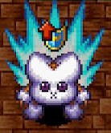

Status condition that monsters can have when they spawn naturally. 
Monsters made to appear (Summon Trap, Mnster House Scrl, etc.) never have auras, 
and some dungeons and specific floors have monster auras disabled.

Monster auras can be removed by reading a Dispel Aura Scroll, swinging a Seal Staff, or hitting the target with any talisman. However, monsters with auras provide double experience points, so it's important to take advantage of that when possible.

Aura effects vary by color:

<table>
  <tr>
    <th>Color</th>
    <th>Effect</th>
  </tr>
  <tr>
    <td class="highlightRed">Red</td>
    <td>Deal x2.5 damage. (3 stages of Buffed status)</td>
  </tr>
  <tr>
    <td class="highlightBlue">Blue</td>
    <td>Reduce damage received by 70%. (3 stages of Bolstered status)</td>
  </tr>
  <tr>
    <td class="highlightYellow">Yellow</td>
    <td>Increase action speed by 2 stages.</td>
  </tr>
</table>

### Monster Spawns

## Facilities

See Villages for a complete list of available facilities.

### Storehouse

Store up to 80 items, or 5 x 80 = 400 items if you fill it with Preservation Pot [5]. Use the Organize option to easily reorganize and sell items. Select multiple items using the R button.

  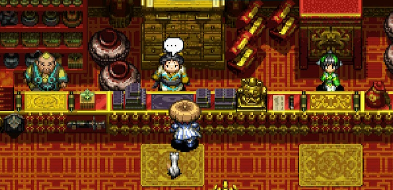

### Tanuki Passwords

Input passwords to receive items. 
→ <a href="/system/tanuki-passwords">Tanuki Passwords</a>

  

### Sparrow's Shuttle

Fast travel to places you've been to before. 
→ <a href="/system/villages#sparrow's-shuttle">Sparrow's Shuttle</a>

  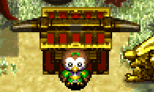

## Other

### Adventure Footprints

Basically a form of in-game achievements. 
→ <a href="/system/adventure-footprints">Adventure Footprints</a>

  

### Expert Badges

In-game achievements that challenge you to clear dungeons under special restrictions. 
→ <a href="/system/expert-badges">Expert Badges</a>

  

### Version Exclusives

Features that are exclusive to certain versions of the game.

  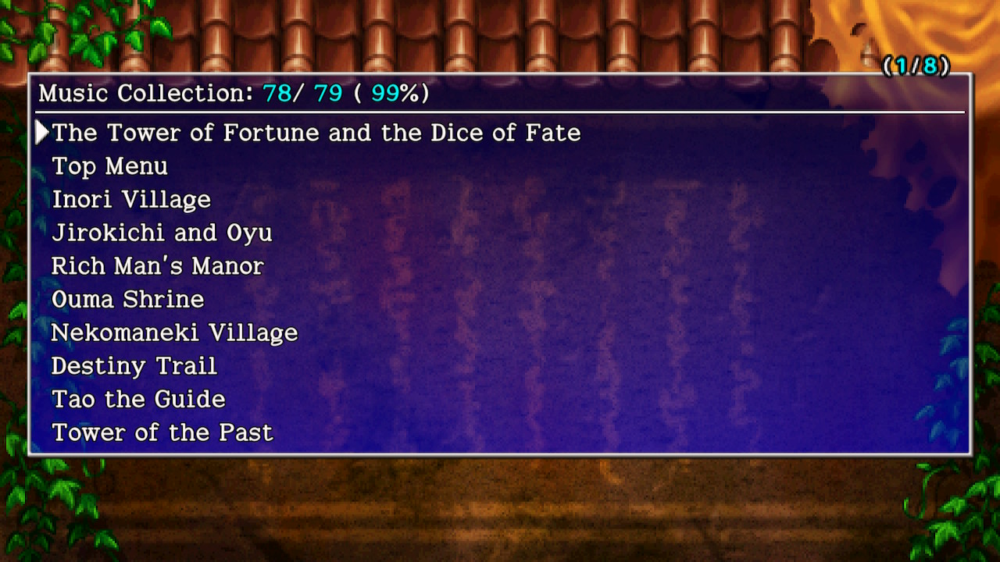

#### Switch / Steam

→ <a href="/system/music-collection">Music Collection</a>

#### Steam

→ <a href="">Trading Cards</a> 
→ <a href="https://store.steampowered.com/points/shop/app/1178790/">Steam Point Shop <svg xmlns="http://www.w3.org/2000/svg" width="14" height="14" viewBox="0 0 24 24" fill="none" stroke="currentColor" stroke-width="2" stroke-linecap="round" stroke-linejoin="round"><path d="M18 13v6a2 2 0 0 1-2 2H5a2 2 0 0 1-2-2V8a2 2 0 0 1 2-2h6"></path><polyline points="15 3 21 3 21 9"></polyline><line x1="10" y1="14" x2="21" y2="3"></line></svg></a>

#### Steam / Vita

→ <a href="/system/trophies">Trophies</a>

#### DS

→ <a href="/system/streetpass">Streetpass</a> 
→ <a href="/system/wanderer-erasers">Wanderer Erasers</a>
