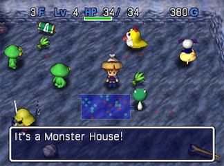

  

## Overview

Monster Houses are rooms packed with many monsters and items. 
They are generated randomly, and can appear in dungeons starting with Onigashima. 
The ground is also covered in hidden traps, so care is needed when moving around. 
It's best to eat Sight Grass if you have it on hand, or check for traps one tile at a time. 
If you successfully clear out a Monster House, you can claim the items as a reward. 
Whether Monster Houses are good or bad generally comes down to player skill.

The message "It's a (Monster Type) House!" is displayed when you first step inside, 
and the music changes to one of two Monster House themes, depending on the type.

Every monster in the room wakes up the moment you enter, and the location of all monsters on the current floor becomes visible on the map. (Like equipping a Scout Bracelet)

Special Monster Houses can include high level monsters outside of the normal monster table, 
making them extremely dangerous. But that also works in reverse, where Special Monster Houses 
in deeper floors can contain low level monsters, making them easier than regular ones.

Statues are never generated inside Monster Houses.

<ul class="quickLinksUL">
  <li><a href="#strategy">Strategy</a>
    <ul>
      <li><a href="#detecting-beforehand">Detecting Beforehand</a></li>
      <li><a href="#useful-items">Useful Items</a>
        <ul>
          <li><a href="#weapons">Weapons</a></li>
          <li><a href="#shields">Shields</a></li>
          <li><a href="#bracelets">Bracelets</a></li>
          <li><a href="#scrolls">Scrolls</a></li>
          <li><a href="#staves">Staves</a></li>
          <li><a href="#pots">Pots</a></li>
          <li><a href="#grass">Grass</a></li>
          <li><a href="#projectiles">Projectiles</a></li>
        </ul>
      </li>
    </ul>
  </li>
  <li><a href="#dangerous-monsters">Dangerous Monsters</a></li>
  <li><a href="#monster-house-types">Types</a>
    <ul>
      <li><a href="#monster-house-(regular)">Monster House (Regular)</a></li>
      <li><a href="#ghost-house">Ghost House</a></li>
      <li><a href="#drain-house">Drain House</a></li>
      <li><a href="#cyclops-house">Cyclops House</a></li>
      <li><a href="#power-house">Power House</a></li>
      <li><a href="#projectile-house">Projectile House</a></li>
      <li><a href="#magic-house">Magic House</a></li>
      <li><a href="#aquatic-house">Aquatic House</a></li>
      <li><a href="#theft-house">Theft House</a></li>
      <li><a href="#hawker-house">Hawker House</a></li>
    </ul>
  </li>
</ul>

## Strategy

### Detecting Beforehand

#### Multiple monsters or items visible near room entrance

There's a chance the room is a Monster House. 
The likeliness increases further if you shoot an arrow into the room and hit an unseen monster. Avoid entering the room if you don't have any items needed to take on a Monster House.

#### Room with many monsters visible using a Scout Bracelet

Guaranteed to be a Monster House. 
Avoid entering the room if you don't have any items needed to take on a Monster House. Equip the bracelet and check what monsters are inside to determine the type of Monster House.

#### The "It's a Monster House!" message randomly appeared

On rare occasions, a Dosukoi family monster can use its special attack to shift one of the sleeping monsters outside of the Monster House, resulting in the Monster House activating even if you're nowhere near it.

It's a bit irritating when there's a Landmine in the room, since a shifted item or monster could land on top of it and trigger an explosion that wipes out items. 

### Useful Items

#### If you detect a Monster House beforehand

Thin out the number of monsters in the room before entering, using items such as: 
Bracelets: Pierce, Bend, Phantasm 
Projectiles: Wooden Arrow, Iron Arrow, Razor Arrow, Porky Stone, Cannonball

Picking off monsters one at a time from outside the room provides an excellent advantage. Monsters that receive damage will wake up, so be mindful of that when using piercing items.

#### If you unknowingly step into a Monster House

Take one step back so you end up in a hallway, only having to fight one enemy at a time. You can hit 3 monsters per attack at the entrance if you have a Razor Wind or Morning Star. If there are multiple entrances, or monsters with ranged attacks, take another step back. This keeps you safe from ranged attacks, and monsters that lose sight of Shiren will wander somewhere else.

#### Clearing out the Monster House

Use the items mentioned below to give yourself an advantage!

#### Weapons

- Razor Wind (三 seal)
    - Swing your weapon at a room's entrance to deal damage to 3 enemies at once. Simple yet powerful seal that should be synthesized onto any main weapon.
- Morning Star
    - Two-handed weapon that can be used like Razor Wind. You might be tempted to remain in the Monster House to deal 5 hits, but it's too dangerous with 0 defense.
- Spear
    - Two-handed weapon that pierces through enemies 2 tiles forward. Defeat enemies without getting hit by taking 2 steps back at the beginning, as long as your direct attacks don't miss.
- Healing Sword (回 seal)
    - Excellent for restoring HP during extended fights. The standard must-have seal for any main weapon, along with the 三 seal.
- Type Effective Weapons (Drain Buster, Ghost Sickle, etc.)
    - These seals shine when you're up against Special Monster Houses.
- Pickaxe, Wonder Pick
    - Dig around the edge of the room before entering to thin out enemies along the wall. Be careful not to dig too much, resulting in an expanded room with nowhere to run.

#### Shields

- Evasive Shield (見 seal)
    - Higher evasion means you take less damage during extended fights.
- Counter Shield (バ seal)
    - Helps increase damage output during extended fights.
- 弟 Seal (Otogiriso)
    - Effectively reduces the amount of damage you take.
- 眠 Seal (Slumber Scroll)
    - Helps if you don't have enough attack power to defeat enemies in a single hit. Can also help to shut down monsters that move or attack through walls.

#### Bracelets

- Pierce Bracelet
    - Can be used to thin out the number of monsters before entering the room, or to clear out the line of monsters that chase after you after waking up the room. Keep an eye out for Shihan, since it has the ability to disarm bracelets. See <a href="/shiren-2/guides/advanced-techniques#how-to-use-pierce-bracelet">How to Use Pierce Bracelet</a> for tips.
- Bend Bracelet
    - Can be used to attack monsters along the wall before entering the room.
- Strength Bracelet
    - Higher strength means you're more likely to defeat enemies in a single hit.
- Phantasm Bracelet
    - Can be used to defeat monsters along the wall before entering the room. Hide inside a wall after waking up the monsters to safely clear the room.
- Trapper Bracelet
    - Monster Houses are full of traps, so enemies will trigger traps left and right. However, dangerous traps like Landmine or Flood Trap could be present, and Shiren's attack power is drastically lowered while the bracelet is equipped.

#### Scrolls

- Trap Trigger Scroll
    - Similar to Trapper Bracelet, but guaranteed to activate all traps in the room. Keep in mind that you could end up triggering a Landmine or Flood Trap.
- Lightning Scroll
    - Deals roughly 30 damage to all enemies in the room. One scroll is enough to clear out an entire Monster House early on. However, it isn't as effective on deeper floors, though it can still be used to soften enemies so that you can defeat them using a single direct attack.
- Blaze Scroll
    - Deals 20 damage per turn to any character standing in the fire. Items on the ground burn up, and tiles with traps will not be set on fire. It's best to read this in a hallway to minimize item loss.
- Slumber Scroll
    - Puts all monsters in the room to sleep for 10 turns. Monsters will act at double speed after waking up. Read it when the stairs is located in a Monster House and you need to escape, rather than relying on it to clear one out.
- Shadow Scroll
    - Provides a big advantage while inside the room, but only lasts for 10 turns. Defeat enemies quickly, or retreat before it wears off to reposition to a better spot. Avoid reading it when you don't have enough space to summon shadows.
- Trap Remove Scroll
    - Nice to read after clearing out the Monster House.
- Fear Scroll
    - Plays well with Razor Wind (三 seal). Can be used to have a monster defeat a more troublesome monster, but you'll need a way to defeat the leveled up monster.
- Blank Scroll
    - Can be used as any scroll that you've read in the past. Choose an option that fits your current situation and needs.
- Sanctuary Scroll
    - Prevents monsters from using direct attacks when they're next to you. Ranged attacks and special attacks from a distance can still hit you. Take a step back and place it in a hallway if the entrance tile had a trap.

#### Staves

- Swap Staff
    - Useful when you want to quickly move toward the room's entrace, or if the stairs is in the middle of the room and you need to escape. The trap is guaranteed to activate if one is present on the destination tile.
- Slow Staff
    - Slow a monster that's chasing you into a hallway to have an easier time escaping.
- Fire Staff
    - Step into a hallway and swing it to burn the line of monsters chasing you. Use alongside Silver Arrows or Pierce Bracelet to quickly clear out enemies.
- Tunnel Staff
    - Create new hallways to thin out more enemies using projectiles from outside the room. Nice if Bored Kappas are waiting on top of items, or if you don't have a Pierce Bracelet. Be careful not to dig in a way that expands the room with you standing inside of it.
- Miss Staff
    - Essentially shuts down a monster's direct attacks. Plays well with Razor Wind, if you use a monster as a barricade and attack the sides.
- Invisible Staff
    - Invisible monsters act like confused ones, so this staff makes it easier to escape.
- Possession Staff
    - Lets you take control of a high level monster in Special Monster Houses. Be careful of ranged attacks while you're controlling a monster.

#### Pots

- Grass Pot
    - Monster Houses are one of the few situations where Grass Pots have a use. See <a href="/shiren-2/guides/advanced-techniques#how-to-use-grass-pot">How to Use Grass Pot</a> for tips.
- Sticky Pot
    - Throw it at a monster to slow down the line of monsters chasing after you. Equip a Pierce Bracelet before throwing it to trap multiple monsters. Throwing a sturdy Sticky Pot will trap a monster in the pot until it's defeated.

#### Grass

- Twisty Grass
    - Use it with a Pierce Bracelet or Grass Pot to lower the level of multiple monsters.
- Swift Grass
    - Lets you act 2 times per turn, making it easier to fight or run away.
- Warp Grass
    - Eat it when you're cornered and need to escape the situation.
- Talk Seed
    - Inflicts a random effect to all monsters in the room. (Slow, Confusion, etc.)
- Sight Grass
    - Lets you skip having to check for traps 1 tile at a time. Can be used to locate a Pitfall to advance to the next floor.
- Revival Grass
    - Great to have as backup in case something goes wrong.

#### Projectiles

- Silver Arrow
    - Retreat into a hallway and shoot to deal damage to a line of monsters.
- Razor Arrow
    - Lets you perform an attack in a pattern similar to a Silver Arrow + Razor Wind. Low attack power, and you'll want to be careful not to hit Shopkeepers or Traders.
- Cannonball
    - Be careful not to self-destruct by getting caught in the explosion.

## Dangerous Monsters

- Snacky
    - Often found inside Monster Houses early on. A monster defeating a Snacky can quickly turn the tide of the situation, depending on what monster levels up.
- Dosukoi Family
    - Shifts items and monsters around, activating traps if anything lands on one. You might be shifted into the Monster House, even if you were at the entrance. Flood Trap and Landmine can be problematic, and Sleep Trap can end the run.
- Kengo Family
    - Having your equipment disarmed can quickly turn a good situation into a bad one. However, the scarier situation is item loss due to equipment hitting a monster. Losing equipment (especially a shield) can outright end an adventure on deeper floors.
- Dragon Family
    - Sky Dragon's flame can reach you if you're standing at the room's entrance. Dragons can level up by defeating other monsters, and Archdragon can breathe fire at you from anywhere on the current floor, so consider skipping Monster Houses on floors where this monster family is present.
- Pumphantasm Family
    - Can move through and attack from inside walls. Place a Sanctuary Scroll or move into a different room to deal with them.
- Typhoon
    - Can appear in Ghost Houses. Acts at triple speed and has the ability to move through and attack from inside walls. Deal with it in a similar fashion to Pumphantasm monsters.
- Scorpion Family
    - Scorpion isn't much of an issue, but Demon Scorpion and Stun Scorpion are dangerous.
- Gazer Family
    - Its hypnosis wastes a turn, and can unequip your shield or consume Revival Grass. If you don't have an Echo Shield (山 seal), use items to avoid giving it a chance to act.
- Porky Family
    - Its ranged attacks can quickly wear down your HP. Often leads to a collapse if you run into a Power House early on.
- Tiger Tosser Family
    - Has the potential to block exits with the monsters it throws.
- Horse Ronin Family
    - Shoots Silver Arrows from a distance. Can level up as a result of its arrows piercing through other monsters.
- Water Strider
    - Can potentially throw Gitan or other hard hitting items like Dragon Grass.
- Bored Kappa Family
    - Moves toward items and throws them at you. If you're not quick, there may be no items left to claim as a reward.
- Bow Boy Family
    - Its special attack can potentially defeat other monsters, resulting in level ups. Cranky Tank destroys walls and makes it difficult to retreat if you need to do so. Splash water from a Water Pot to seal Cranky Tank if you have one on hand.
- Wolf Droid Family
    - High stats, and has the potential to level up as a result of its bomb explosions.
- Sheep Priest Family
    - Getting hit by a stat lowering spells makes it harder to defeat enemies.
- King Tusker Family
    - It can seal, slow, or reduce HP to 1/4 of its current value depending on its level.
- Bat Kangaroo Family
    - Provides support for other monsters in the room. Swift Staff and Heal Staff are particularly troublesome, but Devil Kangaroo's Invisible Staff might actually give you some time to escape.
- Gyadon Family
    - Plucks an item, weakning and dropping it on the ground beneath the monster. It's bad if it plucks an item you planned on using, since the item falls inside the room. If you don't have a Walrus Shield (ト seal), don't hesitate to use items like Seal Staff.

## Types

Regular Monster Houses only contain monsters from the current floor's monster table. 
Such Monster Houses are called "Normal (Regular) Monster House", or simply "Monster House".

All other Monster Houses are called "Special Monster House". 
These only appear in Sealed Room, Road to the End, and Shrine's Hidden Hole between 1\~99F.

Special Monster Houses can contain monsters outside of the current floor's monster table, 
including high level monsters. (ex: Gigahead, Porkton, Typhoon on 12F of Road to the End). 
They're typically extremely dangerous, especially if you begin the floor in the middle of one. 
However, a Sanctuary Scroll is usually enough to deal with Cyclops, Drain, and Ghost houses.

The music differs between Monster Houses and Special Monster Houses.

### Monster House (Regular)

Monsters from the current floor's monster table appear. 
Much higher chance of being generated compared to Special Monster Houses.

It's best to thin out monsters from outside the room before stepping inside. 
Use items like arrows to wake up and defeat enemies one at a time.

### Ghost House

- Bone Dragon
- Pumphantasm
- Gale
- Yamikichi

Typhoons detect Shiren from any location, and rush him triple speed while going through walls. 
Pumphantasm can also attack through walls. It helps to have the 仏 seal (Ghost Sickle). 
Ghost Houses are one of the few situations where Grass Pot shines, since you can insert 
Otogiriso to deal 100 damage to monsters in the room while healing yourself.

### Drain House

- Twisty Hani
- Scorpion
- Slug
- Hunger Puppet

These don't have fast movement or ranged attacks, but instead have tricky special attacks. 
Salty Bracelet, Song Bracelet, Level Lock Bracelet, and Scale Shield can block the effects. 
Weapons with the ド seal (Drain Buster) provide an advantage, and a Sanctuary Scroll 
prevents any Drain type monster from attacking or using their special attacks.

### Cyclops House

- Ironhead
- Golem
- Gazer

Ironheads and Golems have high attack power, and Gazers have a tricky special attack. 
Weapons with the 目 seal (Cyclops Killer) will give you an advantage. 
The biggest threat is Gazer's hypnosis, so it's nice to have the 山 seal (Echo Shield) as well. 
Ironheads can level up if they defeat monsters standing between Shiren and themselves, 
so be careful where you stand to avoid ending up with an extra Gigahead in the room.

### Power House

- Ironhead
- Golem
- Porky
- Tiger Tosser
- Bone Dragon
- Shagga

Many of these monsters not only have high attack power, but also have high HP. 
One of the most dangerous types due to the presence of Porkys and Tiger Tossers. 
Porkton throws stones from up to 10 tiles away even if you're on a Sanctuary Scroll. 
竜 (Dragon Killer) and 龍 (Ryujin Sword) seals help against Shaggas and Bone Dragons, 
while the 目 seal (Cyclops Killer) helps against Ironheads and Golems. 
It's a great type for experience points, but it might be best to ignore it due to the risk.

### Projectile House

- Porky
- Tiger Tosser
- Horse Ronin
- Bored Kappa
- Water Strider

Sanctuary Scrolls don't stop projectiles, and Porky throws stones even if you enter hallways. 
The 身 (Dodge Shield) or 返 (Reflect Shield) seals offer protection against projectiles, but said shields can only be obtained in Sealed Room, meaning you have to tackle this type of Special Monster House without them in Road to the End and Shrine's Hidden Hole.

Monsters like Horse Ronin and Tiger Tosser can level up by defeating other monsters. 
Bored Kappas and Water Striders will throw items found on the ground, 
potentially leaving you with nothing to collect as a reward for clearing the room. 
Generally, it's best to ignore this type if you discover it while wearing a Scout Bracelet.

### Magic House

- Bat Kangaroo
- King Tusker
- Sheep Priest
- Gyadon

These monsters can be quite dangerous if you don't have the 山 seal (Echo Shield). 
Oddly, Gyadon monsters are included in this type.

There's a lot that could go wrong between Bat Kangaroos speeding monsters up, King Tuskers and Sheep Priests weakening you, and Gyadons plucking equipment and items. 
The ト seal (Walrus Shield) will stop Gyadons from plucking your items. 
Don't underestimate the attack power of invisible enemies if a Devil Kangaroo is present. 
You don't want to take a hit from a level 3 monster such as Emperor Tusker early on.

### Aquatic House

- Zalokleft
- Bored Kappa
- Spearfish
- Orcan
- Aqua Dragon
- Shotfish

Monster House with waterways in the room and fewer items on the ground. 
Bored Kappas throw items and Zaloklefts steal items, so there might not be much of a reward left after you're done tackling this type of Monster House.

Reading a Freeze or Evaporate scroll reduces the number of enemies that pose a threat. 
Weapons with the 水 seal (Fish Spear) let you attack underwater monsters. 
Always check for traps, since you don't want items to fall in water from a Trip Stone.

There are two room patterns that can generate for this type of Monster House. 
The first pattern has water tiles for all tiles in the room except for the outer edge, 
and the second pattern has all water tiles except for a line from the entrance. 
The room entrance will never be blocked by a waterway in either case.

Aquatic Houses will never be generated on a floor that is one large room with wall tiles. 
If the Aquatic House is generated on a floor that is one large room with water tiles, the two patterns mentioned above won't be applied.

### Theft House

- Zalokleft
- Gamarra

Special Monster House that can only be seen in Sealed Room. 
Only Zaloklefts and Gamarras appear, so there's no immediate danger of collapsing. 
However, Iron Zaloklefts can steal equipped items, so you'll want the ト seal (Walrus Shield). 
Sealed Room doesn't have much for rare items that can be found on the ground, so it might be best to just ignore it.

### Hawker House

- Hawker

Special Monster House exclusive to Sealed Room. 
It's the only location where Hawkers (Level 2 Traders) can be seen naturally. 
Hawkers won't attack Shiren, so there's no danger of collapsing.

Hawkers can have extremely valuable Angel Seeds for sale, so buy as many as you can. 
Angel Seeds are used to synthesize the 天 seal onto a weapon to boost experience gain, 
or to gain a massive amount of level ups by inserting it into a Grass Gainer. 
They can also have Revival Grass, which is nice if you're attempting a restricted play such as Shuten Trail Challenge.

Hawkers are pushy and will force the shop window to open when they approach Shiren, 
so it's best to handle them one at a time to avoid getting overwhelmed and irritated. 
Defeating a Hawker triggers thief mode, so avoid doing so. (Landmines are safe, though).

It's not necessarily rarer than other Special Monster Houses, but it's common to go an entire 99F run without seeing one due to the large number of Monster House types that can be generated in Sealed Room. (Sample: 2 Aquatic, 2 Projectile, 3 Cyclops, 6 Power, 8 Ghost, 5 Drain, 5 Magic, 3 Theft, 3 Hawker)
