## Monster List

Primary Category Order

<table class="itemTable">
  <tr>
    <th>Category</th>
    <th>Monsters (Family or Individual)</th>
    <th>Info</th>
  </tr>
  <tr>
    <td>Normal</td>
    <td>Mamel | Chintala | Piko Hammer | Armordillo | Droplet Ninja | Mr. Drone Stone Beast | Copycat Mask | Schubell | Dosukoi | Snacky | Tiny Phoenix Escargon | Queen Spider | Armor Spider | N'dubba</td>
    <td>No type-effective weakness.</td>
  </tr>
  <tr>
    <td>Weapon</td>
    <td>Kengo | Taur | Ashigarudon</td>
    <td>Splash water from a Water Pot to decrease attack power.</td>
  </tr>
  <tr>
    <td>Projectile</td>
    <td>Porky | Horse Ronin | Tiger Tosser</td>
    <td>Uses ranged attacks.</td>
  </tr>
  <tr>
    <td>Magic</td>
    <td>King Tusker | Bat Kangaroo | Sheep Priest</td>
    <td>Uses staves or spells.</td>
  </tr>
  <tr>
    <td>Item</td>
    <td>Nigiri Trainee | Mixer | Straw Voodoll | Weather Doll</td>
    <td>Interacts with items.</td>
  </tr>
  <tr>
    <td>Theft</td>
    <td>Zalokleft | Gamarra | Gyadon</td>
    <td>Steals items or Gitan.</td>
  </tr>
  <tr>
    <td>Dragon</td>
    <td>Dragon | Shagga | Bone Dragon</td>
    <td>Weak to 竜 and 龍 seals.</td>
  </tr>
  <tr>
    <td>Ghost</td>
    <td>Pumphantasm | Gale | Yamikichi</td>
    <td>Weak to 仏 seal.</td>
  </tr>
  <tr>
    <td>Drain</td>
    <td>Twisty Hani | Slug | Scorpion | Hunger Puppet</td>
    <td>Weak to ド seal.</td>
  </tr>
  <tr>
    <td>Cyclops</td>
    <td>Gazer | Ironhead | Golem</td>
    <td>Weak to 目 seal.</td>
  </tr>
  <tr>
    <td>Bomb</td>
    <td>Wolf Droid | Patient Bag | Bow Boy</td>
    <td>Weak to 月 seal.</td>
  </tr>
  <tr>
    <td>Aquatic</td>
    <td>Bored Kappa | Water Strider | Spearfish | Orcan | Aqua Dragon | Shotfish</td>
    <td>Can act inside water.</td>
  </tr>
  <tr>
    <td>Oni</td>
    <td>Small Oni | Lanky Oni | Galaha | Boss Oni</td>
    <td>Only found in Onigashima.</td>
  </tr>
  <tr>
    <td>Other</td>
    <td>Shopkeeper | Trader | Sheriff | Guard Dog | Shuten Child | Figure | Oni Doll</td>
    <td>Miscellaneous characters.</td>
  </tr>
</table>

  
※ Some monsters fit multiple categories. Check details section for more information.

Monster Kingdom Order

<table class="itemTable">
  <tr>
    <th colspan="6">Monster (Family)</th>
  </tr>
  <tr>
    <th>1</th>
    <th>2</th>
    <th>3</th>
    <th>4</th>
    <th>5</th>
    <th>6</th>
  </tr>
  <tr>
    <td>Mamel</td>
    <td>Porky</td>
    <td>Hunger Puppet</td>
    <td>Horse Ronin</td>
    <td>Piko Hammer</td>
    <td>Spearfish</td>
  </tr>
  <tr>
    <td>Dragon</td>
    <td>Kengo</td>
    <td>Armordillo</td>
    <td>Wolf Droid</td>
    <td>Dosukoi</td>
    <td>Golem</td>
  </tr>
  <tr>
    <td>Gamarra</td>
    <td>Slug</td>
    <td>Patient Bag</td>
    <td>Ironhead</td>
    <td>Sheep Priest</td>
    <td>Yamikichi</td>
  </tr>
  <tr>
    <td>Zalokleft</td>
    <td>N'dubba</td>
    <td>Copycat Mask</td>
    <td>Bat Kangaroo</td>
    <td>Tiger Tosser</td>
    <td>Scorpion</td>
  </tr>
  <tr>
    <td>Twisty Hani</td>
    <td>Tiny Phoenix</td>
    <td>Weather Doll</td>
    <td>Escargon</td>
    <td>Gyadon</td>
    <td>Bone Dragon</td>
  </tr>
  <tr>
    <td>Taur</td>
    <td>Shagga</td>
    <td>Gale</td>
    <td>Mixer</td>
    <td>Ashigarudon</td>
    <td>Stone Beast</td>
  </tr>
  <tr>
    <td>Nigiri Trainee</td>
    <td>Schubell</td>
    <td>Mr. Drone</td>
    <td>Snacky</td>
    <td>Shotfish</td>
    <td>Armor Spider</td>
  </tr>
  <tr>
    <td>Gazer</td>
    <td>Pumphantasm</td>
    <td>King Tusker</td>
    <td>Droplet Ninja</td>
    <td>Orcan</td>
    <td>Queen Spider</td>
  </tr>
  <tr>
    <td>Chintala</td>
    <td>Straw Voodoll</td>
    <td>Bow Boy</td>
    <td>Bored Kappa</td>
    <td>Aqua Dragon</td>
    <td>Water Strider</td>
  </tr>
</table>

Other Enemies / Characters

<table class="itemTable">
  <tr>
    <th colspan="2">Oni / Character (Family)</th>
  </tr>
  <tr>
    <th>1</th>
    <th>2</th>
  </tr>
  <tr>
    <td>Small Oni</td>
    <td>Shopkeeper</td>
  </tr>
  <tr>
    <td>Lanky Oni</td>
    <td>Trader</td>
  </tr>
  <tr>
    <td>Galaha</td>
    <td>Sheriff</td>
  </tr>
  <tr>
    <td>Boss Oni</td>
    <td>Guard Dog</td>
  </tr>
  <tr>
    <td></td>
    <td>Shuten Child</td>
  </tr>
  <tr>
    <td></td>
    <td>Figure</td>
  </tr>
  <tr>
    <td></td>
    <td>Oni Doll</td>
  </tr>
</table>

## Overview

#### Enemy Monsters

Monsters generally roam around freely, and approach Shiren once they spot him. 
They spot Shiren when he enters the same room, or if he's within a 1 tile radius. (It seems they can also spot him within a 3 tile radius at times, but it's inconsistent)

Some monsters can be found napping inside a room instead of roaming around. They have a variety of wake conditions, including being attacked, Shiren entering or exiting the room, Shiren approaching, etc.

Some monsters have special attacks besides the regular damage dealing direct attacks. These include paralyzing Shiren, lowering strength, stealing an item, and so on.

Shiren and monsters take turns with their actions. However, some monsters can act 2 or 3 times in the time it takes Shiren to take 1 action. They're referred to as "swift 1" and "swift 2" based on the number of extra actions they get.

Some monsters can level up when they defeat a character other than Shiren. When that happens, HP, attack, and defense get reset to the new level's values. Monsters that defeat ally monsters won't level up, excluding defeating an ally Snacky or if you're adventuring in Shrine's Hidden Hole (B).

The defense value of a monster is halved when a monster attacks another monster.

Possession Staff can be used to take control of a monster and use their special attack. However, some possessed monster special attacks have different effects.

The attack power of a monster is set to 1 if they're hit by a poison arrow.

Green Zalokleft, Iron Zalokleft, Rancor Slug, and Intolerable Slug can divide when hit, creating a fresh copy of the monster that received damage - HP, strength, and status of the new copy have no relation to the one that was hit. 
They can't divide if there isn't an open tile in a 1 tile radius, or if they're sealed.

#### Ally Monsters

Ally monsters roam around freely like enemy monsters instead of following Shiren. 
They fight on their own, and will keep going until they collapse even if their HP gets low.

Most of the characteristics of enemy monsters apply to ally monsters, such as Landmines instantly defeating them, and HP not regenerating as turns pass. You can [Call] ally monsters to have them return to their pots and fully restore HP. 
So really, the main difference between enemy and ally is how level ups are treated.

Unlike ally characters, there's no way to check remaining HP of ally monsters. (Knowledge Staff displays their max HP, not their current HP)

## Table Explanation

#### Defense

Gets divided by 2 if a monster is attacking another monster.

#### Element

Think of elements as categories or types a monster falls into. 
Monsters can have multiple elements, which can also change within the same family.

<table class="itemTable">
  <tr>
    <th>Elem.</th>
    <th>Explanation</th>
  </tr>
  <tr>
    <td>Swift 1</td>
    <td>Acts 2 times in the time it takes Shiren to take 1 action. Slows to regular speed when sealed.</td>
  </tr>
  <tr>
    <td>Swift 2</td>
    <td>Acts 3 times in the time it takes Shiren to take 1 action. Slows to regular speed when sealed.</td>
  </tr>
  <tr>
    <td>Slow</td>
    <td>Acts 1 time in the time it takes Shiren to take 2 actions. Returns to regular speed when sealed.</td>
  </tr>
  <tr>
    <td>Floating</td>
    <td>Can't be trapped, and won't slip on ice. Can't move over water tiles. Element is nullified if a Gravity Statue is present.</td>
  </tr>
  <tr>
    <td>Flying</td>
    <td>Same as Floating, but can move over water and air tiles.</td>
  </tr>
  <tr>
    <td>Wall-clip</td>
    <td>Can move through and attack from inside breakable walls. Can detect Shiren from any position on the current floor. Can't move through walls in Shuffle Dungeon maps.</td>
  </tr>
  <tr>
    <td>Aquatic</td>
    <td>Can act in water, and is never generated on dry ground. Can't exit water, but some can attack from underwater. Can't move at all if forced onto land.</td>
  </tr>
  <tr>
    <td>Amphibious</td>
    <td>Can move both on land and inside water.</td>
  </tr>
  <tr>
    <td>Magic</td>
    <td>Special attack is treated as magic, meaning it can be reflected by Echo Shield (山 seal) and nullified by No Magic Statue.</td>
  </tr>
  <tr>
    <td>Weapon</td>
    <td>Pour water from a Water Pot to halve their attack power.</td>
  </tr>
  <tr>
    <td>Cyclops</td>
    <td>Receives more damage when hit by Cyclops Killer (目 seal).</td>
  </tr>
  <tr>
    <td>Drain</td>
    <td>Receives more damage when hit by Drain Killer (ド seal).</td>
  </tr>
  <tr>
    <td>Ghost</td>
    <td>Receives more damage when hit by Ghost Sickle (仏 seal). Receives damage instead of restoring HP from Herb, Otogiriso, and Heal Staff. (Tiny Phoenix still heals)</td>
  </tr>
  <tr>
    <td>Dragon</td>
    <td>Receives more damage when hit by Dragon Killer (竜 seal) or Ryujin Sword (龍 seal).</td>
  </tr>
  <tr>
    <td>Bomb</td>
    <td>Receives more damage when hit by Crescent Arm (月 seal). Blast Shield (爆 seal) reduces damage from their specials. Pour water from a Water Pot to seal them.</td>
  </tr>
</table>

#### Sleep

Chance monster is sleeping when generated.

#### Wake

<table class="itemTable">
  <tr>
    <th>Type</th>
    <th>Condition</th>
  </tr>
  <tr>
    <td>1 Tile</td>
    <td>Wakes up when Shiren walks next to it.</td>
  </tr>
  <tr>
    <td>3 Tiles</td>
    <td>Wakes up when Shiren walks within 3 tiles of it.</td>
  </tr>
  <tr>
    <td>Low</td>
    <td>25% chance to wake up when Shiren enters or exits the room. 45% chance to wake up when Shiren walks next to it.</td>
  </tr>
  <tr>
    <td>High</td>
    <td>45% chance to wake up when Shiren enters or exits the room. 75% chance to wake up when Shiren walks next to it.</td>
  </tr>
</table>

#### Drop

Monster's item drop rate.

#### SP

Monster's special attack usage rate.

## Details

### Mamel

<table>
  <tr>
    <th>Mamel</th>
    <th>Pit Mamel</th>
    <th>Cave Mamel</th>
  </tr>
  <tr>
    <td class="itemPageImage"></td>
    <td class="itemPageImage"></td>
    <td class="itemPageImage"></td>
  </tr>
</table>

Mascot monster of the Shiren series. 
Cave Mamels in Shiren 2 have somewhat lower defense than in other games.

<table class="itemTable">
  <tr>
    <th>Lv</th>
    <th>Name</th>
    <th>HP</th>
    <th>Atk</th>
    <th>Def</th>
    <th>Exp</th>
    <th>Elem.</th>
    <th>Sleep</th>
    <th>Wake</th>
    <th>Drop</th>
    <th>Sp</th>
    <th>Notes</th>
  </tr>
  <tr>
    <td>1</td>
    <td>Mamel</td>
    <td>5</td>
    <td>2</td>
    <td>2</td>
    <td>2</td>
    <td rowspan="3">-</td>
    <td>0%</td>
    <td>1 Tile</td>
    <td>2%</td>
    <td>-</td>
    <td rowspan="2">Direct attacks only.</td>
  </tr>
  <tr>
    <td>2</td>
    <td>Pit Mamel</td>
    <td>8</td>
    <td>4</td>
    <td>4</td>
    <td>4</td>
    <td>0%</td>
    <td>1 Tile</td>
    <td>6%</td>
    <td>-</td>
  </tr>
  <tr>
    <td>3</td>
    <td>Cave Mamel</td>
    <td>5</td>
    <td>50</td>
    <td>55</td>
    <td>500</td>
    <td>100%</td>
    <td>1 Tile</td>
    <td>10%</td>
    <td>-</td>
    <td>Direct attacks only. High attack.</td>
  </tr>
</table>

#### Ally / Possession Staff

<table class="itemTable">
  <tr>
    <th>Name</th>
    <th>Max Lv</th>
    <th>HP+</th>
    <th>Atk+</th>
    <th>Max HP</th>
    <th>Max Atk</th>
    <th>Ally / Possession</th>
  </tr>
  <tr>
    <td>Mamel</td>
    <td>50</td>
    <td>1</td>
    <td>1</td>
    <td>55</td>
    <td>52</td>
    <td rowspan="3">Direct attacks only.</td>
  </tr>
  <tr>
    <td>Pit Mamel</td>
    <td>50</td>
    <td>1</td>
    <td>1</td>
    <td>58</td>
    <td>54</td>
  </tr>
  <tr>
    <td>Cave Mamel</td>
    <td>50</td>
    <td>1</td>
    <td>1</td>
    <td>55</td>
    <td>100</td>
  </tr>
</table>

### Chintala

<table>
  <tr>
    <th>Chintala</th>
    <th>Mid Chintala</th>
    <th>Big Chintala</th>
  </tr>
  <tr>
    <td class="itemPageImage"></td>
    <td class="itemPageImage"></td>
    <td class="itemPageImage"></td>
  </tr>
</table>

The secondary mascot monster of the Shiren series. 
Its in-game sprite grows larger with each increase in rank.

<table class="itemTable">
  <tr>
    <th>Lv</th>
    <th>Name</th>
    <th>HP</th>
    <th>Atk</th>
    <th>Def</th>
    <th>Exp</th>
    <th>Elem.</th>
    <th>Sleep</th>
    <th>Wake</th>
    <th>Drop</th>
    <th>Sp</th>
    <th>Notes</th>
  </tr>
  <tr>
    <td>1</td>
    <td>Chintala</td>
    <td>6</td>
    <td>3</td>
    <td>3</td>
    <td>3</td>
    <td rowspan="3">-</td>
    <td>40%</td>
    <td>High</td>
    <td>2%</td>
    <td>-</td>
    <td rowspan="3">Direct attacks only.</td>
  </tr>
  <tr>
    <td>2</td>
    <td>Mid Chintala</td>
    <td>15</td>
    <td>9</td>
    <td>10</td>
    <td>12</td>
    <td>40%</td>
    <td>High</td>
    <td>3%</td>
    <td>-</td>
  </tr>
  <tr>
    <td>3</td>
    <td>Big Chintala</td>
    <td>60</td>
    <td>39</td>
    <td>39</td>
    <td>500</td>
    <td>40%</td>
    <td>High</td>
    <td>4%</td>
    <td>-</td>
  </tr>
</table>

#### Ally / Possession Staff

<table class="itemTable">
  <tr>
    <th>Name</th>
    <th>Max Lv</th>
    <th>HP+</th>
    <th>Atk+</th>
    <th>Max HP</th>
    <th>Max Atk</th>
    <th>Ally / Possession</th>
  </tr>
  <tr>
    <td>Chintala</td>
    <td>50</td>
    <td>1</td>
    <td>1</td>
    <td>56</td>
    <td>53</td>
    <td rowspan="3">Direct attacks only.</td>
  </tr>
  <tr>
    <td>Mid Chintala</td>
    <td>50</td>
    <td>1</td>
    <td>1</td>
    <td>65</td>
    <td>59</td>
  </tr>
  <tr>
    <td>Big Chintala</td>
    <td>50</td>
    <td>1</td>
    <td>1</td>
    <td>110</td>
    <td>89</td>
  </tr>
</table>

### Piko Hammer

<table>
  <tr>
    <th>Piko Hammer</th>
    <th>Poko Hammer</th>
    <th>Pako Hammer</th>
  </tr>
  <tr>
    <td class="itemPageImage"></td>
    <td class="itemPageImage">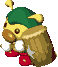</td>
    <td class="itemPageImage">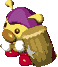</td>
  </tr>
</table>

Monster that can break traps and statues in a single hit. 
This ability is beneficial for most dungeons, but can be a nuisance in Halfway Well. 
It only breaks traps that it can see, so it won't break traps that are only visible to Shiren. (Example: Eat Sight Grass or equip a Trapper Bracelet) 
Higher ranks can only naturally be found in Halfway Well.

<table class="itemTable">
  <tr>
    <th>Lv</th>
    <th>Name</th>
    <th>HP</th>
    <th>Atk</th>
    <th>Def</th>
    <th>Exp</th>
    <th>Elem.</th>
    <th>Sleep</th>
    <th>Wake</th>
    <th>Drop</th>
    <th>Sp</th>
    <th>Notes</th>
  </tr>
  <tr>
    <td>1</td>
    <td>Piko Hammer</td>
    <td>13</td>
    <td>9</td>
    <td>6</td>
    <td>10</td>
    <td rowspan="3">-</td>
    <td>25%</td>
    <td>High</td>
    <td>2%</td>
    <td>-</td>
    <td>Breaks visible traps and statues. Focuses on Shiren if he is present.</td>
  </tr>
  <tr>
    <td>2</td>
    <td>Poko Hammer</td>
    <td>60</td>
    <td>30</td>
    <td>29</td>
    <td>350</td>
    <td>25%</td>
    <td>High</td>
    <td>5%</td>
    <td>-</td>
    <td rowspan="2">Same as Piko Hammer. Item drop is always a Mallet.</td>
  </tr>
  <tr>
    <td>3</td>
    <td>Pako Hammer</td>
    <td>75</td>
    <td>55</td>
    <td>40</td>
    <td>1500</td>
    <td>25%</td>
    <td>High</td>
    <td>5%</td>
    <td>-</td>
  </tr>
</table>

#### Ally / Possession Staff

<table class="itemTable">
  <tr>
    <th>Name</th>
    <th>Max Lv</th>
    <th>HP+</th>
    <th>Atk+</th>
    <th>Max HP</th>
    <th>Max Atk</th>
    <th>Ally / Possession</th>
  </tr>
  <tr>
    <td>Piko Hammer</td>
    <td>10</td>
    <td>3</td>
    <td>3</td>
    <td>43</td>
    <td>39</td>
    <td rowspan="3">Special: Break a trap or statue in front.</td>
  </tr>
  <tr>
    <td>Poko Hammer</td>
    <td>10</td>
    <td>3</td>
    <td>3</td>
    <td>90</td>
    <td>60</td>
  </tr>
  <tr>
    <td>Pako Hammer</td>
    <td>10</td>
    <td>3</td>
    <td>3</td>
    <td>105</td>
    <td>85</td>
  </tr>
</table>

### Armordillo

<table>
  <tr>
    <th>Armordillo</th>
    <th>Armordillo Bro</th>
    <th>Armordillo Pop</th>
  </tr>
  <tr>
    <td class="itemPageImage">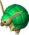</td>
    <td class="itemPageImage">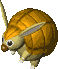</td>
    <td class="itemPageImage">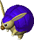</td>
  </tr>
</table>

Monster that resembles an armadillo. 
Occasionally rolls into a ball and tackles Shiren, making him trip and drop items. 
Troublesome when water is nearby, since items dropped in water are unrecoverable without the help of Hamikachi or items like Evaporate Scroll. 
Carry a Balance Staff to avoid being tripped.

<table class="itemTable">
  <tr>
    <th>Lv</th>
    <th>Name</th>
    <th>HP</th>
    <th>Atk</th>
    <th>Def</th>
    <th>Exp</th>
    <th>Elem.</th>
    <th>Sleep</th>
    <th>Wake</th>
    <th>Drop</th>
    <th>Sp</th>
    <th>Notes</th>
  </tr>
  <tr>
    <td>1</td>
    <td>Armordillo</td>
    <td>12</td>
    <td>8</td>
    <td>8</td>
    <td>9</td>
    <td rowspan="3">-</td>
    <td>40%</td>
    <td>High</td>
    <td>3%</td>
    <td>25%</td>
    <td>Trips Shiren, making him drop items. (4 damage + 1 tile knockback)</td>
  </tr>
  <tr>
    <td>2</td>
    <td>Armordillo Bro</td>
    <td>13</td>
    <td>9</td>
    <td>11</td>
    <td>11</td>
    <td>25%</td>
    <td>High</td>
    <td>3%</td>
    <td>30%</td>
    <td>Trips Shiren, making him drop items. (6 damage + 2 tiles knockback)</td>
  </tr>
  <tr>
    <td>3</td>
    <td>Armordillo Pop</td>
    <td>70</td>
    <td>37</td>
    <td>37</td>
    <td>700</td>
    <td>25%</td>
    <td>High</td>
    <td>3%</td>
    <td>35%</td>
    <td>Trips Shiren, making him drop items. (10 damage + 3 tiles knockback)</td>
  </tr>
</table>

#### Ally / Possession Staff

Armordillo's special attack makes a monster drop 1 item. 
The ability to rapidly obtain new items is so powerful, you're nearly guaranteed 
to clear the dungeon if you capture an Armordillo Pop in Road to the End. 
The dropped items are selected from the current floor's item table. 
Note that Gamarra monsters will always drop Gitan.

<table class="itemTable">
  <tr>
    <th>Name</th>
    <th>Max Lv</th>
    <th>HP+</th>
    <th>Atk+</th>
    <th>Max HP</th>
    <th>Max Atk</th>
    <th>Ally / Possession</th>
  </tr>
  <tr>
    <td>Armordillo</td>
    <td>5</td>
    <td>2</td>
    <td>5</td>
    <td>22</td>
    <td>33</td>
    <td>Special: Trips a target, making them drop an item. (4 damage + 1 tile knockback)</td>
  </tr>
  <tr>
    <td>Armordillo Bro</td>
    <td>5</td>
    <td>2</td>
    <td>5</td>
    <td>23</td>
    <td>34</td>
    <td>Special: Trips a target, making them drop an item. (6 damage + 2 tiles knockback)</td>
  </tr>
  <tr>
    <td>Armordillo Pop</td>
    <td>10</td>
    <td>2</td>
    <td>5</td>
    <td>90</td>
    <td>87</td>
    <td>Special: Trips a target, making them drop an item. (10 damage + 3 tiles knockback)</td>
  </tr>
</table>

### Droplet Ninja

<table>
  <tr>
    <th>Droplet Ninja</th>
    <th>Landmine Ninja</th>
    <th>Summon Ninja</th>
    <th>Bomber Ninja</th>
  </tr>
  <tr>
    <td class="itemPageImage">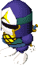</td>
    <td class="itemPageImage">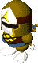</td>
    <td class="itemPageImage">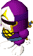</td>
    <td class="itemPageImage">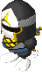</td>
  </tr>
</table>

Ninja-like monster that often appears early game. 
Occasionally drops a trap when defeated, with the type of trap being based on its level. 
Can be troublesome if it drops a trap in a hallway. 
Doesn't drop a trap if the ground below it is occupied by an item or stairs. 
Trap drop takes priority over synthesis seals like 飯 and 銭 when it comes to placement.

<table class="itemTable">
  <tr>
    <th>Lv</th>
    <th>Name</th>
    <th>HP</th>
    <th>Atk</th>
    <th>Def</th>
    <th>Exp</th>
    <th>Elem.</th>
    <th>Sleep</th>
    <th>Wake</th>
    <th>Drop</th>
    <th>Sp</th>
    <th>Notes</th>
  </tr>
  <tr>
    <td>1</td>
    <td>Droplet Ninja</td>
    <td>12</td>
    <td>7</td>
    <td>7</td>
    <td>9</td>
    <td rowspan="4">-</td>
    <td>25%</td>
    <td>High</td>
    <td>80%</td>
    <td>-</td>
    <td>Drops a Droplet Trap when defeated.</td>
  </tr>
  <tr>
    <td>2</td>
    <td>Landmine Ninja</td>
    <td>30</td>
    <td>17</td>
    <td>15</td>
    <td>35</td>
    <td>25%</td>
    <td>High</td>
    <td>60%</td>
    <td>-</td>
    <td>Drops a Landmine when defeated.</td>
  </tr>
  <tr>
    <td>3</td>
    <td>Summon Ninja</td>
    <td>32</td>
    <td>18</td>
    <td>16</td>
    <td>46</td>
    <td>25%</td>
    <td>High</td>
    <td>70%</td>
    <td>-</td>
    <td>Drops a Summon Trap when defeated.</td>
  </tr>
  <tr>
    <td>4</td>
    <td>Bomber Ninja</td>
    <td>69</td>
    <td>33</td>
    <td>38</td>
    <td>300</td>
    <td>25%</td>
    <td>High</td>
    <td>70%</td>
    <td>-</td>
    <td>Drops a Big Landmine when defeated.</td>
  </tr>
</table>

#### Ally / Possession Staff

<table class="itemTable">
  <tr>
    <th>Name</th>
    <th>Max Lv</th>
    <th>HP+</th>
    <th>Atk+</th>
    <th>Max HP</th>
    <th>Max Atk</th>
    <th>Ally</th>
    <th>Possession</th>
  </tr>
  <tr>
    <td>Droplet Ninja</td>
    <td>20</td>
    <td>2</td>
    <td>2</td>
    <td>52</td>
    <td>47</td>
    <td>-</td>
    <td>Special: Drop a Droplet Trap and warp.</td>
  </tr>
  <tr>
    <td>Landmine Ninja</td>
    <td>20</td>
    <td>2</td>
    <td>2</td>
    <td>70</td>
    <td>57</td>
    <td>-</td>
    <td>Special: Drop a Landmine and warp.</td>
  </tr>
  <tr>
    <td>Summon Ninja</td>
    <td>20</td>
    <td>2</td>
    <td>2</td>
    <td>72</td>
    <td>58</td>
    <td>-</td>
    <td>Special: Drop a Summon Trap and warp.</td>
  </tr>
  <tr>
    <td>Bomber Ninja</td>
    <td>20</td>
    <td>2</td>
    <td>2</td>
    <td>109</td>
    <td>73</td>
    <td>-</td>
    <td>Special: Drop a Big Landmine and warp.</td>
  </tr>
</table>

### Mr. Drone

<table>
  <tr>
    <th>Mr. Drone</th>
    <th>Mr. Helico</th>
    <th>Mr. Gyro</th>
  </tr>
  <tr>
    <td class="itemPageImage"></td>
    <td class="itemPageImage">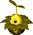</td>
    <td class="itemPageImage">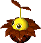</td>
  </tr>
</table>

Vegetable-like monster that flies using a propeller on its head. 
Runs away from Shiren, and has a high chance to drop beneficial grass when defeated. 
Prioritizes running away, similar to Snacky. 
The item drop will be lost if defeated over water.

<table class="itemTable">
  <tr>
    <th>Lv</th>
    <th>Name</th>
    <th>HP</th>
    <th>Atk</th>
    <th>Def</th>
    <th>Exp</th>
    <th>Elem.</th>
    <th>Sleep</th>
    <th>Wake</th>
    <th>Drop</th>
    <th>Sp</th>
    <th>Notes</th>
  </tr>
  <tr>
    <td>1</td>
    <td>Mr. Drone</td>
    <td>16</td>
    <td>6</td>
    <td>8</td>
    <td>7</td>
    <td>Flying</td>
    <td>50%</td>
    <td>3 Tiles</td>
    <td>100%</td>
    <td>-</td>
    <td>Runs away from Shiren. Item drop is always Strength Grass.</td>
  </tr>
  <tr>
    <td>2</td>
    <td>Mr. Helico</td>
    <td>18</td>
    <td>8</td>
    <td>10</td>
    <td>8</td>
    <td rowspan="2">Flying Swift 1</td>
    <td>50%</td>
    <td>3 Tiles</td>
    <td>85%</td>
    <td>-</td>
    <td>Runs away from Shiren. Item drop is always Happy Grass.</td>
  </tr>
  <tr>
    <td>3</td>
    <td>Mr. Gyro</td>
    <td>20</td>
    <td>10</td>
    <td>15</td>
    <td>20</td>
    <td>50%</td>
    <td>3 Tiles</td>
    <td>75%</td>
    <td>-</td>
    <td>Runs away from Shiren. Item drop is always Revival Grass.</td>
  </tr>
</table>

#### Ally / Possession Staff

Second highest growth limit among all monsters. 
Doesn't run away as an ally, so you can train it like any other monster.

<table class="itemTable">
  <tr>
    <th>Name</th>
    <th>Max Lv</th>
    <th>HP+</th>
    <th>Atk+</th>
    <th>Max HP</th>
    <th>Max Atk</th>
    <th>Ally</th>
    <th>Possession</th>
  </tr>
  <tr>
    <td>Mr. Drone</td>
    <td>100</td>
    <td>1</td>
    <td>1</td>
    <td>116</td>
    <td>106</td>
    <td rowspan="3">Doesn't run away.</td>
    <td>Direct attacks only.</td>
  </tr>
  <tr>
    <td>Mr. Helico</td>
    <td>100</td>
    <td>1</td>
    <td>1</td>
    <td>118</td>
    <td>108</td>
    <td>Warps after taking damage.</td>
  </tr>
  <tr>
    <td>Mr. Gyro</td>
    <td>100</td>
    <td>1</td>
    <td>1</td>
    <td>120</td>
    <td>110</td>
    <td>Warps after taking damage. Special: Warp.</td>
  </tr>
</table>

### Stone Beast

<table>
  <tr>
    <th>Stone Beast</th>
    <th>Rock Beast</th>
    <th>Boulder Beast</th>
  </tr>
  <tr>
    <td class="itemPageImage"></td>
    <td class="itemPageImage">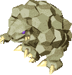</td>
    <td class="itemPageImage">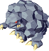</td>
  </tr>
</table>

Monster that body slams targets, making them fly away from the impact. 
Lv2+ Stone Beast body slams can break wall tiles and leaves the target paralyzed. 
Paralysis duration: 3 turns (Shiren), or 2 turns (Enemies). 
Each collision with a wall tile deals 5 damage, so a 弟 seal helps mitigate damage. 
Be careful not to trigger thief mode by being sent outside of a shop due to a body slam. 
A body slam in a diagonal direction won't break walls.

<table class="itemTable">
  <tr>
    <th>Lv</th>
    <th>Name</th>
    <th>HP</th>
    <th>Atk</th>
    <th>Def</th>
    <th>Exp</th>
    <th>Elem.</th>
    <th>Sleep</th>
    <th>Wake</th>
    <th>Drop</th>
    <th>Sp</th>
    <th>Notes</th>
  </tr>
  <tr>
    <td>1</td>
    <td>Stone Beast</td>
    <td>55</td>
    <td>27</td>
    <td>21</td>
    <td>40</td>
    <td rowspan="3">-</td>
    <td>35%</td>
    <td>High</td>
    <td>10%</td>
    <td>5%</td>
    <td>Body slams, sending a target flying until they hit a wall or waterway. (5 damage)</td>
  </tr>
  <tr>
    <td>2</td>
    <td>Rock Beast</td>
    <td>70</td>
    <td>28</td>
    <td>26</td>
    <td>85</td>
    <td>35%</td>
    <td>High</td>
    <td>4%</td>
    <td>25%</td>
    <td>Body slams like Stone Beast. Sends target into the wall by 2 tiles. (10 damage + paralysis)</td>
  </tr>
  <tr>
    <td>3</td>
    <td>Boulder Beast</td>
    <td>115</td>
    <td>102</td>
    <td>71</td>
    <td>3100</td>
    <td>35%</td>
    <td>High</td>
    <td>32%</td>
    <td>20%</td>
    <td>Body slams like Stone Beast. Sends target into the wall by 5 tiles. (15 damage + paralysis)</td>
  </tr>
</table>

#### Ally / Possession Staff

<table class="itemTable">
  <tr>
    <th>Name</th>
    <th>Max Lv</th>
    <th>HP+</th>
    <th>Atk+</th>
    <th>Max HP</th>
    <th>Max Atk</th>
    <th>Ally / Possession Staff</th>
  </tr>
  <tr>
    <td>Stone Beast</td>
    <td>10</td>
    <td>3</td>
    <td>3</td>
    <td>85</td>
    <td>57</td>
    <td>Special: Body slams, sending a target flying until they hit a wall or waterway. (5 damage)</td>
  </tr>
  <tr>
    <td>Rock Beast</td>
    <td>10</td>
    <td>3</td>
    <td>3</td>
    <td>100</td>
    <td>58</td>
    <td>Special: Body slams like Stone Beast. Sends target into the wall by 2 tiles. (10 damage + paralysis)</td>
  </tr>
  <tr>
    <td>Boulder Beast</td>
    <td>5</td>
    <td>3</td>
    <td>3</td>
    <td>130</td>
    <td>117</td>
    <td>Special: Body slams like Stone Beast. Sends target into the wall by 5 tiles. (15 damage + paralysis)</td>
  </tr>
</table>

### Copycat Mask

<table>
  <tr>
    <th>Copycat Mask</th>
    <th>Trickster Mask</th>
    <th>Impostor Mask</th>
  </tr>
  <tr>
    <td class="itemPageImage"></td>
    <td class="itemPageImage">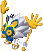</td>
    <td class="itemPageImage">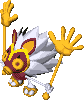</td>
  </tr>
</table>

Disguises itself as other monsters, but can't copy their special attacks or stats. 
Its disguise is canceled when sealed, and it can be identified with a Knowledge Staff. 
Never disguises itself as Dosukoi, Gamarra, Zalokleft, Orcan, Spearfish, or N'dubba. 
Mixergons on 50\~80F in Road to the End could be a disguised Copycat Mask monster. 
Seal a monster before throwing an Extinction Scroll, just to ensure it's not one of these. 
Never spawns asleep, so sleeping monsters are always real. (Excluding monster houses) 
You know it's one of these if a flying or amphibious monster is unable to move above or inside water, or if a swift monster is moving at regular speed.

<table class="itemTable">
  <tr>
    <th>Lv</th>
    <th>Name</th>
    <th>HP</th>
    <th>Atk</th>
    <th>Def</th>
    <th>Exp</th>
    <th>Elem.</th>
    <th>Sleep</th>
    <th>Wake</th>
    <th>Drop</th>
    <th>Sp</th>
    <th>Notes</th>
  </tr>
  <tr>
    <td>1</td>
    <td>Copycat Mask</td>
    <td>20</td>
    <td>5</td>
    <td>5</td>
    <td>10</td>
    <td rowspan="3">-</td>
    <td>0%</td>
    <td>High</td>
    <td>1%</td>
    <td>-</td>
    <td rowspan="3">Takes the form of a monster that can be found on the current floor.</td>
  </tr>
  <tr>
    <td>2</td>
    <td>Trickster Mask</td>
    <td>100</td>
    <td>15</td>
    <td>25</td>
    <td>500</td>
    <td>0%</td>
    <td>High</td>
    <td>1%</td>
    <td>-</td>
  </tr>
  <tr>
    <td>3</td>
    <td>Impostor Mask</td>
    <td>130</td>
    <td>20</td>
    <td>40</td>
    <td>700</td>
    <td>0%</td>
    <td>High</td>
    <td>2%</td>
    <td>-</td>
  </tr>
</table>

#### Ally / Possession Staff

<table class="itemTable">
  <tr>
    <th>Name</th>
    <th>Max Lv</th>
    <th>HP+</th>
    <th>Atk+</th>
    <th>Max HP</th>
    <th>Max Atk</th>
    <th>Ally</th>
    <th>Possession</th>
  </tr>
  <tr>
    <td>Copycat Mask</td>
    <td>50</td>
    <td>1</td>
    <td>1</td>
    <td>70</td>
    <td>55</td>
    <td rowspan="3">Takes the form of a monster that can be found on the current floor.</td>
    <td rowspan="3">Special: Takes the form of a monster in front.</td>
  </tr>
  <tr>
    <td>Trickster Mask</td>
    <td>50</td>
    <td>1</td>
    <td>1</td>
    <td>150</td>
    <td>65</td>
  </tr>
  <tr>
    <td>Impostor Mask</td>
    <td>50</td>
    <td>1</td>
    <td>1</td>
    <td>180</td>
    <td>70</td>
  </tr>
</table>

### Schubell

<table>
  <tr>
    <th>Schubell</th>
    <th>Menbell</th>
    <th>Bellthoven</th>
  </tr>
  <tr>
    <td class="itemPageImage"></td>
    <td class="itemPageImage"></td>
    <td class="itemPageImage">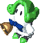</td>
  </tr>
</table>

Monster that rings a bell to summon monsters. 
Summoned monsters are based on the current floor's monster table. 
The summoned monster matches the level of the Schubell that summoned it. 
Always performs direct attacks when there isn't enough room to summon.

It appears Schubell and Menbell can't summon the following monster families: Schubell, Mixer, Copycat Mask, Dosukoi, Taur, N'dubba, Spearfish, Orcan, 
Aqua Dragon, Shotfish, Tiny Phoenix, Escargon, Queen Spider. 

<table class="itemTable">
  <tr>
    <th>Lv</th>
    <th>Name</th>
    <th>HP</th>
    <th>Atk</th>
    <th>Def</th>
    <th>Exp</th>
    <th>Elem.</th>
    <th>Sleep</th>
    <th>Wake</th>
    <th>Drop</th>
    <th>Sp</th>
    <th>Notes</th>
  </tr>
  <tr>
    <td>1</td>
    <td>Schubell</td>
    <td>45</td>
    <td>18</td>
    <td>23</td>
    <td>100</td>
    <td rowspan="3">-</td>
    <td>25%</td>
    <td>High</td>
    <td>4%</td>
    <td>40%</td>
    <td>Summons 1 Lv1 monster.</td>
  </tr>
  <tr>
    <td>2</td>
    <td>Menbell</td>
    <td>60</td>
    <td>50</td>
    <td>49</td>
    <td>1600</td>
    <td>25%</td>
    <td>High</td>
    <td>2%</td>
    <td>30%</td>
    <td>Summons 1 Lv2 monster.</td>
  </tr>
  <tr>
    <td>3</td>
    <td>Bellthoven</td>
    <td>80</td>
    <td>55</td>
    <td>40</td>
    <td>1900</td>
    <td>25%</td>
    <td>High</td>
    <td>2%</td>
    <td>20%</td>
    <td>Summons 1~3 Lv3 monsters.</td>
  </tr>
</table>

#### Ally / Possession Staff

Summons (warps) Shiren's ally monsters instead of summoning enemies.

<table class="itemTable">
  <tr>
    <th>Name</th>
    <th>Max Lv</th>
    <th>HP+</th>
    <th>Atk+</th>
    <th>Max HP</th>
    <th>Max Atk</th>
    <th>Ally</th>
    <th>Possession</th>
  </tr>
  <tr>
    <td>Schubell</td>
    <td>10</td>
    <td>2</td>
    <td>1</td>
    <td>65</td>
    <td>28</td>
    <td>Summons an ally monster from out of view. (Only uses its special when it's adjacent to an enemy after being sent out)</td>
    <td>Special: Summons an ally monster from out of view.</td>
  </tr>
  <tr>
    <td>Menbell</td>
    <td>10</td>
    <td>2</td>
    <td>1</td>
    <td>80</td>
    <td>60</td>
    <td colspan="2">Same as Schubell, but summons 2.</td>
  </tr>
  <tr>
    <td>Bellthoven</td>
    <td>10</td>
    <td>2</td>
    <td>1</td>
    <td>100</td>
    <td>65</td>
    <td colspan="2">Same as Schubell, but summons 3. Also summons monsters from Shiren's inventory.</td>
  </tr>
</table>

### Dosukoi

<table>
  <tr>
    <th>Dosukoi</th>
    <th>Hakkeyoi</th>
    <th>Gottsuan</th>
  </tr>
  <tr>
    <td class="itemPageImage"></td>
    <td class="itemPageImage">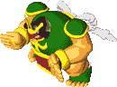</td>
    <td class="itemPageImage">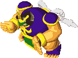</td>
  </tr>
</table>

Monster that looks like a sumo wrestler. Only appears in post-game dungeons. 
Occasionally stamps the ground, shuffling the position of things in the room. (Lv1: items, Lv2: characters, Lv3: items and characters) 
It can also push statues and stairs around, and won't stamp while doing so. 
Traps always trigger if a character lands on one after Hakkeyoi or Gottsuan stamps. 
Prioritizes moving toward and pushing statues or stairs instead of Shiren. 
Merchandise in shops won't move as a result of a ground stamp. 

<table class="itemTable">
  <tr>
    <th>Lv</th>
    <th>Name</th>
    <th>HP</th>
    <th>Atk</th>
    <th>Def</th>
    <th>Exp</th>
    <th>Elem.</th>
    <th>Sleep</th>
    <th>Wake</th>
    <th>Drop</th>
    <th>Sp</th>
    <th>Notes</th>
  </tr>
  <tr>
    <td>1</td>
    <td>Dosukoi</td>
    <td>72</td>
    <td>29</td>
    <td>30</td>
    <td>120</td>
    <td rowspan="3">-</td>
    <td>25%</td>
    <td>High</td>
    <td>16%</td>
    <td>30%</td>
    <td>Pushes statues. Shuffles items. Doesn't stamp if Shiren is in view.</td>
  </tr>
  <tr>
    <td>2</td>
    <td>Hakkeyoi</td>
    <td>80</td>
    <td>75</td>
    <td>55</td>
    <td>1900</td>
    <td>25%</td>
    <td>High</td>
    <td>16%</td>
    <td>30%</td>
    <td>Pushes statues. Shuffles characters.</td>
  </tr>
  <tr>
    <td>3</td>
    <td>Gottsuan</td>
    <td>105</td>
    <td>94</td>
    <td>64</td>
    <td>3000</td>
    <td>25%</td>
    <td>High</td>
    <td>16%</td>
    <td>30%</td>
    <td>Pushes statues and stairs. Shuffles items and characters.</td>
  </tr>
</table>

#### Ally / Possession Staff

<table class="itemTable">
  <tr>
    <th>Name</th>
    <th>Max Lv</th>
    <th>HP+</th>
    <th>Atk+</th>
    <th>Max HP</th>
    <th>Max Atk</th>
    <th>Ally / Possession</th>
  </tr>
  <tr>
    <td>Dosukoi</td>
    <td>10</td>
    <td>1</td>
    <td>2</td>
    <td>82</td>
    <td>49</td>
    <td>-</td>
  </tr>
  <tr>
    <td>Hakkeyoi</td>
    <td>10</td>
    <td>1</td>
    <td>2</td>
    <td>90</td>
    <td>95</td>
    <td>-</td>
  </tr>
  <tr>
    <td>Gottsuan</td>
    <td>10</td>
    <td>1</td>
    <td>2</td>
    <td>115</td>
    <td>114</td>
    <td>-</td>
  </tr>
</table>

### Snacky

<table>
  <tr>
    <th>Snacky</th>
  </tr>
  <tr>
    <td class="itemPageImage">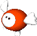</td>
  </tr>
</table>

Cute monster that resembles a ball with wings and heart-shaped feet. 
Often defeated by other monsters, resulting in the attacker leveling up. 
Found around 1\~20F in post-game dungeons, and often causes a Cave Mamel 
or Mid Chintala to be generated on 1F of Road to the End in particular. 
Usually you'd want to defeat it before another monster levels up, but it can be used to gain more experience or capture a higher level monster for Monster Kingdom. 
Runs away from Shiren, but attacks when there is nowhere else to run.

<table class="itemTable">
  <tr>
    <th>Lv</th>
    <th>Name</th>
    <th>HP</th>
    <th>Atk</th>
    <th>Def</th>
    <th>Exp</th>
    <th>Elem.</th>
    <th>Sleep</th>
    <th>Wake</th>
    <th>Drop</th>
    <th>Sp</th>
    <th>Notes</th>
  </tr>
  <tr>
    <td>1</td>
    <td>Snacky</td>
    <td>6</td>
    <td>1</td>
    <td>1</td>
    <td>1</td>
    <td>Slow</td>
    <td>0%</td>
    <td>1 Tile</td>
    <td>1%</td>
    <td>-</td>
    <td>Runs away from Shiren. Other monsters prioritize Snacky.</td>
  </tr>
</table>

#### Ally / Possession Staff

<table class="itemTable">
  <tr>
    <th>Name</th>
    <th>Max Lv</th>
    <th>HP+</th>
    <th>Atk+</th>
    <th>Max HP</th>
    <th>Max Atk</th>
    <th>Ally</th>
    <th>Possession</th>
  </tr>
  <tr>
    <td>Snacky</td>
    <td>50</td>
    <td>1</td>
    <td>1</td>
    <td>56</td>
    <td>51</td>
    <td>Other monsters prioritize Snacky. The attacker levels up when they defeat an ally Snacky.</td>
    <td>Other monsters prioritize Snacky.</td>
  </tr>
</table>

### Tiny Phoenix

<table>
  <tr>
    <th>Tiny Phoenix</th>
  </tr>
  <tr>
    <td class="itemPageImage">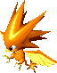</td>
  </tr>
</table>

Bird monster that has a body made of fire. 
Warps to a hurt monster and restores their HP by 50 points. 
Immune to fire attacks, but still takes damage from explosions.

<table class="itemTable">
  <tr>
    <th>Lv</th>
    <th>Name</th>
    <th>HP</th>
    <th>Atk</th>
    <th>Def</th>
    <th>Exp</th>
    <th>Elem.</th>
    <th>Sleep</th>
    <th>Wake</th>
    <th>Drop</th>
    <th>Sp</th>
    <th>Notes</th>
  </tr>
  <tr>
    <td>1</td>
    <td>Tiny Phoenix</td>
    <td>75</td>
    <td>23</td>
    <td>29</td>
    <td>350</td>
    <td>Floating</td>
    <td>0%</td>
    <td>High</td>
    <td>3%</td>
    <td>50%</td>
    <td>Warps to a hurt monster within 10 tiles of Shiren and restores 50 HP. Heals from afar if it can't move. Special use rate increases to 75% if it doesn't warp. Immune to fire damage.</td>
  </tr>
</table>

#### Ally / Possession Staff

<table class="itemTable">
  <tr>
    <th>Name</th>
    <th>Max Lv</th>
    <th>HP+</th>
    <th>Atk+</th>
    <th>Max HP</th>
    <th>Max Atk</th>
    <th>Ally</th>
    <th>Possession</th>
  </tr>
  <tr>
    <td>Tiny Phoenix</td>
    <td>10</td>
    <td>2</td>
    <td>1</td>
    <td>95</td>
    <td>33</td>
    <td>Restores 50 HP to a hurt ally within view.</td>
    <td>Special: Restores 50 HP to an adjacent ally.</td>
  </tr>
</table>

### Escargon

<table>
  <tr>
    <th>Escargon</th>
  </tr>
  <tr>
    <td class="itemPageImage">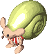</td>
  </tr>
</table>

Small monster who hides inside a yellow shell. 
Capable of reflecting staff magic, but scrolls and thrown staves are effective. 
Warps in front of the target monster to protect them when Shiren swings a staff. 
Work around its ability by swinging the staff when the target is adjacent to you.

<table class="itemTable">
  <tr>
    <th>Lv</th>
    <th>Name</th>
    <th>HP</th>
    <th>Atk</th>
    <th>Def</th>
    <th>Exp</th>
    <th>Elem.</th>
    <th>Sleep</th>
    <th>Wake</th>
    <th>Drop</th>
    <th>Sp</th>
    <th>Notes</th>
  </tr>
  <tr>
    <td>1</td>
    <td>Escargon</td>
    <td>119</td>
    <td>25</td>
    <td>40</td>
    <td>800</td>
    <td>-</td>
    <td>0%</td>
    <td>High</td>
    <td>1%</td>
    <td>-</td>
    <td>Reflects staff magic. Warps in front of a monster and reflects the magic bullet if the monster was about to get hit. Can't act next turn after warping. Can't warp if there isn't a gap.</td>
  </tr>
</table>

#### Ally / Possession Staff

<table class="itemTable">
  <tr>
    <th>Name</th>
    <th>Max Lv</th>
    <th>HP+</th>
    <th>Atk+</th>
    <th>Max HP</th>
    <th>Max Atk</th>
    <th>Ally</th>
    <th>Possession</th>
  </tr>
  <tr>
    <td>Escargon</td>
    <td>50</td>
    <td>1</td>
    <td>1</td>
    <td>169</td>
    <td>75</td>
    <td>Reflects staff magic. Warps in front of an ally and reflects the magic bullet if the ally was about to get hit. Can't act next turn after warping. Can't warp if there isn't a gap.</td>
    <td>Reflects staff magic.</td>
  </tr>
</table>

### Queen Spider

<table>
  <tr>
    <th>Queen Spider</th>
  </tr>
  <tr>
    <td class="itemPageImage">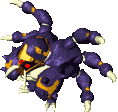</td>
  </tr>
</table>

Boss of Shuten Trail Hard. Its special attack spawns 3 Armor Spiders. 
Doesn't move as a boss, and uses its special no matter where Shiren is located. 
Takes 200 damage from a pent-up-anger Surprise Pot, instantly defeating it. 
Also appears in Shrine's Hidden Hole (60F+). 
Outside of the boss encounter, it only uses its special when Shiren is in front of it.

<table class="itemTable">
  <tr>
    <th>Lv</th>
    <th>Name</th>
    <th>HP</th>
    <th>Atk</th>
    <th>Def</th>
    <th>Exp</th>
    <th>Elem.</th>
    <th>Sleep</th>
    <th>Wake</th>
    <th>Drop</th>
    <th>Sp</th>
    <th>Notes</th>
  </tr>
  <tr>
    <td>1</td>
    <td>Queen Spider</td>
    <td>170</td>
    <td>30</td>
    <td>30</td>
    <td>200</td>
    <td>-</td>
    <td>0%</td>
    <td>High</td>
    <td>0%</td>
    <td>15%</td>
    <td>Spawns 3 Armor Spiders.</td>
  </tr>
</table>

#### Ally / Possession Staff

Can only be captured in Shrine's Hidden Hole (60F+). 
Terrifyingly strong when maxed. Be wary of Gazers, since they can confuse her.

<table class="itemTable">
  <tr>
    <th>Name</th>
    <th>Max Lv</th>
    <th>HP+</th>
    <th>Atk+</th>
    <th>Max HP</th>
    <th>Max Atk</th>
    <th>Ally</th>
    <th>Possession</th>
  </tr>
  <tr>
    <td>Queen Spider</td>
    <td>120</td>
    <td>5</td>
    <td>3</td>
    <td>770</td>
    <td>390</td>
    <td>Spawns 3 ally Armor Spiders when an enemy is in front. (Max of 5 Armor Spiders)</td>
    <td>Special: Spawns 3 Armor Spiders.</td>
  </tr>
</table>

### Armor Spider

<table>
  <tr>
    <th>Armor Spider</th>
  </tr>
  <tr>
    <td class="itemPageImage">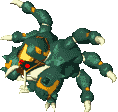</td>
  </tr>
</table>

Monster spawned by Queen Spider. No special abilities. 
Not strong 1-on-1, but Queen Spider spawns them endlessly so it's easy to get swarmed. 
Appears as a regular monster in later dungeons, starting in Onigashima.

<table class="itemTable">
  <tr>
    <th>Lv</th>
    <th>Name</th>
    <th>HP</th>
    <th>Atk</th>
    <th>Def</th>
    <th>Exp</th>
    <th>Elem.</th>
    <th>Sleep</th>
    <th>Wake</th>
    <th>Drop</th>
    <th>Sp</th>
    <th>Notes</th>
  </tr>
  <tr>
    <td>1</td>
    <td>Armor Spider</td>
    <td>55</td>
    <td>21</td>
    <td>23</td>
    <td>100</td>
    <td>-</td>
    <td>0%</td>
    <td>High</td>
    <td>3%</td>
    <td>-</td>
    <td>Direct attacks only.</td>
  </tr>
</table>

#### Ally / Possession Staff

<table class="itemTable">
  <tr>
    <th>Name</th>
    <th>Max Lv</th>
    <th>HP+</th>
    <th>Atk+</th>
    <th>Max HP</th>
    <th>Max Atk</th>
    <th>Ally / Possession</th>
  </tr>
  <tr>
    <td>Armor Spider</td>
    <td>50</td>
    <td>1</td>
    <td>1</td>
    <td>105</td>
    <td>71</td>
    <td>Direct attacks only.</td>
  </tr>
</table>

### N'dubba

<table>
  <tr>
    <th>N'dubba 1-19yr</th>
    <th>N'dubba 20-29yr</th>
    <th>N'dubba 30-59yr</th>
    <th>N'dubba 60-69yr</th>
    <th>N'dubba 70-76yr</th>
  </tr>
  <tr>
    <td class="itemPageImage">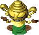</td>
    <td class="itemPageImage">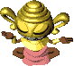</td>
    <td class="itemPageImage">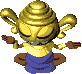</td>
    <td class="itemPageImage"></td>
    <td class="itemPageImage">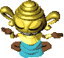</td>
  </tr>
  <tr>
    <th>N'dubba 77-87yr</th>
    <th>N'dubba 88-89yr</th>
    <th>N'dubba 90-98yr</th>
    <th>N'dubba 99yr</th>
  </tr>
  <tr>
    <td class="itemPageImage">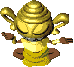</td>
    <td class="itemPageImage">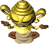</td>
    <td class="itemPageImage"></td>
    <td class="itemPageImage">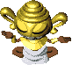</td>
  </tr>
</table>

Monster that disguises itself as an item, and attacks when someone tries to pick it up. 
Can be identified by swinging a weapon with the 識 seal over a tile with an item. 
N'dubba will vanish if the current floor's item limit has been reached. 
It's possible to pick N'dubba up as an item under certain circumstances. 
N'dubba ages as it gains levels, up to a maximum of 99 years old. 
Stats differ based on age, and some age brackets have a change in action speed. 
It's best to reserve some HP before picking up items on floors where N'dubbas appear.  
Monster Kingdom requires an N'dubba of every color for completion. The easiest way to capture them is to search inside Sealed Room, since the current floor number indicates the age of N'dubba that can be found on that floor. (Example: 99F = N'dubba 99yr) 
※ There's a bug related to swapping out N'dubba pots at Monster Kingdom.

<table class="itemTable">
  <tr>
    <th>Lv</th>
    <th>Name</th>
    <th>HP</th>
    <th>Atk</th>
    <th>Def</th>
    <th>Exp</th>
    <th>Elem.</th>
    <th>Sleep</th>
    <th>Wake</th>
    <th>Drop</th>
    <th>Sp</th>
    <th>Notes</th>
  </tr>
  <tr>
    <td>1</td>
    <td>N'dubba</td>
    <td>23</td>
    <td>10</td>
    <td>6</td>
    <td>16</td>
    <td rowspan="3">-</td>
    <td>-</td>
    <td>-</td>
    <td>0%</td>
    <td>-</td>
    <td>Disguises itself as an item and attacks Shiren when he tries to pick it up. (Green: 1-19yr)</td>
  </tr>
  <tr>
    <td>20</td>
    <td>N'dubba 20yr</td>
    <td>67</td>
    <td>29</td>
    <td>25</td>
    <td>35</td>
    <td>-</td>
    <td>-</td>
    <td>0%</td>
    <td>-</td>
    <td>Same as N'dubba. (Pink: 20-29yr)</td>
  </tr>
  <tr>
    <td>30</td>
    <td>N'dubba 30yr</td>
    <td>81</td>
    <td>39</td>
    <td>35</td>
    <td>20</td>
    <td>-</td>
    <td>-</td>
    <td>0%</td>
    <td>-</td>
    <td>Same as N'dubba. 26yr-86yr = 20 exp. (Blue: 30-59yr)</td>
  </tr>
  <tr>
    <td>60</td>
    <td>N'dubba 60yr</td>
    <td>100</td>
    <td>86</td>
    <td>45</td>
    <td>20</td>
    <td rowspan="3">Swift 1</td>
    <td>-</td>
    <td>-</td>
    <td>0%</td>
    <td>-</td>
    <td>Same as N'dubba. 60yr-77yr is Swift 1. (Red: 60-69yr)</td>
  </tr>
  <tr>
    <td>70</td>
    <td>N'dubba 70yr</td>
    <td>100</td>
    <td>106</td>
    <td>50</td>
    <td>20</td>
    <td>-</td>
    <td>-</td>
    <td>0%</td>
    <td>-</td>
    <td>Same as N'dubba. HP and Def peak. Atk still grows. (Light Blue: 70-76yr)</td>
  </tr>
  <tr>
    <td>77</td>
    <td>N'dubba 77yr</td>
    <td>100</td>
    <td>120</td>
    <td>50</td>
    <td>20</td>
    <td>-</td>
    <td>-</td>
    <td>0%</td>
    <td>-</td>
    <td>Same as N'dubba. Hits as hard as Gigahead. No longer Swift 1 after 77yr. (Yellow: 77-87yr)</td>
  </tr>
  <tr>
    <td>88</td>
    <td>N'dubba 88yr</td>
    <td>100</td>
    <td>130</td>
    <td>50</td>
    <td>4500</td>
    <td rowspan="2">-</td>
    <td>-</td>
    <td>-</td>
    <td>0%</td>
    <td>-</td>
    <td>Same as N'dubba. Atk peaks. Stats begin to decrease after 88yr. (Beige: 88-89yr)</td>
  </tr>
  <tr>
    <td>90</td>
    <td>N'dubba 90yr</td>
    <td>100</td>
    <td>100</td>
    <td>20</td>
    <td>2500</td>
    <td>-</td>
    <td>-</td>
    <td>0%</td>
    <td>-</td>
    <td>Same as N'dubba. Stat decrease greatly accelerates after 90yr. (Light Green: 90-98yr)</td>
  </tr>
  <tr>
    <td>99</td>
    <td>N'dubba 99yr</td>
    <td>1</td>
    <td>1</td>
    <td>1</td>
    <td>1</td>
    <td>Slow</td>
    <td>-</td>
    <td>-</td>
    <td>0%</td>
    <td>-</td>
    <td>Same as N'dubba. Weakest monster in the entire Shiren series. (White: 99yr)</td>
  </tr>
</table>

#### Ally / Possession Staff

N'dubba 70yr is the strongest age as an ally.

<table class="itemTable">
  <tr>
    <th>Name</th>
    <th>Max Lv</th>
    <th>HP+</th>
    <th>Atk+</th>
    <th>Max HP</th>
    <th>Max Atk</th>
    <th>Ally</th>
    <th>Possession</th>
  </tr>
  <tr>
    <td>N'dubba</td>
    <td>15</td>
    <td>1</td>
    <td>1</td>
    <td>38</td>
    <td>25</td>
    <td rowspan="9">Direct attacks only.</td>
    <td rowspan="9">Special: Transform into an item. Can't be used if there's an item, trap, or stairs underfoot, or if the item limit for the floor has been reached. Enemies ignore you, and projectiles miss. Lasts 10 turns. (Swift: 5, Slow: 20) Shiren can't act while disguised. Unlike enemy N'dubbas, characters can't step on you, so it can be used as a wall. Disguise is canceled if Shiren is defeated. Disguise is canceled if N'dubba is one-shot by a landmine or fire pillar while disguised.</td>
  </tr>
  <tr>
    <td>N'dubba 20yr</td>
    <td>38</td>
    <td>1</td>
    <td>1</td>
    <td>105</td>
    <td>67</td>
  </tr>
  <tr>
    <td>N'dubba 30yr</td>
    <td>48</td>
    <td>1</td>
    <td>1</td>
    <td>129</td>
    <td>87</td>
  </tr>
  <tr>
    <td>N'dubba 60yr</td>
    <td>42</td>
    <td>1</td>
    <td>1</td>
    <td>142</td>
    <td>128</td>
  </tr>
  <tr>
    <td>N'dubba 70yr</td>
    <td>32</td>
    <td>1</td>
    <td>1</td>
    <td>132</td>
    <td>138</td>
  </tr>
  <tr>
    <td>N'dubba 77yr</td>
    <td>14</td>
    <td>1</td>
    <td>1</td>
    <td>114</td>
    <td>134</td>
  </tr>
  <tr>
    <td>N'dubba 88yr</td>
    <td>3</td>
    <td>1</td>
    <td>1</td>
    <td>103</td>
    <td>133</td>
  </tr>
  <tr>
    <td>N'dubba 90yr</td>
    <td>1</td>
    <td>1</td>
    <td>1</td>
    <td>101</td>
    <td>101</td>
  </tr>
  <tr>
    <td>N'dubba 99yr</td>
    <td>0</td>
    <td>-</td>
    <td>-</td>
    <td>1</td>
    <td>1</td>
  </tr>
</table>

### Kengo

<table>
  <tr>
    <th>Kengo</th>
    <th>Iai</th>
    <th>Shihan</th>
  </tr>
  <tr>
    <td class="itemPageImage">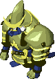</td>
    <td class="itemPageImage">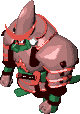</td>
    <td class="itemPageImage">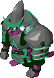</td>
  </tr>
</table>

Samurai-like monster. The No.1 disliked monster according to an official fan book. 
It can knock Shiren or Asuka's equipment away with a quick-draw sword strike. 
The only way to ensure safety is to seal it or throw an Extinction Scroll at it, since Shiren 2 lacks bracelets that protect against having equipment disarmed. 
Kengo's attack stat isn't high, so one strategy is to keep your shield unequipped.

They can be used to unequip cursed equipment, but Iai and Shihan have very high attack, so you risk collapsing unless you pour water on them to decrease their attack power first. 
Not even a Kaburasutegi+99 can one-shot Shihan, unless you've increased your strength.

<table class="itemTable">
  <tr>
    <th>Lv</th>
    <th>Name</th>
    <th>HP</th>
    <th>Atk</th>
    <th>Def</th>
    <th>Exp</th>
    <th>Elem.</th>
    <th>Sleep</th>
    <th>Wake</th>
    <th>Drop</th>
    <th>Sp</th>
    <th>Notes</th>
  </tr>
  <tr>
    <td>1</td>
    <td>Kengo</td>
    <td>42</td>
    <td>19</td>
    <td>19</td>
    <td>55</td>
    <td rowspan="3">Weapon</td>
    <td>40%</td>
    <td>High</td>
    <td>0%</td>
    <td>25%</td>
    <td>Disarms shields.</td>
  </tr>
  <tr>
    <td>2</td>
    <td>Iai</td>
    <td>80</td>
    <td>69</td>
    <td>48</td>
    <td>1450</td>
    <td>40%</td>
    <td>High</td>
    <td>3%</td>
    <td>25%</td>
    <td>Disarms shields, weapons. Item drop is always Kengo's Katana.</td>
  </tr>
  <tr>
    <td>3</td>
    <td>Shihan</td>
    <td>125</td>
    <td>90</td>
    <td>65</td>
    <td>2250</td>
    <td>40%</td>
    <td>High</td>
    <td>3%</td>
    <td>20%</td>
    <td>Disarms shields, weapons, bracelets. Item drop is always Kengo's Katana.</td>
  </tr>
</table>

#### Ally / Possession Staff

Its special attack knocks equipment away from monsters. 
Great for collecting secondary synthesis items to rapidly increase upgrade value. 
Shihan can knock bracelets away, so you can obtain Scout Bracelet with some luck. 
The chance to obtain a fixed item drop such as Minotaur's Axe using its special attack isn't 100%, but instead has the same odds as the monster's defeated drop rate.

<table class="itemTable">
  <tr>
    <th>Name</th>
    <th>Max Lv</th>
    <th>HP+</th>
    <th>Atk+</th>
    <th>Max HP</th>
    <th>Max Atk</th>
    <th>Ally / Possession</th>
  </tr>
  <tr>
    <td>Kengo</td>
    <td>15</td>
    <td>1</td>
    <td>3</td>
    <td>57</td>
    <td>64</td>
    <td>Special: Knock away a shield selected from the dungeons' floor item table. (Leather Shield if none in table)</td>
  </tr>
  <tr>
    <td>Iai</td>
    <td>15</td>
    <td>1</td>
    <td>3</td>
    <td>95</td>
    <td>114</td>
    <td>Same as Kengo, but also knocks away weapons. (Club if none in table)</td>
  </tr>
  <tr>
    <td>Shihan</td>
    <td>15</td>
    <td>1</td>
    <td>3</td>
    <td>140</td>
    <td>135</td>
    <td>Same as Iai, but also knocks away bracelets. (No Control Bracelet if none in table)</td>
  </tr>
</table>

### Taur

<table>
  <tr>
    <th>Taur</th>
    <th>Minotaur</th>
    <th>Megataur</th>
  </tr>
  <tr>
    <td class="itemPageImage">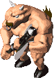</td>
    <td class="itemPageImage"></td>
    <td class="itemPageImage">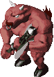</td>
  </tr>
</table>

Powerful monster that carries an axe. Oddly, it doesn't appear in Power Houses. 
Very high HP and attack, and can deal brutal hits (monster version of critical hits). The damage multiplier for brutal hits increases each time it ranks up. 
Taur can only be encountered by lowering Minotaur or Megataur's level using items like Unlucky Staff, since it doesn't naturally spawn in any dungeon. 
Its brutal hits are guaranteed to hit, even if you have equipment that raises evasion.

<table class="itemTable">
  <tr>
    <th>Lv</th>
    <th>Name</th>
    <th>HP</th>
    <th>Atk</th>
    <th>Def</th>
    <th>Exp</th>
    <th>Elem.</th>
    <th>Sleep</th>
    <th>Wake</th>
    <th>Drop</th>
    <th>Sp</th>
    <th>Notes</th>
  </tr>
  <tr>
    <td>1</td>
    <td>Taur</td>
    <td>130</td>
    <td>70</td>
    <td>60</td>
    <td>2500</td>
    <td rowspan="3">Weapon</td>
    <td>40%</td>
    <td>Low</td>
    <td>0%</td>
    <td>25%</td>
    <td>Brutal hits deal x1.3 damage.</td>
  </tr>
  <tr>
    <td>2</td>
    <td>Minotaur</td>
    <td>150</td>
    <td>80</td>
    <td>68</td>
    <td>3000</td>
    <td>40%</td>
    <td>Low</td>
    <td>10%</td>
    <td>25%</td>
    <td>Brutal hits deal x1.4 damage. Item drop is always Minotaur's Axe.</td>
  </tr>
  <tr>
    <td>3</td>
    <td>Megataur</td>
    <td>165</td>
    <td>110</td>
    <td>75</td>
    <td>5000</td>
    <td>40%</td>
    <td>Low</td>
    <td>15%</td>
    <td>25%</td>
    <td>Brutal hits deal x1.5 damage. Item drop is always Minotaur's Axe.</td>
  </tr>
</table>

#### Ally / Possession Staff

<table class="itemTable">
  <tr>
    <th>Name</th>
    <th>Max Lv</th>
    <th>HP+</th>
    <th>Atk+</th>
    <th>Max HP</th>
    <th>Max Atk</th>
    <th>Ally / Possession</th>
  </tr>
  <tr>
    <td>Taur</td>
    <td>10</td>
    <td>1</td>
    <td>4</td>
    <td>140</td>
    <td>110</td>
    <td>25% chance to deal a x1.3 damage brutal hit.</td>
  </tr>
  <tr>
    <td>Minotaur</td>
    <td>5</td>
    <td>0</td>
    <td>4</td>
    <td>150</td>
    <td>100</td>
    <td>25% chance to deal a x1.4 damage brutal hit.</td>
  </tr>
  <tr>
    <td>Megataur</td>
    <td>5</td>
    <td>0</td>
    <td>4</td>
    <td>165</td>
    <td>130</td>
    <td>25% chance to deal a x1.5 damage brutal hit.</td>
  </tr>
</table>

### Ashigarudon

<table>
  <tr>
    <th>Ashigarudon</th>
    <th>Samuraidon</th>
    <th>Taishodon</th>
    <th>Tonosamadon</th>
  </tr>
  <tr>
    <td class="itemPageImage">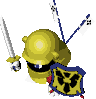</td>
    <td class="itemPageImage">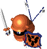</td>
    <td class="itemPageImage">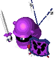</td>
    <td class="itemPageImage"></td>
  </tr>
</table>

Monster that starts out as a weakling, but equips special shields at higher ranks. 
(Lv2: Counter Shield, Lv3: Echo Shield, Lv4: Reflect Shield) 
It never drops these shields, even if you use Kengo's special attack. 
Their stats are low, but it's easy to forget what their shields reflect at different ranks.

<table class="itemTable">
  <tr>
    <th>Lv</th>
    <th>Name</th>
    <th>HP</th>
    <th>Atk</th>
    <th>Def</th>
    <th>Exp</th>
    <th>Elem.</th>
    <th>Sleep</th>
    <th>Wake</th>
    <th>Drop</th>
    <th>Sp</th>
    <th>Notes</th>
  </tr>
  <tr>
    <td>1</td>
    <td>Ashigarudon</td>
    <td>10</td>
    <td>5</td>
    <td>5</td>
    <td>6</td>
    <td rowspan="4">Weapon</td>
    <td>25%</td>
    <td>High</td>
    <td>2%</td>
    <td>-</td>
    <td>Direct attacks only.</td>
  </tr>
  <tr>
    <td>2</td>
    <td>Samuraidon</td>
    <td>23</td>
    <td>12</td>
    <td>12</td>
    <td>18</td>
    <td>25%</td>
    <td>High</td>
    <td>1%</td>
    <td>-</td>
    <td>Reflects 25% damage received.</td>
  </tr>
  <tr>
    <td>3</td>
    <td>Taishodon</td>
    <td>31</td>
    <td>16</td>
    <td>19</td>
    <td>38</td>
    <td>25%</td>
    <td>High</td>
    <td>2%</td>
    <td>-</td>
    <td>Reflects magic, except scrolls.</td>
  </tr>
  <tr>
    <td>4</td>
    <td>Tonosamadon</td>
    <td>65</td>
    <td>30</td>
    <td>33</td>
    <td>250</td>
    <td>25%</td>
    <td>High</td>
    <td>4%</td>
    <td>-</td>
    <td>Reflects projectiles.</td>
  </tr>
</table>

#### Ally / Possession Staff

<table class="itemTable">
  <tr>
    <th>Name</th>
    <th>Max Lv</th>
    <th>HP+</th>
    <th>Atk+</th>
    <th>Max HP</th>
    <th>Max Atk</th>
    <th>Ally / Possession</th>
  </tr>
  <tr>
    <td>Ashigarudon</td>
    <td>10</td>
    <td>2</td>
    <td>4</td>
    <td>30</td>
    <td>45</td>
    <td>Direct attacks only.</td>
  </tr>
  <tr>
    <td>Samuraidon</td>
    <td>10</td>
    <td>2</td>
    <td>4</td>
    <td>43</td>
    <td>52</td>
    <td>Reflects 25% damage received.</td>
  </tr>
  <tr>
    <td>Taishodon</td>
    <td>10</td>
    <td>2</td>
    <td>4</td>
    <td>51</td>
    <td>56</td>
    <td>Reflects magic, except scrolls.</td>
  </tr>
  <tr>
    <td>Tonosamadon</td>
    <td>10</td>
    <td>2</td>
    <td>4</td>
    <td>85</td>
    <td>70</td>
    <td>Reflects projectiles.</td>
  </tr>
</table>

### Porky

<table>
  <tr>
    <th>Porky</th>
    <th>Porkchop</th>
    <th>Porkton</th>
  </tr>
  <tr>
    <td class="itemPageImage">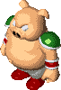</td>
    <td class="itemPageImage">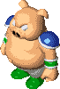</td>
    <td class="itemPageImage">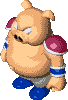</td>
  </tr>
</table>

Monster that resembles a pig. Throws stones at Shiren from a distance. 
It can throw stones at targets out of view, unlike monsters such as Wolf Droid. 
Reflect Shield can't reflect stones if a Pierce Statue is present. 
Doesn't attack if Shiren is inside a pot.

<table class="itemTable">
  <tr>
    <th>Lv</th>
    <th>Name</th>
    <th>HP</th>
    <th>Atk</th>
    <th>Def</th>
    <th>Exp</th>
    <th>Elem.</th>
    <th>Sleep</th>
    <th>Wake</th>
    <th>Drop</th>
    <th>Sp</th>
    <th>Notes</th>
  </tr>
  <tr>
    <td>1</td>
    <td>Porky</td>
    <td>70</td>
    <td>15</td>
    <td>26</td>
    <td>80</td>
    <td rowspan="3">-</td>
    <td>40%</td>
    <td>High</td>
    <td>15%</td>
    <td>45%</td>
    <td>Stone homes at a target within 2 tiles. Item drop is always Porky Stone.</td>
  </tr>
  <tr>
    <td>2</td>
    <td>Porkchop</td>
    <td>105</td>
    <td>55</td>
    <td>60</td>
    <td>1800</td>
    <td>40%</td>
    <td>High</td>
    <td>20%</td>
    <td>25%</td>
    <td>Stone homes at a target within 5 tiles. Item drop is always Porky Stone.</td>
  </tr>
  <tr>
    <td>3</td>
    <td>Porkton</td>
    <td>120</td>
    <td>60</td>
    <td>63</td>
    <td>2150</td>
    <td>40%</td>
    <td>High</td>
    <td>20%</td>
    <td>12%</td>
    <td>Stone homes at a target within 10 tiles. Item drop is always Porky Stone.</td>
  </tr>
</table>

#### Ally / Possession Staff

<table class="itemTable">
  <tr>
    <th>Name</th>
    <th>Max Lv</th>
    <th>HP+</th>
    <th>Atk+</th>
    <th>Max HP</th>
    <th>Max Atk</th>
    <th>Ally / Possession</th>
  </tr>
  <tr>
    <td>Porky</td>
    <td>20</td>
    <td>1</td>
    <td>2</td>
    <td>90</td>
    <td>55</td>
    <td></td>
  </tr>
  <tr>
    <td>Porkchop</td>
    <td>20</td>
    <td>1</td>
    <td>2</td>
    <td>125</td>
    <td>95</td>
    <td></td>
  </tr>
  <tr>
    <td>Porkton</td>
    <td>20</td>
    <td>1</td>
    <td>2</td>
    <td>140</td>
    <td>100</td>
    <td></td>
  </tr>
</table>

### Horse Ronin

<table>
  <tr>
    <th>Horse Ronin</th>
    <th>Horse Samurai</th>
    <th>Horse Shogun</th>
    <th>Horse Emperor</th>
  </tr>
  <tr>
    <td class="itemPageImage">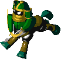</td>
    <td class="itemPageImage">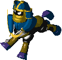</td>
    <td class="itemPageImage">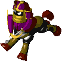</td>
    <td class="itemPageImage">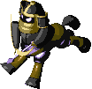</td>
  </tr>
</table>

Monster that resembles a centaur. Shoots silver arrows. 
Also uses direct attacks, unlike the Bow Boy family. 
Silver arrows pierce through targets, so it can easily defeat other monsters. 
Horse Samurai is much stronger than Horse Ronin, so be careful where you stand.

<table class="itemTable">
  <tr>
    <th>Lv</th>
    <th>Name</th>
    <th>HP</th>
    <th>Atk</th>
    <th>Def</th>
    <th>Exp</th>
    <th>Elem.</th>
    <th>Sleep</th>
    <th>Wake</th>
    <th>Drop</th>
    <th>Sp</th>
    <th>Notes</th>
  </tr>
  <tr>
    <td>1</td>
    <td>Horse Ronin</td>
    <td>26</td>
    <td>12</td>
    <td>13</td>
    <td>21</td>
    <td rowspan="4">-</td>
    <td>40%</td>
    <td>Low</td>
    <td>8%</td>
    <td>50%</td>
    <td rowspan="4">Shoots silver arrows.</td>
  </tr>
  <tr>
    <td>2</td>
    <td>Horse Samurai</td>
    <td>79</td>
    <td>35</td>
    <td>39</td>
    <td>800</td>
    <td>25%</td>
    <td>High</td>
    <td>8%</td>
    <td>60%</td>
  </tr>
  <tr>
    <td>3</td>
    <td>Horse Shogun</td>
    <td>90</td>
    <td>45</td>
    <td>58</td>
    <td>1950</td>
    <td>25%</td>
    <td>High</td>
    <td>8%</td>
    <td>60%</td>
  </tr>
  <tr>
    <td>4</td>
    <td>Horse Emperor</td>
    <td>110</td>
    <td>59</td>
    <td>61</td>
    <td>3100</td>
    <td>25%</td>
    <td>High</td>
    <td>8%</td>
    <td>60%</td>
  </tr>
</table>

#### Ally / Possession Staff

<table class="itemTable">
  <tr>
    <th>Name</th>
    <th>Max Lv</th>
    <th>HP+</th>
    <th>Atk+</th>
    <th>Max HP</th>
    <th>Max Atk</th>
    <th>Ally / Possession</th>
  </tr>
  <tr>
    <td>Horse Ronin</td>
    <td>20</td>
    <td>1</td>
    <td>1</td>
    <td>46</td>
    <td>32</td>
    <td rowspan="4">Shoots silver arrows.</td>
  </tr>
  <tr>
    <td>Horse Samurai</td>
    <td>20</td>
    <td>1</td>
    <td>1</td>
    <td>99</td>
    <td>55</td>
  </tr>
  <tr>
    <td>Horse Shogun</td>
    <td>20</td>
    <td>1</td>
    <td>1</td>
    <td>110</td>
    <td>65</td>
  </tr>
  <tr>
    <td>Horse Emperor</td>
    <td>20</td>
    <td>2</td>
    <td>2</td>
    <td>150</td>
    <td>99</td>
  </tr>
</table>

### Tiger Tosser

<table>
  <tr>
    <th>Tiger Tosser</th>
    <th>Tiger Hurler</th>
    <th>Tiger Chucker</th>
  </tr>
  <tr>
    <td class="itemPageImage">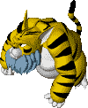</td>
    <td class="itemPageImage">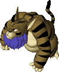</td>
    <td class="itemPageImage">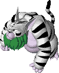</td>
  </tr>
</table>

Tiger-like monster that throws Shiren and other monsters. 
Characters receive 5 damage when bumping into each other after one is thrown. 
If a thrown monster lands on a tile with a trap, the trap always activates. 
Monsters can be reflected by Reflect Shield, and will land next to Tiger Tosser. 
Higher ranks can toss Shiren into a Monster House, so don't underestimate them.

<table class="itemTable">
  <tr>
    <th>Lv</th>
    <th>Name</th>
    <th>HP</th>
    <th>Atk</th>
    <th>Def</th>
    <th>Exp</th>
    <th>Elem.</th>
    <th>Sleep</th>
    <th>Wake</th>
    <th>Drop</th>
    <th>Sp</th>
    <th>Notes</th>
  </tr>
  <tr>
    <td>1</td>
    <td>Tiger Tosser</td>
    <td>33</td>
    <td>16</td>
    <td>15</td>
    <td>35</td>
    <td rowspan="3">-</td>
    <td>35%</td>
    <td>Low</td>
    <td>16%</td>
    <td>50%</td>
    <td>Throws characters within 5 tiles. Throws Shiren onto visible traps.</td>
  </tr>
  <tr>
    <td>2</td>
    <td>Tiger Hurler</td>
    <td>40</td>
    <td>26</td>
    <td>27</td>
    <td>65</td>
    <td>35%</td>
    <td>High</td>
    <td>16%</td>
    <td>50%</td>
    <td>Throws characters within 10 tiles. Throws Shiren onto hidden traps or into a monster house.</td>
  </tr>
  <tr>
    <td>3</td>
    <td>Tiger Chucker</td>
    <td>72</td>
    <td>62</td>
    <td>60</td>
    <td>2400</td>
    <td>35%</td>
    <td>High</td>
    <td>16%</td>
    <td>50%</td>
    <td>Same as Tiger Hurler, but 20 tiles.</td>
  </tr>
</table>

#### Ally / Possession Staff

<table class="itemTable">
  <tr>
    <th>Name</th>
    <th>Max Lv</th>
    <th>HP+</th>
    <th>Atk+</th>
    <th>Max HP</th>
    <th>Max Atk</th>
    <th>Ally</th>
    <th>Possession</th>
  </tr>
  <tr>
    <td>Tiger Tosser</td>
    <td>15</td>
    <td>3</td>
    <td>2</td>
    <td>78</td>
    <td>46</td>
    <td></td>
    <td rowspan="3">Can also throw statues.</td>
  </tr>
  <tr>
    <td>Tiger Hurler</td>
    <td>15</td>
    <td>3</td>
    <td>2</td>
    <td>85</td>
    <td>56</td>
    <td></td>
  </tr>
  <tr>
    <td>Tiger Chucker</td>
    <td>15</td>
    <td>3</td>
    <td>2</td>
    <td>117</td>
    <td>92</td>
    <td></td>
  </tr>
</table>

### King Tusker

<table>
  <tr>
    <th>King Tusker</th>
    <th>Monarch Tusker</th>
    <th>Emperor Tusker</th>
  </tr>
  <tr>
    <td class="itemPageImage">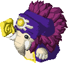</td>
    <td class="itemPageImage">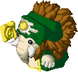</td>
    <td class="itemPageImage"></td>
  </tr>
</table>

Incarnation of an elephant that wields magic. Swings various staves based on its rank. 
(Lv1: Seal Staff, Lv2: Slow Staff, Lv3: Quarter Staff) 
Its magic can be reflected by Echo Shield, and it can drop its staff when defeated. 
Monarch Tusker's Slow Staff and Emperor Tusker's Quarter Staff are notably dangerous. 
If you get hit by Slow Staff while slowed, you'll be paralyzed and unable to act for 3 turns. 
It can slow you again while paralyzed, creating an endless loop until you collapse. Oddly, it can't use its special attack if the item count for the floor has been reached.

<table class="itemTable">
  <tr>
    <th>Lv</th>
    <th>Name</th>
    <th>HP</th>
    <th>Atk</th>
    <th>Def</th>
    <th>Exp</th>
    <th>Elem.</th>
    <th>Sleep</th>
    <th>Wake</th>
    <th>Drop</th>
    <th>Sp</th>
    <th>Notes</th>
  </tr>
  <tr>
    <td>1</td>
    <td>King Tusker</td>
    <td>55</td>
    <td>20</td>
    <td>19</td>
    <td>47</td>
    <td rowspan="3">Magic</td>
    <td>25%</td>
    <td>Low</td>
    <td>3%</td>
    <td>30%</td>
    <td>Swings a Seal Staff. Item drop is always Seal Staff.</td>
  </tr>
  <tr>
    <td>2</td>
    <td>Monarch Tusker</td>
    <td>66</td>
    <td>32</td>
    <td>26</td>
    <td>100</td>
    <td>25%</td>
    <td>Low</td>
    <td>3%</td>
    <td>35%</td>
    <td>Swings a Slow Staff. Item drop is always Slow Staff.</td>
  </tr>
  <tr>
    <td>3</td>
    <td>Emperor Tusker</td>
    <td>130</td>
    <td>98</td>
    <td>70</td>
    <td>3500</td>
    <td>25%</td>
    <td>High</td>
    <td>3%</td>
    <td>23%</td>
    <td>Swings a Quarter Staff. Item drop is always Quarter Staff.</td>
  </tr>
</table>

#### Ally / Possession Staff

<table class="itemTable">
  <tr>
    <th>Name</th>
    <th>Max Lv</th>
    <th>HP+</th>
    <th>Atk+</th>
    <th>Max HP</th>
    <th>Max Atk</th>
    <th>Ally / Possession</th>
  </tr>
  <tr>
    <td>King Tusker</td>
    <td>15</td>
    <td>2</td>
    <td>3</td>
    <td>85</td>
    <td>65</td>
    <td>Swings a Seal Staff.</td>
  </tr>
  <tr>
    <td>Monarch Tusker</td>
    <td>10</td>
    <td>2</td>
    <td>3</td>
    <td>86</td>
    <td>62</td>
    <td>Swings a Slow Staff.</td>
  </tr>
  <tr>
    <td>Emperor Tusker</td>
    <td>5</td>
    <td>2</td>
    <td>3</td>
    <td>140</td>
    <td>113</td>
    <td>Swings a Quarter Staff.</td>
  </tr>
</table>

### Bat Kangaroo

<table>
  <tr>
    <th>Bat Kangaroo</th>
    <th>Evil Kangaroo</th>
    <th>Devil Kangaroo</th>
  </tr>
  <tr>
    <td class="itemPageImage"></td>
    <td class="itemPageImage"></td>
    <td class="itemPageImage"></td>
  </tr>
</table>

Support monster that resembles a kangaroo with bat wing-like ears. 
It swings beneficial staves at other monsters even if Shiren isn't in the room. 
Evil Kangaroo can defeat Ghost type monsters with its Heal Staff and level up. 
Devil Kangaroo is truly a devilish monster in Asuka Kenzan and GB2/DS2 since it swings a staff that both doubles or triples action speed and raises special use rate to 100%. 
However, it isn't much of a threat in Shiren 2 since it just swings an Invisible Staff. Therefore, the scariest one is Bat Kangaroo, who speeds up other monsters.

<table class="itemTable">
  <tr>
    <th>Lv</th>
    <th>Name</th>
    <th>HP</th>
    <th>Atk</th>
    <th>Def</th>
    <th>Exp</th>
    <th>Elem.</th>
    <th>Sleep</th>
    <th>Wake</th>
    <th>Drop</th>
    <th>Sp</th>
    <th>Notes</th>
  </tr>
  <tr>
    <td>1</td>
    <td>Bat Kangaroo</td>
    <td>44</td>
    <td>16</td>
    <td>17</td>
    <td>52</td>
    <td rowspan="3">Magic</td>
    <td>25%</td>
    <td>High</td>
    <td>8%</td>
    <td>40%</td>
    <td>Swings a Swift Staff at monsters. Item drop is always Swift Staff.</td>
  </tr>
  <tr>
    <td>2</td>
    <td>Evil Kangaroo</td>
    <td>55</td>
    <td>24</td>
    <td>20</td>
    <td>60</td>
    <td>25%</td>
    <td>High</td>
    <td>8%</td>
    <td>40%</td>
    <td>Swings a Heal Staff at monsters. Item drop is always Heal Staff.</td>
  </tr>
  <tr>
    <td>3</td>
    <td>Devil Kangaroo</td>
    <td>65</td>
    <td>37</td>
    <td>40</td>
    <td>450</td>
    <td>25%</td>
    <td>High</td>
    <td>8%</td>
    <td>20%</td>
    <td>Swings an Invisible Staff at monsters. Item drop is always Invisible Staff.</td>
  </tr>
</table>

#### Ally / Possession Staff

<table class="itemTable">
  <tr>
    <th>Name</th>
    <th>Max Lv</th>
    <th>HP+</th>
    <th>Atk+</th>
    <th>Max HP</th>
    <th>Max Atk</th>
    <th>Ally / Possession</th>
  </tr>
  <tr>
    <td>Bat Kangaroo</td>
    <td>20</td>
    <td>3</td>
    <td>1</td>
    <td>104</td>
    <td>36</td>
    <td>Swings a Swift Staff.</td>
  </tr>
  <tr>
    <td>Evil Kangaroo</td>
    <td>20</td>
    <td>3</td>
    <td>1</td>
    <td>115</td>
    <td>44</td>
    <td>Swings a Heal Staff.</td>
  </tr>
  <tr>
    <td>Devil Kangaroo</td>
    <td>20</td>
    <td>3</td>
    <td>1</td>
    <td>125</td>
    <td>57</td>
    <td>Swings an Invisible Staff.</td>
  </tr>
</table>

### Sheep Priest

<table>
  <tr>
    <th>Sheep Priest</th>
    <th>Goat Pastor</th>
    <th>Gazelle Pope</th>
  </tr>
  <tr>
    <td class="itemPageImage"></td>
    <td class="itemPageImage"></td>
    <td class="itemPageImage"></td>
  </tr>
</table>

Monster that resembles a sheep dressed like a priest. It casts spells that temporarily reduce Shiren's stats based on its rank. 
(Lv1: Halves strength, Lv2: Halves max HP, Lv3: Halves level) 
The spell effects are stronger at higher ranks, but the spells don't last as long. 
The duration doesn't get extended if a spell is cast again while under the effect of a spell. 
All 3 spells can be reflected by Echo Shield, Sheep Priest's spell can be blocked by Salty Bracelet, and Gazelle Pope's spell can be blocked by Level Lock Bracelet.

<table class="itemTable">
  <tr>
    <th>Lv</th>
    <th>Name</th>
    <th>HP</th>
    <th>Atk</th>
    <th>Def</th>
    <th>Exp</th>
    <th>Elem.</th>
    <th>Sleep</th>
    <th>Wake</th>
    <th>Drop</th>
    <th>Sp</th>
    <th>Notes</th>
  </tr>
  <tr>
    <td>1</td>
    <td>Sheep Priest</td>
    <td>27</td>
    <td>14</td>
    <td>14</td>
    <td>32</td>
    <td rowspan="3">Magic</td>
    <td>25%</td>
    <td>High</td>
    <td>16%</td>
    <td>30%</td>
    <td>Halves max strength. (30 turns) Blocked by Echo Shield, Salty Bracelet.</td>
  </tr>
  <tr>
    <td>2</td>
    <td>Goat Pastor</td>
    <td>29</td>
    <td>17</td>
    <td>16</td>
    <td>48</td>
    <td>40%</td>
    <td>Low</td>
    <td>16%</td>
    <td>30%</td>
    <td>Halves max HP. (25 turns) Blocked by Echo Shield. Current HP is doubled when it wears off.</td>
  </tr>
  <tr>
    <td>3</td>
    <td>Gazelle Pope</td>
    <td>87</td>
    <td>55</td>
    <td>55</td>
    <td>2200</td>
    <td>25%</td>
    <td>High</td>
    <td>16%</td>
    <td>40%</td>
    <td>Halves level. (20~30 turns) Blocked by Echo Shield, Level Lock Bracelet. Current HP remains when it wears off.</td>
  </tr>
</table>

#### Ally / Possession Staff

<table class="itemTable">
  <tr>
    <th>Name</th>
    <th>Max Lv</th>
    <th>HP+</th>
    <th>Atk+</th>
    <th>Max HP</th>
    <th>Max Atk</th>
    <th>Ally / Possession</th>
  </tr>
  <tr>
    <td>Sheep Priest</td>
    <td>10</td>
    <td>3</td>
    <td>3</td>
    <td>57</td>
    <td>44</td>
    <td>Halves attack power. (25 turns)</td>
  </tr>
  <tr>
    <td>Goat Pastor</td>
    <td>10</td>
    <td>3</td>
    <td>3</td>
    <td>59</td>
    <td>47</td>
    <td>Halves max HP. (25 turns)</td>
  </tr>
  <tr>
    <td>Gazelle Pope</td>
    <td>10</td>
    <td>3</td>
    <td>3</td>
    <td>117</td>
    <td>85</td>
    <td>Halves level. (20~30 turns) Level is rounded up.</td>
  </tr>
</table>

### Nigiri Trainee

<table>
  <tr>
    <th>Nigiri Trainee</th>
    <th>Nigiri Morph</th>
    <th>Nigiri Boss</th>
    <th>Nigiri Master</th>
  </tr>
  <tr>
    <td class="itemPageImage"></td>
    <td class="itemPageImage"></td>
    <td class="itemPageImage"></td>
    <td class="itemPageImage"></td>
  </tr>
</table>

Monster with a large mouth and onigiri-shaped head. 
Its special attack transforms inventory items or Shiren into onigiri. 
This can be disasterous if a Storage Pot full of key items turns into an onigiri. 
However, it can be used to turn extra items or single arrows into onigiri to stock up on food and increase max fullness. 
Shiren's attack and defense from equipment is set to 0 as an onigiri.

Shiren 2 is more forgiving in that you won't collapse from stepping on a Spoil Trap or from receiving fire / explosion damage while turned into an onigiri. 
Nigiri monsters can be one-shot by thrown onigiri, though the throw can still miss. 
Equipped items will never be turned into Large Onigiri by Nigiri Morph. 
It only uses direct attacks when there is nothing in your inventory that can be turned into onigiri and Shiren is already turned into an onigiri.

<table class="itemTable">
  <tr>
    <th>Lv</th>
    <th>Name</th>
    <th>HP</th>
    <th>Atk</th>
    <th>Def</th>
    <th>Exp</th>
    <th>Elem.</th>
    <th>Sleep</th>
    <th>Wake</th>
    <th>Drop</th>
    <th>Sp</th>
    <th>Notes</th>
  </tr>
  <tr>
    <td>1</td>
    <td>Nigiri Trainee</td>
    <td>12</td>
    <td>5</td>
    <td>6</td>
    <td>6</td>
    <td rowspan="4">-</td>
    <td>25%</td>
    <td>High</td>
    <td>5%</td>
    <td>-</td>
    <td>Direct attacks only.</td>
  </tr>
  <tr>
    <td>2</td>
    <td>Nigiri Morph</td>
    <td>28</td>
    <td>12</td>
    <td>11</td>
    <td>28</td>
    <td>50%</td>
    <td>Low</td>
    <td>2%</td>
    <td>25%</td>
    <td>Turns 1 of Shiren or Mamo's items into a Large Onigiri. Equipped items are safe.</td>
  </tr>
  <tr>
    <td>3</td>
    <td>Nigiri Boss</td>
    <td>55</td>
    <td>24</td>
    <td>20</td>
    <td>65</td>
    <td>40%</td>
    <td>High</td>
    <td>4%</td>
    <td>25%</td>
    <td>Inflicts onigiri status.</td>
  </tr>
  <tr>
    <td>4</td>
    <td>Nigiri Master</td>
    <td>70</td>
    <td>55</td>
    <td>40</td>
    <td>1600</td>
    <td>40%</td>
    <td>High</td>
    <td>2%</td>
    <td>25%</td>
    <td>Inflicts onigiri status. Same as Nigiri Morph if Shiren or Mamo has onigiri status.</td>
  </tr>
</table>

#### Ally / Possession Staff

No special attack, but monsters defeated by it have a higher chance to drop an onigiri based on the Nigiri monster's rank.

<table class="itemTable">
  <tr>
    <th>Name</th>
    <th>Max Lv</th>
    <th>HP+</th>
    <th>Atk+</th>
    <th>Max HP</th>
    <th>Max Atk</th>
    <th>Ally / Possession</th>
  </tr>
  <tr>
    <td>Nigiri Trainee</td>
    <td>10</td>
    <td>1</td>
    <td>3</td>
    <td>22</td>
    <td>35</td>
    <td>Direct attacks only.</td>
  </tr>
  <tr>
    <td>Nigiri Morph</td>
    <td>10</td>
    <td>1</td>
    <td>3</td>
    <td>38</td>
    <td>42</td>
    <td>Defeated enemies have a 50% chance to drop an Onigiri.</td>
  </tr>
  <tr>
    <td>Nigiri Boss</td>
    <td>10</td>
    <td>2</td>
    <td>3</td>
    <td>75</td>
    <td>54</td>
    <td>Defeated enemies drop an Onigiri.</td>
  </tr>
  <tr>
    <td>Nigiri Master</td>
    <td>10</td>
    <td>2</td>
    <td>3</td>
    <td>90</td>
    <td>85</td>
    <td>Defeated enemies drop a Large Onigiri.</td>
  </tr>
</table>

### Mixer

<table>
  <tr>
    <th>Mixer</th>
    <th>Mixermon</th>
    <th>Mixergon</th>
  </tr>
  <tr>
    <td class="itemPageImage"></td>
    <td class="itemPageImage"></td>
    <td class="itemPageImage"></td>
  </tr>
</table>

Monster that eats thrown items, and if compatible, synthesizes them. 
Unlike Synthesis Pots, it can synthesize different categories like weapon + grass. 
Each item it eats powers it up: Current stats x (1.1 + (0.05 x number of items)) 
It drops eaten items when tripped or defeated. 
However, making it trip won't reset the number of times it can synthesize. 
Higher ranks can eat more items. It can't eat thrown items with piercing properties.

Recommended to check for Pierce Statues before throwing items. 
It eats items even when it's sleeping, but it won't eat items if sealed. 
It also eats traps, so you could use a Knockback Staff to have it eat a Pitfall, lead it into a shop, and then defeat it to make an easy exit inside the shop to steal. 
Mixergons found in Road to the End (50\~80F) could be a Copycat Mask monster, so consider shooting an arrow or throwing an unneeded item first. 

<table class="itemTable">
  <tr>
    <th>Lv</th>
    <th>Name</th>
    <th>HP</th>
    <th>Atk</th>
    <th>Def</th>
    <th>Exp</th>
    <th>Elem.</th>
    <th>Sleep</th>
    <th>Wake</th>
    <th>Drop</th>
    <th>Sp</th>
    <th>Notes</th>
  </tr>
  <tr>
    <td>1</td>
    <td>Mixer</td>
    <td>32</td>
    <td>19</td>
    <td>16</td>
    <td>45</td>
    <td rowspan="3">-</td>
    <td>45%</td>
    <td>Low</td>
    <td>1%</td>
    <td>-</td>
    <td>Eats 2 items and synthesizes them.</td>
  </tr>
  <tr>
    <td>2</td>
    <td>Mixermon</td>
    <td>50</td>
    <td>25</td>
    <td>21</td>
    <td>58</td>
    <td>40%</td>
    <td>Low</td>
    <td>1%</td>
    <td>-</td>
    <td>Eats 3 items and synthesizes them.</td>
  </tr>
  <tr>
    <td>3</td>
    <td>Mixergon</td>
    <td>121</td>
    <td>48</td>
    <td>52</td>
    <td>2500</td>
    <td>40%</td>
    <td>Low</td>
    <td>1%</td>
    <td>-</td>
    <td>Eats 4 items and synthesizes them.</td>
  </tr>
</table>

#### Ally / Possession Staff

<table class="itemTable">
  <tr>
    <th>Name</th>
    <th>Max Lv</th>
    <th>HP+</th>
    <th>Atk+</th>
    <th>Max HP</th>
    <th>Max Atk</th>
    <th>Ally</th>
    <th>Possession</th>
  </tr>
  <tr>
    <td>Mixer</td>
    <td>5</td>
    <td>5</td>
    <td>5</td>
    <td>57</td>
    <td>44</td>
    <td>Eats 2 thrown items and synthesizes them. Items lost if returned to pot.</td>
    <td>Eats 2 items on the ground and synthesizes them. Also eats thrown items.</td>
  </tr>
  <tr>
    <td>Mixermon</td>
    <td>5</td>
    <td>5</td>
    <td>5</td>
    <td>75</td>
    <td>50</td>
    <td colspan="2">Same as Mixer, but eats 3 items.</td>
  </tr>
  <tr>
    <td>Mixergon</td>
    <td>5</td>
    <td>5</td>
    <td>5</td>
    <td>146</td>
    <td>73</td>
    <td colspan="2">Same as Mixer, but eats 4 items.</td>
  </tr>
</table>

### Straw Voodoll

<table>
  <tr>
    <th>Straw Voodoll</th>
    <th>Nailed Voodoll</th>
    <th>Spiked Voodoll</th>
  </tr>
  <tr>
    <td class="itemPageImage"></td>
    <td class="itemPageImage"></td>
    <td class="itemPageImage"></td>
  </tr>
</table>

Monster that resembles a Voodoo Doll. Its special attack curses equipment. 
Its curse can be blocked by a Holy Shield or 祓 seal. (Holy Shield or Purify Scroll) 
Curses are seals in Shiren 2, so it can only curse equipment if there's an open slot. 
Ranks 1 and 2 only curse Shiren or Asuka, but rank 3 also curses Mamo's items.

<table class="itemTable">
  <tr>
    <th>Lv</th>
    <th>Name</th>
    <th>HP</th>
    <th>Atk</th>
    <th>Def</th>
    <th>Exp</th>
    <th>Elem.</th>
    <th>Sleep</th>
    <th>Wake</th>
    <th>Drop</th>
    <th>Sp</th>
    <th>Notes</th>
  </tr>
  <tr>
    <td>1</td>
    <td>Straw Voodoll</td>
    <td>25</td>
    <td>13</td>
    <td>15</td>
    <td>14</td>
    <td rowspan="3">-</td>
    <td>25%</td>
    <td>Low</td>
    <td>4%</td>
    <td>19%</td>
    <td>Curses equipped shields.</td>
  </tr>
  <tr>
    <td>2</td>
    <td>Nailed Voodoll</td>
    <td>80</td>
    <td>42</td>
    <td>50</td>
    <td>800</td>
    <td>25%</td>
    <td>High</td>
    <td>2%</td>
    <td>25%</td>
    <td>Curses all equipped items.</td>
  </tr>
  <tr>
    <td>3</td>
    <td>Spiked Voodoll</td>
    <td>100</td>
    <td>66</td>
    <td>54</td>
    <td>1650</td>
    <td>25%</td>
    <td>High</td>
    <td>2%</td>
    <td>15%</td>
    <td>Curses all equipment in inventory. Can't curse items in pots.</td>
  </tr>
</table>

#### Ally / Possession Staff

No special attack, but using a Possession Staff on a Voodoll instantly removes curses. 
Pretty strong as an ally thanks to a higher growth limit.

<table class="itemTable">
  <tr>
    <th>Name</th>
    <th>Max Lv</th>
    <th>HP+</th>
    <th>Atk+</th>
    <th>Max HP</th>
    <th>Max Atk</th>
    <th>Ally</th>
    <th>Possession</th>
  </tr>
  <tr>
    <td>Straw Voodoll</td>
    <td>50</td>
    <td>2</td>
    <td>1</td>
    <td>125</td>
    <td>63</td>
    <td rowspan="3">Direct attacks only.</td>
    <td>Purifies equipped shields.</td>
  </tr>
  <tr>
    <td>Nailed Voodoll</td>
    <td>50</td>
    <td>2</td>
    <td>1</td>
    <td>180</td>
    <td>92</td>
    <td>Purifies all equipped items.</td>
  </tr>
  <tr>
    <td>Spiked Voodoll</td>
    <td>50</td>
    <td>2</td>
    <td>1</td>
    <td>200</td>
    <td>116</td>
    <td>Purifies all equipment in inventory. Can't purify items in pots.</td>
  </tr>
</table>

### Weather Doll

<table>
  <tr>
    <th>Weather Doll</th>
    <th>Rainy Doll</th>
    <th>Stormy Doll</th>
    <th>Monsoon Doll</th>
  </tr>
  <tr>
    <td class="itemPageImage"></td>
    <td class="itemPageImage"></td>
    <td class="itemPageImage"></td>
    <td class="itemPageImage"></td>
  </tr>
</table>

Monster that looks like a Teru Teru Bozu with an umbrella. 
Its creates a rain cloud that lowers an equipped item's upgrade value. 
It occasionally uses its special attack even if you don't have anything equipped. 
Lv1 only uses direct attacks, and Lv2-3 special attacks can be blocked by a 金 seal.

However, Lv4 gains the powerful ability to tear off synthesized seals. 
It prioritizes erasing red 金 seals (Plating Scroll), so you can synthesize a red 金 seal instead of a blue 金 seal (Golden Sword, Golden Shield) to protect other seals. 
Unlike Gyandora, the number of seal slots remains the same after a seal is erased.

<table class="itemTable">
  <tr>
    <th>Lv</th>
    <th>Name</th>
    <th>HP</th>
    <th>Atk</th>
    <th>Def</th>
    <th>Exp</th>
    <th>Elem.</th>
    <th>Sleep</th>
    <th>Wake</th>
    <th>Drop</th>
    <th>Sp</th>
    <th>Notes</th>
  </tr>
  <tr>
    <td>1</td>
    <td>Weather Doll</td>
    <td>6</td>
    <td>6</td>
    <td>6</td>
    <td>5</td>
    <td rowspan="4">Floating</td>
    <td>25%</td>
    <td>High</td>
    <td>0%</td>
    <td>-</td>
    <td>Direct attacks only.</td>
  </tr>
  <tr>
    <td>2</td>
    <td>Rainy Doll</td>
    <td>20</td>
    <td>11</td>
    <td>14</td>
    <td>30</td>
    <td>25%</td>
    <td>High</td>
    <td>0%</td>
    <td>20%</td>
    <td>Lowers upgrade value by 1. (Weapon)</td>
  </tr>
  <tr>
    <td>3</td>
    <td>Stormy Doll</td>
    <td>65</td>
    <td>20</td>
    <td>21</td>
    <td>70</td>
    <td>25%</td>
    <td>High</td>
    <td>0%</td>
    <td>25%</td>
    <td>Lowers upgrade value by 1. (Weapon or shield)</td>
  </tr>
  <tr>
    <td>4</td>
    <td>Monsoon Doll</td>
    <td>85</td>
    <td>46</td>
    <td>50</td>
    <td>1450</td>
    <td>25%</td>
    <td>High</td>
    <td>8%</td>
    <td>18%</td>
    <td>Erases 1 synthesized seal. Prioritizes red 金 seals, and lowers upgrade value by 1 at the same time. Won't erase the following seals: Weapon: 呪, 捨, 不, 超 Shield: 呪, 捨, 重, 銀, 不, 超, 飯 Lowers upgrade value by 1 if your equipment lacks erasable seals.</td>
  </tr>
</table>

#### Ally / Possession Staff

Monsoon Doll is quite strong due to its high growth limit and ability to seal enemies. 
It's not the brightest, as it can waste turns trying to seal an enemy that is already sealed.

<table class="itemTable">
  <tr>
    <th>Name</th>
    <th>Max Lv</th>
    <th>HP+</th>
    <th>Atk+</th>
    <th>Max HP</th>
    <th>Max Atk</th>
    <th>Ally / Possession</th>
  </tr>
  <tr>
    <td>Weather Doll</td>
    <td>10</td>
    <td>5</td>
    <td>2</td>
    <td>56</td>
    <td>26</td>
    <td>Direct attacks only.</td>
  </tr>
  <tr>
    <td>Rainy Doll</td>
    <td>10</td>
    <td>5</td>
    <td>2</td>
    <td>70</td>
    <td>31</td>
    <td>Lowers enemy defense by 35%.</td>
  </tr>
  <tr>
    <td>Stormy Doll</td>
    <td>10</td>
    <td>5</td>
    <td>2</td>
    <td>115</td>
    <td>40</td>
    <td>Lowers enemy defense to 0.</td>
  </tr>
  <tr>
    <td>Monsoon Doll</td>
    <td>50</td>
    <td>2</td>
    <td>2</td>
    <td>185</td>
    <td>146</td>
    <td>Seals an enemy.</td>
  </tr>
</table>

### Zalokleft

<table>
  <tr>
    <th>Zalokleft</th>
    <th>Green Zalokleft</th>
    <th>Iron Zalokleft</th>
  </tr>
  <tr>
    <td class="itemPageImage"></td>
    <td class="itemPageImage"></td>
    <td class="itemPageImage"></td>
  </tr>
</table>

Monster resembling a small walrus or sea lion that covers its head with cloth. 
Steals an item on the ground or from Shiren's inventory, and then warps away. 
Runs away from Shiren after stealing an item, and can go underwater. 
Lv2-3 can divide when they receive damage, creating a copy of itself. 
Iron Zaloklefts can steal equipped items, so place an unneeded item on the ground if one is next to you to avoid losing your equipment. That said, they don't have much HP, so you could try to defeat it in one hit. 
Only appears in Underwater Houses inside Road to the End.

<table class="itemTable">
  <tr>
    <th>Lv</th>
    <th>Name</th>
    <th>HP</th>
    <th>Atk</th>
    <th>Def</th>
    <th>Exp</th>
    <th>Elem.</th>
    <th>Sleep</th>
    <th>Wake</th>
    <th>Drop</th>
    <th>Sp</th>
    <th>Notes</th>
  </tr>
  <tr>
    <td>1</td>
    <td>Zalokleft</td>
    <td>15</td>
    <td>0</td>
    <td>10</td>
    <td>12</td>
    <td rowspan="3">Amphibious</td>
    <td>100%</td>
    <td>3 Tiles</td>
    <td>100%</td>
    <td>50%</td>
    <td>Steals an item on the ground or from Shiren's inventory and warps. Runs from Shiren after warping. Prioritizes the most recent item to fall on the ground over Shiren. Never attacks unless sealed.</td>
  </tr>
  <tr>
    <td>2</td>
    <td>Green Zalokleft</td>
    <td>20</td>
    <td>0</td>
    <td>30</td>
    <td>13</td>
    <td>100%</td>
    <td>3 Tiles</td>
    <td>100%</td>
    <td>40%</td>
    <td>Same as Zalokleft. 30% chance to divide when hit.</td>
  </tr>
  <tr>
    <td>3</td>
    <td>Iron Zalokleft</td>
    <td>36</td>
    <td>0</td>
    <td>55</td>
    <td>14</td>
    <td>100%</td>
    <td>3 Tiles</td>
    <td>100%</td>
    <td>30%</td>
    <td>Same as Zalokleft, but also steals equipped items. Prioritizes Shiren over other items. 25% chance to divide when hit.</td>
  </tr>
</table>

#### Ally / Possession Staff

<table class="itemTable">
  <tr>
    <th>Name</th>
    <th>Max Lv</th>
    <th>HP+</th>
    <th>Atk+</th>
    <th>Max HP</th>
    <th>Max Atk</th>
    <th>Ally</th>
    <th>Possession</th>
  </tr>
  <tr>
    <td>Zalokleft</td>
    <td>50</td>
    <td>2</td>
    <td>0</td>
    <td>115</td>
    <td>1</td>
    <td rowspan="3">Drops its item when returning to its pot.</td>
    <td rowspan="3">Use special after stealing to place the stolen item. Steals the item and warps even if you dash onto an item.</td>
  </tr>
  <tr>
    <td>Green Zalokleft</td>
    <td>50</td>
    <td>2</td>
    <td>0</td>
    <td>120</td>
    <td>1</td>
  </tr>
  <tr>
    <td>Iron Zalokleft</td>
    <td>50</td>
    <td>2</td>
    <td>0</td>
    <td>136</td>
    <td>1</td>
  </tr>
</table>

### Gamarra

<table>
  <tr>
    <th>Gamarra</th>
    <th>Gamagucci</th>
    <th>Gamagon</th>
  </tr>
  <tr>
    <td class="itemPageImage"></td>
    <td class="itemPageImage"></td>
    <td class="itemPageImage"></td>
  </tr>
</table>

Monster that looks like a clasped purse. (Gamaguchi) 
Steals Gitan from Shiren, warps, and then runs away at double speed. 
Always drops Gitan when defeated, even if it didn't steal any from Shiren. 
Moves toward Gitan if it sees some on the floor, and then sits on top of it. 
Doesn't use direct attacks unless it's sealed.

<table class="itemTable">
  <tr>
    <th>Lv</th>
    <th>Name</th>
    <th>HP</th>
    <th>Atk</th>
    <th>Def</th>
    <th>Exp</th>
    <th>Elem.</th>
    <th>Sleep</th>
    <th>Wake</th>
    <th>Drop</th>
    <th>Sp</th>
    <th>Notes</th>
  </tr>
  <tr>
    <td>1</td>
    <td>Gamarra</td>
    <td>11</td>
    <td>0</td>
    <td>29</td>
    <td>6</td>
    <td rowspan="3">-</td>
    <td>0%</td>
    <td>1 Tile</td>
    <td>100%</td>
    <td>70%</td>
    <td rowspan="2">Steals 30~2000 Gitan and warps. Runs away at x2 speed afterward. Prioritizes moving toward and sitting on Gitan if it hasn't stolen. Never attacks unless sealed. Item drop is always Gitan.</td>
  </tr>
  <tr>
    <td>2</td>
    <td>Gamagucci</td>
    <td>16</td>
    <td>0</td>
    <td>35</td>
    <td>25</td>
    <td>0%</td>
    <td>1 Tile</td>
    <td>100%</td>
    <td>80%</td>
  </tr>
  <tr>
    <td>3</td>
    <td>Gamagon</td>
    <td>40</td>
    <td>0</td>
    <td>65</td>
    <td>300</td>
    <td>0%</td>
    <td>1 Tile</td>
    <td>100%</td>
    <td>25%</td>
    <td>Same as Gamarra, but it drops Gitan worth x3 the amount that can be found on the ground. (Max: 2000 Gitan)</td>
  </tr>
</table>

#### Ally / Possession Staff

<table class="itemTable">
  <tr>
    <th>Name</th>
    <th>Max Lv</th>
    <th>HP+</th>
    <th>Atk+</th>
    <th>Max HP</th>
    <th>Max Atk</th>
    <th>Ally / Possession</th>
  </tr>
  <tr>
    <td>Gamarra</td>
    <td>50</td>
    <td>2</td>
    <td>0</td>
    <td>111</td>
    <td>1</td>
    <td>Steals 30~2000 Gitan and warps. Picks bag up and warps if it steps on Gitan. Can hold a maximum of 5000 Gitan. Drops its Gitan when returning to its pot.</td>
  </tr>
  <tr>
    <td>Gamagucci</td>
    <td>50</td>
    <td>2</td>
    <td>0</td>
    <td>116</td>
    <td>1</td>
    <td>Same as Gamarra. Can hold 10000 Gitan.</td>
  </tr>
  <tr>
    <td>Gamagon</td>
    <td>50</td>
    <td>2</td>
    <td>0</td>
    <td>140</td>
    <td>1</td>
    <td>Same as Gamarra. Can hold 20000 Gitan.</td>
  </tr>
</table>

### Gyadon

<table>
  <tr>
    <th>Gyadon</th>
    <th>Gyairas</th>
    <th>Gyandora</th>
  </tr>
  <tr>
    <td class="itemPageImage"></td>
    <td class="itemPageImage"></td>
    <td class="itemPageImage"></td>
  </tr>
</table>

Monster resembling a pterodactyl. 
Plucks items from Shiren's inventory and modifies them in negative ways. 
Plucked items fall to the ground beneath Gyadon. 
It uses direct attacks, unlike other monsters that steal from Shiren. 
It also performs its special attack against Asuka and Mamo. 
Gyandora is particularly mean, since it can lower synthesis slot count of equipment, including equipped items, or make items in pots vanish while reducing the pot's size. 
Its plucking special attack can be blocked by a Walrus Shield. 
For some unknown reason, it can appear in Magic Houses. 

<table class="itemTable">
  <tr>
    <th>Lv</th>
    <th>Name</th>
    <th>HP</th>
    <th>Atk</th>
    <th>Def</th>
    <th>Exp</th>
    <th>Elem.</th>
    <th>Sleep</th>
    <th>Wake</th>
    <th>Drop</th>
    <th>Sp</th>
    <th>Notes</th>
  </tr>
  <tr>
    <td>1</td>
    <td>Gyadon</td>
    <td>40</td>
    <td>23</td>
    <td>17</td>
    <td>90</td>
    <td rowspan="3">Floating</td>
    <td>25%</td>
    <td>High</td>
    <td>1%</td>
    <td>50%</td>
    <td>Plucks a staff from Shiren's inventory and lowers its use count by 1. Can't pluck staves in pots. The plucked item is lost if there's no space for the item below Gyadon.</td>
  </tr>
  <tr>
    <td>2</td>
    <td>Gyairas</td>
    <td>65</td>
    <td>39</td>
    <td>45</td>
    <td>230</td>
    <td>25%</td>
    <td>High</td>
    <td>3%</td>
    <td>25%</td>
    <td>Same as Gyadon, but also plucks pots, shrinking size by 1 if the pot wasn't full.</td>
  </tr>
  <tr>
    <td>3</td>
    <td>Gyandora</td>
    <td>86</td>
    <td>60</td>
    <td>58</td>
    <td>500</td>
    <td>25%</td>
    <td>High</td>
    <td>1%</td>
    <td>16%</td>
    <td>Same as Gyairas, but also plucks full pots, shrinking size by 1 while making the selected slot's item vanish. Also plucks equipment, erasing a seal along with lowering slot count.</td>
  </tr>
</table>

#### Ally / Possession Staff

It only uses direct attacks, despite having such an annoying ability as an enemy.

<table class="itemTable">
  <tr>
    <th>Name</th>
    <th>Max Lv</th>
    <th>HP+</th>
    <th>Atk+</th>
    <th>Max HP</th>
    <th>Max Atk</th>
    <th>Ally / Possession</th>
  </tr>
  <tr>
    <td>Gyadon</td>
    <td>20</td>
    <td>1</td>
    <td>1</td>
    <td>60</td>
    <td>43</td>
    <td rowspan="3">Direct attacks only.</td>
  </tr>
  <tr>
    <td>Gyairas</td>
    <td>20</td>
    <td>1</td>
    <td>1</td>
    <td>85</td>
    <td>59</td>
  </tr>
  <tr>
    <td>Gyandora</td>
    <td>20</td>
    <td>1</td>
    <td>1</td>
    <td>106</td>
    <td>80</td>
  </tr>
</table>

### Dragon

<table>
  <tr>
    <th>Dragon</th>
    <th>Sky Dragon</th>
    <th>Archdragon</th>
  </tr>
  <tr>
    <td class="itemPageImage"></td>
    <td class="itemPageImage"></td>
    <td class="itemPageImage"></td>
  </tr>
</table>

Dragon monster that can breathe fire to deal damage from a distance. 
The flame never misses and deals fixed damage. Higher ranks have greater range. 
竜 (Dragon Shield) and 火 (Flame Grass, Dragon Grass) seals reduce fire damage. 
It's often sleeping when it spawns, and has a high item drop rate.

Archdragon's ability to breathe fire from anywhere on the current floor is quite mean, so keep some healing items on hand if you're in a dungeon where they can spawn. Archdragons can appear as early as 30F in Road to the End.

<table class="itemTable">
  <tr>
    <th>Lv</th>
    <th>Name</th>
    <th>HP</th>
    <th>Atk</th>
    <th>Def</th>
    <th>Exp</th>
    <th>Elem.</th>
    <th>Sleep</th>
    <th>Wake</th>
    <th>Drop</th>
    <th>Sp</th>
    <th>Notes</th>
  </tr>
  <tr>
    <td>1</td>
    <td>Dragon</td>
    <td>80</td>
    <td>37</td>
    <td>38</td>
    <td>350</td>
    <td rowspan="3">Dragon</td>
    <td>40%</td>
    <td>Low</td>
    <td>60%</td>
    <td>50%</td>
    <td>Breathes fire in a straight line. Flame deals 20 damage.</td>
  </tr>
  <tr>
    <td>2</td>
    <td>Sky Dragon</td>
    <td>85</td>
    <td>45</td>
    <td>43</td>
    <td>450</td>
    <td>50%</td>
    <td>Low</td>
    <td>65%</td>
    <td>25%</td>
    <td>Breathes fire at a target within view. Flame deals 30 damage.</td>
  </tr>
  <tr>
    <td>3</td>
    <td>Archdragon</td>
    <td>110</td>
    <td>55</td>
    <td>55</td>
    <td>1300</td>
    <td>60%</td>
    <td>Low</td>
    <td>70%</td>
    <td>12%</td>
    <td>Breathes fire at a target on the current floor, including those inside walls. Flame deals 35 damage.</td>
  </tr>
</table>

#### Ally / Possession Staff

<table class="itemTable">
  <tr>
    <th>Name</th>
    <th>Max Lv</th>
    <th>HP+</th>
    <th>Atk+</th>
    <th>Max HP</th>
    <th>Max Atk</th>
    <th>Ally</th>
    <th>Possession</th>
  </tr>
  <tr>
    <td>Dragon</td>
    <td>30</td>
    <td>2</td>
    <td>2</td>
    <td>140</td>
    <td>97</td>
    <td colspan="2">Breathes fire in a straight line. (20 damage)</td>
  </tr>
  <tr>
    <td>Sky Dragon</td>
    <td>25</td>
    <td>2</td>
    <td>2</td>
    <td>135</td>
    <td>95</td>
    <td colspan="2">Breathes fire at a target within view. (30 damage)</td>
  </tr>
  <tr>
    <td>Archdragon</td>
    <td>20</td>
    <td>2</td>
    <td>2</td>
    <td>150</td>
    <td>95</td>
    <td>Breathes fire at a target within view. (35 damage)</td>
    <td>Breathes fire at a target on the current floor, including those inside walls. (35 damage)</td>
  </tr>
</table>

### Shagga

<table>
  <tr>
    <th>Shagga</th>
    <th>Nashagga</th>
    <th>Lashagga</th>
  </tr>
  <tr>
    <td class="itemPageImage"></td>
    <td class="itemPageImage"></td>
    <td class="itemPageImage"></td>
  </tr>
</table>

Snake-like monster with four arms. Higher ranks attack multiple times during the same turn. 
The number of attacks doesn't change, even if its speed is doubled or tripled. 
However, sealing it removes this limit, so a double speed Shagga would attack twice.

<table class="itemTable">
  <tr>
    <th>Lv</th>
    <th>Name</th>
    <th>HP</th>
    <th>Atk</th>
    <th>Def</th>
    <th>Exp</th>
    <th>Elem.</th>
    <th>Sleep</th>
    <th>Wake</th>
    <th>Drop</th>
    <th>Sp</th>
    <th>Notes</th>
  </tr>
  <tr>
    <td>1</td>
    <td>Shagga</td>
    <td>37</td>
    <td>19</td>
    <td>18</td>
    <td>35</td>
    <td rowspan="3">Dragon Weapon</td>
    <td>30%</td>
    <td>Low</td>
    <td>16%</td>
    <td>-</td>
    <td>1 attack, regardless of speed.</td>
  </tr>
  <tr>
    <td>2</td>
    <td>Nashagga</td>
    <td>85</td>
    <td>36</td>
    <td>50</td>
    <td>1150</td>
    <td>30%</td>
    <td>High</td>
    <td>8%</td>
    <td>-</td>
    <td>2 attacks, regardless of speed.</td>
  </tr>
  <tr>
    <td>3</td>
    <td>Lashagga</td>
    <td>100</td>
    <td>58</td>
    <td>63</td>
    <td>1500</td>
    <td>30%</td>
    <td>High</td>
    <td>8%</td>
    <td>-</td>
    <td>3 attacks, regardless of speed.</td>
  </tr>
</table>

#### Ally / Possession Staff

Possession allows for more attacks than when it's encountered as an enemy.

<table class="itemTable">
  <tr>
    <th>Name</th>
    <th>Max Lv</th>
    <th>HP+</th>
    <th>Atk+</th>
    <th>Max HP</th>
    <th>Max Atk</th>
    <th>Ally</th>
    <th>Possession</th>
  </tr>
  <tr>
    <td>Shagga</td>
    <td>15</td>
    <td>1</td>
    <td>3</td>
    <td>52</td>
    <td>64</td>
    <td>1 attack, regardless of speed.</td>
    <td>3 attacks per turn.</td>
  </tr>
  <tr>
    <td>Nashagga</td>
    <td>10</td>
    <td>1</td>
    <td>3</td>
    <td>95</td>
    <td>66</td>
    <td>2 attacks, regardless of speed.</td>
    <td>4 attacks per turn.</td>
  </tr>
  <tr>
    <td>Lashagga</td>
    <td>5</td>
    <td>1</td>
    <td>3</td>
    <td>105</td>
    <td>73</td>
    <td>3 attacks, regardless of speed.</td>
    <td>5 attacks per turn.</td>
  </tr>
</table>

### Bone Dragon

<table>
  <tr>
    <th>Bone Dragon</th>
    <th>Skull Dragon</th>
    <th>Garm Dragon</th>
  </tr>
  <tr>
    <td class="itemPageImage"></td>
    <td class="itemPageImage"></td>
    <td class="itemPageImage"></td>
  </tr>
</table>

Monster consisting of dragon bones. 
It has higher stats to make up for the lack of a special attack. 
The only monster to have 2 weaknesses, since it's both Ghost and Dragon type. 
Easily defeated by weapons that have 仏 (Ghost Sickle) and 竜 (Dragon Killer) seals. 
Bone Dragon has a higher item drop rate.

<table class="itemTable">
  <tr>
    <th>Lv</th>
    <th>Name</th>
    <th>HP</th>
    <th>Atk</th>
    <th>Def</th>
    <th>Exp</th>
    <th>Elem.</th>
    <th>Sleep</th>
    <th>Wake</th>
    <th>Drop</th>
    <th>Sp</th>
    <th>Notes</th>
  </tr>
  <tr>
    <td>1</td>
    <td>Bone Dragon</td>
    <td>61</td>
    <td>23</td>
    <td>20</td>
    <td>57</td>
    <td rowspan="3">Dragon Ghost</td>
    <td>35%</td>
    <td>High</td>
    <td>32%</td>
    <td>-</td>
    <td rowspan="3">Direct attacks only. The only monster that has 2 type-effective weaknesses.</td>
  </tr>
  <tr>
    <td>2</td>
    <td>Skull Dragon</td>
    <td>80</td>
    <td>48</td>
    <td>35</td>
    <td>400</td>
    <td>35%</td>
    <td>High</td>
    <td>0%</td>
    <td>-</td>
  </tr>
  <tr>
    <td>3</td>
    <td>Garm Dragon</td>
    <td>132</td>
    <td>104</td>
    <td>62</td>
    <td>3500</td>
    <td>35%</td>
    <td>High</td>
    <td>0%</td>
    <td>-</td>
  </tr>
</table>

#### Ally / Possession Staff

<table class="itemTable">
  <tr>
    <th>Name</th>
    <th>Max Lv</th>
    <th>HP+</th>
    <th>Atk+</th>
    <th>Max HP</th>
    <th>Max Atk</th>
    <th>Ally / Possession</th>
  </tr>
  <tr>
    <td>Bone Dragon</td>
    <td>20</td>
    <td>2</td>
    <td>3</td>
    <td>101</td>
    <td>83</td>
    <td rowspan="3">Direct attacks only.</td>
  </tr>
  <tr>
    <td>Skull Dragon</td>
    <td>15</td>
    <td>2</td>
    <td>3</td>
    <td>110</td>
    <td>93</td>
  </tr>
  <tr>
    <td>Garm Dragon</td>
    <td>5</td>
    <td>2</td>
    <td>3</td>
    <td>142</td>
    <td>119</td>
  </tr>
</table>

### Pumphantasm

<table>
  <tr>
    <th>Pumphantasm</th>
    <th>Pumphantom</th>
    <th>Pumpking</th>
  </tr>
  <tr>
    <td class="itemPageImage"></td>
    <td class="itemPageImage"></td>
    <td class="itemPageImage"></td>
  </tr>
</table>

Monster born from a pumpkin that went rotten as a result of no one eating it. 
It can pass through walls, and moves in a random pattern that resembles confusion. 
However, it unmistakably approaches Shiren despite its unpredictable movement. 
Shiren has a unique animation when he's hit by Pumphantasm monsters.

<table class="itemTable">
  <tr>
    <th>Lv</th>
    <th>Name</th>
    <th>HP</th>
    <th>Atk</th>
    <th>Def</th>
    <th>Exp</th>
    <th>Elem.</th>
    <th>Sleep</th>
    <th>Wake</th>
    <th>Drop</th>
    <th>Sp</th>
    <th>Notes</th>
  </tr>
  <tr>
    <td>1</td>
    <td>Pumphantasm</td>
    <td>38</td>
    <td>20</td>
    <td>16</td>
    <td>50</td>
    <td rowspan="3">Ghost Flying Wall-clip</td>
    <td>0%</td>
    <td>High</td>
    <td>0%</td>
    <td>-</td>
    <td rowspan="3">Can pass through walls. Moves unpredictably.</td>
  </tr>
  <tr>
    <td>2</td>
    <td>Pumphantom</td>
    <td>50</td>
    <td>24</td>
    <td>18</td>
    <td>60</td>
    <td>0%</td>
    <td>High</td>
    <td>0%</td>
    <td>-</td>
  </tr>
  <tr>
    <td>3</td>
    <td>Pumpking</td>
    <td>80</td>
    <td>60</td>
    <td>43</td>
    <td>950</td>
    <td>0%</td>
    <td>High</td>
    <td>0%</td>
    <td>-</td>
  </tr>
</table>

#### Ally / Possession Staff

<table class="itemTable">
  <tr>
    <th>Name</th>
    <th>Max Lv</th>
    <th>HP+</th>
    <th>Atk+</th>
    <th>Max HP</th>
    <th>Max Atk</th>
    <th>Ally</th>
    <th>Possession</th>
  </tr>
  <tr>
    <td>Pumphantasm</td>
    <td>15</td>
    <td>1</td>
    <td>5</td>
    <td>53</td>
    <td>95</td>
    <td rowspan="3">Can pass through walls. Moves unpredictably.</td>
    <td rowspan="3">Can pass through walls. Moves normally.</td>
  </tr>
  <tr>
    <td>Pumphantom</td>
    <td>15</td>
    <td>1</td>
    <td>5</td>
    <td>65</td>
    <td>99</td>
  </tr>
  <tr>
    <td>Pumpking</td>
    <td>15</td>
    <td>1</td>
    <td>5</td>
    <td>95</td>
    <td>135</td>
  </tr>
</table>

### Gale

<table>
  <tr>
    <th>Gale</th>
    <th>Whirlwind</th>
    <th>Kamikaze</th>
    <th>Typhoon</th>
  </tr>
  <tr>
    <td class="itemPageImage"></td>
    <td class="itemPageImage"></td>
    <td class="itemPageImage"></td>
    <td class="itemPageImage"></td>
  </tr>
</table>

Speed type monster that wields two swords. 
Higher ranks have increased action speed, and Typhoon can pass through walls. 
Typhoon detects Shiren from any location, so it'll rush at him if it's awake when it spawns. 
Avoid being ambushed by passing some turns at the start before heading into a hallway. 
Gale doesn't have the flying element, so it's the only one that can't move over water. 
Kamikaze doesn't naturally spawn inside Road to the End.

<table class="itemTable">
  <tr>
    <th>Lv</th>
    <th>Name</th>
    <th>HP</th>
    <th>Atk</th>
    <th>Def</th>
    <th>Exp</th>
    <th>Elem.</th>
    <th>Sleep</th>
    <th>Wake</th>
    <th>Drop</th>
    <th>Sp</th>
    <th>Notes</th>
  </tr>
  <tr>
    <td>1</td>
    <td>Gale</td>
    <td>35</td>
    <td>18</td>
    <td>18</td>
    <td>35</td>
    <td>Ghost Weapon Floating Swift 1</td>
    <td>50%</td>
    <td>Low</td>
    <td>8%</td>
    <td>-</td>
    <td>Moves at double speed, but only attacks once.</td>
  </tr>
  <tr>
    <td>2</td>
    <td>Whirlwind</td>
    <td>60</td>
    <td>18</td>
    <td>23</td>
    <td>85</td>
    <td>Ghost Weapon Flying Swift 1</td>
    <td>25%</td>
    <td>High</td>
    <td>8%</td>
    <td>-</td>
    <td>Acts at double speed.</td>
  </tr>
  <tr>
    <td>3</td>
    <td>Kamikaze</td>
    <td>100</td>
    <td>33</td>
    <td>55</td>
    <td>200</td>
    <td>Ghost Weapon Flying Swift 2</td>
    <td>25%</td>
    <td>High</td>
    <td>8%</td>
    <td>-</td>
    <td>Acts at triple speed.</td>
  </tr>
  <tr>
    <td>4</td>
    <td>Typhoon</td>
    <td>133</td>
    <td>58</td>
    <td>66</td>
    <td>4000</td>
    <td>Ghost Weapon Flying Wall-clip Swift 2</td>
    <td>25%</td>
    <td>High</td>
    <td>8%</td>
    <td>-</td>
    <td>Can pass through walls. Acts at triple speed.</td>
  </tr>
</table>

#### Ally / Possession Staff

<table class="itemTable">
  <tr>
    <th>Name</th>
    <th>Max Lv</th>
    <th>HP+</th>
    <th>Atk+</th>
    <th>Max HP</th>
    <th>Max Atk</th>
    <th>Ally</th>
    <th>Possession</th>
  </tr>
  <tr>
    <td>Gale</td>
    <td>5</td>
    <td>2</td>
    <td>2</td>
    <td>45</td>
    <td>28</td>
    <td>Moves at double speed, but only attacks once.</td>
    <td>Acts at double speed.</td>
  </tr>
  <tr>
    <td>Whirlwind</td>
    <td>5</td>
    <td>2</td>
    <td>2</td>
    <td>70</td>
    <td>28</td>
    <td colspan="2">Acts at double speed.</td>
  </tr>
  <tr>
    <td>Kamikaze</td>
    <td>5</td>
    <td>0</td>
    <td>2</td>
    <td>100</td>
    <td>43</td>
    <td colspan="2">Acts at triple speed.</td>
  </tr>
  <tr>
    <td>Typhoon</td>
    <td>5</td>
    <td>0</td>
    <td>2</td>
    <td>133</td>
    <td>68</td>
    <td colspan="2">Can pass through walls. Acts at triple speed.</td>
  </tr>
</table>

### Yamikichi

<table>
  <tr>
    <th>Yamikichi</th>
    <th>Warukichi</th>
    <th>Zurukichi</th>
  </tr>
  <tr>
    <td class="itemPageImage"></td>
    <td class="itemPageImage"></td>
    <td class="itemPageImage"></td>
  </tr>
</table>

A small reaper-like monster that rides on a cloud. 
No special abilities outside of having the floating element. 
Zurukichi has 101 HP, so it survives getting hit by Heal Staff or Otogiriso with 1 HP left. Its name includes Zurui, which is along the lines of cheating / unfair in Japanese, so you could say it's a fitting name for a Ghost type that survives with 1 HP.

<table class="itemTable">
  <tr>
    <th>Lv</th>
    <th>Name</th>
    <th>HP</th>
    <th>Atk</th>
    <th>Def</th>
    <th>Exp</th>
    <th>Elem.</th>
    <th>Sleep</th>
    <th>Wake</th>
    <th>Drop</th>
    <th>Sp</th>
    <th>Notes</th>
  </tr>
  <tr>
    <td>1</td>
    <td>Yamikichi</td>
    <td>10</td>
    <td>6</td>
    <td>6</td>
    <td>6</td>
    <td rowspan="3">Ghost Weapon Flying</td>
    <td>25%</td>
    <td>High</td>
    <td>6%</td>
    <td>-</td>
    <td rowspan="3">Direct attacks only.</td>
  </tr>
  <tr>
    <td>2</td>
    <td>Warukichi</td>
    <td>21</td>
    <td>16</td>
    <td>12</td>
    <td>25</td>
    <td>25%</td>
    <td>High</td>
    <td>3%</td>
    <td>-</td>
  </tr>
  <tr>
    <td>3</td>
    <td>Zurukichi</td>
    <td>101</td>
    <td>49</td>
    <td>35</td>
    <td>790</td>
    <td>25%</td>
    <td>High</td>
    <td>6%</td>
    <td>-</td>
  </tr>
</table>

#### Ally / Possession Staff

<table class="itemTable">
  <tr>
    <th>Name</th>
    <th>Max Lv</th>
    <th>HP+</th>
    <th>Atk+</th>
    <th>Max HP</th>
    <th>Max Atk</th>
    <th>Ally / Possession</th>
  </tr>
  <tr>
    <td>Yamikichi</td>
    <td>15</td>
    <td>1</td>
    <td>2</td>
    <td>25</td>
    <td>36</td>
    <td rowspan="3">Direct attacks only.</td>
  </tr>
  <tr>
    <td>Warukichi</td>
    <td>15</td>
    <td>1</td>
    <td>2</td>
    <td>36</td>
    <td>46</td>
  </tr>
  <tr>
    <td>Zurukichi</td>
    <td>15</td>
    <td>1</td>
    <td>2</td>
    <td>116</td>
    <td>79</td>
  </tr>
</table>

### Twisty Hani

<table>
  <tr>
    <th>Twisty Hani</th>
  </tr>
  <tr>
    <td class="itemPageImage"></td>
  </tr>
</table>

Monster that has the appearance of a Haniwa. (clay figure) 
Performs a twisty dance that lowers a target's level by 1. 
A Level Lock Bracelet nullifies the dance's level down effect. 
It can't use its special attack against a target that is already level 1. 
Always spawns asleep, and wakes up when you move within 1 tile of it. 
Its high special use rate means you'll rapidly lose levels if you don't defeat it quickly. 
However, it has a high item drop rate and offers a decent amount of experience, so it may be worth the trouble to attack it. If you do so, it's safer to attack from a distance using arrows, stones, or cannonballs.

<table class="itemTable">
  <tr>
    <th>Lv</th>
    <th>Name</th>
    <th>HP</th>
    <th>Atk</th>
    <th>Def</th>
    <th>Exp</th>
    <th>Elem.</th>
    <th>Sleep</th>
    <th>Wake</th>
    <th>Drop</th>
    <th>Sp</th>
    <th>Notes</th>
  </tr>
  <tr>
    <td>1</td>
    <td>Twisty Hani</td>
    <td>50</td>
    <td>30</td>
    <td>30</td>
    <td>300</td>
    <td>Drain</td>
    <td>100%</td>
    <td>1 Tile</td>
    <td>35%</td>
    <td>80%</td>
    <td>Lowers a target's level by 1.</td>
  </tr>
</table>

#### Ally / Possession Staff

<table class="itemTable">
  <tr>
    <th>Name</th>
    <th>Max Lv</th>
    <th>HP+</th>
    <th>Atk+</th>
    <th>Max HP</th>
    <th>Max Atk</th>
    <th>Ally / Possession</th>
  </tr>
  <tr>
    <td>Twisty Hani</td>
    <td>30</td>
    <td>1</td>
    <td>1</td>
    <td>80</td>
    <td>60</td>
    <td>Lowers a target's level by 1.</td>
  </tr>
</table>

### Slug

<table>
  <tr>
    <th>Slug</th>
    <th>Serious Slug</th>
    <th>Rancor Slug</th>
    <th>Intolerable Slug</th>
  </tr>
  <tr>
    <td class="itemPageImage"></td>
    <td class="itemPageImage"></td>
    <td class="itemPageImage"></td>
    <td class="itemPageImage"></td>
  </tr>
</table>

Monster that resembles a slug. Licks Shiren and lowers his strength. 
Salty Bracelet or the poison immunity effect from a Special Onigiri blocks its licks. 
Scale Shield (う and 消 seals) can't block the strength lowering effect of licks. 
Uses its special attack even if the target's strength is already 0. 
Thrown Antidote Grass deals 50 damage, which is enough to one-shot Lv1-2 slugs. 
Strength is extremely important in Shiren 2, so don't hesitate to use items. 
Lv3-4 can divide when they receive damage, creating a copy of itself.

<table class="itemTable">
  <tr>
    <th>Lv</th>
    <th>Name</th>
    <th>HP</th>
    <th>Atk</th>
    <th>Def</th>
    <th>Exp</th>
    <th>Elem.</th>
    <th>Sleep</th>
    <th>Wake</th>
    <th>Drop</th>
    <th>Sp</th>
    <th>Notes</th>
  </tr>
  <tr>
    <td>1</td>
    <td>Slug</td>
    <td>11</td>
    <td>4</td>
    <td>6</td>
    <td>5</td>
    <td rowspan="4">Drain</td>
    <td>25%</td>
    <td>High</td>
    <td>1%</td>
    <td>20%</td>
    <td>Lowers strength by 1.</td>
  </tr>
  <tr>
    <td>2</td>
    <td>Serious Slug</td>
    <td>40</td>
    <td>10</td>
    <td>18</td>
    <td>35</td>
    <td>35%</td>
    <td>High</td>
    <td>1%</td>
    <td>35%</td>
    <td>Lowers max strength by 1.</td>
  </tr>
  <tr>
    <td>3</td>
    <td>Rancor Slug</td>
    <td>70</td>
    <td>38</td>
    <td>41</td>
    <td>690</td>
    <td>50%</td>
    <td>High</td>
    <td>4%</td>
    <td>18%</td>
    <td>Lowers max strength by 2. 20% chance to divide when hit.</td>
  </tr>
  <tr>
    <td>4</td>
    <td>Intolerable Slug</td>
    <td>65</td>
    <td>45</td>
    <td>40</td>
    <td>750</td>
    <td>50%</td>
    <td>High</td>
    <td>1%</td>
    <td>12%</td>
    <td>Lowers max strength by 3. 15% chance to divide when hit.</td>
  </tr>
</table>

#### Ally / Possession Staff

<table class="itemTable">
  <tr>
    <th>Name</th>
    <th>Max Lv</th>
    <th>HP+</th>
    <th>Atk+</th>
    <th>Max HP</th>
    <th>Max Atk</th>
    <th>Ally / Possession</th>
  </tr>
  <tr>
    <td>Slug</td>
    <td>40</td>
    <td>1</td>
    <td>1</td>
    <td>51</td>
    <td>44</td>
    <td>Lowers a target's attack by 10%.</td>
  </tr>
  <tr>
    <td>Serious Slug</td>
    <td>40</td>
    <td>1</td>
    <td>1</td>
    <td>80</td>
    <td>50</td>
    <td>Lowers a target's attack by 20%.</td>
  </tr>
  <tr>
    <td>Rancor Slug</td>
    <td>40</td>
    <td>1</td>
    <td>1</td>
    <td>110</td>
    <td>78</td>
    <td>Lowers a target's attack by 30%.</td>
  </tr>
  <tr>
    <td>Intolerable Slug</td>
    <td>40</td>
    <td>2</td>
    <td>1</td>
    <td>145</td>
    <td>85</td>
    <td>Lowers a target's attack by 40%.</td>
  </tr>
</table>

### Scorpion

<table>
  <tr>
    <th>Scorpion</th>
    <th>Demon Scorpion</th>
    <th>Stun Scorpion</th>
  </tr>
  <tr>
    <td class="itemPageImage"></td>
    <td class="itemPageImage"></td>
    <td class="itemPageImage"></td>
  </tr>
</table>

Scorpion monster that lunges its poisonous tail forward. 
(Lv1: Lowers strength by 1, Lv2: Slows, Lv3: Paralyzes for 3 turns) 
Stun Scorpion has top tier stats on top of its terrifying special attack, making it one of the hardest enemies to take on in the game. Always keep in mind that running away is a valid strategy. 
That said, Stun Scorpions provide lots of exp, so it may be worth the trouble to fight.

<table class="itemTable">
  <tr>
    <th>Lv</th>
    <th>Name</th>
    <th>HP</th>
    <th>Atk</th>
    <th>Def</th>
    <th>Exp</th>
    <th>Elem.</th>
    <th>Sleep</th>
    <th>Wake</th>
    <th>Drop</th>
    <th>Sp</th>
    <th>Notes</th>
  </tr>
  <tr>
    <td>1</td>
    <td>Scorpion</td>
    <td>28</td>
    <td>15</td>
    <td>17</td>
    <td>30</td>
    <td rowspan="3">Drain</td>
    <td>25%</td>
    <td>High</td>
    <td>1%</td>
    <td>30%</td>
    <td>Lowers strength by 1. Nullified by Scale Shield and Special Onigiri's poison immunity.</td>
  </tr>
  <tr>
    <td>2</td>
    <td>Demon Scorpion</td>
    <td>65</td>
    <td>27</td>
    <td>24</td>
    <td>95</td>
    <td>25%</td>
    <td>High</td>
    <td>1%</td>
    <td>25%</td>
    <td>Slows action speed by 1 stage.</td>
  </tr>
  <tr>
    <td>3</td>
    <td>Stun Scorpion</td>
    <td>125</td>
    <td>108</td>
    <td>73</td>
    <td>4900</td>
    <td>25%</td>
    <td>High</td>
    <td>1%</td>
    <td>20%</td>
    <td>Paralyzes Shiren for 3 turns.</td>
  </tr>
</table>

#### Ally / Possession Staff

<table class="itemTable">
  <tr>
    <th>Name</th>
    <th>Max Lv</th>
    <th>HP+</th>
    <th>Atk+</th>
    <th>Max HP</th>
    <th>Max Atk</th>
    <th>Ally / Possession</th>
  </tr>
  <tr>
    <td>Scorpion</td>
    <td>15</td>
    <td>1</td>
    <td>2</td>
    <td>43</td>
    <td>45</td>
    <td>Halves a target's attack.</td>
  </tr>
  <tr>
    <td>Demon Scorpion</td>
    <td>15</td>
    <td>1</td>
    <td>2</td>
    <td>80</td>
    <td>57</td>
    <td>Slows action speed by 1 stage.</td>
  </tr>
  <tr>
    <td>Stun Scorpion</td>
    <td>15</td>
    <td>1</td>
    <td>2</td>
    <td>140</td>
    <td>138</td>
    <td>Paralyzes a target for 2 turns.</td>
  </tr>
</table>

### Hunger Puppet

<table>
  <tr>
    <th>Hunger Puppet</th>
    <th>Starve Puppet</th>
    <th>Famine Puppet</th>
    <th>Diet Puppet</th>
  </tr>
  <tr>
    <td class="itemPageImage"></td>
    <td class="itemPageImage"></td>
    <td class="itemPageImage"></td>
    <td class="itemPageImage"></td>
  </tr>
</table>

Marionette monster. Sings songs that lower fullness or max fullness. 
Song Bracelet nullifies the song's effect, but No Hunger Bracelet can't block it. 
Enemy Hunger Puppet monsters only use their special attack against Shiren. 
Uses its special attack even if Shiren's fullness or max fullness is at 0.

<table class="itemTable">
  <tr>
    <th>Lv</th>
    <th>Name</th>
    <th>HP</th>
    <th>Atk</th>
    <th>Def</th>
    <th>Exp</th>
    <th>Elem.</th>
    <th>Sleep</th>
    <th>Wake</th>
    <th>Drop</th>
    <th>Sp</th>
    <th>Notes</th>
  </tr>
  <tr>
    <td>1</td>
    <td>Hunger Puppet</td>
    <td>15</td>
    <td>9</td>
    <td>10</td>
    <td>11</td>
    <td rowspan="4">Drain</td>
    <td>25%</td>
    <td>Low</td>
    <td>2%</td>
    <td>35%</td>
    <td>Lowers fullness by 5%.</td>
  </tr>
  <tr>
    <td>2</td>
    <td>Starve Puppet</td>
    <td>52</td>
    <td>18</td>
    <td>22</td>
    <td>50</td>
    <td>25%</td>
    <td>High</td>
    <td>2%</td>
    <td>35%</td>
    <td>Lowers fullness by 10%.</td>
  </tr>
  <tr>
    <td>3</td>
    <td>Famine Puppet</td>
    <td>80</td>
    <td>40</td>
    <td>43</td>
    <td>810</td>
    <td>25%</td>
    <td>High</td>
    <td>8%</td>
    <td>20%</td>
    <td>Lowers fullness by 30%.</td>
  </tr>
  <tr>
    <td>4</td>
    <td>Diet Puppet</td>
    <td>70</td>
    <td>48</td>
    <td>49</td>
    <td>1300</td>
    <td>25%</td>
    <td>High</td>
    <td>5%</td>
    <td>18%</td>
    <td>Lowers max fullness by 5%.</td>
  </tr>
</table>

#### Ally / Possession Staff

<table class="itemTable">
  <tr>
    <th>Name</th>
    <th>Max Lv</th>
    <th>HP+</th>
    <th>Atk+</th>
    <th>Max HP</th>
    <th>Max Atk</th>
    <th>Ally</th>
    <th>Possession</th>
  </tr>
  <tr>
    <td>Hunger Puppet</td>
    <td>50</td>
    <td>1</td>
    <td>1</td>
    <td>65</td>
    <td>59</td>
    <td rowspan="4">Halves a target's HP.</td>
    <td>Restores fullness by 5% if special is used on an enemy.</td>
  </tr>
  <tr>
    <td>Starve Puppet</td>
    <td>50</td>
    <td>1</td>
    <td>1</td>
    <td>102</td>
    <td>68</td>
    <td>Same as Hunger Puppet, but 7%.</td>
  </tr>
  <tr>
    <td>Famine Puppet</td>
    <td>50</td>
    <td>1</td>
    <td>1</td>
    <td>130</td>
    <td>90</td>
    <td>Same as Hunger Puppet, but 9%.</td>
  </tr>
  <tr>
    <td>Diet Puppet</td>
    <td>50</td>
    <td>1</td>
    <td>1</td>
    <td>120</td>
    <td>98</td>
    <td>Same as Hunger Puppet, but 11%.</td>
  </tr>
</table>

### Gazer

<table>
  <tr>
    <th>Gazer</th>
    <th>Super Gazer</th>
    <th>Hyper Gazer</th>
  </tr>
  <tr>
    <td class="itemPageImage"></td>
    <td class="itemPageImage"></td>
    <td class="itemPageImage"></td>
  </tr>
</table>

Monster with one large eye as a defining characteristic. 
Hypnotizes Shiren, making him use an item or perform an action at random. 
Shiren can't act after performing an action due to hypnosis. 
An Echo Shield (山 seal) reflects its hypnosis, inflicting confusion. 
Items inside Storage Pots are safe.

Hypnotized actions:

- Equipping/unequipping a weapon, shield, projectile, or bracelet. 
- Reading a scroll, swinging a staff, or eating grass or onigiri. 
- Inserting an item into a pot, or throwing a non-insertable pot. (ex: Monster Pot) 
- Throwing an item of any other category.

 

<table class="itemTable">
  <tr>
    <th>Lv</th>
    <th>Name</th>
    <th>HP</th>
    <th>Atk</th>
    <th>Def</th>
    <th>Exp</th>
    <th>Elem.</th>
    <th>Sleep</th>
    <th>Wake</th>
    <th>Drop</th>
    <th>Sp</th>
    <th>Notes</th>
  </tr>
  <tr>
    <td>1</td>
    <td>Gazer</td>
    <td>19</td>
    <td>9</td>
    <td>11</td>
    <td>20</td>
    <td rowspan="3">Cyclops Magic</td>
    <td>35%</td>
    <td>High</td>
    <td>2%</td>
    <td>25%</td>
    <td rowspan="3">Hypnotizes Shiren, making him perform a random action. Confuses non-Shiren targets.</td>
  </tr>
  <tr>
    <td>2</td>
    <td>Super Gazer</td>
    <td>50</td>
    <td>32</td>
    <td>35</td>
    <td>200</td>
    <td>35%</td>
    <td>High</td>
    <td>3%</td>
    <td>30%</td>
  </tr>
  <tr>
    <td>3</td>
    <td>Hyper Gazer</td>
    <td>100</td>
    <td>63</td>
    <td>55</td>
    <td>2000</td>
    <td>35%</td>
    <td>High</td>
    <td>4%</td>
    <td>30%</td>
  </tr>
</table>

#### Ally / Possession Staff

<table class="itemTable">
  <tr>
    <th>Name</th>
    <th>Max Lv</th>
    <th>HP+</th>
    <th>Atk+</th>
    <th>Max HP</th>
    <th>Max Atk</th>
    <th>Ally / Possession</th>
  </tr>
  <tr>
    <td>Gazer</td>
    <td>15</td>
    <td>1</td>
    <td>2</td>
    <td>34</td>
    <td>39</td>
    <td rowspan="3">Confuses a target.</td>
  </tr>
  <tr>
    <td>Super Gazer</td>
    <td>15</td>
    <td>1</td>
    <td>2</td>
    <td>65</td>
    <td>62</td>
  </tr>
  <tr>
    <td>Hyper Gazer</td>
    <td>15</td>
    <td>1</td>
    <td>2</td>
    <td>115</td>
    <td>93</td>
  </tr>
</table>

### Ironhead

<table>
  <tr>
    <th>Ironhead</th>
    <th>Chainhead</th>
    <th>Gigahead</th>
  </tr>
  <tr>
    <td class="itemPageImage"></td>
    <td class="itemPageImage"></td>
    <td class="itemPageImage"></td>
  </tr>
</table>

Power monster that uses its head as a weapon. 
Its direct attack can hit a target from up to 3 tiles away. 
It attacks even if a monster is in-between, often resulting in the Ironhead leveling up. 
Items like Miss Staff and Sanctuary Scroll are effective.

<table class="itemTable">
  <tr>
    <th>Lv</th>
    <th>Name</th>
    <th>HP</th>
    <th>Atk</th>
    <th>Def</th>
    <th>Exp</th>
    <th>Elem.</th>
    <th>Sleep</th>
    <th>Wake</th>
    <th>Drop</th>
    <th>Sp</th>
    <th>Notes</th>
  </tr>
  <tr>
    <td>1</td>
    <td>Ironhead</td>
    <td>40</td>
    <td>21</td>
    <td>19</td>
    <td>43</td>
    <td rowspan="3">Cyclops</td>
    <td>35%</td>
    <td>Low</td>
    <td>0%</td>
    <td>-</td>
    <td>Attack hits 3 tiles ahead.</td>
  </tr>
  <tr>
    <td>2</td>
    <td>Chainhead</td>
    <td>69</td>
    <td>30</td>
    <td>24</td>
    <td>75</td>
    <td>35%</td>
    <td>Low</td>
    <td>3%</td>
    <td>-</td>
    <td rowspan="2">Attack hits 3 tiles ahead. Item drop is always Ironhead's Head.</td>
  </tr>
  <tr>
    <td>3</td>
    <td>Gigahead</td>
    <td>140</td>
    <td>120</td>
    <td>71</td>
    <td>3150</td>
    <td>35%</td>
    <td>Low</td>
    <td>4%</td>
    <td>-</td>
  </tr>
</table>

#### Ally / Possession Staff

<table class="itemTable">
  <tr>
    <th>Name</th>
    <th>Max Lv</th>
    <th>HP+</th>
    <th>Atk+</th>
    <th>Max HP</th>
    <th>Max Atk</th>
    <th>Ally</th>
    <th>Possession</th>
  </tr>
  <tr>
    <td>Ironhead</td>
    <td>15</td>
    <td>2</td>
    <td>3</td>
    <td>70</td>
    <td>66</td>
    <td rowspan="3">Attack hits 3 tiles ahead.</td>
    <td rowspan="3">Attack hits 4 tiles ahead.</td>
  </tr>
  <tr>
    <td>Chainhead</td>
    <td>15</td>
    <td>2</td>
    <td>3</td>
    <td>99</td>
    <td>75</td>
  </tr>
  <tr>
    <td>Gigahead</td>
    <td>5</td>
    <td>2</td>
    <td>3</td>
    <td>150</td>
    <td>135</td>
  </tr>
</table>

### Golem

<table>
  <tr>
    <th>Golem</th>
    <th>Stone Golem</th>
    <th>Magma Golem</th>
  </tr>
  <tr>
    <td class="itemPageImage"></td>
    <td class="itemPageImage"></td>
    <td class="itemPageImage"></td>
  </tr>
</table>

One-eyed golem that doesn't have a special attack. 
Similar to Ironhead, it appears in Power Houses despite being a Cyclops type.

<table class="itemTable">
  <tr>
    <th>Lv</th>
    <th>Name</th>
    <th>HP</th>
    <th>Atk</th>
    <th>Def</th>
    <th>Exp</th>
    <th>Elem.</th>
    <th>Sleep</th>
    <th>Wake</th>
    <th>Drop</th>
    <th>Sp</th>
    <th>Notes</th>
  </tr>
  <tr>
    <td>1</td>
    <td>Golem</td>
    <td>43</td>
    <td>20</td>
    <td>18</td>
    <td>40</td>
    <td rowspan="3">Cyclops</td>
    <td>25%</td>
    <td>High</td>
    <td>1%</td>
    <td>-</td>
    <td rowspan="3">Direct attacks only.</td>
  </tr>
  <tr>
    <td>2</td>
    <td>Stone Golem</td>
    <td>70</td>
    <td>40</td>
    <td>40</td>
    <td>550</td>
    <td>25%</td>
    <td>High</td>
    <td>1%</td>
    <td>-</td>
  </tr>
  <tr>
    <td>3</td>
    <td>Magma Golem</td>
    <td>95</td>
    <td>50</td>
    <td>51</td>
    <td>1250</td>
    <td>25%</td>
    <td>High</td>
    <td>1%</td>
    <td>-</td>
  </tr>
</table>

#### Ally / Possession Staff

<table class="itemTable">
  <tr>
    <th>Name</th>
    <th>Max Lv</th>
    <th>HP+</th>
    <th>Atk+</th>
    <th>Max HP</th>
    <th>Max Atk</th>
    <th>Ally / Possession</th>
  </tr>
  <tr>
    <td>Golem</td>
    <td>10</td>
    <td>3</td>
    <td>5</td>
    <td>73</td>
    <td>70</td>
    <td rowspan="3">Direct attacks only.</td>
  </tr>
  <tr>
    <td>Stone Golem</td>
    <td>10</td>
    <td>3</td>
    <td>5</td>
    <td>100</td>
    <td>90</td>
  </tr>
  <tr>
    <td>Magma Golem</td>
    <td>10</td>
    <td>3</td>
    <td>5</td>
    <td>125</td>
    <td>100</td>
  </tr>
</table>

### Wolf Droid

<table>
  <tr>
    <th>Wolf Droid</th>
    <th>Gorilla Bot</th>
    <th>Bear Borg</th>
  </tr>
  <tr>
    <td class="itemPageImage"></td>
    <td class="itemPageImage"></td>
    <td class="itemPageImage"></td>
  </tr>
</table>

Robot monster that throws bombs at others. 
Higher ranks throw farther, but unlike Porky, it only lobs bombs at targets within view. 
Often levels up as a result of defeating monsters that get caught in the explosions. 
There's a drastic difference in stats between Wolf Droid and Gorilla Bot.

<table class="itemTable">
  <tr>
    <th>Lv</th>
    <th>Name</th>
    <th>HP</th>
    <th>Atk</th>
    <th>Def</th>
    <th>Exp</th>
    <th>Elem.</th>
    <th>Sleep</th>
    <th>Wake</th>
    <th>Drop</th>
    <th>Sp</th>
    <th>Notes</th>
  </tr>
  <tr>
    <td>1</td>
    <td>Wolf Droid</td>
    <td>52</td>
    <td>20</td>
    <td>20</td>
    <td>60</td>
    <td rowspan="3">Bomb</td>
    <td>25%</td>
    <td>Low</td>
    <td>10%</td>
    <td>25%</td>
    <td>Lobs bombs that home in on a target within 2 tiles, dealing 15 damage. Immune to its own bomb blasts. Item drop is always Cannonball.</td>
  </tr>
  <tr>
    <td>2</td>
    <td>Gorilla Bot</td>
    <td>95</td>
    <td>69</td>
    <td>58</td>
    <td>1750</td>
    <td>25%</td>
    <td>High</td>
    <td>10%</td>
    <td>25%</td>
    <td>Same as Wolf Droid, but bombs deal 20 damage and have a 5 tile range.</td>
  </tr>
  <tr>
    <td>3</td>
    <td>Bear Borg</td>
    <td>120</td>
    <td>80</td>
    <td>63</td>
    <td>2500</td>
    <td>35%</td>
    <td>Low</td>
    <td>16%</td>
    <td>12%</td>
    <td>Same as Wolf Droid, but bombs deal 25 damage and have a 10 tile range.</td>
  </tr>
</table>

#### Ally / Possession Staff

<table class="itemTable">
  <tr>
    <th>Name</th>
    <th>Max Lv</th>
    <th>HP+</th>
    <th>Atk+</th>
    <th>Max HP</th>
    <th>Max Atk</th>
    <th>Ally</th>
    <th>Possession</th>
  </tr>
  <tr>
    <td>Wolf Droid</td>
    <td>10</td>
    <td>0</td>
    <td>4</td>
    <td>52</td>
    <td>60</td>
    <td>Lobs bombs that home in on a target within 2 tiles, dealing 15 damage.</td>
    <td>Same as ally, but can hit targets outside of view.</td>
  </tr>
  <tr>
    <td>Gorilla Bot</td>
    <td>10</td>
    <td>0</td>
    <td>4</td>
    <td>95</td>
    <td>109</td>
    <td colspan="2">Same as Wolf Droid, but bombs deal 20 damage and have a 5 tile range.</td>
  </tr>
  <tr>
    <td>Bear Borg</td>
    <td>10</td>
    <td>0</td>
    <td>4</td>
    <td>120</td>
    <td>120</td>
    <td colspan="2">Same as Wolf Droid, but bombs deal 25 damage and have a 10 tile range.</td>
  </tr>
</table>

### Patient Bag

<table>
  <tr>
    <th>Patient Bag</th>
  </tr>
  <tr>
    <td class="itemPageImage"></td>
  </tr>
</table>

Monster that looks like a bag. Explodes when it runs out of patience. 
Turns yellow at 50% HP, changes to red when its HP reaches 25%, and finally explodes when its HP ≤ 10. 
In more exact terms, it stops moving when the total damage reaches 90~109, and explodes with the power of a Big Landmine at 110~119.

Use projectiles if needed to ensure you stay under the explosion threshold. 
Splash water on it to seal it, preventing it from being able to explode. 
Appears as early as 1F inside Sealed Room.

<table class="itemTable">
  <tr>
    <th>Lv</th>
    <th>Name</th>
    <th>HP</th>
    <th>Atk</th>
    <th>Def</th>
    <th>Exp</th>
    <th>Elem.</th>
    <th>Sleep</th>
    <th>Wake</th>
    <th>Drop</th>
    <th>Sp</th>
    <th>Notes</th>
  </tr>
  <tr>
    <td>1</td>
    <td>Patient Bag</td>
    <td>120</td>
    <td>16</td>
    <td>15</td>
    <td>200</td>
    <td>Bomb</td>
    <td>25%</td>
    <td>High</td>
    <td>1%</td>
    <td>-</td>
    <td>Stops acting when HP ≤ 30. Explodes like a Big Landmine when HP ≤ 10. Also explodes if it gets hit by explosion damage.</td>
  </tr>
</table>

#### Ally / Possession Staff

<table class="itemTable">
  <tr>
    <th>Name</th>
    <th>Max Lv</th>
    <th>HP+</th>
    <th>Atk+</th>
    <th>Max HP</th>
    <th>Max Atk</th>
    <th>Ally / Possession</th>
  </tr>
  <tr>
    <td>Patient Bag</td>
    <td>30</td>
    <td>4</td>
    <td>1</td>
    <td>240</td>
    <td>46</td>
    <td>Explosion HP thresholds are the same as enemy thresholds.</td>
  </tr>
</table>

### Bow Boy

<table>
  <tr>
    <th>Bow Boy</th>
    <th>Boy Cart</th>
    <th>Pop Tank</th>
    <th>Cranky Tank</th>
  </tr>
  <tr>
    <td class="itemPageImage"></td>
    <td class="itemPageImage"></td>
    <td class="itemPageImage"></td>
    <td class="itemPageImage"></td>
  </tr>
</table>

Monster that changes appearance as it levels up. 
It shoots Wooden Arrows, Iron Arrows, or Cannonballs based on rank. 
It attacks even if a monster is in-between, sometimes resulting in it leveling up. 
Unlike some of the other games, Pop Tank acts at regular speed in Shiren 2. 
However, Boy Cart moves at regular speed instead of double speed. 
A Rust Trap will slow the action speed of Boy Cart, Pop Tank, and Cranky Tank. 
Doesn't use direct attacks unless it's sealed of confused.

<table class="itemTable">
  <tr>
    <th>Lv</th>
    <th>Name</th>
    <th>HP</th>
    <th>Atk</th>
    <th>Def</th>
    <th>Exp</th>
    <th>Elem.</th>
    <th>Sleep</th>
    <th>Wake</th>
    <th>Drop</th>
    <th>Sp</th>
    <th>Notes</th>
  </tr>
  <tr>
    <td>1</td>
    <td>Bow Boy</td>
    <td>17</td>
    <td>11</td>
    <td>10</td>
    <td>14</td>
    <td rowspan="2">-</td>
    <td>25%</td>
    <td>High</td>
    <td>8%</td>
    <td>60%</td>
    <td>Shoots wooden arrows. Item drop is always Wooden Arrows.</td>
  </tr>
  <tr>
    <td>2</td>
    <td>Boy Cart</td>
    <td>26</td>
    <td>10</td>
    <td>12</td>
    <td>20</td>
    <td>25%</td>
    <td>High</td>
    <td>8%</td>
    <td>65%</td>
    <td>Shoots iron arrows. Tries to keep a 2 tile distance from Shiren at all times. Item drop is always Iron Arrows.</td>
  </tr>
  <tr>
    <td>3</td>
    <td>Pop Tank</td>
    <td>41</td>
    <td>13</td>
    <td>17</td>
    <td>41</td>
    <td>Bomb</td>
    <td>25%</td>
    <td>Low</td>
    <td>0%</td>
    <td>40%</td>
    <td rowspan="2">Fires cannonballs. (20 damage) Can fire even if Shiren isn't lined up. Immune to its own cannonball blasts.</td>
  </tr>
  <tr>
    <td>4</td>
    <td>Cranky Tank</td>
    <td>95</td>
    <td>20</td>
    <td>52</td>
    <td>2300</td>
    <td>Bomb Swift 1</td>
    <td>25%</td>
    <td>High</td>
    <td>0%</td>
    <td>40%</td>
  </tr>
</table>

#### Ally / Possession Staff

<table class="itemTable">
  <tr>
    <th>Name</th>
    <th>Max Lv</th>
    <th>HP+</th>
    <th>Atk+</th>
    <th>Max HP</th>
    <th>Max Atk</th>
    <th>Ally</th>
    <th>Possession</th>
  </tr>
  <tr>
    <td>Bow Boy</td>
    <td>15</td>
    <td>1</td>
    <td>2</td>
    <td>32</td>
    <td>41</td>
    <td>Shoots wooden arrows.</td>
    <td>Same as ally, but can use direct attacks.</td>
  </tr>
  <tr>
    <td>Boy Cart</td>
    <td>15</td>
    <td>1</td>
    <td>2</td>
    <td>41</td>
    <td>40</td>
    <td>Shoots iron arrows.</td>
    <td>Same as ally, but can use direct attacks.</td>
  </tr>
  <tr>
    <td>Pop Tank</td>
    <td>13</td>
    <td>1</td>
    <td>2</td>
    <td>54</td>
    <td>39</td>
    <td rowspan="2">Fires cannonballs. (20 damage)</td>
    <td rowspan="2">Same as ally, but can use direct attacks.</td>
  </tr>
  <tr>
    <td>Cranky Tank</td>
    <td>10</td>
    <td>1</td>
    <td>2</td>
    <td>105</td>
    <td>40</td>
  </tr>
</table>

### Bored Kappa

<table>
  <tr>
    <th>Bored Kappa</th>
    <th>Kappa Pest</th>
    <th>Vexing Kappa</th>
  </tr>
  <tr>
    <td class="itemPageImage"></td>
    <td class="itemPageImage"></td>
    <td class="itemPageImage"></td>
  </tr>
</table>

Kappa monster that throws items at Shiren. 
It stands on an item and waits for Shiren to enter the room before throwing it. 
It can throw scrolls stuck to the ground, but can't throw stacks of arrows or stones. 
Thrown items can fall into unfilled pots, so leaving an open slot in a Storage Pot can be an effective way to collect thrown items without getting hit by them. 
You'll automatically equip thrown cursed equipment unless your inventory is full or your equipment for that category is already cursed.

It's best to reserve some HP before entering rooms in case you get hit by Gitan. 
If you see Bored Kappas in a Monster House and don't want to miss out on items, you can seal them, shoot silver arrows, equip a Pierce Bracelet and shoot or throw other items from outside the room, read a Shadow Scroll, etc. 
Kappas throw items back if they miss, so be wary of throwing an Extinction Scroll. 
They can move on land and in water, but they can't attack while underwater.

<table class="itemTable">
  <tr>
    <th>Lv</th>
    <th>Name</th>
    <th>HP</th>
    <th>Atk</th>
    <th>Def</th>
    <th>Exp</th>
    <th>Elem.</th>
    <th>Sleep</th>
    <th>Wake</th>
    <th>Drop</th>
    <th>Sp</th>
    <th>Notes</th>
  </tr>
  <tr>
    <td>1</td>
    <td>Bored Kappa</td>
    <td>20</td>
    <td>11</td>
    <td>14</td>
    <td>21</td>
    <td rowspan="3">Amphibious</td>
    <td>35%</td>
    <td>High</td>
    <td>25%</td>
    <td>70%</td>
    <td>Moves toward items and tosses them in an arc at Shiren. Priorizes items over Shiren. Item homes at a target within 5 tiles.</td>
  </tr>
  <tr>
    <td>2</td>
    <td>Kappa Pest</td>
    <td>50</td>
    <td>20</td>
    <td>30</td>
    <td>450</td>
    <td>35%</td>
    <td>High</td>
    <td>0%</td>
    <td>80%</td>
    <td>Same as Bored Kappa, but item homes at a target within 10 tiles.</td>
  </tr>
  <tr>
    <td>3</td>
    <td>Vexing Kappa</td>
    <td>70</td>
    <td>40</td>
    <td>57</td>
    <td>2050</td>
    <td>35%</td>
    <td>High</td>
    <td>0%</td>
    <td>80%</td>
    <td>Same as Bored Kappa, but item homes at a target in the room.</td>
  </tr>
</table>

#### Ally / Possession Staff

<table class="itemTable">
  <tr>
    <th>Name</th>
    <th>Max Lv</th>
    <th>HP+</th>
    <th>Atk+</th>
    <th>Max HP</th>
    <th>Max Atk</th>
    <th>Ally / Possession</th>
  </tr>
  <tr>
    <td>Bored Kappa</td>
    <td>50</td>
    <td>1</td>
    <td>1</td>
    <td>70</td>
    <td>61</td>
    <td></td>
  </tr>
  <tr>
    <td>Kappa Pest</td>
    <td>50</td>
    <td>1</td>
    <td>1</td>
    <td>100</td>
    <td>70</td>
    <td></td>
  </tr>
  <tr>
    <td>Vexing Kappa</td>
    <td>50</td>
    <td>1</td>
    <td>1</td>
    <td>120</td>
    <td>90</td>
    <td></td>
  </tr>
</table>

### Water Strider

<table>
  <tr>
    <th>Water Strider</th>
  </tr>
  <tr>
    <td class="itemPageImage"></td>
  </tr>
</table>

Monster that can run on water. Boss of Shuten Trail Mid. 
3 Water Striders appear in the boss room of Shuten Trail Mid, and it appears as a regular enemy in later dungeons, starting in Onigashima. 
Acts at double speed, and picks up items and throws them at Shiren. 
Unlike Bored Kappas, it can carry items and throws them in a straight line. 
Thrown items never fall into pots, but will instead hit Shiren. 
It can move over water, and can pick up items that are underwater. 
Prioritizes picking up items, but focuses on Shiren for a bit after throwing an item. 
It tries to keep a distance of 2 tiles from Shiren while carrying an item.

<table class="itemTable">
  <tr>
    <th>Lv</th>
    <th>Name</th>
    <th>HP</th>
    <th>Atk</th>
    <th>Def</th>
    <th>Exp</th>
    <th>Elem.</th>
    <th>Sleep</th>
    <th>Wake</th>
    <th>Drop</th>
    <th>Sp</th>
    <th>Notes</th>
  </tr>
  <tr>
    <td>1</td>
    <td>Water Strider</td>
    <td>54</td>
    <td>18</td>
    <td>20</td>
    <td>100</td>
    <td>Swift 1</td>
    <td>0%</td>
    <td>High</td>
    <td>0%</td>
    <td>60%</td>
    <td>Can walk on water. Picks up an item and throws it at Shiren when he's lined up within 5 tiles.</td>
  </tr>
</table>

#### Ally / Possession Staff

<table class="itemTable">
  <tr>
    <th>Name</th>
    <th>Max Lv</th>
    <th>HP+</th>
    <th>Atk+</th>
    <th>Max HP</th>
    <th>Max Atk</th>
    <th>Ally</th>
    <th>Possession</th>
  </tr>
  <tr>
    <td>Water Strider</td>
    <td>10</td>
    <td>6</td>
    <td>1</td>
    <td>114</td>
    <td>28</td>
    <td>Drops its item when returning to its pot.</td>
    <td>Special: Pick up an item, and press special again to throw the item.</td>
  </tr>
</table>

### Spearfish

<table>
  <tr>
    <th>Spearfish</th>
    <th>Lt. Spearfish</th>
    <th>Capt. Spearfish</th>
    <th>Adm. Spearfish</th>
  </tr>
  <tr>
    <td class="itemPageImage"></td>
    <td class="itemPageImage"></td>
    <td class="itemPageImage"></td>
    <td class="itemPageImage"></td>
  </tr>
</table>

Fish-like monster that can act both on land and inside water. 
Lv2-4 can attack while underwater, and runs toward water to heal at low HP. 
It has low defense, but HP is on the higher end.

<table class="itemTable">
  <tr>
    <th>Lv</th>
    <th>Name</th>
    <th>HP</th>
    <th>Atk</th>
    <th>Def</th>
    <th>Exp</th>
    <th>Elem.</th>
    <th>Sleep</th>
    <th>Wake</th>
    <th>Drop</th>
    <th>Sp</th>
    <th>Notes</th>
  </tr>
  <tr>
    <td>1</td>
    <td>Spearfish</td>
    <td>30</td>
    <td>10</td>
    <td>3</td>
    <td>13</td>
    <td rowspan="4">Amphibious</td>
    <td>0%</td>
    <td>High</td>
    <td>0%</td>
    <td>-</td>
    <td>Can't attack while underwater.</td>
  </tr>
  <tr>
    <td>2</td>
    <td>Lt. Spearfish</td>
    <td>40</td>
    <td>12</td>
    <td>4</td>
    <td>15</td>
    <td>0%</td>
    <td>High</td>
    <td>3%</td>
    <td>-</td>
    <td>Can attack while underwater. Runs underwater at ≤ 15 HP. Heals 5 HP per turn in water. Item drop is always Fish Spear.</td>
  </tr>
  <tr>
    <td>3</td>
    <td>Capt. Spearfish</td>
    <td>50</td>
    <td>16</td>
    <td>5</td>
    <td>22</td>
    <td>0%</td>
    <td>High</td>
    <td>2%</td>
    <td>-</td>
    <td>Can attack while underwater. Runs underwater at ≤ 20 HP. Heals 7 HP per turn in water. Item drop is always Fish Spear.</td>
  </tr>
  <tr>
    <td>4</td>
    <td>Adm. Spearfish</td>
    <td>100</td>
    <td>30</td>
    <td>23</td>
    <td>550</td>
    <td>0%</td>
    <td>High</td>
    <td>2%</td>
    <td>-</td>
    <td>Can attack while underwater. Runs underwater at ≤ 25 HP. Heals 9 HP per turn in water. Item drop is always Fish Spear.</td>
  </tr>
</table>

#### Ally / Possession Staff

Oddly, Spearfish has the highest attack when raised to the growth limit.

<table class="itemTable">
  <tr>
    <th>Name</th>
    <th>Max Lv</th>
    <th>HP+</th>
    <th>Atk+</th>
    <th>Max HP</th>
    <th>Max Atk</th>
    <th>Ally / Possession</th>
  </tr>
  <tr>
    <td>Spearfish</td>
    <td>50</td>
    <td>1</td>
    <td>1</td>
    <td>80</td>
    <td>60</td>
    <td></td>
  </tr>
  <tr>
    <td>Lt. Spearfish</td>
    <td>15</td>
    <td>1</td>
    <td>1</td>
    <td>55</td>
    <td>27</td>
    <td></td>
  </tr>
  <tr>
    <td>Capt. Spearfish</td>
    <td>15</td>
    <td>1</td>
    <td>1</td>
    <td>65</td>
    <td>31</td>
    <td></td>
  </tr>
  <tr>
    <td>Adm. Spearfish</td>
    <td>15</td>
    <td>1</td>
    <td>1</td>
    <td>115</td>
    <td>45</td>
    <td></td>
  </tr>
</table>

### Orcan

<table>
  <tr>
    <th>Orcan</th>
    <th>Orcada</th>
    <th>Orcaon</th>
  </tr>
  <tr>
    <td class="itemPageImage"></td>
    <td class="itemPageImage"></td>
    <td class="itemPageImage"></td>
  </tr>
</table>

Amphibious monster that resembles an Orca. 
If Shiren walks next to it while it's underwater, it will perform a jumping attack that has double the power of a direct attack and can hit through corners. The monster will land 2 tiles forward on the opposite side afterward. 
The jumping attack can be blocked by Reflect Shield or Dodge Shield. 
Runs toward water to heal at low HP, but its recovery speed is slower than Spearfish.

<table class="itemTable">
  <tr>
    <th>Lv</th>
    <th>Name</th>
    <th>HP</th>
    <th>Atk</th>
    <th>Def</th>
    <th>Exp</th>
    <th>Elem.</th>
    <th>Sleep</th>
    <th>Wake</th>
    <th>Drop</th>
    <th>Sp</th>
    <th>Notes</th>
  </tr>
  <tr>
    <td>1</td>
    <td>Orcan</td>
    <td>50</td>
    <td>25</td>
    <td>35</td>
    <td>250</td>
    <td rowspan="3">Amphibious</td>
    <td>0%</td>
    <td>High</td>
    <td>4%</td>
    <td>100%</td>
    <td>Jump attack with x2 power of direct attack when underwater. Runs underwater at ≤ 20 HP. Heals 2 HP per turn in water.</td>
  </tr>
  <tr>
    <td>2</td>
    <td>Orcada</td>
    <td>80</td>
    <td>55</td>
    <td>42</td>
    <td>900</td>
    <td>0%</td>
    <td>High</td>
    <td>4%</td>
    <td>100%</td>
    <td>Same as Orcan, but heals 3 HP per turn in water.</td>
  </tr>
  <tr>
    <td>3</td>
    <td>Orcaon</td>
    <td>90</td>
    <td>60</td>
    <td>62</td>
    <td>2000</td>
    <td>0%</td>
    <td>High</td>
    <td>4%</td>
    <td>100%</td>
    <td>Same as Orcan, but heals 4 HP per turn in water.</td>
  </tr>
</table>

#### Ally / Possession Staff

<table class="itemTable">
  <tr>
    <th>Name</th>
    <th>Max Lv</th>
    <th>HP+</th>
    <th>Atk+</th>
    <th>Max HP</th>
    <th>Max Atk</th>
    <th>Ally / Possession</th>
  </tr>
  <tr>
    <td>Orcan</td>
    <td>15</td>
    <td>1</td>
    <td>1</td>
    <td>65</td>
    <td>40</td>
    <td></td>
  </tr>
  <tr>
    <td>Orcada</td>
    <td>15</td>
    <td>1</td>
    <td>1</td>
    <td>95</td>
    <td>70</td>
    <td></td>
  </tr>
  <tr>
    <td>Orcaon</td>
    <td>15</td>
    <td>1</td>
    <td>1</td>
    <td>105</td>
    <td>75</td>
    <td></td>
  </tr>
</table>

### Aqua Dragon

<table>
  <tr>
    <th>Aqua Dragon</th>
    <th>Sea Dragon</th>
    <th>Water Shinryu</th>
  </tr>
  <tr>
    <td class="itemPageImage"></td>
    <td class="itemPageImage"></td>
    <td class="itemPageImage"></td>
  </tr>
</table>

Dragon type monster that can exhale icy breath that freezes targets. 
It can only move in water, but it can still attack if it somehow ends up on land. 
Due to its tall body, it can attack and take damage from targets on land. 
It won't be able to turn its body if the water it's standing in gets frozen. 
It can't exhale icy breath at a distant target unless it's in water, with the exception of when it's first sent out of its pot as an ally.

<table class="itemTable">
  <tr>
    <th>Lv</th>
    <th>Name</th>
    <th>HP</th>
    <th>Atk</th>
    <th>Def</th>
    <th>Exp</th>
    <th>Elem.</th>
    <th>Sleep</th>
    <th>Wake</th>
    <th>Drop</th>
    <th>Sp</th>
    <th>Notes</th>
  </tr>
  <tr>
    <td>1</td>
    <td>Aqua Dragon</td>
    <td>55</td>
    <td>22</td>
    <td>19</td>
    <td>100</td>
    <td rowspan="3">Dragon Aquatic</td>
    <td>0%</td>
    <td>High</td>
    <td>16%</td>
    <td>15%</td>
    <td>Exhales icy breath, dealing 15 damage and freezing the target for 1 turn. Tries to line up with Shiren.</td>
  </tr>
  <tr>
    <td>2</td>
    <td>Sea Dragon</td>
    <td>75</td>
    <td>44</td>
    <td>43</td>
    <td>1000</td>
    <td>0%</td>
    <td>High</td>
    <td>16%</td>
    <td>20%</td>
    <td>Same as Aqua Dragon, but breath deals 20 damage.</td>
  </tr>
  <tr>
    <td>3</td>
    <td>Water Shinryu</td>
    <td>100</td>
    <td>50</td>
    <td>60</td>
    <td>2500</td>
    <td>0%</td>
    <td>High</td>
    <td>16%</td>
    <td>25%</td>
    <td>Same as Aqua Dragon, but breath deals 25 damage.</td>
  </tr>
</table>

#### Ally / Possession Staff

Use an Evaporate Scroll before throwing a Monster Pot when trying to capture one. 
Ally Aqua Dragon monsters can't move on land, so it can be used as a wall. 
It uses its icy breath special attack when you send it out of its pot, even on land. 
Water Shinryu has a high growth limit, so it becomes quite powerful when maxed.

<table class="itemTable">
  <tr>
    <th>Name</th>
    <th>Max Lv</th>
    <th>HP+</th>
    <th>Atk+</th>
    <th>Max HP</th>
    <th>Max Atk</th>
    <th>Ally / Possession</th>
  </tr>
  <tr>
    <td>Aqua Dragon</td>
    <td>15</td>
    <td>1</td>
    <td>2</td>
    <td>70</td>
    <td>52</td>
    <td></td>
  </tr>
  <tr>
    <td>Sea Dragon</td>
    <td>15</td>
    <td>1</td>
    <td>2</td>
    <td>90</td>
    <td>74</td>
    <td></td>
  </tr>
  <tr>
    <td>Water Shinryu</td>
    <td>50</td>
    <td>1</td>
    <td>2</td>
    <td>150</td>
    <td>150</td>
    <td></td>
  </tr>
</table>

### Shotfish

<table>
  <tr>
    <th>Shotfish</th>
    <th>Dragon Shotfish</th>
    <th>King Shotfish</th>
  </tr>
  <tr>
    <td class="itemPageImage"></td>
    <td class="itemPageImage"></td>
    <td class="itemPageImage"></td>
  </tr>
</table>

Monster that can only be generated inside water. 
Shotfish monsters can't move or attack when they're outside of water. 
Shoots water, dealing fixed damage and soaking Shiren's items for various effects. 
Throw stones or attack using a Fish Spear (水 seal) to deal damage to it from land. 
Evaporate or Great Hall scrolls remove all water on the current floor, leaving it vulnerable. 
It can occasionally be seen dueling with Himakichi underwater.

<table class="itemTable">
  <tr>
    <th>Lv</th>
    <th>Name</th>
    <th>HP</th>
    <th>Atk</th>
    <th>Def</th>
    <th>Exp</th>
    <th>Elem.</th>
    <th>Sleep</th>
    <th>Wake</th>
    <th>Drop</th>
    <th>Sp</th>
    <th>Notes</th>
  </tr>
  <tr>
    <td>1</td>
    <td>Shotfish</td>
    <td>15</td>
    <td>5</td>
    <td>10</td>
    <td>30</td>
    <td rowspan="3">Dragon Aquatic</td>
    <td>0%</td>
    <td>High</td>
    <td>25%</td>
    <td>30%</td>
    <td>Shoots water, dealing 5 damage. Turns all scrolls into wet scrolls. Scrolls in pots are safe.</td>
  </tr>
  <tr>
    <td>2</td>
    <td>Dragon Shotfish</td>
    <td>29</td>
    <td>16</td>
    <td>15</td>
    <td>34</td>
    <td>0%</td>
    <td>High</td>
    <td>25%</td>
    <td>25%</td>
    <td>Shoots water, dealing 7 damage. Turns all onigiri into spoiled onigiri. Onigiri in pots are safe.</td>
  </tr>
  <tr>
    <td>3</td>
    <td>King Shotfish</td>
    <td>75</td>
    <td>15</td>
    <td>40</td>
    <td>1800</td>
    <td>0%</td>
    <td>High</td>
    <td>25%</td>
    <td>20%</td>
    <td>Shoots water, dealing 11 damage. Lowers upgrade value of equipped weapon and shield by 1. Equipment with 金 seal are safe.</td>
  </tr>
</table>

#### Ally / Possession Staff

<table class="itemTable">
  <tr>
    <th>Name</th>
    <th>Max Lv</th>
    <th>HP+</th>
    <th>Atk+</th>
    <th>Max HP</th>
    <th>Max Atk</th>
    <th>Ally / Possession</th>
  </tr>
  <tr>
    <td>Shotfish</td>
    <td>15</td>
    <td>1</td>
    <td>1</td>
    <td>30</td>
    <td>20</td>
    <td></td>
  </tr>
  <tr>
    <td>Dragon Shotfish</td>
    <td>15</td>
    <td>1</td>
    <td>1</td>
    <td>44</td>
    <td>31</td>
    <td></td>
  </tr>
  <tr>
    <td>King Shotfish</td>
    <td>15</td>
    <td>1</td>
    <td>1</td>
    <td>90</td>
    <td>30</td>
    <td></td>
  </tr>
</table>

### Small Oni

<table>
  <tr>
    <th>Small Oni</th>
    <th>Rocky Oni</th>
    <th>Stumpy Oni</th>
  </tr>
  <tr>
    <td class="itemPageImage"></td>
    <td class="itemPageImage"></td>
    <td class="itemPageImage"></td>
  </tr>
</table>

Oni clan members who can be found in Onigashima. 
Small Oni lacks abilities, but has high stats compared to other early game monsters. 
Rocky Oni acts at double speed, and Stumpy Oni throws stones like Porky monsters. 
Lightning Scroll restores their HP, and thrown Oni-repelling Water inflicts stasis. 
Monster Pot and Possession Staff are ineffective against Oni.

<table class="itemTable">
  <tr>
    <th>Lv</th>
    <th>Name</th>
    <th>HP</th>
    <th>Atk</th>
    <th>Def</th>
    <th>Exp</th>
    <th>Elem.</th>
    <th>Sleep</th>
    <th>Wake</th>
    <th>Drop</th>
    <th>Sp</th>
    <th>Notes</th>
  </tr>
  <tr>
    <td>1</td>
    <td>Small Oni</td>
    <td>12</td>
    <td>10</td>
    <td>6</td>
    <td>8</td>
    <td>-</td>
    <td>0%</td>
    <td>High</td>
    <td>0%</td>
    <td>-</td>
    <td>Direct attacks only.</td>
  </tr>
  <tr>
    <td>2</td>
    <td>Rocky Oni</td>
    <td>60</td>
    <td>15</td>
    <td>20</td>
    <td>70</td>
    <td>Swift 1</td>
    <td>0%</td>
    <td>High</td>
    <td>0%</td>
    <td>-</td>
    <td>Acts at double speed.</td>
  </tr>
  <tr>
    <td>3</td>
    <td>Stumpy Oni</td>
    <td>60</td>
    <td>15</td>
    <td>20</td>
    <td>50</td>
    <td>-</td>
    <td>-</td>
    <td>-</td>
    <td>0%</td>
    <td>40%</td>
    <td>Throws stones that home at a target within 3 tiles. Doesn't move during the Galaha boss fight.</td>
  </tr>
</table>

### Lanky Oni

<table>
  <tr>
    <th>Lanky Oni</th>
    <th>Slender Oni</th>
    <th>Skinny Oni</th>
  </tr>
  <tr>
    <td class="itemPageImage"></td>
    <td class="itemPageImage"></td>
    <td class="itemPageImage"></td>
  </tr>
</table>

Oni clan members who only appear during the Galaha boss fight in Onigashima. 
Shoots Iron Arrows from a distance, similar to Boy Carts. 
However, unlike Boy Carts, they make an effort to avoid shooting their Oni allies. 
Lv2-3 can only be seen if a Lanky Oni levels up during the boss fight. 
Lightning Scroll restores their HP, and thrown Oni-repelling Water inflicts stasis. 
Monster Pot and Possession Staff are ineffective against Oni.

<table class="itemTable">
  <tr>
    <th>Lv</th>
    <th>Name</th>
    <th>HP</th>
    <th>Atk</th>
    <th>Def</th>
    <th>Exp</th>
    <th>Elem.</th>
    <th>Sleep</th>
    <th>Wake</th>
    <th>Drop</th>
    <th>Sp</th>
    <th>Notes</th>
  </tr>
  <tr>
    <td>1</td>
    <td>Lanky Oni</td>
    <td>50</td>
    <td>9</td>
    <td>18</td>
    <td>60</td>
    <td>-</td>
    <td>-</td>
    <td>-</td>
    <td>0%</td>
    <td>40%</td>
    <td>Shoots iron arrows. Only appears during Galaha boss fight.</td>
  </tr>
  <tr>
    <td>2</td>
    <td>Slender Oni</td>
    <td>41</td>
    <td>10</td>
    <td>16</td>
    <td>50</td>
    <td rowspan="2">Swift 1</td>
    <td>-</td>
    <td>-</td>
    <td>0%</td>
    <td>40%</td>
    <td rowspan="2">Shoots iron arrows. Tries to keep a 2 tile distance from
Shiren at all times. Can't be found naturally.</td>
  </tr>
  <tr>
    <td>3</td>
    <td>Skinny Oni</td>
    <td>50</td>
    <td>13</td>
    <td>17</td>
    <td>60</td>
    <td>-</td>
    <td>-</td>
    <td>0%</td>
    <td>40%</td>
  </tr>
</table>

### Galaha

<table>
  <tr>
    <th>Galaha</th>
  </tr>
  <tr>
    <td class="itemPageImage"></td>
  </tr>
</table>

Mid boss of Onigashima (16F). Has surprisingly mediocre stats for a boss. 
Issues orders at his squad of Oni to change formations during the fight. 
Once defeated, you can't fight him again until after you've defeated Boss Oni. 
Lightning Scroll restores his HP, and thrown Oni-repelling Water inflicts stasis. 
Monster Pot and Possession Staff are ineffective against Oni.

<table class="itemTable">
  <tr>
    <th>Lv</th>
    <th>Name</th>
    <th>HP</th>
    <th>Atk</th>
    <th>Def</th>
    <th>Exp</th>
    <th>Elem.</th>
    <th>Sleep</th>
    <th>Wake</th>
    <th>Drop</th>
    <th>Sp</th>
    <th>Notes</th>
  </tr>
  <tr>
    <td>1</td>
    <td>Galaha</td>
    <td>71</td>
    <td>21</td>
    <td>23</td>
    <td>120</td>
    <td>Weapon</td>
    <td>-</td>
    <td>-</td>
    <td>0%</td>
    <td>-</td>
    <td>Issues orders at his squad. Avoids lining up with Shiren.</td>
  </tr>
</table>

### Boss Oni

<table>
  <tr>
    <th>Boss Oni</th>
  </tr>
  <tr>
    <td class="itemPageImage"></td>
  </tr>
</table>

Boss of Onigashima. High offense and defense. 
Has many special abilities, including fire breath and curing ailments. 
Lightning Scroll restores his HP, and thrown Oni-repelling Water inflicts stasis. 
Monster Pot and Possession Staff are ineffective against Oni.

<table class="itemTable">
  <tr>
    <th>Lv</th>
    <th>Name</th>
    <th>HP</th>
    <th>Atk</th>
    <th>Def</th>
    <th>Exp</th>
    <th>Elem.</th>
    <th>Sleep</th>
    <th>Wake</th>
    <th>Drop</th>
    <th>Sp</th>
    <th>Notes</th>
  </tr>
  <tr>
    <td>1</td>
    <td>Boss Oni</td>
    <td>450</td>
    <td>45</td>
    <td>40</td>
    <td>0</td>
    <td>-</td>
    <td>-</td>
    <td>-</td>
    <td>0%</td>
    <td>30%</td>
    <td>Immune to fire, Spoil Trap, Pitfall. Breathes fire in a straight line that spreads 2 tiles left and right. Trips Shiren from any position. Has a move that knocks Shiren away, dealing 10 damage. Cures ailments if he receives damage while afflicted with one.</td>
  </tr>
</table>

### Shopkeeper

<table>
  <tr>
    <th>Shopkeeper</th>
    <th>Asst. Manager</th>
    <th>Manager</th>
  </tr>
  <tr>
    <td class="itemPageImage"></td>
    <td class="itemPageImage"></td>
    <td class="itemPageImage"></td>
  </tr>
</table>

NPCs present in dungeon shops. Strongest characters in the game. 
Doesn't hesitate to punish thieves, and can yell for Sheriffs and Guard Dogs. 
Changes to enemy mode when Shiren either attacks them or steals. 
They attack monsters that deal damage to them, and can level up as a result. 
Shiren will perform an attack instead of initiating a conversation if he tries to talk while the shopkeeper is chasing a monster.

They won't attack Shiren's body if they're attacked by a possessed monster. 
Higher ranks reflect magic or projectiles, but stats don't change after a level up. 
Example: Asst. Manager normally has 700 HP and 300 attack, but an Asst. Manager who leveled up from a Shopkeeper still only has 500 HP and 200 attack.

<table class="itemTable">
  <tr>
    <th>Lv</th>
    <th>Name</th>
    <th>HP</th>
    <th>Atk</th>
    <th>Def</th>
    <th>Exp</th>
    <th>Elem.</th>
    <th>Sleep</th>
    <th>Wake</th>
    <th>Drop</th>
    <th>Sp</th>
    <th>Notes</th>
  </tr>
  <tr>
    <td>1</td>
    <td>Shopkeeper</td>
    <td>500</td>
    <td>200</td>
    <td>50</td>
    <td>0</td>
    <td>-</td>
    <td>-</td>
    <td>-</td>
    <td>0%</td>
    <td>-</td>
    <td>Blocks the shop's exit when you pick up merchandise. Turns hostile if you attack or steal.</td>
  </tr>
  <tr>
    <td>2</td>
    <td>Asst. Manager</td>
    <td>700</td>
    <td>300</td>
    <td>70</td>
    <td>0</td>
    <td>-</td>
    <td>-</td>
    <td>-</td>
    <td>0%</td>
    <td>-</td>
    <td>Same as Shopkeeper. Reflects staff magic, and won't turn hostile when doing so. Replaces Shopkeepers in Road to the End starting on 30F.</td>
  </tr>
  <tr>
    <td>3</td>
    <td>Manager</td>
    <td>-</td>
    <td>-</td>
    <td>-</td>
    <td>0</td>
    <td>-</td>
    <td>-</td>
    <td>-</td>
    <td>0%</td>
    <td>-</td>
    <td>Same as Asst. Manager. Also reflects projectiles, excluding those with piercing properties. Can't be found naturally.</td>
  </tr>
</table>

### Trader

<table>
  <tr>
    <th>Trader</th>
    <th>Hawker</th>
  </tr>
  <tr>
    <td class="itemPageImage"></td>
    <td class="itemPageImage"></td>
  </tr>
</table>

Picks up a max of 10 items, leaving a Voucher in their place each time. 
Talking to Traders opens a window where you can buy items if your inventory isn't full. 
Prices are the same as dungeon shops, but you can't sell any items. 
Low attack but high HP, and turn hostile if attacked or if thief mode is active. 
Drops 25 Vouchers when defeated, and the items they were carrying vanish.

Thief mode is triggered if Traders are defeated by actions performed by Shiren. 
Stepping on a Landmine won't trigger thief mode, but an Explosion Scroll will. 
However, if you have a Trapper Bracelet equipped, the Landmine will be deemed an action performed by Shiren, and so on. (Spoil Trap is excluded)

Drops merchandise if tripped, and doesn't turn hostile or trigger thief mode. However, swinging a Balance Staff deals damage, so the Trader will turn hostile. 
You can trip them without risk using a Possessed Armordillo's special attack. 
Hawkers can only be found naturally inside Hawker Houses in Sealed Room. 
Hawkers approach Shiren and force the shop window to open, which can be annoying.

<table class="itemTable">
  <tr>
    <th>Lv</th>
    <th>Name</th>
    <th>HP</th>
    <th>Atk</th>
    <th>Def</th>
    <th>Exp</th>
    <th>Elem.</th>
    <th>Sleep</th>
    <th>Wake</th>
    <th>Drop</th>
    <th>Sp</th>
    <th>Notes</th>
  </tr>
  <tr>
    <td>1</td>
    <td>Trader</td>
    <td>500</td>
    <td>10</td>
    <td>50</td>
    <td>0</td>
    <td>-</td>
    <td>-</td>
    <td>-</td>
    <td>0%</td>
    <td>-</td>
    <td>Found in Shuten Trail (Mid, Hard), Onigashima, Road to the End. Starting inventory of 2~6 items. Swaps items on ground with vouchers. No changes to behavior if sealed.</td>
  </tr>
  <tr>
    <td>2</td>
    <td>Hawker</td>
    <td>700</td>
    <td>10</td>
    <td>70</td>
    <td>0</td>
    <td>-</td>
    <td>-</td>
    <td>High</td>
    <td>0%</td>
    <td>-</td>
    <td>Approaches and forces a conversation. Acts like a Trader after buying an item. Good source of Angel Seeds.</td>
  </tr>
</table>

### Sheriff

<table>
  <tr>
    <th>Sheriff</th>
  </tr>
  <tr>
    <td class="itemPageImage"></td>
  </tr>
</table>

NPCs who only appear when Shiren enters thief mode. No special abilities. 
Few spawn if a Monster House is present, so you could attempt to steal if you find one. 
They can be banished by an Extinction Scroll, but then more Guard Dogs will spawn in their place, so there's little point in doing so.

<table class="itemTable">
  <tr>
    <th>Lv</th>
    <th>Name</th>
    <th>HP</th>
    <th>Atk</th>
    <th>Def</th>
    <th>Exp</th>
    <th>Elem.</th>
    <th>Sleep</th>
    <th>Wake</th>
    <th>Drop</th>
    <th>Sp</th>
    <th>Notes</th>
  </tr>
  <tr>
    <td>1</td>
    <td>Sheriff</td>
    <td>150</td>
    <td>150</td>
    <td>40</td>
    <td>0</td>
    <td>-</td>
    <td>0%</td>
    <td>-</td>
    <td>0%</td>
    <td>-</td>
    <td>Appears when thief mode is active. Takes the place of regular monsters.</td>
  </tr>
</table>

### Guard Dog

<table>
  <tr>
    <th>Guard Dog</th>
  </tr>
  <tr>
    <td class="itemPageImage"></td>
  </tr>
</table>

NPCs that only appear when Shiren enters thief mode. 
Not as strong as Shopkeepers or Sheriffs, but acts at double speed. 
Few spawn if a Monster House is present, so you could attempt to steal if you find one. 
They can be banished by an Extinction Scroll, but then more Sheriffs will spawn in their place, so there's little point in doing so.

<table class="itemTable">
  <tr>
    <th>Lv</th>
    <th>Name</th>
    <th>HP</th>
    <th>Atk</th>
    <th>Def</th>
    <th>Exp</th>
    <th>Elem.</th>
    <th>Sleep</th>
    <th>Wake</th>
    <th>Drop</th>
    <th>Sp</th>
    <th>Notes</th>
  </tr>
  <tr>
    <td>1</td>
    <td>Guard Dog</td>
    <td>100</td>
    <td>50</td>
    <td>40</td>
    <td>0</td>
    <td>Swift 1</td>
    <td>0%</td>
    <td>-</td>
    <td>0%</td>
    <td>-</td>
    <td>Appears when thief mode is active. Takes the place of regular monsters.</td>
  </tr>
</table>

### Shuten Child

<table>
  <tr>
    <th>Shuten Child</th>
  </tr>
  <tr>
    <td class="itemPageImage"></td>
  </tr>
</table>

NPCs who you end up having to rescue inside Sealed Room. 
You'll immediately return from the dungeon after talking to them. 
Reappears on the next floor if they happen to collapse on the current floor.

<table class="itemTable">
  <tr>
    <th>Lv</th>
    <th>Name</th>
    <th>HP</th>
    <th>Atk</th>
    <th>Def</th>
    <th>Exp</th>
    <th>Elem.</th>
    <th>Sleep</th>
    <th>Wake</th>
    <th>Drop</th>
    <th>Sp</th>
    <th>Notes</th>
  </tr>
  <tr>
    <td>1</td>
    <td>Shuten Child</td>
    <td>100</td>
    <td>1</td>
    <td>30</td>
    <td>0</td>
    <td>-</td>
    <td>-</td>
    <td>-</td>
    <td>0%</td>
    <td>-</td>
    <td>Roams around without attacking. Return from the dungeon after you talk to them.</td>
  </tr>
</table>

### Figure

<table>
  <tr>
    <th>Figure</th>
  </tr>
  <tr>
    <td class="itemPageImage"></td>
  </tr>
</table>

Clay figures made from Soil (castle material). 
Wanders around the floor on its own, chasing and attacking monsters. 
Shiren doesn't gain experience points when the figure defeats an enemy. 
The figure won't level up or grow in strength when it defeats monsters. 
Monsters level up when they defeat figures.

Once it attacks a monster, it won't attack anything else until that monster is defeated. 
If it attacks Shiren while confused, it'll chase and attack Shiren until either collapses.

<table class="itemTable">
  <tr>
    <th>Lv</th>
    <th>Name</th>
    <th>HP</th>
    <th>Atk</th>
    <th>Def</th>
    <th>Exp</th>
    <th>Elem.</th>
    <th>Sleep</th>
    <th>Wake</th>
    <th>Drop</th>
    <th>Sp</th>
    <th>Notes</th>
  </tr>
  <tr>
    <td>1</td>
    <td>Figure</td>
    <td>20</td>
    <td>15</td>
    <td>20</td>
    <td>0</td>
    <td>-</td>
    <td>-</td>
    <td>-</td>
    <td>0%</td>
    <td>-</td>
    <td>Made from Soil.</td>
  </tr>
  <tr>
    <td>2</td>
    <td>Good Figure</td>
    <td>35</td>
    <td>20</td>
    <td>25</td>
    <td>0</td>
    <td>-</td>
    <td>-</td>
    <td>-</td>
    <td>0%</td>
    <td>-</td>
    <td>Made from Good Soil.</td>
  </tr>
  <tr>
    <td>3</td>
    <td>Great Figure</td>
    <td>40</td>
    <td>35</td>
    <td>30</td>
    <td>0</td>
    <td>-</td>
    <td>-</td>
    <td>-</td>
    <td>0%</td>
    <td>-</td>
    <td>Made from Perfect Soil.</td>
  </tr>
</table>

### Oni Doll

<table>
  <tr>
    <th>Oni Doll</th>
    <th>Oni Doll 2</th>
  </tr>
  <tr>
    <td class="itemPageImage"></td>
    <td class="itemPageImage"></td>
  </tr>
</table>

Created by Napus villagers for training purposes. Only appears in the Training Hall. 
Doesn't move or attack, but still provides experience points when defeated. 
The amount of experience can be boosted by equipping a weapon with 幸 or 天 seals. 
They can drop onigiri or Gitan if your weapon has 飯, に, or 銭 seals, but the ケ seal has no effect.

<table class="itemTable">
  <tr>
    <th>Lv</th>
    <th>Name</th>
    <th>HP</th>
    <th>Atk</th>
    <th>Def</th>
    <th>Exp</th>
    <th>Elem.</th>
    <th>Sleep</th>
    <th>Wake</th>
    <th>Drop</th>
    <th>Sp</th>
    <th>Notes</th>
  </tr>
  <tr>
    <td>1</td>
    <td>Oni Doll</td>
    <td>5</td>
    <td>0</td>
    <td>2</td>
    <td>5</td>
    <td>-</td>
    <td>-</td>
    <td>-</td>
    <td>0%</td>
    <td>-</td>
    <td>Drops from the ceiling every few turns. Goes back up after a few turns.</td>
  </tr>
  <tr>
    <td>2</td>
    <td>Oni Doll 2</td>
    <td>8</td>
    <td>0</td>
    <td>3</td>
    <td>12</td>
    <td>-</td>
    <td>-</td>
    <td>-</td>
    <td>0%</td>
    <td>-</td>
    <td>Same as Oni Doll, but grants more exp. Only appears 0~2 times per session.</td>
  </tr>
</table>
