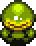
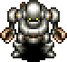
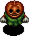

## Monster List

Monster Book Order

<table id="monsterList" class="monsterPageTable">
  <tr>
    <th colspan="9">Monster (Family)</th>
  </tr>
  <tr>
    <th>1</th>
    <th>2</th>
    <th>3</th>
    <th>4</th>
    <th>5</th>
    <th>6</th>
    <th>7</th>
    <th>8</th>
    <th>9</th>
  </tr>
  <tr>
    <td class="highlightYellow"><a href="#mamel">Mamel</a></td>
    <td class="highlightGray"><a href="#sweet-nut">Sweet Nut</a></td>
    <td class="highlightYellow"><a href="#fearabbit">Fearabbit</a></td>
    <td class="highlightGray"><a href="#mutaikon">Mutaikon</a></td>
    <td class="highlightYellow"><a href="#kid-squid">Kid Squid</a></td>
    <td class="highlightGray"><a href="#zalokleft">Zalokleft</a></td>
    <td class="highlightYellow"><a href="#porky">Porky</a></td>
    <td class="highlightGray"><a href="#fo-ub">FO-Uβ</a></td>
    <td class="highlightYellow"><a href="#field-knave">Field Knave</a></td>
  </tr>
  <tr>
    <td class="highlightYellow"><a href="#sproutant">Sproutant</a></td>
    <td class="highlightGray"><a href="#blade-bee">Blade Bee</a></td>
    <td class="highlightYellow"><a href="#gyaza">Gyaza</a></td>
    <td class="highlightGray"><a href="#naptapir">Naptapir</a></td>
    <td class="highlightYellow"><a href="#foly">Foly</a></td>
    <td class="highlightGray"><a href="#eligan">Eligan</a></td>
    <td class="highlightYellow"><a href="#boy-cart">Boy Cart</a></td>
    <td class="highlightGray"><a href="#myriman">Myriman</a></td>
    <td class="highlightYellow"><a href="#maneater">Maneater</a></td>
  </tr>
  <tr>
    <td class="highlightYellow"><a href="#colum">Colum</a></td>
    <td class="highlightGray"><a href="#nigiri-baby">Nigiri Baby</a></td>
    <td class="highlightYellow"><a href="#pumphantasm">Pumphantasm</a></td>
    <td class="highlightGray"><a href="#swordsman">Swordsman</a></td>
    <td class="highlightYellow"><a href="#bored-kappa">Bored Kappa</a></td>
    <td class="highlightGray"><a href="#gyadon">Gyadon</a></td>
    <td class="highlightYellow"><a href="#pop-tank">Pop Tank</a></td>
    <td class="highlightGray"><a href="#moseal">Moseal</a></td>
    <td class="highlightYellow"><a href="#boss">Jack Wand</a></td>
  </tr>
  <tr>
    <td class="highlightYellow"><a href="#seedie">Seedie</a></td>
    <td class="highlightGray"><a href="#froggo">Froggo</a></td>
    <td class="highlightYellow"><a href="#floaty">Floaty</a></td>
    <td class="highlightGray"><a href="#mudkin">Mudkin</a></td>
    <td class="highlightYellow"><a href="#hopodile">Hopodile</a></td>
    <td class="highlightGray"><a href="#gazer">Gazer</a></td>
    <td class="highlightYellow"><a href="#absorbiphant">Absorbiphant</a></td>
    <td class="highlightGray"><a href="#kumonigiri">Kumonigiri</a></td>
    <td class="highlightYellow"><a href="#boss">Boss Group</a></td>
  </tr>
  <tr>
    <td class="highlightYellow"><a href="#chintala">Chintala</a></td>
    <td class="highlightGray"><a href="#karakuroid">Karakuroid</a></td>
    <td class="highlightYellow"><a href="#ndubba">N'dubba</a></td>
    <td class="highlightGray"><a href="#polygon-spinna">Polygon Spinna</a></td>
    <td class="highlightYellow"><a href="#flamebird">Flamebird</a></td>
    <td class="highlightGray"><a href="#zapdon">Zapdon</a></td>
    <td class="highlightYellow"><a href="#punisher">Punisher</a></td>
    <td class="highlightGray"><a href="#shagga">Shagga</a></td>
    <td class="highlightYellow"><a href="#shopkeeper">Shopkeeper</a></td>
  </tr>
  <tr>
    <td class="highlightYellow"><a href="#grass-boy">Grass Boy</a></td>
    <td class="highlightGray"><a href="#tiger-tosser">Tiger Tosser</a></td>
    <td class="highlightYellow"><a href="#mixer">Mixer</a></td>
    <td class="highlightGray"><a href="#metalhead">Metalhead</a></td>
    <td class="highlightYellow"><a href="#yanpii">Yanpii</a></td>
    <td class="highlightGray"><a href="#dragon">Dragon</a></td>
    <td class="highlightYellow"><a href="#firepuff">Firepuff</a></td>
    <td class="highlightGray"><a href="#explochin">Explochin</a></td>
    <td></td>
  </tr>
  <tr>
    <td class="highlightYellow"><a href="#pin-kid">Pin Kid</a></td>
    <td class="highlightGray"><a href="#curse-girl">Curse Girl</a></td>
    <td class="highlightYellow"><a href="#scorpion">Scorpion</a></td>
    <td class="highlightGray"><a href="#cheer-ham">Cheer-Ham</a></td>
    <td class="highlightYellow"><a href="#scoopie">Scoopie</a></td>
    <td class="highlightGray"><a href="#dj-mage">DJ Mage</a></td>
    <td class="highlightYellow"><a href="#crow-tengu">Crow Tengu</a></td>
    <td class="highlightGray"><a href="#chow">Chow</a></td>
    <td></td>
  </tr>
</table>

Element Order

<table class="firstYellowTable">
  <tr>
    <th>Element</th>
    <th>Monsters (Family or Individual)</th>
    <th>Info</th>
  </tr>
  <tr>
    <td class="highlightYellow">Swift 1</td>
    <td><a href="#pin-kid">Pin Kid</a> | <a href="#karakuroid">Karakuroid</a> | <a href="#floaty">Floaty</a> | <a href="#foly">Foly</a> | <a href="#boy-cart">Boy Cart</a> | <a href="#pop-tank">Ornery Tank</a> | <a href="#chow">Chow</a> | <a href="#shopkeeper">Shopkeeper</a></td>
    <td>Double speed, attacks once</td>
  </tr>
  <tr>
    <td class="highlightYellow">Swift 2</td>
    <td><a href="#mamel">Gitan Mamel</a> | <a href="#pop-tank">Cranky Tank</a> | <a href="#fo-ub">FO-Uβ</a></td>
    <td>Double speed, attacks twice</td>
  </tr>
  <tr>
    <td class="highlightYellow">Slow</td>
    <td><a href="#zapdon">Zapdon</a> | <a href="#pop-tank">Pop Tank</a></td>
    <td>One action every 2 turns</td>
  </tr>
  <tr>
    <td class="highlightYellow">Rust</td>
    <td><a href="#grass-boy">Grass Boy</a> | <a href="#pin-kid">Pin Kid</a> | <a href="#sweet-nut">Sweet Nut</a> | <a href="#karakuroid">Karakuroid</a> | <a href="#swordsman">Swordsman</a> | <a href="#flamebird">Flamebird</a> | <a href="#scoopie">Scoopie</a> <a href="#zapdon">Zapdon</a> | <a href="#boy-cart">Boy Cart</a> | <a href="#pop-tank">Pop Tank</a> | <a href="#absorbiphant">Absorbiphant</a> | <a href="#punisher">Punisher</a> | <a href="#fo-ub">FO-Uβ</a> | <a href="#shagga">Shagga</a></td>
    <td>Splash water from a <a href="#">Water Pot</a> to apply a negative effect.</td>
  </tr>
  <tr>
    <td class="highlightYellow">Normal</td>
    <td><a href="#mamel">Mamel</a> | <a href="#colum">Colum</a> | <a href="#chintala">Chintala</a> | <a href="#nigiri-baby">Nigiri Baby</a> | <a href="#froggo">Froggo</a> | <a href="#tiger-tosser">Tiger Tosser</a> | <a href="#curse-girl">Curse Girl</a> | <a href="#floaty">Floaty</a> <a href="#mixer">Mixer</a> | <a href="#naptapir">Naptapir</a> | <a href="#swordsman">Swordsman</a> | <a href="#cheer-ham">Cheer-Ham</a> | <a href="#yanpii">Yanpii</a> | <a href="#eligan">Eligan</a> | <a href="#zapdon">Zapdon</a> | <a href="#porky">Porky</a> <a href="#boy-cart">Boy Cart</a> | <a href="#punisher">Punisher</a> | <a href="#kumonigiri">Kumonigiri</a> | <a href="#field-knave">Field Knave</a> | <a href="#maneater">Maneater</a> | <a href="#shopkeeper">Shopkeeper</a></td>
    <td>No type-effective weakness</td>
  </tr>
  <tr>
    <td class="highlightYellow">Cyclops</td>
    <td><a href="#metalhead">Metalhead</a> | <a href="#foly">Foly</a> | <a href="#gazer">Gazer</a> | <a href="#explochin">Explochin</a></td>
    <td>Weak to Anti-Cyclops rune</td>
  </tr>
  <tr>
    <td class="highlightYellow">Drain</td>
    <td><a href="#scorpion">Scorpion</a> | <a href="#polygon-spinna">Polygon Spinna</a> | <a href="#absorbiphant">Absorbiphant</a> | <a href="#myriman">Myriman</a></td>
    <td>Weak to Anti-Drain rune</td>
  </tr>
  <tr>
    <td class="highlightYellow">Dragon</td>
    <td><a href="#hopodile">Hopodile</a> | <a href="#dragon">Dragon</a> | <a href="#firepuff">Firepuff</a> | <a href="#shagga">Shagga</a></td>
    <td>Weak to Anti-Dragon rune</td>
  </tr>
  <tr>
    <td class="highlightYellow">Explode</td>
    <td><a href="#sweet-nut">Sweet Nut</a> | <a href="#pop-tank">Pop Tank</a> | <a href="#explochin">Explochin</a></td>
    <td>Weak to Anti-Explode rune</td>
  </tr>
  <tr>
    <td class="highlightYellow">Metal</td>
    <td><a href="#karakuroid">Karakuroid</a> | <a href="#ndubba">N'dubba</a> | <a href="#scoopie">Scoopie</a> | <a href="#pop-tank">Pop Tank</a> | <a href="#fo-ub">FO-Uβ</a></td>
    <td>Weak to Anti-Metal rune</td>
  </tr>
  <tr>
    <td class="highlightYellow">Plant</td>
    <td><a href="#sproutant">Sproutant</a> | <a href="#seedie">Seedie</a> | <a href="#grass-boy">Grass Boy</a> | <a href="#pin-kid">Pin Kid</a> | <a href="#sweet-nut">Sweet Nut</a> | <a href="#pumphantasm">Pumphantasm</a> | <a href="#mutaikon">Mutaikon</a></td>
    <td>Weak to Anti-Plant rune</td>
  </tr>
  <tr>
    <td class="highlightYellow">Magic</td>
    <td><a href="#fearabbit">Fearabbit</a> | <a href="#polygon-spinna">Polygon Spinna</a> | <a href="#gazer">Gazer</a> | <a href="#dj-mage">DJ Mage</a></td>
    <td>Weak to Anti-Magic rune</td>
  </tr>
  <tr>
    <td class="highlightYellow">Floating</td>
    <td><a href="#blade-bee">Blade Bee</a> | <a href="#pumphantasm">Pumphantasm</a> | <a href="#foly">Foly</a> | <a href="#flamebird">Flamebird</a> | <a href="#gyadon">Gyadon</a> | <a href="#firepuff">Firepuff</a> | <a href="#crow-tengu">Crow Tengu</a> <a href="#fo-ub">FO-Uβ</a> | <a href="#chow">Chow</a></td>
    <td>Weak to Anti-Floating rune</td>
  </tr>
  <tr>
    <td class="highlightYellow">Aquatic</td>
    <td><a href="#gyaza">Gyaza</a> | <a href="#mudkin">Mudkin</a> | <a href="#kid-squid">Kid Squid</a> | <a href="#bored-kappa">Bored Kappa</a> | <a href="#hopodile">Hopodile</a> | <a href="#zalokleft">Zalokleft</a> | <a href="#moseal">Moseal</a> <a href="#explochin">Explochin</a></td>
    <td>Weak to Anti-Aquatic rune</td>
  </tr>
  <tr>
    <td class="highlightYellow">Power</td>
    <td><a href="#sproutant">Sproutant</a> | <a href="#scorpion">Scorpion</a> | <a href="#metalhead">Metalhead</a> | <a href="#eligan">Eligan</a> | <a href="#gyadon">Gyadon</a> | <a href="#zapdon">Zapdon</a> | <a href="#porky">Porky</a> | <a href="#pop-tank">Pop Tank</a> <a href="#absorbiphant">Absorbiphant</a></td>
    <td>Appears in power houses</td>
  </tr>
  <tr>
    <td class="highlightYellow">Greed</td>
    <td><a href="#sweet-nut">Sweet Nut</a> | <a href="#froggo">Froggo</a> | <a href="#curse-girl">Curse Girl</a> | <a href="#mixer">Mixer</a> | <a href="#swordsman">Swordsman</a> | <a href="#zalokleft">Zalokleft</a> | <a href="#gyadon">Gyadon</a></td>
    <td>Appears in greed houses</td>
  </tr>
  <tr>
    <td class="highlightYellow">Projectile</td>
    <td><a href="#grass-boy">Grass Boy</a> | <a href="#tiger-tosser">Tiger Tosser</a> | <a href="#floaty">Floaty</a> | <a href="#mutaikon">Mutaikon</a> | <a href="#bored-kappa">Bored Kappa</a> | <a href="#scoopie">Scoopie</a> | <a href="#porky">Porky</a> <a href="#boy-cart">Boy Cart</a> | <a href="#field-knave">Field Knave</a></td>
    <td>Appears in projectile houses</td>
  </tr>
  <tr>
    <td class="highlightYellow">Explosive</td>
    <td><a href="#sweet-nut">Sweet Nut</a> | <a href="#flamebird">Flamebird</a> | <a href="#dragon">Dragon</a> | <a href="#firepuff">Firepuff</a> | <a href="#pop-tank">Pop Tank</a> | <a href="#explochin">Explochin</a></td>
    <td>Appears in explosive houses</td>
  </tr>
  <tr>
    <td class="highlightYellow">Harass</td>
    <td><a href="#karakuroid">Karakuroid</a> | <a href="#fearabbit">Fearabbit</a> | <a href="#polygon-spinna">Polygon Spinna</a> | <a href="#cheer-ham">Cheer-Ham</a> | <a href="#yanpii">Yanpii</a> | <a href="#scoopie">Scoopie</a> | <a href="#gazer">Gazer</a> <a href="#dj-mage">DJ Mage</a> | <a href="#absorbiphant">Absorbiphant</a> | <a href="#myriman">Myriman</a> | <a href="#explochin">Explochin</a></td>
    <td>Appears in harassment houses</td>
  </tr>
</table>

## Details

### Mamel

  

<table class="monsterPageTable">
  <tr>
    <th>Lv</th>
    <th>Name</th>
    <th>HP</th>
    <th>Atk</th>
    <th>Def</th>
    <th>Exp</th>
    <th>Skill</th>
    <th>Drop</th>
    <th>Elem.</th>
    <th>Abilities</th>
    <th>Notes</th>
  </tr>
  <tr>
    <td class="highlightYellow">1</td>
    <td>Mamel</td>
    <td>5</td>
    <td>2</td>
    <td>1</td>
    <td>2</td>
    <td>1</td>
    <td>4%</td>
    <td>-</td>
    <td rowspan="2">None.</td>
    <td>Mascot monster for the Shiren series.</td>
  </tr>
  <tr>
    <td class="highlightYellow">2</td>
    <td>Pit Mamel</td>
    <td>11</td>
    <td>6</td>
    <td>3</td>
    <td>5</td>
    <td>2</td>
    <td>4%</td>
    <td>-</td>
    <td>Slightly stronger Mamel.</td>
  </tr>
  <tr>
    <td class="highlightYellow">3</td>
    <td>Cave Mamel</td>
    <td>6</td>
    <td>60</td>
    <td>19</td>
    <td>888</td>
    <td>100</td>
    <td>4%</td>
    <td>-</td>
    <td>Converts all damage that doesn't ignore defense to 1.</td>
    <td>Direct attacks deal 1 damage to it. Fixed damage is still effective. Direct attacks are effective if Sealed.</td>
  </tr>
  <tr>
    <td class="highlightYellow">4</td>
    <td>Gitan Mamel</td>
    <td>12</td>
    <td>84</td>
    <td>38</td>
    <td>5500</td>
    <td>444</td>
    <td>100%</td>
    <td>Swift 2</td>
    <td>Double speed, 2 attacks. Converts all damage that doesn't ignore defense to 1. Drops 2000 Gitan.</td>
    <td>Same as above, but double speed. Often appears with Kappa Trolls and Kleptoads, so pick up the Gitan it drops. Seal it or equip a Counter rune shield if you don't have rocks / used Dodger Pot.</td>
  </tr>
  <tr>
    <th>Lv</th>
    <th>Name</th>
    <th>HP</th>
    <th>Atk</th>
    <th>Def</th>
    <th>Exp</th>
    <th>Skill</th>
    <th>Drop</th>
    <th>Elem.</th>
    <th>Abilities</th>
    <th>Notes</th>
  </tr>
  <tr>
    <td class="highlightNight">1</td>
    <td>Dark Mamel</td>
    <td>24</td>
    <td>14</td>
    <td>3</td>
    <td>22</td>
    <td>15</td>
    <td>4%</td>
    <td>-</td>
    <td rowspan="3">None.</td>
    <td rowspan="2">Stronger than daytime counterparts.</td>
  </tr>
  <tr>
    <td class="highlightNight">2</td>
    <td>Dark Pit Mamel</td>
    <td>35</td>
    <td>30</td>
    <td>4</td>
    <td>43</td>
    <td>80</td>
    <td>8%</td>
    <td>-</td>
  </tr>
  <tr>
    <td class="highlightNight">3</td>
    <td>Dark Cave Mamel</td>
    <td>40</td>
    <td>52</td>
    <td>6</td>
    <td>220</td>
    <td>450</td>
    <td>16%</td>
    <td>-</td>
    <td>-</td>
  </tr>
  <tr>
    <td class="highlightNight">4</td>
    <td>Dark Gitan Mamel</td>
    <td>68</td>
    <td>88</td>
    <td>8</td>
    <td>600</td>
    <td>500</td>
    <td>100%</td>
    <td>Swift 2</td>
    <td>Double speed, 2 attacks. Drops 2000 Gitan.</td>
    <td>Drops blessed Gitan even if defeated by other monsters, and can appear alongside Kappa monsters.</td>
  </tr>
</table>

### Sproutant

  

<table class="monsterPageTable">
  <tr>
    <th>Lv</th>
    <th>Name</th>
    <th>HP</th>
    <th>Atk</th>
    <th>Def</th>
    <th>Exp</th>
    <th>Skill</th>
    <th>Drop</th>
    <th>Elem.</th>
    <th>Abilities</th>
    <th>Notes</th>
  </tr>
  <tr>
    <td class="highlightYellow">1</td>
    <td>Sproutant</td>
    <td>5</td>
    <td>2</td>
    <td>1</td>
    <td>3</td>
    <td>2</td>
    <td>4%</td>
    <td rowspan="4">Plant Power</td>
    <td rowspan="4">The entire monster family gains immunity to the status condition after one is inflicted. If a different status condition is inflicted, the new one overwrites the previous immunity. It can't gain immunity to Sealed.</td>
    <td>Same stats as Mamel. Its ability is like a worse version of Absorbiphant.</td>
  </tr>
  <tr>
    <td class="highlightYellow">2</td>
    <td>Sproutyrant</td>
    <td>60</td>
    <td>22</td>
    <td>10</td>
    <td>14</td>
    <td>8</td>
    <td>4%</td>
    <td>Low exp, despite its strength.</td>
  </tr>
  <tr>
    <td class="highlightYellow">3</td>
    <td>Sprouterror</td>
    <td>88</td>
    <td>44</td>
    <td>24</td>
    <td>680</td>
    <td>240</td>
    <td>4%</td>
    <td>High attack, so don't underestimate it.</td>
  </tr>
  <tr>
    <td class="highlightYellow">4</td>
    <td>Sproutitan</td>
    <td>99</td>
    <td>85</td>
    <td>38</td>
    <td>1580</td>
    <td>345</td>
    <td>4%</td>
    <td>High power and solid defenses.</td>
  </tr>
  <tr>
    <th>Lv</th>
    <th>Name</th>
    <th>HP</th>
    <th>Atk</th>
    <th>Def</th>
    <th>Exp</th>
    <th>Skill</th>
    <th>Drop</th>
    <th>Elem.</th>
    <th>Abilities</th>
    <th>Notes</th>
  </tr>
  <tr>
    <td class="highlightNight">1</td>
    <td>Vile Sproutant</td>
    <td>35</td>
    <td>30</td>
    <td>3</td>
    <td>43</td>
    <td>36</td>
    <td>4%</td>
    <td rowspan="4">Plant Power</td>
    <td rowspan="4">Same as daytime abilities.</td>
    <td rowspan="4">Be careful using Crawling Confusion and Pot Party <a href="/shiren5/system/abilities">abilities</a>.</td>
  </tr>
  <tr>
    <td class="highlightNight">2</td>
    <td>Vile Sproutyrant</td>
    <td>37</td>
    <td>40</td>
    <td>4</td>
    <td>140</td>
    <td>190</td>
    <td>8%</td>
  </tr>
  <tr>
    <td class="highlightNight">3</td>
    <td>Vile Sprouterror</td>
    <td>56</td>
    <td>50</td>
    <td>5</td>
    <td>280</td>
    <td>270</td>
    <td>16%</td>
  </tr>
  <tr>
    <td class="highlightNight">4</td>
    <td>Vile Sproutitan</td>
    <td>58</td>
    <td>53</td>
    <td>6</td>
    <td>360</td>
    <td>360</td>
    <td>20%</td>
  </tr>
</table>

### Colum

  

<table class="monsterPageTable">
  <tr>
    <th>Lv</th>
    <th>Name</th>
    <th>HP</th>
    <th>Atk</th>
    <th>Def</th>
    <th>Exp</th>
    <th>Skill</th>
    <th>Drop</th>
    <th>Elem.</th>
    <th>Abilities</th>
    <th>Notes</th>
  </tr>
  <tr>
    <td class="highlightYellow">1</td>
    <td>Colum</td>
    <td>7</td>
    <td>7</td>
    <td>1</td>
    <td>4</td>
    <td>2</td>
    <td>4%</td>
    <td>-</td>
    <td rowspan="4">Rolls back 10 tiles if defeated by a direct attack, damaging anything it collides with equal to damage received. Doesn't roll if slain diagonally using Breeze Blade.</td>
    <td>Same stats as Seedie.</td>
  </tr>
  <tr>
    <td class="highlightYellow">2</td>
    <td>Cololum</td>
    <td>45</td>
    <td>15</td>
    <td>9</td>
    <td>33</td>
    <td>16</td>
    <td>4%</td>
    <td>-</td>
    <td>Hated on 1F of <a href="/shiren5/dungeon/rousing-paradise">Rousing Paradise</a>.</td>
  </tr>
  <tr>
    <td class="highlightYellow">3</td>
    <td>Colocolum</td>
    <td>66</td>
    <td>40</td>
    <td>18</td>
    <td>550</td>
    <td>150</td>
    <td>4%</td>
    <td>-</td>
    <td>Shopkeepers, NPCs, and ally monsters turn hostile if it collides with them.</td>
  </tr>
  <tr>
    <td class="highlightYellow">4</td>
    <td>Colocolocolum</td>
    <td>130</td>
    <td>75</td>
    <td>22</td>
    <td>1300</td>
    <td>330</td>
    <td>4%</td>
    <td>-</td>
    <td>Extremely high HP, and high attack.</td>
  </tr>
  <tr>
    <th>Lv</th>
    <th>Name</th>
    <th>HP</th>
    <th>Atk</th>
    <th>Def</th>
    <th>Exp</th>
    <th>Skill</th>
    <th>Drop</th>
    <th>Elem.</th>
    <th>Abilities</th>
    <th>Notes</th>
  </tr>
  <tr>
    <td class="highlightNight">1</td>
    <td>Bad Colum</td>
    <td>14</td>
    <td>5</td>
    <td>2</td>
    <td>3</td>
    <td>6</td>
    <td>4%</td>
    <td>-</td>
    <td rowspan="4">Same as daytime abilities.</td>
    <td rowspan="4">Bad Colums slain by other monsters roll too, so consider rushing stairs or eating a Juicy Peach on floors where these appear to avoid accidents.</td>
  </tr>
  <tr>
    <td class="highlightNight">2</td>
    <td>Bad Cololum</td>
    <td>50</td>
    <td>33</td>
    <td>3</td>
    <td>90</td>
    <td>60</td>
    <td>8%</td>
    <td>-</td>
  </tr>
  <tr>
    <td class="highlightNight">3</td>
    <td>Bad Colocolum</td>
    <td>60</td>
    <td>46</td>
    <td>4</td>
    <td>180</td>
    <td>120</td>
    <td>16%</td>
    <td>-</td>
  </tr>
  <tr>
    <td class="highlightNight">4</td>
    <td>Bad Colocolocolum</td>
    <td>70</td>
    <td>66</td>
    <td>5</td>
    <td>360</td>
    <td>450</td>
    <td>20%</td>
    <td>-</td>
  </tr>
</table>

### Seedie

  

<table class="monsterPageTable">
  <tr>
    <th>Lv</th>
    <th>Name</th>
    <th>HP</th>
    <th>Atk</th>
    <th>Def</th>
    <th>Exp</th>
    <th>Skill</th>
    <th>Drop</th>
    <th>Elem.</th>
    <th>Abilities</th>
    <th>Notes</th>
  </tr>
  <tr>
    <td class="highlightYellow">1</td>
    <td>Seedie</td>
    <td>7</td>
    <td>7</td>
    <td>1</td>
    <td>4</td>
    <td>1</td>
    <td>4%</td>
    <td rowspan="4">Plant</td>
    <td rowspan="4">None.</td>
    <td>Deals 6~8 damage without a shield. Loop attack → retreat to heal HP → attack to defeat it safely. Keeps the <a href="/shiren5/system/npcs#sparrow">Sparrow</a> NPC in business.</td>
  </tr>
  <tr>
    <td class="highlightYellow">2</td>
    <td>Beanie</td>
    <td>45</td>
    <td>23</td>
    <td>10</td>
    <td>125</td>
    <td>50</td>
    <td>4%</td>
    <td rowspan="3">Lower attack compared to Shiren 4.</td>
  </tr>
  <tr>
    <td class="highlightYellow">3</td>
    <td>Nuttie</td>
    <td>57</td>
    <td>51</td>
    <td>16</td>
    <td>850</td>
    <td>90</td>
    <td>4%</td>
  </tr>
  <tr>
    <td class="highlightYellow">4</td>
    <td>Grainie</td>
    <td>83</td>
    <td>70</td>
    <td>27</td>
    <td>1250</td>
    <td>250</td>
    <td>4%</td>
  </tr>
  <tr>
    <th>Lv</th>
    <th>Name</th>
    <th>HP</th>
    <th>Atk</th>
    <th>Def</th>
    <th>Exp</th>
    <th>Skill</th>
    <th>Drop</th>
    <th>Elem.</th>
    <th>Abilities</th>
    <th>Notes</th>
  </tr>
  <tr>
    <td class="highlightNight">1</td>
    <td>Hateful Seedie</td>
    <td>35</td>
    <td>30</td>
    <td>4</td>
    <td>56</td>
    <td>35</td>
    <td>4%</td>
    <td rowspan="4">Plant</td>
    <td rowspan="4">None.</td>
    <td>-</td>
  </tr>
  <tr>
    <td class="highlightNight">2</td>
    <td>Hateful Beanie</td>
    <td>45</td>
    <td>40</td>
    <td>6</td>
    <td>130</td>
    <td>100</td>
    <td>8%</td>
    <td>-</td>
  </tr>
  <tr>
    <td class="highlightNight">3</td>
    <td>Hateful Nuttie</td>
    <td>63</td>
    <td>60</td>
    <td>8</td>
    <td>260</td>
    <td>260</td>
    <td>16%</td>
    <td>-</td>
  </tr>
  <tr>
    <td class="highlightNight">4</td>
    <td>Hateful Grainie</td>
    <td>75</td>
    <td>92</td>
    <td>10</td>
    <td>380</td>
    <td>420</td>
    <td>20%</td>
    <td>-</td>
  </tr>
</table>

### Chintala

  

<table class="monsterPageTable">
  <tr>
    <th>Lv</th>
    <th>Name</th>
    <th>HP</th>
    <th>Atk</th>
    <th>Def</th>
    <th>Exp</th>
    <th>Skill</th>
    <th>Drop</th>
    <th>Elem.</th>
    <th>Abilities</th>
    <th>Notes</th>
  </tr>
  <tr>
    <td class="highlightYellow">1</td>
    <td>Chintala</td>
    <td>19</td>
    <td>9</td>
    <td>4</td>
    <td>12</td>
    <td>6</td>
    <td>4%</td>
    <td>-</td>
    <td rowspan="4">None.</td>
    <td>Over double HP compared to Shiren 4.</td>
  </tr>
  <tr>
    <td class="highlightYellow">2</td>
    <td>Mid Chintala</td>
    <td>45</td>
    <td>15</td>
    <td>9</td>
    <td>33</td>
    <td>10</td>
    <td>4%</td>
    <td>-</td>
    <td rowspan="2">Weak. Big Chintala's stats are about 10F behind.</td>
  </tr>
  <tr>
    <td class="highlightYellow">3</td>
    <td>Big Chintala</td>
    <td>65</td>
    <td>30</td>
    <td>11</td>
    <td>100</td>
    <td>40</td>
    <td>4%</td>
    <td>-</td>
  </tr>
  <tr>
    <td class="highlightYellow">4</td>
    <td>Huge Chintala</td>
    <td>92</td>
    <td>82</td>
    <td>28</td>
    <td>3600</td>
    <td>300</td>
    <td>4%</td>
    <td>-</td>
    <td>High offense, just like Shiren 4. Stats are the same as Bouncy.</td>
  </tr>
  <tr>
    <th>Lv</th>
    <th>Name</th>
    <th>HP</th>
    <th>Atk</th>
    <th>Def</th>
    <th>Exp</th>
    <th>Skill</th>
    <th>Drop</th>
    <th>Elem.</th>
    <th>Abilities</th>
    <th>Notes</th>
  </tr>
  <tr>
    <td class="highlightNight">1</td>
    <td>Evil Chintala</td>
    <td>14</td>
    <td>5</td>
    <td>2</td>
    <td>3</td>
    <td>4</td>
    <td>4%</td>
    <td>-</td>
    <td rowspan="4">None.</td>
    <td>-</td>
  </tr>
  <tr>
    <td class="highlightNight">2</td>
    <td>Evil Mid Chintala</td>
    <td>35</td>
    <td>32</td>
    <td>4</td>
    <td>56</td>
    <td>50</td>
    <td>8%</td>
    <td>-</td>
    <td>-</td>
  </tr>
  <tr>
    <td class="highlightNight">3</td>
    <td>Evil Big Chintala</td>
    <td>50</td>
    <td>56</td>
    <td>8</td>
    <td>380</td>
    <td>220</td>
    <td>16%</td>
    <td>-</td>
    <td>-</td>
  </tr>
  <tr>
    <td class="highlightNight">4</td>
    <td>Evil Huge Chintala</td>
    <td>63</td>
    <td>75</td>
    <td>16</td>
    <td>500</td>
    <td>300</td>
    <td>20%</td>
    <td>-</td>
    <td>-</td>
  </tr>
</table>

### Grass Kid

  

<table class="monsterPageTable">
  <tr>
    <th>Lv</th>
    <th>Name</th>
    <th>HP</th>
    <th>Atk</th>
    <th>Def</th>
    <th>Exp</th>
    <th>Skill</th>
    <th>Drop</th>
    <th>Elem.</th>
    <th>Abilities</th>
    <th>Notes</th>
  </tr>
  <tr>
    <td class="highlightYellow">1</td>
    <td>Grass Kid</td>
    <td>28</td>
    <td>10</td>
    <td>1</td>
    <td>5</td>
    <td>3</td>
    <td>-</td>
    <td rowspan="4">Rust Plant Projectile</td>
    <td>Throws grass. (Pierces) Spreads grass in a 1 tile radius. Becomes Pin Kid after using grass. Drops its grass if slain.</td>
    <td>High HP and attack early on. Slay it before it uses its grass to obtain grasses, but it can one-shot with Dragon Grass.</td>
  </tr>
  <tr>
    <td class="highlightYellow">2</td>
    <td>Grass Dude</td>
    <td>60</td>
    <td>25</td>
    <td>11</td>
    <td>160</td>
    <td>40</td>
    <td>-</td>
    <td>Same as Grass Kid. Becomes Pin Dude after using grass, and carries up to 2 grass items.</td>
    <td>Dracon Grass + Fencer combo can cause equipment loss in <a href="/shiren5/dungeon/pitfall-of-life">Pitfall of Life</a>.</td>
  </tr>
  <tr>
    <td class="highlightYellow">3</td>
    <td>Grass Poppa</td>
    <td>74</td>
    <td>49</td>
    <td>17</td>
    <td>640</td>
    <td>210</td>
    <td>-</td>
    <td>Same as Grass Kid. Becomes Pin Poppa after using grass, and carries up to 3 grass items.</td>
    <td>Ideal monster to <a href="/shiren5/guide/tips-and-tricks#grass-factory">farm grass</a>. It has high attack so don't let your guard down.</td>
  </tr>
  <tr>
    <td class="highlightYellow">4</td>
    <td>Grass Gramps</td>
    <td>94</td>
    <td>80</td>
    <td>22</td>
    <td>1060</td>
    <td>390</td>
    <td>-</td>
    <td>Same as Grass Kid. Becomes Pin Gramps after using grass, and carries up to 4 grass items.</td>
    <td>Very high attack. Level it down if you want to farm grass. Sleepy Grass or Rage Grass can easily lead to a collapse.</td>
  </tr>
  <tr>
    <th>Lv</th>
    <th>Name</th>
    <th>HP</th>
    <th>Atk</th>
    <th>Def</th>
    <th>Exp</th>
    <th>Skill</th>
    <th>Drop</th>
    <th>Elem.</th>
    <th>Abilities</th>
    <th>Notes</th>
  </tr>
  <tr>
    <td class="highlightNight">1</td>
    <td>Dark Grass Kid</td>
    <td>23</td>
    <td>14</td>
    <td>1</td>
    <td>18</td>
    <td>10</td>
    <td>-</td>
    <td rowspan="4">Rust Plant Projectile</td>
    <td>Same as Grass Kid. Becomes Foul Pin Kid after using grass.</td>
    <td rowspan="4">If it picks up grass, that grass won't be blessed when slain, but grass it generates on its own will be blessed. Blessed grass is usually nice, but remember that some bad effect ones like Rage Grass become more dangerous.</td>
  </tr>
  <tr>
    <td class="highlightNight">2</td>
    <td>Dark Grass Dude</td>
    <td>43</td>
    <td>26</td>
    <td>2</td>
    <td>90</td>
    <td>160</td>
    <td>-</td>
    <td>Same as Grass Kid. Becomes Foul Pin Dude after using grass, and carries up to 2 grass items.</td>
  </tr>
  <tr>
    <td class="highlightNight">3</td>
    <td>Dark Grass Poppa</td>
    <td>56</td>
    <td>43</td>
    <td>3</td>
    <td>250</td>
    <td>300</td>
    <td>-</td>
    <td>Same as Grass Kid. Becomes Foul Pin Poppa after using grass, and carries up to 3 grass items.</td>
  </tr>
  <tr>
    <td class="highlightNight">4</td>
    <td>Dark Grass Gramps</td>
    <td>66</td>
    <td>57</td>
    <td>5</td>
    <td>420</td>
    <td>460</td>
    <td>-</td>
    <td>Same as Grass Kid. Becomes Foul Pin Gramps after using grass, and carries up to 4 grass.</td>
  </tr>
</table>

### Pin Kid

  

<table class="monsterPageTable">
  <tr>
    <th>Lv</th>
    <th>Name</th>
    <th>HP</th>
    <th>Atk</th>
    <th>Def</th>
    <th>Exp</th>
    <th>Skill</th>
    <th>Drop</th>
    <th>Elem.</th>
    <th>Abilities</th>
    <th>Notes</th>
  </tr>
  <tr>
    <td class="highlightYellow">1</td>
    <td>Pin Kid</td>
    <td>28</td>
    <td>8</td>
    <td>1</td>
    <td>5</td>
    <td>1</td>
    <td>-</td>
    <td rowspan="4">Swift 1 Rust Plant</td>
    <td>Double speed, 1 attack. Runs away, but attacks if adjacent. Picks up grass, becomes Grass Kid.</td>
    <td rowspan="2">Lower attack than Grass Kid or Grass Dude, but double speed. Troublesome in hallways.</td>
  </tr>
  <tr>
    <td class="highlightYellow">2</td>
    <td>Pin Dude</td>
    <td>60</td>
    <td>20</td>
    <td>10</td>
    <td>100</td>
    <td>20</td>
    <td>-</td>
    <td>Same as Pin Kid, but becomes Grass Dude.</td>
  </tr>
  <tr>
    <td class="highlightYellow">3</td>
    <td>Pin Poppa</td>
    <td>76</td>
    <td>48</td>
    <td>16</td>
    <td>400</td>
    <td>80</td>
    <td>-</td>
    <td>Same as Pin Kid, but becomes Grass Poppa and can generate grass on its own.</td>
    <td>Similar attack as Grass Poppa. Generates its own grass after a number of turns pass, so it's excellent for <a href="/shiren5/guide/tips-and-tricks#grass-factory">farming grass</a>.</td>
  </tr>
  <tr>
    <td class="highlightYellow">4</td>
    <td>Pin Gramps</td>
    <td>94</td>
    <td>60</td>
    <td>20</td>
    <td>860</td>
    <td>140</td>
    <td>-</td>
    <td>Same as Pin Kid, but becomes Grass Gramps and can generate grass on its own.</td>
    <td>Significant attack boost when it becomes Grass Gramps. (+20)</td>
  </tr>
  <tr>
    <th>Lv</th>
    <th>Name</th>
    <th>HP</th>
    <th>Atk</th>
    <th>Def</th>
    <th>Exp</th>
    <th>Skill</th>
    <th>Drop</th>
    <th>Elem.</th>
    <th>Abilities</th>
    <th>Notes</th>
  </tr>
  <tr>
    <td class="highlightNight">1</td>
    <td>Foul Pin Kid</td>
    <td>23</td>
    <td>14</td>
    <td>1</td>
    <td>18</td>
    <td>12</td>
    <td>-</td>
    <td rowspan="4">Swift 1 Rust Plant</td>
    <td>Same as Pin Kid, but becomes Dark Grass Kid.</td>
    <td rowspan="4">Runs away, but it has random movement since it's a night monster, so it may end up approaching you and attacking. It's best to avoid going near it. It still tries to move toward grass, but it can't move in a straight line so it might take a bit to pick it up.</td>
  </tr>
  <tr>
    <td class="highlightNight">2</td>
    <td>Foul Pin Dude</td>
    <td>37</td>
    <td>24</td>
    <td>2</td>
    <td>100</td>
    <td>84</td>
    <td>-</td>
    <td>Same as Pin Kid, but becomes Dark Grass Dude.</td>
  </tr>
  <tr>
    <td class="highlightNight">3</td>
    <td>Foul Pin Poppa</td>
    <td>58</td>
    <td>22</td>
    <td>3</td>
    <td>220</td>
    <td>110</td>
    <td>-</td>
    <td>Same as Pin Kid, but becomes Dark Grass Poppa and can generate grass on its own.</td>
  </tr>
  <tr>
    <td class="highlightNight">4</td>
    <td>Foul Pin Gramps</td>
    <td>66</td>
    <td>39</td>
    <td>4</td>
    <td>440</td>
    <td>240</td>
    <td>-</td>
    <td>Same as Pin Kid, but becomes Dark Grass Gramps and can generate grass on its own.</td>
  </tr>
</table>

### Sweet Nut

  

<table class="monsterPageTable">
  <tr>
    <th>Lv</th>
    <th>Name</th>
    <th>HP</th>
    <th>Atk</th>
    <th>Def</th>
    <th>Exp</th>
    <th>Skill</th>
    <th>Drop</th>
    <th>Elem.</th>
    <th>Abilities</th>
    <th>Notes</th>
  </tr>
  <tr>
    <td class="highlightYellow">1</td>
    <td>Sweet Nut</td>
    <td>16</td>
    <td>11</td>
    <td>5</td>
    <td>15</td>
    <td>4</td>
    <td>-</td>
    <td rowspan="4">Rust Explode Plant Greed Explosive</td>
    <td rowspan="4">Eats thrown items, but has a 1/3 chance to explode. Doubles exp for every item it eats. (x2 → x4 → x8 → ... → x1024 max) Doesn't act on the turn it eats. It won't eat if inflicted with: Napping, Asleep, Sound Asleep, Sealed, Paralyzed, S-Paralyzed, Onigiri, Tottering</td>
    <td rowspan="4">Its explosion can be used to wipe out a group of enemies. Aiming for the x1024 multiplier is unrealistic.</td>
  </tr>
  <tr>
    <td class="highlightYellow">2</td>
    <td>Acrid Nut</td>
    <td>36</td>
    <td>21</td>
    <td>8</td>
    <td>35</td>
    <td>18</td>
    <td>-</td>
  </tr>
  <tr>
    <td class="highlightYellow">3</td>
    <td>Spicy Nut</td>
    <td>57</td>
    <td>52</td>
    <td>16</td>
    <td>150</td>
    <td>270</td>
    <td>-</td>
  </tr>
  <tr>
    <td class="highlightYellow">4</td>
    <td>Bitter Nut</td>
    <td>65</td>
    <td>70</td>
    <td>22</td>
    <td>400</td>
    <td>430</td>
    <td>-</td>
  </tr>
  <tr>
    <th>Lv</th>
    <th>Name</th>
    <th>HP</th>
    <th>Atk</th>
    <th>Def</th>
    <th>Exp</th>
    <th>Skill</th>
    <th>Drop</th>
    <th>Elem.</th>
    <th>Abilities</th>
    <th>Notes</th>
  </tr>
  <tr>
    <td class="highlightNight">1</td>
    <td>Putrid Sweet Nut</td>
    <td>55</td>
    <td>30</td>
    <td>1</td>
    <td>70</td>
    <td>35</td>
    <td>-</td>
    <td rowspan="4">Rust Explode Plant Greed Explosive</td>
    <td rowspan="4">Same as daytime abilities.</td>
    <td>High attack, but can be disposed of in the same way as daytime Sweet Nuts.</td>
  </tr>
  <tr>
    <td class="highlightNight">2</td>
    <td>Putrid Acrid Nut</td>
    <td>60</td>
    <td>40</td>
    <td>3</td>
    <td>150</td>
    <td>96</td>
    <td>-</td>
    <td rowspan="3">Leave a 1 tile gap if aiming for exp in case it explodes. Keep an eye on nearby enemies so that they don't defeat it after raising its exp multiplier.</td>
  </tr>
  <tr>
    <td class="highlightNight">3</td>
    <td>Putrid Spicy Nut</td>
    <td>65</td>
    <td>76</td>
    <td>5</td>
    <td>320</td>
    <td>350</td>
    <td>-</td>
  </tr>
  <tr>
    <td class="highlightNight">4</td>
    <td>Putrid Bitter Nut</td>
    <td>75</td>
    <td>85</td>
    <td>8</td>
    <td>700</td>
    <td>543</td>
    <td>-</td>
  </tr>
</table>

### Blade Bee

  

<table class="monsterPageTable">
  <tr>
    <th>Lv</th>
    <th>Name</th>
    <th>HP</th>
    <th>Atk</th>
    <th>Def</th>
    <th>Exp</th>
    <th>Skill</th>
    <th>Drop</th>
    <th>Elem.</th>
    <th>Abilities</th>
    <th>Notes</th>
  </tr>
  <tr>
    <td class="highlightYellow">1</td>
    <td>Blade Bee</td>
    <td>28</td>
    <td>10</td>
    <td>1</td>
    <td>5</td>
    <td>4</td>
    <td>-</td>
    <td rowspan="4">Floating</td>
    <td rowspan="2">Can back away after attacking. Special attack has double attack power and inflicts Confused, but also makes it collapse. (0 exp) Its special has 100% accuracy.</td>
    <td>Lower attack than in Shiren 4, but more HP and appears earlier. You risk getting one-shot by its special early on without a shield. Low exp, despite its strength.</td>
  </tr>
  <tr>
    <td class="highlightYellow">2</td>
    <td>Dagger Bee</td>
    <td>46</td>
    <td>27</td>
    <td>14</td>
    <td>165</td>
    <td>100</td>
    <td>-</td>
    <td>Incredible amount of skill points for how early it appears.</td>
  </tr>
  <tr>
    <td class="highlightYellow">3</td>
    <td>Katana Bee</td>
    <td>75</td>
    <td>47</td>
    <td>20</td>
    <td>400</td>
    <td>120</td>
    <td>-</td>
    <td rowspan="2">Same as Blade Bee, but can jump to a different tile within a 2 tile radius after attacking instead of backing away.</td>
    <td>Far lower attack than Shiren 4, but higher HP and defense. Its stinger still hurts.</td>
  </tr>
  <tr>
    <td class="highlightYellow">4</td>
    <td>Zanbeeto</td>
    <td>83</td>
    <td>63</td>
    <td>27</td>
    <td>1200</td>
    <td>250</td>
    <td>-</td>
    <td>Don't get stung by Zanbeeto2 in <a href="/shiren5/dungeon/storm-forest">Storm Forest</a> at all costs.</td>
  </tr>
  <tr>
    <th>Lv</th>
    <th>Name</th>
    <th>HP</th>
    <th>Atk</th>
    <th>Def</th>
    <th>Exp</th>
    <th>Skill</th>
    <th>Drop</th>
    <th>Elem.</th>
    <th>Abilities</th>
    <th>Notes</th>
  </tr>
  <tr>
    <td class="highlightNight">1</td>
    <td>Dark Blade Bee</td>
    <td>23</td>
    <td>14</td>
    <td>1</td>
    <td>18</td>
    <td>15</td>
    <td>4%</td>
    <td rowspan="4">Floating</td>
    <td rowspan="4">Same as daytime abilities.</td>
    <td>-</td>
  </tr>
  <tr>
    <td class="highlightNight">2</td>
    <td>Dark Dagger Bee</td>
    <td>37</td>
    <td>46</td>
    <td>3</td>
    <td>42</td>
    <td>100</td>
    <td>8%</td>
    <td>-</td>
  </tr>
  <tr>
    <td class="highlightNight">3</td>
    <td>Dark Katana Bee</td>
    <td>48</td>
    <td>55</td>
    <td>4</td>
    <td>225</td>
    <td>260</td>
    <td>16%</td>
    <td>-</td>
  </tr>
  <tr>
    <td class="highlightNight">4</td>
    <td>Dark Zanbeeto</td>
    <td>52</td>
    <td>76</td>
    <td>5</td>
    <td>335</td>
    <td>350</td>
    <td>20%</td>
    <td>-</td>
  </tr>
</table>

### Nigiri Baby

  

<table class="monsterPageTable">
  <tr>
    <th>Lv</th>
    <th>Name</th>
    <th>HP</th>
    <th>Atk</th>
    <th>Def</th>
    <th>Exp</th>
    <th>Skill</th>
    <th>Drop</th>
    <th>Elem.</th>
    <th>Abilities</th>
    <th>Notes</th>
  </tr>
  <tr>
    <td class="highlightYellow">1</td>
    <td>Nigiri Baby</td>
    <td>23</td>
    <td>12</td>
    <td>7</td>
    <td>18</td>
    <td>6</td>
    <td>4%</td>
    <td>-</td>
    <td>Collapses if hit by onigiri. (Non-sealed) Nullifies Onigiri status, heals HP instead.</td>
    <td>Not threatening, and chokes on thrown onigiri like usual.</td>
  </tr>
  <tr>
    <td class="highlightYellow">2</td>
    <td>Nigiri Morph</td>
    <td>55</td>
    <td>20</td>
    <td>11</td>
    <td>124</td>
    <td>60</td>
    <td>4%</td>
    <td>-</td>
    <td>Turns an item into a Large Onigiri when adjacent, excluding equipped items. Collapses if hit by onigiri. (Non-sealed) Nullifies Onigiri status, heals HP instead. Only drops Onigiri.</td>
    <td>Blessed pots are protected. Higher attack, so get creative for <a href="/shiren5/guide/tips-and-tricks#nigiri-morph-factory">Nigiri Morph Factory</a>.</td>
  </tr>
  <tr>
    <td class="highlightYellow">3</td>
    <td>Nigiri Boss</td>
    <td>66</td>
    <td>40</td>
    <td>20</td>
    <td>550</td>
    <td>125</td>
    <td>4%</td>
    <td>-</td>
    <td>Inflicts Onigiri status when adjacent. Collapses if hit by onigiri. (Non-sealed) Nullifies Onigiri status, heals HP instead. Only drops Large Onigiri.</td>
    <td>Stats from equipment are 0 while you have Onigiri status, and you risk collapsing from fire, explosions, or Decay Traps.</td>
  </tr>
  <tr>
    <td class="highlightYellow">4</td>
    <td>Nigiri King</td>
    <td>97</td>
    <td>69</td>
    <td>30</td>
    <td>3750</td>
    <td>170</td>
    <td>4%</td>
    <td>-</td>
    <td>Inflicts Onigiri status when adjacent. Turns an item into a Large Onigiri when adjacent, including equipped items. Collapses if hit by onigiri. (Non-sealed) Nullifies Onigiri status, heals HP instead. Only drops Huge Onigiri.</td>
    <td>Both special attack effects are troublesome, so don't give it a chance to act when adjacent.</td>
  </tr>
  <tr>
    <th>Lv</th>
    <th>Name</th>
    <th>HP</th>
    <th>Atk</th>
    <th>Def</th>
    <th>Exp</th>
    <th>Skill</th>
    <th>Drop</th>
    <th>Elem.</th>
    <th>Abilities</th>
    <th>Notes</th>
  </tr>
  <tr>
    <td class="highlightNight">1</td>
    <td>Foul Nigiri Baby</td>
    <td>33</td>
    <td>24</td>
    <td>4</td>
    <td>40</td>
    <td>15</td>
    <td>4%</td>
    <td>-</td>
    <td>Same as Nigiri Baby.</td>
    <td>Chokes on thrown onigiri like its daytime counterpart.</td>
  </tr>
  <tr>
    <td class="highlightNight">2</td>
    <td>Foul Nigiri Morph</td>
    <td>47</td>
    <td>43</td>
    <td>5</td>
    <td>120</td>
    <td>20</td>
    <td>8%</td>
    <td>-</td>
    <td rowspan="3">Same as daytime abilities, but turns items into Rotten Onigiri, and only drops Rotten Onigiri.</td>
    <td>Higher attack than Nigiri Morph and only makes Rotten Onigiri, so there's no reason to farm it.</td>
  </tr>
  <tr>
    <td class="highlightNight">3</td>
    <td>Foul Nigiri Boss</td>
    <td>63</td>
    <td>55</td>
    <td>7</td>
    <td>240</td>
    <td>45</td>
    <td>16%</td>
    <td>-</td>
    <td rowspan="2">You can't use <a href="/shiren5/system/abilities">abilities</a> if you have Onigiri status, and any torch you had equipped is lost.</td>
  </tr>
  <tr>
    <td class="highlightNight">4</td>
    <td>Foul Nigiri King</td>
    <td>73</td>
    <td>88</td>
    <td>12</td>
    <td>360</td>
    <td>220</td>
    <td>20%</td>
    <td>-</td>
  </tr>
</table>

### Froggo

  

<table class="monsterPageTable">
  <tr>
    <th>Lv</th>
    <th>Name</th>
    <th>HP</th>
    <th>Atk</th>
    <th>Def</th>
    <th>Exp</th>
    <th>Skill</th>
    <th>Drop</th>
    <th>Elem.</th>
    <th>Abilities</th>
    <th>Notes</th>
  </tr>
  <tr>
    <td class="highlightYellow">1</td>
    <td>Froggo</td>
    <td>23</td>
    <td>12</td>
    <td>7</td>
    <td>18</td>
    <td>1</td>
    <td>100%</td>
    <td rowspan="4">Greed</td>
    <td rowspan="3">Steals Gitan and warps, and then runs from Shiren at double speed. Doesn't use direct attacks. Stands on Gitan if it's on the ground. Drops Gitan when defeated. Heals HP when hit by Gitan.</td>
    <td rowspan="3">Place Gitan on the ground in a room to lure and hunt Froggos.</td>
  </tr>
  <tr>
    <td class="highlightYellow">2</td>
    <td>Froggucci</td>
    <td>47</td>
    <td>26</td>
    <td>15</td>
    <td>215</td>
    <td>5</td>
    <td>100%</td>
  </tr>
  <tr>
    <td class="highlightYellow">3</td>
    <td>Froggon</td>
    <td>67</td>
    <td>40</td>
    <td>20</td>
    <td>850</td>
    <td>20</td>
    <td>100%</td>
  </tr>
  <tr>
    <td class="highlightYellow">4</td>
    <td>Kleptoad</td>
    <td>80</td>
    <td>55</td>
    <td>17</td>
    <td>1000</td>
    <td>100</td>
    <td>100%</td>
    <td>Picks up Gitan and throws it in a straight line from up to 10 tiles away. Reflects thrown Gitan. Steals Gitan and warps, and then runs from Shiren at double speed. Doesn't use direct attacks. Drops Gitan when defeated. Won't throw Gitan after stealing.</td>
    <td>Often appears with Gitan Mamel and Kappa Troll, so don't leave Gitan on the ground.</td>
  </tr>
  <tr>
    <th>Lv</th>
    <th>Name</th>
    <th>HP</th>
    <th>Atk</th>
    <th>Def</th>
    <th>Exp</th>
    <th>Skill</th>
    <th>Drop</th>
    <th>Elem.</th>
    <th>Abilities</th>
    <th>Notes</th>
  </tr>
  <tr>
    <td class="highlightNight">1</td>
    <td>Snide Froggo</td>
    <td>26</td>
    <td>24</td>
    <td>0</td>
    <td>5</td>
    <td>5</td>
    <td>100%</td>
    <td rowspan="4">Greed</td>
    <td rowspan="3">Same as Froggo, but also uses direct attacks. (Not after stealing)</td>
    <td rowspan="3">It uses direct attacks even if it doesn't have a status condition.</td>
  </tr>
  <tr>
    <td class="highlightNight">2</td>
    <td>Snide Froggucci</td>
    <td>50</td>
    <td>36</td>
    <td>5</td>
    <td>10</td>
    <td>20</td>
    <td>100%</td>
  </tr>
  <tr>
    <td class="highlightNight">3</td>
    <td>Snide Froggon</td>
    <td>70</td>
    <td>50</td>
    <td>6</td>
    <td>15</td>
    <td>90</td>
    <td>100%</td>
  </tr>
  <tr>
    <td class="highlightNight">4</td>
    <td>Snide Kleptoad</td>
    <td>85</td>
    <td>65</td>
    <td>8</td>
    <td>20</td>
    <td>260</td>
    <td>100%</td>
    <td>Same as Kleptoad, but also uses direct attacks. (Not after stealing)</td>
    <td>Keep in mind that it can throw blessed Gitan dropped by night monsters fighting each other.</td>
  </tr>
</table>

### Karakuroid

  

<table class="monsterPageTable">
  <tr>
    <th>Lv</th>
    <th>Name</th>
    <th>HP</th>
    <th>Atk</th>
    <th>Def</th>
    <th>Exp</th>
    <th>Skill</th>
    <th>Drop</th>
    <th>Elem.</th>
    <th>Abilities</th>
    <th>Notes</th>
  </tr>
  <tr>
    <td class="highlightYellow">1</td>
    <td>Karakuroid</td>
    <td>32</td>
    <td>14</td>
    <td>8</td>
    <td>45</td>
    <td>9</td>
    <td>4%</td>
    <td rowspan="4">Swift 1 Rust Metal Harass</td>
    <td rowspan="4">Double speed, 1 attack. Initially Napping, and wakes if you enter or exit the room. Creates traps inside the room based on the floor's trap table. Can't set traps on entrances. Stops acting for 2 turns after creating a trap. Occasionally creates a trap when defeated.</td>
    <td rowspan="3">Decent attack and double speed. Stops moving when it sets a trap. The trap it sets when defeated can be created in hallways, so lure it onto an item before defeating it. Let it set arrow traps along the wall to collect wood, iron, and poison arrows.</td>
  </tr>
  <tr>
    <td class="highlightYellow">2</td>
    <td>Steamroid</td>
    <td>55</td>
    <td>25</td>
    <td>16</td>
    <td>240</td>
    <td>35</td>
    <td>4%</td>
  </tr>
  <tr>
    <td class="highlightYellow">3</td>
    <td>Electroid</td>
    <td>65</td>
    <td>38</td>
    <td>20</td>
    <td>770</td>
    <td>80</td>
    <td>4%</td>
  </tr>
  <tr>
    <td class="highlightYellow">4</td>
    <td>Cyberoid</td>
    <td>96</td>
    <td>80</td>
    <td>40</td>
    <td>3950</td>
    <td>300</td>
    <td>4%</td>
    <td>High stats, double speed. Use a <a href="/shiren5/item/pots#water-pot">Water Pot</a> or hit it after it sets a trap.</td>
  </tr>
  <tr>
    <th>Lv</th>
    <th>Name</th>
    <th>HP</th>
    <th>Atk</th>
    <th>Def</th>
    <th>Exp</th>
    <th>Skill</th>
    <th>Drop</th>
    <th>Elem.</th>
    <th>Abilities</th>
    <th>Notes</th>
  </tr>
  <tr>
    <td class="highlightNight">1</td>
    <td>Dark Karakuroid</td>
    <td>10</td>
    <td>8</td>
    <td>1</td>
    <td>2</td>
    <td>25</td>
    <td>4%</td>
    <td rowspan="4">Swift 1 Rust Metal Harass</td>
    <td rowspan="4">Same as daytime abilities.</td>
    <td rowspan="4">Night monsters move randomly, so it often stays in the room setting traps. It's dangerous to wait in hallways if it's awake, since it's double speed.</td>
  </tr>
  <tr>
    <td class="highlightNight">2</td>
    <td>Dark Steamroid</td>
    <td>42</td>
    <td>36</td>
    <td>3</td>
    <td>180</td>
    <td>100</td>
    <td>8%</td>
  </tr>
  <tr>
    <td class="highlightNight">3</td>
    <td>Dark Electroid</td>
    <td>53</td>
    <td>53</td>
    <td>5</td>
    <td>360</td>
    <td>190</td>
    <td>16%</td>
  </tr>
  <tr>
    <td class="highlightNight">4</td>
    <td>Dark Cyberoid</td>
    <td>64</td>
    <td>76</td>
    <td>8</td>
    <td>500</td>
    <td>260</td>
    <td>20%</td>
  </tr>
</table>

### Tiger Tosser

  

<table class="monsterPageTable">
  <tr>
    <th>Lv</th>
    <th>Name</th>
    <th>HP</th>
    <th>Atk</th>
    <th>Def</th>
    <th>Exp</th>
    <th>Skill</th>
    <th>Drop</th>
    <th>Elem.</th>
    <th>Abilities</th>
    <th>Notes</th>
  </tr>
  <tr>
    <td class="highlightYellow">1</td>
    <td>Tiger Tosser</td>
    <td>32</td>
    <td>13</td>
    <td>10</td>
    <td>45</td>
    <td>10</td>
    <td>4%</td>
    <td rowspan="4">Projectile</td>
    <td>Throws an adjacent creature at Shiren, or throws him at other creatures or onto traps. Range of 5 tiles, deals 5 damage. Throws you into a Monster House if in range.</td>
    <td>Lower attack than in Shiren 4.</td>
  </tr>
  <tr>
    <td class="highlightYellow">2</td>
    <td>Tiger Hurler</td>
    <td>68</td>
    <td>45</td>
    <td>18</td>
    <td>350</td>
    <td>35</td>
    <td>4%</td>
    <td>Same as Tiger Tosser, but range of 10 tiles, and deals 10 damage.</td>
    <td rowspan="2">Higher attack than in Shiren 4. Not a pushover compared to other monsters on the same floor range.</td>
  </tr>
  <tr>
    <td class="highlightYellow">3</td>
    <td>Tiger Chucker</td>
    <td>71</td>
    <td>58</td>
    <td>24</td>
    <td>850</td>
    <td>60</td>
    <td>4%</td>
    <td>Same as Tiger Tosser, but range of 15 tiles, and deals 15 damage.</td>
  </tr>
  <tr>
    <td class="highlightYellow">4</td>
    <td>Tiger Ace</td>
    <td>93</td>
    <td>72</td>
    <td>32</td>
    <td>2000</td>
    <td>170</td>
    <td>4%</td>
    <td>Same as Tiger Tosser, but range of 20 tiles, and deals 20 damage.</td>
    <td>Often appears with enemies you don't want to be next to like Swordmaster, Zalokleftis King, Nigiri King, Gyandoron, Ultra Gazer.</td>
  </tr>
  <tr>
    <th>Lv</th>
    <th>Name</th>
    <th>HP</th>
    <th>Atk</th>
    <th>Def</th>
    <th>Exp</th>
    <th>Skill</th>
    <th>Drop</th>
    <th>Elem.</th>
    <th>Abilities</th>
    <th>Notes</th>
  </tr>
  <tr>
    <td class="highlightNight">1</td>
    <td>Dark Tosser</td>
    <td>16</td>
    <td>9</td>
    <td>1</td>
    <td>10</td>
    <td>18</td>
    <td>4%</td>
    <td rowspan="4">Projectile</td>
    <td>Same as Tiger Tosser, but range of 5 tiles, and deals 10 damage.</td>
    <td rowspan="4">Dangerous when it throws night monsters from outside your view. It's difficult to predict or defend against it.</td>
  </tr>
  <tr>
    <td class="highlightNight">2</td>
    <td>Dark Hurler</td>
    <td>52</td>
    <td>45</td>
    <td>6</td>
    <td>130</td>
    <td>35</td>
    <td>8%</td>
    <td>Same as Tiger Tosser, but range of 10 tiles, and deals 20 damage.</td>
  </tr>
  <tr>
    <td class="highlightNight">3</td>
    <td>Dark Chucker</td>
    <td>65</td>
    <td>66</td>
    <td>9</td>
    <td>260</td>
    <td>220</td>
    <td>16%</td>
    <td>Same as Tiger Tosser, but range of 15 tiles, and deals 30 damage.</td>
  </tr>
  <tr>
    <td class="highlightNight">4</td>
    <td>Dark Ace</td>
    <td>73</td>
    <td>75</td>
    <td>11</td>
    <td>520</td>
    <td>300</td>
    <td>20%</td>
    <td>Same as Tiger Tosser, but range of 20 tiles, and deals 40 damage.</td>
  </tr>
</table>

### Curse Girl

  

<table class="monsterPageTable">
  <tr>
    <th>Lv</th>
    <th>Name</th>
    <th>HP</th>
    <th>Atk</th>
    <th>Def</th>
    <th>Exp</th>
    <th>Skill</th>
    <th>Drop</th>
    <th>Elem.</th>
    <th>Abilities</th>
    <th>Notes</th>
  </tr>
  <tr>
    <td class="highlightYellow">1</td>
    <td>Curse Girl</td>
    <td>20</td>
    <td>18</td>
    <td>4</td>
    <td>24</td>
    <td>7</td>
    <td>-</td>
    <td rowspan="4">Greed</td>
    <td rowspan="2">Curses or seals 1 item if adjacent. Exorcism Scroll deals 100 damage, and Imabikiso levels it up. Curse Traps grant Buffed status.</td>
    <td>Low HP. (Porky Rock one-shots) Somewhat high attack.</td>
  </tr>
  <tr>
    <td class="highlightYellow">2</td>
    <td>Cursister</td>
    <td>40</td>
    <td>22</td>
    <td>10</td>
    <td>110</td>
    <td>20</td>
    <td>-</td>
    <td>Shoot an arrow → direct attack.</td>
  </tr>
  <tr>
    <td class="highlightYellow">3</td>
    <td>Curspinster</td>
    <td>54</td>
    <td>34</td>
    <td>21</td>
    <td>820</td>
    <td>60</td>
    <td>-</td>
    <td rowspan="2">Same as Curse Girl, but curses or seals 2 items.</td>
    <td>Curses/seals 2 items, so be careful. Often appears with Horrabbit.</td>
  </tr>
  <tr>
    <td class="highlightYellow">4</td>
    <td>Cursenior</td>
    <td>78</td>
    <td>39</td>
    <td>24</td>
    <td>1800</td>
    <td>130</td>
    <td>-</td>
    <td>Higher defenses, so it's a bit trickier.</td>
  </tr>
  <tr>
    <th>Lv</th>
    <th>Name</th>
    <th>HP</th>
    <th>Atk</th>
    <th>Def</th>
    <th>Exp</th>
    <th>Skill</th>
    <th>Drop</th>
    <th>Elem.</th>
    <th>Abilities</th>
    <th>Notes</th>
  </tr>
  <tr>
    <td class="highlightNight">1</td>
    <td>Foul Curse Girl</td>
    <td>32</td>
    <td>24</td>
    <td>3</td>
    <td>34</td>
    <td>18</td>
    <td>-</td>
    <td rowspan="4">Greed</td>
    <td rowspan="4">Same as daytime abilities.</td>
    <td rowspan="4">Easy to avoid its special at night.</td>
  </tr>
  <tr>
    <td class="highlightNight">2</td>
    <td>Foul Cursister</td>
    <td>39</td>
    <td>30</td>
    <td>4</td>
    <td>120</td>
    <td>35</td>
    <td>-</td>
  </tr>
  <tr>
    <td class="highlightNight">3</td>
    <td>Foul Curspinster</td>
    <td>55</td>
    <td>46</td>
    <td>5</td>
    <td>240</td>
    <td>130</td>
    <td>-</td>
  </tr>
  <tr>
    <td class="highlightNight">4</td>
    <td>Foul Cursenior</td>
    <td>67</td>
    <td>57</td>
    <td>7</td>
    <td>360</td>
    <td>160</td>
    <td>-</td>
  </tr>
</table>

### Fearabbit

  

<table class="monsterPageTable">
  <tr>
    <th>Lv</th>
    <th>Name</th>
    <th>HP</th>
    <th>Atk</th>
    <th>Def</th>
    <th>Exp</th>
    <th>Skill</th>
    <th>Drop</th>
    <th>Elem.</th>
    <th>Abilities</th>
    <th>Notes</th>
  </tr>
  <tr>
    <td class="highlightYellow">1</td>
    <td>Fearabbit</td>
    <td>20</td>
    <td>15</td>
    <td>4</td>
    <td>15</td>
    <td>9</td>
    <td>4%</td>
    <td rowspan="4">Magic Harass</td>
    <td>Attracts up to 3 creatures in the same room. Traps don't trigger if you land on them. Doesn't use its special if adjacent. Can't be attracted by Fearabbits.</td>
    <td>Bad if other enemies are in the room. Use Scout on floors where it appears. Depending on turn order, you can get hit by other enemies on the same turn.</td>
  </tr>
  <tr>
    <td class="highlightYellow">2</td>
    <td>Scarabbit</td>
    <td>55</td>
    <td>26</td>
    <td>13</td>
    <td>130</td>
    <td>35</td>
    <td>4%</td>
    <td>Same as Fearabbit, but attracts up to 5 creatures.</td>
    <td>Attracts more enemies than Fearabbit. Focus on this monster if you see it inside a Monster House.</td>
  </tr>
  <tr>
    <td class="highlightYellow">3</td>
    <td>Horrabbit</td>
    <td>71</td>
    <td>42</td>
    <td>20</td>
    <td>850</td>
    <td>80</td>
    <td>4%</td>
    <td>Attracts up to 3 creatures on the same floor. Traps don't trigger if you land on them. Doesn't use its special if adjacent. Can't be attracted by Fearabbits.</td>
    <td>Attracts from anywhere on the current floor. Use Steady Shield or Extinction Scroll to prevent it from attracting you. Often appears with tricky enemies.</td>
  </tr>
  <tr>
    <td class="highlightYellow">4</td>
    <td>Terrabbit</td>
    <td>83</td>
    <td>53</td>
    <td>30</td>
    <td>1200</td>
    <td>200</td>
    <td>4%</td>
    <td>Same as Horrabbit, but attracts up to 5 creatures.</td>
    <td>Attracts more enemies than Horrabbit. Pretty high attack.</td>
  </tr>
  <tr>
    <th>Lv</th>
    <th>Name</th>
    <th>HP</th>
    <th>Atk</th>
    <th>Def</th>
    <th>Exp</th>
    <th>Skill</th>
    <th>Drop</th>
    <th>Elem.</th>
    <th>Abilities</th>
    <th>Notes</th>
  </tr>
  <tr>
    <td class="highlightNight">1</td>
    <td>Dark Fearabbit</td>
    <td>28</td>
    <td>20</td>
    <td>2</td>
    <td>32</td>
    <td>56</td>
    <td>4%</td>
    <td rowspan="4">Magic Harass</td>
    <td rowspan="4">Same as daytime abilities.</td>
    <td rowspan="2">Bad if attracted from out of view. Can lead to a collapse if Red Aura enemies or high power monsters like Filthy Shagga were in the same room.</td>
  </tr>
  <tr>
    <td class="highlightNight">2</td>
    <td>Dark Scarabbit</td>
    <td>42</td>
    <td>32</td>
    <td>3</td>
    <td>160</td>
    <td>80</td>
    <td>8%</td>
  </tr>
  <tr>
    <td class="highlightNight">3</td>
    <td>Dark Horrabbit</td>
    <td>45</td>
    <td>44</td>
    <td>5</td>
    <td>320</td>
    <td>130</td>
    <td>16%</td>
    <td rowspan="2">Extremely dangerous without Steady Shield. Night monsters generally hit hard, so you risk instantly collapsing. Some players use Crawling Confusion + Electrocute to defeat it before it has a chance to use its special.</td>
  </tr>
  <tr>
    <td class="highlightNight">4</td>
    <td>Dark Terrabbit</td>
    <td>61</td>
    <td>60</td>
    <td>6</td>
    <td>400</td>
    <td>220</td>
    <td>20%</td>
  </tr>
</table>

### Gyaza

  

<table class="monsterPageTable">
  <tr>
    <th>Lv</th>
    <th>Name</th>
    <th>HP</th>
    <th>Atk</th>
    <th>Def</th>
    <th>Exp</th>
    <th>Skill</th>
    <th>Drop</th>
    <th>Elem.</th>
    <th>Abilities</th>
    <th>Notes</th>
  </tr>
  <tr>
    <td class="highlightYellow">1</td>
    <td>Gyaza</td>
    <td>28</td>
    <td>19</td>
    <td>10</td>
    <td>45</td>
    <td>20</td>
    <td>4%</td>
    <td rowspan="4">Aquatic</td>
    <td rowspan="4">Converts effects other than direct attacks to 2 damage. Talismans still affect nearby monsters. Status runes, explosions, and Expulsion Scroll work, along with Nixer Scroll.</td>
    <td>Far weaker than in Shiren 4, but tricky for no direct attack restrictions.</td>
  </tr>
  <tr>
    <td class="highlightYellow">2</td>
    <td>Death Gyaza</td>
    <td>55</td>
    <td>37</td>
    <td>20</td>
    <td>270</td>
    <td>90</td>
    <td>4%</td>
    <td>On par with Lv1 Gyaza in Shiren 4. Not too scary with strong equipment.</td>
  </tr>
  <tr>
    <td class="highlightYellow">3</td>
    <td>Hell Gyaza</td>
    <td>70</td>
    <td>62</td>
    <td>30</td>
    <td>1340</td>
    <td>300</td>
    <td>4%</td>
    <td>Starting to have decent stats.</td>
  </tr>
  <tr>
    <td class="highlightYellow">4</td>
    <td>Doom Gyaza</td>
    <td>85</td>
    <td>80</td>
    <td>35</td>
    <td>3200</td>
    <td>600</td>
    <td>4%</td>
    <td>Weaker than other end game power type monsters, but terrifying when limit broken.</td>
  </tr>
  <tr>
    <th>Lv</th>
    <th>Name</th>
    <th>HP</th>
    <th>Atk</th>
    <th>Def</th>
    <th>Exp</th>
    <th>Skill</th>
    <th>Drop</th>
    <th>Elem.</th>
    <th>Abilities</th>
    <th>Notes</th>
  </tr>
  <tr>
    <td class="highlightNight">1</td>
    <td>Evil Gyaza</td>
    <td>32</td>
    <td>24</td>
    <td>3</td>
    <td>34</td>
    <td>40</td>
    <td>4%</td>
    <td rowspan="4">Aquatic</td>
    <td rowspan="4">Converts effects other than direct attacks to 2 damage. Talismans still affect nearby monsters. Status runes, explosions, and Expulsion Scroll work, along with abilities.</td>
    <td rowspan="4">Basically only <a href="/shiren5/system/abilities">abilities</a> are effective. <a href="/shiren5/system/allies#gen">Gen</a>'s shots deal 2 damage.</td>
  </tr>
  <tr>
    <td class="highlightNight">2</td>
    <td>Evil Death Gyaza</td>
    <td>47</td>
    <td>40</td>
    <td>4</td>
    <td>200</td>
    <td>260</td>
    <td>8%</td>
  </tr>
  <tr>
    <td class="highlightNight">3</td>
    <td>Evil Hell Gyaza</td>
    <td>56</td>
    <td>60</td>
    <td>5</td>
    <td>450</td>
    <td>350</td>
    <td>16%</td>
  </tr>
  <tr>
    <td class="highlightNight">4</td>
    <td>Evil Doom Gyaza</td>
    <td>68</td>
    <td>77</td>
    <td>6</td>
    <td>600</td>
    <td>500</td>
    <td>20%</td>
  </tr>
</table>

### Pumphantasm

  

<table class="monsterPageTable">
  <tr>
    <th>Lv</th>
    <th>Name</th>
    <th>HP</th>
    <th>Atk</th>
    <th>Def</th>
    <th>Exp</th>
    <th>Skill</th>
    <th>Drop</th>
    <th>Elem.</th>
    <th>Abilities</th>
    <th>Notes</th>
  </tr>
  <tr>
    <td class="highlightYellow">1</td>
    <td>Pumphantasm</td>
    <td>35</td>
    <td>20</td>
    <td>12</td>
    <td>43</td>
    <td>24</td>
    <td>-</td>
    <td rowspan="4">Plant Floating</td>
    <td rowspan="4">Can pass through walls. Unpredictable movement, sometimes doesn't attack. Items that pierce, rocks, talismans, Electric Staff are still effective. Equip a Wall Clip Bracelet to land direct attacks.</td>
    <td rowspan="2">Likely to attack when adjacent. Erratic movement, but slowly approaches you. Easily picks off <a href="/shiren5/system/allies">allies</a> in hallways.</td>
  </tr>
  <tr>
    <td class="highlightYellow">2</td>
    <td>Pumphantom</td>
    <td>66</td>
    <td>39</td>
    <td>18</td>
    <td>390</td>
    <td>40</td>
    <td>-</td>
  </tr>
  <tr>
    <td class="highlightYellow">3</td>
    <td>Pumpanshee</td>
    <td>77</td>
    <td>52</td>
    <td>20</td>
    <td>850</td>
    <td>80</td>
    <td>-</td>
    <td rowspan="2">Often appears with higher level Fearabbits, and dangerous if attracted inside a hallway. Helps to have talismans on hand.</td>
  </tr>
  <tr>
    <td class="highlightYellow">4</td>
    <td>Pumptergeist</td>
    <td>84</td>
    <td>80</td>
    <td>24</td>
    <td>2500</td>
    <td>170</td>
    <td>-</td>
  </tr>
  <tr>
    <th>Lv</th>
    <th>Name</th>
    <th>HP</th>
    <th>Atk</th>
    <th>Def</th>
    <th>Exp</th>
    <th>Skill</th>
    <th>Drop</th>
    <th>Elem.</th>
    <th>Abilities</th>
    <th>Notes</th>
  </tr>
  <tr>
    <td class="highlightNight">1</td>
    <td>Vile Pumphantasm</td>
    <td>43</td>
    <td>35</td>
    <td>2</td>
    <td>60</td>
    <td>30</td>
    <td>-</td>
    <td rowspan="4">Plant Floating</td>
    <td rowspan="4">Same as daytime abilities. Room type abilities work even if it's in a wall.</td>
    <td rowspan="4">Irritating when waiting for daytime. Pot Party works even if it's in a wall. Other night monsters move toward Shiren, but Vile Pumphantasms aim for the nearest creature.</td>
  </tr>
  <tr>
    <td class="highlightNight">2</td>
    <td>Vile Pumphantom</td>
    <td>53</td>
    <td>45</td>
    <td>5</td>
    <td>120</td>
    <td>100</td>
    <td>-</td>
  </tr>
  <tr>
    <td class="highlightNight">3</td>
    <td>Vile Pumpanshee</td>
    <td>65</td>
    <td>62</td>
    <td>4</td>
    <td>240</td>
    <td>160</td>
    <td>-</td>
  </tr>
  <tr>
    <td class="highlightNight">4</td>
    <td>Vile Pumptergeist</td>
    <td>77</td>
    <td>70</td>
    <td>9</td>
    <td>380</td>
    <td>260</td>
    <td>-</td>
  </tr>
</table>

### Floaty

  

<table class="monsterPageTable">
  <tr>
    <th>Lv</th>
    <th>Name</th>
    <th>HP</th>
    <th>Atk</th>
    <th>Def</th>
    <th>Exp</th>
    <th>Skill</th>
    <th>Drop</th>
    <th>Elem.</th>
    <th>Abilities</th>
    <th>Notes</th>
  </tr>
  <tr>
    <td class="highlightYellow">1</td>
    <td>Floaty</td>
    <td>23</td>
    <td>12</td>
    <td>7</td>
    <td>18</td>
    <td>6</td>
    <td>4%</td>
    <td rowspan="4">Swift 1 Projectile</td>
    <td rowspan="4">Double speed, 1 attack. Special warps you 1~3 floors when 3 of them surround you. Initially Napping in a group of 3. Steady Shield nullifies its warp.</td>
    <td rowspan="2">Buffed to Swift 1 in this game, and no longer guaranteed to wake when you enter the room. Use Inacc. Talisman or Invincible Grass to safely warp floors.</td>
  </tr>
  <tr>
    <td class="highlightYellow">2</td>
    <td>Poofy</td>
    <td>55</td>
    <td>27</td>
    <td>11</td>
    <td>24</td>
    <td>40</td>
    <td>4%</td>
  </tr>
  <tr>
    <td class="highlightYellow">3</td>
    <td>Jouncy</td>
    <td>73</td>
    <td>45</td>
    <td>21</td>
    <td>900</td>
    <td>80</td>
    <td>4%</td>
    <td>High attack and tricky to take on in a group. Talismans are nice.</td>
  </tr>
  <tr>
    <td class="highlightYellow">4</td>
    <td>Bouncy</td>
    <td>92</td>
    <td>82</td>
    <td>28</td>
    <td>4200</td>
    <td>170</td>
    <td>4%</td>
    <td>Very high attack, and extremely dangerous to fight as a group. Spirit Ham makes it even worse. If you don't hurry, the stairs room can become full of Bouncy.</td>
  </tr>
  <tr>
    <th>Lv</th>
    <th>Name</th>
    <th>HP</th>
    <th>Atk</th>
    <th>Def</th>
    <th>Exp</th>
    <th>Skill</th>
    <th>Drop</th>
    <th>Elem.</th>
    <th>Abilities</th>
    <th>Notes</th>
  </tr>
  <tr>
    <td class="highlightNight">1</td>
    <td>Evil Floaty</td>
    <td>33</td>
    <td>24</td>
    <td>2</td>
    <td>40</td>
    <td>14</td>
    <td>4%</td>
    <td rowspan="4">Swift 1 Projectile</td>
    <td rowspan="4">Same as daytime abilities.</td>
    <td rowspan="4">Levels up by defeating each other. Bad if you only have Fine Torch since it moves at double speed. Wait for day in a hallway if you lack Super Torch or Monster Detector.</td>
  </tr>
  <tr>
    <td class="highlightNight">2</td>
    <td>Evil Poofy</td>
    <td>43</td>
    <td>35</td>
    <td>4</td>
    <td>90</td>
    <td>40</td>
    <td>8%</td>
  </tr>
  <tr>
    <td class="highlightNight">3</td>
    <td>Evil Jouncy</td>
    <td>55</td>
    <td>47</td>
    <td>5</td>
    <td>150</td>
    <td>90</td>
    <td>16%</td>
  </tr>
  <tr>
    <td class="highlightNight">4</td>
    <td>Evil Bouncy</td>
    <td>86</td>
    <td>88</td>
    <td>14</td>
    <td>300</td>
    <td>150</td>
    <td>20%</td>
  </tr>
</table>

### N'dubba

  

<table class="monsterPageTable">
  <tr>
    <th>Lv</th>
    <th>Name</th>
    <th>HP</th>
    <th>Atk</th>
    <th>Def</th>
    <th>Exp</th>
    <th>Skill</th>
    <th>Drop</th>
    <th>Elem.</th>
    <th>Abilities</th>
    <th>Notes</th>
  </tr>
  <tr>
    <td class="highlightYellow">1</td>
    <td>N'dubba</td>
    <td>32</td>
    <td>16</td>
    <td>8</td>
    <td>16</td>
    <td>8</td>
    <td>-</td>
    <td rowspan="4">Metal</td>
    <td>Disguised as item, attacks if you try to pick it up. Can be picked up if you go on it with Swap Staff, etc. Reveals itself and attacks if you try to use or insert it. Identified when changing floors. Remains when time of day changes, but vanishes if revealed. Can be sold. Revealed if merchandise is identified. Initially Napping if in a Gitan room.</td>
    <td>Strong threat in <a href="/shiren5/dungeon/pitfall-of-life">Pitfall of Life</a>. Metal, but not weak to water.</td>
  </tr>
  <tr>
    <td class="highlightYellow">2</td>
    <td>N'twyn</td>
    <td>70</td>
    <td>34</td>
    <td>17</td>
    <td>360</td>
    <td>20</td>
    <td>-</td>
    <td>Disguised as item, doesn't reveal itself if picked up. Reveals itself and attacks if you try to use or insert it. Identified when changing floors. Remains when time of day changes, but vanishes if revealed. Can be sold. Revealed if merchandise is identified.</td>
    <td>Unlike N'mach, you can check if an item is real by inserting it into a pot.</td>
  </tr>
  <tr>
    <td class="highlightYellow">3</td>
    <td>N'mach</td>
    <td>77</td>
    <td>48</td>
    <td>22</td>
    <td>800</td>
    <td>40</td>
    <td>-</td>
    <td>Disguised as item, doesn't reveal itself if picked up. Reveals itself and attacks if you try to use or insert it. Not identified when changing floors. Remains when time of day changes, but vanishes if revealed. Can be sold. Revealed if merchandise is identified. </td>
    <td>Unlike Shiren 4, you can check if items are disguised N'machs by identifying. Doesn't appear on as many floor ranges in this game.</td>
  </tr>
  <tr>
    <td class="highlightYellow">4</td>
    <td>N'dup</td>
    <td>92</td>
    <td>60</td>
    <td>28</td>
    <td>3200</td>
    <td>80</td>
    <td>-</td>
    <td>Has the ability of N'dubba, N'twyn, or N'mach selected at random.</td>
    <td>N'dubba, N'mach abilites are dangerous on late game floors, so it's best to ignore items on floors where it can appear, especially in DLC dungeons where limit broken N'dup is in the monster table.</td>
  </tr>
  <tr>
    <th>Lv</th>
    <th>Name</th>
    <th>HP</th>
    <th>Atk</th>
    <th>Def</th>
    <th>Exp</th>
    <th>Skill</th>
    <th>Drop</th>
    <th>Elem.</th>
    <th>Abilities</th>
    <th>Notes</th>
  </tr>
  <tr>
    <td class="highlightNight">1</td>
    <td>Dark N'dubba</td>
    <td>35</td>
    <td>32</td>
    <td>4</td>
    <td>56</td>
    <td>30</td>
    <td>-</td>
    <td rowspan="4">Metal</td>
    <td rowspan="4">Same as daytime abilities.</td>
    <td rowspan="4">Higher attack and more of a threat than its day counterpart.</td>
  </tr>
  <tr>
    <td class="highlightNight">2</td>
    <td>Dark N'twyn</td>
    <td>45</td>
    <td>45</td>
    <td>5</td>
    <td>150</td>
    <td>50</td>
    <td>-</td>
  </tr>
  <tr>
    <td class="highlightNight">3</td>
    <td>Dark N'mach</td>
    <td>63</td>
    <td>60</td>
    <td>8</td>
    <td>300</td>
    <td>160</td>
    <td>-</td>
  </tr>
  <tr>
    <td class="highlightNight">4</td>
    <td>Dark N'dup</td>
    <td>72</td>
    <td>70</td>
    <td>9</td>
    <td>450</td>
    <td>260</td>
    <td>-</td>
  </tr>
</table>

### Mixer

  

<table class="monsterPageTable">
  <tr>
    <th>Lv</th>
    <th>Name</th>
    <th>HP</th>
    <th>Atk</th>
    <th>Def</th>
    <th>Exp</th>
    <th>Skill</th>
    <th>Drop</th>
    <th>Elem.</th>
    <th>Abilities</th>
    <th>Notes</th>
  </tr>
  <tr>
    <td class="highlight_yellow_2">1</td>
    <td>Mixer</td>
    <td>40</td>
    <td>15</td>
    <td>6</td>
    <td>15</td>
    <td>8</td>
    <td>-</td>
    <td rowspan="4">Greed</td>
    <td>Eats up to 2 thrown items and synthesizes them. Gains Buffed status by 1 stage per eaten item. Eaten scrolls turn into Wet Scrolls. Eaten items are placed on the ground when time of day changes. Drops eaten items if inflicted with Tottering status. Number of items it eats +1 if it eats Stomach Expander, and -1 if it eats Stomach Shrinker, blessed = +2 / -2, max of 8 items. Won't eat if it's inflicted with: Napping, Asleep, Sound Asleep, Sealed, Paralyzed, S-Paralyzed, Onigiri, Tottering</td>
    <td>The key to early game synthesis. Its attacks don't hurt that much if you have a strong shield.</td>
  </tr>
  <tr>
    <td class="highlight_yellow_2">2</td>
    <td>Mixermon</td>
    <td>70</td>
    <td>34</td>
    <td>20</td>
    <td>360</td>
    <td>20</td>
    <td>-</td>
    <td>Same as Mixer, but eats 3 items.</td>
    <td>High stats for when appears. Defeat it without taking damage.</td>
  </tr>
  <tr>
    <td class="highlight_yellow_2">3</td>
    <td>Mixergon</td>
    <td>77</td>
    <td>48</td>
    <td>25</td>
    <td>800</td>
    <td>50</td>
    <td>-</td>
    <td>Same as Mixer, but eats 4 items.</td>
    <td>Higher attack, and basically immune to projectiles. Appears as early as 1F in <a href="/shiren5/dungeon/lost-well">Lost Well</a>.</td>
  </tr>
  <tr>
    <td class="highlight_yellow_2">4</td>
    <td>Mixerdon</td>
    <td>92</td>
    <td>82</td>
    <td>35</td>
    <td>2200</td>
    <td>100</td>
    <td>-</td>
    <td>Same as Mixer, but eats 5 items.</td>
    <td>Its attack power is ridiculous after eating 5 items.</td>
  </tr>
  <tr>
    <th>Lv</th>
    <th>Name</th>
    <th>HP</th>
    <th>Atk</th>
    <th>Def</th>
    <th>Exp</th>
    <th>Skill</th>
    <th>Drop</th>
    <th>Elem.</th>
    <th>Abilities</th>
    <th>Notes</th>
  </tr>
  <tr>
    <td class="highlight_blue">1</td>
    <td>Dark Mixer</td>
    <td>45</td>
    <td>20</td>
    <td>4</td>
    <td>43</td>
    <td>25</td>
    <td>-</td>
    <td rowspan="4">Greed</td>
    <td>Same as Mixer.</td>
    <td rowspan="4">Try to stop other monsters from defeating it while synthesizing. Daytime often has monsters that can destroy ground items on floors where these spawn, so collect the item quickly after time of day changes.</td>
  </tr>
  <tr>
    <td class="highlight_blue">2</td>
    <td>Dark Mixermon</td>
    <td>60</td>
    <td>40</td>
    <td>6</td>
    <td>320</td>
    <td>80</td>
    <td>-</td>
    <td>Same as Mixer, but eats 3 items.</td>
  </tr>
  <tr>
    <td class="highlight_blue">3</td>
    <td>Dark Mixergon</td>
    <td>72</td>
    <td>60</td>
    <td>10</td>
    <td>460</td>
    <td>130</td>
    <td>-</td>
    <td>Same as Mixer, but eats 4 items.</td>
  </tr>
  <tr>
    <td class="highlight_blue">4</td>
    <td>Dark Mixerdon</td>
    <td>90</td>
    <td>86</td>
    <td>12</td>
    <td>780</td>
    <td>220</td>
    <td>-</td>
    <td>Same as Mixer, but eats 5 items.</td>
  </tr>
</table>

### Scorpion

  

<table class="monsterPageTable">
  <tr>
    <th>Lv</th>
    <th>Name</th>
    <th>HP</th>
    <th>Atk</th>
    <th>Def</th>
    <th>Exp</th>
    <th>Skill</th>
    <th>Drop</th>
    <th>Elem.</th>
    <th>Abilities</th>
    <th>Notes</th>
  </tr>
  <tr>
    <td class="highlight_yellow_2">1</td>
    <td>Scorpion</td>
    <td>45</td>
    <td>21</td>
    <td>9</td>
    <td>41</td>
    <td>12</td>
    <td>2%</td>
    <td rowspan="4">Drain Power</td>
    <td>Lowers strength by 1 if adjacent. Antidote Grass deals 50 damage. Poison Grass and Poison Arrows grant Buffed status.</td>
    <td>Troublesome monster with high attack on early floors of <a href="/shiren5/dungeon/pitfall-of-life">Pitfall of Life</a>.</td>
  </tr>
  <tr>
    <td class="highlight_yellow_2">2</td>
    <td>VeniScorp</td>
    <td>70</td>
    <td>45</td>
    <td>22</td>
    <td>480</td>
    <td>30</td>
    <td>2%</td>
    <td>Same as Scorpion, but lowers strength by 2.</td>
    <td>Higher stats. Losing 2 strength greatly lowers damage output.</td>
  </tr>
  <tr>
    <td class="highlight_yellow_2">3</td>
    <td>StunScorp</td>
    <td>80</td>
    <td>60</td>
    <td>25</td>
    <td>1100</td>
    <td>80</td>
    <td>2%</td>
    <td>Same as Scorpion, but lowers max strength by 1.</td>
    <td rowspan="2">High attack and defense. Max strength can't be restored by Antidote Grass or Heal Pot.</td>
  </tr>
  <tr>
    <td class="highlight_yellow_2">4</td>
    <td>BlightScorp</td>
    <td>95</td>
    <td>89</td>
    <td>36</td>
    <td>2700</td>
    <td>170</td>
    <td>2%</td>
    <td>Same as Scorpion, but lowers max strength by 2.</td>
  </tr>
  <tr>
    <th>Lv</th>
    <th>Name</th>
    <th>HP</th>
    <th>Atk</th>
    <th>Def</th>
    <th>Exp</th>
    <th>Skill</th>
    <th>Drop</th>
    <th>Elem.</th>
    <th>Abilities</th>
    <th>Notes</th>
  </tr>
  <tr>
    <td class="highlight_blue">1</td>
    <td>Dark Scorpion</td>
    <td>27</td>
    <td>16</td>
    <td>2</td>
    <td>28</td>
    <td>25</td>
    <td>4%</td>
    <td rowspan="4">Drain Power</td>
    <td>Same as Scorpion, but lowers strength by 2.</td>
    <td rowspan="4">Easy to avoid its special at night.</td>
  </tr>
  <tr>
    <td class="highlight_blue">2</td>
    <td>Dark VeniScorp</td>
    <td>65</td>
    <td>55</td>
    <td>5</td>
    <td>100</td>
    <td>180</td>
    <td>8%</td>
    <td>Same as Scorpion, but lowers strength by 3.</td>
  </tr>
  <tr>
    <td class="highlight_blue">3</td>
    <td>Dark StunScorp</td>
    <td>75</td>
    <td>65</td>
    <td>6</td>
    <td>260</td>
    <td>260</td>
    <td>16%</td>
    <td>Same as Scorpion, but lowers max strength by 2.</td>
  </tr>
  <tr>
    <td class="highlight_blue">4</td>
    <td>Dark BlightScorp</td>
    <td>86</td>
    <td>85</td>
    <td>14</td>
    <td>520</td>
    <td>420</td>
    <td>20%</td>
    <td>Same as Scorpion, but lowers max strength by 3.</td>
  </tr>
</table>

### Mutaikon

  

<table class="monsterPageTable">
  <tr>
    <th>Lv</th>
    <th>Name</th>
    <th>HP</th>
    <th>Atk</th>
    <th>Def</th>
    <th>Exp</th>
    <th>Skill</th>
    <th>Drop</th>
    <th>Elem.</th>
    <th>Abilities</th>
    <th>Notes</th>
  </tr>
  <tr>
    <td class="highlight_yellow_2">1</td>
    <td>Mutaikon</td>
    <td>42</td>
    <td>15</td>
    <td>12</td>
    <td>49</td>
    <td>8</td>
    <td>6%</td>
    <td rowspan="4">Plant Projectile</td>
    <td>Throws Poison Grass 2 tiles ahead. Antidote Grass deals 50 damage. Poison Grass and Poison Arrows grant Buffed status. Only drops Poison Grass.</td>
    <td>Poison Grass lowers strength by 1 and inflicts Slow status. Easy to get discouraged if you get hit multiple times.</td>
  </tr>
  <tr>
    <td class="highlight_yellow_2">2</td>
    <td>Dazikon</td>
    <td>46</td>
    <td>23</td>
    <td>16</td>
    <td>260</td>
    <td>20</td>
    <td>6%</td>
    <td>Same as Mutaikon, but throws Confusion Grass within a 2 tile radius instead, or Poison Grass if Shiren is already Confused. Only drops Confusion Grass.</td>
    <td>Actions are limited for a long time if you're confused and slow, and it can throw from outside of your view.</td>
  </tr>
  <tr>
    <td class="highlight_yellow_2">3</td>
    <td>Dozikon</td>
    <td>61</td>
    <td>39</td>
    <td>20</td>
    <td>790</td>
    <td>80</td>
    <td>6%</td>
    <td>Same as Mutaikon, but throws Sleepy Grass within a 3 tile radius instead, or Poison Grass if Shiren is already Asleep. Only drops Sleepy Grass.</td>
    <td>Mean grass, and long range. Risk of sleeping forever if slowed at the same time. Keep an Alert or Cleansing bracelet equipped.</td>
  </tr>
  <tr>
    <td class="highlight_yellow_2">4</td>
    <td>Mesmerikon</td>
    <td>75</td>
    <td>50</td>
    <td>26</td>
    <td>1300</td>
    <td>170</td>
    <td>6%</td>
    <td>Same as Mutaikon, but throws Rage Grass within a 5 tile radius instead, or Poison Grass if Shiren is already Berserk. Only drops Rage Grass.</td>
    <td>Evil incarnate, like in Shiren 4. Use a Dodger Pot, Immunity Scroll, or blessed Peach. Cleansing Bracelet also helps. Not in many dungeons.</td>
  </tr>
  <tr>
    <th>Lv</th>
    <th>Name</th>
    <th>HP</th>
    <th>Atk</th>
    <th>Def</th>
    <th>Exp</th>
    <th>Skill</th>
    <th>Drop</th>
    <th>Elem.</th>
    <th>Abilities</th>
    <th>Notes</th>
  </tr>
  <tr>
    <td class="highlight_blue">1</td>
    <td>Dark Mutaikon</td>
    <td>33</td>
    <td>20</td>
    <td>3</td>
    <td>40</td>
    <td>7</td>
    <td>6%</td>
    <td rowspan="4">Plant Projectile</td>
    <td>Same as Mutaikon. Missed grass vanishes.</td>
    <td>No issue with a Super Torch.</td>
  </tr>
  <tr>
    <td class="highlight_blue">2</td>
    <td>Dark Dazikon</td>
    <td>37</td>
    <td>24</td>
    <td>4</td>
    <td>100</td>
    <td>100</td>
    <td>8%</td>
    <td>Same as Dazikon. Missed grass vanishes.</td>
    <td>Abilities can be used like normal while you're Confused.</td>
  </tr>
  <tr>
    <td class="highlight_blue">3</td>
    <td>Dark Dozikon</td>
    <td>56</td>
    <td>45</td>
    <td>6</td>
    <td>200</td>
    <td>170</td>
    <td>16%</td>
    <td>Same as Dozikon. Missed grass vanishes.</td>
    <td>Doesn't throw grass as often as its day counterpart.</td>
  </tr>
  <tr>
    <td class="highlight_blue">4</td>
    <td>Dark Mesmerikon</td>
    <td>58</td>
    <td>53</td>
    <td>8</td>
    <td>400</td>
    <td>220</td>
    <td>20%</td>
    <td>Same as Mesmerikon. Missed grass vanishes.</td>
    <td>Berserk at night causes a collapse, so use Crawling Confusion to make it safer to search for the stairs.</td>
  </tr>
</table>

### Naptapir

  

<table class="monsterPageTable">
  <tr>
    <th>Lv</th>
    <th>Name</th>
    <th>HP</th>
    <th>Atk</th>
    <th>Def</th>
    <th>Exp</th>
    <th>Skill</th>
    <th>Drop</th>
    <th>Elem.</th>
    <th>Abilities</th>
    <th>Notes</th>
  </tr>
  <tr>
    <td class="highlight_yellow_2">1</td>
    <td>Naptapir</td>
    <td>32</td>
    <td>27</td>
    <td>11</td>
    <td>46</td>
    <td>10</td>
    <td>4%</td>
    <td>-</td>
    <td rowspan="4">Occasionally inflicts Asleep status in a 1 tile radius when it's Napping, Asleep, or Sound Asleep. Chance to yawn if slain, inflicting Asleep status in a 1 tile radius. Always generated Napping, and won't wake up when you enter or exit the room. Shiren won't fall asleep if in a wall.</td>
    <td rowspan="4">Ridiculous HP and attack along with its troublesome ability means there's no merit to attacking it. Be wary of Naptapirs that spawn next to a room entrance.</td>
  </tr>
  <tr>
    <td class="highlight_yellow_2">2</td>
    <td>Snooztapir</td>
    <td>80</td>
    <td>50</td>
    <td>15</td>
    <td>480</td>
    <td>89</td>
    <td>4%</td>
    <td>-</td>
  </tr>
  <tr>
    <td class="highlight_yellow_2">3</td>
    <td>Doztapir</td>
    <td>100</td>
    <td>70</td>
    <td>20</td>
    <td>800</td>
    <td>170</td>
    <td>4%</td>
    <td>-</td>
  </tr>
  <tr>
    <td class="highlight_yellow_2">4</td>
    <td>Comatapir</td>
    <td>120</td>
    <td>90</td>
    <td>27</td>
    <td>1150</td>
    <td>300</td>
    <td>4%</td>
    <td>-</td>
  </tr>
  <tr>
    <th>Lv</th>
    <th>Name</th>
    <th>HP</th>
    <th>Atk</th>
    <th>Def</th>
    <th>Exp</th>
    <th>Skill</th>
    <th>Drop</th>
    <th>Elem.</th>
    <th>Abilities</th>
    <th>Notes</th>
  </tr>
  <tr>
    <td class="highlight_blue">1</td>
    <td>Dark Naptapir</td>
    <td>24</td>
    <td>14</td>
    <td>3</td>
    <td>22</td>
    <td>10</td>
    <td>4%</td>
    <td>-</td>
    <td rowspan="4">Same as daytime abilities.</td>
    <td rowspan="4">Easier to deal with than daytime. It can be woken up by other night monsters, so be a little careful.</td>
  </tr>
  <tr>
    <td class="highlight_blue">2</td>
    <td>Dark Snooztapir</td>
    <td>48</td>
    <td>35</td>
    <td>4</td>
    <td>150</td>
    <td>152</td>
    <td>8%</td>
    <td>-</td>
  </tr>
  <tr>
    <td class="highlight_blue">3</td>
    <td>Dark Doztapir</td>
    <td>65</td>
    <td>42</td>
    <td>6</td>
    <td>300</td>
    <td>256</td>
    <td>16%</td>
    <td>-</td>
  </tr>
  <tr>
    <td class="highlight_blue">4</td>
    <td>Dark Comatapir</td>
    <td>102</td>
    <td>57</td>
    <td>8</td>
    <td>450</td>
    <td>484</td>
    <td>20%</td>
    <td>-</td>
  </tr>
</table>

### Swordsman

  

<table class="monsterPageTable">
  <tr>
    <th>Lv</th>
    <th>Name</th>
    <th>HP</th>
    <th>Atk</th>
    <th>Def</th>
    <th>Exp</th>
    <th>Skill</th>
    <th>Drop</th>
    <th>Elem.</th>
    <th>Abilities</th>
    <th>Notes</th>
  </tr>
  <tr>
    <td class="highlight_yellow_2">1</td>
    <td>Swordsman</td>
    <td>45</td>
    <td>15</td>
    <td>9</td>
    <td>36</td>
    <td>40</td>
    <td>2%</td>
    <td rowspan="4">Rust Greed</td>
    <td>Knocks away your equipped shield if adjacent, sending it behind you.</td>
    <td rowspan="3">Fight with your back against a wall. The Swordsman monster levels up if a parried item defeats a creature. Cannon Arm status from Can. Arm Bracelet or Dracon Grass cause disarmed items to pierce through walls and creatures.</td>
  </tr>
  <tr>
    <td class="highlight_yellow_2">2</td>
    <td>Fencer</td>
    <td>67</td>
    <td>29</td>
    <td>24</td>
    <td>730</td>
    <td>90</td>
    <td>2%</td>
    <td>Same as Swordsman, but also knocks away weapons.</td>
  </tr>
  <tr>
    <td class="highlight_yellow_2">3</td>
    <td>Sensei</td>
    <td>75</td>
    <td>55</td>
    <td>30</td>
    <td>1500</td>
    <td>250</td>
    <td>2%</td>
    <td>Same as Fencer, but also knocks away bracelets.</td>
  </tr>
  <tr>
    <td class="highlight_yellow_2">4</td>
    <td>Swordmaster</td>
    <td>100</td>
    <td>85</td>
    <td>36</td>
    <td>3300</td>
    <td>400</td>
    <td>2%</td>
    <td>Knocks away your equipped shield, weapon, or bracelet if adjacent, sending it somewhere within 10 tiles.</td>
    <td>High stats, and putting your back against a wall is meaningless. Equip an Anti-Parry Brce.</td>
  </tr>
  <tr>
    <th>Lv</th>
    <th>Name</th>
    <th>HP</th>
    <th>Atk</th>
    <th>Def</th>
    <th>Exp</th>
    <th>Skill</th>
    <th>Drop</th>
    <th>Elem.</th>
    <th>Abilities</th>
    <th>Notes</th>
  </tr>
  <tr>
    <td class="highlight_blue">1</td>
    <td>Evil Swordsman</td>
    <td>35</td>
    <td>15</td>
    <td>1</td>
    <td>120</td>
    <td>56</td>
    <td>4%</td>
    <td rowspan="4">Rust Greed</td>
    <td rowspan="4">Same as daytime abilities.</td>
    <td rowspan="4">Easy to avoid its special at night.</td>
  </tr>
  <tr>
    <td class="highlight_blue">2</td>
    <td>Evil Fencer</td>
    <td>47</td>
    <td>22</td>
    <td>2</td>
    <td>220</td>
    <td>140</td>
    <td>8%</td>
  </tr>
  <tr>
    <td class="highlight_blue">3</td>
    <td>Evil Sensei</td>
    <td>68</td>
    <td>50</td>
    <td>3</td>
    <td>440</td>
    <td>260</td>
    <td>16%</td>
  </tr>
  <tr>
    <td class="highlight_blue">4</td>
    <td>Evil Swordmaster</td>
    <td>86</td>
    <td>88</td>
    <td>14</td>
    <td>660</td>
    <td>350</td>
    <td>20%</td>
  </tr>
</table>

### Mudkin

  

<table class="monsterPageTable">
  <tr>
    <th>Lv</th>
    <th>Name</th>
    <th>HP</th>
    <th>Atk</th>
    <th>Def</th>
    <th>Exp</th>
    <th>Skill</th>
    <th>Drop</th>
    <th>Elem.</th>
    <th>Abilities</th>
    <th>Notes</th>
  </tr>
  <tr>
    <td class="highlight_yellow_2">1</td>
    <td>Mudkin</td>
    <td>45</td>
    <td>15</td>
    <td>9</td>
    <td>33</td>
    <td>7</td>
    <td>-</td>
    <td rowspan="4">Aquatic</td>
    <td>Lowers upgrade value of equipped weapon or shield by 1, and can remove an item's tag. Chance to duplicate itself when hit. Doesn't use direct attacks.</td>
    <td>Hard to deal with in <a href="/shiren5/dungeon/pitfall-of-life">Pitfall of Life</a> since you don't want to unequip your weapon and shield. Plate items before 9F if possible.</td>
  </tr>
  <tr>
    <td class="highlight_yellow_2">2</td>
    <td>Muddy</td>
    <td>55</td>
    <td>17</td>
    <td>11</td>
    <td>54</td>
    <td>20</td>
    <td>-</td>
    <td>Same as Mudkin, but lowers upgrade value by 2.</td>
    <td>-</td>
  </tr>
  <tr>
    <td class="highlight_yellow_2">3</td>
    <td>Mudster</td>
    <td>77</td>
    <td>40</td>
    <td>20</td>
    <td>150</td>
    <td>30</td>
    <td>-</td>
    <td>Lowers upgrade value of equipped weapon and shield by 1, and can remove an item's tag. Erases 1 rune from an equipped weapon or shield. Chance to duplicate itself when hit. Doesn't use direct attacks.</td>
    <td>Erases a rune even if the weapon or shield has the Rustproof rune. Erasing a rune is a separate attack from upgrade value loss. Rustproof still prevents lowering of upgrade value.</td>
  </tr>
  <tr>
    <td class="highlight_yellow_2">4</td>
    <td>Mudder</td>
    <td>83</td>
    <td>50</td>
    <td>24</td>
    <td>950</td>
    <td>50</td>
    <td>-</td>
    <td>Same as Mudster, but lowers upgrade value by 2 and turns invisible on water tiles.</td>
    <td>Bracelets like Monster Detector reveal invisible Mudsters.</td>
  </tr>
  <tr>
    <th>Lv</th>
    <th>Name</th>
    <th>HP</th>
    <th>Atk</th>
    <th>Def</th>
    <th>Exp</th>
    <th>Skill</th>
    <th>Drop</th>
    <th>Elem.</th>
    <th>Abilities</th>
    <th>Notes</th>
  </tr>
  <tr>
    <td class="highlight_blue">1</td>
    <td>Shady Mudkin</td>
    <td>20</td>
    <td>18</td>
    <td>2</td>
    <td>24</td>
    <td>13</td>
    <td>-</td>
    <td rowspan="4">Aquatic</td>
    <td>Lowers upgrade value of equipped weapon or shield by 2, puts out equipped torches, and can remove an item's tag. Chance to duplicate itself when hit. Uses direct attacks.</td>
    <td rowspan="4">It limit breaks by itself defeating duplicates, so don't assume it has low attack power.</td>
  </tr>
  <tr>
    <td class="highlight_blue">2</td>
    <td>Shady Muddy</td>
    <td>27</td>
    <td>26</td>
    <td>3</td>
    <td>28</td>
    <td>48</td>
    <td>-</td>
    <td>Same as Shady Mudkin, but lowers upgrade value by 4.</td>
  </tr>
  <tr>
    <td class="highlight_blue">3</td>
    <td>Shady Mudster</td>
    <td>52</td>
    <td>29</td>
    <td>4</td>
    <td>100</td>
    <td>130</td>
    <td>-</td>
    <td>Lowers upgrade value of equipped weapon and shield by 2, puts out equipped torches, and can remove an item's tag. Erases 1 rune from an equipped weapon or shield. Chance to duplicate itself when hit. Uses direct attacks.</td>
  </tr>
  <tr>
    <td class="highlight_blue">4</td>
    <td>Shady Mudder</td>
    <td>65</td>
    <td>46</td>
    <td>5</td>
    <td>450</td>
    <td>190</td>
    <td>-</td>
    <td>Same as Shady Mudster, but lowers upgrade value by 3 and turns invisible on water tiles.</td>
  </tr>
</table>

### Polygon Spinna

  

<table class="monsterPageTable">
  <tr>
    <th>Lv</th>
    <th>Name</th>
    <th>HP</th>
    <th>Atk</th>
    <th>Def</th>
    <th>Exp</th>
    <th>Skill</th>
    <th>Drop</th>
    <th>Elem.</th>
    <th>Abilities</th>
    <th>Notes</th>
  </tr>
  <tr>
    <td class="highlight_yellow_2">1</td>
    <td>Polygon Spinna</td>
    <td>45</td>
    <td>15</td>
    <td>9</td>
    <td>33</td>
    <td>11</td>
    <td>2%</td>
    <td rowspan="4">Drain Magic Harass</td>
    <td>Lowers max fullness by 3 or max HP by 1 when adjacent. Warps in front of you in rooms. Hunger Traps grant Buffed status.</td>
    <td rowspan="4">Losing max HP is bad in <a href="/shiren5/dungeon/pitfall-of-life">Pitfall of Life</a>. Repeatedly step away to recover HP while fighting. Dangerous in single room Monster Houses since you'll be immediately surrounded.</td>
  </tr>
  <tr>
    <td class="highlight_yellow_2">2</td>
    <td>Polygon Shaka</td>
    <td>70</td>
    <td>34</td>
    <td>11</td>
    <td>360</td>
    <td>35</td>
    <td>2%</td>
    <td>Same as Polygon Spinna, but max fullness by 5 or max HP by 2.</td>
  </tr>
  <tr>
    <td class="highlight_yellow_2">3</td>
    <td>Polygon Singa</td>
    <td>76</td>
    <td>55</td>
    <td>25</td>
    <td>820</td>
    <td>60</td>
    <td>2%</td>
    <td>Same as Polygon Spinna, but max fullness by 7 or max HP by 3.</td>
  </tr>
  <tr>
    <td class="highlight_yellow_2">4</td>
    <td>Polygon Stunna</td>
    <td>86</td>
    <td>65</td>
    <td>28</td>
    <td>1400</td>
    <td>200</td>
    <td>2%</td>
    <td>Same as Polygon Spinna, but max fullness by 10 or max HP by 5.</td>
  </tr>
  <tr>
    <th>Lv</th>
    <th>Name</th>
    <th>HP</th>
    <th>Atk</th>
    <th>Def</th>
    <th>Exp</th>
    <th>Skill</th>
    <th>Drop</th>
    <th>Elem.</th>
    <th>Abilities</th>
    <th>Notes</th>
  </tr>
  <tr>
    <td class="highlight_blue">1</td>
    <td>Evil PolySpinna</td>
    <td>25</td>
    <td>18</td>
    <td>3</td>
    <td>26</td>
    <td>13</td>
    <td>4%</td>
    <td rowspan="4">Drain Magic Harass</td>
    <td>Lowers max fullness by 5 or max HP by 2 when adjacent. Occasionally warps in front of you in rooms. Hunger Traps grant Buffed status.</td>
    <td rowspan="4">Not a 100% chance to warp in front of you, so it's easy to not realize that they're in the room. Take it one step at a time on floors where they can appear.</td>
  </tr>
  <tr>
    <td class="highlight_blue">2</td>
    <td>Evil PolyShaka</td>
    <td>45</td>
    <td>33</td>
    <td>4</td>
    <td>70</td>
    <td>35</td>
    <td>8%</td>
    <td>Same as Evil PolySpinna, but max fullness by 7 or max HP by 3.</td>
  </tr>
  <tr>
    <td class="highlight_blue">3</td>
    <td>Evil PolySinga</td>
    <td>63</td>
    <td>60</td>
    <td>8</td>
    <td>150</td>
    <td>80</td>
    <td>16%</td>
    <td>Same as Evil PolySpinna, but max fullness by 10 or max HP by 4.</td>
  </tr>
  <tr>
    <td class="highlight_blue">4</td>
    <td>Evil PolyStunna</td>
    <td>72</td>
    <td>78</td>
    <td>10</td>
    <td>300</td>
    <td>160</td>
    <td>20%</td>
    <td>Same as Evil PolySpinna, but max fullness by 15 or max HP by 6.</td>
  </tr>
</table>

### Metalhead

  

