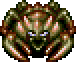
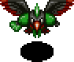
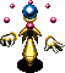

## Monster List

Monster Book Order

<table id="monsterList" class="monsterPageTable">
  <tr>
    <th colspan="9">Monster (Family)</th>
  </tr>
  <tr>
    <th>1</th>
    <th>2</th>
    <th>3</th>
    <th>4</th>
    <th>5</th>
    <th>6</th>
    <th>7</th>
    <th>8</th>
    <th>9</th>
  </tr>
  <tr>
    <td class="highlightYellow"><a href="#mamel">Mamel</a></td>
    <td class="highlightGray"><a href="#sweet-nut">Sweet Nut</a></td>
    <td class="highlightYellow"><a href="#fearabbit">Fearabbit</a></td>
    <td class="highlightGray"><a href="#mutaikon">Mutaikon</a></td>
    <td class="highlightYellow"><a href="#kid-squid">Kid Squid</a></td>
    <td class="highlightGray"><a href="#zalokleft">Zalokleft</a></td>
    <td class="highlightYellow"><a href="#porky">Porky</a></td>
    <td class="highlightGray"><a href="#fo-ub">FO-Uβ</a></td>
    <td class="highlightYellow"><a href="#field-knave">Field Knave</a></td>
  </tr>
  <tr>
    <td class="highlightYellow"><a href="#sproutant">Sproutant</a></td>
    <td class="highlightGray"><a href="#blade-bee">Blade Bee</a></td>
    <td class="highlightYellow"><a href="#gyaza">Gyaza</a></td>
    <td class="highlightGray"><a href="#naptapir">Naptapir</a></td>
    <td class="highlightYellow"><a href="#foly">Foly</a></td>
    <td class="highlightGray"><a href="#eligan">Eligan</a></td>
    <td class="highlightYellow"><a href="#boy-cart">Boy Cart</a></td>
    <td class="highlightGray"><a href="#myriman">Myriman</a></td>
    <td class="highlightYellow"><a href="#maneater">Maneater</a></td>
  </tr>
  <tr>
    <td class="highlightYellow"><a href="#colum">Colum</a></td>
    <td class="highlightGray"><a href="#nigiri-baby">Nigiri Baby</a></td>
    <td class="highlightYellow"><a href="#pumphantasm">Pumphantasm</a></td>
    <td class="highlightGray"><a href="#swordsman">Swordsman</a></td>
    <td class="highlightYellow"><a href="#bored-kappa">Bored Kappa</a></td>
    <td class="highlightGray"><a href="#gyadon">Gyadon</a></td>
    <td class="highlightYellow"><a href="#pop-tank">Pop Tank</a></td>
    <td class="highlightGray"><a href="#moseal">Moseal</a></td>
    <td class="highlightYellow"><a href="#jack-wand">Jack Wand</a></td>
  </tr>
  <tr>
    <td class="highlightYellow"><a href="#seedie">Seedie</a></td>
    <td class="highlightGray"><a href="#froggo">Froggo</a></td>
    <td class="highlightYellow"><a href="#floaty">Floaty</a></td>
    <td class="highlightGray"><a href="#mudkin">Mudkin</a></td>
    <td class="highlightYellow"><a href="#hopodile">Hopodile</a></td>
    <td class="highlightGray"><a href="#gazer">Gazer</a></td>
    <td class="highlightYellow"><a href="#absorbiphant">Absorbiphant</a></td>
    <td class="highlightGray"><a href="#kumonigiri">Kumonigiri</a></td>
    <td class="highlightYellow"><a href="#boss-group">Boss Group</a></td>
  </tr>
  <tr>
    <td class="highlightYellow"><a href="#chintala">Chintala</a></td>
    <td class="highlightGray"><a href="#karakuroid">Karakuroid</a></td>
    <td class="highlightYellow"><a href="#ndubba">N'dubba</a></td>
    <td class="highlightGray"><a href="#polygon-spinna">Polygon Spinna</a></td>
    <td class="highlightYellow"><a href="#flamebird">Flamebird</a></td>
    <td class="highlightGray"><a href="#zapdon">Zapdon</a></td>
    <td class="highlightYellow"><a href="#punisher">Punisher</a></td>
    <td class="highlightGray"><a href="#shagga">Shagga</a></td>
    <td class="highlightYellow"><a href="#shopkeeper">Shopkeeper</a></td>
  </tr>
  <tr>
    <td class="highlightYellow"><a href="#grass-boy">Grass Boy</a></td>
    <td class="highlightGray"><a href="#tiger-tosser">Tiger Tosser</a></td>
    <td class="highlightYellow"><a href="#mixer">Mixer</a></td>
    <td class="highlightGray"><a href="#metalhead">Metalhead</a></td>
    <td class="highlightYellow"><a href="#yanpii">Yanpii</a></td>
    <td class="highlightGray"><a href="#dragon">Dragon</a></td>
    <td class="highlightYellow"><a href="#firepuff">Firepuff</a></td>
    <td class="highlightGray"><a href="#explochin">Explochin</a></td>
    <td></td>
  </tr>
  <tr>
    <td class="highlightYellow"><a href="#pin-kid">Pin Kid</a></td>
    <td class="highlightGray"><a href="#curse-girl">Curse Girl</a></td>
    <td class="highlightYellow"><a href="#scorpion">Scorpion</a></td>
    <td class="highlightGray"><a href="#cheer-ham">Cheer-Ham</a></td>
    <td class="highlightYellow"><a href="#scoopie">Scoopie</a></td>
    <td class="highlightGray"><a href="#dj-mage">DJ Mage</a></td>
    <td class="highlightYellow"><a href="#crow-tengu">Crow Tengu</a></td>
    <td class="highlightGray"><a href="#chow">Chow</a></td>
    <td></td>
  </tr>
</table>

Element Order

<table class="firstYellowTable">
  <tr>
    <th>Element</th>
    <th>Monsters (Family or Individual)</th>
    <th>Info</th>
  </tr>
  <tr>
    <td class="highlightYellow">Swift 1</td>
    <td><a href="#pin-kid">Pin Kid</a> | <a href="#karakuroid">Karakuroid</a> | <a href="#floaty">Floaty</a> | <a href="#foly">Foly</a> | <a href="#boy-cart">Boy Cart</a> | <a href="#pop-tank">Ornery Tank</a> | <a href="#chow">Chow</a> | <a href="#shopkeeper">Shopkeeper</a></td>
    <td>Double speed, attacks once</td>
  </tr>
  <tr>
    <td class="highlightYellow">Swift 2</td>
    <td><a href="#mamel">Gitan Mamel</a> | <a href="#pop-tank">Cranky Tank</a> | <a href="#fo-ub">FO-Uβ</a></td>
    <td>Double speed, attacks twice</td>
  </tr>
  <tr>
    <td class="highlightYellow">Slow</td>
    <td><a href="#zapdon">Zapdon</a> | <a href="#pop-tank">Pop Tank</a></td>
    <td>One action every 2 turns</td>
  </tr>
  <tr>
    <td class="highlightYellow">Rust</td>
    <td><a href="#grass-boy">Grass Boy</a> | <a href="#pin-kid">Pin Kid</a> | <a href="#sweet-nut">Sweet Nut</a> | <a href="#karakuroid">Karakuroid</a> | <a href="#swordsman">Swordsman</a> | <a href="#flamebird">Flamebird</a> | <a href="#scoopie">Scoopie</a> <a href="#zapdon">Zapdon</a> | <a href="#boy-cart">Boy Cart</a> | <a href="#pop-tank">Pop Tank</a> | <a href="#absorbiphant">Absorbiphant</a> | <a href="#punisher">Punisher</a> | <a href="#fo-ub">FO-Uβ</a> | <a href="#shagga">Shagga</a></td>
    <td>Splash water from a <a href="#">Water Pot</a> to apply a negative effect.</td>
  </tr>
  <tr>
    <td class="highlightYellow">Normal</td>
    <td><a href="#mamel">Mamel</a> | <a href="#colum">Colum</a> | <a href="#chintala">Chintala</a> | <a href="#nigiri-baby">Nigiri Baby</a> | <a href="#froggo">Froggo</a> | <a href="#tiger-tosser">Tiger Tosser</a> | <a href="#curse-girl">Curse Girl</a> | <a href="#floaty">Floaty</a> <a href="#mixer">Mixer</a> | <a href="#naptapir">Naptapir</a> | <a href="#swordsman">Swordsman</a> | <a href="#cheer-ham">Cheer-Ham</a> | <a href="#yanpii">Yanpii</a> | <a href="#eligan">Eligan</a> | <a href="#zapdon">Zapdon</a> | <a href="#porky">Porky</a> <a href="#boy-cart">Boy Cart</a> | <a href="#punisher">Punisher</a> | <a href="#kumonigiri">Kumonigiri</a> | <a href="#field-knave">Field Knave</a> | <a href="#maneater">Maneater</a> | <a href="#shopkeeper">Shopkeeper</a></td>
    <td>No type-effective weakness</td>
  </tr>
  <tr>
    <td class="highlightYellow">Cyclops</td>
    <td><a href="#metalhead">Metalhead</a> | <a href="#foly">Foly</a> | <a href="#gazer">Gazer</a> | <a href="#explochin">Explochin</a></td>
    <td>Weak to Anti-Cyclops rune</td>
  </tr>
  <tr>
    <td class="highlightYellow">Drain</td>
    <td><a href="#scorpion">Scorpion</a> | <a href="#polygon-spinna">Polygon Spinna</a> | <a href="#absorbiphant">Absorbiphant</a> | <a href="#myriman">Myriman</a></td>
    <td>Weak to Anti-Drain rune</td>
  </tr>
  <tr>
    <td class="highlightYellow">Dragon</td>
    <td><a href="#hopodile">Hopodile</a> | <a href="#dragon">Dragon</a> | <a href="#firepuff">Firepuff</a> | <a href="#shagga">Shagga</a></td>
    <td>Weak to Anti-Dragon rune</td>
  </tr>
  <tr>
    <td class="highlightYellow">Explode</td>
    <td><a href="#sweet-nut">Sweet Nut</a> | <a href="#pop-tank">Pop Tank</a> | <a href="#explochin">Explochin</a></td>
    <td>Weak to Anti-Explode rune</td>
  </tr>
  <tr>
    <td class="highlightYellow">Metal</td>
    <td><a href="#karakuroid">Karakuroid</a> | <a href="#ndubba">N'dubba</a> | <a href="#scoopie">Scoopie</a> | <a href="#pop-tank">Pop Tank</a> | <a href="#fo-ub">FO-Uβ</a></td>
    <td>Weak to Anti-Metal rune</td>
  </tr>
  <tr>
    <td class="highlightYellow">Plant</td>
    <td><a href="#sproutant">Sproutant</a> | <a href="#seedie">Seedie</a> | <a href="#grass-boy">Grass Boy</a> | <a href="#pin-kid">Pin Kid</a> | <a href="#sweet-nut">Sweet Nut</a> | <a href="#pumphantasm">Pumphantasm</a> | <a href="#mutaikon">Mutaikon</a></td>
    <td>Weak to Anti-Plant rune</td>
  </tr>
  <tr>
    <td class="highlightYellow">Magic</td>
    <td><a href="#fearabbit">Fearabbit</a> | <a href="#polygon-spinna">Polygon Spinna</a> | <a href="#gazer">Gazer</a> | <a href="#dj-mage">DJ Mage</a></td>
    <td>Weak to Anti-Magic rune</td>
  </tr>
  <tr>
    <td class="highlightYellow">Floating</td>
    <td><a href="#blade-bee">Blade Bee</a> | <a href="#pumphantasm">Pumphantasm</a> | <a href="#foly">Foly</a> | <a href="#flamebird">Flamebird</a> | <a href="#gyadon">Gyadon</a> | <a href="#firepuff">Firepuff</a> | <a href="#crow-tengu">Crow Tengu</a> <a href="#fo-ub">FO-Uβ</a> | <a href="#chow">Chow</a></td>
    <td>Weak to Anti-Floating rune</td>
  </tr>
  <tr>
    <td class="highlightYellow">Aquatic</td>
    <td><a href="#gyaza">Gyaza</a> | <a href="#mudkin">Mudkin</a> | <a href="#kid-squid">Kid Squid</a> | <a href="#bored-kappa">Bored Kappa</a> | <a href="#hopodile">Hopodile</a> | <a href="#zalokleft">Zalokleft</a> | <a href="#moseal">Moseal</a> <a href="#explochin">Explochin</a></td>
    <td>Weak to Anti-Aquatic rune</td>
  </tr>
  <tr>
    <td class="highlightYellow">Power</td>
    <td><a href="#sproutant">Sproutant</a> | <a href="#scorpion">Scorpion</a> | <a href="#metalhead">Metalhead</a> | <a href="#eligan">Eligan</a> | <a href="#gyadon">Gyadon</a> | <a href="#zapdon">Zapdon</a> | <a href="#porky">Porky</a> | <a href="#pop-tank">Pop Tank</a> <a href="#absorbiphant">Absorbiphant</a></td>
    <td>Appears in power houses</td>
  </tr>
  <tr>
    <td class="highlightYellow">Greed</td>
    <td><a href="#sweet-nut">Sweet Nut</a> | <a href="#froggo">Froggo</a> | <a href="#curse-girl">Curse Girl</a> | <a href="#mixer">Mixer</a> | <a href="#swordsman">Swordsman</a> | <a href="#zalokleft">Zalokleft</a> | <a href="#gyadon">Gyadon</a></td>
    <td>Appears in greed houses</td>
  </tr>
  <tr>
    <td class="highlightYellow">Projectile</td>
    <td><a href="#grass-boy">Grass Boy</a> | <a href="#tiger-tosser">Tiger Tosser</a> | <a href="#floaty">Floaty</a> | <a href="#mutaikon">Mutaikon</a> | <a href="#bored-kappa">Bored Kappa</a> | <a href="#scoopie">Scoopie</a> | <a href="#porky">Porky</a> <a href="#boy-cart">Boy Cart</a> | <a href="#field-knave">Field Knave</a></td>
    <td>Appears in projectile houses</td>
  </tr>
  <tr>
    <td class="highlightYellow">Explosive</td>
    <td><a href="#sweet-nut">Sweet Nut</a> | <a href="#flamebird">Flamebird</a> | <a href="#dragon">Dragon</a> | <a href="#firepuff">Firepuff</a> | <a href="#pop-tank">Pop Tank</a> | <a href="#explochin">Explochin</a></td>
    <td>Appears in explosive houses</td>
  </tr>
  <tr>
    <td class="highlightYellow">Harass</td>
    <td><a href="#karakuroid">Karakuroid</a> | <a href="#fearabbit">Fearabbit</a> | <a href="#polygon-spinna">Polygon Spinna</a> | <a href="#cheer-ham">Cheer-Ham</a> | <a href="#yanpii">Yanpii</a> | <a href="#scoopie">Scoopie</a> | <a href="#gazer">Gazer</a> <a href="#dj-mage">DJ Mage</a> | <a href="#absorbiphant">Absorbiphant</a> | <a href="#myriman">Myriman</a> | <a href="#explochin">Explochin</a></td>
    <td>Appears in harassment houses</td>
  </tr>
</table>

## Details

### Mamel

  

<table class="monsterPageTable">
  <tr>
    <th>Lv</th>
    <th>Name</th>
    <th>HP</th>
    <th>Atk</th>
    <th>Def</th>
    <th>Exp</th>
    <th>Skill</th>
    <th>Drop</th>
    <th>Elem.</th>
    <th>Abilities</th>
    <th>Notes</th>
  </tr>
  <tr>
    <td class="highlightYellow">1</td>
    <td>Mamel</td>
    <td>5</td>
    <td>2</td>
    <td>1</td>
    <td>2</td>
    <td>1</td>
    <td>4%</td>
    <td>-</td>
    <td rowspan="2">None.</td>
    <td>Mascot monster for the Shiren series.</td>
  </tr>
  <tr>
    <td class="highlightYellow">2</td>
    <td>Pit Mamel</td>
    <td>11</td>
    <td>6</td>
    <td>3</td>
    <td>5</td>
    <td>2</td>
    <td>4%</td>
    <td>-</td>
    <td>Slightly stronger Mamel.</td>
  </tr>
  <tr>
    <td class="highlightYellow">3</td>
    <td>Cave Mamel</td>
    <td>6</td>
    <td>60</td>
    <td>19</td>
    <td>888</td>
    <td>100</td>
    <td>4%</td>
    <td>-</td>
    <td>Converts all damage that doesn't ignore defense to 1.</td>
    <td>Direct attacks deal 1 damage to it. Fixed damage is still effective. Direct attacks are effective if Sealed.</td>
  </tr>
  <tr>
    <td class="highlightYellow">4</td>
    <td>Gitan Mamel</td>
    <td>12</td>
    <td>84</td>
    <td>38</td>
    <td>5500</td>
    <td>444</td>
    <td>100%</td>
    <td>Swift 2</td>
    <td>Double speed, 2 attacks. Converts all damage that doesn't ignore defense to 1. Drops 2000 Gitan.</td>
    <td>Same as above, but double speed. Often appears with Kappa Trolls and Kleptoads, so pick up the Gitan it drops. Seal it or equip a Counter rune shield if you don't have rocks / used Dodger Pot.</td>
  </tr>
  <tr>
    <th>Lv</th>
    <th>Name</th>
    <th>HP</th>
    <th>Atk</th>
    <th>Def</th>
    <th>Exp</th>
    <th>Skill</th>
    <th>Drop</th>
    <th>Elem.</th>
    <th>Abilities</th>
    <th>Notes</th>
  </tr>
  <tr>
    <td class="highlightNight">1</td>
    <td>Dark Mamel</td>
    <td>24</td>
    <td>14</td>
    <td>3</td>
    <td>22</td>
    <td>15</td>
    <td>4%</td>
    <td>-</td>
    <td rowspan="3">None.</td>
    <td rowspan="2">Stronger than daytime counterparts.</td>
  </tr>
  <tr>
    <td class="highlightNight">2</td>
    <td>Dark Pit Mamel</td>
    <td>35</td>
    <td>30</td>
    <td>4</td>
    <td>43</td>
    <td>80</td>
    <td>8%</td>
    <td>-</td>
  </tr>
  <tr>
    <td class="highlightNight">3</td>
    <td>Dark Cave Mamel</td>
    <td>40</td>
    <td>52</td>
    <td>6</td>
    <td>220</td>
    <td>450</td>
    <td>16%</td>
    <td>-</td>
    <td>-</td>
  </tr>
  <tr>
    <td class="highlightNight">4</td>
    <td>Dark Gitan Mamel</td>
    <td>68</td>
    <td>88</td>
    <td>8</td>
    <td>600</td>
    <td>500</td>
    <td>100%</td>
    <td>Swift 2</td>
    <td>Double speed, 2 attacks. Drops 2000 Gitan.</td>
    <td>Drops blessed Gitan even if defeated by other monsters, and can appear alongside Kappa monsters.</td>
  </tr>
</table>

### Sproutant

  

<table class="monsterPageTable">
  <tr>
    <th>Lv</th>
    <th>Name</th>
    <th>HP</th>
    <th>Atk</th>
    <th>Def</th>
    <th>Exp</th>
    <th>Skill</th>
    <th>Drop</th>
    <th>Elem.</th>
    <th>Abilities</th>
    <th>Notes</th>
  </tr>
  <tr>
    <td class="highlightYellow">1</td>
    <td>Sproutant</td>
    <td>5</td>
    <td>2</td>
    <td>1</td>
    <td>3</td>
    <td>2</td>
    <td>4%</td>
    <td rowspan="4">Plant Power</td>
    <td rowspan="4">The entire monster family gains immunity to the status condition after one is inflicted. If a different status condition is inflicted, the new one overwrites the previous immunity. It can't gain immunity to Sealed.</td>
    <td>Same stats as Mamel. Its ability is like a worse version of Absorbiphant.</td>
  </tr>
  <tr>
    <td class="highlightYellow">2</td>
    <td>Sproutyrant</td>
    <td>60</td>
    <td>22</td>
    <td>10</td>
    <td>14</td>
    <td>8</td>
    <td>4%</td>
    <td>Low exp, despite its strength.</td>
  </tr>
  <tr>
    <td class="highlightYellow">3</td>
    <td>Sprouterror</td>
    <td>88</td>
    <td>44</td>
    <td>24</td>
    <td>680</td>
    <td>240</td>
    <td>4%</td>
    <td>High attack, so don't underestimate it.</td>
  </tr>
  <tr>
    <td class="highlightYellow">4</td>
    <td>Sproutitan</td>
    <td>99</td>
    <td>85</td>
    <td>38</td>
    <td>1580</td>
    <td>345</td>
    <td>4%</td>
    <td>High power and solid defenses.</td>
  </tr>
  <tr>
    <th>Lv</th>
    <th>Name</th>
    <th>HP</th>
    <th>Atk</th>
    <th>Def</th>
    <th>Exp</th>
    <th>Skill</th>
    <th>Drop</th>
    <th>Elem.</th>
    <th>Abilities</th>
    <th>Notes</th>
  </tr>
  <tr>
    <td class="highlightNight">1</td>
    <td>Vile Sproutant</td>
    <td>35</td>
    <td>30</td>
    <td>3</td>
    <td>43</td>
    <td>36</td>
    <td>4%</td>
    <td rowspan="4">Plant Power</td>
    <td rowspan="4">Same as daytime abilities.</td>
    <td rowspan="4">Be careful using Crawling Confusion and Pot Party <a href="/shiren5/system/abilities">abilities</a>.</td>
  </tr>
  <tr>
    <td class="highlightNight">2</td>
    <td>Vile Sproutyrant</td>
    <td>37</td>
    <td>40</td>
    <td>4</td>
    <td>140</td>
    <td>190</td>
    <td>8%</td>
  </tr>
  <tr>
    <td class="highlightNight">3</td>
    <td>Vile Sprouterror</td>
    <td>56</td>
    <td>50</td>
    <td>5</td>
    <td>280</td>
    <td>270</td>
    <td>16%</td>
  </tr>
  <tr>
    <td class="highlightNight">4</td>
    <td>Vile Sproutitan</td>
    <td>58</td>
    <td>53</td>
    <td>6</td>
    <td>360</td>
    <td>360</td>
    <td>20%</td>
  </tr>
</table>

### Colum

  

<table class="monsterPageTable">
  <tr>
    <th>Lv</th>
    <th>Name</th>
    <th>HP</th>
    <th>Atk</th>
    <th>Def</th>
    <th>Exp</th>
    <th>Skill</th>
    <th>Drop</th>
    <th>Elem.</th>
    <th>Abilities</th>
    <th>Notes</th>
  </tr>
  <tr>
    <td class="highlightYellow">1</td>
    <td>Colum</td>
    <td>7</td>
    <td>7</td>
    <td>1</td>
    <td>4</td>
    <td>2</td>
    <td>4%</td>
    <td>-</td>
    <td rowspan="4">Rolls back 10 tiles if defeated by a direct attack, damaging anything it collides with equal to damage received. Doesn't roll if slain diagonally using Breeze Blade.</td>
    <td>Same stats as Seedie.</td>
  </tr>
  <tr>
    <td class="highlightYellow">2</td>
    <td>Cololum</td>
    <td>45</td>
    <td>15</td>
    <td>9</td>
    <td>33</td>
    <td>16</td>
    <td>4%</td>
    <td>-</td>
    <td>Hated on 1F of <a href="/shiren5/dungeon/rousing-paradise">Rousing Paradise</a>.</td>
  </tr>
  <tr>
    <td class="highlightYellow">3</td>
    <td>Colocolum</td>
    <td>66</td>
    <td>40</td>
    <td>18</td>
    <td>550</td>
    <td>150</td>
    <td>4%</td>
    <td>-</td>
    <td>Shopkeepers, NPCs, and ally monsters turn hostile if it collides with them.</td>
  </tr>
  <tr>
    <td class="highlightYellow">4</td>
    <td>Colocolocolum</td>
    <td>130</td>
    <td>75</td>
    <td>22</td>
    <td>1300</td>
    <td>330</td>
    <td>4%</td>
    <td>-</td>
    <td>Extremely high HP, and high attack.</td>
  </tr>
  <tr>
    <th>Lv</th>
    <th>Name</th>
    <th>HP</th>
    <th>Atk</th>
    <th>Def</th>
    <th>Exp</th>
    <th>Skill</th>
    <th>Drop</th>
    <th>Elem.</th>
    <th>Abilities</th>
    <th>Notes</th>
  </tr>
  <tr>
    <td class="highlightNight">1</td>
    <td>Bad Colum</td>
    <td>14</td>
    <td>5</td>
    <td>2</td>
    <td>3</td>
    <td>6</td>
    <td>4%</td>
    <td>-</td>
    <td rowspan="4">Same as daytime abilities.</td>
    <td rowspan="4">Bad Colums slain by other monsters roll too, so consider rushing stairs or eating a Juicy Peach on floors where these appear to avoid accidents.</td>
  </tr>
  <tr>
    <td class="highlightNight">2</td>
    <td>Bad Cololum</td>
    <td>50</td>
    <td>33</td>
    <td>3</td>
    <td>90</td>
    <td>60</td>
    <td>8%</td>
    <td>-</td>
  </tr>
  <tr>
    <td class="highlightNight">3</td>
    <td>Bad Colocolum</td>
    <td>60</td>
    <td>46</td>
    <td>4</td>
    <td>180</td>
    <td>120</td>
    <td>16%</td>
    <td>-</td>
  </tr>
  <tr>
    <td class="highlightNight">4</td>
    <td>Bad Colocolocolum</td>
    <td>70</td>
    <td>66</td>
    <td>5</td>
    <td>360</td>
    <td>450</td>
    <td>20%</td>
    <td>-</td>
  </tr>
</table>

### Seedie

  

<table class="monsterPageTable">
  <tr>
    <th>Lv</th>
    <th>Name</th>
    <th>HP</th>
    <th>Atk</th>
    <th>Def</th>
    <th>Exp</th>
    <th>Skill</th>
    <th>Drop</th>
    <th>Elem.</th>
    <th>Abilities</th>
    <th>Notes</th>
  </tr>
  <tr>
    <td class="highlightYellow">1</td>
    <td>Seedie</td>
    <td>7</td>
    <td>7</td>
    <td>1</td>
    <td>4</td>
    <td>1</td>
    <td>4%</td>
    <td rowspan="4">Plant</td>
    <td rowspan="4">None.</td>
    <td>Deals 6~8 damage without a shield. Loop attack → retreat to heal HP → attack to defeat it safely. Keeps the <a href="/shiren5/system/npcs#sparrow">Sparrow</a> NPC in business.</td>
  </tr>
  <tr>
    <td class="highlightYellow">2</td>
    <td>Beanie</td>
    <td>45</td>
    <td>23</td>
    <td>10</td>
    <td>125</td>
    <td>50</td>
    <td>4%</td>
    <td rowspan="3">Lower attack compared to Shiren 4.</td>
  </tr>
  <tr>
    <td class="highlightYellow">3</td>
    <td>Nuttie</td>
    <td>57</td>
    <td>51</td>
    <td>16</td>
    <td>850</td>
    <td>90</td>
    <td>4%</td>
  </tr>
  <tr>
    <td class="highlightYellow">4</td>
    <td>Grainie</td>
    <td>83</td>
    <td>70</td>
    <td>27</td>
    <td>1250</td>
    <td>250</td>
    <td>4%</td>
  </tr>
  <tr>
    <th>Lv</th>
    <th>Name</th>
    <th>HP</th>
    <th>Atk</th>
    <th>Def</th>
    <th>Exp</th>
    <th>Skill</th>
    <th>Drop</th>
    <th>Elem.</th>
    <th>Abilities</th>
    <th>Notes</th>
  </tr>
  <tr>
    <td class="highlightNight">1</td>
    <td>Hateful Seedie</td>
    <td>35</td>
    <td>30</td>
    <td>4</td>
    <td>56</td>
    <td>35</td>
    <td>4%</td>
    <td rowspan="4">Plant</td>
    <td rowspan="4">None.</td>
    <td>-</td>
  </tr>
  <tr>
    <td class="highlightNight">2</td>
    <td>Hateful Beanie</td>
    <td>45</td>
    <td>40</td>
    <td>6</td>
    <td>130</td>
    <td>100</td>
    <td>8%</td>
    <td>-</td>
  </tr>
  <tr>
    <td class="highlightNight">3</td>
    <td>Hateful Nuttie</td>
    <td>63</td>
    <td>60</td>
    <td>8</td>
    <td>260</td>
    <td>260</td>
    <td>16%</td>
    <td>-</td>
  </tr>
  <tr>
    <td class="highlightNight">4</td>
    <td>Hateful Grainie</td>
    <td>75</td>
    <td>92</td>
    <td>10</td>
    <td>380</td>
    <td>420</td>
    <td>20%</td>
    <td>-</td>
  </tr>
</table>

### Chintala

  

<table class="monsterPageTable">
  <tr>
    <th>Lv</th>
    <th>Name</th>
    <th>HP</th>
    <th>Atk</th>
    <th>Def</th>
    <th>Exp</th>
    <th>Skill</th>
    <th>Drop</th>
    <th>Elem.</th>
    <th>Abilities</th>
    <th>Notes</th>
  </tr>
  <tr>
    <td class="highlightYellow">1</td>
    <td>Chintala</td>
    <td>19</td>
    <td>9</td>
    <td>4</td>
    <td>12</td>
    <td>6</td>
    <td>4%</td>
    <td>-</td>
    <td rowspan="4">None.</td>
    <td>Over double HP compared to Shiren 4.</td>
  </tr>
  <tr>
    <td class="highlightYellow">2</td>
    <td>Mid Chintala</td>
    <td>45</td>
    <td>15</td>
    <td>9</td>
    <td>33</td>
    <td>10</td>
    <td>4%</td>
    <td>-</td>
    <td rowspan="2">Weak. Big Chintala's stats are about 10F behind.</td>
  </tr>
  <tr>
    <td class="highlightYellow">3</td>
    <td>Big Chintala</td>
    <td>65</td>
    <td>30</td>
    <td>11</td>
    <td>100</td>
    <td>40</td>
    <td>4%</td>
    <td>-</td>
  </tr>
  <tr>
    <td class="highlightYellow">4</td>
    <td>Huge Chintala</td>
    <td>92</td>
    <td>82</td>
    <td>28</td>
    <td>3600</td>
    <td>300</td>
    <td>4%</td>
    <td>-</td>
    <td>High offense, just like Shiren 4. Stats are the same as Bouncy.</td>
  </tr>
  <tr>
    <th>Lv</th>
    <th>Name</th>
    <th>HP</th>
    <th>Atk</th>
    <th>Def</th>
    <th>Exp</th>
    <th>Skill</th>
    <th>Drop</th>
    <th>Elem.</th>
    <th>Abilities</th>
    <th>Notes</th>
  </tr>
  <tr>
    <td class="highlightNight">1</td>
    <td>Evil Chintala</td>
    <td>14</td>
    <td>5</td>
    <td>2</td>
    <td>3</td>
    <td>4</td>
    <td>4%</td>
    <td>-</td>
    <td rowspan="4">None.</td>
    <td>-</td>
  </tr>
  <tr>
    <td class="highlightNight">2</td>
    <td>Evil Mid Chintala</td>
    <td>35</td>
    <td>32</td>
    <td>4</td>
    <td>56</td>
    <td>50</td>
    <td>8%</td>
    <td>-</td>
    <td>-</td>
  </tr>
  <tr>
    <td class="highlightNight">3</td>
    <td>Evil Big Chintala</td>
    <td>50</td>
    <td>56</td>
    <td>8</td>
    <td>380</td>
    <td>220</td>
    <td>16%</td>
    <td>-</td>
    <td>-</td>
  </tr>
  <tr>
    <td class="highlightNight">4</td>
    <td>Evil Huge Chintala</td>
    <td>63</td>
    <td>75</td>
    <td>16</td>
    <td>500</td>
    <td>300</td>
    <td>20%</td>
    <td>-</td>
    <td>-</td>
  </tr>
</table>

### Grass Kid

  

<table class="monsterPageTable">
  <tr>
    <th>Lv</th>
    <th>Name</th>
    <th>HP</th>
    <th>Atk</th>
    <th>Def</th>
    <th>Exp</th>
    <th>Skill</th>
    <th>Drop</th>
    <th>Elem.</th>
    <th>Abilities</th>
    <th>Notes</th>
  </tr>
  <tr>
    <td class="highlightYellow">1</td>
    <td>Grass Kid</td>
    <td>28</td>
    <td>10</td>
    <td>1</td>
    <td>5</td>
    <td>3</td>
    <td>-</td>
    <td rowspan="4">Rust Plant Projectile</td>
    <td>Throws grass. (Pierces) Spreads grass in a 1 tile radius. Becomes Pin Kid after using grass. Drops its grass if slain.</td>
    <td>High HP and attack early on. Slay it before it uses its grass to obtain grasses, but it can one-shot with Dragon Grass.</td>
  </tr>
  <tr>
    <td class="highlightYellow">2</td>
    <td>Grass Dude</td>
    <td>60</td>
    <td>25</td>
    <td>11</td>
    <td>160</td>
    <td>40</td>
    <td>-</td>
    <td>Same as Grass Kid. Becomes Pin Dude after using grass, and carries up to 2 grass items.</td>
    <td>Dracon Grass + Fencer combo can cause equipment loss in <a href="/shiren5/dungeon/pitfall-of-life">Pitfall of Life</a>.</td>
  </tr>
  <tr>
    <td class="highlightYellow">3</td>
    <td>Grass Poppa</td>
    <td>74</td>
    <td>49</td>
    <td>17</td>
    <td>640</td>
    <td>210</td>
    <td>-</td>
    <td>Same as Grass Kid. Becomes Pin Poppa after using grass, and carries up to 3 grass items.</td>
    <td>Ideal monster to <a href="/shiren5/guide/tips-and-tricks#grass-factory">farm grass</a>. It has high attack so don't let your guard down.</td>
  </tr>
  <tr>
    <td class="highlightYellow">4</td>
    <td>Grass Gramps</td>
    <td>94</td>
    <td>80</td>
    <td>22</td>
    <td>1060</td>
    <td>390</td>
    <td>-</td>
    <td>Same as Grass Kid. Becomes Pin Gramps after using grass, and carries up to 4 grass items.</td>
    <td>Very high attack. Level it down if you want to farm grass. Sleepy Grass or Rage Grass can easily lead to a collapse.</td>
  </tr>
  <tr>
    <th>Lv</th>
    <th>Name</th>
    <th>HP</th>
    <th>Atk</th>
    <th>Def</th>
    <th>Exp</th>
    <th>Skill</th>
    <th>Drop</th>
    <th>Elem.</th>
    <th>Abilities</th>
    <th>Notes</th>
  </tr>
  <tr>
    <td class="highlightNight">1</td>
    <td>Dark Grass Kid</td>
    <td>23</td>
    <td>14</td>
    <td>1</td>
    <td>18</td>
    <td>10</td>
    <td>-</td>
    <td rowspan="4">Rust Plant Projectile</td>
    <td>Same as Grass Kid. Becomes Foul Pin Kid after using grass.</td>
    <td rowspan="4">If it picks up grass, that grass won't be blessed when slain, but grass it generates on its own will be blessed. Blessed grass is usually nice, but remember that some bad effect ones like Rage Grass become more dangerous.</td>
  </tr>
  <tr>
    <td class="highlightNight">2</td>
    <td>Dark Grass Dude</td>
    <td>43</td>
    <td>26</td>
    <td>2</td>
    <td>90</td>
    <td>160</td>
    <td>-</td>
    <td>Same as Grass Kid. Becomes Foul Pin Dude after using grass, and carries up to 2 grass items.</td>
  </tr>
  <tr>
    <td class="highlightNight">3</td>
    <td>Dark Grass Poppa</td>
    <td>56</td>
    <td>43</td>
    <td>3</td>
    <td>250</td>
    <td>300</td>
    <td>-</td>
    <td>Same as Grass Kid. Becomes Foul Pin Poppa after using grass, and carries up to 3 grass items.</td>
  </tr>
  <tr>
    <td class="highlightNight">4</td>
    <td>Dark Grass Gramps</td>
    <td>66</td>
    <td>57</td>
    <td>5</td>
    <td>420</td>
    <td>460</td>
    <td>-</td>
    <td>Same as Grass Kid. Becomes Foul Pin Gramps after using grass, and carries up to 4 grass.</td>
  </tr>
</table>

### Pin Kid

  

<table class="monsterPageTable">
  <tr>
    <th>Lv</th>
    <th>Name</th>
    <th>HP</th>
    <th>Atk</th>
    <th>Def</th>
    <th>Exp</th>
    <th>Skill</th>
    <th>Drop</th>
    <th>Elem.</th>
    <th>Abilities</th>
    <th>Notes</th>
  </tr>
  <tr>
    <td class="highlightYellow">1</td>
    <td>Pin Kid</td>
    <td>28</td>
    <td>8</td>
    <td>1</td>
    <td>5</td>
    <td>1</td>
    <td>-</td>
    <td rowspan="4">Swift 1 Rust Plant</td>
    <td>Double speed, 1 attack. Runs away, but attacks if adjacent. Picks up grass, becomes Grass Kid.</td>
    <td rowspan="2">Lower attack than Grass Kid or Grass Dude, but double speed. Troublesome in hallways.</td>
  </tr>
  <tr>
    <td class="highlightYellow">2</td>
    <td>Pin Dude</td>
    <td>60</td>
    <td>20</td>
    <td>10</td>
    <td>100</td>
    <td>20</td>
    <td>-</td>
    <td>Same as Pin Kid, but becomes Grass Dude.</td>
  </tr>
  <tr>
    <td class="highlightYellow">3</td>
    <td>Pin Poppa</td>
    <td>76</td>
    <td>48</td>
    <td>16</td>
    <td>400</td>
    <td>80</td>
    <td>-</td>
    <td>Same as Pin Kid, but becomes Grass Poppa and can generate grass on its own.</td>
    <td>Similar attack as Grass Poppa. Generates its own grass after a number of turns pass, so it's excellent for <a href="/shiren5/guide/tips-and-tricks#grass-factory">farming grass</a>.</td>
  </tr>
  <tr>
    <td class="highlightYellow">4</td>
    <td>Pin Gramps</td>
    <td>94</td>
    <td>60</td>
    <td>20</td>
    <td>860</td>
    <td>140</td>
    <td>-</td>
    <td>Same as Pin Kid, but becomes Grass Gramps and can generate grass on its own.</td>
    <td>Significant attack boost when it becomes Grass Gramps. (+20)</td>
  </tr>
  <tr>
    <th>Lv</th>
    <th>Name</th>
    <th>HP</th>
    <th>Atk</th>
    <th>Def</th>
    <th>Exp</th>
    <th>Skill</th>
    <th>Drop</th>
    <th>Elem.</th>
    <th>Abilities</th>
    <th>Notes</th>
  </tr>
  <tr>
    <td class="highlightNight">1</td>
    <td>Foul Pin Kid</td>
    <td>23</td>
    <td>14</td>
    <td>1</td>
    <td>18</td>
    <td>12</td>
    <td>-</td>
    <td rowspan="4">Swift 1 Rust Plant</td>
    <td>Same as Pin Kid, but becomes Dark Grass Kid.</td>
    <td rowspan="4">Runs away, but it has random movement since it's a night monster, so it may end up approaching you and attacking. It's best to avoid going near it. It still tries to move toward grass, but it can't move in a straight line so it might take a bit to pick it up.</td>
  </tr>
  <tr>
    <td class="highlightNight">2</td>
    <td>Foul Pin Dude</td>
    <td>37</td>
    <td>24</td>
    <td>2</td>
    <td>100</td>
    <td>84</td>
    <td>-</td>
    <td>Same as Pin Kid, but becomes Dark Grass Dude.</td>
  </tr>
  <tr>
    <td class="highlightNight">3</td>
    <td>Foul Pin Poppa</td>
    <td>58</td>
    <td>22</td>
    <td>3</td>
    <td>220</td>
    <td>110</td>
    <td>-</td>
    <td>Same as Pin Kid, but becomes Dark Grass Poppa and can generate grass on its own.</td>
  </tr>
  <tr>
    <td class="highlightNight">4</td>
    <td>Foul Pin Gramps</td>
    <td>66</td>
    <td>39</td>
    <td>4</td>
    <td>440</td>
    <td>240</td>
    <td>-</td>
    <td>Same as Pin Kid, but becomes Dark Grass Gramps and can generate grass on its own.</td>
  </tr>
</table>

### Sweet Nut

  

<table class="monsterPageTable">
  <tr>
    <th>Lv</th>
    <th>Name</th>
    <th>HP</th>
    <th>Atk</th>
    <th>Def</th>
    <th>Exp</th>
    <th>Skill</th>
    <th>Drop</th>
    <th>Elem.</th>
    <th>Abilities</th>
    <th>Notes</th>
  </tr>
  <tr>
    <td class="highlightYellow">1</td>
    <td>Sweet Nut</td>
    <td>16</td>
    <td>11</td>
    <td>5</td>
    <td>15</td>
    <td>4</td>
    <td>-</td>
    <td rowspan="4">Rust Explode Plant Greed Explosive</td>
    <td rowspan="4">Eats thrown items, but has a 1/3 chance to explode. Doubles exp for every item it eats. (x2 → x4 → x8 → ... → x1024 max) Doesn't act on the turn it eats. It won't eat if inflicted with: Napping, Asleep, Sound Asleep, Sealed, Paralyzed, S-Paralyzed, Onigiri, Tottering</td>
    <td rowspan="4">Its explosion can be used to wipe out a group of enemies. Aiming for the x1024 multiplier is unrealistic.</td>
  </tr>
  <tr>
    <td class="highlightYellow">2</td>
    <td>Acrid Nut</td>
    <td>36</td>
    <td>21</td>
    <td>8</td>
    <td>35</td>
    <td>18</td>
    <td>-</td>
  </tr>
  <tr>
    <td class="highlightYellow">3</td>
    <td>Spicy Nut</td>
    <td>57</td>
    <td>52</td>
    <td>16</td>
    <td>150</td>
    <td>270</td>
    <td>-</td>
  </tr>
  <tr>
    <td class="highlightYellow">4</td>
    <td>Bitter Nut</td>
    <td>65</td>
    <td>70</td>
    <td>22</td>
    <td>400</td>
    <td>430</td>
    <td>-</td>
  </tr>
  <tr>
    <th>Lv</th>
    <th>Name</th>
    <th>HP</th>
    <th>Atk</th>
    <th>Def</th>
    <th>Exp</th>
    <th>Skill</th>
    <th>Drop</th>
    <th>Elem.</th>
    <th>Abilities</th>
    <th>Notes</th>
  </tr>
  <tr>
    <td class="highlightNight">1</td>
    <td>Putrid Sweet Nut</td>
    <td>55</td>
    <td>30</td>
    <td>1</td>
    <td>70</td>
    <td>35</td>
    <td>-</td>
    <td rowspan="4">Rust Explode Plant Greed Explosive</td>
    <td rowspan="4">Same as daytime abilities.</td>
    <td>High attack, but can be disposed of in the same way as daytime Sweet Nuts.</td>
  </tr>
  <tr>
    <td class="highlightNight">2</td>
    <td>Putrid Acrid Nut</td>
    <td>60</td>
    <td>40</td>
    <td>3</td>
    <td>150</td>
    <td>96</td>
    <td>-</td>
    <td rowspan="3">Leave a 1 tile gap if aiming for exp in case it explodes. Keep an eye on nearby enemies so that they don't defeat it after raising its exp multiplier.</td>
  </tr>
  <tr>
    <td class="highlightNight">3</td>
    <td>Putrid Spicy Nut</td>
    <td>65</td>
    <td>76</td>
    <td>5</td>
    <td>320</td>
    <td>350</td>
    <td>-</td>
  </tr>
  <tr>
    <td class="highlightNight">4</td>
    <td>Putrid Bitter Nut</td>
    <td>75</td>
    <td>85</td>
    <td>8</td>
    <td>700</td>
    <td>543</td>
    <td>-</td>
  </tr>
</table>

### Blade Bee

  

<table class="monsterPageTable">
  <tr>
    <th>Lv</th>
    <th>Name</th>
    <th>HP</th>
    <th>Atk</th>
    <th>Def</th>
    <th>Exp</th>
    <th>Skill</th>
    <th>Drop</th>
    <th>Elem.</th>
    <th>Abilities</th>
    <th>Notes</th>
  </tr>
  <tr>
    <td class="highlightYellow">1</td>
    <td>Blade Bee</td>
    <td>28</td>
    <td>10</td>
    <td>1</td>
    <td>5</td>
    <td>4</td>
    <td>-</td>
    <td rowspan="4">Floating</td>
    <td rowspan="2">Can back away after attacking. Special attack has double attack power and inflicts Confused, but also makes it collapse. (0 exp) Its special has 100% accuracy.</td>
    <td>Lower attack than in Shiren 4, but more HP and appears earlier. You risk getting one-shot by its special early on without a shield. Low exp, despite its strength.</td>
  </tr>
  <tr>
    <td class="highlightYellow">2</td>
    <td>Dagger Bee</td>
    <td>46</td>
    <td>27</td>
    <td>14</td>
    <td>165</td>
    <td>100</td>
    <td>-</td>
    <td>Incredible amount of skill points for how early it appears.</td>
  </tr>
  <tr>
    <td class="highlightYellow">3</td>
    <td>Katana Bee</td>
    <td>75</td>
    <td>47</td>
    <td>20</td>
    <td>400</td>
    <td>120</td>
    <td>-</td>
    <td rowspan="2">Same as Blade Bee, but can jump to a different tile within a 2 tile radius after attacking instead of backing away.</td>
    <td>Far lower attack than Shiren 4, but higher HP and defense. Its stinger still hurts.</td>
  </tr>
  <tr>
    <td class="highlightYellow">4</td>
    <td>Zanbeeto</td>
    <td>83</td>
    <td>63</td>
    <td>27</td>
    <td>1200</td>
    <td>250</td>
    <td>-</td>
    <td>Don't get stung by Zanbeeto2 in <a href="/shiren5/dungeon/storm-forest">Storm Forest</a> at all costs.</td>
  </tr>
  <tr>
    <th>Lv</th>
    <th>Name</th>
    <th>HP</th>
    <th>Atk</th>
    <th>Def</th>
    <th>Exp</th>
    <th>Skill</th>
    <th>Drop</th>
    <th>Elem.</th>
    <th>Abilities</th>
    <th>Notes</th>
  </tr>
  <tr>
    <td class="highlightNight">1</td>
    <td>Dark Blade Bee</td>
    <td>23</td>
    <td>14</td>
    <td>1</td>
    <td>18</td>
    <td>15</td>
    <td>4%</td>
    <td rowspan="4">Floating</td>
    <td rowspan="4">Same as daytime abilities.</td>
    <td>-</td>
  </tr>
  <tr>
    <td class="highlightNight">2</td>
    <td>Dark Dagger Bee</td>
    <td>37</td>
    <td>46</td>
    <td>3</td>
    <td>42</td>
    <td>100</td>
    <td>8%</td>
    <td>-</td>
  </tr>
  <tr>
    <td class="highlightNight">3</td>
    <td>Dark Katana Bee</td>
    <td>48</td>
    <td>55</td>
    <td>4</td>
    <td>225</td>
    <td>260</td>
    <td>16%</td>
    <td>-</td>
  </tr>
  <tr>
    <td class="highlightNight">4</td>
    <td>Dark Zanbeeto</td>
    <td>52</td>
    <td>76</td>
    <td>5</td>
    <td>335</td>
    <td>350</td>
    <td>20%</td>
    <td>-</td>
  </tr>
</table>

### Nigiri Baby

  

<table class="monsterPageTable">
  <tr>
    <th>Lv</th>
    <th>Name</th>
    <th>HP</th>
    <th>Atk</th>
    <th>Def</th>
    <th>Exp</th>
    <th>Skill</th>
    <th>Drop</th>
    <th>Elem.</th>
    <th>Abilities</th>
    <th>Notes</th>
  </tr>
  <tr>
    <td class="highlightYellow">1</td>
    <td>Nigiri Baby</td>
    <td>23</td>
    <td>12</td>
    <td>7</td>
    <td>18</td>
    <td>6</td>
    <td>4%</td>
    <td>-</td>
    <td>Collapses if hit by onigiri. (Non-sealed) Nullifies Onigiri status, heals HP instead.</td>
    <td>Not threatening, and chokes on thrown onigiri like usual.</td>
  </tr>
  <tr>
    <td class="highlightYellow">2</td>
    <td>Nigiri Morph</td>
    <td>55</td>
    <td>20</td>
    <td>11</td>
    <td>124</td>
    <td>60</td>
    <td>4%</td>
    <td>-</td>
    <td>Turns an item into a Large Onigiri when adjacent, excluding equipped items. Collapses if hit by onigiri. (Non-sealed) Nullifies Onigiri status, heals HP instead. Only drops Onigiri.</td>
    <td>Blessed pots are protected. Higher attack, so get creative for <a href="/shiren5/guide/tips-and-tricks#nigiri-morph-factory">Nigiri Morph Factory</a>.</td>
  </tr>
  <tr>
    <td class="highlightYellow">3</td>
    <td>Nigiri Boss</td>
    <td>66</td>
    <td>40</td>
    <td>20</td>
    <td>550</td>
    <td>125</td>
    <td>4%</td>
    <td>-</td>
    <td>Inflicts Onigiri status when adjacent. Collapses if hit by onigiri. (Non-sealed) Nullifies Onigiri status, heals HP instead. Only drops Large Onigiri.</td>
    <td>Stats from equipment are 0 while you have Onigiri status, and you risk collapsing from fire, explosions, or Decay Traps.</td>
  </tr>
  <tr>
    <td class="highlightYellow">4</td>
    <td>Nigiri King</td>
    <td>97</td>
    <td>69</td>
    <td>30</td>
    <td>3750</td>
    <td>170</td>
    <td>4%</td>
    <td>-</td>
    <td>Inflicts Onigiri status when adjacent. Turns an item into a Large Onigiri when adjacent, including equipped items. Collapses if hit by onigiri. (Non-sealed) Nullifies Onigiri status, heals HP instead. Only drops Huge Onigiri.</td>
    <td>Both special attack effects are troublesome, so don't give it a chance to act when adjacent.</td>
  </tr>
  <tr>
    <th>Lv</th>
    <th>Name</th>
    <th>HP</th>
    <th>Atk</th>
    <th>Def</th>
    <th>Exp</th>
    <th>Skill</th>
    <th>Drop</th>
    <th>Elem.</th>
    <th>Abilities</th>
    <th>Notes</th>
  </tr>
  <tr>
    <td class="highlightNight">1</td>
    <td>Foul Nigiri Baby</td>
    <td>33</td>
    <td>24</td>
    <td>4</td>
    <td>40</td>
    <td>15</td>
    <td>4%</td>
    <td>-</td>
    <td>Same as Nigiri Baby.</td>
    <td>Chokes on thrown onigiri like its daytime counterpart.</td>
  </tr>
  <tr>
    <td class="highlightNight">2</td>
    <td>Foul Nigiri Morph</td>
    <td>47</td>
    <td>43</td>
    <td>5</td>
    <td>120</td>
    <td>20</td>
    <td>8%</td>
    <td>-</td>
    <td rowspan="3">Same as daytime abilities, but turns items into Rotten Onigiri, and only drops Rotten Onigiri.</td>
    <td>Higher attack than Nigiri Morph and only makes Rotten Onigiri, so there's no reason to farm it.</td>
  </tr>
  <tr>
    <td class="highlightNight">3</td>
    <td>Foul Nigiri Boss</td>
    <td>63</td>
    <td>55</td>
    <td>7</td>
    <td>240</td>
    <td>45</td>
    <td>16%</td>
    <td>-</td>
    <td rowspan="2">You can't use <a href="/shiren5/system/abilities">abilities</a> if you have Onigiri status, and any torch you had equipped is lost.</td>
  </tr>
  <tr>
    <td class="highlightNight">4</td>
    <td>Foul Nigiri King</td>
    <td>73</td>
    <td>88</td>
    <td>12</td>
    <td>360</td>
    <td>220</td>
    <td>20%</td>
    <td>-</td>
  </tr>
</table>

### Froggo

  

<table class="monsterPageTable">
  <tr>
    <th>Lv</th>
    <th>Name</th>
    <th>HP</th>
    <th>Atk</th>
    <th>Def</th>
    <th>Exp</th>
    <th>Skill</th>
    <th>Drop</th>
    <th>Elem.</th>
    <th>Abilities</th>
    <th>Notes</th>
  </tr>
  <tr>
    <td class="highlightYellow">1</td>
    <td>Froggo</td>
    <td>23</td>
    <td>12</td>
    <td>7</td>
    <td>18</td>
    <td>1</td>
    <td>100%</td>
    <td rowspan="4">Greed</td>
    <td rowspan="3">Steals Gitan and warps, and then runs from Shiren at double speed. Doesn't use direct attacks. Stands on Gitan if it's on the ground. Drops Gitan when defeated. Heals HP when hit by Gitan.</td>
    <td rowspan="3">Place Gitan on the ground in a room to lure and hunt Froggos.</td>
  </tr>
  <tr>
    <td class="highlightYellow">2</td>
    <td>Froggucci</td>
    <td>47</td>
    <td>26</td>
    <td>15</td>
    <td>215</td>
    <td>5</td>
    <td>100%</td>
  </tr>
  <tr>
    <td class="highlightYellow">3</td>
    <td>Froggon</td>
    <td>67</td>
    <td>40</td>
    <td>20</td>
    <td>850</td>
    <td>20</td>
    <td>100%</td>
  </tr>
  <tr>
    <td class="highlightYellow">4</td>
    <td>Kleptoad</td>
    <td>80</td>
    <td>55</td>
    <td>17</td>
    <td>1000</td>
    <td>100</td>
    <td>100%</td>
    <td>Picks up Gitan and throws it in a straight line from up to 10 tiles away. Reflects thrown Gitan. Steals Gitan and warps, and then runs from Shiren at double speed. Doesn't use direct attacks. Drops Gitan when defeated. Won't throw Gitan after stealing.</td>
    <td>Often appears with Gitan Mamel and Kappa Troll, so don't leave Gitan on the ground.</td>
  </tr>
  <tr>
    <th>Lv</th>
    <th>Name</th>
    <th>HP</th>
    <th>Atk</th>
    <th>Def</th>
    <th>Exp</th>
    <th>Skill</th>
    <th>Drop</th>
    <th>Elem.</th>
    <th>Abilities</th>
    <th>Notes</th>
  </tr>
  <tr>
    <td class="highlightNight">1</td>
    <td>Snide Froggo</td>
    <td>26</td>
    <td>24</td>
    <td>0</td>
    <td>5</td>
    <td>5</td>
    <td>100%</td>
    <td rowspan="4">Greed</td>
    <td rowspan="3">Same as Froggo, but also uses direct attacks. (Not after stealing)</td>
    <td rowspan="3">It uses direct attacks even if it doesn't have a status condition.</td>
  </tr>
  <tr>
    <td class="highlightNight">2</td>
    <td>Snide Froggucci</td>
    <td>50</td>
    <td>36</td>
    <td>5</td>
    <td>10</td>
    <td>20</td>
    <td>100%</td>
  </tr>
  <tr>
    <td class="highlightNight">3</td>
    <td>Snide Froggon</td>
    <td>70</td>
    <td>50</td>
    <td>6</td>
    <td>15</td>
    <td>90</td>
    <td>100%</td>
  </tr>
  <tr>
    <td class="highlightNight">4</td>
    <td>Snide Kleptoad</td>
    <td>85</td>
    <td>65</td>
    <td>8</td>
    <td>20</td>
    <td>260</td>
    <td>100%</td>
    <td>Same as Kleptoad, but also uses direct attacks. (Not after stealing)</td>
    <td>Keep in mind that it can throw blessed Gitan dropped by night monsters fighting each other.</td>
  </tr>
</table>

### Karakuroid

  

<table class="monsterPageTable">
  <tr>
    <th>Lv</th>
    <th>Name</th>
    <th>HP</th>
    <th>Atk</th>
    <th>Def</th>
    <th>Exp</th>
    <th>Skill</th>
    <th>Drop</th>
    <th>Elem.</th>
    <th>Abilities</th>
    <th>Notes</th>
  </tr>
  <tr>
    <td class="highlightYellow">1</td>
    <td>Karakuroid</td>
    <td>32</td>
    <td>14</td>
    <td>8</td>
    <td>45</td>
    <td>9</td>
    <td>4%</td>
    <td rowspan="4">Swift 1 Rust Metal Harass</td>
    <td rowspan="4">Double speed, 1 attack. Initially Napping, and wakes if you enter or exit the room. Creates traps inside the room based on the floor's trap table. Can't set traps on entrances. Stops acting for 2 turns after creating a trap. Occasionally creates a trap when defeated.</td>
    <td rowspan="3">Decent attack and double speed. Stops moving when it sets a trap. The trap it sets when defeated can be created in hallways, so lure it onto an item before defeating it. Let it set arrow traps along the wall to collect wood, iron, and poison arrows.</td>
  </tr>
  <tr>
    <td class="highlightYellow">2</td>
    <td>Steamroid</td>
    <td>55</td>
    <td>25</td>
    <td>16</td>
    <td>240</td>
    <td>35</td>
    <td>4%</td>
  </tr>
  <tr>
    <td class="highlightYellow">3</td>
    <td>Electroid</td>
    <td>65</td>
    <td>38</td>
    <td>20</td>
    <td>770</td>
    <td>80</td>
    <td>4%</td>
  </tr>
  <tr>
    <td class="highlightYellow">4</td>
    <td>Cyberoid</td>
    <td>96</td>
    <td>80</td>
    <td>40</td>
    <td>3950</td>
    <td>300</td>
    <td>4%</td>
    <td>High stats, double speed. Use a <a href="/shiren5/item/pots#water-pot">Water Pot</a> or hit it after it sets a trap.</td>
  </tr>
  <tr>
    <th>Lv</th>
    <th>Name</th>
    <th>HP</th>
    <th>Atk</th>
    <th>Def</th>
    <th>Exp</th>
    <th>Skill</th>
    <th>Drop</th>
    <th>Elem.</th>
    <th>Abilities</th>
    <th>Notes</th>
  </tr>
  <tr>
    <td class="highlightNight">1</td>
    <td>Dark Karakuroid</td>
    <td>10</td>
    <td>8</td>
    <td>1</td>
    <td>2</td>
    <td>25</td>
    <td>4%</td>
    <td rowspan="4">Swift 1 Rust Metal Harass</td>
    <td rowspan="4">Same as daytime abilities.</td>
    <td rowspan="4">Night monsters move randomly, so it often stays in the room setting traps. It's dangerous to wait in hallways if it's awake, since it's double speed.</td>
  </tr>
  <tr>
    <td class="highlightNight">2</td>
    <td>Dark Steamroid</td>
    <td>42</td>
    <td>36</td>
    <td>3</td>
    <td>180</td>
    <td>100</td>
    <td>8%</td>
  </tr>
  <tr>
    <td class="highlightNight">3</td>
    <td>Dark Electroid</td>
    <td>53</td>
    <td>53</td>
    <td>5</td>
    <td>360</td>
    <td>190</td>
    <td>16%</td>
  </tr>
  <tr>
    <td class="highlightNight">4</td>
    <td>Dark Cyberoid</td>
    <td>64</td>
    <td>76</td>
    <td>8</td>
    <td>500</td>
    <td>260</td>
    <td>20%</td>
  </tr>
</table>

### Tiger Tosser

  

<table class="monsterPageTable">
  <tr>
    <th>Lv</th>
    <th>Name</th>
    <th>HP</th>
    <th>Atk</th>
    <th>Def</th>
    <th>Exp</th>
    <th>Skill</th>
    <th>Drop</th>
    <th>Elem.</th>
    <th>Abilities</th>
    <th>Notes</th>
  </tr>
  <tr>
    <td class="highlightYellow">1</td>
    <td>Tiger Tosser</td>
    <td>32</td>
    <td>13</td>
    <td>10</td>
    <td>45</td>
    <td>10</td>
    <td>4%</td>
    <td rowspan="4">Projectile</td>
    <td>Throws an adjacent creature at Shiren, or throws him at other creatures or onto traps. Range of 5 tiles, deals 5 damage. Throws you into a Monster House if in range.</td>
    <td>Lower attack than in Shiren 4.</td>
  </tr>
  <tr>
    <td class="highlightYellow">2</td>
    <td>Tiger Hurler</td>
    <td>68</td>
    <td>45</td>
    <td>18</td>
    <td>350</td>
    <td>35</td>
    <td>4%</td>
    <td>Same as Tiger Tosser, but range of 10 tiles, and deals 10 damage.</td>
    <td rowspan="2">Higher attack than in Shiren 4. Not a pushover compared to other monsters on the same floor range.</td>
  </tr>
  <tr>
    <td class="highlightYellow">3</td>
    <td>Tiger Chucker</td>
    <td>71</td>
    <td>58</td>
    <td>24</td>
    <td>850</td>
    <td>60</td>
    <td>4%</td>
    <td>Same as Tiger Tosser, but range of 15 tiles, and deals 15 damage.</td>
  </tr>
  <tr>
    <td class="highlightYellow">4</td>
    <td>Tiger Ace</td>
    <td>93</td>
    <td>72</td>
    <td>32</td>
    <td>2000</td>
    <td>170</td>
    <td>4%</td>
    <td>Same as Tiger Tosser, but range of 20 tiles, and deals 20 damage.</td>
    <td>Often appears with enemies you don't want to be next to like Swordmaster, Zalokleftis King, Nigiri King, Gyandoron, Ultra Gazer.</td>
  </tr>
  <tr>
    <th>Lv</th>
    <th>Name</th>
    <th>HP</th>
    <th>Atk</th>
    <th>Def</th>
    <th>Exp</th>
    <th>Skill</th>
    <th>Drop</th>
    <th>Elem.</th>
    <th>Abilities</th>
    <th>Notes</th>
  </tr>
  <tr>
    <td class="highlightNight">1</td>
    <td>Dark Tosser</td>
    <td>16</td>
    <td>9</td>
    <td>1</td>
    <td>10</td>
    <td>18</td>
    <td>4%</td>
    <td rowspan="4">Projectile</td>
    <td>Same as Tiger Tosser, but range of 5 tiles, and deals 10 damage.</td>
    <td rowspan="4">Dangerous when it throws night monsters from outside your view. It's difficult to predict or defend against it.</td>
  </tr>
  <tr>
    <td class="highlightNight">2</td>
    <td>Dark Hurler</td>
    <td>52</td>
    <td>45</td>
    <td>6</td>
    <td>130</td>
    <td>35</td>
    <td>8%</td>
    <td>Same as Tiger Tosser, but range of 10 tiles, and deals 20 damage.</td>
  </tr>
  <tr>
    <td class="highlightNight">3</td>
    <td>Dark Chucker</td>
    <td>65</td>
    <td>66</td>
    <td>9</td>
    <td>260</td>
    <td>220</td>
    <td>16%</td>
    <td>Same as Tiger Tosser, but range of 15 tiles, and deals 30 damage.</td>
  </tr>
  <tr>
    <td class="highlightNight">4</td>
    <td>Dark Ace</td>
    <td>73</td>
    <td>75</td>
    <td>11</td>
    <td>520</td>
    <td>300</td>
    <td>20%</td>
    <td>Same as Tiger Tosser, but range of 20 tiles, and deals 40 damage.</td>
  </tr>
</table>

### Curse Girl

  

<table class="monsterPageTable">
  <tr>
    <th>Lv</th>
    <th>Name</th>
    <th>HP</th>
    <th>Atk</th>
    <th>Def</th>
    <th>Exp</th>
    <th>Skill</th>
    <th>Drop</th>
    <th>Elem.</th>
    <th>Abilities</th>
    <th>Notes</th>
  </tr>
  <tr>
    <td class="highlightYellow">1</td>
    <td>Curse Girl</td>
    <td>20</td>
    <td>18</td>
    <td>4</td>
    <td>24</td>
    <td>7</td>
    <td>-</td>
    <td rowspan="4">Greed</td>
    <td rowspan="2">Curses or seals 1 item if adjacent. Exorcism Scroll deals 100 damage, and Imabikiso levels it up. Curse Traps grant Buffed status.</td>
    <td>Low HP. (Porky Rock one-shots) Somewhat high attack.</td>
  </tr>
  <tr>
    <td class="highlightYellow">2</td>
    <td>Cursister</td>
    <td>40</td>
    <td>22</td>
    <td>10</td>
    <td>110</td>
    <td>20</td>
    <td>-</td>
    <td>Shoot an arrow → direct attack.</td>
  </tr>
  <tr>
    <td class="highlightYellow">3</td>
    <td>Curspinster</td>
    <td>54</td>
    <td>34</td>
    <td>21</td>
    <td>820</td>
    <td>60</td>
    <td>-</td>
    <td rowspan="2">Same as Curse Girl, but curses or seals 2 items.</td>
    <td>Curses/seals 2 items, so be careful. Often appears with Horrabbit.</td>
  </tr>
  <tr>
    <td class="highlightYellow">4</td>
    <td>Cursenior</td>
    <td>78</td>
    <td>39</td>
    <td>24</td>
    <td>1800</td>
    <td>130</td>
    <td>-</td>
    <td>Higher defenses, so it's a bit trickier.</td>
  </tr>
  <tr>
    <th>Lv</th>
    <th>Name</th>
    <th>HP</th>
    <th>Atk</th>
    <th>Def</th>
    <th>Exp</th>
    <th>Skill</th>
    <th>Drop</th>
    <th>Elem.</th>
    <th>Abilities</th>
    <th>Notes</th>
  </tr>
  <tr>
    <td class="highlightNight">1</td>
    <td>Foul Curse Girl</td>
    <td>32</td>
    <td>24</td>
    <td>3</td>
    <td>34</td>
    <td>18</td>
    <td>-</td>
    <td rowspan="4">Greed</td>
    <td rowspan="4">Same as daytime abilities.</td>
    <td rowspan="4">Easy to avoid its special at night.</td>
  </tr>
  <tr>
    <td class="highlightNight">2</td>
    <td>Foul Cursister</td>
    <td>39</td>
    <td>30</td>
    <td>4</td>
    <td>120</td>
    <td>35</td>
    <td>-</td>
  </tr>
  <tr>
    <td class="highlightNight">3</td>
    <td>Foul Curspinster</td>
    <td>55</td>
    <td>46</td>
    <td>5</td>
    <td>240</td>
    <td>130</td>
    <td>-</td>
  </tr>
  <tr>
    <td class="highlightNight">4</td>
    <td>Foul Cursenior</td>
    <td>67</td>
    <td>57</td>
    <td>7</td>
    <td>360</td>
    <td>160</td>
    <td>-</td>
  </tr>
</table>

### Fearabbit

  

<table class="monsterPageTable">
  <tr>
    <th>Lv</th>
    <th>Name</th>
    <th>HP</th>
    <th>Atk</th>
    <th>Def</th>
    <th>Exp</th>
    <th>Skill</th>
    <th>Drop</th>
    <th>Elem.</th>
    <th>Abilities</th>
    <th>Notes</th>
  </tr>
  <tr>
    <td class="highlightYellow">1</td>
    <td>Fearabbit</td>
    <td>20</td>
    <td>15</td>
    <td>4</td>
    <td>15</td>
    <td>9</td>
    <td>4%</td>
    <td rowspan="4">Magic Harass</td>
    <td>Attracts up to 3 creatures in the same room. Traps don't trigger if you land on them. Doesn't use its special if adjacent. Can't be attracted by Fearabbits.</td>
    <td>Bad if other enemies are in the room. Use Scout on floors where it appears. Depending on turn order, you can get hit by other enemies on the same turn.</td>
  </tr>
  <tr>
    <td class="highlightYellow">2</td>
    <td>Scarabbit</td>
    <td>55</td>
    <td>26</td>
    <td>13</td>
    <td>130</td>
    <td>35</td>
    <td>4%</td>
    <td>Same as Fearabbit, but attracts up to 5 creatures.</td>
    <td>Attracts more enemies than Fearabbit. Focus on this monster if you see it inside a Monster House.</td>
  </tr>
  <tr>
    <td class="highlightYellow">3</td>
    <td>Horrabbit</td>
    <td>71</td>
    <td>42</td>
    <td>20</td>
    <td>850</td>
    <td>80</td>
    <td>4%</td>
    <td>Attracts up to 3 creatures on the same floor. Traps don't trigger if you land on them. Doesn't use its special if adjacent. Can't be attracted by Fearabbits.</td>
    <td>Attracts from anywhere on the current floor. Use Steady Shield or Extinction Scroll to prevent it from attracting you. Often appears with tricky enemies.</td>
  </tr>
  <tr>
    <td class="highlightYellow">4</td>
    <td>Terrabbit</td>
    <td>83</td>
    <td>53</td>
    <td>30</td>
    <td>1200</td>
    <td>200</td>
    <td>4%</td>
    <td>Same as Horrabbit, but attracts up to 5 creatures.</td>
    <td>Attracts more enemies than Horrabbit. Pretty high attack.</td>
  </tr>
  <tr>
    <th>Lv</th>
    <th>Name</th>
    <th>HP</th>
    <th>Atk</th>
    <th>Def</th>
    <th>Exp</th>
    <th>Skill</th>
    <th>Drop</th>
    <th>Elem.</th>
    <th>Abilities</th>
    <th>Notes</th>
  </tr>
  <tr>
    <td class="highlightNight">1</td>
    <td>Dark Fearabbit</td>
    <td>28</td>
    <td>20</td>
    <td>2</td>
    <td>32</td>
    <td>56</td>
    <td>4%</td>
    <td rowspan="4">Magic Harass</td>
    <td rowspan="4">Same as daytime abilities.</td>
    <td rowspan="2">Bad if attracted from out of view. Can lead to a collapse if Red Aura enemies or high power monsters like Filthy Shagga were in the same room.</td>
  </tr>
  <tr>
    <td class="highlightNight">2</td>
    <td>Dark Scarabbit</td>
    <td>42</td>
    <td>32</td>
    <td>3</td>
    <td>160</td>
    <td>80</td>
    <td>8%</td>
  </tr>
  <tr>
    <td class="highlightNight">3</td>
    <td>Dark Horrabbit</td>
    <td>45</td>
    <td>44</td>
    <td>5</td>
    <td>320</td>
    <td>130</td>
    <td>16%</td>
    <td rowspan="2">Extremely dangerous without Steady Shield. Night monsters generally hit hard, so you risk instantly collapsing. Some players use Crawling Confusion + Electrocute to defeat it before it has a chance to use its special.</td>
  </tr>
  <tr>
    <td class="highlightNight">4</td>
    <td>Dark Terrabbit</td>
    <td>61</td>
    <td>60</td>
    <td>6</td>
    <td>400</td>
    <td>220</td>
    <td>20%</td>
  </tr>
</table>

### Gyaza

  

<table class="monsterPageTable">
  <tr>
    <th>Lv</th>
    <th>Name</th>
    <th>HP</th>
    <th>Atk</th>
    <th>Def</th>
    <th>Exp</th>
    <th>Skill</th>
    <th>Drop</th>
    <th>Elem.</th>
    <th>Abilities</th>
    <th>Notes</th>
  </tr>
  <tr>
    <td class="highlightYellow">1</td>
    <td>Gyaza</td>
    <td>28</td>
    <td>19</td>
    <td>10</td>
    <td>45</td>
    <td>20</td>
    <td>4%</td>
    <td rowspan="4">Aquatic</td>
    <td rowspan="4">Converts effects other than direct attacks to 2 damage. Talismans still affect nearby monsters. Status runes, explosions, and Expulsion Scroll work, along with Nixer Scroll.</td>
    <td>Far weaker than in Shiren 4, but tricky for no direct attack restrictions.</td>
  </tr>
  <tr>
    <td class="highlightYellow">2</td>
    <td>Death Gyaza</td>
    <td>55</td>
    <td>37</td>
    <td>20</td>
    <td>270</td>
    <td>90</td>
    <td>4%</td>
    <td>On par with Lv1 Gyaza in Shiren 4. Not too scary with strong equipment.</td>
  </tr>
  <tr>
    <td class="highlightYellow">3</td>
    <td>Hell Gyaza</td>
    <td>70</td>
    <td>62</td>
    <td>30</td>
    <td>1340</td>
    <td>300</td>
    <td>4%</td>
    <td>Starting to have decent stats.</td>
  </tr>
  <tr>
    <td class="highlightYellow">4</td>
    <td>Doom Gyaza</td>
    <td>85</td>
    <td>80</td>
    <td>35</td>
    <td>3200</td>
    <td>600</td>
    <td>4%</td>
    <td>Weaker than other end game power type monsters, but terrifying when limit broken.</td>
  </tr>
  <tr>
    <th>Lv</th>
    <th>Name</th>
    <th>HP</th>
    <th>Atk</th>
    <th>Def</th>
    <th>Exp</th>
    <th>Skill</th>
    <th>Drop</th>
    <th>Elem.</th>
    <th>Abilities</th>
    <th>Notes</th>
  </tr>
  <tr>
    <td class="highlightNight">1</td>
    <td>Evil Gyaza</td>
    <td>32</td>
    <td>24</td>
    <td>3</td>
    <td>34</td>
    <td>40</td>
    <td>4%</td>
    <td rowspan="4">Aquatic</td>
    <td rowspan="4">Converts effects other than direct attacks to 2 damage. Talismans still affect nearby monsters. Status runes, explosions, and Expulsion Scroll work, along with abilities.</td>
    <td rowspan="4">Basically only <a href="/shiren5/system/abilities">abilities</a> are effective. <a href="/shiren5/system/allies#gen">Gen</a>'s shots deal 2 damage.</td>
  </tr>
  <tr>
    <td class="highlightNight">2</td>
    <td>Evil Death Gyaza</td>
    <td>47</td>
    <td>40</td>
    <td>4</td>
    <td>200</td>
    <td>260</td>
    <td>8%</td>
  </tr>
  <tr>
    <td class="highlightNight">3</td>
    <td>Evil Hell Gyaza</td>
    <td>56</td>
    <td>60</td>
    <td>5</td>
    <td>450</td>
    <td>350</td>
    <td>16%</td>
  </tr>
  <tr>
    <td class="highlightNight">4</td>
    <td>Evil Doom Gyaza</td>
    <td>68</td>
    <td>77</td>
    <td>6</td>
    <td>600</td>
    <td>500</td>
    <td>20%</td>
  </tr>
</table>

### Pumphantasm

  

<table class="monsterPageTable">
  <tr>
    <th>Lv</th>
    <th>Name</th>
    <th>HP</th>
    <th>Atk</th>
    <th>Def</th>
    <th>Exp</th>
    <th>Skill</th>
    <th>Drop</th>
    <th>Elem.</th>
    <th>Abilities</th>
    <th>Notes</th>
  </tr>
  <tr>
    <td class="highlightYellow">1</td>
    <td>Pumphantasm</td>
    <td>35</td>
    <td>20</td>
    <td>12</td>
    <td>43</td>
    <td>24</td>
    <td>-</td>
    <td rowspan="4">Plant Floating</td>
    <td rowspan="4">Can pass through walls. Unpredictable movement, sometimes doesn't attack. Items that pierce, rocks, talismans, Electric Staff are still effective. Equip a Wall Clip Bracelet to land direct attacks.</td>
    <td rowspan="2">Likely to attack when adjacent. Erratic movement, but slowly approaches you. Easily picks off <a href="/shiren5/system/allies">allies</a> in hallways.</td>
  </tr>
  <tr>
    <td class="highlightYellow">2</td>
    <td>Pumphantom</td>
    <td>66</td>
    <td>39</td>
    <td>18</td>
    <td>390</td>
    <td>40</td>
    <td>-</td>
  </tr>
  <tr>
    <td class="highlightYellow">3</td>
    <td>Pumpanshee</td>
    <td>77</td>
    <td>52</td>
    <td>20</td>
    <td>850</td>
    <td>80</td>
    <td>-</td>
    <td rowspan="2">Often appears with higher level Fearabbits, and dangerous if attracted inside a hallway. Helps to have talismans on hand.</td>
  </tr>
  <tr>
    <td class="highlightYellow">4</td>
    <td>Pumptergeist</td>
    <td>84</td>
    <td>80</td>
    <td>24</td>
    <td>2500</td>
    <td>170</td>
    <td>-</td>
  </tr>
  <tr>
    <th>Lv</th>
    <th>Name</th>
    <th>HP</th>
    <th>Atk</th>
    <th>Def</th>
    <th>Exp</th>
    <th>Skill</th>
    <th>Drop</th>
    <th>Elem.</th>
    <th>Abilities</th>
    <th>Notes</th>
  </tr>
  <tr>
    <td class="highlightNight">1</td>
    <td>Vile Pumphantasm</td>
    <td>43</td>
    <td>35</td>
    <td>2</td>
    <td>60</td>
    <td>30</td>
    <td>-</td>
    <td rowspan="4">Plant Floating</td>
    <td rowspan="4">Same as daytime abilities. Room type abilities work even if it's in a wall.</td>
    <td rowspan="4">Irritating when waiting for daytime. Pot Party works even if it's in a wall. Other night monsters move toward Shiren, but Vile Pumphantasms aim for the nearest creature.</td>
  </tr>
  <tr>
    <td class="highlightNight">2</td>
    <td>Vile Pumphantom</td>
    <td>53</td>
    <td>45</td>
    <td>5</td>
    <td>120</td>
    <td>100</td>
    <td>-</td>
  </tr>
  <tr>
    <td class="highlightNight">3</td>
    <td>Vile Pumpanshee</td>
    <td>65</td>
    <td>62</td>
    <td>4</td>
    <td>240</td>
    <td>160</td>
    <td>-</td>
  </tr>
  <tr>
    <td class="highlightNight">4</td>
    <td>Vile Pumptergeist</td>
    <td>77</td>
    <td>70</td>
    <td>9</td>
    <td>380</td>
    <td>260</td>
    <td>-</td>
  </tr>
</table>

### Floaty

  

<table class="monsterPageTable">
  <tr>
    <th>Lv</th>
    <th>Name</th>
    <th>HP</th>
    <th>Atk</th>
    <th>Def</th>
    <th>Exp</th>
    <th>Skill</th>
    <th>Drop</th>
    <th>Elem.</th>
    <th>Abilities</th>
    <th>Notes</th>
  </tr>
  <tr>
    <td class="highlightYellow">1</td>
    <td>Floaty</td>
    <td>23</td>
    <td>12</td>
    <td>7</td>
    <td>18</td>
    <td>6</td>
    <td>4%</td>
    <td rowspan="4">Swift 1 Projectile</td>
    <td rowspan="4">Double speed, 1 attack. Special warps you 1~3 floors when 3 of them surround you. Initially Napping in a group of 3. Steady Shield nullifies its warp.</td>
    <td rowspan="2">Buffed to Swift 1 in this game, and no longer guaranteed to wake when you enter the room. Use Inacc. Talisman or Invincible Grass to safely warp floors.</td>
  </tr>
  <tr>
    <td class="highlightYellow">2</td>
    <td>Poofy</td>
    <td>55</td>
    <td>27</td>
    <td>11</td>
    <td>24</td>
    <td>40</td>
    <td>4%</td>
  </tr>
  <tr>
    <td class="highlightYellow">3</td>
    <td>Jouncy</td>
    <td>73</td>
    <td>45</td>
    <td>21</td>
    <td>900</td>
    <td>80</td>
    <td>4%</td>
    <td>High attack and tricky to take on in a group. Talismans are nice.</td>
  </tr>
  <tr>
    <td class="highlightYellow">4</td>
    <td>Bouncy</td>
    <td>92</td>
    <td>82</td>
    <td>28</td>
    <td>4200</td>
    <td>170</td>
    <td>4%</td>
    <td>Very high attack, and extremely dangerous to fight as a group. Spirit Ham makes it even worse. If you don't hurry, the stairs room can become full of Bouncy.</td>
  </tr>
  <tr>
    <th>Lv</th>
    <th>Name</th>
    <th>HP</th>
    <th>Atk</th>
    <th>Def</th>
    <th>Exp</th>
    <th>Skill</th>
    <th>Drop</th>
    <th>Elem.</th>
    <th>Abilities</th>
    <th>Notes</th>
  </tr>
  <tr>
    <td class="highlightNight">1</td>
    <td>Evil Floaty</td>
    <td>33</td>
    <td>24</td>
    <td>2</td>
    <td>40</td>
    <td>14</td>
    <td>4%</td>
    <td rowspan="4">Swift 1 Projectile</td>
    <td rowspan="4">Same as daytime abilities.</td>
    <td rowspan="4">Levels up by defeating each other. Bad if you only have Fine Torch since it moves at double speed. Wait for day in a hallway if you lack Super Torch or Monster Detector.</td>
  </tr>
  <tr>
    <td class="highlightNight">2</td>
    <td>Evil Poofy</td>
    <td>43</td>
    <td>35</td>
    <td>4</td>
    <td>90</td>
    <td>40</td>
    <td>8%</td>
  </tr>
  <tr>
    <td class="highlightNight">3</td>
    <td>Evil Jouncy</td>
    <td>55</td>
    <td>47</td>
    <td>5</td>
    <td>150</td>
    <td>90</td>
    <td>16%</td>
  </tr>
  <tr>
    <td class="highlightNight">4</td>
    <td>Evil Bouncy</td>
    <td>86</td>
    <td>88</td>
    <td>14</td>
    <td>300</td>
    <td>150</td>
    <td>20%</td>
  </tr>
</table>

### N'dubba

  

<table class="monsterPageTable">
  <tr>
    <th>Lv</th>
    <th>Name</th>
    <th>HP</th>
    <th>Atk</th>
    <th>Def</th>
    <th>Exp</th>
    <th>Skill</th>
    <th>Drop</th>
    <th>Elem.</th>
    <th>Abilities</th>
    <th>Notes</th>
  </tr>
  <tr>
    <td class="highlightYellow">1</td>
    <td>N'dubba</td>
    <td>32</td>
    <td>16</td>
    <td>8</td>
    <td>16</td>
    <td>8</td>
    <td>-</td>
    <td rowspan="4">Metal</td>
    <td>Disguised as item, attacks if you try to pick it up. Can be picked up if you go on it with Swap Staff, etc. Reveals itself and attacks if you try to use or insert it. Identified when changing floors. Remains when time of day changes, but vanishes if revealed. Can be sold. Revealed if merchandise is identified. Initially Napping if in a Gitan room.</td>
    <td>Strong threat in <a href="/shiren5/dungeon/pitfall-of-life">Pitfall of Life</a>. Metal, but not weak to water.</td>
  </tr>
  <tr>
    <td class="highlightYellow">2</td>
    <td>N'twyn</td>
    <td>70</td>
    <td>34</td>
    <td>17</td>
    <td>360</td>
    <td>20</td>
    <td>-</td>
    <td>Disguised as item, doesn't reveal itself if picked up. Reveals itself and attacks if you try to use or insert it. Identified when changing floors. Remains when time of day changes, but vanishes if revealed. Can be sold. Revealed if merchandise is identified.</td>
    <td>Unlike N'mach, you can check if an item is real by inserting it into a pot.</td>
  </tr>
  <tr>
    <td class="highlightYellow">3</td>
    <td>N'mach</td>
    <td>77</td>
    <td>48</td>
    <td>22</td>
    <td>800</td>
    <td>40</td>
    <td>-</td>
    <td>Disguised as item, doesn't reveal itself if picked up. Reveals itself and attacks if you try to use or insert it. Not identified when changing floors. Remains when time of day changes, but vanishes if revealed. Can be sold. Revealed if merchandise is identified. </td>
    <td>Unlike Shiren 4, you can check if items are disguised N'machs by identifying. Doesn't appear on as many floor ranges in this game.</td>
  </tr>
  <tr>
    <td class="highlightYellow">4</td>
    <td>N'dup</td>
    <td>92</td>
    <td>60</td>
    <td>28</td>
    <td>3200</td>
    <td>80</td>
    <td>-</td>
    <td>Has the ability of N'dubba, N'twyn, or N'mach selected at random.</td>
    <td>N'dubba, N'mach abilites are dangerous on late game floors, so it's best to ignore items on floors where it can appear, especially in DLC dungeons where limit broken N'dup is in the monster table.</td>
  </tr>
  <tr>
    <th>Lv</th>
    <th>Name</th>
    <th>HP</th>
    <th>Atk</th>
    <th>Def</th>
    <th>Exp</th>
    <th>Skill</th>
    <th>Drop</th>
    <th>Elem.</th>
    <th>Abilities</th>
    <th>Notes</th>
  </tr>
  <tr>
    <td class="highlightNight">1</td>
    <td>Dark N'dubba</td>
    <td>35</td>
    <td>32</td>
    <td>4</td>
    <td>56</td>
    <td>30</td>
    <td>-</td>
    <td rowspan="4">Metal</td>
    <td rowspan="4">Same as daytime abilities.</td>
    <td rowspan="4">Higher attack and more of a threat than its day counterpart.</td>
  </tr>
  <tr>
    <td class="highlightNight">2</td>
    <td>Dark N'twyn</td>
    <td>45</td>
    <td>45</td>
    <td>5</td>
    <td>150</td>
    <td>50</td>
    <td>-</td>
  </tr>
  <tr>
    <td class="highlightNight">3</td>
    <td>Dark N'mach</td>
    <td>63</td>
    <td>60</td>
    <td>8</td>
    <td>300</td>
    <td>160</td>
    <td>-</td>
  </tr>
  <tr>
    <td class="highlightNight">4</td>
    <td>Dark N'dup</td>
    <td>72</td>
    <td>70</td>
    <td>9</td>
    <td>450</td>
    <td>260</td>
    <td>-</td>
  </tr>
</table>

### Mixer

  

<table class="monsterPageTable">
  <tr>
    <th>Lv</th>
    <th>Name</th>
    <th>HP</th>
    <th>Atk</th>
    <th>Def</th>
    <th>Exp</th>
    <th>Skill</th>
    <th>Drop</th>
    <th>Elem.</th>
    <th>Abilities</th>
    <th>Notes</th>
  </tr>
  <tr>
    <td class="highlightYellow">1</td>
    <td>Mixer</td>
    <td>40</td>
    <td>15</td>
    <td>6</td>
    <td>15</td>
    <td>8</td>
    <td>-</td>
    <td rowspan="4">Greed</td>
    <td>Eats up to 2 thrown items and synthesizes them. Gains Buffed status by 1 stage per eaten item. Eaten scrolls turn into Wet Scrolls. Eaten items are placed on the ground when time of day changes. Drops eaten items if inflicted with Tottering status. Number of items it eats +1 if it eats Stomach Expander, and -1 if it eats Stomach Shrinker, blessed = +2 / -2, max of 8 items. Won't eat if it's inflicted with: Napping, Asleep, Sound Asleep, Sealed, Paralyzed, S-Paralyzed, Onigiri, Tottering</td>
    <td>The key to early game synthesis. Its attacks don't hurt that much if you have a strong shield.</td>
  </tr>
  <tr>
    <td class="highlightYellow">2</td>
    <td>Mixermon</td>
    <td>70</td>
    <td>34</td>
    <td>20</td>
    <td>360</td>
    <td>20</td>
    <td>-</td>
    <td>Same as Mixer, but eats 3 items.</td>
    <td>High stats for when appears. Defeat it without taking damage.</td>
  </tr>
  <tr>
    <td class="highlightYellow">3</td>
    <td>Mixergon</td>
    <td>77</td>
    <td>48</td>
    <td>25</td>
    <td>800</td>
    <td>50</td>
    <td>-</td>
    <td>Same as Mixer, but eats 4 items.</td>
    <td>Higher attack, and basically immune to projectiles. Appears as early as 1F in <a href="/shiren5/dungeon/lost-well">Lost Well</a>.</td>
  </tr>
  <tr>
    <td class="highlightYellow">4</td>
    <td>Mixerdon</td>
    <td>92</td>
    <td>82</td>
    <td>35</td>
    <td>2200</td>
    <td>100</td>
    <td>-</td>
    <td>Same as Mixer, but eats 5 items.</td>
    <td>Its attack power is ridiculous after eating 5 items.</td>
  </tr>
  <tr>
    <th>Lv</th>
    <th>Name</th>
    <th>HP</th>
    <th>Atk</th>
    <th>Def</th>
    <th>Exp</th>
    <th>Skill</th>
    <th>Drop</th>
    <th>Elem.</th>
    <th>Abilities</th>
    <th>Notes</th>
  </tr>
  <tr>
    <td class="highlightNight">1</td>
    <td>Dark Mixer</td>
    <td>45</td>
    <td>20</td>
    <td>4</td>
    <td>43</td>
    <td>25</td>
    <td>-</td>
    <td rowspan="4">Greed</td>
    <td>Same as Mixer.</td>
    <td rowspan="4">Try to stop other monsters from defeating it while synthesizing. Daytime often has monsters that can destroy ground items on floors where these spawn, so collect the item quickly after time of day changes.</td>
  </tr>
  <tr>
    <td class="highlightNight">2</td>
    <td>Dark Mixermon</td>
    <td>60</td>
    <td>40</td>
    <td>6</td>
    <td>320</td>
    <td>80</td>
    <td>-</td>
    <td>Same as Mixer, but eats 3 items.</td>
  </tr>
  <tr>
    <td class="highlightNight">3</td>
    <td>Dark Mixergon</td>
    <td>72</td>
    <td>60</td>
    <td>10</td>
    <td>460</td>
    <td>130</td>
    <td>-</td>
    <td>Same as Mixer, but eats 4 items.</td>
  </tr>
  <tr>
    <td class="highlightNight">4</td>
    <td>Dark Mixerdon</td>
    <td>90</td>
    <td>86</td>
    <td>12</td>
    <td>780</td>
    <td>220</td>
    <td>-</td>
    <td>Same as Mixer, but eats 5 items.</td>
  </tr>
</table>

### Scorpion

  

<table class="monsterPageTable">
  <tr>
    <th>Lv</th>
    <th>Name</th>
    <th>HP</th>
    <th>Atk</th>
    <th>Def</th>
    <th>Exp</th>
    <th>Skill</th>
    <th>Drop</th>
    <th>Elem.</th>
    <th>Abilities</th>
    <th>Notes</th>
  </tr>
  <tr>
    <td class="highlightYellow">1</td>
    <td>Scorpion</td>
    <td>45</td>
    <td>21</td>
    <td>9</td>
    <td>41</td>
    <td>12</td>
    <td>2%</td>
    <td rowspan="4">Drain Power</td>
    <td>Lowers strength by 1 if adjacent. Antidote Grass deals 50 damage. Poison Grass and Poison Arrows grant Buffed status.</td>
    <td>Troublesome monster with high attack on early floors of <a href="/shiren5/dungeon/pitfall-of-life">Pitfall of Life</a>.</td>
  </tr>
  <tr>
    <td class="highlightYellow">2</td>
    <td>VeniScorp</td>
    <td>70</td>
    <td>45</td>
    <td>22</td>
    <td>480</td>
    <td>30</td>
    <td>2%</td>
    <td>Same as Scorpion, but lowers strength by 2.</td>
    <td>Higher stats. Losing 2 strength greatly lowers damage output.</td>
  </tr>
  <tr>
    <td class="highlightYellow">3</td>
    <td>StunScorp</td>
    <td>80</td>
    <td>60</td>
    <td>25</td>
    <td>1100</td>
    <td>80</td>
    <td>2%</td>
    <td>Same as Scorpion, but lowers max strength by 1.</td>
    <td rowspan="2">High attack and defense. Max strength can't be restored by Antidote Grass or Heal Pot.</td>
  </tr>
  <tr>
    <td class="highlightYellow">4</td>
    <td>BlightScorp</td>
    <td>95</td>
    <td>89</td>
    <td>36</td>
    <td>2700</td>
    <td>170</td>
    <td>2%</td>
    <td>Same as Scorpion, but lowers max strength by 2.</td>
  </tr>
  <tr>
    <th>Lv</th>
    <th>Name</th>
    <th>HP</th>
    <th>Atk</th>
    <th>Def</th>
    <th>Exp</th>
    <th>Skill</th>
    <th>Drop</th>
    <th>Elem.</th>
    <th>Abilities</th>
    <th>Notes</th>
  </tr>
  <tr>
    <td class="highlightNight">1</td>
    <td>Dark Scorpion</td>
    <td>27</td>
    <td>16</td>
    <td>2</td>
    <td>28</td>
    <td>25</td>
    <td>4%</td>
    <td rowspan="4">Drain Power</td>
    <td>Same as Scorpion, but lowers strength by 2.</td>
    <td rowspan="4">Easy to avoid its special at night.</td>
  </tr>
  <tr>
    <td class="highlightNight">2</td>
    <td>Dark VeniScorp</td>
    <td>65</td>
    <td>55</td>
    <td>5</td>
    <td>100</td>
    <td>180</td>
    <td>8%</td>
    <td>Same as Scorpion, but lowers strength by 3.</td>
  </tr>
  <tr>
    <td class="highlightNight">3</td>
    <td>Dark StunScorp</td>
    <td>75</td>
    <td>65</td>
    <td>6</td>
    <td>260</td>
    <td>260</td>
    <td>16%</td>
    <td>Same as Scorpion, but lowers max strength by 2.</td>
  </tr>
  <tr>
    <td class="highlightNight">4</td>
    <td>Dark BlightScorp</td>
    <td>86</td>
    <td>85</td>
    <td>14</td>
    <td>520</td>
    <td>420</td>
    <td>20%</td>
    <td>Same as Scorpion, but lowers max strength by 3.</td>
  </tr>
</table>

### Mutaikon

  

<table class="monsterPageTable">
  <tr>
    <th>Lv</th>
    <th>Name</th>
    <th>HP</th>
    <th>Atk</th>
    <th>Def</th>
    <th>Exp</th>
    <th>Skill</th>
    <th>Drop</th>
    <th>Elem.</th>
    <th>Abilities</th>
    <th>Notes</th>
  </tr>
  <tr>
    <td class="highlightYellow">1</td>
    <td>Mutaikon</td>
    <td>42</td>
    <td>15</td>
    <td>12</td>
    <td>49</td>
    <td>8</td>
    <td>6%</td>
    <td rowspan="4">Plant Projectile</td>
    <td>Throws Poison Grass 2 tiles ahead. Antidote Grass deals 50 damage. Poison Grass and Poison Arrows grant Buffed status. Only drops Poison Grass.</td>
    <td>Poison Grass lowers strength by 1 and inflicts Slow status. Easy to get discouraged if you get hit multiple times.</td>
  </tr>
  <tr>
    <td class="highlightYellow">2</td>
    <td>Dazikon</td>
    <td>46</td>
    <td>23</td>
    <td>16</td>
    <td>260</td>
    <td>20</td>
    <td>6%</td>
    <td>Same as Mutaikon, but throws Confusion Grass within a 2 tile radius instead, or Poison Grass if Shiren is already Confused. Only drops Confusion Grass.</td>
    <td>Actions are limited for a long time if you're confused and slow, and it can throw from outside of your view.</td>
  </tr>
  <tr>
    <td class="highlightYellow">3</td>
    <td>Dozikon</td>
    <td>61</td>
    <td>39</td>
    <td>20</td>
    <td>790</td>
    <td>80</td>
    <td>6%</td>
    <td>Same as Mutaikon, but throws Sleepy Grass within a 3 tile radius instead, or Poison Grass if Shiren is already Asleep. Only drops Sleepy Grass.</td>
    <td>Mean grass, and long range. Risk of sleeping forever if slowed at the same time. Keep an Alert or Cleansing bracelet equipped.</td>
  </tr>
  <tr>
    <td class="highlightYellow">4</td>
    <td>Mesmerikon</td>
    <td>75</td>
    <td>50</td>
    <td>26</td>
    <td>1300</td>
    <td>170</td>
    <td>6%</td>
    <td>Same as Mutaikon, but throws Rage Grass within a 5 tile radius instead, or Poison Grass if Shiren is already Berserk. Only drops Rage Grass.</td>
    <td>Evil incarnate, like in Shiren 4. Use a Dodger Pot, Immunity Scroll, or blessed Peach. Cleansing Bracelet also helps. Not in many dungeons.</td>
  </tr>
  <tr>
    <th>Lv</th>
    <th>Name</th>
    <th>HP</th>
    <th>Atk</th>
    <th>Def</th>
    <th>Exp</th>
    <th>Skill</th>
    <th>Drop</th>
    <th>Elem.</th>
    <th>Abilities</th>
    <th>Notes</th>
  </tr>
  <tr>
    <td class="highlightNight">1</td>
    <td>Dark Mutaikon</td>
    <td>33</td>
    <td>20</td>
    <td>3</td>
    <td>40</td>
    <td>7</td>
    <td>6%</td>
    <td rowspan="4">Plant Projectile</td>
    <td>Same as Mutaikon. Missed grass vanishes.</td>
    <td>No issue with a Super Torch.</td>
  </tr>
  <tr>
    <td class="highlightNight">2</td>
    <td>Dark Dazikon</td>
    <td>37</td>
    <td>24</td>
    <td>4</td>
    <td>100</td>
    <td>100</td>
    <td>8%</td>
    <td>Same as Dazikon. Missed grass vanishes.</td>
    <td>Abilities can be used like normal while you're Confused.</td>
  </tr>
  <tr>
    <td class="highlightNight">3</td>
    <td>Dark Dozikon</td>
    <td>56</td>
    <td>45</td>
    <td>6</td>
    <td>200</td>
    <td>170</td>
    <td>16%</td>
    <td>Same as Dozikon. Missed grass vanishes.</td>
    <td>Doesn't throw grass as often as its day counterpart.</td>
  </tr>
  <tr>
    <td class="highlightNight">4</td>
    <td>Dark Mesmerikon</td>
    <td>58</td>
    <td>53</td>
    <td>8</td>
    <td>400</td>
    <td>220</td>
    <td>20%</td>
    <td>Same as Mesmerikon. Missed grass vanishes.</td>
    <td>Berserk at night causes a collapse, so use Crawling Confusion to make it safer to search for the stairs.</td>
  </tr>
</table>

### Naptapir

  

<table class="monsterPageTable">
  <tr>
    <th>Lv</th>
    <th>Name</th>
    <th>HP</th>
    <th>Atk</th>
    <th>Def</th>
    <th>Exp</th>
    <th>Skill</th>
    <th>Drop</th>
    <th>Elem.</th>
    <th>Abilities</th>
    <th>Notes</th>
  </tr>
  <tr>
    <td class="highlightYellow">1</td>
    <td>Naptapir</td>
    <td>32</td>
    <td>27</td>
    <td>11</td>
    <td>46</td>
    <td>10</td>
    <td>4%</td>
    <td>-</td>
    <td rowspan="4">Occasionally inflicts Asleep status in a 1 tile radius when it's Napping, Asleep, or Sound Asleep. Chance to yawn if slain, inflicting Asleep status in a 1 tile radius. Always generated Napping, and won't wake up when you enter or exit the room. Shiren won't fall asleep if in a wall.</td>
    <td rowspan="4">Ridiculous HP and attack along with its troublesome ability means there's no merit to attacking it. Be wary of Naptapirs that spawn next to a room entrance.</td>
  </tr>
  <tr>
    <td class="highlightYellow">2</td>
    <td>Snooztapir</td>
    <td>80</td>
    <td>50</td>
    <td>15</td>
    <td>480</td>
    <td>89</td>
    <td>4%</td>
    <td>-</td>
  </tr>
  <tr>
    <td class="highlightYellow">3</td>
    <td>Doztapir</td>
    <td>100</td>
    <td>70</td>
    <td>20</td>
    <td>800</td>
    <td>170</td>
    <td>4%</td>
    <td>-</td>
  </tr>
  <tr>
    <td class="highlightYellow">4</td>
    <td>Comatapir</td>
    <td>120</td>
    <td>90</td>
    <td>27</td>
    <td>1150</td>
    <td>300</td>
    <td>4%</td>
    <td>-</td>
  </tr>
  <tr>
    <th>Lv</th>
    <th>Name</th>
    <th>HP</th>
    <th>Atk</th>
    <th>Def</th>
    <th>Exp</th>
    <th>Skill</th>
    <th>Drop</th>
    <th>Elem.</th>
    <th>Abilities</th>
    <th>Notes</th>
  </tr>
  <tr>
    <td class="highlightNight">1</td>
    <td>Dark Naptapir</td>
    <td>24</td>
    <td>14</td>
    <td>3</td>
    <td>22</td>
    <td>10</td>
    <td>4%</td>
    <td>-</td>
    <td rowspan="4">Same as daytime abilities.</td>
    <td rowspan="4">Easier to deal with than daytime. It can be woken up by other night monsters, so be a little careful.</td>
  </tr>
  <tr>
    <td class="highlightNight">2</td>
    <td>Dark Snooztapir</td>
    <td>48</td>
    <td>35</td>
    <td>4</td>
    <td>150</td>
    <td>152</td>
    <td>8%</td>
    <td>-</td>
  </tr>
  <tr>
    <td class="highlightNight">3</td>
    <td>Dark Doztapir</td>
    <td>65</td>
    <td>42</td>
    <td>6</td>
    <td>300</td>
    <td>256</td>
    <td>16%</td>
    <td>-</td>
  </tr>
  <tr>
    <td class="highlightNight">4</td>
    <td>Dark Comatapir</td>
    <td>102</td>
    <td>57</td>
    <td>8</td>
    <td>450</td>
    <td>484</td>
    <td>20%</td>
    <td>-</td>
  </tr>
</table>

### Swordsman

  

<table class="monsterPageTable">
  <tr>
    <th>Lv</th>
    <th>Name</th>
    <th>HP</th>
    <th>Atk</th>
    <th>Def</th>
    <th>Exp</th>
    <th>Skill</th>
    <th>Drop</th>
    <th>Elem.</th>
    <th>Abilities</th>
    <th>Notes</th>
  </tr>
  <tr>
    <td class="highlightYellow">1</td>
    <td>Swordsman</td>
    <td>45</td>
    <td>15</td>
    <td>9</td>
    <td>36</td>
    <td>40</td>
    <td>2%</td>
    <td rowspan="4">Rust Greed</td>
    <td>Knocks away your equipped shield if adjacent, sending it behind you.</td>
    <td rowspan="3">Fight with your back against a wall. The Swordsman monster levels up if a parried item defeats a creature. Cannon Arm status from Can. Arm Bracelet or Dracon Grass cause disarmed items to pierce through walls and creatures.</td>
  </tr>
  <tr>
    <td class="highlightYellow">2</td>
    <td>Fencer</td>
    <td>67</td>
    <td>29</td>
    <td>24</td>
    <td>730</td>
    <td>90</td>
    <td>2%</td>
    <td>Same as Swordsman, but also knocks away weapons.</td>
  </tr>
  <tr>
    <td class="highlightYellow">3</td>
    <td>Sensei</td>
    <td>75</td>
    <td>55</td>
    <td>30</td>
    <td>1500</td>
    <td>250</td>
    <td>2%</td>
    <td>Same as Fencer, but also knocks away bracelets.</td>
  </tr>
  <tr>
    <td class="highlightYellow">4</td>
    <td>Swordmaster</td>
    <td>100</td>
    <td>85</td>
    <td>36</td>
    <td>3300</td>
    <td>400</td>
    <td>2%</td>
    <td>Knocks away your equipped shield, weapon, or bracelet if adjacent, sending it somewhere within 10 tiles.</td>
    <td>High stats, and putting your back against a wall is meaningless. Equip an Anti-Parry Brce.</td>
  </tr>
  <tr>
    <th>Lv</th>
    <th>Name</th>
    <th>HP</th>
    <th>Atk</th>
    <th>Def</th>
    <th>Exp</th>
    <th>Skill</th>
    <th>Drop</th>
    <th>Elem.</th>
    <th>Abilities</th>
    <th>Notes</th>
  </tr>
  <tr>
    <td class="highlightNight">1</td>
    <td>Evil Swordsman</td>
    <td>35</td>
    <td>15</td>
    <td>1</td>
    <td>120</td>
    <td>56</td>
    <td>4%</td>
    <td rowspan="4">Rust Greed</td>
    <td rowspan="4">Same as daytime abilities.</td>
    <td rowspan="4">Easy to avoid its special at night.</td>
  </tr>
  <tr>
    <td class="highlightNight">2</td>
    <td>Evil Fencer</td>
    <td>47</td>
    <td>22</td>
    <td>2</td>
    <td>220</td>
    <td>140</td>
    <td>8%</td>
  </tr>
  <tr>
    <td class="highlightNight">3</td>
    <td>Evil Sensei</td>
    <td>68</td>
    <td>50</td>
    <td>3</td>
    <td>440</td>
    <td>260</td>
    <td>16%</td>
  </tr>
  <tr>
    <td class="highlightNight">4</td>
    <td>Evil Swordmaster</td>
    <td>86</td>
    <td>88</td>
    <td>14</td>
    <td>660</td>
    <td>350</td>
    <td>20%</td>
  </tr>
</table>

### Mudkin

  

<table class="monsterPageTable">
  <tr>
    <th>Lv</th>
    <th>Name</th>
    <th>HP</th>
    <th>Atk</th>
    <th>Def</th>
    <th>Exp</th>
    <th>Skill</th>
    <th>Drop</th>
    <th>Elem.</th>
    <th>Abilities</th>
    <th>Notes</th>
  </tr>
  <tr>
    <td class="highlightYellow">1</td>
    <td>Mudkin</td>
    <td>45</td>
    <td>15</td>
    <td>9</td>
    <td>33</td>
    <td>7</td>
    <td>-</td>
    <td rowspan="4">Aquatic</td>
    <td>Lowers upgrade value of equipped weapon or shield by 1, and can remove an item's tag. Chance to duplicate itself when hit. Doesn't use direct attacks.</td>
    <td>Hard to deal with in <a href="/shiren5/dungeon/pitfall-of-life">Pitfall of Life</a> since you don't want to unequip your weapon and shield. Plate items before 9F if possible.</td>
  </tr>
  <tr>
    <td class="highlightYellow">2</td>
    <td>Muddy</td>
    <td>55</td>
    <td>17</td>
    <td>11</td>
    <td>54</td>
    <td>20</td>
    <td>-</td>
    <td>Same as Mudkin, but lowers upgrade value by 2.</td>
    <td>-</td>
  </tr>
  <tr>
    <td class="highlightYellow">3</td>
    <td>Mudster</td>
    <td>77</td>
    <td>40</td>
    <td>20</td>
    <td>150</td>
    <td>30</td>
    <td>-</td>
    <td>Lowers upgrade value of equipped weapon and shield by 1, and can remove an item's tag. Erases 1 rune from an equipped weapon or shield. Chance to duplicate itself when hit. Doesn't use direct attacks.</td>
    <td>Erases a rune even if the weapon or shield has the Rustproof rune. Erasing a rune is a separate attack from upgrade value loss. Rustproof still prevents lowering of upgrade value.</td>
  </tr>
  <tr>
    <td class="highlightYellow">4</td>
    <td>Mudder</td>
    <td>83</td>
    <td>50</td>
    <td>24</td>
    <td>950</td>
    <td>50</td>
    <td>-</td>
    <td>Same as Mudster, but lowers upgrade value by 2 and turns invisible on water tiles.</td>
    <td>Bracelets like Monster Detector reveal invisible Mudsters.</td>
  </tr>
  <tr>
    <th>Lv</th>
    <th>Name</th>
    <th>HP</th>
    <th>Atk</th>
    <th>Def</th>
    <th>Exp</th>
    <th>Skill</th>
    <th>Drop</th>
    <th>Elem.</th>
    <th>Abilities</th>
    <th>Notes</th>
  </tr>
  <tr>
    <td class="highlightNight">1</td>
    <td>Shady Mudkin</td>
    <td>20</td>
    <td>18</td>
    <td>2</td>
    <td>24</td>
    <td>13</td>
    <td>-</td>
    <td rowspan="4">Aquatic</td>
    <td>Lowers upgrade value of equipped weapon or shield by 2, puts out equipped torches, and can remove an item's tag. Chance to duplicate itself when hit. Uses direct attacks.</td>
    <td rowspan="4">It limit breaks by itself defeating duplicates, so don't assume it has low attack power.</td>
  </tr>
  <tr>
    <td class="highlightNight">2</td>
    <td>Shady Muddy</td>
    <td>27</td>
    <td>26</td>
    <td>3</td>
    <td>28</td>
    <td>48</td>
    <td>-</td>
    <td>Same as Shady Mudkin, but lowers upgrade value by 4.</td>
  </tr>
  <tr>
    <td class="highlightNight">3</td>
    <td>Shady Mudster</td>
    <td>52</td>
    <td>29</td>
    <td>4</td>
    <td>100</td>
    <td>130</td>
    <td>-</td>
    <td>Lowers upgrade value of equipped weapon and shield by 2, puts out equipped torches, and can remove an item's tag. Erases 1 rune from an equipped weapon or shield. Chance to duplicate itself when hit. Uses direct attacks.</td>
  </tr>
  <tr>
    <td class="highlightNight">4</td>
    <td>Shady Mudder</td>
    <td>65</td>
    <td>46</td>
    <td>5</td>
    <td>450</td>
    <td>190</td>
    <td>-</td>
    <td>Same as Shady Mudster, but lowers upgrade value by 3 and turns invisible on water tiles.</td>
  </tr>
</table>

### Polygon Spinna

  

<table class="monsterPageTable">
  <tr>
    <th>Lv</th>
    <th>Name</th>
    <th>HP</th>
    <th>Atk</th>
    <th>Def</th>
    <th>Exp</th>
    <th>Skill</th>
    <th>Drop</th>
    <th>Elem.</th>
    <th>Abilities</th>
    <th>Notes</th>
  </tr>
  <tr>
    <td class="highlightYellow">1</td>
    <td>Polygon Spinna</td>
    <td>45</td>
    <td>15</td>
    <td>9</td>
    <td>33</td>
    <td>11</td>
    <td>2%</td>
    <td rowspan="4">Drain Magic Harass</td>
    <td>Lowers max fullness by 3 or max HP by 1 when adjacent. Warps in front of you in rooms. Hunger Traps grant Buffed status.</td>
    <td rowspan="4">Losing max HP is bad in <a href="/shiren5/dungeon/pitfall-of-life">Pitfall of Life</a>. Repeatedly step away to recover HP while fighting. Dangerous in single room Monster Houses since you'll be immediately surrounded.</td>
  </tr>
  <tr>
    <td class="highlightYellow">2</td>
    <td>Polygon Shaka</td>
    <td>70</td>
    <td>34</td>
    <td>11</td>
    <td>360</td>
    <td>35</td>
    <td>2%</td>
    <td>Same as Polygon Spinna, but max fullness by 5 or max HP by 2.</td>
  </tr>
  <tr>
    <td class="highlightYellow">3</td>
    <td>Polygon Singa</td>
    <td>76</td>
    <td>55</td>
    <td>25</td>
    <td>820</td>
    <td>60</td>
    <td>2%</td>
    <td>Same as Polygon Spinna, but max fullness by 7 or max HP by 3.</td>
  </tr>
  <tr>
    <td class="highlightYellow">4</td>
    <td>Polygon Stunna</td>
    <td>86</td>
    <td>65</td>
    <td>28</td>
    <td>1400</td>
    <td>200</td>
    <td>2%</td>
    <td>Same as Polygon Spinna, but max fullness by 10 or max HP by 5.</td>
  </tr>
  <tr>
    <th>Lv</th>
    <th>Name</th>
    <th>HP</th>
    <th>Atk</th>
    <th>Def</th>
    <th>Exp</th>
    <th>Skill</th>
    <th>Drop</th>
    <th>Elem.</th>
    <th>Abilities</th>
    <th>Notes</th>
  </tr>
  <tr>
    <td class="highlightNight">1</td>
    <td>Evil PolySpinna</td>
    <td>25</td>
    <td>18</td>
    <td>3</td>
    <td>26</td>
    <td>13</td>
    <td>4%</td>
    <td rowspan="4">Drain Magic Harass</td>
    <td>Lowers max fullness by 5 or max HP by 2 when adjacent. Occasionally warps in front of you in rooms. Hunger Traps grant Buffed status.</td>
    <td rowspan="4">Not a 100% chance to warp in front of you, so it's easy to not realize that they're in the room. Take it one step at a time on floors where they can appear.</td>
  </tr>
  <tr>
    <td class="highlightNight">2</td>
    <td>Evil PolyShaka</td>
    <td>45</td>
    <td>33</td>
    <td>4</td>
    <td>70</td>
    <td>35</td>
    <td>8%</td>
    <td>Same as Evil PolySpinna, but max fullness by 7 or max HP by 3.</td>
  </tr>
  <tr>
    <td class="highlightNight">3</td>
    <td>Evil PolySinga</td>
    <td>63</td>
    <td>60</td>
    <td>8</td>
    <td>150</td>
    <td>80</td>
    <td>16%</td>
    <td>Same as Evil PolySpinna, but max fullness by 10 or max HP by 4.</td>
  </tr>
  <tr>
    <td class="highlightNight">4</td>
    <td>Evil PolyStunna</td>
    <td>72</td>
    <td>78</td>
    <td>10</td>
    <td>300</td>
    <td>160</td>
    <td>20%</td>
    <td>Same as Evil PolySpinna, but max fullness by 15 or max HP by 6.</td>
  </tr>
</table>

### Metalhead

  

<table class="monsterPageTable">
  <tr>
    <th>Lv</th>
    <th>Name</th>
    <th>HP</th>
    <th>Atk</th>
    <th>Def</th>
    <th>Exp</th>
    <th>Skill</th>
    <th>Drop</th>
    <th>Elem.</th>
    <th>Abilities</th>
    <th>Notes</th>
  </tr>
  <tr>
    <td class="highlightYellow">1</td>
    <td>Metalhead</td>
    <td>55</td>
    <td>19</td>
    <td>11</td>
    <td>55</td>
    <td>15</td>
    <td>4%</td>
    <td rowspan="4">Cyclops Power</td>
    <td rowspan="4">Attacks 2 tiles ahead and through corners. Charges strength to deal a critical hit on the next turn, dealing double damage. Moving cancels its charge.</td>
    <td>Use zigzag movement to avoid critical hits. Its charge is basically a free hit when solo, but is tricky to work around with allies.</td>
  </tr>
  <tr>
    <td class="highlightYellow">2</td>
    <td>Ironhead</td>
    <td>60</td>
    <td>38</td>
    <td>16</td>
    <td>230</td>
    <td>70</td>
    <td>4%</td>
    <td rowspan="3">Weaker than in Shiren 4, but critical hits still deal significant damage.</td>
  </tr>
  <tr>
    <td class="highlightYellow">3</td>
    <td>Steelhead</td>
    <td>65</td>
    <td>58</td>
    <td>25</td>
    <td>650</td>
    <td>200</td>
    <td>4%</td>
  </tr>
  <tr>
    <td class="highlightYellow">4</td>
    <td>Doomhead</td>
    <td>73</td>
    <td>90</td>
    <td>35</td>
    <td>3800</td>
    <td>500</td>
    <td>4%</td>
  </tr>
  <tr>
    <th>Lv</th>
    <th>Name</th>
    <th>HP</th>
    <th>Atk</th>
    <th>Def</th>
    <th>Exp</th>
    <th>Skill</th>
    <th>Drop</th>
    <th>Elem.</th>
    <th>Abilities</th>
    <th>Notes</th>
  </tr>
  <tr>
    <td class="highlightNight">1</td>
    <td>Dark Metalhead</td>
    <td>27</td>
    <td>16</td>
    <td>3</td>
    <td>28</td>
    <td>40</td>
    <td>4%</td>
    <td rowspan="4">Cyclops Power</td>
    <td rowspan="4">Same as daytime abilities.</td>
    <td rowspan="4">Hits other monsters from 2 tiles away, so it tends to survive and limit break easily. You'll get hit before it enters your field of view with only a Fine Torch. Dark Doomhead has the highest attack stat among night monsters.</td>
  </tr>
  <tr>
    <td class="highlightNight">2</td>
    <td>Dark Ironhead</td>
    <td>66</td>
    <td>59</td>
    <td>7</td>
    <td>150</td>
    <td>140</td>
    <td>8%</td>
  </tr>
  <tr>
    <td class="highlightNight">3</td>
    <td>Dark Steelhead</td>
    <td>74</td>
    <td>72</td>
    <td>9</td>
    <td>300</td>
    <td>260</td>
    <td>16%</td>
  </tr>
  <tr>
    <td class="highlightNight">4</td>
    <td>Dark Doomhead</td>
    <td>88</td>
    <td>100</td>
    <td>10</td>
    <td>450</td>
    <td>500</td>
    <td>20%</td>
  </tr>
</table>

### Cheer-Ham

  

<table class="monsterPageTable">
  <tr>
    <th>Lv</th>
    <th>Name</th>
    <th>HP</th>
    <th>Atk</th>
    <th>Def</th>
    <th>Exp</th>
    <th>Skill</th>
    <th>Drop</th>
    <th>Elem.</th>
    <th>Abilities</th>
    <th>Notes</th>
  </tr>
  <tr>
    <td class="highlightYellow">1</td>
    <td>Cheer-Ham</td>
    <td>34</td>
    <td>10</td>
    <td>7</td>
    <td>28</td>
    <td>5</td>
    <td>4%</td>
    <td rowspan="4">Harass</td>
    <td>Runs away, but attacks if cornered. Moves toward monsters in its view. Cheers for creatures in a 1 tile radius, raising attack power by 1 stage and letting them survive a fatal hit. Its cheer also affects Shiren and his allies.</td>
    <td rowspan="4">No longer appears with Gyaza, but still dangerous if it shows up next to strong enemies. Its cheer stacks when multiple Cheer-Hams are adjacent. Particularly irritating when it cheers for Explochin monsters.</td>
  </tr>
  <tr>
    <td class="highlightYellow">2</td>
    <td>Go-Ham!</td>
    <td>45</td>
    <td>15</td>
    <td>10</td>
    <td>50</td>
    <td>20</td>
    <td>4%</td>
    <td>Same as Cheer-Ham, but raises attack power by 2 stages.</td>
  </tr>
  <tr>
    <td class="highlightYellow">3</td>
    <td>Rally Ham</td>
    <td>55</td>
    <td>22</td>
    <td>15</td>
    <td>130</td>
    <td>30</td>
    <td>4%</td>
    <td>Same as Cheer-Ham, but raises attack power and defense by 1 stage.</td>
  </tr>
  <tr>
    <td class="highlightYellow">4</td>
    <td>Spirit Ham</td>
    <td>65</td>
    <td>39</td>
    <td>20</td>
    <td>790</td>
    <td>50</td>
    <td>4%</td>
    <td>Same as Cheer-Ham, but raises attack power and defense by 2 stages.</td>
  </tr>
  <tr>
    <th>Lv</th>
    <th>Name</th>
    <th>HP</th>
    <th>Atk</th>
    <th>Def</th>
    <th>Exp</th>
    <th>Skill</th>
    <th>Drop</th>
    <th>Elem.</th>
    <th>Abilities</th>
    <th>Notes</th>
  </tr>
  <tr>
    <td class="highlightNight">1</td>
    <td>Mean Cheer-Ham</td>
    <td>23</td>
    <td>14</td>
    <td>1</td>
    <td>18</td>
    <td>17</td>
    <td>4%</td>
    <td rowspan="4">Harass</td>
    <td rowspan="4">Same as daytime abilities.</td>
    <td rowspan="4">Often slain by night monsters it tries to cheer for, so it's just limit break fodder.</td>
  </tr>
  <tr>
    <td class="highlightNight">2</td>
    <td>Mean Go-Ham!</td>
    <td>47</td>
    <td>27</td>
    <td>5</td>
    <td>36</td>
    <td>60</td>
    <td>8%</td>
  </tr>
  <tr>
    <td class="highlightNight">3</td>
    <td>Mean Rally Ham</td>
    <td>50</td>
    <td>36</td>
    <td>5</td>
    <td>100</td>
    <td>130</td>
    <td>16%</td>
  </tr>
  <tr>
    <td class="highlightNight">4</td>
    <td>Mean Spirit Ham</td>
    <td>67</td>
    <td>57</td>
    <td>7</td>
    <td>126</td>
    <td>220</td>
    <td>20%</td>
  </tr>
</table>

### Kid Squid

  

<table class="monsterPageTable">
  <tr>
    <th>Lv</th>
    <th>Name</th>
    <th>HP</th>
    <th>Atk</th>
    <th>Def</th>
    <th>Exp</th>
    <th>Skill</th>
    <th>Drop</th>
    <th>Elem.</th>
    <th>Abilities</th>
    <th>Notes</th>
  </tr>
  <tr>
    <td class="highlightYellow">1</td>
    <td>Kid Squid</td>
    <td>42</td>
    <td>20</td>
    <td>11</td>
    <td>66</td>
    <td>5</td>
    <td>4%</td>
    <td rowspan="4">Aquatic</td>
    <td>Blinds an adjacent target. Turns into Squid Sushi Scroll if hit by onigiri, granting exp at the same time.</td>
    <td>Blind overwrites Farseeing status. Check if unidentified scrolls are selection type scrolls by reading them while Blind.</td>
  </tr>
  <tr>
    <td class="highlightYellow">2</td>
    <td>Squidfficial</td>
    <td>55</td>
    <td>23</td>
    <td>15</td>
    <td>110</td>
    <td>45</td>
    <td>4%</td>
    <td>Same as Kid Squid, but its ink blinds targets in a 1 tile radius.</td>
    <td>Only appears in <a href="/shiren5/dungeon/destinys-descent">Destiny's Descent</a> in the base game.</td>
  </tr>
  <tr>
    <td class="highlightYellow">3</td>
    <td>King Squid</td>
    <td>65</td>
    <td>55</td>
    <td>24</td>
    <td>1300</td>
    <td>50</td>
    <td>4%</td>
    <td rowspan="2">Same as Kid Squid, but its ink blinds all targets within its view.</td>
    <td rowspan="2">Causes you to lose Super status. Use an Immunity Scroll or blessed Peach in one room Monster Houses.</td>
  </tr>
  <tr>
    <td class="highlightYellow">4</td>
    <td>Squidperor</td>
    <td>85</td>
    <td>72</td>
    <td>30</td>
    <td>2200</td>
    <td>200</td>
    <td>4%</td>
  </tr>
  <tr>
    <th>Lv</th>
    <th>Name</th>
    <th>HP</th>
    <th>Atk</th>
    <th>Def</th>
    <th>Exp</th>
    <th>Skill</th>
    <th>Drop</th>
    <th>Elem.</th>
    <th>Abilities</th>
    <th>Notes</th>
  </tr>
  <tr>
    <td class="highlightNight">1</td>
    <td>Evil Kid Squid</td>
    <td>20</td>
    <td>18</td>
    <td>2</td>
    <td>24</td>
    <td>7</td>
    <td>4%</td>
    <td rowspan="4">Aquatic</td>
    <td rowspan="4">Same as daytime abilities.</td>
    <td rowspan="2">Walking around while Blind usually leads to accidents.</td>
  </tr>
  <tr>
    <td class="highlightNight">2</td>
    <td>Evil Squidfficial</td>
    <td>39</td>
    <td>30</td>
    <td>3</td>
    <td>65</td>
    <td>35</td>
    <td>8%</td>
  </tr>
  <tr>
    <td class="highlightNight">3</td>
    <td>Evil King Squid</td>
    <td>55</td>
    <td>56</td>
    <td>4</td>
    <td>270</td>
    <td>100</td>
    <td>16%</td>
    <td rowspan="2">Causes you to lose Super status.</td>
  </tr>
  <tr>
    <td class="highlightNight">4</td>
    <td>Evil Squidperor</td>
    <td>57</td>
    <td>90</td>
    <td>5</td>
    <td>540</td>
    <td>190</td>
    <td>20%</td>
  </tr>
</table>

### Foly

  

<table class="monsterPageTable">
  <tr>
    <th>Lv</th>
    <th>Name</th>
    <th>HP</th>
    <th>Atk</th>
    <th>Def</th>
    <th>Exp</th>
    <th>Skill</th>
    <th>Drop</th>
    <th>Elem.</th>
    <th>Abilities</th>
    <th>Notes</th>
  </tr>
  <tr>
    <td class="highlightYellow">1</td>
    <td>Foly</td>
    <td>46</td>
    <td>20</td>
    <td>2</td>
    <td>400</td>
    <td>6</td>
    <td>-</td>
    <td rowspan="2">Swift 1 Cyclops Floating</td>
    <td rowspan="2">Double speed, 1 attack. Moves along the wall in rooms. Changes color and abilities every 8 turns. Red: Nullifies and reflects direct attacks. Blue: 15 damage lightning to all creatures in the room after it acts, and levels up if it defeats someone. Lightning occurs even after it uses a direct attack. Green: Heals your HP by 100 after you hit it with a direct attack. Purple: Counters with an ailment if hit: Berserk, Grounded, Inaccurate, Confused, or Shadow Bound. Green and Purple effects won't occur if defeated in one hit, and only 1 Foly can be present on a floor at a time.</td>
    <td>Often slays new players. Beware of its direct attacks if it limit breaks from lightning. Paralyze it or throw a Hide Pot to make it a non-issue.</td>
  </tr>
  <tr>
    <td class="highlightNight">1</td>
    <td>Dark Foly</td>
    <td>33</td>
    <td>24</td>
    <td>4</td>
    <td>8</td>
    <td>19</td>
    <td>-</td>
    <td>Found in <a href="/shiren5/dungeon/inori-cave">Inori Cave</a>. (13-14F) Lightning deals 1 damage to other night monsters, so it doesn't limit break as often as its day counterpart.</td>
  </tr>
</table>

### Bored Kappa

  

<table class="monsterPageTable">
  <tr>
    <th>Lv</th>
    <th>Name</th>
    <th>HP</th>
    <th>Atk</th>
    <th>Def</th>
    <th>Exp</th>
    <th>Skill</th>
    <th>Drop</th>
    <th>Elem.</th>
    <th>Abilities</th>
    <th>Notes</th>
  </tr>
  <tr>
    <td class="highlightYellow">1</td>
    <td>Bored Kappa</td>
    <td>50</td>
    <td>18</td>
    <td>11</td>
    <td>48</td>
    <td>7</td>
    <td>4%</td>
    <td rowspan="4">Aquatic Projectile</td>
    <td>Stands on item, throws it at Shiren. Catches and tosses thrown items back at you if the item is a category it can throw. Range of 3 tiles. Items it throws always miss. Can't throw Gitan, shields, or swords. Moves toward items, but stops and uses direct attacks if adjacent.</td>
    <td>Don't underestimate it just because it always misses. If you're standing on a trap, it'll activate when the item lands on it, and Sleep Trap is particularly bad. Thrown Truestrike Arrows will always hit you.</td>
  </tr>
  <tr>
    <td class="highlightYellow">2</td>
    <td>Kappa Pest</td>
    <td>65</td>
    <td>25</td>
    <td>17</td>
    <td>180</td>
    <td>20</td>
    <td>4%</td>
    <td>Stands on item, throws it at Shiren. Catches and tosses thrown items back at you if the item is a category it can throw. Range of 5 tiles. Can't throw Gitan or weapons. Moves toward items, but stops and uses direct attacks if adjacent. Thrown items can land in open pots. Shiren might equip the item it throws, and the prior equipped item falls to the ground.</td>
    <td>Appears with Mixermon in some dungeons, so don't let it throw your shield after synthesizing.</td>
  </tr>
  <tr>
    <td class="highlightYellow">3</td>
    <td>Vexing Kappa</td>
    <td>77</td>
    <td>48</td>
    <td>20</td>
    <td>800</td>
    <td>60</td>
    <td>4%</td>
    <td>Same as Kappa Pest, but range of 10 tiles, and can throw weapons.</td>
    <td>-</td>
  </tr>
  <tr>
    <td class="highlightYellow">4</td>
    <td>Kappa Troll</td>
    <td>89</td>
    <td>63</td>
    <td>30</td>
    <td>1700</td>
    <td>170</td>
    <td>4%</td>
    <td>Same as Kappa Pest, but throws items from anywhere on the current floor, and can throw Gitan and weapons.</td>
    <td>Often appears with Gitan Mamel, Kleptoad, Snide Kleptoad, etc. so you can get one-shot by Gitan.</td>
  </tr>
  <tr>
    <th>Lv</th>
    <th>Name</th>
    <th>HP</th>
    <th>Atk</th>
    <th>Def</th>
    <th>Exp</th>
    <th>Skill</th>
    <th>Drop</th>
    <th>Elem.</th>
    <th>Abilities</th>
    <th>Notes</th>
  </tr>
  <tr>
    <td class="highlightNight">1</td>
    <td>Dark Bored Kappa</td>
    <td>14</td>
    <td>5</td>
    <td>2</td>
    <td>3</td>
    <td>7</td>
    <td>4%</td>
    <td rowspan="4">Aquatic Projectile</td>
    <td rowspan="4">Same as daytime abilities.</td>
    <td>Doesn't stand on items.</td>
  </tr>
  <tr>
    <td class="highlightNight">2</td>
    <td>Dark Kappa Pest</td>
    <td>38</td>
    <td>55</td>
    <td>3</td>
    <td>50</td>
    <td>25</td>
    <td>8%</td>
    <td>Limit break raises power of thrown items, so eat a Juicy Peach to stay safe.</td>
  </tr>
  <tr>
    <td class="highlightNight">3</td>
    <td>Dark Vexing Kappa</td>
    <td>63</td>
    <td>55</td>
    <td>5</td>
    <td>100</td>
    <td>6</td>
    <td>16%</td>
    <td>Blessed items deal more damage. Helps to leave space open in pots.</td>
  </tr>
  <tr>
    <td class="highlightNight">4</td>
    <td>Dark Kappa Troll</td>
    <td>66</td>
    <td>75</td>
    <td>8</td>
    <td>200</td>
    <td>160</td>
    <td>20%</td>
    <td>Blessed Gitan is an instant collapse.</td>
  </tr>
</table>

### Hopodile

  

<table class="monsterPageTable">
  <tr>
    <th>Lv</th>
    <th>Name</th>
    <th>HP</th>
    <th>Atk</th>
    <th>Def</th>
    <th>Exp</th>
    <th>Skill</th>
    <th>Drop</th>
    <th>Elem.</th>
    <th>Abilities</th>
    <th>Notes</th>
  </tr>
  <tr>
    <td class="highlightYellow">1</td>
    <td>Hopodile</td>
    <td>50</td>
    <td>22</td>
    <td>10</td>
    <td>50</td>
    <td>9</td>
    <td>4%</td>
    <td rowspan="4">Dragon Aquatic</td>
    <td>Moves like a chess knight when Shiren is in view. Does a 10 damage jump attack if you're standing in range of a chess knight hop.</td>
    <td>Doesn't appear as early as Shiren 4, but higher stats.</td>
  </tr>
  <tr>
    <td class="highlightYellow">2</td>
    <td>Hipadile</td>
    <td>60</td>
    <td>48</td>
    <td>15</td>
    <td>480</td>
    <td>40</td>
    <td>4%</td>
    <td>Same as Hopodile, but jump attack deals 20 damage.</td>
    <td>Powerful monster that lives up to being called a Dragon type.</td>
  </tr>
  <tr>
    <td class="highlightYellow">3</td>
    <td>Oingodile</td>
    <td>77</td>
    <td>63</td>
    <td>22</td>
    <td>1100</td>
    <td>150</td>
    <td>4%</td>
    <td>Same as Hopodile, but jump attack deals 30 damage.</td>
    <td rowspan="2">Easier to deal with if you have 2 type effective runes.</td>
  </tr>
  <tr>
    <td class="highlightYellow">4</td>
    <td>Boingodile</td>
    <td>95</td>
    <td>88</td>
    <td>29</td>
    <td>4300</td>
    <td>500</td>
    <td>4%</td>
    <td>Same as Hopodile, but jump attack deals 40 damage.</td>
  </tr>
  <tr>
    <th>Lv</th>
    <th>Name</th>
    <th>HP</th>
    <th>Atk</th>
    <th>Def</th>
    <th>Exp</th>
    <th>Skill</th>
    <th>Drop</th>
    <th>Elem.</th>
    <th>Abilities</th>
    <th>Notes</th>
  </tr>
  <tr>
    <td class="highlightNight">1</td>
    <td>Evil Hopodile</td>
    <td>24</td>
    <td>12</td>
    <td>3</td>
    <td>22</td>
    <td>14</td>
    <td>4%</td>
    <td rowspan="4">Dragon Aquatic</td>
    <td>Same as Hopodile, but jump attack deals 15 damage.</td>
    <td rowspan="4">More likely to be approached by it compared to other night monsters.</td>
  </tr>
  <tr>
    <td class="highlightNight">2</td>
    <td>Evil Hipadile</td>
    <td>27</td>
    <td>16</td>
    <td>5</td>
    <td>100</td>
    <td>75</td>
    <td>8%</td>
    <td>Same as Hopodile, but jump attack deals 25 damage.</td>
  </tr>
  <tr>
    <td class="highlightNight">3</td>
    <td>Evil Oingodile</td>
    <td>57</td>
    <td>53</td>
    <td>7</td>
    <td>220</td>
    <td>180</td>
    <td>16%</td>
    <td>Same as Hopodile, but jump attack deals 35 damage.</td>
  </tr>
  <tr>
    <td class="highlightNight">4</td>
    <td>Evil Boingodile</td>
    <td>61</td>
    <td>65</td>
    <td>9</td>
    <td>420</td>
    <td>500</td>
    <td>20%</td>
    <td>Same as Hopodile, but jump attack deals 45 damage.</td>
  </tr>
</table>

### Flamebird

  

<table class="monsterPageTable">
  <tr>
    <th>Lv</th>
    <th>Name</th>
    <th>HP</th>
    <th>Atk</th>
    <th>Def</th>
    <th>Exp</th>
    <th>Skill</th>
    <th>Drop</th>
    <th>Elem.</th>
    <th>Abilities</th>
    <th>Notes</th>
  </tr>
  <tr>
    <td class="highlightYellow">1</td>
    <td>Flamebird</td>
    <td>33</td>
    <td>16</td>
    <td>11</td>
    <td>75</td>
    <td>9</td>
    <td>-</td>
    <td rowspan="4">Rust Floating Explosive</td>
    <td>Thrown items burn up. Fire damage restores HP. Duplicates from explosions. Heals an adjacent monster's HP by 30 if they're hurt.</td>
    <td rowspan="2">Not bad on its own, but a bit tricky if it's supporting a different enemy. Troublesome for don't use direct attacks restrictions.</td>
  </tr>
  <tr>
    <td class="highlightYellow">2</td>
    <td>Sparkbird</td>
    <td>43</td>
    <td>20</td>
    <td>25</td>
    <td>200</td>
    <td>25</td>
    <td>-</td>
    <td>Same as Flamebird, but heals 60 HP.</td>
  </tr>
  <tr>
    <td class="highlightYellow">3</td>
    <td>Flarebird</td>
    <td>54</td>
    <td>34</td>
    <td>28</td>
    <td>820</td>
    <td>80</td>
    <td>-</td>
    <td>Thrown items burn up. Fire damage restores HP. Duplicates from explosions. Warps next to a hurt monster within Shiren's view (3 tiles) and heals HP of all monsters in a 1 tile radius by 30.</td>
    <td>Heals adjacent monster HP even when it's not near Shiren. Doesn't heal much HP individually, but a group can fully restore HP in one turn. To make things worse, it's useless to throw talismans at it.</td>
  </tr>
  <tr>
    <td class="highlightYellow">4</td>
    <td>Blazebird</td>
    <td>76</td>
    <td>59</td>
    <td>33</td>
    <td>1400</td>
    <td>170</td>
    <td>-</td>
    <td>Same as Flarebird, but heals 60 HP.</td>
    <td>If you can't defeat it in a single hit, you might end up being walled in. Use Seal Staff or Cannon Arm + talismans.</td>
  </tr>
  <tr>
    <th>Lv</th>
    <th>Name</th>
    <th>HP</th>
    <th>Atk</th>
    <th>Def</th>
    <th>Exp</th>
    <th>Skill</th>
    <th>Drop</th>
    <th>Elem.</th>
    <th>Abilities</th>
    <th>Notes</th>
  </tr>
  <tr>
    <td class="highlightNight">1</td>
    <td>Dark Flamebird</td>
    <td>20</td>
    <td>16</td>
    <td>2</td>
    <td>24</td>
    <td>13</td>
    <td>-</td>
    <td rowspan="4">Rust Floating Explosive</td>
    <td>Same as Flamebird, but heals 40 HP.</td>
    <td rowspan="2">Much easier to deal with at night. It can cure Hiding status enemies after Pot Party is used.</td>
  </tr>
  <tr>
    <td class="highlightNight">2</td>
    <td>Dark Sparkbird</td>
    <td>34</td>
    <td>18</td>
    <td>4</td>
    <td>40</td>
    <td>60</td>
    <td>-</td>
    <td>Same as Flamebird, but heals 70 HP.</td>
  </tr>
  <tr>
    <td class="highlightNight">3</td>
    <td>Dark Flarebird</td>
    <td>63</td>
    <td>55</td>
    <td>7</td>
    <td>120</td>
    <td>130</td>
    <td>-</td>
    <td>Same as Flarebird, but heals 40 HP.</td>
    <td rowspan="2">Don't use Pot Party if you're next to a night monster on floors where these appear. It's best to memorize the floors it appears on.</td>
  </tr>
  <tr>
    <td class="highlightNight">4</td>
    <td>Dark Blazebird</td>
    <td>86</td>
    <td>75</td>
    <td>14</td>
    <td>240</td>
    <td>190</td>
    <td>-</td>
    <td>Same as Flarebird, but heals 70 HP.</td>
  </tr>
</table>

### Yanpii

  

<table class="monsterPageTable">
  <tr>
    <th>Lv</th>
    <th>Name</th>
    <th>HP</th>
    <th>Atk</th>
    <th>Def</th>
    <th>Exp</th>
    <th>Skill</th>
    <th>Drop</th>
    <th>Elem.</th>
    <th>Abilities</th>
    <th>Notes</th>
  </tr>
  <tr>
    <td class="highlightYellow">1</td>
    <td>Yanpii</td>
    <td>36</td>
    <td>22</td>
    <td>15</td>
    <td>170</td>
    <td>6</td>
    <td>4%</td>
    <td rowspan="4">Harass</td>
    <td>Headbutts if lined up, dealing knockback based on distance. Headbutt deals 10 damage. If you hit a wall, go into the wall 1 tile and take 10 more damage. Headbutts even if another creature is in-between.</td>
    <td>Lower attack than in Shiren 4. Knockback is equal to twice the distance between the two of you before the headbutt. It's risky to have a Wall Clip Bracelet equipped on floors where Yanpiis appear.</td>
  </tr>
  <tr>
    <td class="highlightYellow">2</td>
    <td>Sr. Yanpii</td>
    <td>49</td>
    <td>33</td>
    <td>17</td>
    <td>450</td>
    <td>90</td>
    <td>4%</td>
    <td>Same as Yanpii, but 20 damage. If you hit a wall, go into the wall 2 tiles and take 20 more damage.</td>
    <td>Try not to get separated from allies during the main story due to a headbutt.</td>
  </tr>
  <tr>
    <td class="highlightYellow">3</td>
    <td>Lt. Yanpii</td>
    <td>78</td>
    <td>60</td>
    <td>21</td>
    <td>1200</td>
    <td>180</td>
    <td>4%</td>
    <td>Same as Yanpii, but 30 damage. If you hit a wall, go into the wall 3 tiles and take 30 more damage.</td>
    <td>It can trigger Thief Mode if it headbutts you out of a store while shopping.</td>
  </tr>
  <tr>
    <td class="highlightYellow">4</td>
    <td>Boss Yanpii</td>
    <td>97</td>
    <td>71</td>
    <td>35</td>
    <td>3200</td>
    <td>250</td>
    <td>4%</td>
    <td>Same as Yanpii, but 40 damage. If you hit a wall, go into the wall 4 tiles and take 40 more damage.</td>
    <td>80 damage if you hit a wall, so don't fight with your back against a wall.</td>
  </tr>
  <tr>
    <th>Lv</th>
    <th>Name</th>
    <th>HP</th>
    <th>Atk</th>
    <th>Def</th>
    <th>Exp</th>
    <th>Skill</th>
    <th>Drop</th>
    <th>Elem.</th>
    <th>Abilities</th>
    <th>Notes</th>
  </tr>
  <tr>
    <td class="highlightNight">1</td>
    <td>Sinful Yanpii</td>
    <td>10</td>
    <td>5</td>
    <td>1</td>
    <td>10</td>
    <td>40</td>
    <td>4%</td>
    <td rowspan="4">Harass</td>
    <td>Same as Yanpii, but 15 damage. If you hit a wall, go into the wall 1 tile and take 10 more damage.</td>
    <td rowspan="4">Special deals more damage. Same dangers as daytime, but hard to predict or defend against due to poor visibility.</td>
  </tr>
  <tr>
    <td class="highlightNight">2</td>
    <td>Sinful Sr. Yanpii</td>
    <td>48</td>
    <td>53</td>
    <td>2</td>
    <td>50</td>
    <td>80</td>
    <td>8%</td>
    <td>Same as Yanpii, but 25 damage. If you hit a wall, go into the wall 2 tiles and take 20 more damage.</td>
  </tr>
  <tr>
    <td class="highlightNight">3</td>
    <td>Sinful Lt. Yanpii</td>
    <td>56</td>
    <td>75</td>
    <td>4</td>
    <td>150</td>
    <td>160</td>
    <td>16%</td>
    <td>Same as Yanpii, but 35 damage. If you hit a wall, go into the wall 3 tiles and take 30 more damage.</td>
  </tr>
  <tr>
    <td class="highlightNight">4</td>
    <td>Sinful Boss Yanpii</td>
    <td>61</td>
    <td>80</td>
    <td>9</td>
    <td>360</td>
    <td>260</td>
    <td>20%</td>
    <td>Same as Yanpii, but 45 damage. If you hit a wall, go into the wall 4 tiles and take 40 more damage.</td>
  </tr>
</table>

### Scoopie

  

<table class="monsterPageTable">
  <tr>
    <th>Lv</th>
    <th>Name</th>
    <th>HP</th>
    <th>Atk</th>
    <th>Def</th>
    <th>Exp</th>
    <th>Skill</th>
    <th>Drop</th>
    <th>Elem.</th>
    <th>Abilities</th>
    <th>Notes</th>
  </tr>
  <tr>
    <td class="highlightYellow">1</td>
    <td>Scoopie</td>
    <td>43</td>
    <td>16</td>
    <td>11</td>
    <td>75</td>
    <td>9</td>
    <td>4%</td>
    <td rowspan="4">Rust Metal Harass</td>
    <td rowspan="2">Shovels dirt at an adjacent target, which can hit through corners. Dirt fills 1 open pot if it hits you, and inflicts Blind if it hits an ally. Can't insert or take items from Preservation Pots filled with dirt. Dirt randomly turns into grass when you change floors.</td>
    <td rowspan="2">New monster that ruins pots. Protect fragrance pots by placing them on the ground beforehand. Dirt can't go into sealed pots.</td>
  </tr>
  <tr>
    <td class="highlightYellow">2</td>
    <td>Spadie</td>
    <td>49</td>
    <td>23</td>
    <td>17</td>
    <td>190</td>
    <td>45</td>
    <td>4%</td>
  </tr>
  <tr>
    <td class="highlightYellow">3</td>
    <td>Trowelie</td>
    <td>66</td>
    <td>40</td>
    <td>20</td>
    <td>550</td>
    <td>130</td>
    <td>4%</td>
    <td>Throws dirt within a 4 tile radius. Won't throw dirt if it can't see you. Dirt fills 1 open pot if it hits you, and inflicts Blind if it hits an ally. Can't insert or take items from Preservation Pots filled with dirt. Dirt randomly turns into grass when you change floors.</td>
    <td>Dirt throwing range of 4 tiles. Dodger Pot can be used to dodge dirt, but ideally you'll want to save it for later.</td>
  </tr>
  <tr>
    <td class="highlightYellow">4</td>
    <td>Shovelie</td>
    <td>86</td>
    <td>85</td>
    <td>35</td>
    <td>2345</td>
    <td>345</td>
    <td>4%</td>
    <td>Same as Trowelie, but throws dirt within a 6 tile radius.</td>
    <td>High attack, so it's a bad idea to place pots down while fighting it. Floors often overlap with Porgon, so it's fine to use a Dodger Pot.</td>
  </tr>
  <tr>
    <th>Lv</th>
    <th>Name</th>
    <th>HP</th>
    <th>Atk</th>
    <th>Def</th>
    <th>Exp</th>
    <th>Skill</th>
    <th>Drop</th>
    <th>Elem.</th>
    <th>Abilities</th>
    <th>Notes</th>
  </tr>
  <tr>
    <td class="highlightNight">1</td>
    <td>Wicked Scoopie</td>
    <td>22</td>
    <td>16</td>
    <td>2</td>
    <td>22</td>
    <td>20</td>
    <td>4%</td>
    <td rowspan="4">Rust Metal Harass</td>
    <td rowspan="4">Same as daytime abilities.</td>
    <td rowspan="2">Easy to avoid its special at night.</td>
  </tr>
  <tr>
    <td class="highlightNight">2</td>
    <td>Wicked Spadie</td>
    <td>37</td>
    <td>28</td>
    <td>4</td>
    <td>210</td>
    <td>100</td>
    <td>8%</td>
  </tr>
  <tr>
    <td class="highlightNight">3</td>
    <td>Wicked Trowelie</td>
    <td>45</td>
    <td>46</td>
    <td>6</td>
    <td>320</td>
    <td>200</td>
    <td>16%</td>
    <td rowspan="2">It doesn't throw dirt often, but you tend to get hit by dirt from outside your view due to low visibility.</td>
  </tr>
  <tr>
    <td class="highlightNight">4</td>
    <td>Wicked Shovelie</td>
    <td>52</td>
    <td>56</td>
    <td>8</td>
    <td>420</td>
    <td>300</td>
    <td>20%</td>
  </tr>
</table>

### Zalokleft

  

<table class="monsterPageTable">
  <tr>
    <th>Lv</th>
    <th>Name</th>
    <th>HP</th>
    <th>Atk</th>
    <th>Def</th>
    <th>Exp</th>
    <th>Skill</th>
    <th>Drop</th>
    <th>Elem.</th>
    <th>Abilities</th>
    <th>Notes</th>
  </tr>
  <tr>
    <td class="highlightYellow">1</td>
    <td>Zalokleft</td>
    <td>43</td>
    <td>14</td>
    <td>9</td>
    <td>50</td>
    <td>3</td>
    <td>100%</td>
    <td rowspan="4">Aquatic Greed</td>
    <td rowspan="3">Steals 1 item and warps if adjacent, excluding equipped items. Picks up a floor item and warps. Runs from Shiren after stealing. Doesn't use direct attacks. Always generated Napping. Drops an item from a unique table if slain before stealing an item, or the stolen item if slain after it stole.</td>
    <td rowspan="3">Always drops 1 item from a unique Zalokleft item table. Hard to reclaim stolen item on water floors.</td>
  </tr>
  <tr>
    <td class="highlightYellow">2</td>
    <td>Green Zalokleft</td>
    <td>55</td>
    <td>17</td>
    <td>11</td>
    <td>240</td>
    <td>10</td>
    <td>100%</td>
  </tr>
  <tr>
    <td class="highlightYellow">3</td>
    <td>Iron Zalokleft</td>
    <td>71</td>
    <td>42</td>
    <td>13</td>
    <td>850</td>
    <td>40</td>
    <td>100%</td>
  </tr>
  <tr>
    <td class="highlightYellow">4</td>
    <td>Zalokleftis King</td>
    <td>80</td>
    <td>61</td>
    <td>15</td>
    <td>1900</td>
    <td>80</td>
    <td>100%</td>
    <td>Steals 1 item and vanishes if adjacent, including equipped items. Picks up a floor item and vanishes. Doesn't use direct attacks. Always generated Napping. Drops an item from a unique table when defeated.</td>
    <td>Impossible to reclaim stolen item since it vanishes from the current floor. Use arrows if you don't have the Anti-Theft rune.</td>
  </tr>
  <tr>
    <th>Lv</th>
    <th>Name</th>
    <th>HP</th>
    <th>Atk</th>
    <th>Def</th>
    <th>Exp</th>
    <th>Skill</th>
    <th>Drop</th>
    <th>Elem.</th>
    <th>Abilities</th>
    <th>Notes</th>
  </tr>
  <tr>
    <td class="highlightNight">1</td>
    <td>Bad Zalokleft</td>
    <td>48</td>
    <td>28</td>
    <td>2</td>
    <td>130</td>
    <td>5</td>
    <td>100%</td>
    <td rowspan="4">Aquatic Greed</td>
    <td rowspan="3">Steals 1 item and warps if adjacent, excluding equipped items. Picks up a floor item and warps. Item becomes cursed or sealed. Always generated Napping. Drops an item from a unique table if slain before stealing an item, or the stolen item if slain after it stole. Uses direct attacks.</td>
    <td rowspan="3">Dropped items are blessed, but the item isn't likely to be anything special. Stolen item turns cursed or sealed, so keep that in mind if you're thinking about reclaiming the item.</td>
  </tr>
  <tr>
    <td class="highlightNight">2</td>
    <td>Bad G. Zalokleft</td>
    <td>55</td>
    <td>29</td>
    <td>4</td>
    <td>250</td>
    <td>20</td>
    <td>100%</td>
  </tr>
  <tr>
    <td class="highlightNight">3</td>
    <td>Bad I. Zalokleft</td>
    <td>65</td>
    <td>30</td>
    <td>5</td>
    <td>300</td>
    <td>40</td>
    <td>100%</td>
  </tr>
  <tr>
    <td class="highlightNight">4</td>
    <td>Bad Zalokleft King</td>
    <td>70</td>
    <td>31</td>
    <td>6</td>
    <td>400</td>
    <td>190</td>
    <td>100%</td>
    <td>Steals 1 item and vanishes if adjacent, including equipped items. Picks up a floor item and vanishes. Always generated Napping. Drops an item from a unique table when defeated. Uses direct attacks.</td>
    <td>Impossible to reclaim stolen item since it vanishes from the current floor.</td>
  </tr>
</table>

### Eligan

  

<table class="monsterPageTable">
  <tr>
    <th>Lv</th>
    <th>Name</th>
    <th>HP</th>
    <th>Atk</th>
    <th>Def</th>
    <th>Exp</th>
    <th>Skill</th>
    <th>Drop</th>
    <th>Elem.</th>
    <th>Abilities</th>
    <th>Notes</th>
  </tr>
  <tr>
    <td class="highlightYellow">1</td>
    <td>Eligan</td>
    <td>58</td>
    <td>32</td>
    <td>16</td>
    <td>220</td>
    <td>50</td>
    <td>4%</td>
    <td rowspan="4">Power</td>
    <td rowspan="4">None.</td>
    <td>Significantly weaker than in Shiren 4. Still pretty strong for when it appears, though.</td>
  </tr>
  <tr>
    <td class="highlightYellow">2</td>
    <td>Eligagan</td>
    <td>62</td>
    <td>62</td>
    <td>22</td>
    <td>680</td>
    <td>100</td>
    <td>4%</td>
    <td>Attack is on par with Eligan in Shiren 4.</td>
  </tr>
  <tr>
    <td class="highlightYellow">3</td>
    <td>Eligagon</td>
    <td>96</td>
    <td>80</td>
    <td>40</td>
    <td>3000</td>
    <td>200</td>
    <td>4%</td>
    <td>Formidable stats, and stronger than a decent number of monsters that have special abilities.</td>
  </tr>
  <tr>
    <td class="highlightYellow">4</td>
    <td>Elizgagon</td>
    <td>100</td>
    <td>103</td>
    <td>48</td>
    <td>5000</td>
    <td>400</td>
    <td>4%</td>
    <td>Extremely high offense and defense. It doesn't have a type effective weakness, and often appears with Despoiler late game.</td>
  </tr>
  <tr>
    <th>Lv</th>
    <th>Name</th>
    <th>HP</th>
    <th>Atk</th>
    <th>Def</th>
    <th>Exp</th>
    <th>Skill</th>
    <th>Drop</th>
    <th>Elem.</th>
    <th>Abilities</th>
    <th>Notes</th>
  </tr>
  <tr>
    <td class="highlightNight">1</td>
    <td>Dark Eligan</td>
    <td>33</td>
    <td>24</td>
    <td>4</td>
    <td>40</td>
    <td>24</td>
    <td>4%</td>
    <td rowspan="4">Power</td>
    <td rowspan="4">None.</td>
    <td rowspan="4">Far weaker than their day counterparts.</td>
  </tr>
  <tr>
    <td class="highlightNight">2</td>
    <td>Dark Eligagan</td>
    <td>45</td>
    <td>38</td>
    <td>5</td>
    <td>150</td>
    <td>100</td>
    <td>8%</td>
  </tr>
  <tr>
    <td class="highlightNight">3</td>
    <td>Dark Eligagon</td>
    <td>70</td>
    <td>69</td>
    <td>10</td>
    <td>220</td>
    <td>180</td>
    <td>16%</td>
  </tr>
  <tr>
    <td class="highlightNight">4</td>
    <td>Dark Elizgagon</td>
    <td>79</td>
    <td>80</td>
    <td>11</td>
    <td>330</td>
    <td>420</td>
    <td>20%</td>
  </tr>
</table>

### Gyadon

  

<table class="monsterPageTable">
  <tr>
    <th>Lv</th>
    <th>Name</th>
    <th>HP</th>
    <th>Atk</th>
    <th>Def</th>
    <th>Exp</th>
    <th>Skill</th>
    <th>Drop</th>
    <th>Elem.</th>
    <th>Abilities</th>
    <th>Notes</th>
  </tr>
  <tr>
    <td class="highlightYellow">1</td>
    <td>Gyadon</td>
    <td>55</td>
    <td>17</td>
    <td>1</td>
    <td>165</td>
    <td>19</td>
    <td>4%</td>
    <td rowspan="4">Floating Power Greed</td>
    <td>Reduces a staff's count to 0.</td>
    <td rowspan="2">Protect staves by storing them in pots or by placing them down. Perceptive Pot nullifies pecking.</td>
  </tr>
  <tr>
    <td class="highlightYellow">2</td>
    <td>Gyairas</td>
    <td>64</td>
    <td>49</td>
    <td>22</td>
    <td>440</td>
    <td>35</td>
    <td>4%</td>
    <td>Turns a scroll or talisman into Piece of Paper.</td>
  </tr>
  <tr>
    <td class="highlightYellow">3</td>
    <td>Gyandora</td>
    <td>83</td>
    <td>59</td>
    <td>27</td>
    <td>1200</td>
    <td>80</td>
    <td>4%</td>
    <td>Reduces a pot's capacity to 0. All items in the pot vanish.</td>
    <td>Bad if it pecks Preservation Pots. Used for <a href="/shiren5/guide/tips-and-tricks#fever-pots">2 item Fever Pots</a>.</td>
  </tr>
  <tr>
    <td class="highlightYellow">4</td>
    <td>Gyandoron</td>
    <td>95</td>
    <td>75</td>
    <td>36</td>
    <td>2800</td>
    <td>200</td>
    <td>4%</td>
    <td>Reduces a staff's count to 0. Turns a scroll or talisman into Piece of Paper. Reduces a pot's capacity to 0. Erases 1 sword or shield rune, excluding equipped items.</td>
    <td>Randomly uses 1 of 4 specials, so it might not peck anything if you don't have an item that fits the selected item category. Often appears with Tiger Ace. Anti-Peck rune blocks all specials.</td>
  </tr>
  <tr>
    <th>Lv</th>
    <th>Name</th>
    <th>HP</th>
    <th>Atk</th>
    <th>Def</th>
    <th>Exp</th>
    <th>Skill</th>
    <th>Drop</th>
    <th>Elem.</th>
    <th>Abilities</th>
    <th>Notes</th>
  </tr>
  <tr>
    <td class="highlightNight">1</td>
    <td>Violent Gyadon</td>
    <td>10</td>
    <td>5</td>
    <td>1</td>
    <td>4</td>
    <td>18</td>
    <td>4%</td>
    <td rowspan="4">Floating Power Greed</td>
    <td rowspan="4">Same as daytime abilities.</td>
    <td rowspan="4">Easy to avoid its special at night.</td>
  </tr>
  <tr>
    <td class="highlightNight">2</td>
    <td>Violent Gyairas</td>
    <td>51</td>
    <td>42</td>
    <td>6</td>
    <td>230</td>
    <td>80</td>
    <td>8%</td>
  </tr>
  <tr>
    <td class="highlightNight">3</td>
    <td>Violent Gyandora</td>
    <td>65</td>
    <td>60</td>
    <td>9</td>
    <td>360</td>
    <td>160</td>
    <td>16%</td>
  </tr>
  <tr>
    <td class="highlightNight">4</td>
    <td>Violent Gyandoron</td>
    <td>70</td>
    <td>86</td>
    <td>10</td>
    <td>480</td>
    <td>220</td>
    <td>20%</td>
  </tr>
</table>

### Gazer

  

<table class="monsterPageTable">
  <tr>
    <th>Lv</th>
    <th>Name</th>
    <th>HP</th>
    <th>Atk</th>
    <th>Def</th>
    <th>Exp</th>
    <th>Skill</th>
    <th>Drop</th>
    <th>Elem.</th>
    <th>Abilities</th>
    <th>Notes</th>
  </tr>
  <tr>
    <td class="highlightYellow">1</td>
    <td>Gazer</td>
    <td>26</td>
    <td>11</td>
    <td>9</td>
    <td>19</td>
    <td>8</td>
    <td>2%</td>
    <td rowspan="4">Cyclops Magic Harass</td>
    <td rowspan="3">Hypnotizes Shiren when adjacent, making him attack or use an item.</td>
    <td>Only on 20-21F in Destiny's Descent in the DS version, but appears on early floors of DLC dungeons.</td>
  </tr>
  <tr>
    <td class="highlightYellow">2</td>
    <td>Super Gazer</td>
    <td>66</td>
    <td>35</td>
    <td>20</td>
    <td>550</td>
    <td>15</td>
    <td>2%</td>
    <td>Likely your first Gazer encounter. If unlucky, you could lose equipment or be unable to act until you collapse. </td>
  </tr>
  <tr>
    <td class="highlightYellow">3</td>
    <td>Hyper Gazer</td>
    <td>83</td>
    <td>42</td>
    <td>24</td>
    <td>1300</td>
    <td>80</td>
    <td>2%</td>
    <td>High HP, so it's difficult to defeat it in 1 hit without type effective runes.</td>
  </tr>
  <tr>
    <td class="highlightYellow">4</td>
    <td>Ultra Gazer</td>
    <td>93</td>
    <td>62</td>
    <td>38</td>
    <td>1850</td>
    <td>130</td>
    <td>100%</td>
    <td>Hypnotizes Shiren from anywhere within its view, making him attack or use an item. Drops 5000 Gitan if slain.</td>
    <td>Terrifying long-range hypnosis. Drops 5000G, which can one-shot any end game monster that it hits. Use Anti-Hypno rune, Reflection Pot, Immune status, Extinction Scroll, etc.</td>
  </tr>
  <tr>
    <th>Lv</th>
    <th>Name</th>
    <th>HP</th>
    <th>Atk</th>
    <th>Def</th>
    <th>Exp</th>
    <th>Skill</th>
    <th>Drop</th>
    <th>Elem.</th>
    <th>Abilities</th>
    <th>Notes</th>
  </tr>
  <tr>
    <td class="highlightNight">1</td>
    <td>Evil Gazer</td>
    <td>33</td>
    <td>24</td>
    <td>3</td>
    <td>40</td>
    <td>10</td>
    <td>2%</td>
    <td rowspan="4">Cyclops Magic Harass</td>
    <td rowspan="4">Same as daytime abilities.</td>
    <td rowspan="3">Often appears on floors with water or air tiles in <a href="/shiren5/dungeon/destinys-descent">Destiny's Descent</a>, leading to item loss.</td>
  </tr>
  <tr>
    <td class="highlightNight">2</td>
    <td>Evil Super Gazer</td>
    <td>47</td>
    <td>39</td>
    <td>4</td>
    <td>120</td>
    <td>35</td>
    <td>2%</td>
  </tr>
  <tr>
    <td class="highlightNight">3</td>
    <td>Evil Hyper Gazer</td>
    <td>53</td>
    <td>50</td>
    <td>5</td>
    <td>240</td>
    <td>100</td>
    <td>2%</td>
  </tr>
  <tr>
    <td class="highlightNight">4</td>
    <td>Evil Ultra Gazer</td>
    <td>59</td>
    <td>70</td>
    <td>6</td>
    <td>390</td>
    <td>260</td>
    <td>100%</td>
    <td>Doesn't use its hypnosis as often as its day counterpart.</td>
  </tr>
</table>

### Zapdon

  

<table class="monsterPageTable">
  <tr>
    <th>Lv</th>
    <th>Name</th>
    <th>HP</th>
    <th>Atk</th>
    <th>Def</th>
    <th>Exp</th>
    <th>Skill</th>
    <th>Drop</th>
    <th>Elem.</th>
    <th>Abilities</th>
    <th>Notes</th>
  </tr>
  <tr>
    <td class="highlightYellow">1</td>
    <td>Zapdon</td>
    <td>79</td>
    <td>59</td>
    <td>22</td>
    <td>330</td>
    <td>33</td>
    <td>4%</td>
    <td rowspan="4">Slow Rust Power</td>
    <td>1 action every 2 turns. 25 damage lightning attack if Shiren is within view after taking damage 3 times. Always uses its lightning attack after electric damage.</td>
    <td rowspan="2">Slow but powerful monster. Runs at double speed (1 attack) if it spawns with a yellow aura. </td>
  </tr>
  <tr>
    <td class="highlightYellow">2</td>
    <td>Huistdon</td>
    <td>108</td>
    <td>69</td>
    <td>25</td>
    <td>660</td>
    <td>220</td>
    <td>4%</td>
    <td>Same as Zapdon, but lightning deals 30 damage.</td>
  </tr>
  <tr>
    <td class="highlightYellow">3</td>
    <td>Bunchukdon</td>
    <td>137</td>
    <td>79</td>
    <td>28</td>
    <td>1280</td>
    <td>400</td>
    <td>4%</td>
    <td>Same as Zapdon, but lightning deals 35 damage.</td>
    <td rowspan="2">Lower attack than in Shiren 4, but more HP. Be careful not to get sandwiched by monsters while fighting it in hallways.</td>
  </tr>
  <tr>
    <td class="highlightYellow">4</td>
    <td>Zotdon</td>
    <td>165</td>
    <td>90</td>
    <td>35</td>
    <td>2222</td>
    <td>600</td>
    <td>4%</td>
    <td>Same as Zapdon, but lightning deals 40 damage.</td>
  </tr>
  <tr>
    <th>Lv</th>
    <th>Name</th>
    <th>HP</th>
    <th>Atk</th>
    <th>Def</th>
    <th>Exp</th>
    <th>Skill</th>
    <th>Drop</th>
    <th>Elem.</th>
    <th>Abilities</th>
    <th>Notes</th>
  </tr>
  <tr>
    <td class="highlightNight">1</td>
    <td>Dark Zapdon</td>
    <td>47</td>
    <td>43</td>
    <td>4</td>
    <td>120</td>
    <td>40</td>
    <td>4%</td>
    <td rowspan="4">Slow Rust Power</td>
    <td>1 action every 2 turns. 40 damage lightning attack to all characters in the room after taking damage 3 times. Always uses its lightning attack after electric damage.</td>
    <td rowspan="4">Between abilities and other night monster attacks, it mostly collapses before it has a chance to use its lightning attack.</td>
  </tr>
  <tr>
    <td class="highlightNight">2</td>
    <td>Dark Huistdon</td>
    <td>78</td>
    <td>75</td>
    <td>5</td>
    <td>200</td>
    <td>220</td>
    <td>8%</td>
    <td>Same as Dark Zapdon, but lightning deals 50 damage.</td>
  </tr>
  <tr>
    <td class="highlightNight">3</td>
    <td>Dark Bunchukdon</td>
    <td>72</td>
    <td>78</td>
    <td>9</td>
    <td>300</td>
    <td>300</td>
    <td>16%</td>
    <td>Same as Dark Zapdon, but lightning deals 60 damage.</td>
  </tr>
  <tr>
    <td class="highlightNight">4</td>
    <td>Dark Zotdon</td>
    <td>82</td>
    <td>96</td>
    <td>13</td>
    <td>450</td>
    <td>500</td>
    <td>20%</td>
    <td>Same as Dark Zapdon, but lightning deals 70 damage.</td>
  </tr>
</table>

### Dragon

  

<table class="monsterPageTable">
  <tr>
    <th>Lv</th>
    <th>Name</th>
    <th>HP</th>
    <th>Atk</th>
    <th>Def</th>
    <th>Exp</th>
    <th>Skill</th>
    <th>Drop</th>
    <th>Elem.</th>
    <th>Abilities</th>
    <th>Notes</th>
  </tr>
  <tr>
    <td class="highlightYellow">1</td>
    <td>Dragon</td>
    <td>75</td>
    <td>42</td>
    <td>22</td>
    <td>560</td>
    <td>50</td>
    <td>22%</td>
    <td rowspan="4">Dragon Explosive</td>
    <td>Breathes 20 damage fire in a straight line. High item drop rate.</td>
    <td>Dragons in Shiren 5 deal less fire damage than other games. Often generated Napping.</td>
  </tr>
  <tr>
    <td class="highlightYellow">2</td>
    <td>Sky Dragon</td>
    <td>80</td>
    <td>55</td>
    <td>26</td>
    <td>1600</td>
    <td>120</td>
    <td>22%</td>
    <td>Breathes 20 damage fire at a target in the room. High item drop rate.</td>
    <td>Lowest fire damage in the series, but breathes fire more often than Archdragon or Abyssal Dragon, so it's dangerous in large rooms.</td>
  </tr>
  <tr>
    <td class="highlightYellow">3</td>
    <td>Archdragon</td>
    <td>92</td>
    <td>82</td>
    <td>30</td>
    <td>3333</td>
    <td>240</td>
    <td>22%</td>
    <td>Breathes 30 damage fire at a target from anywhere on the current floor. High item drop rate.</td>
    <td>Burns Shiren to a crisp from any position on the current floor. Lowest fire damage in the series, and doesn't breathe fire very often, but dangerous if multiple spawn.</td>
  </tr>
  <tr>
    <td class="highlightYellow">4</td>
    <td>Abyssal Dragon</td>
    <td>120</td>
    <td>106</td>
    <td>50</td>
    <td>6666</td>
    <td>600</td>
    <td>22%</td>
    <td>Same as Archdragon, but fire deals 40 damage.</td>
    <td>Top-class attack and defense. Often appears until 99F in places where it naturally spawns.</td>
  </tr>
  <tr>
    <th>Lv</th>
    <th>Name</th>
    <th>HP</th>
    <th>Atk</th>
    <th>Def</th>
    <th>Exp</th>
    <th>Skill</th>
    <th>Drop</th>
    <th>Elem.</th>
    <th>Abilities</th>
    <th>Notes</th>
  </tr>
  <tr>
    <td class="highlightNight">1</td>
    <td>Evil Dragon</td>
    <td>32</td>
    <td>24</td>
    <td>3</td>
    <td>100</td>
    <td>100</td>
    <td>22%</td>
    <td rowspan="4">Dragon Explosive</td>
    <td>Same as Dragon, but fire deals 50 damage.</td>
    <td>Fire deals a whopping 50 damage. It uses its special more often than other night monsters.</td>
  </tr>
  <tr>
    <td class="highlightNight">2</td>
    <td>Evil Sky Dragon</td>
    <td>55</td>
    <td>38</td>
    <td>5</td>
    <td>300</td>
    <td>200</td>
    <td>22%</td>
    <td>Same as Sky Dragon, but fire deals 50 damage.</td>
    <td>Wait for daytime in a hallway if you lack a Monster Detector.</td>
  </tr>
  <tr>
    <td class="highlightNight">3</td>
    <td>Evil Archdragon</td>
    <td>93</td>
    <td>65</td>
    <td>12</td>
    <td>600</td>
    <td>300</td>
    <td>22%</td>
    <td>Same as Archdragon, but fire deals 60 damage.</td>
    <td>Won't breathe fire often, but deals a lot of damage when it does. Use Zen Pot or Extinction Scroll.</td>
  </tr>
  <tr>
    <td class="highlightNight">4</td>
    <td>Evil Abyss Dragon</td>
    <td>104</td>
    <td>81</td>
    <td>14</td>
    <td>900</td>
    <td>500</td>
    <td>22%</td>
    <td>Same as Archdragon, but fire deals 70 damage.</td>
    <td>Its fire damage is ridiculous, and it often survives a Kaboom Bullet.</td>
  </tr>
</table>

### DJ Mage

  

<table class="monsterPageTable">
  <tr>
    <th>Lv</th>
    <th>Name</th>
    <th>HP</th>
    <th>Atk</th>
    <th>Def</th>
    <th>Exp</th>
    <th>Skill</th>
    <th>Drop</th>
    <th>Elem.</th>
    <th>Abilities</th>
    <th>Notes</th>
  </tr>
  <tr>
    <td class="highlightYellow">1</td>
    <td>DJ Mage</td>
    <td>45</td>
    <td>22</td>
    <td>13</td>
    <td>110</td>
    <td>8</td>
    <td>6%</td>
    <td rowspan="4">Magic Harass</td>
    <td>Fires a magic bullet with a random effect in a straight line: Warp, knockback, switch positions, Swift (1 stage).</td>
    <td>Higher stats than in Shiren 4. Its magic often helps you out.</td>
  </tr>
  <tr>
    <td class="highlightYellow">2</td>
    <td>MC Mage</td>
    <td>56</td>
    <td>26</td>
    <td>17</td>
    <td>360</td>
    <td>25</td>
    <td>6%</td>
    <td>Fires a magic bullet with a random effect in a straight line: Blind, Confused, transient, 20 damage.</td>
    <td>Effects that limit actions. Bad if other enemies are nearby.</td>
  </tr>
  <tr>
    <td class="highlightYellow">3</td>
    <td>MC Wizard</td>
    <td>62</td>
    <td>32</td>
    <td>20</td>
    <td>800</td>
    <td>60</td>
    <td>6%</td>
    <td>Fires a magic bullet with a random effect in a straight line: Level -1, Sealed, Paralyzed, Cloned, Berserk</td>
    <td>Berserk can easily end a run by making you walk straight at MC Wizard or causing accidents with traps and Shopkeepers, etc.</td>
  </tr>
  <tr>
    <td class="highlightYellow">4</td>
    <td>MC Sorceror</td>
    <td>73</td>
    <td>45</td>
    <td>21</td>
    <td>1000</td>
    <td>100</td>
    <td>6%</td>
    <td>Fires a magic bullet with a random effect in a straight line: Empathy, Onigiri, Slow (1 stage), Level -3, reduce HP to 1/4 of current HP</td>
    <td>Extremely dangerous effects. You can even lose 1-on-1 if you get hit by Onigiri and Slow.</td>
  </tr>
  <tr>
    <th>Lv</th>
    <th>Name</th>
    <th>HP</th>
    <th>Atk</th>
    <th>Def</th>
    <th>Exp</th>
    <th>Skill</th>
    <th>Drop</th>
    <th>Elem.</th>
    <th>Abilities</th>
    <th>Notes</th>
  </tr>
  <tr>
    <td class="highlightNight">1</td>
    <td>Dark DJ Mage</td>
    <td>22</td>
    <td>16</td>
    <td>2</td>
    <td>22</td>
    <td>18</td>
    <td>6%</td>
    <td rowspan="4">Magic Harass</td>
    <td rowspan="4">Same as daytime abilities.</td>
    <td>Uses magic less often, but limited visibility makes it more dangerous.</td>
  </tr>
  <tr>
    <td class="highlightNight">2</td>
    <td>Dark MC Mage</td>
    <td>36</td>
    <td>30</td>
    <td>6</td>
    <td>50</td>
    <td>72</td>
    <td>8%</td>
    <td>You might get one-shot if a limit broken monster is near the stairs after getting hit by the transient effect.</td>
  </tr>
  <tr>
    <td class="highlightNight">3</td>
    <td>Dark MC Wizard</td>
    <td>50</td>
    <td>40</td>
    <td>8</td>
    <td>150</td>
    <td>130</td>
    <td>16%</td>
    <td>Berserk or Sealed often lead to a collapse at night.</td>
  </tr>
  <tr>
    <td class="highlightNight">4</td>
    <td>Dark MC Sorceror</td>
    <td>70</td>
    <td>66</td>
    <td>10</td>
    <td>400</td>
    <td>190</td>
    <td>20%</td>
    <td>Fewer effects that cause an immediate collapse compared to MC Wizard.</td>
  </tr>
</table>

### Porky

  

<table class="monsterPageTable">
  <tr>
    <th>Lv</th>
    <th>Name</th>
    <th>HP</th>
    <th>Atk</th>
    <th>Def</th>
    <th>Exp</th>
    <th>Skill</th>
    <th>Drop</th>
    <th>Elem.</th>
    <th>Abilities</th>
    <th>Notes</th>
  </tr>
  <tr>
    <td class="highlightYellow">1</td>
    <td>Porky</td>
    <td>47</td>
    <td>21</td>
    <td>8</td>
    <td>100</td>
    <td>35</td>
    <td>6%</td>
    <td rowspan="4">Power Projectile</td>
    <td>Throws a Porky Rock within a 2 tile radius. (20 damage) Only drops Porky Rocks.</td>
    <td rowspan="2">Only found in Destiny's Descent in the DS version, but appears elsewhere in PS Vita dungeons.</td>
  </tr>
  <tr>
    <td class="highlightYellow">2</td>
    <td>Porko</td>
    <td>65</td>
    <td>36</td>
    <td>18</td>
    <td>840</td>
    <td>70</td>
    <td>6%</td>
    <td>Same as Porky, but range of 4 tiles.</td>
  </tr>
  <tr>
    <td class="highlightYellow">3</td>
    <td>Porkon</td>
    <td>75</td>
    <td>52</td>
    <td>20</td>
    <td>1600</td>
    <td>200</td>
    <td>6%</td>
    <td>Same as Porky, but range of 6 tiles.</td>
    <td>Its range and throw frequency can be irritating in hallways.</td>
  </tr>
  <tr>
    <td class="highlightYellow">4</td>
    <td>Porgon</td>
    <td>86</td>
    <td>85</td>
    <td>35</td>
    <td>3700</td>
    <td>400</td>
    <td>6%</td>
    <td>Same as Porky, but range of 10 tiles.</td>
    <td>Uses special attacks more than Archdragon and Abyssal Dragon. If you see it on a maze floor, use a Dodger Pot or Extinction Scroll.</td>
  </tr>
  <tr>
    <th>Lv</th>
    <th>Name</th>
    <th>HP</th>
    <th>Atk</th>
    <th>Def</th>
    <th>Exp</th>
    <th>Skill</th>
    <th>Drop</th>
    <th>Elem.</th>
    <th>Abilities</th>
    <th>Notes</th>
  </tr>
  <tr>
    <td class="highlightNight">1</td>
    <td>Sinister Porky</td>
    <td>20</td>
    <td>18</td>
    <td>2</td>
    <td>50</td>
    <td>30</td>
    <td>6%</td>
    <td rowspan="4">Power Projectile</td>
    <td>Throws a Porky Rock within a 2 tile radius. (20 damage) Only drops Porky Rocks. Porky Rocks that miss vanish.</td>
    <td rowspan="4">Still dangerous, even if its rock throwing frequency isn't as high as daytime. Makes it difficult to safely cycle time of day in hallways.</td>
  </tr>
  <tr>
    <td class="highlightNight">2</td>
    <td>Sinister Porko</td>
    <td>42</td>
    <td>52</td>
    <td>3</td>
    <td>100</td>
    <td>140</td>
    <td>8%</td>
    <td>Same as Sinister Porky, but range of 4 tiles.</td>
  </tr>
  <tr>
    <td class="highlightNight">3</td>
    <td>Sinister Porkon</td>
    <td>62</td>
    <td>72</td>
    <td>4</td>
    <td>250</td>
    <td>220</td>
    <td>16%</td>
    <td>Same as Sinister Porky, but range of 6 tiles.</td>
  </tr>
  <tr>
    <td class="highlightNight">4</td>
    <td>Sinister Porgon</td>
    <td>74</td>
    <td>85</td>
    <td>6</td>
    <td>500</td>
    <td>350</td>
    <td>20%</td>
    <td>Same as Sinister Porky, but range of 10 tiles.</td>
  </tr>
</table>

### Boy Cart

  

<table class="monsterPageTable">
  <tr>
    <th>Lv</th>
    <th>Name</th>
    <th>HP</th>
    <th>Atk</th>
    <th>Def</th>
    <th>Exp</th>
    <th>Skill</th>
    <th>Drop</th>
    <th>Elem.</th>
    <th>Abilities</th>
    <th>Notes</th>
  </tr>
  <tr>
    <td class="highlightYellow">1</td>
    <td>Boy Cart</td>
    <td>43</td>
    <td>20</td>
    <td>11</td>
    <td>75</td>
    <td>2</td>
    <td>6%</td>
    <td rowspan="4">Swift 1 Rust Projectile</td>
    <td>Double speed, 1 attack. Shoots <a href="/shiren5/item/projectiles#wood-arrow">Wood Arrows</a>. Moves away if you get close. Shoots even if another enemy is in-between. Doesn't attack in hallways. Only drops Wood Arrows.</td>
    <td rowspan="2">Higher stats than in Shiren 4. Fight it in a hallway for safety.</td>
  </tr>
  <tr>
    <td class="highlightYellow">2</td>
    <td>Cross Cart</td>
    <td>56</td>
    <td>28</td>
    <td>17</td>
    <td>180</td>
    <td>7</td>
    <td>6%</td>
    <td>Same as Boy Cart, but shoots and drops <a href="/shiren5/item/projectiles#iron-arrow">Iron Arrows</a>.</td>
  </tr>
  <tr>
    <td class="highlightYellow">3</td>
    <td>Strong Cart</td>
    <td>65</td>
    <td>38</td>
    <td>20</td>
    <td>600</td>
    <td>9</td>
    <td>6%</td>
    <td>Same as Boy Cart, but shoots and drops <a href="/shiren5/item/projectiles#knockback-arrow">Knockback Arrows</a>.</td>
    <td>Knockback Arrows can be collected using a <a href="/shiren5/item/pots#dodger-pot">Dodger Pot</a>. Level up a Lv1-2 Boy Cart, or level down a Pierce Cart or <a href="#pop-tank">Pop Tank</a> to create one on floors where it doesn't spawn.</td>
  </tr>
  <tr>
    <td class="highlightYellow">4</td>
    <td>Pierce Cart</td>
    <td>74</td>
    <td>50</td>
    <td>22</td>
    <td>1100</td>
    <td>15</td>
    <td>6%</td>
    <td>Same as Boy Cart, but shoots and drops <a href="/shiren5/item/projectiles#silver-arrow">Silver Arrows</a>. Turns into <a href="#pop-tank">Pop Tank</a> if it gains a level.</td>
    <td>Silver Arrows pierce through walls and creatures, so they can't be collected. If an Extinction Scroll was thrown at a Pop Tank, the Pierce Cart will limit break instead of leveling up.</td>
  </tr>
  <tr>
    <th>Lv</th>
    <th>Name</th>
    <th>HP</th>
    <th>Atk</th>
    <th>Def</th>
    <th>Exp</th>
    <th>Skill</th>
    <th>Drop</th>
    <th>Elem.</th>
    <th>Abilities</th>
    <th>Notes</th>
  </tr>
  <tr>
    <td class="highlightNight">1</td>
    <td>Dark Boy Cart</td>
    <td>14</td>
    <td>5</td>
    <td>2</td>
    <td>3</td>
    <td>8</td>
    <td>6%</td>
    <td rowspan="4">Swift 1 Rust Projectile</td>
    <td>Double speed, 1 attack. Shoots <a href="/shiren5/item/projectiles#wood-arrow">Wood Arrows</a>. Moves away if you get close. Uses direct attacks, and attacks in hallways. Arrows that miss vanish. Only drops Wood Arrows.</td>
    <td rowspan="4">Unlike Shiren 4, Dark Boy Cart has unpredictable movement in this game, meaning it can slay other monsters and limit break, greatly raising attack. It usually tries to move away, but it can also approach and use direct attacks. Its arrows deal 1 damage to other enemies.</td>
  </tr>
  <tr>
    <td class="highlightNight">2</td>
    <td>Dark Cross Cart</td>
    <td>35</td>
    <td>30</td>
    <td>4</td>
    <td>43</td>
    <td>18</td>
    <td>8%</td>
    <td>Same as Dark Boy Cart, but shoots and drops <a href="/shiren5/item/projectiles#iron-arrow">Iron Arrows</a>.</td>
  </tr>
  <tr>
    <td class="highlightNight">3</td>
    <td>Dark Strong Cart</td>
    <td>50</td>
    <td>41</td>
    <td>8</td>
    <td>86</td>
    <td>35</td>
    <td>16%</td>
    <td>Same as Dark Boy Cart, but shoots and drops <a href="/shiren5/item/projectiles#knockback-arrow">Knockback Arrows</a>.</td>
  </tr>
  <tr>
    <td class="highlightNight">4</td>
    <td>Dark Pierce Cart</td>
    <td>75</td>
    <td>70</td>
    <td>9</td>
    <td>150</td>
    <td>80</td>
    <td>20%</td>
    <td>Same as Dark Boy Cart, but shoots and drops <a href="/shiren5/item/projectiles#silver-arrow">Silver Arrows</a>.</td>
  </tr>
</table>

### Pop Tank

  

<table class="monsterPageTable">
  <tr>
    <th>Lv</th>
    <th>Name</th>
    <th>HP</th>
    <th>Atk</th>
    <th>Def</th>
    <th>Exp</th>
    <th>Skill</th>
    <th>Drop</th>
    <th>Elem.</th>
    <th>Abilities</th>
    <th>Notes</th>
  </tr>
  <tr>
    <td class="highlightYellow">1</td>
    <td>Pop Tank</td>
    <td>40</td>
    <td>25</td>
    <td>12</td>
    <td>120</td>
    <td>12</td>
    <td>2%</td>
    <td>Slow Rust Explode Metal Power Explosive</td>
    <td>1 action every 2 turns. Fires a cannonball in a straight line, dealing 20 damage. Uses other enemies and walls to hit you with the blast, even if you're not lined up. Items caught in the blast vanish. Won't fire if another enemy is blocking its line of sight. Turns into <a href="#boy-cart">Pierce Cart</a> if it loses a level.</td>
    <td>Smart AI like in Shiren 4. Often levels up after being attracted by a Fearabbit.</td>
  </tr>
  <tr>
    <td class="highlightYellow">2</td>
    <td>Grampa Tank</td>
    <td>60</td>
    <td>37</td>
    <td>15</td>
    <td>400</td>
    <td>75</td>
    <td>2%</td>
    <td>Rust Explode Metal Power Explosive</td>
    <td>Same as Pop Tank, but blasts deal 30 damage and regular speed.</td>
    <td>Scout your surroundings to avoid getting blasted. Particularly fearsome if you can't one-shot it.</td>
  </tr>
  <tr>
    <td class="highlightYellow">3</td>
    <td>Ornery Tank</td>
    <td>83</td>
    <td>48</td>
    <td>19</td>
    <td>1600</td>
    <td>80</td>
    <td>2%</td>
    <td>Swift 1 Rust Explode Metal Power Explosive</td>
    <td>Same as Pop Tank, but blasts deal 40 damage and double speed (1 attack).</td>
    <td>Running away isn't viable. Ailments wear off in half the time since it's swift.</td>
  </tr>
  <tr>
    <td class="highlightYellow">4</td>
    <td>Cranky Tank</td>
    <td>86</td>
    <td>62</td>
    <td>20</td>
    <td>3200</td>
    <td>200</td>
    <td>2%</td>
    <td>Swift 2 Rust Explode Metal Power Explosive</td>
    <td>Same as Pop Tank, but blasts deal 50 damage and double speed (2 attacks).</td>
    <td>Rivals Abyssal Dragon in its ability to cause dread. You'll take 100 damage per turn without Anti-Blast rune, and with 62 attack, it hits hard even if Sealed. Use an Extinction Scroll.</td>
  </tr>
  <tr>
    <th>Lv</th>
    <th>Name</th>
    <th>HP</th>
    <th>Atk</th>
    <th>Def</th>
    <th>Exp</th>
    <th>Skill</th>
    <th>Drop</th>
    <th>Elem.</th>
    <th>Abilities</th>
    <th>Notes</th>
  </tr>
  <tr>
    <td class="highlightNight">1</td>
    <td>Dark Pop Tank</td>
    <td>20</td>
    <td>18</td>
    <td>2</td>
    <td>24</td>
    <td>18</td>
    <td>4%</td>
    <td>Slow Rust Explode Metal Power Explosive</td>
    <td>1 action every 2 turns. Fires a cannonball in a straight line, dealing 30 damage. Uses other enemies and walls to hit you with the blast, even if you're not lined up. Items caught in the blast vanish. Won't fire if another enemy is blocking its line of sight. Uses direct attacks.</td>
    <td rowspan="2">Unlike daytime, it won't always fire a cannonball when the blast would be able to hit you, and it can use direct attacks when you're adjacent to it.</td>
  </tr>
  <tr>
    <td class="highlightNight">2</td>
    <td>Dark Grampa Tank</td>
    <td>45</td>
    <td>32</td>
    <td>3</td>
    <td>130</td>
    <td>35</td>
    <td>8%</td>
    <td>Rust Explode Metal Power Explosive</td>
    <td>Same as Dark Pop Tank, but blasts deal 40 damage and regular speed.</td>
  </tr>
  <tr>
    <td class="highlightNight">3</td>
    <td>Dark Ornery Tank</td>
    <td>47</td>
    <td>50</td>
    <td>4</td>
    <td>260</td>
    <td>130</td>
    <td>16%</td>
    <td>Swift 1 Rust Explode Metal Power Explosive</td>
    <td>Same as Dark Pop Tank, but blasts deal 50 damage and double speed (1 attack).</td>
    <td>Double speed means it can ambush in hallways if you don't have a torch, so be wary if cycling time.</td>
  </tr>
  <tr>
    <td class="highlightNight">4</td>
    <td>Dark Cranky Tank</td>
    <td>66</td>
    <td>60</td>
    <td>6</td>
    <td>500</td>
    <td>260</td>
    <td>20%</td>
    <td>Swift 2 Rust Explode Metal Power Explosive</td>
    <td>Same as Dark Pop Tank, but blasts deal 60 damage and double speed (2 attacks).</td>
    <td>It's damage output from blasts is high, and it can one-shot you with direct attacks if it's limit broken. Try to defeat it from outside its range.</td>
  </tr>
</table>

### Absorbiphant

  

<table class="monsterPageTable">
  <tr>
    <th>Lv</th>
    <th>Name</th>
    <th>HP</th>
    <th>Atk</th>
    <th>Def</th>
    <th>Exp</th>
    <th>Skill</th>
    <th>Drop</th>
    <th>Elem.</th>
    <th>Abilities</th>
    <th>Notes</th>
  </tr>
  <tr>
    <td class="highlightYellow">1</td>
    <td>Absorbiphant</td>
    <td>43</td>
    <td>22</td>
    <td>10</td>
    <td>110</td>
    <td>12</td>
    <td>4%</td>
    <td rowspan="4">Rust Drain Power Harass</td>
    <td>Absorbs status conditions inflicted on itself, or from a creature within a 1 tile radius. Its turn ends if it absorbs from another creature, but not when it absorbs its own status condition. Immune to ailments, even Sealed. Absorbing a status condition fully restores its HP, and it also gains Buffed status. (1 stage) It can absorb all positive status conditions except Super status and <a href="/shiren5/item/food#special-onigiri">Special Onigiri</a> effects.</td>
    <td>Powers up by absorbing status conditions. The Anti-Drain rune is usually enough to one-shot it.</td>
  </tr>
  <tr>
    <td class="highlightYellow">2</td>
    <td>Digestiphant</td>
    <td>56</td>
    <td>28</td>
    <td>17</td>
    <td>180</td>
    <td>25</td>
    <td>4%</td>
    <td>Same as Absorbiphant, but gains Buffed status (2 stages).</td>
    <td>One absorption boosts attack by 2 stages, so don't underestimate it.</td>
  </tr>
  <tr>
    <td class="highlightYellow">3</td>
    <td>Spongiderm</td>
    <td>71</td>
    <td>42</td>
    <td>20</td>
    <td>850</td>
    <td>50</td>
    <td>4%</td>
    <td>Same as Absorbiphant, but gains Buffed status (1 stage) and Bolstered status (1 stage).</td>
    <td>Absorbing boosts both attack and defense. Only takes 1 damage if it absorbs multiple times.</td>
  </tr>
  <tr>
    <td class="highlightYellow">4</td>
    <td>Osmammoth</td>
    <td>76</td>
    <td>59</td>
    <td>28</td>
    <td>1400</td>
    <td>170</td>
    <td>4%</td>
    <td>Same as Absorbiphant, but gains Buffed status (2 stages) and Bolstered status (2 stages).</td>
    <td>One absorption boosts attack and defense by 2 stages. Use Gitan or an Unlucky Staff before it gets out of hand.</td>
  </tr>
  <tr>
    <th>Lv</th>
    <th>Name</th>
    <th>HP</th>
    <th>Atk</th>
    <th>Def</th>
    <th>Exp</th>
    <th>Skill</th>
    <th>Drop</th>
    <th>Elem.</th>
    <th>Abilities</th>
    <th>Notes</th>
  </tr>
  <tr>
    <td class="highlightNight">1</td>
    <td>Dark Absorbiphant</td>
    <td>10</td>
    <td>5</td>
    <td>1</td>
    <td>3</td>
    <td>20</td>
    <td>4%</td>
    <td rowspan="4">Rust Drain Power Harass</td>
    <td rowspan="4">Same as daytime abilities.</td>
    <td rowspan="4">Nemesis of Pot Party and Crawling Confusion. May not be able to slay  blue aura ones if you lack pure damage abilities like Kaboom Bullet. Its attack and defense reset if it limit breaks.</td>
  </tr>
  <tr>
    <td class="highlightNight">2</td>
    <td>Dark Digestiphant</td>
    <td>43</td>
    <td>35</td>
    <td>5</td>
    <td>60</td>
    <td>60</td>
    <td>8%</td>
  </tr>
  <tr>
    <td class="highlightNight">3</td>
    <td>Dark Spongiderm</td>
    <td>56</td>
    <td>44</td>
    <td>6</td>
    <td>360</td>
    <td>130</td>
    <td>16%</td>
  </tr>
  <tr>
    <td class="highlightNight">4</td>
    <td>Dark Osmammoth</td>
    <td>72</td>
    <td>78</td>
    <td>9</td>
    <td>444</td>
    <td>220</td>
    <td>20%</td>
  </tr>
</table>

### Punisher

  

<table class="monsterPageTable">
  <tr>
    <th>Lv</th>
    <th>Name</th>
    <th>HP</th>
    <th>Atk</th>
    <th>Def</th>
    <th>Exp</th>
    <th>Skill</th>
    <th>Drop</th>
    <th>Elem.</th>
    <th>Abilities</th>
    <th>Notes</th>
  </tr>
  <tr>
    <td class="highlightYellow">1</td>
    <td>Punisher</td>
    <td>55</td>
    <td>42</td>
    <td>10</td>
    <td>210</td>
    <td>90</td>
    <td>4%</td>
    <td rowspan="4">Rust</td>
    <td rowspan="4">Occasionally lands a critical hit that deals double damage.</td>
    <td rowspan="4">Powerful and lacks a weakness other than water from a <a href="/shiren5/item/pots#water-pot">Water Pot</a>. Its critical hit rate isn't too high, but it's best to plan for the critical hit. Surprisingly low HP, so projectiles are effective.</td>
  </tr>
  <tr>
    <td class="highlightYellow">2</td>
    <td>Debaser</td>
    <td>73</td>
    <td>55</td>
    <td>21</td>
    <td>680</td>
    <td>240</td>
    <td>4%</td>
  </tr>
  <tr>
    <td class="highlightYellow">3</td>
    <td>Ruiner</td>
    <td>80</td>
    <td>65</td>
    <td>24</td>
    <td>1900</td>
    <td>480</td>
    <td>4%</td>
  </tr>
  <tr>
    <td class="highlightYellow">4</td>
    <td>Despoiler</td>
    <td>95</td>
    <td>85</td>
    <td>30</td>
    <td>3600</td>
    <td>720</td>
    <td>4%</td>
  </tr>
  <tr>
    <th>Lv</th>
    <th>Name</th>
    <th>HP</th>
    <th>Atk</th>
    <th>Def</th>
    <th>Exp</th>
    <th>Skill</th>
    <th>Drop</th>
    <th>Elem.</th>
    <th>Abilities</th>
    <th>Notes</th>
  </tr>
  <tr>
    <td class="highlightNight">1</td>
    <td>Hell's Punisher</td>
    <td>20</td>
    <td>18</td>
    <td>2</td>
    <td>24</td>
    <td>30</td>
    <td>4%</td>
    <td rowspan="4">Rust</td>
    <td rowspan="4">Same as daytime abilities.</td>
    <td rowspan="4">Water Pot isn't enough to reduce its damage to 1 if it limit breaks.</td>
  </tr>
  <tr>
    <td class="highlightNight">2</td>
    <td>Hell's Debaser</td>
    <td>45</td>
    <td>38</td>
    <td>3</td>
    <td>150</td>
    <td>130</td>
    <td>8%</td>
  </tr>
  <tr>
    <td class="highlightNight">3</td>
    <td>Hell's Ruiner</td>
    <td>60</td>
    <td>56</td>
    <td>5</td>
    <td>300</td>
    <td>320</td>
    <td>16%</td>
  </tr>
  <tr>
    <td class="highlightNight">4</td>
    <td>Hell's Despoiler</td>
    <td>80</td>
    <td>70</td>
    <td>12</td>
    <td>450</td>
    <td>600</td>
    <td>20%</td>
  </tr>
</table>

### Firepuff

  

<table class="monsterPageTable">
  <tr>
    <th>Lv</th>
    <th>Name</th>
    <th>HP</th>
    <th>Atk</th>
    <th>Def</th>
    <th>Exp</th>
    <th>Skill</th>
    <th>Drop</th>
    <th>Elem.</th>
    <th>Abilities</th>
    <th>Notes</th>
  </tr>
  <tr>
    <td class="highlightYellow">1</td>
    <td>Firepuff</td>
    <td>50</td>
    <td>25</td>
    <td>20</td>
    <td>175</td>
    <td>8</td>
    <td>4%</td>
    <td rowspan="4">Dragon Floating Explosive</td>
    <td>Breathes 10 damage fire at a target 1 tile in front. Chance to fail fire breath. Fire can go through corners.</td>
    <td rowspan="2">Occasionally uses direct attacks. Higher stats than in Shiren 4, but it's hard to say it lives up to being called a dragon. Breathes fire even if you're on a Sanctuary Scroll.</td>
  </tr>
  <tr>
    <td class="highlightYellow">2</td>
    <td>Flamepuff</td>
    <td>64</td>
    <td>39</td>
    <td>22</td>
    <td>400</td>
    <td>75</td>
    <td>4%</td>
    <td>Same as Firepuff, but fire deals 20 damage.</td>
  </tr>
  <tr>
    <td class="highlightYellow">3</td>
    <td>Blazepuff</td>
    <td>73</td>
    <td>56</td>
    <td>24</td>
    <td>1250</td>
    <td>35</td>
    <td>4%</td>
    <td>Same as Firepuff, but fire deals 30 damage.</td>
    <td>Significantly buffed from Shiren 4, and it finally resembles a dragon.</td>
  </tr>
  <tr>
    <td class="highlightYellow">4</td>
    <td>Pyrepuff</td>
    <td>83</td>
    <td>70</td>
    <td>26</td>
    <td>2650</td>
    <td>80</td>
    <td>4%</td>
    <td>Same as Firepuff, but fire deals 40 damage.</td>
    <td>Above average attack and defense. Its direct attacks can be more painful than its fire.</td>
  </tr>
  <tr>
    <th>Lv</th>
    <th>Name</th>
    <th>HP</th>
    <th>Atk</th>
    <th>Def</th>
    <th>Exp</th>
    <th>Skill</th>
    <th>Drop</th>
    <th>Elem.</th>
    <th>Abilities</th>
    <th>Notes</th>
  </tr>
  <tr>
    <td class="highlightNight">1</td>
    <td>Evil Firepuff</td>
    <td>33</td>
    <td>24</td>
    <td>4</td>
    <td>40</td>
    <td>24</td>
    <td>4%</td>
    <td rowspan="4">Dragon Floating Explosive</td>
    <td>Same as Firepuff, but fire deals 20 damage.</td>
    <td rowspan="4">Fire deals a lot more damage. Don't let your guard down just because it's a cute little Firepuff.</td>
  </tr>
  <tr>
    <td class="highlightNight">2</td>
    <td>Evil Flamepuff</td>
    <td>43</td>
    <td>35</td>
    <td>5</td>
    <td>80</td>
    <td>45</td>
    <td>8%</td>
    <td>Same as Firepuff, but fire deals 40 damage.</td>
  </tr>
  <tr>
    <td class="highlightNight">3</td>
    <td>Evil Blazepuff</td>
    <td>65</td>
    <td>62</td>
    <td>9</td>
    <td>160</td>
    <td>100</td>
    <td>16%</td>
    <td>Same as Firepuff, but fire deals 60 damage.</td>
  </tr>
  <tr>
    <td class="highlightNight">4</td>
    <td>Evil Pyrepuff</td>
    <td>73</td>
    <td>71</td>
    <td>11</td>
    <td>320</td>
    <td>190</td>
    <td>20%</td>
    <td>Same as Firepuff, but fire deals 80 damage.</td>
  </tr>
</table>

### Crow Tengu

  

<table class="monsterPageTable">
  <tr>
    <th>Lv</th>
    <th>Name</th>
    <th>HP</th>
    <th>Atk</th>
    <th>Def</th>
    <th>Exp</th>
    <th>Skill</th>
    <th>Drop</th>
    <th>Elem.</th>
    <th>Abilities</th>
    <th>Notes</th>
  </tr>
  <tr>
    <td class="highlightYellow">1</td>
    <td>Crow Tengu</td>
    <td>37</td>
    <td>16</td>
    <td>11</td>
    <td>24</td>
    <td>6</td>
    <td>-</td>
    <td rowspan="4">Floating</td>
    <td rowspan="4">Disguises itself as a different monster from the current floor's monster table. It can't use special attacks of the monster it's disguised as. Reveals itself when Sealed or defeated.</td>
    <td rowspan="4">Often appears on the same floors as common Extinction Scroll targets, so you should seal the target before throwing the scroll. Sometimes overlaps with Mixers in PS Vita dungeons, so shoot an arrow or check if the Mixer is able to move over water or air tiles before synthesizing.</td>
  </tr>
  <tr>
    <td class="highlightYellow">2</td>
    <td>Falcon Tengu</td>
    <td>55</td>
    <td>17</td>
    <td>11</td>
    <td>66</td>
    <td>20</td>
    <td>-</td>
  </tr>
  <tr>
    <td class="highlightYellow">3</td>
    <td>Eagle Tengu</td>
    <td>65</td>
    <td>26</td>
    <td>13</td>
    <td>130</td>
    <td>60</td>
    <td>-</td>
  </tr>
  <tr>
    <td class="highlightYellow">4</td>
    <td>Phoenix Tengu</td>
    <td>77</td>
    <td>34</td>
    <td>25</td>
    <td>360</td>
    <td>100</td>
    <td>-</td>
  </tr>
  <tr>
    <th>Lv</th>
    <th>Name</th>
    <th>HP</th>
    <th>Atk</th>
    <th>Def</th>
    <th>Exp</th>
    <th>Skill</th>
    <th>Drop</th>
    <th>Elem.</th>
    <th>Abilities</th>
    <th>Notes</th>
  </tr>
  <tr>
    <td class="highlightNight">1</td>
    <td>Bad Crow Tengu</td>
    <td>35</td>
    <td>40</td>
    <td>4</td>
    <td>43</td>
    <td>5</td>
    <td>-</td>
    <td rowspan="4">Floating</td>
    <td rowspan="4">Same as daytime abilities.</td>
    <td rowspan="4">Higher attack than their daytime counterparts.</td>
  </tr>
  <tr>
    <td class="highlightNight">2</td>
    <td>Bad Falcon Tengu</td>
    <td>45</td>
    <td>50</td>
    <td>5</td>
    <td>150</td>
    <td>23</td>
    <td>-</td>
  </tr>
  <tr>
    <td class="highlightNight">3</td>
    <td>Bad Eagle Tengu</td>
    <td>73</td>
    <td>60</td>
    <td>11</td>
    <td>300</td>
    <td>70</td>
    <td>-</td>
  </tr>
  <tr>
    <td class="highlightNight">4</td>
    <td>Bad Phoenix Tengu</td>
    <td>86</td>
    <td>88</td>
    <td>14</td>
    <td>450</td>
    <td>190</td>
    <td>-</td>
  </tr>
</table>

### FO-Uβ

  

<table class="monsterPageTable">
  <tr>
    <th>Lv</th>
    <th>Name</th>
    <th>HP</th>
    <th>Atk</th>
    <th>Def</th>
    <th>Exp</th>
    <th>Skill</th>
    <th>Drop</th>
    <th>Elem.</th>
    <th>Abilities</th>
    <th>Notes</th>
  </tr>
  <tr>
    <td class="highlightYellow">1</td>
    <td>FO-Uβ</td>
    <td>3</td>
    <td>35</td>
    <td>13</td>
    <td>111</td>
    <td>50</td>
    <td>100%</td>
    <td rowspan="4">Swift 2 Rust Floating Metal</td>
    <td>Double speed, 2 attacks. Runs away from Shiren. Only takes 1 damage from direct and fixed damage attacks. Warps if it gets hit by an attack. Can summon a Myriman when hit. Drops 1~3 Life Grass when slain.</td>
    <td rowspan="3">Bonus monster that drops grass. Only takes 1 damage from any attack, even when Sealed. Takes 2 damage if your sword has Anti-Metal or Anti-Floating. No longer warps when Sealed, but will approach and attack instead, making it easier to slay.</td>
  </tr>
  <tr>
    <td class="highlightYellow">2</td>
    <td>FO-U</td>
    <td>4</td>
    <td>39</td>
    <td>15</td>
    <td>444</td>
    <td>150</td>
    <td>100%</td>
    <td>Same as FO-Uβ, but summons Billman, drops 1~3 Cheery Grass.</td>
  </tr>
  <tr>
    <td class="highlightYellow">3</td>
    <td>FO-UZ</td>
    <td>5</td>
    <td>42</td>
    <td>17</td>
    <td>888</td>
    <td>300</td>
    <td>100%</td>
    <td>Same as FO-Uβ, but summons Trillman, warps if you're within 3 tiles, drops 1~3 Strength Grass.</td>
  </tr>
  <tr>
    <td class="highlightYellow">4</td>
    <td>FO-UZZ</td>
    <td>6</td>
    <td>80</td>
    <td>40</td>
    <td>5555</td>
    <td>777</td>
    <td>100%</td>
    <td>Same as FO-Uβ, but summons Googoman, warps if you're within 3 tiles, drops 1~3 Revival Grass.</td>
    <td>Lots of HP, but drops valuable Revival Grass if you defeat it. High attack, so be careful if you decide to seal it.</td>
  </tr>
  <tr>
    <th>Lv</th>
    <th>Name</th>
    <th>HP</th>
    <th>Atk</th>
    <th>Def</th>
    <th>Exp</th>
    <th>Skill</th>
    <th>Drop</th>
    <th>Elem.</th>
    <th>Abilities</th>
    <th>Notes</th>
  </tr>
  <tr>
    <td class="highlightNight">1</td>
    <td>εFO-Uβ</td>
    <td>3</td>
    <td>24</td>
    <td>2</td>
    <td>50</td>
    <td>100</td>
    <td>100%</td>
    <td rowspan="4">Swift 2 Rust Floating Metal</td>
    <td>Double speed, 2 attacks. Runs away from Shiren. Only takes 1 damage from direct and fixed damage attacks, abilities. Uses direct attacks when adjacent. Warps if it gets hit by an attack. Can summon a Dark Myriman if hit. Drops 1~3 Life Grass when slain.</td>
    <td rowspan="2">Converts abilities to 1 damage as well, so use arrows instead. Anti-Metal and Anti-Floating increase your direct attack damage like dayime, but it's a bit risky since you might get hit by a direct attack if you miss.</td>
  </tr>
  <tr>
    <td class="highlightNight">2</td>
    <td>εFO-U</td>
    <td>3</td>
    <td>30</td>
    <td>3</td>
    <td>100</td>
    <td>300</td>
    <td>100%</td>
    <td>Same as εFO-Uβ, but summons Dark Billman, drops 1~3 Cheery Grass.</td>
  </tr>
  <tr>
    <td class="highlightNight">3</td>
    <td>εFO-UZ</td>
    <td>3</td>
    <td>40</td>
    <td>4</td>
    <td>130</td>
    <td>450</td>
    <td>100%</td>
    <td>Same as εFO-Uβ, but summons Dark Trillman, warps if you're within 3 tiles, drops 1~3 Strength Grass.</td>
    <td>Warps when you go near it. Use Knockback Arrows. Its HP is fully healed if it slays a monster and limit breaks.</td>
  </tr>
  <tr>
    <td class="highlightNight">4</td>
    <td>εFO-UZZ</td>
    <td>3</td>
    <td>50</td>
    <td>5</td>
    <td>200</td>
    <td>600</td>
    <td>100%</td>
    <td>Same as εFO-Uβ, but summons Dark Googoman, warps if you're within 3 tiles, drops 1~3 Revival Grass.</td>
    <td>Drops blessed Revival Grass, but is very difficult to defeat. Occasionally collapses from a different night monster's attack, but it usually wins encounters and heals HP by limit breaking.</td>
  </tr>
</table>

### Myriman

  

<table class="monsterPageTable">
  <tr>
    <th>Lv</th>
    <th>Name</th>
    <th>HP</th>
    <th>Atk</th>
    <th>Def</th>
    <th>Exp</th>
    <th>Skill</th>
    <th>Drop</th>
    <th>Elem.</th>
    <th>Abilities</th>
    <th>Notes</th>
  </tr>
  <tr>
    <td class="highlightYellow">1</td>
    <td>Myriman</td>
    <td>108</td>
    <td>32</td>
    <td>10</td>
    <td>500</td>
    <td>7</td>
    <td>4%</td>
    <td rowspan="4">Drain Harass</td>
    <td>Inflicts Grassnesia if adjacent.</td>
    <td rowspan="4">Item amnesia prevents you from using or throwing items of the affected category for 100 turns. It's possible to encounter Trillmans during the main story, but it requires a setup you're extremely unlikely to encounter while playing normally. (See <a href="/shiren5/dungeon/tower-of-miracles">Tower of Miracles</a> for details)</td>
  </tr>
  <tr>
    <td class="highlightYellow">2</td>
    <td>Billman</td>
    <td>114</td>
    <td>40</td>
    <td>15</td>
    <td>700</td>
    <td>32</td>
    <td>4%</td>
    <td>Inflicts Scrollnesia if adjacent.</td>
  </tr>
  <tr>
    <td class="highlightYellow">3</td>
    <td>Trillman</td>
    <td>118</td>
    <td>51</td>
    <td>18</td>
    <td>1050</td>
    <td>150</td>
    <td>4%</td>
    <td>Inflicts Staffnesia if adjacent.</td>
  </tr>
  <tr>
    <td class="highlightYellow">4</td>
    <td>Googoman</td>
    <td>128</td>
    <td>63</td>
    <td>25</td>
    <td>2450</td>
    <td>320</td>
    <td>4%</td>
    <td>Inflicts Potnesia if adjacent.</td>
  </tr>
  <tr>
    <th>Lv</th>
    <th>Name</th>
    <th>HP</th>
    <th>Atk</th>
    <th>Def</th>
    <th>Exp</th>
    <th>Skill</th>
    <th>Drop</th>
    <th>Elem.</th>
    <th>Abilities</th>
    <th>Notes</th>
  </tr>
  <tr>
    <td class="highlightNight">1</td>
    <td>Dark Myriman</td>
    <td>30</td>
    <td>19</td>
    <td>3</td>
    <td>250</td>
    <td>15</td>
    <td>4%</td>
    <td rowspan="4">Drain Harass</td>
    <td rowspan="4">Same as daytime abilities.</td>
    <td rowspan="4">Easy to avoid its special at night.</td>
  </tr>
  <tr>
    <td class="highlightNight">2</td>
    <td>Dark Billman</td>
    <td>50</td>
    <td>30</td>
    <td>4</td>
    <td>800</td>
    <td>70</td>
    <td>8%</td>
  </tr>
  <tr>
    <td class="highlightNight">3</td>
    <td>Dark Trillman</td>
    <td>60</td>
    <td>45</td>
    <td>5</td>
    <td>1500</td>
    <td>290</td>
    <td>16%</td>
  </tr>
  <tr>
    <td class="highlightNight">4</td>
    <td>Dark Googoman</td>
    <td>70</td>
    <td>60</td>
    <td>6</td>
    <td>2020</td>
    <td>420</td>
    <td>20%</td>
  </tr>
</table>

### Moseal

  

<table class="monsterPageTable">
  <tr>
    <th>Lv</th>
    <th>Name</th>
    <th>HP</th>
    <th>Atk</th>
    <th>Def</th>
    <th>Exp</th>
    <th>Skill</th>
    <th>Drop</th>
    <th>Elem.</th>
    <th>Abilities</th>
    <th>Notes</th>
  </tr>
  <tr>
    <td class="highlightYellow">1</td>
    <td>Moseal</td>
    <td>60</td>
    <td>10</td>
    <td>6</td>
    <td>25</td>
    <td>4</td>
    <td>10%</td>
    <td rowspan="4">Aquatic</td>
    <td>Doesn't move on its own. Tackles if lined up vertically within 10 tiles, deals 10 damage. Turns Apathetic after tackling. High item drop rate.</td>
    <td rowspan="4">It's Apathetic after tackling, so that's your chance. Tackles hurt other enemies, so you can easily level it up. Can be tricky in long rooms or Monster Houses. High item drop rate, so hunt them if you're not in a rush.</td>
  </tr>
  <tr>
    <td class="highlightYellow">2</td>
    <td>Momoseal</td>
    <td>70</td>
    <td>17</td>
    <td>8</td>
    <td>40</td>
    <td>12</td>
    <td>12%</td>
    <td>Same as Moseal, but tackle deals 20 damage, range of 15 tiles.</td>
  </tr>
  <tr>
    <td class="highlightYellow">3</td>
    <td>Momomoseal</td>
    <td>80</td>
    <td>26</td>
    <td>10</td>
    <td>400</td>
    <td>80</td>
    <td>14%</td>
    <td>Same as Moseal, but tackle deals 30 damage, range of 20 tiles.</td>
  </tr>
  <tr>
    <td class="highlightYellow">4</td>
    <td>Momomomoseal</td>
    <td>90</td>
    <td>37</td>
    <td>15</td>
    <td>670</td>
    <td>100</td>
    <td>16%</td>
    <td>Same as Moseal, but tackle deals 40 damage, range of 25 tiles.</td>
  </tr>
  <tr>
    <th>Lv</th>
    <th>Name</th>
    <th>HP</th>
    <th>Atk</th>
    <th>Def</th>
    <th>Exp</th>
    <th>Skill</th>
    <th>Drop</th>
    <th>Elem.</th>
    <th>Abilities</th>
    <th>Notes</th>
  </tr>
  <tr>
    <td class="highlightNight">1</td>
    <td>Bad Moseal</td>
    <td>23</td>
    <td>18</td>
    <td>1</td>
    <td>18</td>
    <td>30</td>
    <td>4%</td>
    <td rowspan="4">Aquatic</td>
    <td>Doesn't move on its own. Tackles if lined up vertically, dealing 15 damage. Turns Apathetic after tackling.</td>
    <td>Stationary powerhouse that destroys incoming creatures, showing how important it is to get the first hit. </td>
  </tr>
  <tr>
    <td class="highlightNight">2</td>
    <td>Bad Momoseal</td>
    <td>55</td>
    <td>45</td>
    <td>3</td>
    <td>1111</td>
    <td>150</td>
    <td>4%</td>
    <td>Same as Bad Moseal, but tackle deals 25 damage.</td>
    <td rowspan="3">Very high exp compared to other night monsters on the same floor, which can be boosted further by having it defeat other enemies and letting it limit break.</td>
  </tr>
  <tr>
    <td class="highlightNight">3</td>
    <td>Bad Momomoseal</td>
    <td>80</td>
    <td>55</td>
    <td>5</td>
    <td>2222</td>
    <td>300</td>
    <td>4%</td>
    <td>Same as Bad Moseal, but tackle deals 35 damage.</td>
  </tr>
  <tr>
    <td class="highlightNight">4</td>
    <td>Bad Momomomoseal</td>
    <td>90</td>
    <td>70</td>
    <td>7</td>
    <td>3333</td>
    <td>500</td>
    <td>4%</td>
    <td>Same as Bad Moseal, but tackle deals 45 damage.</td>
  </tr>
</table>

### Kumonigiri

  

<table class="monsterPageTable">
  <tr>
    <th>Lv</th>
    <th>Name</th>
    <th>HP</th>
    <th>Atk</th>
    <th>Def</th>
    <th>Exp</th>
    <th>Skill</th>
    <th>Drop</th>
    <th>Elem.</th>
    <th>Abilities</th>
    <th>Notes</th>
  </tr>
  <tr>
    <td class="highlightYellow">1</td>
    <td>Kumonigiri</td>
    <td>25</td>
    <td>15</td>
    <td>8</td>
    <td>35</td>
    <td>18</td>
    <td>4%</td>
    <td>-</td>
    <td rowspan="4">Only drops <a href="/shiren5/item/food#onigiri">Onigiri</a>.</td>
    <td>No abilities besides only dropping Onigiri.</td>
  </tr>
  <tr>
    <td class="highlightYellow">2</td>
    <td>Pandanigiri</td>
    <td>55</td>
    <td>40</td>
    <td>18</td>
    <td>350</td>
    <td>120</td>
    <td>4%</td>
    <td>-</td>
    <td>High attack for the floors it appears on.</td>
  </tr>
  <tr>
    <td class="highlightYellow">3</td>
    <td>Onigirizzly</td>
    <td>69</td>
    <td>52</td>
    <td>29</td>
    <td>700</td>
    <td>250</td>
    <td>4%</td>
    <td>-</td>
    <td rowspan="2">Basically a much weaker Eligan monster. Its Onigiri drop rate is low, and there's nothing noteworthy about it.</td>
  </tr>
  <tr>
    <td class="highlightYellow">4</td>
    <td>Kodionigiri</td>
    <td>78</td>
    <td>62</td>
    <td>39</td>
    <td>1200</td>
    <td>300</td>
    <td>4%</td>
    <td>-</td>
  </tr>
  <tr>
    <th>Lv</th>
    <th>Name</th>
    <th>HP</th>
    <th>Atk</th>
    <th>Def</th>
    <th>Exp</th>
    <th>Skill</th>
    <th>Drop</th>
    <th>Elem.</th>
    <th>Abilities</th>
    <th>Notes</th>
  </tr>
  <tr>
    <td class="highlightNight">1</td>
    <td>Dark Kumonigiri</td>
    <td>20</td>
    <td>18</td>
    <td>2</td>
    <td>24</td>
    <td>20</td>
    <td>4%</td>
    <td>-</td>
    <td rowspan="4">Only drops <a href="/shiren5/item/food#onigiri">Onigiri</a>.</td>
    <td rowspan="4">The Onigiri it drops is always blessed.</td>
  </tr>
  <tr>
    <td class="highlightNight">2</td>
    <td>Dark Pandanigiri</td>
    <td>34</td>
    <td>50</td>
    <td>4</td>
    <td>100</td>
    <td>75</td>
    <td>8%</td>
    <td>-</td>
  </tr>
  <tr>
    <td class="highlightNight">3</td>
    <td>Dark Onigirizzly</td>
    <td>63</td>
    <td>60</td>
    <td>8</td>
    <td>220</td>
    <td>180</td>
    <td>16%</td>
    <td>-</td>
  </tr>
  <tr>
    <td class="highlightNight">4</td>
    <td>Dark Kodionigiri</td>
    <td>72</td>
    <td>78</td>
    <td>9</td>
    <td>440</td>
    <td>300</td>
    <td>20%</td>
    <td>-</td>
  </tr>
</table>

### Shagga

  

<table class="monsterPageTable">
  <tr>
    <th>Lv</th>
    <th>Name</th>
    <th>HP</th>
    <th>Atk</th>
    <th>Def</th>
    <th>Exp</th>
    <th>Skill</th>
    <th>Drop</th>
    <th>Elem.</th>
    <th>Abilities</th>
    <th>Notes</th>
  </tr>
  <tr>
    <td class="highlightYellow">1</td>
    <td>Shagga</td>
    <td>70</td>
    <td>44</td>
    <td>25</td>
    <td>480</td>
    <td>100</td>
    <td>4%</td>
    <td rowspan="4">Rust Dragon</td>
    <td>None.</td>
    <td>Doesn't attack multiple times, but high HP and attack.</td>
  </tr>
  <tr>
    <td class="highlightYellow">2</td>
    <td>Nashagga</td>
    <td>85</td>
    <td>55</td>
    <td>27</td>
    <td>1060</td>
    <td>200</td>
    <td>4%</td>
    <td>2 attacks in 1 turn. (1 animation) The displayed damage is the total after 2 attacks. Only attacks 1 time if Sealed.</td>
    <td>Attacks twice in a row. It performs 2 attacks twice if its speed is raised 2 stages. (Similar for higher levels)</td>
  </tr>
  <tr>
    <td class="highlightYellow">3</td>
    <td>Lashagga</td>
    <td>106</td>
    <td>70</td>
    <td>32</td>
    <td>1980</td>
    <td>300</td>
    <td>4%</td>
    <td>Same as Nashagga, but 3 attacks.</td>
    <td>Regularly deals 3 digit damage.</td>
  </tr>
  <tr>
    <td class="highlightYellow">4</td>
    <td>Bashagga</td>
    <td>120</td>
    <td>88</td>
    <td>42</td>
    <td>4500</td>
    <td>400</td>
    <td>4%</td>
    <td>Same as Nashagga, but 4 attacks.</td>
    <td>Deals ridiculous damage. Extremely high HP, so don't plan on defeating it in one hit. Bashagga2 appears in Storm Forest and Trapper's Sandbox, and can deal 800+ damage.</td>
  </tr>
  <tr>
    <th>Lv</th>
    <th>Name</th>
    <th>HP</th>
    <th>Atk</th>
    <th>Def</th>
    <th>Exp</th>
    <th>Skill</th>
    <th>Drop</th>
    <th>Elem.</th>
    <th>Abilities</th>
    <th>Notes</th>
  </tr>
  <tr>
    <td class="highlightNight">1</td>
    <td>Filthy Shagga</td>
    <td>52</td>
    <td>65</td>
    <td>6</td>
    <td>160</td>
    <td>200</td>
    <td>4%</td>
    <td rowspan="4">Rust Dragon</td>
    <td rowspan="4">Same as daytime abilities.</td>
    <td>High attack even at Lv1. Act with the assumption that you'll collapse if you get hit by Filthy Shagga monsters.</td>
  </tr>
  <tr>
    <td class="highlightNight">2</td>
    <td>Filthy Nashagga</td>
    <td>65</td>
    <td>70</td>
    <td>7</td>
    <td>320</td>
    <td>300</td>
    <td>8%</td>
    <td rowspan="2">Terrifying attack power. Don't get hit by its attacks.</td>
  </tr>
  <tr>
    <td class="highlightNight">3</td>
    <td>Filthy Lashagga</td>
    <td>80</td>
    <td>80</td>
    <td>9</td>
    <td>480</td>
    <td>400</td>
    <td>16%</td>
  </tr>
  <tr>
    <td class="highlightNight">4</td>
    <td>Filthy Bashagga</td>
    <td>100</td>
    <td>90</td>
    <td>13</td>
    <td>600</td>
    <td>600</td>
    <td>20%</td>
    <td>Stronger than day version. Deals 300+ damage to other enemies before limit breaking. 1 Kaboom Bullet might not be enough to defeat it. Yellow aura is a nightmare.</td>
  </tr>
</table>

### Explochin

  

<table class="monsterPageTable">
  <tr>
    <th>Lv</th>
    <th>Name</th>
    <th>HP</th>
    <th>Atk</th>
    <th>Def</th>
    <th>Exp</th>
    <th>Skill</th>
    <th>Drop</th>
    <th>Elem.</th>
    <th>Abilities</th>
    <th>Notes</th>
  </tr>
  <tr>
    <td class="highlightYellow">1</td>
    <td>Explochin</td>
    <td>62</td>
    <td>14</td>
    <td>7</td>
    <td>15</td>
    <td>7</td>
    <td>-</td>
    <td rowspan="4">Cyclops Explode Aquatic Explosive Harass</td>
    <td>Turns red and stops moving after losing 35+ HP. Explodes after losing 50+ HP.</td>
    <td rowspan="4">Explosion leaves you with 1 HP. Use arrows or rocks even when adjacent to manage its HP and prevent it from exploding. Easy to one-shot if you have multiple type effective runes. Seal it if a Cheer-Ham is nearby. Can be used to block off rooms. Dangerous if Yanpii headbutts it.</td>
  </tr>
  <tr>
    <td class="highlightYellow">2</td>
    <td>Concusschin</td>
    <td>72</td>
    <td>18</td>
    <td>8</td>
    <td>200</td>
    <td>60</td>
    <td>-</td>
    <td>Turns red and stops moving after losing 40+ HP. Explodes after losing 58+ HP.</td>
  </tr>
  <tr>
    <td class="highlightYellow">3</td>
    <td>Fulminachin</td>
    <td>83</td>
    <td>48</td>
    <td>9</td>
    <td>1600</td>
    <td>100</td>
    <td>-</td>
    <td>Turns red and stops moving after losing 46+ HP. Explodes after losing 67+ HP.</td>
  </tr>
  <tr>
    <td class="highlightYellow">4</td>
    <td>Detonachin</td>
    <td>96</td>
    <td>70</td>
    <td>10</td>
    <td>2300</td>
    <td>130</td>
    <td>-</td>
    <td>Turns red and stops moving after losing 53+ HP. Explodes after losing 77+ HP.</td>
  </tr>
  <tr>
    <th>Lv</th>
    <th>Name</th>
    <th>HP</th>
    <th>Atk</th>
    <th>Def</th>
    <th>Exp</th>
    <th>Skill</th>
    <th>Drop</th>
    <th>Elem.</th>
    <th>Abilities</th>
    <th>Notes</th>
  </tr>
  <tr>
    <td class="highlightNight">1</td>
    <td>Evil Explochin</td>
    <td>40</td>
    <td>18</td>
    <td>0</td>
    <td>35</td>
    <td>49</td>
    <td>-</td>
    <td rowspan="4">Cyclops Explode Aquatic Explosive Harass</td>
    <td rowspan="4">Explodes after losing a certain amount of HP.</td>
    <td rowspan="4">Explodes from enemy attacks. Items caught in the blast vanish. Explodes even if you use <a href="/shiren5/system/abilities">abilities</a> like Pot Party if condition is met.</td>
  </tr>
  <tr>
    <td class="highlightNight">2</td>
    <td>Evil Concusschin</td>
    <td>45</td>
    <td>55</td>
    <td>1</td>
    <td>70</td>
    <td>80</td>
    <td>-</td>
  </tr>
  <tr>
    <td class="highlightNight">3</td>
    <td>Evil Fulminachin</td>
    <td>75</td>
    <td>66</td>
    <td>2</td>
    <td>150</td>
    <td>160</td>
    <td>-</td>
  </tr>
  <tr>
    <td class="highlightNight">4</td>
    <td>Evil Detonachin</td>
    <td>85</td>
    <td>75</td>
    <td>3</td>
    <td>300</td>
    <td>220</td>
    <td>-</td>
  </tr>
</table>

### Chow

  

<table class="monsterPageTable">
  <tr>
    <th>Lv</th>
    <th>Name</th>
    <th>HP</th>
    <th>Atk</th>
    <th>Def</th>
    <th>Exp</th>
    <th>Skill</th>
    <th>Drop</th>
    <th>Elem.</th>
    <th>Abilities</th>
    <th>Notes</th>
  </tr>
  <tr>
    <td class="highlightYellow">1</td>
    <td>Chow</td>
    <td>8</td>
    <td>4</td>
    <td>1</td>
    <td>1</td>
    <td>1</td>
    <td>100%</td>
    <td rowspan="4">Swift 1 Floating</td>
    <td>Double speed, 1 attack. Runs away from other creatures. Monsters attack Chow instead of Shiren if one is visible. Always drops a floor table item. Doesn't use direct attacks.</td>
    <td rowspan="4">Drops an item if slain by Shiren. Higher levels drop better items, so do all you can to defeat it. Other monsters focus on it, similar to Cloned status, and will level up if they defeat it. Can be used as bait to hunt other monsters by paralyzing it or trapping it in a corner using Fort. Staff inside a room.</td>
  </tr>
  <tr>
    <td class="highlightYellow">2</td>
    <td>Snacky</td>
    <td>9</td>
    <td>9</td>
    <td>1</td>
    <td>1</td>
    <td>2</td>
    <td>100%</td>
    <td rowspan="2">Same as Chow, but drops a shop table item.</td>
  </tr>
  <tr>
    <td class="highlightYellow">3</td>
    <td>Munchy</td>
    <td>10</td>
    <td>10</td>
    <td>1</td>
    <td>1</td>
    <td>3</td>
    <td>100%</td>
  </tr>
  <tr>
    <td class="highlightYellow">4</td>
    <td>Mealy</td>
    <td>11</td>
    <td>15</td>
    <td>1</td>
    <td>1</td>
    <td>4</td>
    <td>100%</td>
    <td>Same as Chow, but drops a Mealy table item.</td>
  </tr>
  <tr>
    <th>Lv</th>
    <th>Name</th>
    <th>HP</th>
    <th>Atk</th>
    <th>Def</th>
    <th>Exp</th>
    <th>Skill</th>
    <th>Drop</th>
    <th>Elem.</th>
    <th>Abilities</th>
    <th>Notes</th>
  </tr>
  <tr>
    <td class="highlightNight">1</td>
    <td>Plump Chow</td>
    <td>12</td>
    <td>4</td>
    <td>1</td>
    <td>1</td>
    <td>5</td>
    <td>100%</td>
    <td rowspan="4">Swift 1 Floating</td>
    <td>Double speed, 1 attack. Runs away from other creatures. Monsters attack Plump Chow instead of Shiren if one is visible. Always drops a floor table item. Uses direct attacks.</td>
    <td rowspan="4">Trickier to defeat than their day counterparts, but still try to defeat them when possible. Easy with Crawling Confusion. It can use direct attacks, but it doesn't deal much damage.</td>
  </tr>
  <tr>
    <td class="highlightNight">2</td>
    <td>Plump Snacky</td>
    <td>13</td>
    <td>10</td>
    <td>1</td>
    <td>1</td>
    <td>6</td>
    <td>100%</td>
    <td rowspan="2">Same as Plump Chow, but drops a shop table item.</td>
  </tr>
  <tr>
    <td class="highlightNight">3</td>
    <td>Plump Munchy</td>
    <td>14</td>
    <td>16</td>
    <td>1</td>
    <td>1</td>
    <td>8</td>
    <td>100%</td>
  </tr>
  <tr>
    <td class="highlightNight">4</td>
    <td>Plump Mealy</td>
    <td>15</td>
    <td>17</td>
    <td>1</td>
    <td>1</td>
    <td>8</td>
    <td>100%</td>
    <td>Same as Plump Chow, but drops a Mealy table item.</td>
  </tr>
</table>

### Field Knave

  

<table class="monsterPageTable">
  <tr>
    <th>Lv</th>
    <th>Name</th>
    <th>HP</th>
    <th>Atk</th>
    <th>Def</th>
    <th>Exp</th>
    <th>Skill</th>
    <th>Drop</th>
    <th>Elem.</th>
    <th>Abilities</th>
    <th>Notes</th>
  </tr>
  <tr>
    <td class="highlightYellow">1</td>
    <td>Field Knave</td>
    <td>23</td>
    <td>12</td>
    <td>7</td>
    <td>18</td>
    <td>4</td>
    <td>2%</td>
    <td rowspan="4">Projectile</td>
    <td>Turns ground items into Weeds. Throws Weeds at Shiren when he's lined up within 10 tiles. Gains Swift status if hit by Weeds. Only drops Weeds.</td>
    <td>Somewhat rare monster. Ultimate Bad Madam Ateska fortune changes all initial monsters into Field Knaves.</td>
  </tr>
  <tr>
    <td class="highlightYellow">2</td>
    <td>Pot Knave</td>
    <td>43</td>
    <td>16</td>
    <td>11</td>
    <td>75</td>
    <td>8</td>
    <td>2%</td>
    <td>Same as Field Knave, but the Weeds it throws goes into an open pot in your inventory.</td>
    <td>Useful as a food source if you have a Preservation Pot, but it's very rare in the base game.</td>
  </tr>
  <tr>
    <td class="highlightYellow">3</td>
    <td>Item Knave</td>
    <td>54</td>
    <td>34</td>
    <td>21</td>
    <td>820</td>
    <td>40</td>
    <td>2%</td>
    <td>Same as Field Knave, but the Weeds it throws knocks an inventory item away and takes that item's place.</td>
    <td>Pots often break if knocked away by Weeds, so use a <a href="/shiren5/item/pots#perceptive-pot">Perceptive Pot</a> or <a href="/shiren5/item/bracelets#anti-parry-brce">Anti-Parry Brce.</a> to protect your items.</td>
  </tr>
  <tr>
    <td class="highlightYellow">4</td>
    <td>Knave King</td>
    <td>78</td>
    <td>39</td>
    <td>24</td>
    <td>1800</td>
    <td>90</td>
    <td>2%</td>
    <td>Same as Item Knave, but can also turn an inventory item into Weeds if adjacent, including equipped items.</td>
    <td>Knocking an item away is bad, let alone turning it into Weeds. Don't give it a chance to act.</td>
  </tr>
  <tr>
    <th>Lv</th>
    <th>Name</th>
    <th>HP</th>
    <th>Atk</th>
    <th>Def</th>
    <th>Exp</th>
    <th>Skill</th>
    <th>Drop</th>
    <th>Elem.</th>
    <th>Abilities</th>
    <th>Notes</th>
  </tr>
  <tr>
    <td class="highlightNight">1</td>
    <td>Dark Field Knave</td>
    <td>20</td>
    <td>14</td>
    <td>2</td>
    <td>20</td>
    <td>10</td>
    <td>2%</td>
    <td rowspan="4">Projectile</td>
    <td rowspan="4">Same as daytime abilities.</td>
    <td>Splendid monster who turns valuable night monster drops into Weeds.</td>
  </tr>
  <tr>
    <td class="highlightNight">2</td>
    <td>Dark Pot Knave</td>
    <td>39</td>
    <td>22</td>
    <td>3</td>
    <td>120</td>
    <td>45</td>
    <td>2%</td>
    <td>Rare outside <a href="/shiren5/dungeon/destinys-descent">Destiny's Descent</a>. Don't let it ruin important pots.</td>
  </tr>
  <tr>
    <td class="highlightNight">3</td>
    <td>Dark Item Knave</td>
    <td>58</td>
    <td>30</td>
    <td>4</td>
    <td>350</td>
    <td>80</td>
    <td>2%</td>
    <td rowspan="2">Knocks away items from out of view. For your items' sake, don't walk around on floors where it appears if you don't have a Perceptive Pot or Anti-Parry Brce.</td>
  </tr>
  <tr>
    <td class="highlightNight">4</td>
    <td>Dark Knave King</td>
    <td>66</td>
    <td>57</td>
    <td>5</td>
    <td>700</td>
    <td>190</td>
    <td>2%</td>
  </tr>
</table>

### Maneater

  

<table class="monsterPageTable">
  <tr>
    <th>Lv</th>
    <th>Name</th>
    <th>HP</th>
    <th>Atk</th>
    <th>Def</th>
    <th>Exp</th>
    <th>Skill</th>
    <th>Drop</th>
    <th>Elem.</th>
    <th>Abilities</th>
    <th>Notes</th>
  </tr>
  <tr>
    <td class="highlightYellow">1</td>
    <td>Maneater</td>
    <td>100</td>
    <td>65+ (F*0.5)</td>
    <td>30+ (F*0.25)</td>
    <td>1000+ ((F-1)*10)</td>
    <td>400</td>
    <td>31%</td>
    <td>-</td>
    <td rowspan="4">Regular speed, but changes to double speed (1 attack) when it sees Shiren. Can roar if in same room. Roars can inflict Paralyzed. Ignores <a href="/shiren5/item/scrolls#sanctuary-scroll">Sanctuary Scrolls</a>, and only takes 10 damage from thrown Gitan. High item drop rate. (Shop table item)</td>
    <td rowspan="4">Attack, defense, and exp increase based on current floor depth.</td>
  </tr>
  <tr>
    <td class="highlightYellow">2</td>
    <td>Villeater</td>
    <td>120</td>
    <td>70+ (F*0.5)</td>
    <td>30+ (F*0.25)</td>
    <td>2000+ ((F-1)*10)</td>
    <td>600</td>
    <td>31%</td>
    <td>-</td>
  </tr>
  <tr>
    <td class="highlightYellow">3</td>
    <td>Mounteater</td>
    <td>140</td>
    <td>75+ (F*0.5)</td>
    <td>30+ (F*0.25)</td>
    <td>3000+ ((F-1)*10)</td>
    <td>800</td>
    <td>31%</td>
    <td>-</td>
  </tr>
  <tr>
    <td class="highlightYellow">4</td>
    <td>Isleater</td>
    <td>160</td>
    <td>80+ (F*0.5)</td>
    <td>30+ (F*0.25)</td>
    <td>4000+ ((F-1)*10)</td>
    <td>900</td>
    <td>31%</td>
    <td>-</td>
  </tr>
  <tr>
    <th>Lv</th>
    <th>Name</th>
    <th>HP</th>
    <th>Atk</th>
    <th>Def</th>
    <th>Exp</th>
    <th>Skill</th>
    <th>Drop</th>
    <th>Elem.</th>
    <th>Abilities</th>
    <th>Notes</th>
  </tr>
  <tr>
    <td class="highlightNight">1</td>
    <td>Dark Maneater</td>
    <td>60</td>
    <td>70</td>
    <td>5</td>
    <td>15</td>
    <td>500</td>
    <td>31%</td>
    <td>-</td>
    <td rowspan="4">Same as daytime abilities, but only takes 1 damage from thrown Gitan.</td>
    <td rowspan="3">Attack, defense, and exp increase based on current floor depth. The item it drops is always blessed, but it doesn't offer much exp. Multiple abilities might be needed to defeat it due to its high HP, so you could let them slay each other instead.</td>
  </tr>
  <tr>
    <td class="highlightNight">2</td>
    <td>Dark Villeater</td>
    <td>85</td>
    <td>80</td>
    <td>9</td>
    <td>20</td>
    <td>600</td>
    <td>31%</td>
    <td>-</td>
  </tr>
  <tr>
    <td class="highlightNight">3</td>
    <td>Dark Mounteater</td>
    <td>110</td>
    <td>90</td>
    <td>13</td>
    <td>25</td>
    <td>900</td>
    <td>31%</td>
    <td>-</td>
  </tr>
  <tr>
    <td class="highlightNight">4</td>
    <td>Dark Isleater</td>
    <td>123</td>
    <td>110</td>
    <td>17</td>
    <td>30</td>
    <td>999</td>
    <td>31%</td>
    <td>-</td>
    <td>Much higher stats than Dark Mounteater, so be careful.</td>
  </tr>
</table>

### Boss Group

### Jack Wand

  

<table class="monsterPageTable">
  <tr>
    <th>Name</th>
    <th>HP</th>
    <th>Atk</th>
    <th>Def</th>
    <th>Exp</th>
    <th>Skill</th>
    <th>Drop</th>
    <th>Elem.</th>
    <th>Abilities</th>
    <th>Notes</th>
  </tr>
  <tr>
    <td>Jack Wand</td>
    <td>400</td>
    <td>35</td>
    <td>10</td>
    <td>0</td>
    <td>0</td>
    <td>-</td>
    <td>-</td>
    <td rowspan="4">Immune to select statuses. Cures ailments after 1 turn. Scatters staves in the room, which shoot magic bullets if you're lined up with them. Magic effects include Electric, Knockback, Swap, Unlucky, Seal, Slow, Paralysis, Boring, Mage, etc.</td>
    <td>Boss of First Cavern.</td>
  </tr>
  <tr>
    <td>Queen Wand</td>
    <td>500</td>
    <td>40</td>
    <td>13</td>
    <td>0</td>
    <td>0</td>
    <td>-</td>
    <td>-</td>
    <td>Boss of Adventure Cave.</td>
  </tr>
  <tr>
    <td>King Wand</td>
    <td>600</td>
    <td>45</td>
    <td>16</td>
    <td>0</td>
    <td>0</td>
    <td>-</td>
    <td>-</td>
    <td>Boss of Restriction Cave.</td>
  </tr>
  <tr>
    <td>Ace Wand</td>
    <td>700</td>
    <td>50</td>
    <td>19</td>
    <td>0</td>
    <td>0</td>
    <td>-</td>
    <td>-</td>
    <td>Boss of Mage Training Facility.</td>
  </tr>
  <tr>
    <td>Emperor Wand</td>
    <td>800</td>
    <td>55</td>
    <td>22</td>
    <td>0</td>
    <td>0</td>
    <td>-</td>
    <td rowspan="2">Swift 1</td>
    <td rowspan="2">Same as Jack Wand, but double speed (1 attack).</td>
    <td>Boss of Explosive Hideout.</td>
  </tr>
  <tr>
    <td>Kaiser Wand</td>
    <td>900</td>
    <td>60</td>
    <td>25</td>
    <td>0</td>
    <td>0</td>
    <td>-</td>
    <td>Boss of Demon Lord Playground.</td>
  </tr>
  <tr>
    <td>God Wand</td>
    <td>1000</td>
    <td>65</td>
    <td>28</td>
    <td>0</td>
    <td>0</td>
    <td>-</td>
    <td>Swift 2</td>
    <td>Same as Jack Wand, but double speed (2 attacks).</td>
    <td>Boss of Dragon's Territory.</td>
  </tr>
</table>

<ul class="monsterTableNotes">
  <li>Boss enemies of the 7 co-op dungeons.
    <ul>
      <li>Also encountered by wishing to fight Jack Wand monsters in Inori Cave.</li>
    </ul>
  </li>
</ul>

### Reeva Statue

  

<table class="monsterPageTable">
  <tr>
    <th>Name</th>
    <th>HP</th>
    <th>Atk</th>
    <th>Def</th>
    <th>Exp</th>
    <th>Skill</th>
    <th>Drop</th>
    <th>Elem.</th>
    <th>Abilities</th>
    <th>Notes</th>
  </tr>
  <tr>
    <td>Reeva Statue</td>
    <td>600</td>
    <td>70</td>
    <td>10</td>
    <td>0</td>
    <td>0</td>
    <td>-</td>
    <td>-</td>
    <td>Immune to select statuses. (Cloned, Laughing, etc.) Cures ailments after 1 turn. Converts explosions to 50 damage. (Example: <a href="/shiren5/item/pots#4-2-8-pot">4-2-8 Pot</a>) Nullifies <a href="/shiren5/item/scrolls#sanctuary-scroll">Sanctuary Scroll</a>. Moves: ・Direct attack ・Light Bullet - Ranged, inflicts ailment ・Beam - Ranged, pierces ・Shockwave - 15 damage + knockback ・Warp to a new spot in the room ・Summon - Shaggas and Death Gyazas</td>
    <td>Boss of <a href="/shiren5/dungeon/tower-of-fortune">Tower of Fortune</a>.</td>
  </tr>
</table>

### Gr. Reeva Statue

  

<table class="monsterPageTable">
  <tr>
    <th>Name</th>
    <th>HP</th>
    <th>Atk</th>
    <th>Def</th>
    <th>Exp</th>
    <th>Skill</th>
    <th>Drop</th>
    <th>Elem.</th>
    <th>Abilities</th>
    <th>Notes</th>
  </tr>
  <tr>
    <td>Gr. Reeva Statue</td>
    <td>1200</td>
    <td>75</td>
    <td>20</td>
    <td>0</td>
    <td>0</td>
    <td>-</td>
    <td>-</td>
    <td>Immune to select statuses. Cures ailments after 1 turn. Converts explosions to 50 damage. (Example: <a href="/shiren5/item/pots#4-2-8-pot">4-2-8 Pot</a>) Nullifies <a href="/shiren5/item/scrolls#sanctuary-scroll">Sanctuary Scroll</a>. Reflects projectiles and thrown items. Only takes 2 damage from Gitan. Moves: ・Direct attack ・Shockwave - 15 damage + knockback ・Lightning - Damage to all creatures ・Earthquake - Unequips your items ・Gust - Knockback ・Stray Missile - 40 damage cannonball ・Monsters - Summons Sky Dragons</td>
    <td>Boss of <a href="/shiren5/dungeon/tower-of-miracles">Tower of Miracles</a>.</td>
  </tr>
</table>

<ul class="monsterTableNotes">
  <li>DS version has an additional prophecy move called Tidal Wave.
    <ul>
      <li>Shuffles characters positions, equipment rusts, scrolls get wet.</li>
    </ul>
  </li>
</ul>

### Gendolucika

  

<table class="monsterPageTable">
  <tr>
    <th>Name</th>
    <th>HP</th>
    <th>Atk</th>
    <th>Def</th>
    <th>Exp</th>
    <th>Skill</th>
    <th>Drop</th>
    <th>Elem.</th>
    <th>Abilities</th>
    <th>Notes</th>
  </tr>
  <tr>
    <td>Gendolucika</td>
    <td>600</td>
    <td>70</td>
    <td>15</td>
    <td>0</td>
    <td>0</td>
    <td>-</td>
    <td>-</td>
    <td>Immune to select statuses. Cures ailments after 1 turn. Converts explosions to 50 damage. (Example: <a href="/shiren5/item/pots#4-2-8-pot">4-2-8 Pot</a>) Summons monsters. Moves away to keep a set distance. Uses a piercing attack that deals 40 damage and makes you trip if lined up. Uses an attack that deals knockback when you're adjacent. Nullifies <a href="/shiren5/item/scrolls#sanctuary-scroll">Sanctuary Scroll</a>. Only takes 2 damage from Gitan.</td>
    <td>Boss of <a href="/shiren5/dungeon/old-road">Old Road</a>.</td>
  </tr>
</table>

### Shopkeeper

  

<table class="monsterPageTable">
  <tr>
    <th>Lv</th>
    <th>Name</th>
    <th>HP</th>
    <th>Atk</th>
    <th>Def</th>
    <th>Exp</th>
    <th>Skill</th>
    <th>Drop</th>
    <th>Elem.</th>
    <th>Abilities</th>
    <th>Notes</th>
  </tr>
  <tr>
    <td class="highlightYellow">1</td>
    <td>Shopkeeper (Red)</td>
    <td>200</td>
    <td>150</td>
    <td>30</td>
    <td>0</td>
    <td>0</td>
    <td>-</td>
    <td>-</td>
    <td rowspan="3">Only takes 2 damage from abilities. Immune to Three Screams and Transmogrification. Ignores <a href="/shiren5/item/scrolls#sanctuary-scroll">Sanctuary Scrolls</a>. Thrown Gitan is effective.</td>
    <td>Found in regular shops. Shopkeepers don't vanish when time of day changes.</td>
  </tr>
  <tr>
    <td class="highlightYellow">1</td>
    <td>Shopkeeper (Blue)</td>
    <td>200</td>
    <td>150</td>
    <td>30</td>
    <td>0</td>
    <td>0</td>
    <td>-</td>
    <td>-</td>
    <td>Same color as the Peddler in Shiren 4.</td>
  </tr>
  <tr>
    <td class="highlightYellow">1</td>
    <td>Shopkeeper (Green)</td>
    <td>200</td>
    <td>160</td>
    <td>40</td>
    <td>0</td>
    <td>0</td>
    <td>-</td>
    <td>-</td>
    <td>Found in Pick-A-Choice shops. Higher stats than red and blue Shopkeepers.</td>
  </tr>
  <tr>
    <td class="highlightYellow">1</td>
    <td>Shopkeeper (Gold)</td>
    <td>250</td>
    <td>180</td>
    <td>60</td>
    <td>0</td>
    <td>0</td>
    <td>-</td>
    <td>Swift 1</td>
    <td>Same as above, but double speed. (1 attack)</td>
    <td>Found in elite shops. Double speed, and highest stats among all Shopkeepers.</td>
  </tr>
</table>

## Limit Break

### Stats

<table>
  <tr>
    <th>Name</th>
    <th>HP</th>
    <th>Atk</th>
    <th>Def</th>
    <th>Exp</th>
  </tr>
  <tr>
    <td>Gitan Mamel2</td>
    <td>12</td>
    <td>168</td>
    <td>47</td>
    <td>6875</td>
  </tr>
  <tr>
    <td>Sproutitan2</td>
    <td>99</td>
    <td>170</td>
    <td>47</td>
    <td>1975</td>
  </tr>
  <tr>
    <td>Colocolocolum2</td>
    <td>130</td>
    <td>150</td>
    <td>27</td>
    <td>1625</td>
  </tr>
  <tr>
    <td>Grainie2</td>
    <td>83</td>
    <td>140</td>
    <td>33</td>
    <td>1562</td>
  </tr>
  <tr>
    <td>Huge Chintala2</td>
    <td>92</td>
    <td>164</td>
    <td>35</td>
    <td>4500</td>
  </tr>
  <tr>
    <td>Grass Gramps2</td>
    <td>94</td>
    <td>160</td>
    <td>27</td>
    <td>1325</td>
  </tr>
  <tr>
    <td>Pin Gramps2</td>
    <td>94</td>
    <td>120</td>
    <td>24</td>
    <td>1075</td>
  </tr>
  <tr>
    <td>Bitter Nut2</td>
    <td>65</td>
    <td>140</td>
    <td>27</td>
    <td>500</td>
  </tr>
  <tr>
    <td>Zanbeeto2</td>
    <td>83</td>
    <td>126</td>
    <td>33</td>
    <td>1500</td>
  </tr>
  <tr>
    <td>Nigiri King2</td>
    <td>97</td>
    <td>138</td>
    <td>37</td>
    <td>4687</td>
  </tr>
  <tr>
    <td>Kleptoad2</td>
    <td>80</td>
    <td>110</td>
    <td>21</td>
    <td>1250</td>
  </tr>
  <tr>
    <td>Cyberoid2</td>
    <td>96</td>
    <td>160</td>
    <td>50</td>
    <td>4937</td>
  </tr>
  <tr>
    <td>Tiger Ace2</td>
    <td>93</td>
    <td>144</td>
    <td>40</td>
    <td>2500</td>
  </tr>
  <tr>
    <td>Cursenior2</td>
    <td>78</td>
    <td>78</td>
    <td>30</td>
    <td>2250</td>
  </tr>
  <tr>
    <td>Terrabbit2</td>
    <td>83</td>
    <td>106</td>
    <td>37</td>
    <td>1500</td>
  </tr>
  <tr>
    <td>Doom Gyaza2</td>
    <td>85</td>
    <td>160</td>
    <td>43</td>
    <td>4000</td>
  </tr>
  <tr>
    <td>Pumptergeist2</td>
    <td>84</td>
    <td>160</td>
    <td>30</td>
    <td>3125</td>
  </tr>
  <tr>
    <td>Bouncy2</td>
    <td>92</td>
    <td>164</td>
    <td>35</td>
    <td>5250</td>
  </tr>
  <tr>
    <td>N'dup2</td>
    <td>92</td>
    <td>120</td>
    <td>35</td>
    <td>4000</td>
  </tr>
  <tr>
    <td>Mixerdon2</td>
    <td>92</td>
    <td>164</td>
    <td>43</td>
    <td>2750</td>
  </tr>
  <tr>
    <td>BlightScorp2</td>
    <td>95</td>
    <td>178</td>
    <td>45</td>
    <td>3375</td>
  </tr>
  <tr>
    <td>Mesmerikon2</td>
    <td>75</td>
    <td>100</td>
    <td>32</td>
    <td>1625</td>
  </tr>
  <tr>
    <td>Comatapir2</td>
    <td>120</td>
    <td>180</td>
    <td>33</td>
    <td>1437</td>
  </tr>
  <tr>
    <td>Swordmaster2</td>
    <td>100</td>
    <td>170</td>
    <td>45</td>
    <td>4125</td>
  </tr>
  <tr>
    <td>Mudder2</td>
    <td>83</td>
    <td>100</td>
    <td>30</td>
    <td>1187</td>
  </tr>
  <tr>
    <td>Polygon Stunna2</td>
    <td>86</td>
    <td>130</td>
    <td>35</td>
    <td>1750</td>
  </tr>
  <tr>
    <td>Doomhead2</td>
    <td>73</td>
    <td>180</td>
    <td>43</td>
    <td>4750</td>
  </tr>
  <tr>
    <td>Spirit Ham2</td>
    <td>65</td>
    <td>78</td>
    <td>25</td>
    <td>987</td>
  </tr>
  <tr>
    <td>Squidperor2</td>
    <td>85</td>
    <td>144</td>
    <td>37</td>
    <td>2750</td>
  </tr>
  <tr>
    <td>Foly2</td>
    <td>46</td>
    <td>40</td>
    <td>2</td>
    <td>500</td>
  </tr>
  <tr>
    <td>Kappa Troll2</td>
    <td>89</td>
    <td>126</td>
    <td>37</td>
    <td>2125</td>
  </tr>
  <tr>
    <td>Boingodile2</td>
    <td>95</td>
    <td>176</td>
    <td>36</td>
    <td>5375</td>
  </tr>
  <tr>
    <td>Blazebird2</td>
    <td>76</td>
    <td>118</td>
    <td>41</td>
    <td>1750</td>
  </tr>
  <tr>
    <td>Boss Yanpii2</td>
    <td>97</td>
    <td>142</td>
    <td>43</td>
    <td>4000</td>
  </tr>
  <tr>
    <td>Shovelie2</td>
    <td>86</td>
    <td>170</td>
    <td>43</td>
    <td>2931</td>
  </tr>
  <tr>
    <td>Zalokleftis King2</td>
    <td>80</td>
    <td>122</td>
    <td>18</td>
    <td>2375</td>
  </tr>
  <tr>
    <td>Elizgagon2</td>
    <td>100</td>
    <td>206</td>
    <td>60</td>
    <td>6250</td>
  </tr>
  <tr>
    <td>Gyandoron2</td>
    <td>95</td>
    <td>150</td>
    <td>45</td>
    <td>3500</td>
  </tr>
  <tr>
    <td>Ultra Gazer2</td>
    <td>93</td>
    <td>124</td>
    <td>47</td>
    <td>2312</td>
  </tr>
  <tr>
    <td>Zotdon2</td>
    <td>165</td>
    <td>180</td>
    <td>43</td>
    <td>2777</td>
  </tr>
  <tr>
    <td>Abyssal Dragon2</td>
    <td>120</td>
    <td>212</td>
    <td>62</td>
    <td>8332</td>
  </tr>
  <tr>
    <td>MC Sorceror2</td>
    <td>73</td>
    <td>90</td>
    <td>26</td>
    <td>1250</td>
  </tr>
  <tr>
    <td>Porgon2</td>
    <td>86</td>
    <td>170</td>
    <td>43</td>
    <td>4625</td>
  </tr>
  <tr>
    <td>Pierce Cart2</td>
    <td>74</td>
    <td>100</td>
    <td>27</td>
    <td>1375</td>
  </tr>
  <tr>
    <td>Cranky Tank2</td>
    <td>86</td>
    <td>124</td>
    <td>25</td>
    <td>4000</td>
  </tr>
  <tr>
    <td>Osmammoth2</td>
    <td>76</td>
    <td>118</td>
    <td>35</td>
    <td>1750</td>
  </tr>
  <tr>
    <td>Despoiler2</td>
    <td>95</td>
    <td>170</td>
    <td>37</td>
    <td>4500</td>
  </tr>
  <tr>
    <td>Pyrepuff2</td>
    <td>85</td>
    <td>140</td>
    <td>32</td>
    <td>3312</td>
  </tr>
  <tr>
    <td>Phoenix Tengu2</td>
    <td>77</td>
    <td>68</td>
    <td>31</td>
    <td>450</td>
  </tr>
  <tr>
    <td>FO-UZZ2</td>
    <td>6</td>
    <td>160</td>
    <td>50</td>
    <td>6943</td>
  </tr>
  <tr>
    <td>Googoman2</td>
    <td>128</td>
    <td>126</td>
    <td>31</td>
    <td>3062</td>
  </tr>
  <tr>
    <td>Momomomoseal2</td>
    <td>90</td>
    <td>74</td>
    <td>18</td>
    <td>837</td>
  </tr>
  <tr>
    <td>Kodionigiri2</td>
    <td>78</td>
    <td>124</td>
    <td>48</td>
    <td>1500</td>
  </tr>
  <tr>
    <td>Bashagga2</td>
    <td>120</td>
    <td>176</td>
    <td>52</td>
    <td>5625</td>
  </tr>
  <tr>
    <td>Detonachin2</td>
    <td>96</td>
    <td>140</td>
    <td>12</td>
    <td>2875</td>
  </tr>
  <tr>
    <td>Mealy2</td>
    <td>11</td>
    <td>30</td>
    <td>1</td>
    <td>1</td>
  </tr>
  <tr>
    <td>Knave King2</td>
    <td>78</td>
    <td>78</td>
    <td>30</td>
    <td>2250</td>
  </tr>
  <tr>
    <td>Shopkeeper (Red)</td>
    <td>200</td>
    <td>300</td>
    <td>37</td>
    <td>0</td>
  </tr>
  <tr>
    <td>Shopkeeper (Blue)</td>
    <td>200</td>
    <td>300</td>
    <td>37</td>
    <td>0</td>
  </tr>
  <tr>
    <td>Shopkeeper (Green)</td>
    <td>200</td>
    <td>320</td>
    <td>50</td>
    <td>0</td>
  </tr>
  <tr>
    <td>Shopkeeper (Gold)</td>
    <td>250</td>
    <td>360</td>
    <td>75</td>
    <td>0</td>
  </tr>
</table>

 

<table>
  <tr>
    <th>Name</th>
    <th>HP</th>
    <th>Atk</th>
    <th>Def</th>
    <th>Exp</th>
  </tr>
  <tr>
    <td>Isleater2</td>
    <td>160</td>
    <td>160+(F*0.5)</td>
    <td>37+(F*0.25)</td>
    <td>5000+((F-1)*10)</td>
  </tr>
</table>
