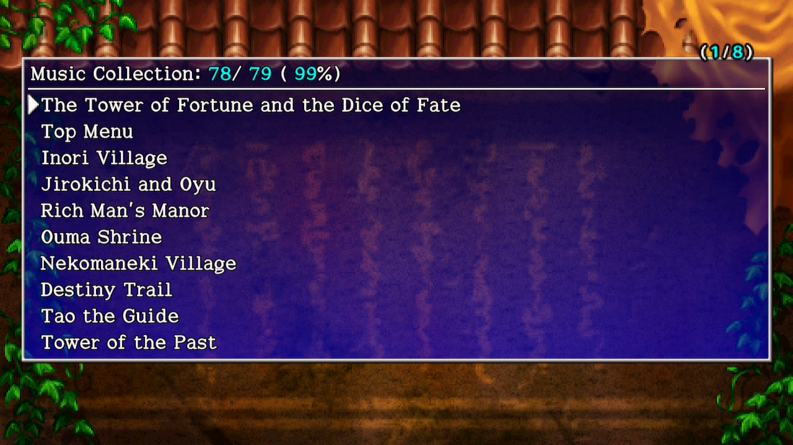

  

Switch / Steam exclusive feature that lets you listen to music tracks. 
※ Music tracks may play in other locations that aren't listed.

|No.|Track|Location|
|-|-|-|
|1  | The Tower of Fortune and the Dice of Fate |  Opening movie|
|2  | Top Menu  |Top menu|
|3  | Inori Village  | Inori Village|
|4  | Jirokichi and Oyu |  Story event|
|5  | Rich Man's Manor | Rich Man's House (Inori Village)|
|6  | Ouma Shrine  | Ouma Shrine|
|7  | Nekomaneki Village | Nekomaneki Village|
|8  | Destiny Trail  | Destiny Trail|
|9  | Tao the Guide  | Tao related events|
|10 | Tower of the Past |  Tower of the Past (1-4F)|
|11 | Tower of the Past - Deep End | Tower of the Past (5-7F)|
|12 | Tower of the Present | Tower of the Present (1-4F)|
|13 | Tower of the Present - Deep End |  Tower of the Present (5-7F)|
|14 | Tower of the Future  | Tower of the Future (1-4F)|
|15 | Tower of the Future - Deep End  |Tower of the Future (5-7F)|
|16 | Dice of Fate | Story event|
|17 | Hermit's Hermitage | Hermit's Hermitage|
|18 | Unexplored Area |  Tower of Fortune (1-3F)|
|19 | Tower of Fortune | Tower of Fortune (4-6F)|
|20 | Tower of Fortune - Deep End  | Tower of Fortune (12-14F)|
|21 | Reeva, God of Fate | Story event|
|22 | Reeva Statue Battle  | Boss (Tower of Fortune)|
|23 | Inescapable Fate | Story event|
|24 | Tower of Miracles   |Tower of Miracles (1-3F)|
|25 | Sparrow's Inn  | Sparrow's Inn|
|26 | Tower of Miracles - Deep End | Tower of Miracles (7-9F)|
|27 | Great Reeva, God of Time and Space | Story event|
|28 | Showdown With the Great Reeva Statue! |  Boss (Tower of Miracles)|
|29 | Turn Back Time / Miracle Reborn|   Story event|
|30 | Wanderer's Ballad  | Story event|
|31 | Blanketed by the Wind |  Story event|
|32 | Ending | Ending|
|33 | End Credits  | End credits|
|34 | Shop | Inside a regular shop|
|35 | Elite Store  | Inside an elite store|
|36 | Thief  | Thief mode triggered|
|37 | Monster House  | Inside a Monster House|
|38 | Special Monster House  | Inside a Special Monster House|
|39 | Enter the Maneater | Maneater monster spawns|
|40 | Pitfall of Life |  Pitfall of Life (Post-game)|
|41 | Lost Well  | Lost Well (Post-game)|
|42 | Heavenly Lake  | Heavenly Lake (Post-game)|
|43 | Onigiri Hollow | Onigiri Hollow (Post-game)|
|44 | Inori Cave | Inori Cave (Post-game)|
|45 | Gen's Turf | Gen's Turf (Post-game)|
|46 | Old Road | Old Road (Post-game)|
|47 | Explosion Rocks |  Explosion Rocks|
|48 | Primordial Chasm | Primordial Chasm (Post-game)|
|49 | Avenge Our Father |  Story event|
|50 | Special Boss Encounter | Boss (Old Road, Jack Wand)|
|51 | Phantasmal Blue Flower (Shiren 4) |  |
|52 | Legend Hidden in the Ruins (Shiren 4) |  |
|53 | Silent Depths (Shiren 4) | Gen's Turf / Onigiri Hollow (Clear)|
|54 | Tea House (Shiren 3) | Decchi event|
|55 | Jurota's Theme (Shiren 3)  | Story event (Old Road)|
|56 | Statue Cave (Shiren 4)  |Rousing Paradise (1F)|
|57 | Jaguar's Treasure Shrine (Shiren 4)  | Bizarre Tower (Post-game)|
|58 | Crocodile Swap (Shiren 4) | Bladeless Wasteland (31-35F) |
|59 | Snake Hole (Shiren 4) |  Sleeping Lands (1F)|
|60 | Sea of Trees (Shiren 4) |  Hunter Pond 6F~ (Random)|
|61 | Eagle Valley (Shiren 4) |  Aura Ruins (1F)|
|62 | Lava Field (Shiren 4)  | Page of Youth (1F)|
|63 | Devil's Navel (Shiren 4) | Tower of Fortune (4-6F night)|
|64 | Gold Palace - Deep End (Shiren 4) |  Tower of Miracles (1-3F night)|
|65 | Banana Kingdom (Shiren 4)  | Cloister of Certain Doom (46-50F)|
|66 | Trap Zone (Shiren 4) | Double Strike Trail (1F)|
|67 | Bayside Monster Cave (Shiren 4) |  Gorger's Manor (1F)|
|68 | Cave of Endless Night (Shiren 4) | Sleeping Lands 7F~|
|69 | Ceremonial Cave (Shiren 1) | |
|70 | Sanuki Forest (Shiren 3) | Bladeless Wasteland (1F)|
|71 | Sanuki Bamboo Grove (Shiren 3)|  Tower of Fortune (1-3F night)|
|72 | Great Centipede's Burrow (Shiren 3)  | Storm Forest (4F)|
|73 | Giant Eagle's Fortress (Shiren 3) |  Cloister of Certain Doom (1F)|
|74 | Forest of Fire (Shiren 3) |  |
|75 | Valley of the Dead (Shiren 3) |  Sleeping Lands (21-25F)|
|76 | Karakuri Tower - Deep End (Shiren 3) | The Pinnacle (1F)|
|77 | Festival Grounds (Shiren 3) |  Tower of Fortune (7-11F night)|
|78 | Karakuri Manor / Kaguya Tomb (Shiren 3) |  Tower of Miracles (4-6F night)|
|79 | Yomotsuhirasaka (Shiren 3) |  Sleeping Lands (41-45F)|
