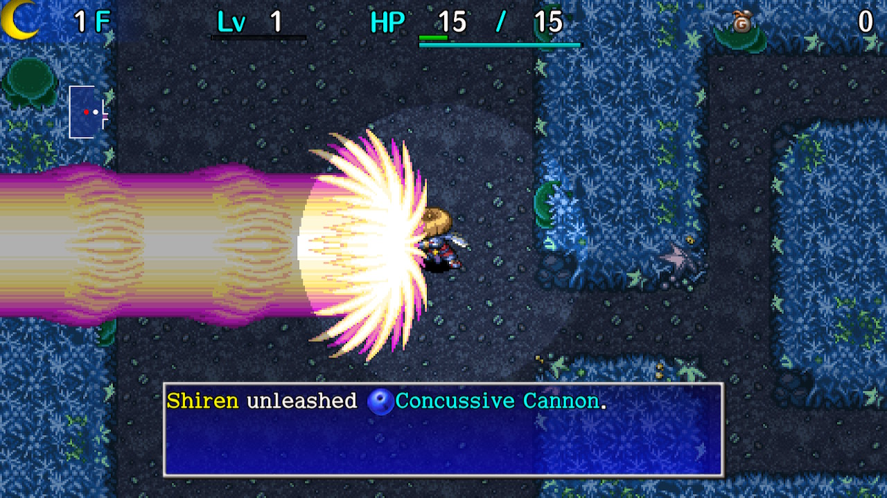

  

## Overview

Necklace abilities, also called techniques, are attacks that can only be used at night. They are the primary means to deal damage to night monsters, and are first used in Tower of Fortune during the main story.

Up to 8 abilities can be assigned to the necklace, including multiples of the same ability. Wandering NPCs can teach you new abilities, and you can swap abilities at Hotel Nekomaneki. Some abilities can only be learned by repeatedly using specific abilities.

With the exception of Staccato Wave, abilities can only be used one time each floor. 
It's possible to replenish abilities by eating a peach, reading a Replenish Scroll, 
being revived by Revival Grass / Undo Grass, or the Ability Regen rune taking effect.

Attack power of abilities increases as Shiren levels up or gains Super status. 
Most abilities deal 2 damage to shopkeepers, but status effects still work on them.

<ul class="quickLinksUL">
  <li><a href="#ability-list">Ability List</a></li>
  <li><a href="#categories">Categories</a></li>
  <li><a href="#formations">Formations</a></li>
  <li><a href="#sets">Sets</a></li>
</ul>

## Ability List

<table class="itemTable">
  <tr>
    <th>Name</th>
    <th>Power</th>
    <th>Learning</th>
    <th>Description</th>
  </tr>
  <tr>
    <td class="highlightYellow">Ally Launcher</td>
    <td>S (120)</td>
    <td>Tradesman</td>
    <td>Send an ally flying forward, damaging all enemies in their path. Piercing properties, and hits targets both ahead and behind you. Ally won't take damage. Highest power ability in the game. An ally must be in front of you to use this ability.</td>
  </tr>
  <tr>
    <td class="highlightYellow">Kaboom Bullet</td>
    <td>S (100)</td>
    <td>Derived from Sticky Shot</td>
    <td>Shoot a damaging bullet in a straight line. Defeats most monsters in a single hit.</td>
  </tr>
  <tr>
    <td class="highlightYellow">Sticky Shot</td>
    <td>A (80)</td>
    <td>Apprentice</td>
    <td>Shoot a damaging bullet in a straight line, then paralyzes. Weaker than Kaboom Bullet, but nice against blue aura monsters.</td>
  </tr>
  <tr>
    <td class="highlightYellow">Mine! Mine! Mine!</td>
    <td>A (65)</td>
    <td>Starting ability</td>
    <td>Shoot a damaging bullet in a straight line. Steals the enemy's aura, which remains active during the day. Red = Attack up, Blue = Defense up, Yellow = Swift.</td>
  </tr>
  <tr>
    <td class="highlightYellow">Electrocute</td>
    <td>A (60)</td>
    <td>Level 16</td>
    <td>Electric damage to a target in front and all adjacent targets. Damage increases by 10% per additional target. Unlike Electric Staff, Shiren and allies won't get hurt. Powerful when used after Crawling Confusion.</td>
  </tr>
  <tr>
    <td class="highlightYellow">Concussive Cannon</td>
    <td>B (50)</td>
    <td>Level 20</td>
    <td>Shoot a damaging + piercing 3 tile wide blast in a straight line. Defeats multiple targets, but lack of power is noticeable mid game.</td>
  </tr>
  <tr>
    <td class="highlightYellow">Bi-Directional Blast</td>
    <td>B (50)</td>
    <td>Master</td>
    <td>Shoot a damaging bullet ahead and behind you. Instantly defeats both enemies if you manage to land both bullets. However, it's hard to do so since night monsters move randomly.</td>
  </tr>
  <tr>
    <td class="highlightYellow">Death-go-Round</td>
    <td>B (40)</td>
    <td>Level 32</td>
    <td>Damages targets in a 1 tile radius. Damage increases by 10% per additional target.</td>
  </tr>
  <tr>
    <td class="highlightYellow">Whack and Warp</td>
    <td>B (40)</td>
    <td>Derived from Death-go-Round</td>
    <td>Damages targets in a 1 tile radius, and then warps you. Plays well with Crawling Confusion, especially for speedruns.</td>
  </tr>
  <tr>
    <td class="highlightYellow">Onigiri Bonanza</td>
    <td>B (30)</td>
    <td>Master</td>
    <td>Damages targets in a 1 tile radius, and then inflicts Onigiri. Obtain Rotten Onigiri (Water Pot) or Grilled Onigiri (Dragon Grass).</td>
  </tr>
  <tr>
    <td class="highlightYellow">Dicey Distractor</td>
    <td>B (30)</td>
    <td>Tradesman</td>
    <td>Damages targets in a 1 tile radius, and then inflicts Afraid. Night monsters can still hit you if they aim for a monster.</td>
  </tr>
  <tr>
    <td class="highlightYellow">Room Cyclone</td>
    <td>B (30)</td>
    <td>Tradesman</td>
    <td>Damages all targets in the room. It was nerfed from Shiren 4 (40 power), so it's not as useful.</td>
  </tr>
  <tr>
    <td class="highlightYellow">Injury to Insult</td>
    <td>B (30)</td>
    <td>Derived from HP Divider</td>
    <td>Damages all targets in the room. Deals x1.5 damage to enemies with an ailment.</td>
  </tr>
  <tr>
    <td class="highlightYellow">Darkroom</td>
    <td>C (20)</td>
    <td>Derived from Room Cyclone</td>
    <td>Damages all targets in the room, and then inflicts Blind. No reason to use this instead of Pot Party.</td>
  </tr>
  <tr>
    <td class="highlightYellow">Pot Party</td>
    <td>C (20)</td>
    <td>Master</td>
    <td>Damages all targets in the room, and then inflicts Hiding. Insanely powerful, since monsters can't break free on their own. However, be careful of Absorbiphants and Flamebirds.</td>
  </tr>
  <tr>
    <td class="highlightYellow">Room Sealant</td>
    <td>C (20)</td>
    <td>Apprentice</td>
    <td>Damages all targets in the room, and then inflicts Sealed.</td>
  </tr>
  <tr>
    <td class="highlightYellow">Staccato Wave</td>
    <td>C (20)</td>
    <td>Sage in Hermit's Hermitage</td>
    <td>Damages a target in front. Can be used repeatedly. It only deals ~20 damage, but nice for early game / Super.</td>
  </tr>
  <tr>
    <td class="highlightYellow">Self-Help</td>
    <td>-</td>
    <td>Level 24</td>
    <td>Grants Fast Regen. (+1 HP recovered per turn) Mostly used to support daytime fights.</td>
  </tr>
  <tr>
    <td class="highlightYellow">Chakra Cleanse</td>
    <td>-</td>
    <td>Level 29</td>
    <td>Auto-activates when you become afflicted with an ailment at night. Any ailment you become afflicted with will be instantly cured, so it's excellent to have in case you step on a trap at night.</td>
  </tr>
  <tr>
    <td class="highlightYellow">Beacon of Light</td>
    <td>-</td>
    <td>Level 55</td>
    <td>Grants Night Vision, letting you to read scrolls in the dark.</td>
  </tr>
  <tr>
    <td class="highlightYellow">Three Screams</td>
    <td>-</td>
    <td>Level 99</td>
    <td>Instantly defeats targets in front of you in 3 forward directions, but you don't gain experience points. (Hits targets around corners) Unlike Shiren 4, this ability can't defeat shopkeepers.</td>
  </tr>
  <tr>
    <td class="highlightYellow">Transmogrification</td>
    <td>-</td>
    <td>Inori Cave (wish)</td>
    <td>One-shot a target in front of you by turning them into an item. You don't gain experience points, and shopkeepers are immune. Item is selected from the floor table, with some exceptions: ・Monsters with fixed item drops always drop that item. ・Mixers, Zaloklefts, and Froggos drop what they ate or stole. The generated item is never blessed, cursed, or sealed. (Including normally cursed Nonary Bracelet and Itemphobic)</td>
  </tr>
  <tr>
    <td class="highlightYellow">Last Stand</td>
    <td>-</td>
    <td>Apprentice</td>
    <td>80% chance to one-shot all monsters, but you collapse if it fails. Always fails if there are no monsters on the current floor. You don't gain any experience points. Monsters can drop items when they're defeated by this ability. It looks like an explosion, but items and walls won't be destroyed. Decent for dungeons that let you bring in lots of Revival Grass.</td>
  </tr>
  <tr>
    <td class="highlightYellow">Pyrrhic Piercer</td>
    <td>-</td>
    <td>Apprentice</td>
    <td>Shoot a piercing bullet in a straight line that reduces HP to 1. Shiren's HP is also halved, and the bullet can't go through walls.</td>
  </tr>
  <tr>
    <td class="highlightYellow">HP Divider</td>
    <td>-</td>
    <td>Apprentice</td>
    <td>Halves the HP of all targets in the room. The target will be defeats if they were at 1 HP.</td>
  </tr>
  <tr>
    <td class="highlightYellow">Room Healing Flash</td>
    <td>-</td>
    <td>Tradesman</td>
    <td>Fully restores HP of you and any allies in the room. Nice to have when rushing stairs / speed running.</td>
  </tr>
  <tr>
    <td class="highlightYellow">Crawling Confusion</td>
    <td>-</td>
    <td>Tradesman</td>
    <td>Warps monsters on the floor to you, and then inflicts Confused. Monsters that didn't warp due to lack of space are also confused. Handy, but also risky since confused enemies can still hit you.</td>
  </tr>
  <tr>
    <td class="highlightYellow">Reflecto</td>
    <td>-</td>
    <td>Master</td>
    <td>Reflects all direct attacks for 1 turn. Damage dealt is equal to what you would've received.</td>
  </tr>
  <tr>
    <td class="highlightYellow">Stairlight</td>
    <td>-</td>
    <td>Master</td>
    <td>Reveals the location of the stairs on the map. Always include this, unless you're intentionally omitting it.</td>
  </tr>
  <tr>
    <td class="highlightYellow">Jack in the Box</td>
    <td>-</td>
    <td>Clear Night Training Facility</td>
    <td>Randomly performs an ability from all of the above. Support abilities and Last Stand can be chosen, so it's kind of bad.</td>
  </tr>
</table>

## Categories

<table class="itemTable">
  <tr>
    <th>Range</th>
    <th>Type</th>
    <th colspan="2">Ability</th>
  </tr>
  <tr>
    <th rowspan="2">Floor</th>
    <td class="highlightYellow">Normal</td>
    <td colspan="2">Crawling Confusion</td>
  </tr>
  <tr>
    <td class="highlightGreen">Special</td>
    <td colspan="2">Last Stand</td>
  </tr>
  <tr>
    <th rowspan="4">Room</th>
    <td rowspan="3" class="highlightYellow">Normal</td>
    <td>Room Cyclone</td>
    <td>Injury to Insult</td>
  </tr>
  <tr>
    <td>Room Sealant</td>
    <td>Darkroom</td>
  </tr>
  <tr>
    <td>Pot Party</td>
    <td>HP Divider</td>
  </tr>
  <tr>
    <td class="highlightGreen">Special</td>
    <td colspan="2">Room Healing Flash</td>
  </tr>
  <tr>
    <th rowspan="4">Line</th>
    <td rowspan="2" class="highlightYellow">Normal</td>
    <td>Kaboom Bullet</td>
    <td>Sticky Shot</td>
  </tr>
  <tr>
    <td colspan="2">Mine! Mine! Mine!</td>
  </tr>
  <tr>
    <td rowspan="2" class="highlightGreen">Special</td>
    <td>Pyrrhic Piercer</td>
    <td>Concussive Cannon</td>
  </tr>
  <tr>
    <td colspan="2">Ally Launcher</td>
  </tr>
  <tr>
    <th rowspan="3">1-Radius</th>
    <td rowspan="2" class="highlightYellow">Normal</td>
    <td>Death-go-Round</td>
    <td>Whack and Warp</td>
  </tr>
  <tr>
    <td>Dicey Distractor</td>
    <td>Onigiri Bonanza</td>
  </tr>
  <tr>
    <td class="highlightGreen">Special</td>
    <td colspan="2">(None)</td>
  </tr>
  <tr>
    <th rowspan="2">Front</th>
    <td class="highlightYellow">Normal</td>
    <td>Staccato Wave</td>
    <td>Transmogrification</td>
  </tr>
  <tr>
    <td class="highlightGreen">Special</td>
    <td colspan="2">Electrocute</td>
  </tr>
  <tr>
    <th>Other</th>
    <td class="highlightGreen">Special</td>
    <td>Three Screams</td>
    <td>Bi-Directional Blast</td>
  </tr>
  <tr>
    <th rowspan="4">Self</th>
    <td rowspan="3" class="highlightYellow">Normal</td>
    <td>Self-Help</td>
    <td>Chakra Cleanse</td>
  </tr>
  <tr>
    <td>Beacon of Light</td>
    <td>Stairlight</td>
  </tr>
  <tr>
    <td colspan="2">Reflecto</td>
  </tr>
  <tr>
    <td class="highlightGreen">Special</td>
    <td colspan="2">(None)</td>
  </tr>
  <tr>
    <th>Varies</th>
    <td class="highlightGreen">Special</td>
    <td colspan="2">Jack in the Box</td>
  </tr>
</table>

## Formations

Formations are special effects that occur based on character positions when an ability is used. When multiple formation conditions are met, the higher priority formation is chosen. Some formations only activate with abilities of a specific category.

<table class="itemTable">
  <tr>
    <th>Priority</th>
    <th>Condition</th>
    <th>Effect</th>
    <th>Category</th>
  </tr>
  <tr>
    <td>1</td>
    <td class="highlightYellow">Surrounded</td>
    <td>Warp</td>
    <td>Room</td>
  </tr>
  <tr>
    <td>2</td>
    <td class="highlightYellow">5 Line</td>
    <td>Restore 200 HP</td>
    <td>Room</td>
  </tr>
  <tr>
    <td>3</td>
    <td class="highlightYellow">4 Line</td>
    <td>Restore 100 HP</td>
    <td>Room</td>
  </tr>
  <tr>
    <td>4</td>
    <td class="highlightYellow">3 Line</td>
    <td>Restore 50 HP</td>
    <td>Room</td>
  </tr>
  <tr>
    <td>5</td>
    <td class="highlightYellow">2 Line</td>
    <td>Cure ailments</td>
    <td>Room</td>
  </tr>
  <tr>
    <td>6</td>
    <td class="highlightYellow">Cross</td>
    <td>Replenish 3 abilities</td>
    <td>Room, Floor</td>
  </tr>
  <tr>
    <td>7</td>
    <td class="highlightYellow">Sandwich</td>
    <td>Restore 20 HP</td>
    <td>Room</td>
  </tr>
  <tr>
    <td>8</td>
    <td class="highlightYellow">Cornered</td>
    <td>Deal more damage</td>
    <td>Room, Single-target</td>
  </tr>
</table>

#### Surrounded

<table class="formationTable">
  <tr>
    <td>　</td>
    <td>　</td>
    <td>　</td>
    <td>　</td>
    <td>　</td>
    <td>　</td>
    <td>　</td>
  </tr>
  <tr>
    <td>　</td>
    <td>　</td>
    <td class="highlightPink">M</td>
    <td class="highlightPink">M</td>
    <td class="highlightPink">M</td>
    <td>　</td>
    <td>　</td>
  </tr>
  <tr>
    <td>　</td>
    <td>　</td>
    <td class="highlightPink">M</td>
    <td class="highlightBlue">S</td>
    <td class="highlightPink">M</td>
    <td>　</td>
    <td>　</td>
  </tr>
  <tr>
    <td>　</td>
    <td>　</td>
    <td class="highlightPink">M</td>
    <td class="highlightPink">M</td>
    <td class="highlightPink">M</td>
    <td>　</td>
    <td>　</td>
  </tr>
  <tr>
    <td>　</td>
    <td>　</td>
    <td>　</td>
    <td>　</td>
    <td>　</td>
    <td>　</td>
    <td>　</td>
  </tr>
</table>

 

- Warps you to a different location on the current floor. (Nullified by Unmoving rune)
- Highest priority, and activates no matter what direction you're facing.
- Activates with Room category abilities. (Doesn't activate with single-target abilities)

#### 5 Line

<table class="formationTable">
  <tr>
    <td>　</td>
    <td>　</td>
    <td>　</td>
    <td>　</td>
    <td>　</td>
    <td>　</td>
    <td>　</td>
  </tr>
  <tr>
    <td>　</td>
    <td>　</td>
    <td>　</td>
    <td>　</td>
    <td>　</td>
    <td>　</td>
    <td>　</td>
  </tr>
  <tr>
    <td>　</td>
    <td class="highlightBlue">→</td>
    <td class="highlightPink">M</td>
    <td class="highlightPink">M</td>
    <td class="highlightPink">M</td>
    <td class="highlightPink">M</td>
    <td class="highlightPink">M</td>
  </tr>
  <tr>
    <td>　</td>
    <td>　</td>
    <td>　</td>
    <td>　</td>
    <td>　</td>
    <td>　</td>
    <td>　</td>
  </tr>
  <tr>
    <td>　</td>
    <td>　</td>
    <td>　</td>
    <td>　</td>
    <td>　</td>
    <td>　</td>
    <td>　</td>
  </tr>
</table>

 

- Restores 200 HP.
- Priority 2, and Shiren must be facing the line of enemies.
- Activates with Room category abilities. (Other categories are untested)

#### 4 Line

<table class="formationTable">
  <tr>
    <td>　</td>
    <td>　</td>
    <td>　</td>
    <td>　</td>
    <td>　</td>
    <td>　</td>
    <td>　</td>
  </tr>
  <tr>
    <td>　</td>
    <td>　</td>
    <td>　</td>
    <td>　</td>
    <td>　</td>
    <td>　</td>
    <td>　</td>
  </tr>
  <tr>
    <td>　</td>
    <td class="highlightPink">M</td>
    <td class="highlightPink">M</td>
    <td class="highlightPink">M</td>
    <td class="highlightPink">M</td>
    <td class="highlightBlue">←</td>
    <td>　</td>
  </tr>
  <tr>
    <td>　</td>
    <td>　</td>
    <td>　</td>
    <td>　</td>
    <td>　</td>
    <td>　</td>
    <td>　</td>
  </tr>
  <tr>
    <td>　</td>
    <td>　</td>
    <td>　</td>
    <td>　</td>
    <td>　</td>
    <td>　</td>
    <td>　</td>
  </tr>
</table>

 

- Restores 100 HP.
- Priority 3, and Shiren must be facing the line of enemies.
- Activates with Room category abilities. (Other categories are untested)

#### 3 Line

<table class="formationTable">
  <tr>
    <td>　</td>
    <td>　</td>
    <td>　</td>
    <td>　</td>
    <td>　</td>
    <td>　</td>
    <td>　</td>
    <td rowspan="5" class="highlightGray"></td>
    <td>　</td>
    <td>　</td>
    <td>　</td>
    <td class="highlightPink">M</td>
    <td>　</td>
    <td>　</td>
    <td>　</td>
  </tr>
  <tr>
    <td>　</td>
    <td>　</td>
    <td>　</td>
    <td>　</td>
    <td>　</td>
    <td>　</td>
    <td>　</td>
    <td>　</td>
    <td>　</td>
    <td>　</td>
    <td class="highlightPink">M</td>
    <td>　</td>
    <td>　</td>
    <td>　</td>
  </tr>
  <tr>
    <td>　</td>
    <td class="highlightPink">M</td>
    <td class="highlightPink">M</td>
    <td class="highlightPink">M</td>
    <td class="highlightBlue">←</td>
    <td>　</td>
    <td>　</td>
    <td>　</td>
    <td>　</td>
    <td>　</td>
    <td class="highlightPink">M</td>
    <td>　</td>
    <td>　</td>
    <td>　</td>
  </tr>
  <tr>
    <td>　</td>
    <td>　</td>
    <td>　</td>
    <td>　</td>
    <td>　</td>
    <td>　</td>
    <td>　</td>
    <td>　</td>
    <td>　</td>
    <td>　</td>
    <td>　</td>
    <td>　</td>
    <td>　</td>
    <td>　</td>
  </tr>
  <tr>
    <td>　</td>
    <td>　</td>
    <td>　</td>
    <td>　</td>
    <td>　</td>
    <td>　</td>
    <td>　</td>
    <td>　</td>
    <td>　</td>
    <td>　</td>
    <td class="highlightBlue">↑</td>
    <td>　</td>
    <td>　</td>
    <td>　</td>
  </tr>
</table>

 

- Restores 50 HP.
- Priority 4, and Shiren must be facing the line of enemies.
- Activates with Room category abilities. (Other categories are untested)

#### 2 Line

<table class="formationTable">
  <tr>
    <td>　</td>
    <td>　</td>
    <td>　</td>
    <td>　</td>
    <td>　</td>
    <td>　</td>
    <td>　</td>
    <td rowspan="5" class="highlightGray"></td>
    <td>　</td>
    <td>　</td>
    <td>　</td>
    <td>　</td>
    <td>　</td>
    <td>　</td>
    <td>　</td>
  </tr>
  <tr>
    <td>　</td>
    <td>　</td>
    <td>　</td>
    <td>　</td>
    <td>　</td>
    <td>　</td>
    <td>　</td>
    <td>　</td>
    <td>　</td>
    <td>　</td>
    <td>　</td>
    <td>　</td>
    <td>　</td>
    <td class="highlightPink">M</td>
  </tr>
  <tr>
    <td>　</td>
    <td>　</td>
    <td>　</td>
    <td>　</td>
    <td class="highlightBlue">→</td>
    <td class="highlightPink">M</td>
    <td class="highlightPink">M</td>
    <td>　</td>
    <td>　</td>
    <td>　</td>
    <td>　</td>
    <td>　</td>
    <td class="highlightPink">M</td>
    <td>　</td>
  </tr>
  <tr>
    <td>　</td>
    <td>　</td>
    <td>　</td>
    <td>　</td>
    <td>　</td>
    <td>　</td>
    <td>　</td>
    <td>　</td>
    <td>　</td>
    <td>　</td>
    <td>　</td>
    <td>　</td>
    <td>　</td>
    <td>　</td>
  </tr>
  <tr>
    <td>　</td>
    <td>　</td>
    <td>　</td>
    <td>　</td>
    <td>　</td>
    <td>　</td>
    <td>　</td>
    <td>　</td>
    <td>　</td>
    <td>　</td>
    <td class="highlightBlue">↗︎</td>
    <td>　</td>
    <td>　</td>
    <td>　</td>
  </tr>
</table>

 

- Cures negative status conditions.
- Priority 5, and Shiren must be facing the line of enemies.
- Often accidentally triggered in place of Cross formation. (Ability Replenish)
- Activates with Room category abilities. (Other categories are untested)
- Room Healing Flash appears to use ally positions for formations, so you can restore HP and ailments at the same time if you have allies.

#### Cross

<table class="formationTable">
  <tr>
    <td>　</td>
    <td>　</td>
    <td>　</td>
    <td>　</td>
    <td>　</td>
    <td>　</td>
    <td>　</td>
    <td rowspan="5" class="highlightGray"></td>
    <td>　</td>
    <td>　</td>
    <td>　</td>
    <td>　</td>
    <td>　</td>
    <td>　</td>
    <td>　</td>
  </tr>
  <tr>
    <td>　</td>
    <td>　</td>
    <td>　</td>
    <td>　</td>
    <td class="highlightPink">M</td>
    <td>　</td>
    <td>　</td>
    <td>　</td>
    <td>　</td>
    <td class="highlightPink">M</td>
    <td>　</td>
    <td class="highlightPink">M</td>
    <td>　</td>
    <td>　</td>
  </tr>
  <tr>
    <td>　</td>
    <td>　</td>
    <td>　</td>
    <td class="highlightPink">M</td>
    <td class="highlightBlue">↗︎</td>
    <td class="highlightPink">M</td>
    <td>　</td>
    <td>　</td>
    <td>　</td>
    <td>　</td>
    <td class="highlightBlue">→</td>
    <td>　</td>
    <td>　</td>
    <td>　</td>
  </tr>
  <tr>
    <td>　</td>
    <td>　</td>
    <td>　</td>
    <td>　</td>
    <td class="highlightPink">M</td>
    <td>　</td>
    <td>　</td>
    <td>　</td>
    <td>　</td>
    <td class="highlightPink">M</td>
    <td>　</td>
    <td class="highlightPink">M</td>
    <td>　</td>
    <td>　</td>
  </tr>
  <tr>
    <td>　</td>
    <td>　</td>
    <td>　</td>
    <td>　</td>
    <td>　</td>
    <td>　</td>
    <td>　</td>
    <td>　</td>
    <td>　</td>
    <td>　</td>
    <td>　</td>
    <td>　</td>
    <td>　</td>
    <td>　</td>
  </tr>
</table>

 

- Replenishes 3 abilities.
- Pretty much exclusive to Crawling Confusion, but has the highest return.
- Priority 6 - check the direction Shiren is facing to avoid triggering a higher priority formation.
- Activates with Room category abilities. (Doesn't activate with single-target abilities) It apparently also activates with Last Stand.

#### Sandwich

<table class="formationTable">
  <tr>
    <td>　</td>
    <td>　</td>
    <td>　</td>
    <td>　</td>
    <td>　</td>
    <td>　</td>
    <td>　</td>
    <td rowspan="5" class="highlightGray"></td>
    <td>　</td>
    <td>　</td>
    <td>　</td>
    <td>　</td>
    <td>　</td>
    <td>　</td>
    <td>　</td>
    <td rowspan="5" class="highlightGray"></td>
    <td>　</td>
    <td>　</td>
    <td>　</td>
    <td>　</td>
    <td>　</td>
    <td>　</td>
    <td>　</td>
  </tr>
  <tr>
    <td>　</td>
    <td>　</td>
    <td>　</td>
    <td>　</td>
    <td class="highlightPink">M</td>
    <td>　</td>
    <td>　</td>
    <td>　</td>
    <td>　</td>
    <td class="highlightPink">M</td>
    <td>　</td>
    <td>　</td>
    <td>　</td>
    <td>　</td>
    <td>　</td>
    <td>　</td>
    <td>　</td>
    <td>　</td>
    <td>　</td>
    <td>　</td>
    <td>　</td>
  </tr>
  <tr>
    <td>　</td>
    <td>　</td>
    <td>　</td>
    <td>　</td>
    <td class="highlightBlue">↗︎</td>
    <td>　</td>
    <td>　</td>
    <td>　</td>
    <td>　</td>
    <td>　</td>
    <td class="highlightBlue">→</td>
    <td>　</td>
    <td>　</td>
    <td>　</td>
    <td class="highlightPink">M</td>
    <td>　</td>
    <td>　</td>
    <td class="highlightBlue">↑</td>
    <td>　</td>
    <td>　</td>
    <td class="highlightPink">M</td>
  </tr>
  <tr>
    <td>　</td>
    <td>　</td>
    <td>　</td>
    <td>　</td>
    <td class="highlightPink">M</td>
    <td>　</td>
    <td>　</td>
    <td>　</td>
    <td>　</td>
    <td>　</td>
    <td>　</td>
    <td class="highlightPink">M</td>
    <td>　</td>
    <td>　</td>
    <td>　</td>
    <td>　</td>
    <td>　</td>
    <td>　</td>
    <td>　</td>
    <td>　</td>
    <td>　</td>
  </tr>
  <tr>
    <td>　</td>
    <td>　</td>
    <td>　</td>
    <td>　</td>
    <td>　</td>
    <td>　</td>
    <td>　</td>
    <td>　</td>
    <td>　</td>
    <td>　</td>
    <td>　</td>
    <td>　</td>
    <td>　</td>
    <td>　</td>
    <td>　</td>
    <td>　</td>
    <td>　</td>
    <td>　</td>
    <td>　</td>
    <td>　</td>
    <td>　</td>
  </tr>
</table>

 

- Restores 20 HP.
- Priority 7 - check the direction Shiren is facing to avoid triggering a higher priority formation.
- Activates with Room category abilities. (Other categories are untested)
- It appears to activate even when enemies aren't adjacent, provided they're spaced the same.

#### Cornered

<table class="formationTable">
  <tr>
    <td>　</td>
    <td>　</td>
    <td>　</td>
    <td>　</td>
    <td>　</td>
    <td>　</td>
    <td>　</td>
  </tr>
  <tr>
    <td>　</td>
    <td>　</td>
    <td>　</td>
    <td>　</td>
    <td>　</td>
    <td>　</td>
    <td>　</td>
  </tr>
  <tr>
    <td>　</td>
    <td>　</td>
    <td>　</td>
    <td class="highlightPink">M</td>
    <td>　</td>
    <td>　</td>
    <td>　</td>
  </tr>
  <tr>
    <td>　</td>
    <td>　</td>
    <td>　</td>
    <td class="highlightBlue">↑</td>
    <td>　</td>
    <td>　</td>
    <td>　</td>
  </tr>
  <tr>
    <td class="highlightBlack">W</td>
    <td class="highlightBlack">W</td>
    <td class="highlightBlack">W</td>
    <td class="highlightBlack">W</td>
    <td class="highlightBlack">W</td>
    <td class="highlightBlack">W</td>
    <td class="highlightBlack">W</td>
  </tr>
</table>

 

- Boosts power of ability.
- Priority 8, and there must be an impassable tile behind Shiren.
- Activates with Room category and single-target abilities.

## Sets

This section provides recommendations for ability sets. 
Stairlight and Pot Party are extremely popular, and are included in most sets.

The idea is to choose abilities based on the purposes you want to have on hand, and then fill the remaining slots with attack type abilities.

<table>
  <tr>
    <th>Purpose</th>
    <th>Ability</th>
    <th>Item Equivalent</th>
  </tr>
  <tr>
    <td>Rushing stairs</td>
    <td class="highlightYellow">Stairlight</td>
    <td>Navigation Scroll Monster Detector + Transient Staff</td>
  </tr>
  <tr>
    <td>Support</td>
    <td class="highlightYellow">Chakra Cleanse Self-Help Room Healing Flash</td>
    <td>Identify Scroll Immunity Scroll Heal Grass Heal Pot</td>
  </tr>
  <tr>
    <td>Disable room</td>
    <td class="highlightYellow">Pot Party Darkroom Room Sealant</td>
    <td>Confusion Scroll Immunity Scroll</td>
  </tr>
  <tr>
    <td>When you're surrounded</td>
    <td class="highlightYellow">Pot Party Dicey Distractor Onigiri Bonanza Three Screams Reflecto Whack and Warp</td>
    <td>Invincible Grass Slumber Scroll Warp Grass</td>
  </tr>
  <tr>
    <td>Attacking (Floor)</td>
    <td class="highlightYellow">Concussive Cannon Crawling Confusion + Electrocute Crawling Confusion + "Disable room" ability Last Stand (requires Revival Grass)</td>
    <td>Night-Day Scroll</td>
  </tr>
  <tr>
    <td>Attacking (Ranged)</td>
    <td class="highlightYellow">Kaboom Bullet Sticky Shot Mine! Mine! Mine!</td>
    <td>-</td>
  </tr>
  <tr>
    <td>Attacking (Close range, One-shot)</td>
    <td class="highlightYellow">Transmogrification Thee Screams Sticky Shot</td>
    <td>Paralysis Staff</td>
  </tr>
  <tr>
    <td>Attacking (Close range, Multi-use)</td>
    <td class="highlightYellow">Staccato Wave Onigiri Bonanza (with Ability Regen rune)</td>
    <td>Explosion Bracelet</td>
  </tr>
</table>

#### Crawling Electrocute

- Crawling Confusion
- Electrocute
- Stairlight
- Pot Party x 1~2
- Remaining: Transmogrification, Sticky Shot, Room Healing Flash, Kaboom Bullet, Staccato Wave

#### Crawling Pot Party

- Crawling Confusion
- Pot Party x 2
- Stairlight
- (Chakra Cleanse or Self-Help) x 0~1
- Remaining: Transmogrification, Sticky Shot, Kaboom Bullet, Staccato Wave

#### Transmogrification

- (Kaboom Bullet or Sticky Shot) x 1~2
- Stairlight
- Pot Party x 1~2
- Remaining: Transmogrification

#### Balanced

- (Kaboom Bullet or Sticky Shot or Mine! Mine! Mine!) x 3~4
- (Electrocute or Three Screams) x 1~2
- (Chakra Cleanse or Self-Help)
- Pot Party x 1~2
- Stairlight

#### Still Learning

- (Kaboom Bullet or Sticky Shot or Mine! Mine! Mine!) x 3~4
- Concussive Cannon x 1~2
- Electrocute
- Darkroom
- (Chakra Cleanse or Self-Help)
