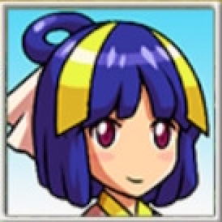
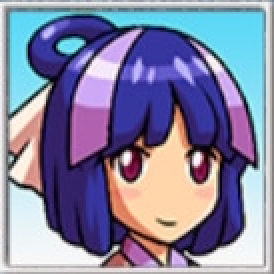

## Overview

Characters that can be found wandering around inside dungeons. 
They're represented as a yellow dot on the map, and turn hostile when attacked. 
Up to 3 NPCs can appear on any given floor, and are included in the 20 character limit.

Characteristics:

- Slow movement (excluding Sage and Sparrow), and 100 HP.
- Can swap places with Shiren and ally characters.
- Day monsters won't attack them, but night monsters will.
- They always dodge thrown weapons and shields.

Ally characters can also appear as wandering NPCs, and can be recruited by talking. They never turn hostile, no matter what you actions you take against them.

<ul class="quickLinksUL">
  <li><a href="#npc-list">NPC List</a></li>
  <li><a href="#chiroro-items">Chiroro Items</a></li>
  <li><a href="#ateska-fortunes">Ateska Fortunes</a></li>
</ul>

## NPC List

<table class="npcTable">
  <tr>
    <th>NPC</th>
    <th>Story Dungeons</th>
    <th>Post-Game Dungeons</th>
    <th>Notes</th>
  </tr>
  <tr>
    <td class="highlightYellow"> Peddler</td>
    <td>Destiny Trail: 1-5 Tower of the Past: 4-7 Tower of the Present: 4-7 Tower of the Future: 4-7</td>
    <td>Pitfall of Life: 4-13 Lost Well: 4-14 Heavenly Lake: 4-14 Inori Cave: 73-83 Onigiri Hollow: 5-14</td>
    <td>Lets you purchase and sell items. The 8 items for sale are randomly chosen from the dungeon's shop / night monster drop table. (S column on dungeon pages) ※ You can't buy back items you sell.</td>
  </tr>
  <tr>
    <td class="highlightYellow"> Calligrapher</td>
    <td>Tower of the Past: 1-7 Tower of the Present: 1-7 Tower of the Future: 1-7 Tower of Fortune: 1-3</td>
    <td>Lost Well: 1-14 Inori Cave: 70-83</td>
    <td>Answer "Yes" and give her a Blank Scroll to receive a scroll that you haven't read before, excluding Blank, Wet, and Paper. 12% chance to fail and receive Piece of Paper. Receive Expulsion Scroll if you've read all other scrolls.</td>
  </tr>
  <tr>
    <td class="highlightYellow"> Appraiser</td>
    <td>Destiny Trail: 1-5 Tower of the Past: 1-3 Tower of the Present: 1-4 Tower of the Future: 1-4 Tower of Fortune: 1-3</td>
    <td>Lost Well: 1-14 Heavenly Lake: 1-14 Inori Cave: 70-83 Onigiri Hollow: 1-14</td>
    <td>Identifies a random category of items for you. ※ Items inside pots won't be identified. Afterward, you can pay 500G to identify 1 item.</td>
  </tr>
  <tr>
    <td class="highlightYellow"> Blacksmith 1</td>
    <td>Destiny Trail: 1-5 Tower of the Past: 4-7 Tower of the Present: 4-7 Tower of the Future: 4-7</td>
    <td>Pitfall of Life: 4-13 Lost Well: 4-14 Heavenly Lake: 4-14 Inori Cave: 73-83 Onigiri Hollow: 5-14</td>
    <td>Pay 1000G to increase a selected item's upgrade value. If you're lucky, it'll increase by +3 instead of +1. (1/12 chance)</td>
  </tr>
  <tr>
    <td class="highlightYellow"> Blacksmith 2</td>
    <td>Destiny Trail: 1-5 Tower of the Past: 4-7 Tower of the Present: 4-7 Tower of the Future: 4-7</td>
    <td>Lost Well: 4-14 Inori Cave: 73-83</td>
    <td>Pay 1000G and deposit equipment to raise its upgrade value. Returns it to you the next time you meet her, and the upgrade value will have increased by either +7 or +13 if you're lucky. Lucky chance is 12% at first, and increases by 2% each time you use her service, up to a max of 30%. ※ This service can't be used with Koharu.</td>
  </tr>
  <tr>
    <td class="highlightYellow"> Upgrader</td>
    <td>Destiny Trail: 1-5 Tower of the Past: 1-7 Tower of the Present: 1-7 Tower of the Future: 1-7</td>
    <td>Lost Well: 1-14 Inori Cave: 70-83</td>
    <td>Deposit equipment, and she'll return it to you the next time you meet her with the item having gained 50,000 skill exp. ※ Equipment can only level up 1 level at a time. ※ This service can't be used with Koharu.</td>
  </tr>
  <tr>
    <td class="highlightYellow"> Tag Master</td>
    <td>Destiny Trail: 1-5 Tower of the Past: 1-7 Tower of the Present: 1-7 Tower of the Future: 1-7 Tower of Fortune: 1-3</td>
    <td>Lost Well: 1-14 Inori Cave: 70-83</td>
    <td>Pay 2000G to tag a piece of equipment.</td>
  </tr>
  <tr>
    <td class="highlightYellow"> Lost Soul</td>
    <td>Destiny Trail: 1-5 Tower of the Past: 1-7 Tower of the Present: 1-7 Tower of the Future: 1-7 Tower of Fortune: 1-3</td>
    <td>Pitfall of Life: 1-13 Lost Well: 1-14 Heavenly Lake: 1-14 Inori Cave: 70-83 Onigiri Hollow: 1-14</td>
    <td>Answer "No" to receive a random item. (Chosen from the dungeon's floor / day monster drop table)</td>
  </tr>
  <tr>
    <td class="highlightYellow"> Connoisseur</td>
    <td>Destiny Trail: 1-5 Tower of the Past: 1-7 Tower of the Present: 1-7 Tower of the Future: 1-7 Tower of Fortune: 1-3</td>
    <td>Pitfall of Life: 1-13 Lost Well: 1-14 Heavenly Lake: 1-14 Inori Cave: 70-83 Onigiri Hollow: 1-14</td>
    <td>Gives you a random item. (Chosen from the dungeon's floor / day monster drop table)</td>
  </tr>
  <tr>
    <td class="highlightYellow"> Researcher</td>
    <td>Destiny Trail: 1-5 Tower of the Past: 1-7 Tower of the Present: 1-7 Tower of the Future: 1-7 Tower of Fortune: 1-3</td>
    <td>Pitfall of Life: 1-13 Lost Well: 1-14 Heavenly Lake: 1-14 Inori Cave: 70-83 Onigiri Hollow: 1-14</td>
    <td>Gives you a random item. (Chosen from the dungeon's floor / day monster drop table)</td>
  </tr>
  <tr>
    <td class="highlightYellow"> Gambler</td>
    <td>Destiny Trail: 1-5 Tower of the Past: 1-7 Tower of the Present: 1-7 Tower of the Future: 1-7 Tower of Fortune: 1-3</td>
    <td>-</td>
    <td>He asks for Gitan, and eventually rewards you with items. 500G (Catstone) → 1500G → 3000G → 0G (Undo Grass) → 0G (Breeze Blade) → 5000G → 0G → 0G (Waterwalk Bracelet)</td>
  </tr>
  <tr>
    <td class="highlightYellow"> Mekky</td>
    <td>Destiny Trail: 1-5 Tower of the Past: 4-7 Tower of the Present: 4-7 Tower of the Future: 4-7</td>
    <td>Pitfall of Life: 4-13 Lost Well: 4-14 Heavenly Lake: 4-14 Inori Cave: 73-83 Onigiri Hollow: 5-14</td>
    <td>Pay 2000G to add the Rustproof rune to a piece of equipment. Can also plate Shiren or an ally instead. (Plated status) ※ Okon and Koharu have special colors when plated.</td>
  </tr>
  <tr>
    <td class="highlightYellow"> Child</td>
    <td>Tower of the Past: 1-4 Tower of the Present: 1-4 Tower of the Future: 1-4</td>
    <td>Pitfall of Life: 1-13 Lost Well: 1-14 Heavenly Lake: 1-14 Inori Cave: 70-83 Onigiri Hollow: 1-14</td>
    <td>Say "Yes", and Child's Sister may appear in a Monster House.</td>
  </tr>
  <tr>
    <td class="highlightYellow"> Child's Sister</td>
    <td>-</td>
    <td>-</td>
    <td>Appears in a Monster House after saying "Yes" to the Child. Talk to her to rescue her. She'll then rescue you the next time you collapse, reviving and warping you out of the room. ※ She'll then be defeated by a monster, leveling them up.</td>
  </tr>
  <tr>
    <td class="highlightYellow"> Chiroro</td>
    <td>Destiny Trail: 1-5 Tower of the Past: 4-7 Tower of the Present: 4-7 Tower of the Future: 4-7</td>
    <td>Lost Well: 4-14 Inori Cave: 73-83</td>
    <td>Pay 1000, 2000, or 3000G and he'll give you an item the next time you meet him. (Chosen from the floor table)</td>
  </tr>
  <tr>
    <td class="highlightYellow"> Gachagacha</td>
    <td>Destiny Trail: 1-5 Tower of the Past: 1-7 Tower of the Present: 1-7 Tower of the Future: 1-7 Tower of Fortune: 1-3</td>
    <td>Lost Well: 1-14 Inori Cave: 70-83</td>
    <td>Purchase a random Wanderer Eraser for 50 points. ※ DS version only, and must be carrying a Point Card.</td>
  </tr>
  <tr>
    <td class="highlightYellow"> Apprentice</td>
    <td>Destiny Trail: 1-5 Tower of the Past: 1-3 Tower of the Present: 1-4 Tower of the Future: 1-4 Tower of Fortune: 1-3</td>
    <td>Lost Well: 1-14 Heavenly Lake: 1-14 Inori Cave: 70-83</td>
    <td>Teaches you a new ability. (Selected randomly) - Room Sealant - Sticky Shot - HP Divider - Last Stand - Pyrrhic Piercer</td>
  </tr>
  <tr>
    <td class="highlightYellow"> Tradesman</td>
    <td>Destiny Trail: 1-5 Tower of the Past: 1-7 Tower of the Present: 1-7 Tower of the Future: 1-7 Tower of Fortune: 1-3</td>
    <td>Lost Well: 1-14 Heavenly Lake: 1-14 Inori Cave: 70-83</td>
    <td>Teaches you a new ability. (Selected randomly) - Dicey Distractor - Ally Launcher - Room Cyclone - Room Healing Flash - Crawling Confusion</td>
  </tr>
  <tr>
    <td class="highlightYellow"> Master</td>
    <td>Tower of Fortune: 1-3</td>
    <td>Lost Well: 1-14 Heavenly Lake: 1-14 Inori Cave: 70-83</td>
    <td>Teaches you a new ability. (Selected randomly) - Pot Party - Bi-Directional Blast - Stairlight - Reflecto - Onigiri Bonanza</td>
  </tr>
  <tr>
    <td class="highlightYellow">Madam Ateska</td>
    <td>Tower of the Past: 1-6 Tower of the Present: 1-6 Tower of the Future: 1-6 Tower of Fortune: 1-2</td>
    <td>Pitfall of Life: 1-13 Lost Well: 1-14 Heavenly Lake: 1-14 Inori Cave: 70-83 Onigiri Hollow: 1-14</td>
    <td>Disguises herself as a different NPC, and tells you a fortune. (The result of the fortune takes effect on the next floor)  Super Good: Floor items = Angel Seed, Blank Scroll. Great: Floor items = Cheery Grass. Decent: Floor items = Fate Scroll, Earth Scroll. Good: 100% chance for a store to appear. Bad: 100% chance for a Monster House to appear. Terrible: Greater number of traps on the floor. Ultimate Bad: Initial monsters are all Field Knaves.</td>
  </tr>
  <tr>
    <td class="highlightYellow"> Digger Don</td>
    <td>Tower of the Past: 5-7 Tower of the Present: 5-7 Tower of the Future: 5-7</td>
    <td>Pitfall of Life: 5-13 Lost Well: 6-14 Inori Cave: 74-83 Onigiri Hollow: 5-14</td>
    <td>Give him a Rusty Pickaxe type weapon, and he'll start digging. He'll uncover items as he digs, which you're free to pick up. (Items are selected from the rescue reward table) ※ The Rusty Pickaxe will be lost.</td>
  </tr>
  <tr>
    <td class="highlightYellow"> Curse Breaker</td>
    <td>Tower of the Past: 1-3 Tower of the Present: 1-4 Tower of the Future: 1-4 Tower of Fortune: 1-3</td>
    <td>Pitfall of Life: 1-13 Lost Well: 1-14 Heavenly Lake: 1-14 Inori Cave: 70-83 Onigiri Hollow: 1-14</td>
    <td>Pay 500G to remove a curse or seal from 1 item.</td>
  </tr>
  <tr>
    <td class="highlightYellow"> Poo</td>
    <td>-</td>
    <td>-</td>
    <td>Pay 3000G to receive a Catstone. (1/7 chance per color) Talk to Ah in Hotel Nekomaneki to learn where Poo is located. ※ Doesn't appear until post-game.</td>
  </tr>
  <tr>
    <td class="highlightYellow"> Sage</td>
    <td>Tower of the Past: 1-7 Tower of the Present: 1-7 Tower of the Future: 1-7</td>
    <td>-</td>
    <td>Answer "Yes" to have him join your party. (Doesn't fight) Receive Undo Grass if you guide him to Hermit's Hermitage. Only available after reaching Hermit's Hermitage, and before defeating the final boss of the main story.</td>
  </tr>
  <tr>
    <td class="highlightYellow"> Sparrow</td>
    <td>Tower of the Past: 1-7 Tower of the Present: 1-7 Tower of the Future: 1-7 Tower of Fortune: 1-14</td>
    <td>-</td>
    <td>Answer "Yes" to have them join your party. (Doesn't fight) Receive Undo Grass if you guide them to Sparrow's Inn. Afterward, they'll come to your rescue when you're in danger. (Pay 500G to restore HP and ailments)</td>
  </tr>
</table>

## Chiroro Items

Some of the items you can receive from Chiroro.

|Gitan|Item|
|-|-|
|1000|Conf. Talisman x3, Strength Grass, Heal Grass|
|2000|Myopic Masher, Cleansing Bracelet|
|3000|Alert Bracelet, Cleansing Bracelet, Revival Grass, Life Grass, Invincible Grass, Beast Fang, Dispel Aura Scroll|

## Ateska Fortunes

The result of a fortune takes effect on the next floor. 
Angel Seeds can be used as a base for New Items to rapidly level up allies, and should be duplicated using Fever Pots instead of being consumed.

|Result|Effect|
|-|-|
|Super Good|Floor items are all either Blank Scroll or Angel Seed. Scrolls inside a Monster House are Navigation Scrolls. Buried and island items are unaffected.|
|Great|Floor items are all Cheery Grass. Buried and island items are unaffected.|
|Decent|Floor items are all either Fate Scroll or Earth Scroll. Buried and island items are unaffected.|
|Good|100% chance for a store to appear. It won't appear if the given floor never has stores.|
|Bad|100% chance for a Monster House to appear. Can be a pop-up Monster House. It won't appear if the given floor never has Monster Houses.|
|Terrible|Greater number of traps on the floor. (Limit of 64 traps)|
|Ultimate Bad|Initial monsters are all Field Knaves.|
