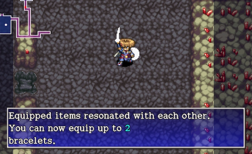

  

Resonance is a special effect that occurs when you equip specific combinations of weapons, shields, or bracelets at the same time.

When a resonance effect activates, a message is displayed in the scrolling messages window, and information about the effect and trigger condition gets added to the Item Book.

<table>
  <tr>
    <th>Item 1</th>
    <th>Item 2</th>
    <th>Resonance Effect</th>
  </tr>
  <tr>
    <td class="highlightYellow"><a href="/shiren-5/items/weapons#ordinary-stick">Ordinary Stick</a></td>
    <td class="highlightGray"><a href="/shiren-5/items/shields#plain-targe">Plain Targe</a></td>
    <td rowspan="9">Equip 2 bracelets ・The second bracelet in your inventory is unequipped if you equip 　another bracelet, or if the resonance effect is no longer active. ・However, if a bracelet is cursed, the other bracelet is unequipped.  ※ The resonance effect for the Pathetic Blade and Pathetic Shield 　set changes when they both reach level 8.</td>
  </tr>
  <tr>
    <td class="highlightYellow"><a href="/shiren-5/items/weapons#tin-blade">Tin Blade</a></td>
    <td class="highlightGray"><a href="/shiren-5/items/shields#tin-shield">Tin Shield</a></td>
  </tr>
  <tr>
    <td class="highlightYellow"><a href="/shiren-5/items/weapons#katana">Katana</a></td>
    <td class="highlightGray"><a href="/shiren-5/items/shields#iron-targe">Iron Targe</a></td>
  </tr>
  <tr>
    <td class="highlightYellow"><a href="/shiren-5/items/weapons#beast-fang">Beast Fang</a></td>
    <td class="highlightGray"><a href="/shiren-5/items/shields#beast-shield">Beast Shield</a></td>
  </tr>
  <tr>
    <td class="highlightYellow"><a href="/shiren-5/items/weapons#dotanuki">Dotanuki</a></td>
    <td class="highlightGray"><a href="/shiren-5/items/shields#wolfshead">Wolfshead</a></td>
  </tr>
  <tr>
    <td class="highlightYellow"><a href="/shiren-5/items/weapons#bladite">Bladite</a></td>
    <td class="highlightGray"><a href="/shiren-5/items/shields#targite">Targite</a></td>
  </tr>
  <tr>
    <td class="highlightYellow"><a href="/shiren-5/items/weapons#red-blade">Red Blade</a></td>
    <td class="highlightGray"><a href="/shiren-5/items/shields#red-shield">Red Shield</a></td>
  </tr>
  <tr>
    <td class="highlightYellow"><a href="/shiren-5/items/weapons#extreme-sword">Extreme Sword</a></td>
    <td class="highlightGray"><a href="/shiren-5/items/shields#rush-shield">Rush Shield</a></td>
  </tr>
  <tr>
    <td class="highlightYellow"><a href="/shiren-5/items/weapons#pathetic-blade">Pathetic Blade</a></td>
    <td class="highlightGray"><a href="/shiren-5/items/shields#pathetic-shield">Pathetic Shield</a></td>
  </tr>
  <tr>
    <td class="highlightYellow"><a href="/shiren-5/items/weapons#kabura-katana">Kabura Katana</a></td>
    <td rowspan="2" class="highlightGray"><a href="/shiren-5/items/shields#fuuma-shield">Fuuma Shield</a></td>
    <td rowspan="2">Direct attack damage +5 ・Also applies to night monsters.</td>
  </tr>
  <tr>
    <td class="highlightYellow"><a href="/shiren-5/items/weapons#fuuma-sword">Fuuma Sword</a></td>
  </tr>
  <tr>
    <td class="highlightYellow"><a href="/shiren-5/items/weapons#fuuma-sword">Fuuma Sword</a></td>
    <td rowspan="2" class="highlightGray"><a href="/shiren-5/items/shields#helix-shield">Helix Shield</a></td>
    <td rowspan="2">Direct attack damage +10 ・Also applies to night monsters.</td>
  </tr>
  <tr>
    <td class="highlightYellow"><a href="/shiren-5/items/weapons#kaburagi">Kaburagi</a></td>
  </tr>
  <tr>
    <td class="highlightYellow"><a href="/shiren-5/items/weapons#dull-gold-edge">Dull Gold Edge</a></td>
    <td class="highlightGray"><a href="/shiren-5/items/shields#gold-shield">Gold Shield</a></td>
    <td >Max strength +3</td>
  </tr>
  <tr>
    <td class="highlightYellow"><a href="/shiren-5/items/weapons#lizard-lasher">Lizard Lasher</a></td>
    <td class="highlightGray"><a href="/shiren-5/items/shields#snake-shield">Snake Shield</a></td>
    <td rowspan="3">Weapon and shield strength +3</td>
  </tr>
  <tr>
    <td class="highlightYellow"><a href="/shiren-5/items/weapons#myopic-masher">Myopic Masher</a></td>
    <td class="highlightGray"><a href="/shiren-5/items/shields#spry-shield">Spry Shield</a></td>
  </tr>
  <tr>
    <td class="highlightYellow"><a href="/shiren-5/items/weapons#crescent-katana">Crescent Katana</a></td>
    <td class="highlightGray"><a href="/shiren-5/items/shields#blast-shield">Blast Shield</a></td>
  </tr>
  <tr>
    <td class="highlightYellow"><a href="/shiren-5/items/weapons#bright-blade">Bright Blade</a></td>
    <td class="highlightGray"><a href="/shiren-5/items/shields#day-shield">Day Shield</a></td>
    <td>Read scrolls without light at night</td>
  </tr>
  <tr>
    <td class="highlightYellow"><a href="/shiren-5/items/weapons#torch">Torches</a></td>
    <td rowspan="2" class="highlightGray"><a href="/shiren-5/items/shields#midnight-shield">Midnight Shield</a></td>
    <td>Evade enemy attacks more often</td>
  </tr>
  <tr>
    <td class="highlightYellow"><a href="/shiren-5/items/weapons#breeze-blade">Breeze Blade</a></td>
    <td rowspan="2">Equipped items won't rust ・The Shoddy set will still degrade through usage.</td>
  </tr>
  <tr>
    <td class="highlightYellow"><a href="/shiren-5/items/weapons#shoddy-dirk">Shoddy Dirk</a></td>
    <td class="highlightGray"><a href="/shiren-5/items/shields#shoddy-plank">Shoddy Plank</a></td>
  </tr>
  <tr>
    <td class="highlightYellow"><a href="/shiren-5/items/weapons#glass-dirk">Glass Dirk</a></td>
    <td class="highlightGray"><a href="/shiren-5/items/shields#glass-buckler">Glass Buckler</a></td>
    <td>Nullifies magic bullets received</td>
  </tr>
  <tr>
    <td class="highlightYellow"><a href="/shiren-5/items/weapons#dirk-of-debts">Dirk of Debts</a></td>
    <td class="highlightGray"><a href="/shiren-5/items/shields#paupers-plank">Pauper's Plank</a></td>
    <td>Enemies drop Gitan more often ・Defeated enemies drop 200-399 Gitan about 20% of the time. ・Also applies when you defeat enemies using Flame Shot. ※ Generally negative, since it replaces normal item drops.</td>
  </tr>
  <tr>
    <td class="highlightYellow"><a href="/shiren-5/items/weapons#violent-blade">Violent Blade</a></td>
    <td class="highlightGray"><a href="/shiren-5/items/shields#mojo-bracelet">Mojo Bracelet</a></td>
    <td>Chance to inflict <a href="/shiren5/system/status-conditions#slow">Slow</a> status</td>
  </tr>
  <tr>
    <td class="highlightYellow"><a href="/shiren-5/items/weapons#burning-blade">Burning Blade</a></td>
    <td class="highlightGray"><a href="/shiren-5/items/shields#swap-shield">Swap Shield</a></td>
    <td>Increases flame damage by 1 level ・Blue Flame takes priority if present, increasing flame damage 　to 30 regardless of weapon level. (The flame also turns blue)</td>
  </tr>
  <tr>
    <td class="highlightYellow"><a href="/shiren-5/items/weapons#rising-sun">Rising Sun</a></td>
    <td class="highlightGray"><a href="/shiren-5/items/shields#rising-sun-shld">Rising Sun Shld</a></td>
    <td>Adjacent monsters might step away</td>
  </tr>
  <tr>
    <td class="highlightYellow"><a href="/shiren-5/items/weapons#wonder-pick">Wonder Pick</a></td>
    <td class="highlightGray"><a href="/shiren-5/items/shields#nirvana-board">Nirvana Board</a></td>
    <td>Max HP +30</td>
  </tr>
  <tr>
    <td class="highlightYellow"><a href="/shiren-5/items/weapons#torch">Torches</a></td>
    <td class="highlightGray"><a href="/shiren-5/items/shields#blazing-shield">Blazing Shield</a></td>
    <td>Light up everything on-screen at night</td>
  </tr>
  <tr>
    <td class="highlightYellow"><a href="/shiren-5/items/shields#student-shield">Student Shield</a></td>
    <td class="highlightGray"><a href="/shiren-5/items/bracelets#growth-bracelet">Growth Bracelet</a></td>
    <td>Doubles bracelet experience points gain</td>
  </tr>
  <tr>
    <td class="highlightYellow"><a href="/shiren-5/items/shields#counter-shield">Counter Shield</a></td>
    <td class="highlightGray"><a href="/shiren-5/items/bracelets#strength-bracelet">Strength Bracelet</a></td>
    <td>Doubles counter damage</td>
  </tr>
  <tr>
    <td class="highlightYellow"><a href="/shiren-5/items/weapons#nap-rattle">Nap Rattle</a></td>
    <td class="highlightGray"><a href="/shiren-5/items/bracelets#alert-bracelet">Alert Bracelet</a></td>
    <td>Increases chance to inflict <a href="/shiren5/system/status-conditions#asleep">Asleep</a> status (+2%)</td>
  </tr>
  <tr>
    <td class="highlightYellow"><a href="/shiren-5/items/weapons#baffle-axe">Baffle Axe</a></td>
    <td class="highlightGray"><a href="/shiren-5/items/bracelets#anti-cnf-bracelet">Anti-Cnf. Bracelet</a></td>
    <td>Increases chance to inflict <a href="/shiren5/system/status-conditions#confused">Confused</a> status (+2%)</td>
  </tr>
  <tr>
    <td class="highlightYellow"><a href="/shiren-5/items/weapons#true-knife">True Knife</a></td>
    <td class="highlightGray"><a href="/shiren-5/items/bracelets#anti-parry-brce">Anti-Parry Brce.</a></td>
    <td>Thrown items always hit</td>
  </tr>
</table>
