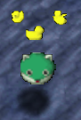
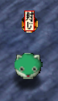
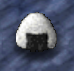
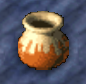

## Overview

Shiren and monsters can be inflicted by effects called status conditions. 
Conditions with negative effects are called ailments, and restrict the character's actions. 
Ailments can have a drastic impact toward combat or even your adventure as a whole. 
It's good to have some basic knowledge for each one so that they can be utilized for benefit. 
Since there are few conditions with positive effects, they're grouped with ailments.

These effects fit into 2 categories - status conditions (ailments), and Shiren-exclusive effects. 
Status conditions and Shiren-exclusive effects both include negative and positive effects. 
This page also includes information on how status conditions affect monsters.

<ul class="quickLinksUL">
  <li><a href="#basics">Basics</a></li>
  <li><a href="#status-list">Status List</a></li>
  <li><a href="#shiren-exclusive">Shiren Exclusive</a></li>
</ul>

## Basics

Most effects only last for a set number of turns, and are cured after the duration expires. 
Status conditions that last for the duration of the current floor only apply to monsters.

Movement speed cannot be both slowed and hastened at the same time. 
Think of it as the character's action speed stage increasing or decreasing by 1. 
There is one exception, however, where a Talk Seed effect can slow a character down to 1 action every 2 turns even if they were moving at double or triple speed.

Paralysis is unrelated to action speed, and can occur even when a character is hastened. If a Slow Staff is swung at a character that is already slowed, they become paralyzed and their action speed stage will reset.

Drinking Good Water or Perfect Water cures all status conditions except hastened speed, 
and being revived by Revival Grass cures all status conditions.

## Status List

For rows with 2 descriptions, the above one is for Shiren, and the one below is for monsters. 
Causes that have a monster name represent a special attack used by that monster.

Duration (turns) begins when Shiren first takes action after the character gains the condition. 
For example, if a Devil Kangaroo swings its Invisible Staff at a monster, in either case 
of the monster becoming invisible after acting or before acting, the invisibility ends after Shiren performs 20 turns worth of actions. So the monster would be invisible for 20 turns in the first case, or 21 turns in the second case.

<table class="statusTable">
  <tr>
    <th>Visual</th>
    <th>Name</th>
    <th>Turns</th>
    <th>Info</th>
    <th>Cause</th>
    <th>Cure</th>
  </tr>
  <tr>
    <td rowspan="2" class="statusImageTd"></td>
    <td rowspan="2" class="centeredTd">Confusion</td>
    <td class="centeredTd">10</td>
    <td>Movement and attack direction becomes unpredictable. All other actions can be performed normally, like stepping in place, throwing items, reading scrolls, and using staves. Attacks can hit NPCs and allies, so be careful if you have a weapon with the 三 seal (Razor Wind) or Morning Star.</td>
    <td>Spin Trap Spoiled Onigiri Talk Seed Gazer Family Possession Staff</td>
    <td>Otogiriso</td>
  </tr>
  <tr>
    <td class="centeredTd">10</td>
    <td>Movement and attack direction becomes unpredictable. Attacks still have a chance to line up with Shiren or allies. The monster can't use special attacks while confused, but passive abilities such as Patient Bag exploding or Tonosamadon reflecting items still occur.</td>
    <td>Spin Trap Talk Seed Gazer Family</td>
    <td>Otogiriso</td>
  </tr>
  <tr>
    <td class="statusImageTd"></td>
    <td class="centeredTd">Fear</td>
    <td class="centeredTd">10</td>
    <td>Becomes afraid that something sinister is behind them, making them attack in the opposite direction. There's no way to inflict Shiren with Fear. Can be used to intetionally level up a monster. If a monster you're controlling is inflicted by fear, face the opposite direction before attacking a target.</td>
    <td>Fear Scroll</td>
    <td>-</td>
  </tr>
  <tr>
    <td rowspan="2" class="statusImageTd"></td>
    <td rowspan="2" class="centeredTd">Slow</td>
    <td class="centeredTd">10</td>
    <td>Can only act 1 time every 2 turns. Doubles duration of conditions like sleep and paralysis. If you get hit by a Slow Staff while already slowed, action speed will reset and you will be paralyzed. It's possible to be slowed again while paralyzed.</td>
    <td rowspan="2">Slow Trap Slow Staff Poison Grass Talk Seed Demon Scorpion Monarch Tusker</td>
    <td rowspan="2">Swift Grass Swift Staff</td>
  </tr>
  <tr>
    <td class="centeredTd">∞</td>
    <td>Can only act once every 2 turns. If they get hit by a Slow Staff while already slowed, movement speed will reset and they will be paralyzed. Movement speed will reset when sealed, but a sealed monster can be slowed again.</td>
  </tr>
  <tr>
    <td rowspan="2" class="statusImageTd">Faster idle animation</td>
    <td rowspan="2" class="centeredTd">Swift</td>
    <td class="centeredTd">10</td>
    <td>Can act 2 times/turn (double), or 3 times/turn (triple). Becomes triple speed if already at double speed. Action speed is lowered by 1 stage if slowed. To be clear, this status condition is not an ailment.</td>
    <td>Swift Grass Swift Staff Bat Kangaroo</td>
    <td rowspan="2">Slow Staff Slow Trap Poison Grass</td>
  </tr>
  <tr>
    <td class="centeredTd">20</td>
    <td>Can act 2 times/turn (double), or 3 times/turn (triple). Becomes triple speed if already at double speed. Action speed is lowered by 1 stage if slowed. Some monsters are naturally double or triple speed. Sealing a swift monster resets their action speed.</td>
    <td>Swift Grass Swift Staff Slumber Scroll Bat Kangaroo</td>
  </tr>
  <tr>
    <td rowspan="2" class="statusImageTd"></td>
    <td rowspan="2" class="centeredTd">Blind</td>
    <td class="centeredTd">10</td>
    <td>Unable to see other characters, items, traps, and stairs. Can still see the current floor's map shape. Cancels Sight effect if Shiren had eaten Sight Grass. Can't dash, and can't step on Gitan without picking it up. All other actions can be performed normally, and attack accuracy remains the same.</td>
    <td>Iron Sand Spoiled Onigiri</td>
    <td>Sight Grass</td>
  </tr>
  <tr>
    <td class="centeredTd">∞</td>
    <td>Walks forward without changing directions. Attacks anyone in front of it, including other monsters. Randomly changes direction if it hits a wall or waterway. Can't use their special attack, even if possessed.</td>
    <td>Iron Sand</td>
    <td>-</td>
  </tr>
  <tr>
    <td rowspan="2" class="statusImageTd"></td>
    <td rowspan="2" class="centeredTd">Invisible</td>
    <td class="centeredTd">10</td>
    <td>Can't be detected by enemies or Ouch, Stone Toss statue. Still receive damage like normal while invisible. Wears off if you drink Good Water or Perfect Water.</td>
    <td rowspan="2">Invisible Staff Devil Kangaroo</td>
    <td>-</td>
  </tr>
  <tr>
    <td class="centeredTd">20</td>
    <td>Monster completely disappears. (Including on the map). Walks around aimlessly while invisible, similar to Pumphantasm, and can't use their special attack. Possessed invisible monsters can walk normally, but still can't use their special attack.  Name changes to "Something", making it hard to tell what monster it is based on their attack sound effect alone. Wider attacks like Lightning Scroll or Razor Wind help. Shiren can see invisible monsters if he has Sight status.</td>
    <td>識 seal</td>
  </tr>
  <tr>
    <td rowspan="2" class="statusImageTd"></td>
    <td rowspan="2" class="centeredTd">Miss</td>
    <td class="centeredTd">25</td>
    <td>Direct attack accuracy is halved, and the effect of 必 seal (Homing Blade) is nullified. Doesn't seem to affect the accuracy of thrown items.</td>
    <td rowspan="2">Miss Staff</td>
    <td rowspan="2">-</td>
  </tr>
  <tr>
    <td class="centeredTd">30</td>
    <td>Direct attacks will always miss. Can use their special attack like normal. Direct attacks are guaranteed to hit if the target is unable to move due to a status condition or Bear Trap.</td>
  </tr>
  <tr>
    <td rowspan="2" class="statusImageTd"></td>
    <td rowspan="2" class="centeredTd">Sleep</td>
    <td class="centeredTd">5</td>
    <td>Unable to perform any actions until they wake up. Can't evade attacks, including attacks from characters afflicted with the Miss status condition. Can't be tripped.</td>
    <td>Sleep Trap Sleep Statue Spoiled Onigiri Talk Seed</td>
    <td rowspan="2">-</td>
  </tr>
  <tr>
    <td class="centeredTd">5</td>
    <td>Unable to perform any actions until they wake up. Can't evade attacks, including attacks from characters afflicted with the Miss status condition. Monsters that are generated while sleeping (napping) differs from this status condition.  Sleep lasts 5 turns, or 10 turns if a Slumber Scroll is read. Monsters waking up after a Slumber Scroll will have a permanent increase in movement speed by 1 stage. Can't be tripped.</td>
    <td>Sleep Trap Sleep Statue Talk Seed Slumber Scroll 眠 seal</td>
  </tr>
  <tr>
    <td rowspan="2" class="statusImageTd"></td>
    <td rowspan="2" class="centeredTd">Freeze</td>
    <td class="centeredTd">1</td>
    <td rowspan="2">Unable to perform any actions. Can't evade attacks, including attacks from characters afflicted with the Miss status condition. Can't be tripped.</td>
    <td rowspan="2">Talk Seed Aqua Dragon Sea Dragon Water Shinryu</td>
    <td rowspan="2">-</td>
  </tr>
  <tr>
    <td class="centeredTd">2</td>
  </tr>
  <tr>
    <td rowspan="2" class="statusImageTd"></td>
    <td rowspan="2" class="centeredTd">Paralysis</td>
    <td class="centeredTd">3</td>
    <td rowspan="2">Unable to perform any actions. Can't evade attacks, including attacks from characters afflicted with the Miss status condition.</td>
    <td rowspan="2">Slow Staff Stun Scorpion Monarch Tusker Rock Beast Boulder Beast</td>
    <td rowspan="2">-</td>
  </tr>
  <tr>
    <td class="centeredTd">2</td>
  </tr>
  <tr>
    <td rowspan="2" class="statusImageTd"></td>
    <td rowspan="2" class="centeredTd">Seal</td>
    <td class="centeredTd">35</td>
    <td>Can't read scrolls or use grasses, seeds, onigiri, or water. Attempting to use the above items will end your turn. Can still bite a weapon with the か seal (Dried Bonito).</td>
    <td>Seal Staff King Tusker</td>
    <td rowspan="2">-</td>
  </tr>
  <tr>
    <td class="centeredTd">∞</td>
    <td>Prevents the use of special attacks and nullifies abilities, making it so that monsters only use direct attacks.  Most characteristics like the ability to divide or having unpredictable movement are also nullified. However, some won't be nullified, such as Floating, Flying, Amphibious elements, fire immunity, lightning immunity, Boss Oni's ailment cure, Shopkeeper and Trader abilities.  Bomb type monsters can be sealed using a Water Pot. (or Flood Trap in Patient Bag's case). Action speed will be reset when a monster is sealed.</td>
    <td>Seal Staff Strip Trap King Tusker Monsoon Doll</td>
  </tr>
  <tr>
    <td rowspan="2" class="statusImageTd"></td>
    <td rowspan="2" class="centeredTd">Onigiri</td>
    <td class="centeredTd">10</td>
    <td>Can't use items. ([Items] and [Ground] options vanish) Nullifies weapon, shield, and bracelet stats and effects.</td>
    <td>飯 seal (shield) Nigiri Boss Nigiri Master</td>
    <td rowspan="2">-</td>
  </tr>
  <tr>
    <td class="centeredTd">∞</td>
    <td>Can't use their special attack. (Similar to being sealed)</td>
    <td>Nigiri Boss Nigiri Master</td>
  </tr>
  <tr>
    <td rowspan="2" class="statusImageTd">Character stops moving</td>
    <td rowspan="2" class="centeredTd">Stasis</td>
    <td class="centeredTd">40</td>
    <td>Unable to perform any actions. Can't evade attacks, including attacks from characters afflicted with the Miss status condition. Stasis is canceled if you receive damage. Possibly cured if you get hit by certain special attacks.</td>
    <td rowspan="2">Talk Seed</td>
    <td rowspan="2">-</td>
  </tr>
  <tr>
    <td class="centeredTd">∞</td>
    <td>Unable to perform any actions. Can't evade attacks, including attacks from characters afflicted with the Miss status condition. Stasis is canceled if they receive damage. Possibly cured if they get hit by certain special attacks. Throw Water (castle material) at Oni to inflict this status.</td>
  </tr>
  <tr>
    <td rowspan="2" class="statusImageTd"></td>
    <td rowspan="2" class="centeredTd">Pot</td>
    <td class="centeredTd">3~8</td>
    <td>Status condition inflicted when hit by a thrown Sticky Pot. Unable to perform any actions. Can't evade attacks, including attacks from characters afflicted with the Miss status condition.  Pot breaks instead of taking damage when attacked. Some monsters only use special attacks toward the pot. Adventure ends if Shiren is hit by a sturdy Sticky Pot.</td>
    <td rowspan="2">Sticky Pot</td>
    <td rowspan="2">-</td>
  </tr>
  <tr>
    <td class="centeredTd">5~8</td>
    <td>Unable to perform any actions. Can't evade attacks, including attacks from characters afflicted with the Miss status condition. Pot breaks instead of taking damage when attacked. Some monsters only use special attacks toward the pot.  Many effects are nullified. Pull, Knockback, and Swap staves still work. Monsters will attack the pot if it's blocking their path. Can't break free if hit by a sturdy Sticky Pot.</td>
  </tr>
  <tr>
    <td rowspan="2" class="statusImageTd">None</td>
    <td rowspan="2" class="centeredTd">Boost</td>
    <td rowspan="2" class="centeredTd">10</td>
    <td>Doubles the effects of grasses and seeds.</td>
    <td rowspan="2">Boost Grass</td>
    <td rowspan="2">-</td>
  </tr>
  <tr>
    <td>Doubles the effects of grasses and seeds. Himakichi is the only NPC that can eat Boost Grass.</td>
  </tr>
</table>

## Shiren Exclusive

Some special conditions are exclusive to Shiren. 
Of these effects, ones that are caused by items can be particularly beneficial.

Whereas status conditions include many negative effects, most Shiren-exclusive effects are positive, and none of them wear off based on the number of elapsed turns.

"Floor" in the Turns column means the effect lasts the entire time spent on the current floor.

<table class="statusTable">
  <tr>
    <th>Visual</th>
    <th>Name</th>
    <th>Turns</th>
    <th>Info</th>
    <th>Cause</th>
    <th>Cure</th>
  </tr>
  <tr>
    <td class="statusImageTd">(UI Darkens)</td>
    <td class="centeredTd">Starving</td>
    <td class="centeredTd">-</td>
    <td>Condition that occurs when fullness reaches 0%. Natural HP recovery stops, and instead Shiren will lose 1 HP per turn until he collapses. Allies and monsters don't have hunger. Can be cured by possessing a Hunger Puppet monster and using their special attack. iDash is disabled.</td>
    <td>Turns elapsing Hunger Puppet Starve Puppet Famine Puppet</td>
    <td>Onigiri Squid Sushi Scroll Grass, Seed Gobo Dried Bonito Perfect Water</td>
  </tr>
  <tr>
    <td class="statusImageTd"></td>
    <td class="centeredTd">Hollow</td>
    <td class="centeredTd">-</td>
    <td>Shiren's body while controlling a monster. He is unable to perform any actions in this state. The body follows the possessed monster, but will not follow if inflicted by confusion.  Shiren returns to his body when [Back] is chosen or when the possessed monster is defeated. Returning to his body will not end the turn, and can be done from a distance. Equipment stats and hunger still apply to Shiren's body, but traps won't be triggered.  Hunger rate is doubled or tripled if a monster with double or triple action speed is possessed. Monsters prioritize attacking Shiren's body, and Shiren's remaining HP will be displayed for a brief moment when he receives damage. Possessed and Hollow states are canceled when Shiren is revived by Revival Grass.</td>
    <td>Possession Staff</td>
    <td>-</td>
  </tr>
  <tr>
    <td class="statusImageTd">None</td>
    <td class="centeredTd">Sight</td>
    <td class="centeredTd">Floor</td>
    <td>Status gained by eating Sight Grass. Hidden traps become visible, and invisible characters can be faintly seen. The effect is canceled if blinded, but won't wear off when Shiren is revived by Revival Grass.</td>
    <td>Sight Grass</td>
    <td>Iron Sand Spoiled Onigiri</td>
  </tr>
  <tr>
    <td class="statusImageTd">None</td>
    <td class="centeredTd">Silent</td>
    <td class="centeredTd">Floor</td>
    <td>Special Onigiri effect. Sleeping monsters never wake up when Shiren walks nearby, or when he enters or exits rooms.</td>
    <td>Special Onigiri</td>
    <td>-</td>
  </tr>
  <tr>
    <td class="statusImageTd">None</td>
    <td class="centeredTd">Alert</td>
    <td class="centeredTd">Floor</td>
    <td>Special Onigiri effect. Shiren will not fall asleep from Sleep Trap, Sleep Statue, Talk Seed, or Spoiled Onigiri. A glitch exists where the effect can be negated. Does not wear off if revived by Revival Grass.</td>
    <td>Special Onigiri</td>
    <td>-</td>
  </tr>
  <tr>
    <td class="statusImageTd">None</td>
    <td class="centeredTd">Poison Immune</td>
    <td class="centeredTd">Floor</td>
    <td>Special Onigiri effect. Prevents strength loss from Poison Arrows, Poison Grass, Scorpion, Sheep Priest, and Slugs. Basically Scale Shield + Salty Bracelet, but can't prevent strength loss from Spoiled Onigiri. A glitch exists where the effect can be negated.</td>
    <td>Special Onigiri</td>
    <td>-</td>
  </tr>
  <tr>
    <td class="statusImageTd">None</td>
    <td class="centeredTd">Pick Up Identify</td>
    <td class="centeredTd">Floor</td>
    <td>Special Onigiri effect. Items that are picked up, inserted or taken from a pot, or bought from a Trader will be identified. This includes items inserted into Presto Pots. Does not wear off if revived by Revival Grass.</td>
    <td>Special Onigiri</td>
    <td>-</td>
  </tr>
  <tr>
    <td class="statusImageTd">None</td>
    <td class="centeredTd">No Hunger</td>
    <td class="centeredTd">Floor</td>
    <td>Special Onigiri effect. Stops fullness depletion due to turns elapsing.</td>
    <td>Special Onigiri</td>
    <td>-</td>
  </tr>
</table>
