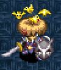

  

## Overview

Status conditions are states that affect a character's behavior in various ways. 
All statuses besides "Regular" can be categorized as positive or negative.

[Absorbiphant](/system/monsters#absorbiphant) monsters and the Sparrow [NPC](/system/npcs) can remove all status conditions 
except for Super (and its boosts), Dueling, Dodger, Cautious, Reflective, and Zen.

For information about auras, check the [Gameplay Basics](/system/gameplay-basics) page.

#### Shiren

- Negative statuses can be removed by items like Peach, Fixer Scroll, or Immunity Scroll. (Immune status will protect you from negative statuses)
- You can check your current status from the menu. (Other → Current State)
- Most status conditions wear off after a number of turns, or when you change floors.
- (However, Super status and corresponding bonuses will remain active)
- Being revived by Revival Grass or Undo Grass will remove all status conditions except for Dodger, Cautious, Reflective, and Zen.

#### Allies

- Negative statuses can be removed by items like Peach or Immunity Scroll. (Immune status will protect the ally from negative statuses)

#### Monsters

- Negative statuses can be removed by a Peach or Cure Monster Trap. (Immune status will protect the monster from negative statuses)
- Nixer Scroll will have no effect if used on a monster that has a negative status.

## Status List

Key: Positive, Negative, Special 
※ Status names are a bit inconsistent within the game, so all alternate names are listed.

<table class="itemDetailsTable">
  <tr>
    <th>Status</th>
    <th>Target</th>
    <th>Effect</th>
    <th>Causes</th>
  </tr>
  <tr>
    <th id="slow" rowspan="3" class="highlightPink">Slow</th>
    <td>Shiren</td>
    <td rowspan="3">Perform 1 action every 2 turns.</td>
    <td rowspan="2">Slow Trap, Poison Grass, Mutaikons, Mage Staff, Slow Staff, Slow Talisman, MC Sorceror</td>
  </tr>
  <tr>
    <td>Ally</td>
  </tr>
  <tr>
    <td>Monster</td>
    <td>The above, Water Pot</td>
  </tr>
  <tr>
    <th id="swift" rowspan="3" class="highlightBlue">Swift, Haste</th>
    <td>Shiren</td>
    <td rowspan="3">Perform 2 actions every turn.</td>
    <td rowspan="2">DJ Mage, Swift Grass, Shrine Maid. Pot, Swift Talisman</td>
  </tr>
  <tr>
    <td>Ally</td>
  </tr>
  <tr>
    <td>Monster</td>
    <td>The above, Swift Foe Scroll, Gambler's Scroll</td>
  </tr>
  <tr>
    <th id="confused" rowspan="3" class="highlightPink">Confused</th>
    <td>Shiren</td>
    <td>Movement or attack goes in a random direction. (12 turns) Projectiles, thrown items, and staves can be used normally. If a direct attack turns to face an ally, it'll deal damage.</td>
    <td rowspan="2">Spin Trap, Dazikon, MC Mage, Mage Staff, MC Wizard, Foly, Confusion Grass, Conf. Talisman</td>
  </tr>
  <tr>
    <td>Ally</td>
    <td>Moves randomly, and attacks if a creature is in the way.</td>
  </tr>
  <tr>
    <td>Monster</td>
    <td>Moves randomly, and won't use special attacks. (20 turns) Attacks if a creature is in the way, but the game performs a second movement check if it's another monster, so it's a bit rare for confused monsters to attack other monsters.</td>
    <td>The above, Confusion Scroll</td>
  </tr>
  <tr>
    <th id="asleep" rowspan="3" class="highlightPink">Asleep</th>
    <td>Shiren</td>
    <td rowspan="3">Unable to perform any actions. (6 turns)</td>
    <td rowspan="3">Sleep Trap, Mage Staff, Sleepy Grass, Naptapirs, Sleep Talisman, Dozikon</td>
  </tr>
  <tr>
    <td>Ally</td>
  </tr>
  <tr>
    <td>Monster</td>
  </tr>
  <tr>
    <th id="sound-asleep" rowspan="3" class="highlightPink">Sound Asleep, Sound Sleep, Slumbering</th>
    <td>Shiren</td>
    <td rowspan="3">Unable to perform any actions. (12 turns) Action speed is increased by 1 stage afterward.</td>
    <td rowspan="2">Slumber Talisman</td>
  </tr>
  <tr>
    <td>Ally</td>
  </tr>
  <tr>
    <td>Monster</td>
    <td>The above, Slumber Scroll</td>
  </tr>
  <tr>
    <th id="blind" rowspan="3" class="highlightPink">Blind</th>
    <td>Shiren</td>
    <td>Field of view reduced to zero, can't read scrolls. (10 turns) Overwrites Farseeing status. Check for walls using show tiles controls. If you can detect enemies, they will be visible on the map. (Example: having a Monster Detector equipped) All other creatures will display as "Someone".</td>
    <td rowspan="2">Blind Trap, Kid Squids, Drama Staff, MC Mage, Blinding Grass</td>
  </tr>
  <tr>
    <td>Ally</td>
    <td rowspan="2">Walks in a straight line until they hit something. (10 turns) Changes directions if they hit a wall, and attacks if they bump into Shiren, NPCs, or monsters. Monsters won't use special attacks.</td>
  </tr>
  <tr>
    <td>Monster</td>
    <td>The above, Darkroom</td>
  </tr>
  <tr>
    <th id="paralyzed" rowspan="3" class="highlightPink">Paralyzed</th>
    <td>Shiren</td>
    <td>Unable to act until attacked or hit by an effect. The paralysis wears off after 40 turns.</td>
    <td rowspan="2">MC Mage, MC Wizard, Paralysis Staff, Transient Staff, Maneaters</td>
  </tr>
  <tr>
    <td>Ally</td>
    <td rowspan="2">Unable to act until attacked or hit by an effect.</td>
  </tr>
  <tr>
    <td>Monster</td>
    <td>The above, Fixer Scroll</td>
  </tr>
  <tr>
    <th id="s-paralyzed" rowspan="3" class="highlightPink">S-Paralyzed, Super Paralyzed</th>
    <td>Shiren</td>
    <td>Unable to act until attacked or hit by an effect 2 times. The paralysis wears off after 40 turns.</td>
    <td rowspan="3">Paralysis Staff (blessed), Transient Staff (blessed)</td>
  </tr>
  <tr>
    <td>Ally</td>
    <td rowspan="2">Unable to act until attacked or hit by an effect 2 times. (Changes to Paralyzed after being hit 1 time)</td>
  </tr>
  <tr>
    <td>Monster</td>
  </tr>
  <tr>
    <th id="empathetic" rowspan="3" class="highlightPink">Empathetic</th>
    <td>Shiren</td>
    <td rowspan="2">When the target who inflicted this status takes damage, Shiren or the ally receives the same amount of damage. You won't receive damage if you defeat the target in 1 hit. Lasts until target is gone from floor, or you change floors.</td>
    <td rowspan="3">MC Sorceror, Sharing Staff, Empathy Staff</td>
  </tr>
  <tr>
    <td>Ally</td>
  </tr>
  <tr>
    <td>Monster</td>
    <td>Target takes the same amount of damage when you're hit.</td>
  </tr>
  <tr>
    <th id="s-empathetic" rowspan="3" class="highlightPink">S-Empathetic, Super Empathetic</th>
    <td>Shiren</td>
    <td rowspan="2">When the target who inflicted this status takes damage, Shiren or the ally will receive double the amount of damage. You won't receive damage if you defeat the target in 1 hit. Lasts until target is gone from floor, or you change floors.</td>
    <td rowspan="3">Empathy Staff (blessed), Sharing Staff (blessed)</td>
  </tr>
  <tr>
    <td>Ally</td>
  </tr>
  <tr>
    <td>Monster</td>
    <td>Target takes double the amount of damage when you're hit.</td>
  </tr>
  <tr>
    <th id="hiding" rowspan="3" class="highlightBlue">Hiding</th>
    <td>Shiren</td>
    <td>Unable to act, won't be detected by monsters. (20 turns) Collapse if you hide while on an air or water tile.</td>
    <td rowspan="3">Hide Pot</td>
  </tr>
  <tr>
    <td>Ally</td>
    <td>Unable to act. Won't be detected by monsters. Break free by talking or being hit by an attack or effect. Collapse if they hide while on an air or water tile.</td>
  </tr>
  <tr>
    <td>Monster</td>
    <td>Unable to act, but won't be detected by other monsters. Can't break free until they get hit by an attack or effect. Collapse if they hide while on an air or water tile.</td>
  </tr>
  <tr>
    <th id="cloned" rowspan="3" class="highlightPink">Cloned, Substitution</th>
    <td>Shiren</td>
    <td>Same as Confused status.</td>
    <td rowspan="3">Clone Staff, MC Wizard</td>
  </tr>
  <tr>
    <td>Ally</td>
    <td>Transforms into Fake Shiren. (30 turns) Monsters will aim for the fake, but allies won't attack it. Trying to talk to the fake will result in attacking it. Only 1 fake can be present, so the first character returns to normal and is left Confused if a 2nd fake is made.</td>
  </tr>
  <tr>
    <td>Monster</td>
    <td>Transforms into Fake Shiren. (30 turns) Monsters will prioritize it over Shiren and his allies. The fake won't use special attacks, and is treated as a character on land, even if it's a Floating or Aquatic type. Some monsters won't use special attacks if a fake is visible. Only 1 fake can be present, so the first character returns to normal and is left Confused if a 2nd fake is made.</td>
  </tr>
  <tr>
    <th id="enduring" rowspan="3" class="highlightBlue">Enduring</th>
    <td>Shiren</td>
    <td rowspan="3">Lets you survive a fatal blow with 1 HP. Wears off after activating, or if you advance 2 floors.</td>
    <td rowspan="3">Juicy Peach</td>
  </tr>
  <tr>
    <td>Ally</td>
  </tr>
  <tr>
    <td>Monster</td>
  </tr>
  <tr>
    <th id="apathetic" class="highlightPink">Apathetic</th>
    <td>Monster</td>
    <td>Unable to perform any actions. (6 turns)</td>
    <td>Amnesia Grass, Gauge Blind. Trap</td>
  </tr>
  <tr>
    <th id="berserk" rowspan="3" class="highlightPink">Berserk</th>
    <td>Shiren</td>
    <td>Player loses control of Shiren. (30 turns) Shiren will search out and attack the nearest creature. Won't enter walls if you have a Wall Clip Bracelet equipped.</td>
    <td rowspan="3">Rage Grass, Mesmerikon, MC Wizard, Foly, Berserker Tal.</td>
  </tr>
  <tr>
    <td>Ally</td>
    <td>Can't use special attacks. Attacks nearest creature. (30 turns)</td>
  </tr>
  <tr>
    <td>Monster</td>
    <td>Can't use special attacks. Attacks nearest creature. (30 turns) Night monsters are immune to this status.</td>
  </tr>
  <tr>
    <th id="shadow-bound" rowspan="3" class="highlightPink">Shadow Bound</th>
    <td>Shiren</td>
    <td>Prevents movement. Can attack, change direction. (3 turns)</td>
    <td rowspan="3">Shadow Bind Tal., Shadow Bind Trap, Foly</td>
  </tr>
  <tr>
    <td>Ally</td>
    <td>Prevents movement. Can attack, change direction.</td>
  </tr>
  <tr>
    <td>Monster</td>
    <td>Prevents movement. Can attack, change direction. (10 turns)</td>
  </tr>
  <tr>
    <th id="afraid" rowspan="3" class="highlightPink">Afraid</th>
    <td>Shiren</td>
    <td>Reverses direction of attacks and thrown items. (15 turns) Movement is not affected.</td>
    <td rowspan="2">Fear Talisman</td>
  </tr>
  <tr>
    <td>Ally</td>
    <td rowspan="2">Reverses direction of attacks. (15 turns) Can't use special attacks.</td>
  </tr>
  <tr>
    <td>Monster</td>
    <td>The above, Fear Scroll, Dicey Distractor</td>
  </tr>
  <tr>
    <th id="sealed" rowspan="3" class="highlightPink">Sealed</th>
    <td>Shiren</td>
    <td>Same as Muzzled, but also can't use staves. (20 turns) However, you can still eat peaches.</td>
    <td>Seal Staff, MC Wizard, Seal Talisman</td>
  </tr>
  <tr>
    <td>Ally</td>
    <td>Can't use special attacks, and can't talk to Shiren.</td>
    <td>The above, Imabikiso</td>
  </tr>
  <tr>
    <td>Monster</td>
    <td>Can't use special attacks or abilities. Action speed is unchanged.</td>
    <td>The above, Water Pot, Room Sealant</td>
  </tr>
  <tr>
    <th id="inaccurate" rowspan="3" class="highlightPink">Inaccurate</th>
    <td>Shiren</td>
    <td>Direct attacks will always miss. (10 turns) If target is Asleep or Paralyzed, the attack will still connect.</td>
    <td rowspan="3">Inacc. Talisman, Foly</td>
  </tr>
  <tr>
    <td>Ally</td>
    <td rowspan="2">Direct attacks will always miss. (10 turns)</td>
  </tr>
  <tr>
    <td>Monster</td>
  </tr>
  <tr>
    <th id="onigiri" rowspan="3" class="highlightPink">Onigiri</th>
    <td>Shiren</td>
    <td>Transforms into an onigiri. (10 turns) Attack and defense set to 0, and equipment effects nullified. Can't use items, abilities, ascend or descend stairs. Collapse if you get hit by fire or explosion damage, or if you step on a Decay Trap or land on a water tile.</td>
    <td rowspan="2">Onigiri Trap, Nigiri Boss, MC Sorceror, Nigiri King</td>
  </tr>
  <tr>
    <td>Ally</td>
    <td></td>
  </tr>
  <tr>
    <td>Monster</td>
    <td>Transforms into an onigiri. (10 turns) Attack and defense set to 0, and can't use special attacks. Turns into a Grilled Onigiri if hit by fire or explosion damage. Turns into a Rotten Onigiri if it steps on a Decay Trap, gets splashed by water (Water Pot), or lands on a water tile. Nigiri Baby monsters are immune, and will be Buffed instead.</td>
    <td>The above, Onigiri Bonanza</td>
  </tr>
  <tr>
    <th id="tottering" class="highlightPink">Tottering</th>
    <td>Monster</td>
    <td>Unable to act, and receives double damage. (6 turns) If the target is Mixer, it will drop eaten items on the ground.</td>
    <td>Oil Scroll</td>
  </tr>
  <tr>
    <th id="enraged" rowspan="3" class="highlightBlue">Enraged, Rage</th>
    <td>Shiren</td>
    <td rowspan="2">Doubles attack power. (15 turns)</td>
    <td rowspan="2">Enraged Talisman</td>
  </tr>
  <tr>
    <td>Ally</td>
  </tr>
  <tr>
    <td>Monster</td>
    <td>Doubles attack power. (50 turns)</td>
    <td>The above, Rage Trap</td>
  </tr>
  <tr>
    <th id="furious" rowspan="3" class="highlightBlue">Furious, Super Enraged</th>
    <td>Shiren</td>
    <td rowspan="2">Doubles attack power and grants Swift status. (15 turns)</td>
    <td rowspan="3">Furious Talisman</td>
  </tr>
  <tr>
    <td>Ally</td>
  </tr>
  <tr>
    <td>Monster</td>
    <td>Doubles attack power and grants Swift status. (15 turns) (Can attack 2 times per turn)</td>
  </tr>
  <tr>
    <th id="plated" rowspan="2" class="highlightBlue">Plated, Plating</th>
    <td>Shiren</td>
    <td rowspan="2">Character is immune to most attacks and traps. Chance to wear off when hit by attacks or trap effects.</td>
    <td rowspan="2">Mekky (NPC)</td>
  </tr>
  <tr>
    <td>Ally</td>
  </tr>
  <tr>
    <th id="farseeing" rowspan="3" class="highlightBlue">Farseeing</th>
    <td>Shiren</td>
    <td>Reveals hidden traps, lets you read scrolls in the dark. Overwrites Blind status. Wears off if you're inflicted with Blind or if you change floors.</td>
    <td rowspan="3">Perception Grass</td>
  </tr>
  <tr>
    <td>Ally</td>
    <td rowspan="2">Overwrites Blind status.</td>
  </tr>
  <tr>
    <td>Monster</td>
  </tr>
  <tr>
    <th id="gauge-blind" class="highlightPink">Gauge Blind, Gauge Vanish</th>
    <td>Shiren</td>
    <td>HP and fullness bars are hidden. (100 turns) Other stats show as ????, preventing checking current status.</td>
    <td>Gauge Blind. Trap</td>
  </tr>
  <tr>
    <th id="muzzled" class="highlightPink">Muzzled</th>
    <td>Shiren</td>
    <td>Unable to eat, read, use abilities, or talk. Wears off when you change floors.</td>
    <td>Muzzled Scroll</td>
  </tr>
  <tr>
    <th id="grounded" class="highlightPink">Grounded</th>
    <td>Shiren</td>
    <td>Unable to pick up items. Can still use items on the ground. Wears off when you change floors.</td>
    <td>Grounded Scroll, Foly</td>
  </tr>
  <tr>
    <th id="hypnotized" rowspan="3" class="highlightPink">Hypnotized</th>
    <td>Shiren</td>
    <td>Face a random direction and attack, use an item, or throw an item. (1 turn)</td>
    <td rowspan="3">Gazers</td>
  </tr>
  <tr>
    <td>Ally</td>
    <td rowspan="2">Same as Confused status.</td>
  </tr>
  <tr>
    <td>Monster</td>
  </tr>
  <tr>
    <th id="grassnesia" class="highlightPink">Grassnesia</th>
    <td>Shiren</td>
    <td>Unable to use or throw grass items. (100 turns)</td>
    <td>Myriman</td>
  </tr>
  <tr>
    <th id="scrollnesia" class="highlightPink">Scrollnesia</th>
    <td>Shiren</td>
    <td>Unable to use or throw scrolls. (100 turns)</td>
    <td>Billman</td>
  </tr>
  <tr>
    <th id="staffnesia" class="highlightPink">Staffnesia</th>
    <td>Shiren</td>
    <td>Unable to use or throw staves. (100 turns)</td>
    <td>Trillman</td>
  </tr>
  <tr>
    <th id="potnesia" class="highlightPink">Potnesia</th>
    <td>Shiren</td>
    <td>Unable to use or throw pots. (100 turns)</td>
    <td>Googoman</td>
  </tr>
  <tr>
    <th id="laughing" rowspan="3" class="highlightPink">Laughing</th>
    <td>Shiren</td>
    <td rowspan="2">Unable to perform any actions. (6 turns)</td>
    <td rowspan="3">Hilarious Pot</td>
  </tr>
  <tr>
    <td>Ally</td>
  </tr>
  <tr>
    <td>Monster</td>
    <td>Unable to perform any actions. (6 turns) Spreads to adjacent enemies and other enemies in the room. All enemies stop laughing when one enemy recovers.</td>
  </tr>
  <tr>
    <th id="napping" class="highlightPink">Napping</th>
    <td>Monster</td>
    <td>The monster is sleeping and won't wake up on its own. May wake up if you move next to it, or enter / exit the room. Floaty, Karakuroid, and Zalokleft always spawn napping, along with monsters inside regular Monster Houses.</td>
    <td>-</td>
  </tr>
  <tr>
    <th id="invincible" rowspan="3" class="highlightBlue">Invincible</th>
    <td>Shiren</td>
    <td rowspan="3">Nullifies all damage received. (20 turns) It doesn't protect against effects unrelated to damage.</td>
    <td rowspan="3">Invincible Grass, Shrine Maid. Pot</td>
  </tr>
  <tr>
    <td>Ally</td>
  </tr>
  <tr>
    <td>Monster</td>
  </tr>
  <tr>
    <th id="potted" class="highlightPink">Potted</th>
    <td>Shiren</td>
    <td>Hand is stuck in a pot, and your weapon is unequipped. Unable to pick up or use items, and can't use abilities. Wears off when you change floors, or step on a Strip Trap. Chance to break free when you attack or get hit by enemies.</td>
    <td>Sticky Pot</td>
  </tr>
  <tr>
    <th id="tinkerer" class="highlightBlue">Tinkerer, Reinforcer</th>
    <td>Shiren</td>
    <td>Gain x4.0 equipment skill points from enemies. (100 turns) Wears off when you change floors.</td>
    <td>Upgrade Seed</td>
  </tr>
  <tr>
    <th id="cannon-arm" class="highlightBlue">Cannon Arm</th>
    <td>Shiren</td>
    <td>Thrown items, projectiles go through walls and creatures. Wears off when you change floors.</td>
    <td>Dracon Grass</td>
  </tr>
  <tr>
    <th id="immune" rowspan="3" class="highlightBlue">Immune</th>
    <td>Shiren</td>
    <td rowspan="2">Character is immune to negative status conditions. Wears off when you change floors.</td>
    <td rowspan="2">Immunity Scroll, Peach (blessed)</td>
  </tr>
  <tr>
    <td>Ally</td>
  </tr>
  <tr>
    <td>Monster</td>
    <td>Monster is immune to negative status conditions.</td>
    <td>Peach (blessed)</td>
  </tr>
  <tr>
    <th id="klein" rowspan="3" class="highlightBlue">Klein</th>
    <td>Shiren</td>
    <td>Attack power and defense are switched. (20 turns) Wears off when you change floors.</td>
    <td rowspan="3">Klein Pot</td>
  </tr>
  <tr>
    <td>Ally</td>
    <td rowspan="2">Attack power and defense are switched. (20 turns)</td>
  </tr>
  <tr>
    <td>Monster</td>
  </tr>
  <tr>
    <th id="fast-regen" class="highlightBlue">Fast Regen</th>
    <td>Shiren</td>
    <td>Increases natural HP regeneration per turn by 1 HP. Wears off when you change floors.</td>
    <td>Self-Help</td>
  </tr>
  <tr>
    <th id="night-vision" class="highlightBlue">Night Vision</th>
    <td>Shiren</td>
    <td>Lets you read scrolls in the dark. Wears off when you change floors.</td>
    <td>Beacon of Light</td>
  </tr>
  <tr>
    <th id="zen" rowspan="3" class="highlightYellow">Zen, Reflector</th>
    <td>Shiren</td>
    <td rowspan="3">Makes characters immune to fire and explosion damage. Dragon, Firepuff, Pop Tank, Explochin special attacks, Explosion traps, Explosion Bracelet, 4-2-8 and Fever pots. Onigiri can still be grilled. Won't collapse if Onigiri status. Wears off if you change floors. (Reviving doesn't remove it)</td>
    <td rowspan="3">Zen Pot</td>
  </tr>
  <tr>
    <td>Ally</td>
  </tr>
  <tr>
    <td>Monster</td>
  </tr>
  <tr>
    <th id="dodger" rowspan="3" class="highlightYellow">Dodger</th>
    <td>Shiren</td>
    <td rowspan="3">Projectiles and thrown items always miss. Bored Kappa, Field Knave, Porky, Scoopie, Mutaikon, Bow Boy, and Grass Boy special attacks. Wears off if you change floors. (Reviving doesn't remove it)</td>
    <td rowspan="3">Dodger Pot</td>
  </tr>
  <tr>
    <td>Ally</td>
  </tr>
  <tr>
    <td>Monster</td>
  </tr>
  <tr>
    <th id="reflective" rowspan="3" class="highlightYellow">Reflective, Cautious</th>
    <td>Shiren</td>
    <td rowspan="3">Reflects all magic. DJ Mage, Gazer, and Polygon Spinna special attacks. Gazer's hypnosis is reflected as confusion, and Polygon Spinna's special attack is reflected as damage. Wears off if you change floors. (Reviving doesn't remove it)</td>
    <td rowspan="3">Reflection Pot</td>
  </tr>
  <tr>
    <td>Ally</td>
  </tr>
  <tr>
    <td>Monster</td>
  </tr>
  <tr>
    <th id="cautious" rowspan="3" class="highlightYellow">Cautious, Watcher</th>
    <td>Shiren</td>
    <td rowspan="3">Won't drop items, and others can't steal or parry your items. Zalokleft, Froggo, Gyadon, Swordsman, higher level Field Knave special attacks, and Trip Traps. Wears off if you change floors. (Reviving doesn't remove it)</td>
    <td rowspan="3">Perceptive Pot</td>
  </tr>
  <tr>
    <td>Ally</td>
  </tr>
  <tr>
    <td>Monster</td>
  </tr>
  <tr>
    <th id="ninja" class="highlightBlue">Ninja, Tiptoe</th>
    <td>Shiren</td>
    <td>Napping monsters won't wake up when you move next to them or when you enter or exit the room. Wears off when you change floors.</td>
    <td>Special Onigiri</td>
  </tr>
  <tr>
    <th id="knowledgeable" class="highlightBlue">Knowledgeable, Mass Identifier</th>
    <td>Shiren</td>
    <td>Items are identified when picked up or inserted into pots. Wears off when you change floors.</td>
    <td>Special Onigiri</td>
  </tr>
  <tr>
    <th id="satiated" class="highlightBlue">Satiated</th>
    <td>Shiren</td>
    <td>Stops natural fullness depletion. Wears off when you change floors.</td>
    <td>Special Onigiri</td>
  </tr>
  <tr>
    <th id="insomnia" class="highlightBlue">Insomnia</th>
    <td>Shiren</td>
    <td>You won't fall asleep. Wears off when you change floors.</td>
    <td>Special Onigiri</td>
  </tr>
  <tr>
    <th id="unwavering" class="highlightBlue">Unwavering, Power Save</th>
    <td>Shiren</td>
    <td>Your strength can't be decreased. Wears off when you change floors.</td>
    <td>Special Onigiri</td>
  </tr>
  <tr>
    <th id="starving" class="highlightYellow">Starving, Hunger</th>
    <td>Shiren</td>
    <td>Natural HP regeneration stops, lose 1 HP every turn. Canceled when your fullness increases above 0.</td>
    <td>Fullness reaches 0</td>
  </tr>
  <tr>
    <th id="danger" class="highlightYellow">Danger, Pinch</th>
    <td>Shiren</td>
    <td>Shiren's current HP is &lt; 30% of his max HP. (Red HP bar) Canceled when Shiren's HP &gt; 30% of his max HP.</td>
    <td>HP &lt; 30% of max HP</td>
  </tr>
  <tr>
    <th id="buffed" rowspan="3" class="highlightBlue">Buffed, Empowered</th>
    <td>Shiren</td>
    <td rowspan="3">Boosts damage dealt by 50% per stage. (8 stages max) Stages: 150%, 200%, 250%, 300%, 350%, 400%, 450%, 500%.</td>
    <td>Power Up Grass</td>
  </tr>
  <tr>
    <td>Ally</td>
    <td rowspan="2">Power Up Grass, Strength Grass</td>
  </tr>
  <tr>
    <td>Monster</td>
  </tr>
  <tr>
    <th id="weakened" rowspan="3" class="highlightPink">Weakened</th>
    <td>Shiren</td>
    <td rowspan="3">Reduces damage dealt by about 50%. (8 stages max) Stages: 50%, 60%, 70%, 80%, 90%, 95%, 97%, 99%</td>
    <td>Rotten Peach</td>
  </tr>
  <tr>
    <td>Ally</td>
    <td rowspan="2">Rotten Peach, Strip Trap, Poison Grass, Water Pot, Poison Arrow, Hunger Trap</td>
  </tr>
  <tr>
    <td>Monster</td>
  </tr>
  <tr>
    <th id="bolstered" rowspan="3" class="highlightBlue">Bolstered, Fortified</th>
    <td>Shiren</td>
    <td rowspan="3">Reduces damage received by about 50%. (8 stages max) Stages: 50%, 60%, 70%, 80%, 90%, 95%, 97%, 99%</td>
    <td rowspan="3">Hard Peach</td>
  </tr>
  <tr>
    <td>Ally</td>
  </tr>
  <tr>
    <td>Monster</td>
  </tr>
  <tr>
    <th id="wizened" rowspan="3" class="highlightPink">Wizened</th>
    <td>Shiren</td>
    <td rowspan="3">Boosts damage received by 50% per stage. (8 stages max) Stages: 150%, 200%, 250%, 300%, 350%, 400%, 450%, 500%.</td>
    <td>Rotten Peach</td>
  </tr>
  <tr>
    <td>Ally</td>
    <td rowspan="2">Rotten Peach, Strip Trap, Rust Trap</td>
  </tr>
  <tr>
    <td>Monster</td>
  </tr>
  <tr>
    <th id="dueling" class="highlightYellow">Dueling</th>
    <td>Monster</td>
    <td>Monster may drop a license when defeated. (20 turns) (Shiren must be the one to defeat it)</td>
    <td>Duelist Trap</td>
  </tr>
  <tr>
    <th id="awakened-ish" class="highlightYellow">Awakened-ish, Nearly Awakened</th>
    <td>Shiren</td>
    <td>May occur when defeating enemies. Chance to wear off when a hunger message is displayed, turns elapse while you're Starving or in Danger, you step on a trap, or get inflicted with a negative status condition.</td>
    <td>Chance to occur when you defeat enemies during an adventure</td>
  </tr>
  <tr>
    <th id="super" class="highlightYellow">Super</th>
    <td>Shiren</td>
    <td>May occur when defeating enemies while Awakened-ish. Gain 1 of the following every 10 enemies you defeat: Overwhelming, Indomitable, Modder, Super Swift, Fast Striking, Precise. Direct attacks have a chance to inflict Confused, Blind, Berserk, Asleep, Paralyzed, Sealed, or Shadow Bound. Chance to wear off when a hunger message is displayed, turns elapse while you're Starving or in Danger, you step on a trap, or get inflicted with a negative status condition. (Lose all bonuses when it wears off)</td>
    <td>Chance to occur when you defeat enemies while Awakened-ish</td>
  </tr>
  <tr>
    <th id="overwhelming" class="highlightBlue">Overwhelming</th>
    <td>Shiren</td>
    <td>Same as Buffed status, but lasts 3 floors.</td>
    <td>Super status</td>
  </tr>
  <tr>
    <th id="indomitable" class="highlightBlue">Indomitable</th>
    <td>Shiren</td>
    <td>Same as Bolstered status, but lasts 3 floors.</td>
    <td>Super status</td>
  </tr>
  <tr>
    <th id="super-swift" class="highlightBlue">Super Swift</th>
    <td>Shiren</td>
    <td>Same as Swift status, but lasts 50 turns. (100 turns from Shiren's perspective)</td>
    <td>Super status</td>
  </tr>
  <tr>
    <th id="modder" class="highlightBlue">Modder</th>
    <td>Shiren</td>
    <td>Same as Tinkerer status, but lasts 2 floors.</td>
    <td>Super status</td>
  </tr>
  <tr>
    <th id="fast-striking" class="highlightBlue">Fast Striking, Swift Striking</th>
    <td>Shiren</td>
    <td>Perform 2 direct attacks per turn. (50 turns)</td>
    <td>Super status</td>
  </tr>
  <tr>
    <th id="precise" class="highlightBlue">Precise, Deadly Accurate</th>
    <td>Shiren</td>
    <td>Direct attacks always deal a critical hit. (50 turns)</td>
    <td>Super status</td>
  </tr>
  <tr>
    <th class="highlightGray">Doub-ility</th>
    <td>???</td>
    <td>Status condition in the game files. No description.</td>
    <td>Water Pot effect that makes monsters use special attacks often?</td>
  </tr>
  <tr>
    <th class="highlightGray">Tame</th>
    <td>???</td>
    <td>Status condition in the game files. No description.</td>
    <td>Tamed monsters? (Monster Licenses)</td>
  </tr>
  <tr>
    <th class="highlightGray">Wait</th>
    <td>???</td>
    <td>Status condition in the game files. No description.</td>
    <td>???</td>
  </tr>
  <tr>
    <th class="highlightGray">ChestnutCount</th>
    <td>???</td>
    <td>Status condition in the game files. "While in this state you'll earn extra experience points for defeating enemies."</td>
    <td>Sweet Nuts eating items?</td>
  </tr>
</table>
