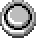
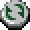

## Overview

Traps are dungeon objects that trigger when stepped on, and have a wide variety of effects. 
The effect also differs based on what caused it to trigger. (Shiren, monster, or an item landing on the trap)

See Gen's Turf for information about Trapper Status.

## Trap List

Traps are listed in Item Book order.

<table class="trapTable">
  <tr>
    <th>Name</th>
    <th>Shiren</th>
    <th>Monster</th>
    <th>Item</th>
    <th>Notes</th>
  </tr>
  <tr>
    <td id="wood-arrow"> Wood Arrow</td>
    <td>Wood Arrow flies from the left of the direction Shiren is facing. Deals 4~6 damage.</td>
    <td>Wood Arrow flies from the left of the direction the monster is facing. Deals 4~6 damage.</td>
    <td>Wood Arrow flies from the left of the direction Shiren is facing.</td>
    <td>Arrows from traps have 100% accuracy, and fly until they hit a wall. (Dodger Pot works)</td>
  </tr>
  <tr>
    <td id="iron-arrow"> Iron Arrow</td>
    <td>Iron Arrow flies from the left of the direction Shiren is facing. Deals more damage than Wood Arrow Trap.</td>
    <td>Iron Arrow flies from the left of the direction the monster is facing. Deals more damage than Wood Arrow Trap.</td>
    <td>Iron Arrow flies from the left of the direction Shiren is facing.</td>
    <td>Arrows from traps have 100% accuracy, and fly until they hit a wall. (Dodger Pot works)</td>
  </tr>
  <tr>
    <td id="poison-arrow"> Poison Arrow</td>
    <td>Poison Arrow flies from the left of the direction Shiren is facing. Deals 4~6 damage and decreases strength by 1.</td>
    <td>Poison Arrow flies from the left of the direction the monster is facing. Deals 4~6 damage and inflicts Weakened. ※ Buffs both Scorpions and Mutaikons.</td>
    <td>Poison Arrow flies from the left of the direction Shiren is facing.</td>
    <td>Arrows from traps have 100% accuracy, and fly until they hit a wall. (Dodger Pot works)</td>
  </tr>
  <tr>
    <td id="log-trap"> Log</td>
    <td>Log flies from the direction Shiren is facing, knocking him backward 10 tiles. (4 times max)</td>
    <td>Log flies from the direction the monster is facing, knocking them backward 10 tiles.</td>
    <td>Log flies from the direction Shiren is facing.</td>
    <td>Sweet Nuts don't swallow logs.</td>
  </tr>
  <tr>
    <td id="rockslide-trap"> Rockslide</td>
    <td>Rock falls from above. Deals 16~20 damage.</td>
    <td>Rock falls from above. Deals 16~20 damage.</td>
    <td>Rock falls from above.</td>
    <td>Rock can't be avoided using a Dodger Pot.</td>
  </tr>
  <tr>
    <td id="metal-block-trap"> Metal Block</td>
    <td>Metal falls from above. Deals 32~38 damage.</td>
    <td>Metal falls from above. Deals 32~38 damage.</td>
    <td>Metal falls from above.</td>
    <td>Metal can't be avoided using a Dodger Pot.</td>
  </tr>
  <tr>
    <td id="explosion-trap"> Explosion</td>
    <td>Halves current HP. [Anti-Blast] rune reduces damage to 25%. [Anti-Blast※] rune makes you immune to damage.  Onigiri not in pots will be grilled unless you have [Anti-Blast※].  Any monsters and items caught in the blast vanish.  Instantly collapse if you step on it while you're an Onigiri.</td>
    <td>Trapper: Halves current HP. Become a Grilled Onigiri if they step on it while they're an Onigiri.  Non-Trapper: The monster vanishes. (No experience points)</td>
    <td>The item vanishes.</td>
    <td>Items in a 1 tile radius around the trap vanish, even with Zen effect. Zen can't prevent onigiri from being grilled.</td>
  </tr>
  <tr>
    <td id="big-explosion-trap"> Big Explosion</td>
    <td>Sets current HP to 1. [Anti-Blast] rune reduces damage to 50%. [Anti-Blast※] rune makes you immune to damage.  Onigiri not in pots will be grilled unless you have [Anti-Blast※].  Any monsters and items caught in the blast vanish.  Instantly collapse if you step on it while you're an Onigiri.</td>
    <td>Trapper: Sets current HP to 1. Become a Grilled Onigiri if they step on it while they're an Onigiri.  Non-Trapper: The monster vanishes. (No experience points)</td>
    <td>The item vanishes.</td>
    <td>Items in a 1 tile radius around the trap vanish, even with Zen effect. Zen can't prevent onigiri from being grilled.</td>
  </tr>
  <tr>
    <td id="rust-trap"> Rust</td>
    <td>Decreases equipped weapon and shield upgrade values by 1. [Rustproof] rune protects against this effect.  Extinguishes torches.  Chance for tags to come off when equipment rusts.</td>
    <td>Inflicts Wizened.  Monsters susceptible to Water Pot will have the same effect as getting splashed by water.</td>
    <td>Trap activates.</td>
    <td>See Water Pot. However, scrolls won't get wet and peaches won't ripen.</td>
  </tr>
  <tr>
    <td id="strip-trap"> Strip</td>
    <td>Unequips equipped weapon, shield, and bracelets even if cursed.</td>
    <td>Inflicts Weakened and Wizened statuses.</td>
    <td>Trap activates.</td>
    <td>-</td>
  </tr>
  <tr>
    <td id="trip-trap"> Trip</td>
    <td>Deals 2~3 damage and makes you drop items. Dropped pots can break.  Balance Staff protects you from this effect.</td>
    <td>Deals 2~3 damage.  Zaloklefts, Mixers, and Froggos will drop the item they're carrying.</td>
    <td>Trap activates.</td>
    <td>Each activation while carrying Balance Staff lowers use count by 1.</td>
  </tr>
  <tr>
    <td id="decay-trap"> Decay</td>
    <td>Onigiri and peaches not inside pots instantly rot.  Instantly collapse if you step on it while you're an Onigiri.</td>
    <td>Become a Rotten Onigiri. (No experience points)  Gyazas are immune. (Receives 2 damage)</td>
    <td>Onigiri and peaches become rotten.</td>
    <td>-</td>
  </tr>
  <tr>
    <td id="curse-trap"> Curse</td>
    <td>1 item not inside a pot gets cursed or sealed.  If the selected item is already cursed, it will change to being sealed, and vice versa.</td>
    <td>Inflicts Sealed.  Curse Girls will be Buffed instead.</td>
    <td>Item becomes cursed or sealed.</td>
    <td>-</td>
  </tr>
  <tr>
    <td id="spring-trap"> Spring</td>
    <td>Warps you to a different location on the current floor.</td>
    <td>Warps the monster to a different location on the current floor.</td>
    <td>Warps the item to a different location on the current floor.</td>
    <td>If you land on a trap, the trap will activate.</td>
  </tr>
  <tr>
    <td id="sleep-trap"> Sleep</td>
    <td>Inflicts Asleep.</td>
    <td>Inflicts Asleep.</td>
    <td>Trap activates.</td>
    <td>-</td>
  </tr>
  <tr>
    <td id="blind-trap"> Blind</td>
    <td>Inflicts Blind.</td>
    <td>Inflicts Blind.</td>
    <td>Trap activates.</td>
    <td>-</td>
  </tr>
  <tr>
    <td id="shadow-bind-trap"> Shadow Bind</td>
    <td>Inflicts Shadow Bound.</td>
    <td>Inflicts Shadow Bound.</td>
    <td>Trap activates.</td>
    <td>-</td>
  </tr>
  <tr>
    <td id="spin-trap"> Spin</td>
    <td>Inflicts Confused.</td>
    <td>Inflicts Confused.</td>
    <td>Trap activates.</td>
    <td>-</td>
  </tr>
  <tr>
    <td id="gauge-blind-trap"> Gauge Blind.</td>
    <td>Inflicts Gauge Blind.</td>
    <td>Inflicts Apathetic.</td>
    <td>Trap activates.</td>
    <td>-</td>
  </tr>
  <tr>
    <td id="onigiri-trap"> Onigiri</td>
    <td>Inflicts Onigiri.</td>
    <td>Inflicts Onigiri.  Nigiri Baby monsters will be Buffed instead.</td>
    <td>Trap activates.</td>
    <td>-</td>
  </tr>
  <tr>
    <td id="slow-trap"> Slow</td>
    <td>Slows speed by 1 stage.</td>
    <td>Slows speed by 1 stage.</td>
    <td>Trap activates.</td>
    <td>See Slow status.</td>
  </tr>
  <tr>
    <td id="hunger-trap"> Hunger</td>
    <td>Decreases fullness by 10.</td>
    <td>Inflicts Weakened.  Polygon Spinnas will be Buffed instead.</td>
    <td>Trap activates.</td>
    <td>-</td>
  </tr>
  <tr>
    <td id="summon-trap"> Summon</td>
    <td>Summons 4 monsters within a 1 tile radius.</td>
    <td>Summons 4 monsters within a 1 tile radius.</td>
    <td>Summons 4 monsters within a 1 tile radius.</td>
    <td>Trap breaks after 1 use. Monsters won't appear if entity limit is reached.</td>
  </tr>
  <tr>
    <td id="monster-trap"> Monster</td>
    <td>Items in the room turn into monsters, including merchandise in stores.</td>
    <td>Items in the room turn into monsters, including merchandise in stores.</td>
    <td>Items in the room turn into monsters, including merchandise in stores.</td>
    <td>Trap breaks after 1 use. Monsters won't appear if entity limit is reached.</td>
  </tr>
  <tr>
    <td id="rage-trap"> Rage</td>
    <td>Inflicts Enraged to all monsters in the room.</td>
    <td>Inflicts Enraged to all monsters in the room.</td>
    <td>Trap activates.</td>
    <td>-</td>
  </tr>
  <tr>
    <td id="cure-monster-trap"> Cure Monster</td>
    <td>Cures ailments of all monsters on the floor.</td>
    <td>Cures ailments of all monsters on the floor.</td>
    <td>Cures ailments of all monsters on the floor.</td>
    <td>-</td>
  </tr>
  <tr>
    <td id="multiplication-trap"> Multiplication</td>
    <td>Creates lots of traps on the current floor.</td>
    <td>Creates lots of traps on the current floor.</td>
    <td>Creates lots of traps on the current floor.</td>
    <td>Trap breaks after 1 use.</td>
  </tr>
  <tr>
    <td id="time-switch-trap"> Time Switch</td>
    <td>Switches day to night, or night to day.</td>
    <td>Switches day to night, or night to day.</td>
    <td>Switches day to night, or night to day.</td>
    <td>Trap breaks after 1 use. Exclusive to Old Road.</td>
  </tr>
  <tr>
    <td id="pit-trap"> Pit</td>
    <td>Fall to the next floor if the dungeon has descending stairs. Deals 6~8 damage.</td>
    <td>The monster vanishes. (No experience points)</td>
    <td>The item vanishes.</td>
    <td>-</td>
  </tr>
  <tr>
    <td id="floor-warp-trap"> Floor Warp</td>
    <td>Warps you somewhere between 3~5 floors.</td>
    <td>The monster vanishes. (No experience points)</td>
    <td>The item vanishes.</td>
    <td>-</td>
  </tr>
  <tr>
    <td id="stairs-trap"> Stairs?</td>
    <td>Turns into a different trap and activates.</td>
    <td>Doesn't activate.</td>
    <td>Doesn't activate. (Item lands next to it)</td>
    <td>-</td>
  </tr>
  <tr>
    <td id="duelist-trap"> Duelist</td>
    <td>Nothing happens.</td>
    <td>Inflicts Dueling.</td>
    <td>Trap activates.</td>
    <td>Duelist traps set by Shiren will break after a single use.</td>
  </tr>
  <tr>
    <td id="point-switch"> Point Switch</td>
    <td>Adds points to Point Card if it's in your inventory.</td>
    <td>No effect.</td>
    <td>Trap activates.</td>
    <td>Trap breaks after 1 use. Point gain varies by location. (10~220)</td>
  </tr>
</table>
