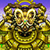

Trophies are another form of achievements besides <a href="/system/adventure-footprints">Adventure Footprints</a>. 
→ <a href="https://steamcommunity.com/stats/1178790/achievements">Steam Achievements Page</a>

## Steam / PS Vita

<table class="trophyTable">
  <tr>
    <th>Image</th>
    <th>Rank</th>
    <th>Trophy</th>
  </tr>
  <tr>
    <td class="trophyImageTd"></td>
    <td class="highlightPlatinum">Platinum</td>
    <td>Wanderer You unlocked all trophies!</td>
  </tr>
  <tr>
    <td class="trophyImageTd"></td>
    <td class="highlightBronze">Bronze</td>
    <td>First Step You arrived at Nekomaneki Village.</td>
  </tr>
  <tr>
    <td class="trophyImageTd"></td>
    <td class="highlightBronze">Bronze</td>
    <td>Dice Bag You collected 3 Dice of Fate.</td>
  </tr>
  <tr>
    <td class="trophyImageTd"></td>
    <td class="highlightBronze">Bronze</td>
    <td>Reeva Statue Defeated You beat the Reeva Statue.</td>
  </tr>
  <tr>
    <td class="trophyImageTd"></td>
    <td class="highlightSilver">Silver</td>
    <td>Great Reeva Statue Crushed You defeated the Great Reeva Statue.</td>
  </tr>
  <tr>
    <td class="trophyImageTd"></td>
    <td class="highlightSilver">Silver</td>
    <td>Defeat Gendolucika You have defeated Gendolucika.</td>
  </tr>
  <tr>
    <td class="trophyImageTd"></td>
    <td class="highlightSilver">Silver</td>
    <td>Tower of Fortune Passport Stamp You have conquered the Tower of Fortune.</td>
  </tr>
  <tr>
    <td class="trophyImageTd"></td>
    <td class="highlightSilver">Silver</td>
    <td>Inori Cave Tourist You have conquered Inori Cave.</td>
  </tr>
  <tr>
    <td class="trophyImageTd"></td>
    <td class="highlightGold">Gold</td>
    <td>Primordial Chasm Visitor You have conquered the Primordial Chasm.</td>
  </tr>
  <tr>
    <td class="trophyImageTd"></td>
    <td class="highlightSilver">Silver</td>
    <td>Destiny's Descender You have conquered Destiny's Descent.</td>
  </tr>
  <tr>
    <td class="trophyImageTd"></td>
    <td class="highlightBronze">Bronze</td>
    <td>Bizarre Tower Ascender You have conquered the Bizarre Tower.</td>
  </tr>
  <tr>
    <td class="trophyImageTd"></td>
    <td class="highlightBronze">Bronze</td>
    <td>Onigiri Hollow Journeyer You have conquered Onigiri Hollow.</td>
  </tr>
  <tr>
    <td class="trophyImageTd"></td>
    <td class="highlightBronze">Bronze</td>
    <td>Pitfall of Life Voyager You have conquered the Pitfall of Life.</td>
  </tr>
  <tr>
    <td class="trophyImageTd"></td>
    <td class="highlightBronze">Bronze</td>
    <td>Heavenly Lake Wayfarer You have conquered Heavenly Lake.</td>
  </tr>
  <tr>
    <td class="trophyImageTd"></td>
    <td class="highlightBronze">Bronze</td>
    <td>Old Road Traveler You have conquered Old Road.</td>
  </tr>
  <tr>
    <td class="trophyImageTd"></td>
    <td class="highlightBronze">Bronze</td>
    <td>Passerby of Gen's Turf You have conquered Gen's Turf.</td>
  </tr>
  <tr>
    <td class="trophyImageTd"></td>
    <td class="highlightBronze">Bronze</td>
    <td>Lost Well Spelunker You have conquered the Lost Well.</td>
  </tr>
  <tr>
    <td class="trophyImageTd"></td>
    <td class="highlightBronze">Bronze</td>
    <td>Explosion Rocks Conqueror You've beaten all parts of Explosion Rocks!</td>
  </tr>
  <tr>
    <td class="trophyImageTd"></td>
    <td class="highlightBronze">Bronze</td>
    <td>Underground Manor Victor You've beaten all of the Underground Manor!</td>
  </tr>
  <tr>
    <td class="trophyImageTd"></td>
    <td class="highlightBronze">Bronze</td>
    <td>Statue Cave Subduer You have conquered the Statue Cave.</td>
  </tr>
  <tr>
    <td class="trophyImageTd"></td>
    <td class="highlightBronze">Bronze</td>
    <td>Hunter Pond Traverser You have conquered Hunter Pond.</td>
  </tr>
  <tr>
    <td class="trophyImageTd"></td>
    <td class="highlightBronze">Bronze</td>
    <td>Warning Valley Voyager You have conquered Warning Valley.</td>
  </tr>
  <tr>
    <td class="trophyImageTd"></td>
    <td class="highlightBronze">Bronze</td>
    <td>Arms Amasser You unlocked all weapons in the Item Book.</td>
  </tr>
  <tr>
    <td class="trophyImageTd"></td>
    <td class="highlightBronze">Bronze</td>
    <td>Shield Stocker You unlocked all shields in the Item Book.</td>
  </tr>
  <tr>
    <td class="trophyImageTd"></td>
    <td class="highlightBronze">Bronze</td>
    <td>Armband Aggregator You unlocked all bracelets in the Item Book.</td>
  </tr>
  <tr>
    <td class="trophyImageTd"></td>
    <td class="highlightBronze">Bronze</td>
    <td>Arrow Accumulator You unlocked all arrows in the Item Book.</td>
  </tr>
  <tr>
    <td class="trophyImageTd"></td>
    <td class="highlightBronze">Bronze</td>
    <td>Mineralogist You unlocked all rocks in the Item Book.</td>
  </tr>
  <tr>
    <td class="trophyImageTd"></td>
    <td class="highlightBronze">Bronze</td>
    <td>Gourmand You unlocked all onigiri and peaches in the Item Book.</td>
  </tr>
  <tr>
    <td class="trophyImageTd"></td>
    <td class="highlightBronze">Bronze</td>
    <td>Grazer You unlocked all grass in the Item Book.</td>
  </tr>
  <tr>
    <td class="trophyImageTd"></td>
    <td class="highlightBronze">Bronze</td>
    <td>Determined Researcher You unlocked all scrolls in the Item Book.</td>
  </tr>
  <tr>
    <td class="trophyImageTd"></td>
    <td class="highlightBronze">Bronze</td>
    <td>Staff Affection You unlocked all staves in the Item Book.</td>
  </tr>
  <tr>
    <td class="trophyImageTd"></td>
    <td class="highlightBronze">Bronze</td>
    <td>Talismaniac You unlocked all talismans in the Item Book.</td>
  </tr>
  <tr>
    <td class="trophyImageTd"></td>
    <td class="highlightBronze">Bronze</td>
    <td>Pot Procurer You unlocked all pots in the Item Book.</td>
  </tr>
  <tr>
    <td class="trophyImageTd"></td>
    <td class="highlightGold">Gold</td>
    <td>True Shiren Fan You filled every entry in the Item Book.</td>
  </tr>
  <tr>
    <td class="trophyImageTd"></td>
    <td class="highlightSilver">Silver</td>
    <td>Shiren, Monster Professor You filled every entry in the Monster Book.</td>
  </tr>
  <tr>
    <td class="trophyImageTd"></td>
    <td class="highlightBronze">Bronze</td>
    <td>Larcenous Tendencies You successfully stole an item.</td>
  </tr>
  <tr>
    <td class="trophyImageTd"></td>
    <td class="highlightBronze">Bronze</td>
    <td>First Responder You successfully rescued someone.</td>
  </tr>
  <tr>
    <td class="trophyImageTd"></td>
    <td class="highlightBronze">Bronze</td>
    <td>Shiren Shiren Evolution You have awakened and become Super Shiren.</td>
  </tr>
  <tr>
    <td class="trophyImageTd"></td>
    <td class="highlightBronze">Bronze</td>
    <td>Night Master You learned all abilities.</td>
  </tr>
  <tr>
    <td class="trophyImageTd"></td>
    <td class="highlightBronze">Bronze</td>
    <td>Gitan Leverages Everything Around Me You filled the bank with your Gitan.</td>
  </tr>
  <tr>
    <td class="trophyImageTd"></td>
    <td class="highlightBronze">Bronze</td>
    <td>Dreams Come True You gathered all Lucky Cats and had a wish granted.</td>
  </tr>
  <tr>
    <td class="trophyImageTd"></td>
    <td class="highlightBronze">Bronze</td>
    <td>Pot, Where Art Thou? You threw a Synthesis Pot with a certain bracelet equipped.</td>
  </tr>
  <tr>
    <td class="trophyImageTd"></td>
    <td class="highlightBronze">Bronze</td>
    <td>Unlucky You were defeated by your ally.</td>
  </tr>
  <tr>
    <td class="trophyImageTd"></td>
    <td class="highlightBronze">Bronze</td>
    <td>Caught Red-Handed You failed a steal attempt.</td>
  </tr>
  <tr>
    <td class="trophyImageTd"></td>
    <td class="highlightBronze">Bronze</td>
    <td>Keep Calm and Carry On You were KOed while you were Level 1.</td>
  </tr>
  <tr>
    <td class="trophyImageTd"></td>
    <td class="highlightBronze">Bronze</td>
    <td>Overstayed Your Welcome You were returned to the village by a gust.</td>
  </tr>
  <tr>
    <td class="trophyImageTd"></td>
    <td class="highlightBronze">Bronze</td>
    <td>Monster HOUUUUUUSE! You were thrown into a monster house.</td>
  </tr>
  <tr>
    <td class="trophyImageTd"></td>
    <td class="highlightBronze">Bronze</td>
    <td>Lesson Learned You threw a weapon or shield at a sleeping Mixer monster.</td>
  </tr>
  <tr>
    <td class="trophyImageTd"></td>
    <td class="highlightBronze">Bronze</td>
    <td>Tomorrow is Another Day You consumed a Super Unlucky Seed.</td>
  </tr>
  <tr>
    <td class="trophyImageTd"></td>
    <td class="highlightBronze">Bronze</td>
    <td>Shatter You tripped and broke a pot.</td>
  </tr>
  <tr>
    <td class="trophyImageTd"></td>
    <td class="highlightBronze">Bronze</td>
    <td>Grilled to Perfection! You grilled an onigiri.</td>
  </tr>
  <tr>
    <td class="trophyImageTd"></td>
    <td class="highlightBronze">Bronze</td>
    <td>Expired A peach rotted.</td>
  </tr>
  <tr>
    <td class="trophyImageTd"></td>
    <td class="highlightBronze">Bronze</td>
    <td>You Felt Lucky, Punk You got the multiplier of a Sweet-Nut monster to 1024x.</td>
  </tr>
  <tr>
    <td class="trophyImageTd"></td>
    <td class="highlightBronze">Bronze</td>
    <td>Unidentified Object You defeated FO-Uβ with direct attacks.</td>
  </tr>
  <tr>
    <td class="trophyImageTd"></td>
    <td class="highlightBronze">Bronze</td>
    <td>Demon Hunter You defeated a Maneater.</td>
  </tr>
</table>
