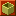

# Overview

There are 4 villages in the game, each with their own NPCs and facilities. 
※ Check the individual dungeon pages for information on unlocking dungeons.

<ul class="quickLinksUL">
  <li>
    <a href="#inori-village">Inori Village</a>
    <ul>
      <li><a href="#beginner-house">Beginner House</a></li>
    </ul>
  </li>
  <li>
    <a href="#nekomaneki-village">Nekomaneki Village</a>
    <ul>
      <li><a href="#nekomaneki-shop">Item Shop</a></li>
      <li><a href="#bank">Bank</a></li>
      <li><a href="#nekomaneki-storehouse">Storehouse</a></li>
      <li><a href="#nekomaneki-warehouse">Warehouse</a></li>
      <li><a href="#lot-shop">Lot Shop</a></li>
      <li><a href="#secret-pots">Secret Pots</a></li>
      <li><a href="#tanuki-passwords">Tanuki Passwords</a></li>
      <li><a href="#ability-library">Ability Library</a></li>
      <li><a href="#rescue-branch">Rescue Branch</a></li>
      <li><a href="#point-shop">Point Shop</a></li>
      <li><a href="#license-shop">License Shop</a></li>
      <li><a href="#curse-breaker">Curse Breaker</a></li>
      <li><a href="#dungeon-center">Dungeon Center</a></li>
      <li><a href="#sparrow's-shuttle">Sparrow's Shuttle</a></li>
      <li><a href="#decchi">Decchi</a></li>
      <li><a href="#superspy-daisaku">Superspy Daisaku</a></li>
    </ul>
  </li>
  <li><a href="#tower-of-fortune-entrance">Tower of Fortune Entrance</a></li>
  <li>
    <a href="#hermits-hermitage">Hermit's Hermitage</a>
    <ul>
      <li><a href="#hermit-inn">Inn</a></li>
      <li><a href="#hermit-shop">Item Shop</a></li>
      <li><a href="#blacksmith">Blacksmith</a></li>
      <li><a href="#sentry">Sentry</a></li>
      <li><a href="#hermit-warehouse">Warehouse</a></li>
      <li><a href="#training-hermit">Training Hermit's House</a></li>
    </ul>
  </li>
  <li>
    <a href="#sparrow's-inn">Sparrow's Inn</a>
    <ul>
      <li><a href="#sparrow-inn">Inn</a></li>
      <li><a href="#sparrow-shop">Item Shop</a></li>
      <li><a href="#sparrow-warehouse">Warehouse</a></li>
    </ul>
  </li>
</ul>

# Inori Village

<table class="locationTable">
  <tr>
    <td rowspan="4" class="highlightPink">Inori Village</td>
    <td rowspan="4">Ouma Shrine</td>
    <td rowspan="4">Nekomaneki Village</td>
    <td colspan="5">Destiny Trail</td>
    <td colspan="9">Tower of Fortune</td>
    <td rowspan="4">Hermit's Hermitage</td>
  </tr>
  <tr>
    <td rowspan="3">1F</td>
    <td rowspan="3">2F</td>
    <td rowspan="3">3F</td>
    <td rowspan="3">4F</td>
    <td rowspan="3">5F</td>
    <td rowspan="3">Entrance</td>
    <td class="leftText">→ Past</td>
    <td>1F</td>
    <td>2F</td>
    <td>3F</td>
    <td>4F</td>
    <td>5F</td>
    <td>6F</td>
    <td>7F</td>
  </tr>
  <tr>
    <td class="leftText">→ Present</td>
    <td>1F</td>
    <td>2F</td>
    <td>3F</td>
    <td>4F</td>
    <td>5F</td>
    <td>6F</td>
    <td>7F</td>
  </tr>
  <tr>
    <td class="leftText">→ Future</td>
    <td>1F</td>
    <td>2F</td>
    <td>3F</td>
    <td>4F</td>
    <td>5F</td>
    <td>6F</td>
    <td>7F</td>
  </tr>
</table>

  

 

- Become <a href="/shiren-5/system/allies#kojirouta">Kojirouta</a>'s servant to set the flag for him to join you as an ally.
- Dungeons: <a href="/shiren-5/dungeons/ouma-shrine">Ouma Shrine</a>, <a href="/shiren-5/dungeons/inori-cave">Inori Cave</a>, <a href="/shiren-5/dungeons/pitfall-of-life">Pitfall of Life</a>, <a href="/shiren-5/dungeons/onigiri-hollow">Onigiri Hollow</a>, <a href="/shiren-5/dungeons/old-road">Old Road</a>

Field

- If you lose a weapon or shield, check the field here to see if you can reclaim it.

 

  

  Beginner House 

- Offers training facilities to help you learn how to play the game.
    - <a href="/shiren-5/dungeons/training-facility">Training Facility</a>, <a href="/shiren-5/dungeons/night-training-facility">Night Training Facility</a>

 

# Nekomaneki Village

<table class="locationTable">
  <tr>
    <td rowspan="4">Inori Village</td>
    <td rowspan="4">Ouma Shrine</td>
    <td rowspan="4" class="highlightPink">Nekomaneki Village</td>
    <td colspan="5">Destiny Trail</td>
    <td colspan="9">Tower of Fortune</td>
    <td rowspan="4">Hermit's Hermitage</td>
  </tr>
  <tr>
    <td rowspan="3">1F</td>
    <td rowspan="3">2F</td>
    <td rowspan="3">3F</td>
    <td rowspan="3">4F</td>
    <td rowspan="3">5F</td>
    <td rowspan="3">Entrance</td>
    <td class="leftText">→ Past</td>
    <td>1F</td>
    <td>2F</td>
    <td>3F</td>
    <td>4F</td>
    <td>5F</td>
    <td>6F</td>
    <td>7F</td>
  </tr>
  <tr>
    <td class="leftText">→ Present</td>
    <td>1F</td>
    <td>2F</td>
    <td>3F</td>
    <td>4F</td>
    <td>5F</td>
    <td>6F</td>
    <td>7F</td>
  </tr>
  <tr>
    <td class="leftText">→ Future</td>
    <td>1F</td>
    <td>2F</td>
    <td>3F</td>
    <td>4F</td>
    <td>5F</td>
    <td>6F</td>
    <td>7F</td>
  </tr>
</table>

  

 

- Main village of the game, and you'll be returned here if you collapse.
- Give catnip juice to <a href="/shiren-5/system/allies#gen">Gen</a> to have him join you as an ally.
    - Catnip Juice is obtained in Inori Village after reaching Hermit's Hermitage.
- Dungeons: <a href="/shiren-5/dungeons/destiny-trail">Destiny Trail</a>, <a href="/shiren-5/dungeons/gens-turf">Gen's Turf</a>, <a href="/shiren-5/dungeons/heavenly-lake">Heavenly Lake</a>

  Item Shop 

- Items for sale change after clearing the main story.

 

<table class="itemDetailsTable">
  <tr>
    <th colspan="8">Hotel Nekomaneki</th>
  </tr>
  <tr>
    <th>Item</th>
    <th>Price</th>
    <th>Item</th>
    <th>Price</th>
    <th>Item</th>
    <th>Price</th>
  </tr>
  <tr>
    <td class="highlightYellow">Beast Fang</td>
    <td>1600</td>
    <td class="highlightYellow">Navigation Scroll</td>
    <td>100</td>
    <td class="highlightYellow">Herb</td>
    <td>50</td>
  </tr>
  <tr>
    <td class="highlightYellow">Dotanuki</td>
    <td>2200</td>
    <td class="highlightYellow">Identify Scroll</td>
    <td>200</td>
    <td class="highlightYellow">Otogiriso</td>
    <td>100</td>
  </tr>
  <tr>
    <td class="highlightYellow">Rusty Pickaxe</td>
    <td>1000</td>
    <td class="highlightYellow">Exorcism Scroll</td>
    <td>500</td>
    <td class="highlightYellow">Swift Grass</td>
    <td>300</td>
  </tr>
  <tr>
    <td class="highlightYellow">Wolfshead</td>
    <td>1800</td>
    <td class="highlightYellow">Confusion Scroll</td>
    <td>1000</td>
    <td class="highlightYellow">Upgrade Seed</td>
    <td>300</td>
  </tr>
  <tr>
    <td class="highlightYellow">Beast Shield</td>
    <td>2400</td>
    <td class="highlightYellow">Vacuum Slash Scrl</td>
    <td>1000</td>
    <td class="highlightYellow">Strength Grass</td>
    <td>500</td>
  </tr>
  <tr>
    <td class="highlightYellow">Hard Peach</td>
    <td>200</td>
    <td class="highlightYellow">Fear Scroll</td>
    <td>1000</td>
    <td class="highlightYellow">Dragon Grass</td>
    <td>500</td>
  </tr>
  <tr>
    <td class="highlightYellow">Peach</td>
    <td>400</td>
    <td class="highlightYellow">Slumber Scroll</td>
    <td>1000</td>
    <td class="highlightYellow">Revival Grass</td>
    <td>1000</td>
  </tr>
  <tr>
    <td class="highlightYellow">Juicy Peach</td>
    <td>600</td>
    <td class="highlightYellow">Immunity Scroll</td>
    <td>1000</td>
    <td class="highlightYellow">Swap Staff [N]</td>
    <td>600+30N</td>
  </tr>
  <tr>
    <td></td>
    <td></td>
    <td></td>
    <td></td>
    <td class="highlightYellow">Knockback Staff [N]</td>
    <td>600+30N</td>
  </tr>
</table>

  Bank 

<table class="itemDetailsTable">
  <tr>
    <th>Savings</th>
    <th>Reward</th>
  </tr>
  <tr>
    <td>(First use)</td>
    <td>Revival Grass</td>
  </tr>
  <tr>
    <td>5,000</td>
    <td>Undo Grass</td>
  </tr>
  <tr>
    <td>10,000</td>
    <td>Blank Scroll</td>
  </tr>
  <tr>
    <td>50,000</td>
    <td>Item Detector</td>
  </tr>
  <tr>
    <td>100,000</td>
    <td>Fuuma Shield</td>
  </tr>
  <tr>
    <td>500,000</td>
    <td>Identify Bracelet</td>
  </tr>
  <tr>
    <td>1,000,000</td>
    <td>Anti-Crs. Bracelet</td>
  </tr>
  <tr>
    <td>99,999,999</td>
    <td>Fuuma Sword</td>
  </tr>
</table>

  Storehouse 

- Deposit and withdraw up to 80 items.
    - Use Preservation Pots to increase storage space.

  Warehouse 

- Leave items on the ground to store them.
- Dungeon gameplay mode inside the warehouse.
- 25 tiles total. (5x5)

  Lot Shop 

- See <a href="/shiren-5/system/lottery">Ponta's Lottery</a>.

  Secret Pots 

- See <a href="/shiren-5/items/new-items">New Items</a>.

  Tanuki Passwords 

- See <a href="/shiren-5/system/tanuki-passwords">Tanuki Passwords</a>.

  Ability Library 

- Organize <a href="/shiren-5/system/necklace-abilities">Necklace Abilities</a>.

  Rescue Branch 

- See <a href="/shiren-5/system/wanderer-rescue">Wanderer Rescue</a>.

  Point Shop 

- Obtain a Point Card from the Pointman after viewing the Lot Shop event.
    - Lot Shop is located in the basement of Hotel Nekomaneki.
- Step on Point Switches while carrying a Point Card to collect points.
    - Sealed or inside a pot = no points, blessed = double points.
- If you lose the Point Card, you can have it reissued for 1,000 Gitan.
    - Points you collected won't reset if you lose the card.
- Points reset to 0 if you end the game without suspending properly.

 

<table class="itemDetailsTable">
  <tr>
    <th>Item</th>
    <th>Points</th>
  </tr>
  <tr>
    <td>Revival Grass</td>
    <td>30</td>
  </tr>
  <tr>
    <td>Recommend. Letter</td>
    <td>50</td>
  </tr>
  <tr>
    <td>Undo Grass</td>
    <td>70</td>
  </tr>
  <tr>
    <td>Preservation Pot [5]</td>
    <td>100</td>
  </tr>
  <tr>
    <td>Blank Scroll</td>
    <td>200</td>
  </tr>
  <tr>
    <td>Synthesis Pot [5]</td>
    <td>400</td>
  </tr>
  <tr>
    <td>Explosion Bracelet</td>
    <td>3000</td>
  </tr>
  <tr>
    <td>Scout Bracelet</td>
    <td>10000</td>
  </tr>
</table>

  License Shop 

- Purchase <a href="/shiren-5/items/other-items#friendship-license">Friendship Licenses</a>.

  Curse Breaker 

- Removes curses and seals from all items not in pots for 500 Gitan.

  Dungeon Center 

- Talk to NPCs to access a variety of dungeons.
    - <a href="/shiren-5/dungeons/explosion-rocks">Explosion Rocks</a>, <a href="/shiren-5/dungeons/statue-cave">Statue Cave</a>, <a href="/shiren-5/dungeons/underground-manor">Underground Manor</a>, PS Vita/Switch/Steam

  Sparrow's Shuttle 

- Lets you instantly travel to places you've been to before.
    - Unlocked when you reach <a href="#sparrow's-inn">Sparrow's Inn</a>.

 

<table class="itemDetailsTable">
  <tr>
    <th>Page 1</th>
    <th>Page 2</th>
    <th>Page 3</th>
  </tr>
  <tr>
    <td>Tower of Fortune Entr.</td>
    <td>Onigiri Hollow</td>
    <td>Old Road</td>
  </tr>
  <tr>
    <td>Hermit's Hermitage</td>
    <td>Primordial Chasm</td>
    <td></td>
  </tr>
  <tr>
    <td>Sparrow's Inn</td>
    <td>Heavenly Lake</td>
    <td></td>
  </tr>
  <tr>
    <td>Pitfall of Life</td>
    <td>Inori Cave</td>
    <td></td>
  </tr>
  <tr>
    <td>Lost Well</td>
    <td>Destiny's Descent</td>
    <td></td>
  </tr>
  <tr>
    <td>Bizarre Tower</td>
    <td>Gen's Turf</td>
    <td></td>
  </tr>
</table>

  Decchi

- NPC side quest that rewards you with items and unlocks a post-game dungeon.
    - See <a href="/shiren-5/dungeons/onigiri-hollow">Onigiri Hollow</a> for details.

  Superspy Daisaku

- NPC who tells you a secret tip when you feed him 200 fullness worth of food.

　Secret Tips

- Koji-what's-his-name wants to climb the Tower of Fortune.
    - Bring <a href="/shiren-5/system/allies#kojirouta">Kojirouta</a> to the top of Tower of Miracles to unlock <a href="/shiren-5/dungeons/pitfall-of-life">Pitfall of Life</a>.
- The girl with the panda hat wants to get to the top of the Tower of Fortune.
    - Bring <a href="/shiren-5/system/allies#tao">Tao</a> to the top of Tower of Miracles to unlock <a href="/shiren-5/dungeons/bizarre-tower">Bizarre Tower</a>.
- Throw Antidote Grass at Scorpions to deal damage.
- Throw Antidote Grass at Mutaikons to deal damage.
- Throw Exorcism Scroll at Curse Girls to deal damage.
- Throw Imabikiso at Curse Girls to level them up.
- Bright Blade and Day Shield resonate.
- Breeze Blade and Midnight Shield resonate.
    - "Kamaitachi no Yoru" reference.
- Counter Shield and Strength Bracelet resonate.
- Violent Blade and Mojo Bracelet resonate.
- Throw Stomach Expander at Mixers to increase the number of items they can swallow.
- You can synthesize an Upgrade Pot with a weapon or shield using Mixers.
- Synthesize a weapon, Heal Pot, and Heal Bracelet to create the Healing rune.
- Hit 5 monsters lined up in a straight line with an ability to heal HP.
- There are 2 people hiding amazing treasure in Nekomaneki Village.
    - David's Bullet and Shrine Maid. Pot - wish for them inside <a href="/shiren-5/dungeons/inori-cave">Inori Cave</a>.
- Expert badges increase the score for rankings.

 

# Tower Entrance

<table class="locationTable">
  <tr>
    <td rowspan="4">Inori Village</td>
    <td rowspan="4">Ouma Shrine</td>
    <td rowspan="4">Nekomaneki Village</td>
    <td colspan="5">Destiny Trail</td>
    <td colspan="9">Tower of Fortune</td>
    <td rowspan="4">Hermit's Hermitage</td>
  </tr>
  <tr>
    <td rowspan="3">1F</td>
    <td rowspan="3">2F</td>
    <td rowspan="3">3F</td>
    <td rowspan="3">4F</td>
    <td rowspan="3">5F</td>
    <td rowspan="3" class="highlightPink">Entrance</td>
    <td class="leftText">→ Past</td>
    <td>1F</td>
    <td>2F</td>
    <td>3F</td>
    <td>4F</td>
    <td>5F</td>
    <td>6F</td>
    <td>7F</td>
  </tr>
  <tr>
    <td class="leftText">→ Present</td>
    <td>1F</td>
    <td>2F</td>
    <td>3F</td>
    <td>4F</td>
    <td>5F</td>
    <td>6F</td>
    <td>7F</td>
  </tr>
  <tr>
    <td class="leftText">→ Future</td>
    <td>1F</td>
    <td>2F</td>
    <td>3F</td>
    <td>4F</td>
    <td>5F</td>
    <td>6F</td>
    <td>7F</td>
  </tr>
</table>

  

 

- Small overworld area where you can optionally hire <a href="/shiren-5/system/allies#tao">Tao</a> to join you as an ally.
    - 1500 Gitan, or 2000 Gitan if you declined the first time.
- Dungeons: <a href="/shiren-5/dungeons/tower-of-the-past">Tower of the Past</a>, <a href="/shiren-5/dungeons/tower-of-the-present">Tower of the Present</a>, <a href="/shiren-5/dungeons/tower-of-the-future">Tower of the Future</a>, <a href="/shiren-5/dungeons/bizarre-tower">Bizarre Tower</a>, <a href="/shiren-5/dungeons/destinys-descent">Destiny's Descent</a>

 

# Hermit's Hermitage

<table class="locationTable">
  <tr>
    <td rowspan="2" class="highlightPink">Hermit's Hermitage</td>
    <td colspan="14">Tower of Fortune</td>
    <td rowspan="2">Destiny Room</td>
    <td colspan="3">Tower of Miracles</td>
    <td rowspan="2">Sparrow's Inn</td>
    <td colspan="6">Tower of Miracles</td>
    <td rowspan="2">Miracle Alcove</td>
  </tr>
  <tr>
    <td>1F</td>
    <td>2F</td>
    <td>3F</td>
    <td>4F</td>
    <td>5F</td>
    <td>6F</td>
    <td>7F</td>
    <td>8F</td>
    <td>9F</td>
    <td>10F</td>
    <td>11F</td>
    <td>12F</td>
    <td>13F</td>
    <td>14F</td>
    <td>1F</td>
    <td>2F</td>
    <td>3F</td>
    <td>4F</td>
    <td>5F</td>
    <td>6F</td>
    <td>7F</td>
    <td>8F</td>
    <td>9F</td>
  </tr>
</table>

  

 

- First visit unlocks <a href="/shiren-5/system/necklace-abilities">necklace abilities</a> and <a href="/shiren-5/dungeons/night-training-facility">Night Training Facility</a>.
- Dungeons: <a href="/shiren-5/dungeons/tower-of-fortune">Tower of Fortune</a>, <a href="/shiren-5/dungeons/primordial-chasm">Primordial Chasm</a>

  Inn 

- Pay 500 Gitan to fully restore HP, fullness and strength.
    - Occasionally increases max HP, max strength, or max fullness.

  Item Shop 

- The shopkeeper can place a tag on equipment for 3000 Gitan.

 

<table class="itemDetailsTable">
  <tr>
    <th colspan="4">Hermit's Hermitage</th>
  </tr>
  <tr>
    <th>Item</th>
    <th>Price</th>
    <th>Item</th>
    <th>Price</th>
  </tr>
  <tr>
    <td class="highlightYellow">Sealing Keisaku</td>
    <td>3300</td>
    <td class="highlightYellow">Trap Deletion Scrl</td>
    <td>800</td>
  </tr>
  <tr>
    <td class="highlightYellow">Counter Shield</td>
    <td>3000</td>
    <td class="highlightYellow">Escape Scroll</td>
    <td>100</td>
  </tr>
  <tr>
    <td class="highlightYellow">Diet Shield</td>
    <td>5000</td>
    <td class="highlightYellow">Knockback Staff [N]</td>
    <td>600+30N</td>
  </tr>
  <tr>
    <td class="highlightYellow">Fine Torch</td>
    <td>200</td>
    <td class="highlightYellow">Mage Staff [N]</td>
    <td>600+30N</td>
  </tr>
  <tr>
    <td class="highlightYellow">Hard Peach</td>
    <td>200</td>
    <td class="highlightYellow">Swap Staff [N]</td>
    <td>600+30N</td>
  </tr>
  <tr>
    <td class="highlightYellow">Heal Grass</td>
    <td>200</td>
    <td class="highlightYellow">Paralysis Staff [N]</td>
    <td>900+45N</td>
  </tr>
  <tr>
    <td class="highlightYellow">Perception Grass</td>
    <td>300</td>
    <td class="highlightYellow">Seal Staff [N]</td>
    <td>1500+75N</td>
  </tr>
  <tr>
    <td class="highlightYellow">Dragon Grass</td>
    <td>500</td>
    <td class="highlightYellow">N Fear Talisman</td>
    <td>600N</td>
  </tr>
  <tr>
    <td class="highlightYellow">Undo Grass</td>
    <td>1500</td>
    <td class="highlightYellow">N Seal Talisman</td>
    <td>600N</td>
  </tr>
  <tr>
    <td class="highlightYellow">Otogiriso</td>
    <td>100</td>
    <td class="highlightYellow">Heal Pot [N]</td>
    <td>3500+175N</td>
  </tr>
  <tr>
    <td class="highlightYellow">Vacuum Slash Scrl</td>
    <td>1000</td>
    <td class="highlightYellow">Synthesis Pot [5]</td>
    <td>7500</td>
  </tr>
  <tr>
    <td class="highlightYellow">Fear Scroll</td>
    <td>800</td>
    <td class="highlightYellow">Preservation Pot [N]</td>
    <td>600+30N</td>
  </tr>
</table>

  Blacksmith 

- Give the Blacksmith a <a href="/shiren-5/items/food#juicy-peach">Juicy Peach</a> to unlock his services.
    - Each service can only be performed once per adventure.
- Upgrade: 1000 Gitan.
    - Increase weapon or shield upgrade value by 1.
    - Small chance to increase by 3.
- Remove 1 rune: 3000 Gitan.
    - Erase a selected rune.

  Sentry 

- You can pick up tagged items here if you collapse or otherwise lose them.
    - See <a href="/shiren-5/system/gameplay-basics#equipment-tags">Equipment Tags</a> for details.
- Place a tag: 3000 Gitan
- Remove a tag: Free
- Pick up lost items: Varies

  Warehouse 

- Leave items on the ground to store them.
    - Stored bracelets will be unidentified when you return in a later adventure.
- Dungeon gameplay mode inside the warehouse.
- 16 tiles total. (3 x 5 + 1)

  Training Hermit's House

- Side quest where you defeat night monsters to unlock the Staccato Wave <a href="/shiren-5/system/necklace-abilities">ability</a>.
    - Dungeon you defeat the monsters in doesn't matter.
    - Guide a <a href="/shiren-5/system/npcs#sage-1">wandering Sage</a> to Hermit's Hermitage or clear the main story to unlock this side quest.

　Target Monsters

1. Filthy Shagga x 10 : Tower of Fortune 3\~4F
2. Bad Momoseal x 15 : Tower of Fortune 9\~11F
3. Dark Grass Bro x 20 : Tower of Fortune 12\~13F

 

# Sparrow's Inn

<table class="locationTable">
  <tr>
    <td rowspan="2">Hermit's Hermitage</td>
    <td colspan="14">Tower of Fortune</td>
    <td rowspan="2">Destiny Room</td>
    <td colspan="3">Tower of Miracles</td>
    <td rowspan="2" class="highlightPink">Sparrow's Inn</td>
    <td colspan="6">Tower of Miracles</td>
    <td rowspan="2">Miracle Alcove</td>
  </tr>
  <tr>
    <td>1F</td>
    <td>2F</td>
    <td>3F</td>
    <td>4F</td>
    <td>5F</td>
    <td>6F</td>
    <td>7F</td>
    <td>8F</td>
    <td>9F</td>
    <td>10F</td>
    <td>11F</td>
    <td>12F</td>
    <td>13F</td>
    <td>14F</td>
    <td>1F</td>
    <td>2F</td>
    <td>3F</td>
    <td>4F</td>
    <td>5F</td>
    <td>6F</td>
    <td>7F</td>
    <td>8F</td>
    <td>9F</td>
  </tr>
</table>

  

 

- Dungeons: <a href="/shiren-5/dungeons/tower-of-miracles">Tower of Miracles</a>, <a href="/shiren-5/dungeons/lost-well">Lost Well</a>

  Inn 

- Pay 1000 Gitan to fully restore HP, fullness and strength.
    - Occasionally increases max HP, max strength, or max fullness.

  Item Shop 

- The shopkeeper can place a tag on equipment for 3000 Gitan.

 

<table class="itemDetailsTable">
  <tr>
    <th colspan="4">Sparrow's Inn</th>
  </tr>
  <tr>
    <th>Item</th>
    <th>Price</th>
    <th>Item</th>
    <th>Price</th>
  </tr>
  <tr>
    <td class="highlightYellow">Large Onigiri</td>
    <td>300</td>
    <td class="highlightYellow">Knockback Staff [N]</td>
    <td>600+30N</td>
  </tr>
  <tr>
    <td class="highlightYellow">Special Onigiri</td>
    <td>400</td>
    <td class="highlightYellow">Mage Staff</td>
    <td>600+30N</td>
  </tr>
  <tr>
    <td class="highlightYellow">Revival Grass</td>
    <td>1000</td>
    <td class="highlightYellow">Paralysis Staff</td>
    <td>900+45N</td>
  </tr>
  <tr>
    <td class="highlightYellow">Navigation Scroll</td>
    <td>100</td>
    <td class="highlightYellow">Swift Staff</td>
    <td>600+30N</td>
  </tr>
  <tr>
    <td class="highlightYellow">Fear Scroll</td>
    <td>800</td>
    <td class="highlightYellow">N Seal Talisman</td>
    <td>600N</td>
  </tr>
  <tr>
    <td class="highlightYellow">Confusion Scroll</td>
    <td>1000</td>
    <td class="highlightYellow">Shadow Bind Tal.</td>
    <td>600N</td>
  </tr>
  <tr>
    <td class="highlightYellow">Heal Pot [N]</td>
    <td>3500+175N</td>
    <td class="highlightYellow">Slumber Talisman</td>
    <td>600N</td>
  </tr>
  <tr>
    <td class="highlightYellow">Synthesis Pot [5]</td>
    <td>7500</td>
    <td class="highlightYellow"></td>
    <td></td>
  </tr>
</table>

  Warehouse 

- Leave items on the ground to store them.
- Dungeon gameplay mode inside the warehouse.
- 9 tiles total. (3 x 3)
