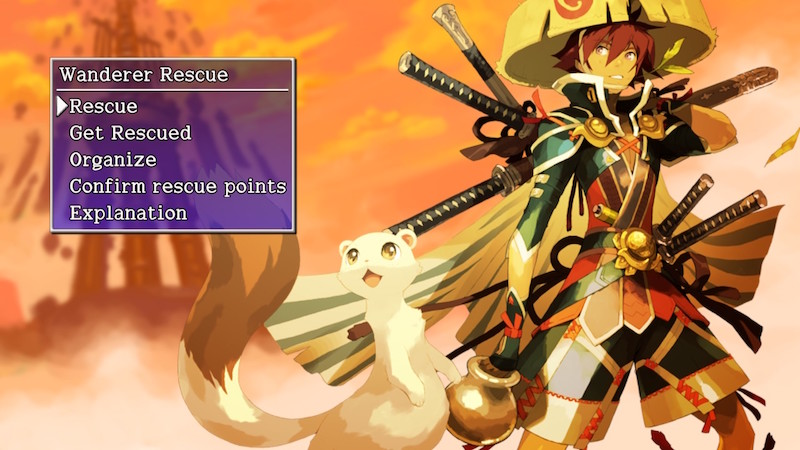

  

# Overview

Wanderer Rescue is a system where you can request help from other players up to 3 times if you collapse. 
Rescue requests are made using the game's servers, or as a password you input manually.

For story dungeons, the rescuer simply has to send a Revival Grass or Undo Grass from Nekomaneki Village. 
Other dungeons require the rescuer to enter and locate the collapsed player inside a dungeon. 
(The dungeon will have the same seed, meaning items, map layout, enemies, etc. will be identical)

Once the collapsed player receives a revival spell, they can continue their adventure without item loss. 
The rescuer will be rewarded with an item, rescue points, and can receive a thank you letter from the other player.

Switch / Steam versions have cross-platform rescues, and aren't region-locked. 
※ Switch / Steam passwords are not compatible with the PS Vita version.

<ul class="quickLinksUL">
  <li><a href="#rescue-flow">Rescue Flow</a></li>
  <li><a href="#requesting">Requesting</a>
    <ul>
      <li><a href="#requirements-(request)">Requirements (Request)</a></li>
      <li><a href="#method-1---internet">Method 1 - Internet</a></li>
      <li><a href="#method-2---password">Method 2 - Password</a></li>
      <li><a href="#wanderer-awaiting-rescue">Wanderer Awaiting Rescue</a></li>
    </ul>
  </li>
  <li><a href="#rescuing">Rescuing</a>
    <ul>
      <li><a href="#requirements-(rescue)">Requirements (Rescue)</a></li>
      <li><a href="#rescue-point-rewards">Rescue Point Rewards</a></li>
      <li><a href="#rescue-tips">Rescue Tips</a></li>
    </ul>
  </li>
</ul>

# Rescue Flow

Most of the rescue process is performed through the main menu.

<ol>
  <li>Request Side : Select "Yes" after collapsing → Get Rescued → Send Rescue Request → Internet or Password</li>
  <li>Rescue Side : Wanderer Rescue → Rescue → Receive Rescue Request</li>
  <li>Rescue Side : Play Game → Talk to the Rescuer inside Hotel Nekomaneki and go on the rescue.</li>
  <li>Rescue Side : Send the revival spell. Wanderer Rescue → Rescue → Send Revival Spell</li>
  <li>Request Side : Receive the revival spell. Get Rescued → Receive/check revival spell</li>
  <li>Request Side : Send a thank you letter. Wanderer Rescue → Get Rescued → Send Thank You Letter</li>
  <li>Rescue Side : Receive the thank you letter. Wanderer Rescue → Rescue → Receive Thank You Letter</li>
</ol>

# Requesting

### Requirements (Request)

- Rescues must be allowed in the dungeon's rules. Not Allowed: Hunter Pond, Rousing Paradise, Aura Ruins, Storm Forest, Perilous Rocks, Trapper's Sandbox, The Pinnacle, Cloister of Certain Doom.

- There must be remaining rescues. You can be rescued up to 3 times - once you've used those up, you'll fail the adventure.

- Thief Mode must not be active. You can't request a rescue if you collapse while in Thief Mode. If a Shopkeeper became hostile without triggering Thief Mode, you can still be rescued.

- You must not be waiting for a rescue / currently attempting a rescue. Requests can't be sent if you collapse while waiting for a rescue, or if you collapse while attempting a rescue.

### Method 1 - Internet

Send a rescue request to the game's server. 
A 12 digit rescue number is displayed once sent, which you can share with others. 
※ The rescue ID will be deleted from the server once fulfilled.

There isn't a "Rescue (Eng), Enter rescue #." option when searching for rescues, so always select "Category (Anyone)" when sending requests via Internet connection.

### Method 2 - Password

Share a rescue request in the form of a 54 character password. 
Less convenient, but the password never expires and works offline.

Often used to share dungeon seeds that have rare items, since it doesn't expire after a successful rescue. 
(See [Rescue Passwords](/guides/rescue-passwords))

### Wanderer Awaiting Rescue

Go on adventures while waiting to be rescued. (Waiting for rescue → Wanderer awaiting rescue)

This can be an excellent way to obtain rare items, especially in PS Vita / Switch / Steam dungeons. 
Sell items between runs by talking to the storehouse manager and selecting organize.

- You can only enter dungeons you've been to before, and only as deep as your personal best depth.
- You can't request a rescue if you collapse.
- Clearing a dungeon won't count toward the leaderboards or adventure footprints.
    - Dungeon Center dungeons will still receive a checkmark, if applicable.

# Rescuing

### Requirements (Rescue)

- The rescue must be in a dungeon you've been to before. The target floor must be less than or equal to your personal best depth.

- You must not be waiting for a rescue. Rescues can't be attempted while you're waiting to be rescued.

### Rescue Point Rewards

<table class="itemDetailsTable">
  <thead>
    <tr>
      <th>Points</th>
      <th>Item</th>
    </tr>
  </thead>
  <tbody>
    <tr>
      <td>1</td>
      <td>Undo Grass</td>
    </tr>
    <tr>
      <td>100</td>
      <td>Hatchet</td>
    </tr>
    <tr>
      <td>1,000</td>
      <td>Anti-Parry Brce.</td>
    </tr>
    <tr>
      <td>10,000</td>
      <td>Kabura Katana</td>
    </tr>
    <tr>
      <td>50,000</td>
      <td>Nirvana Board</td>
    </tr>
  </tbody>
</table>

### Rescue Tips

- The dungeon will have the same seed, meaning items, map layout, enemies, etc. will be identical.
    - This provides a significant advantage if the person who requested shares their notes.
- The target floor is freshly generated, and the collapsed target is always in a Monster House.
- If time of day changes after the Monster House is cleared, new monsters will surround the target.
- It's possible to rescue yourself using a different save file.
- Transient Staff sends the target next to the collapsed target.
- The floor is cleared of enemies when the person who requested receives the revival spell and continues.
    - However, if there's a hostile shopkeeper, they'll still be present.
    - Wandering NPCs like Madam Ateska can change the dungeon RNG.

